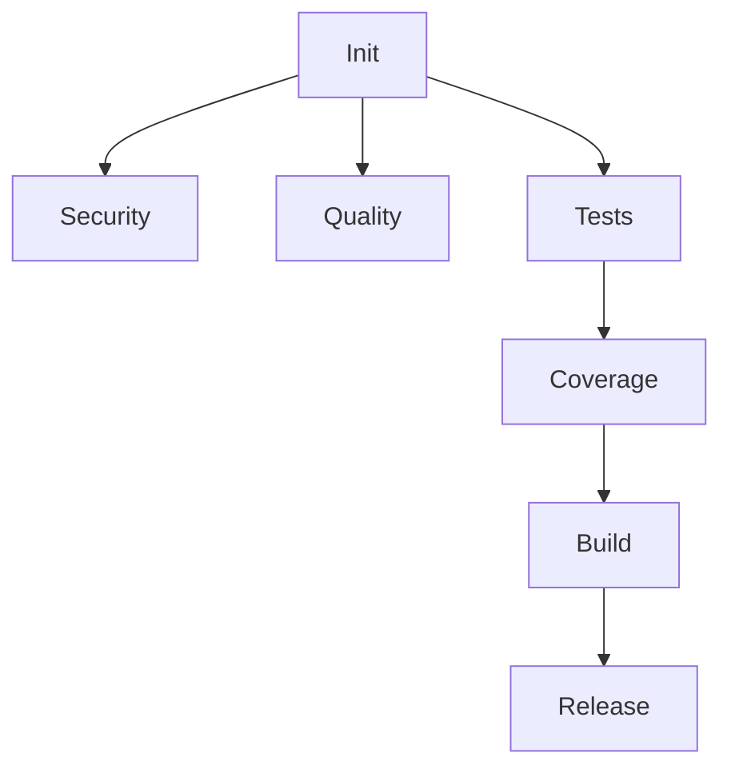

# Codex Deus Ultimate Enhanced - Quick Reference

## 🚀 Quick Start

### Automatic Triggers
```yaml
✅ Push to main/develop
✅ Pull Request opened
✅ Scheduled (daily/weekly)
✅ Manual dispatch
```

### Manual Run
```bash
gh workflow run codex-deus-ultimate-enhanced.yml \
  -f run_phase=all \
  -f use_self_hosted=false
```

## 📊 Performance Metrics

| Metric | Value |
|--------|-------|
| **Runtime** | ~22 min (vs 45 min) |
| **Parallel Jobs** | 5-15 simultaneous |
| **Cost per Run** | $0.20 (self-hosted: $0.10) |
| **Cache Hit Rate** | ~80% |
| **Speed Improvement** | 51% faster |

## 🎯 Job Phases

### Phase 1: Initialization (1 min)
- Detect file changes
- Generate dynamic matrix
- Create cache keys

### Phase 2: Security (10 min, 5 parallel)
- CodeQL Analysis
- Bandit Python Security
- Gitleaks Secret Scan
- Dependency Audit
- Trivy Scanning

### Phase 3: Code Quality (5 min, 4 parallel)
- Ruff Linting
- MyPy Type Check
- ESLint
- ActionLint

### Phase 4: Testing (15 min, matrix)
- Python Tests (multi-version)
- Node Tests (multi-version)
- Integration Tests

### Phase 5: Build (12 min, 3 parallel)
- Python Wheel
- Docker Image
- Platform Builds

### Phase 6: Release (10 min, conditional)
- SBOM Generation
- GitHub Release
- Artifact Signing

## 🔧 Configuration Options

### Workflow Dispatch Inputs

| Input | Type | Default | Description |
|-------|------|---------|-------------|
| `run_phase` | choice | `all` | Security, testing, build, release |
| `skip_tests` | boolean | `false` | Skip test execution |
| `skip_security` | boolean | `false` | Skip security scans |
| `force_release` | boolean | `false` | Force release build |
| `coverage_threshold` | string | `80` | Min coverage % |
| `severity_threshold` | choice | `medium` | Security severity |
| `use_self_hosted` | boolean | `false` | Use self-hosted runners |

### Dynamic Matrix

**Python Changes Detected**:
```yaml
python_versions: ["3.11", "3.12"]
platforms: ["ubuntu-latest"]
```

**Release Build**:
```yaml
python_versions: ["3.11", "3.12"]
platforms: ["ubuntu-latest", "windows-latest", "macos-latest"]
```

**No Python Changes**:
```yaml
python_versions: ["3.12"]
platforms: ["ubuntu-latest"]
```

## 💾 Caching Strategy

### Cache Keys Format
```
{CACHE_VERSION}-{WEEK}-{TYPE}-{VERSION}-{HASH}
v2-2026-W10-pip-3.12-a1b2c3d4
```

### Cached Items
- Python pip packages
- Node npm packages
- pytest cache
- Docker build layers
- Build artifacts

### Cache Rotation
- **Weekly**: Cache keys include week number
- **Manual**: Run cache-cleanup job
- **Automatic**: Scheduled Sunday 5 AM

## 📈 Optimization Features

### 1. Smart Skipping
```yaml
Skip Python tests if no .py files changed
Skip Docker build if no Dockerfile changed
Skip security scans with manual flag
```

### 2. Parallel Execution
```yaml
Security: 5 jobs simultaneous
Quality: 4 jobs simultaneous
Testing: Up to 12 jobs (matrix)
Build: 3 jobs simultaneous
```

### 3. Resource Optimization
```yaml
GitHub-hosted: Standard runners
Self-hosted: Custom infrastructure
Timeout: Job-specific limits
Concurrency: Cancel outdated runs
```

## 🎨 Visualization

### Mermaid DAG (Auto-generated)


### Job Dependency Tree
```
initialization
├── codeql-analysis
├── bandit-security-scan
├── secret-scanning
├── dependency-security
├── trivy-security-scan
├── ruff-linting
├── mypy-type-checking
├── eslint-checking
├── actionlint
├── python-tests
│   └── integration-tests
│       └── coverage-enforcement
│           ├── python-wheel-build
│           │   └── sbom-generation
│           │       └── prepare-release
│           │           └── create-github-release
│           └── docker-build
│               └── trivy-image-scan
└── node-tests
    └── coverage-enforcement
```

## 🔒 Security Features

### Scans Included
✅ CodeQL (Python, JavaScript)  
✅ Bandit (Python)  
✅ Gitleaks (Secrets)  
✅ Trivy (FS, Config, Images)  
✅ pip-audit (Python deps)  
✅ npm audit (Node deps)  
✅ SBOM generation  
✅ SARIF uploads  

### Security Reports
- GitHub Security tab
- Downloadable artifacts
- SARIF format
- JSON results

## 📦 Artifacts Generated

| Artifact | Retention | Size |
|----------|-----------|------|
| Test Results | 7 days | ~5 MB |
| Coverage Reports | 7 days | ~2 MB |
| Security Scans | 7 days | ~10 MB |
| Build Artifacts | 7 days | ~50 MB |
| SBOM | 90 days | ~1 MB |
| Release Archive | 90 days | ~100 MB |

## 🐛 Troubleshooting

### Job Failures

**Security scan failed**:
```bash
# Check severity threshold
severity_threshold: 'high'  # Lower threshold

# Review SARIF results
gh api repos/:owner/:repo/code-scanning/alerts
```

**Test failures**:
```bash
# Download test results
gh run download <run-id> -n pytest-results

# Run locally
pytest -v --tb=short
```

**Cache issues**:
```bash
# Clear cache
gh cache list
gh cache delete <cache-key>

# Disable cache temporarily
# Remove cache: 'pip' from setup-python
```

### Performance Issues

**Slow runs**:
1. Check cache hit rate in logs
2. Verify parallel execution (check job start times)
3. Review job timeouts
4. Consider self-hosted runners

**High costs**:
1. Enable `use_self_hosted: true`
2. Reduce matrix size for non-releases
3. Adjust artifact retention
4. Skip unnecessary scans

## 🎓 Best Practices

### Development
```bash
# Feature branches: Fast feedback
- Python changes only → Skip Node jobs
- Draft PRs → Skip some checks
- Small commits → Faster CI

# Main branch: Full validation
- All security scans
- Full test matrix
- Complete builds
```

### Releases
```bash
# Tag release
git tag -a v1.0.0 -m "Release 1.0.0"
git push origin v1.0.0

# Workflow runs automatically:
✅ Full platform matrix
✅ All security scans
✅ SBOM generation
✅ Artifact signing
✅ GitHub release
```

### Cost Optimization
```bash
# Self-hosted runners
1. Set up runner on your infrastructure
2. Enable in workflow: use_self_hosted: true
3. Save ~60% on runner costs

# Cache optimization
1. Monitor cache hit rates
2. Use specific cache keys
3. Weekly rotation prevents stale caches

# Smart skipping
1. Leverage change detection
2. Skip unnecessary jobs
3. Use draft PRs for WIP
```

## 📞 Support

### Common Commands

```bash
# View workflow runs
gh run list --workflow=codex-deus-ultimate-enhanced.yml

# Watch current run
gh run watch

# Download artifacts
gh run download <run-id>

# Trigger manual run
gh workflow run codex-deus-ultimate-enhanced.yml

# View logs
gh run view <run-id> --log

# Cancel run
gh run cancel <run-id>
```

### Useful Links

- **Workflow File**: `.github/workflows/codex-deus-ultimate-enhanced.yml`
- **Full Documentation**: `CODEX_DEUS_ENHANCED_README.md`
- **Actions Tab**: `https://github.com/owner/repo/actions`
- **Security Tab**: `https://github.com/owner/repo/security`

## 🔄 Version History

| Version | Date | Changes |
|---------|------|---------|
| 2.0.0 | 2026-03-03 | Enhanced with parallel execution, dynamic jobs |
| 1.0.0 | 2026-02-01 | Original monolithic workflow |

---

**Need Help?** Check the full README or open an issue.  
**Performance Issues?** Review the optimization guide.  
**Security Concerns?** Enable all scans and set threshold to 'critical'.
