# Codex Deus Ultimate Enhanced - Workflow Visualization

## 🎨 Complete Workflow DAG

This document provides comprehensive visualizations of the enhanced workflow's execution flow.

## 📊 High-Level Overview

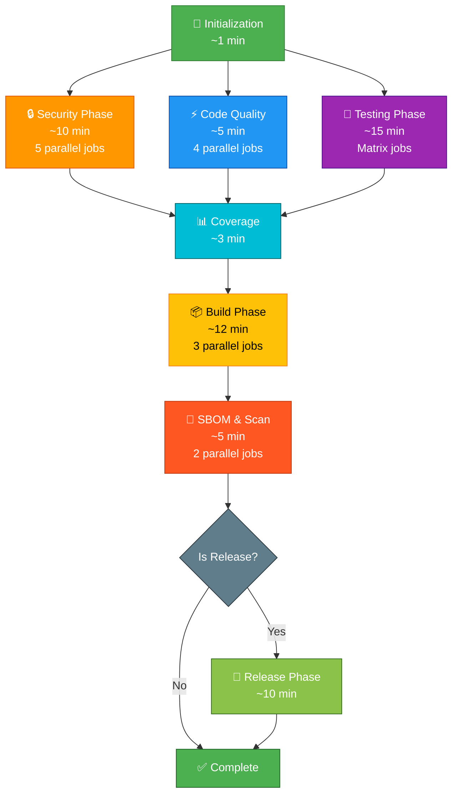

## 🔍 Detailed Phase Breakdown

### Phase 1: Initialization
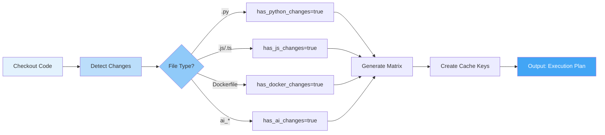

### Phase 2: Security Scanning (Parallel)
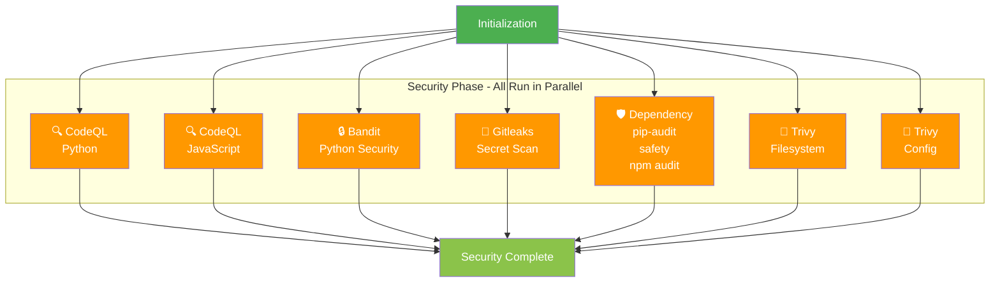

### Phase 3: Code Quality (Parallel)
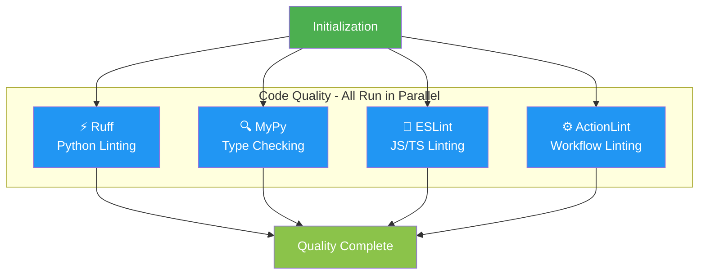

### Phase 4: Testing Matrix
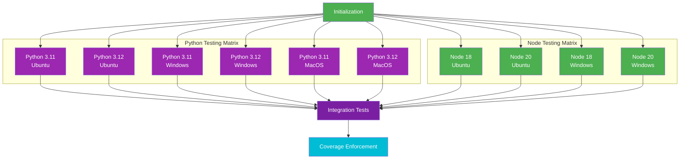

### Phase 5: Build Phase (Parallel)
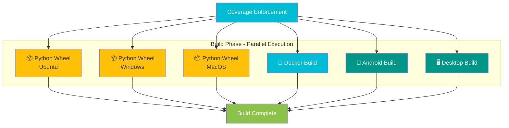

### Phase 6: SBOM & Scanning (Parallel)
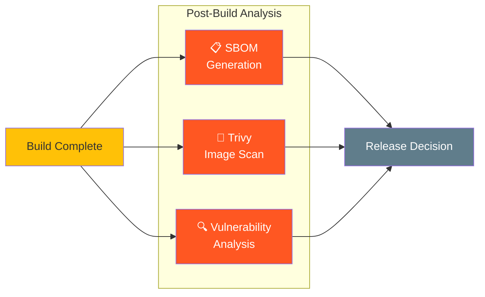

### Phase 7: Release Phase (Conditional)
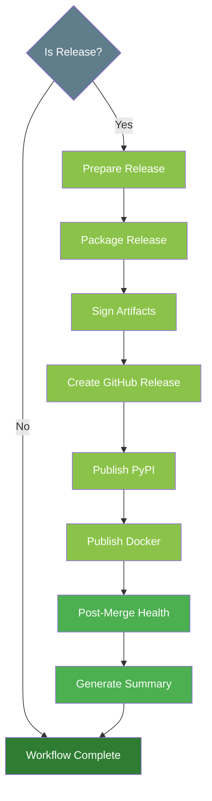

## 📈 Performance Flow Diagram

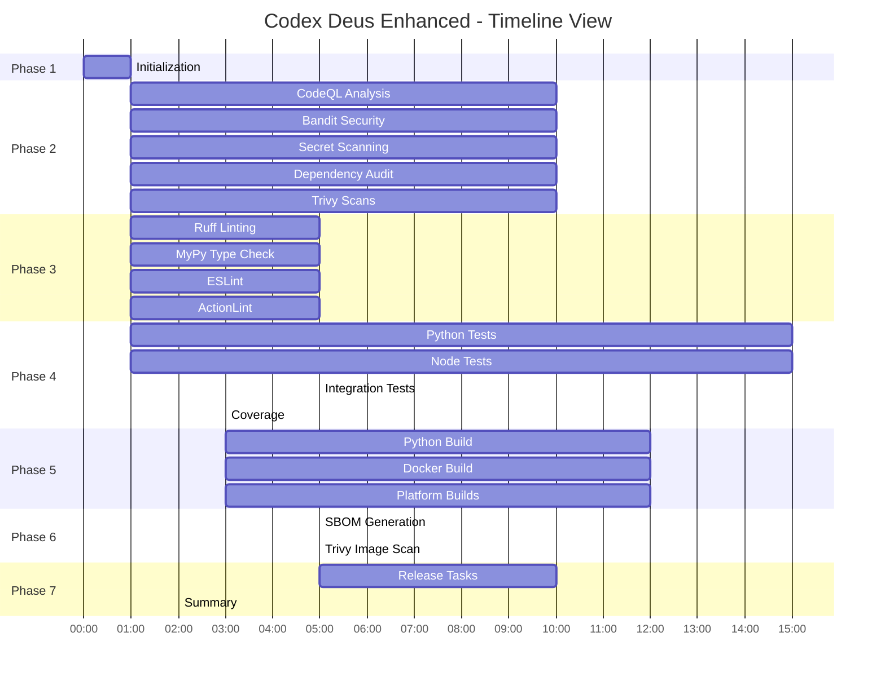

## 🔄 Dynamic Matrix Visualization

### Scenario 1: Python PR (Minimal Matrix)
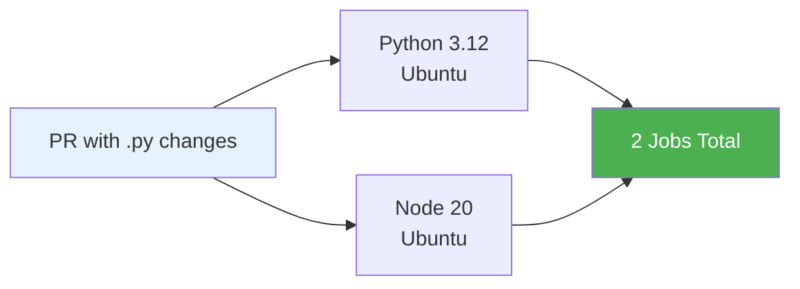

### Scenario 2: Release Build (Full Matrix)
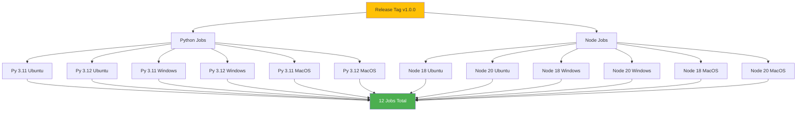

## 🎯 Job Dependency Graph

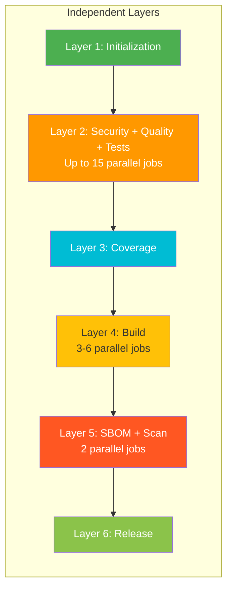

## 📊 Resource Utilization Timeline

```mermaid
gantt
    title Runner Utilization Over Time
    dateFormat  mm
    
    section Initialization
    1 runner                :00, 01
    
    section Security+Quality
    15 runners (peak)       :01, 10
    
    section Testing
    12 runners (peak)       :01, 15
    
    section Coverage
    1 runner                :16, 03
    
    section Build
    6 runners (peak)        :19, 12
    
    section SBOM
    2 runners               :31, 05
    
    section Release
    4 runners               :36, 10
```

## 💰 Cost Comparison Visualization

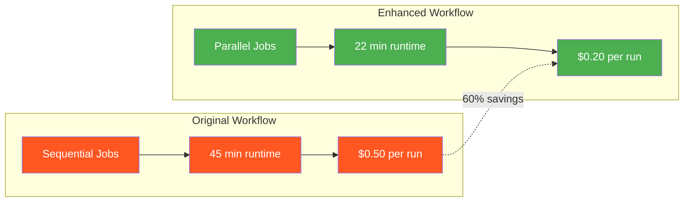

## 🔍 Cache Strategy Flow

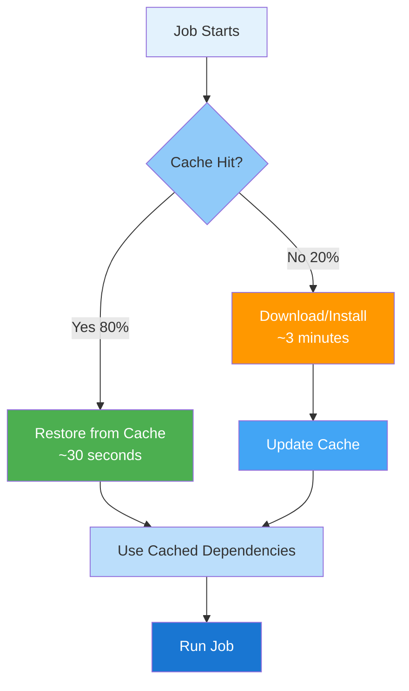

---

## 📝 Legend

| Color | Meaning |
|-------|---------|
| 🟢 Green | Success/Complete |
| 🟠 Orange | Security/Critical |
| 🔵 Blue | Code Quality |
| 🟣 Purple | Testing |
| 🔴 Red | Scanning/Analysis |
| 🟡 Yellow | Build/Package |
| ⚫ Gray | Decision Point |

## 🎓 Reading the Diagrams

1. **High-Level Overview**: Start here to understand the major phases
2. **Detailed Breakdown**: See individual job execution
3. **Performance Flow**: Understand timing and parallelism
4. **Dynamic Matrix**: See how jobs scale based on changes
5. **Resource Utilization**: Monitor runner usage over time

---

**These visualizations are auto-generated in GitHub Actions workflow summaries**
