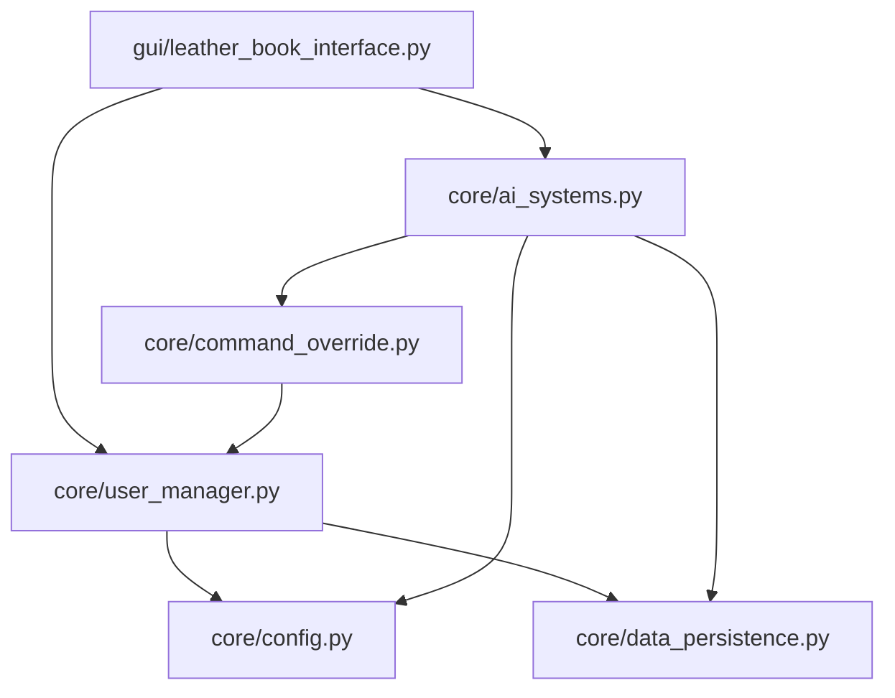

# CROSS-REFERENCE VALIDATION

**Generated By**: AGENT-051 (Phase 3 Coordinator)  
**Date**: 2026-04-20  
**Status**: ⏳ Pre-Phase 3 (Planning)  
**Purpose**: Define cross-reference validation framework for Phase 3 API documentation

---

## 📊 EXECUTIVE SUMMARY

This document establishes the **cross-reference validation framework** for Phase 3 API documentation. It defines:

1. **Cross-Reference Types**: What kinds of relationships exist between modules
2. **Validation Rules**: How to ensure cross-references are complete and accurate
3. **Dependency Mapping**: How modules depend on each other
4. **Integration Points**: Where modules integrate with external systems
5. **Validation Process**: How AGENT-051 will validate all cross-references

**Current Status**: ⏳ **Framework defined - awaiting Phase 3 execution**

---

## 🔗 CROSS-REFERENCE TYPES

### 1. Direct Dependencies (Import Relationships)

**Definition**: Module A imports and uses Module B

**Examples**:
- `gui/leather_book_interface.py` imports `core/user_manager.py`
- `agents/red_team_agent.py` imports `core/intelligence_engine.py`
- `core/ai_systems.py` imports `core/data_persistence.py`

**Validation Criteria**:
- [ ] All `import` statements documented
- [ ] Purpose of import explained
- [ ] Breaking changes noted
- [ ] Alternative modules suggested if applicable

---

### 2. Functional Dependencies (API Usage)

**Definition**: Module A calls APIs from Module B without direct import (via dependency injection, configuration, or indirect invocation)

**Examples**:
- `gui/leather_book_dashboard.py` signals connect to `core/ai_systems.py` methods
- `agents/safety_guard_agent.py` validates actions against `core/constitutional_model.py`
- `core/continuous_monitoring_system.py` alerts to `core/emergency_alert.py`

**Validation Criteria**:
- [ ] API usage patterns documented
- [ ] Data flow direction specified
- [ ] Error handling documented
- [ ] Alternative APIs noted

---

### 3. Data Flow Relationships

**Definition**: Module A produces data consumed by Module B

**Examples**:
- `core/intent_detection.py` → classification results → `core/intelligence_engine.py`
- `core/location_tracker.py` → location data → `core/emergency_alert.py`
- `agents/red_team_agent.py` → attack results → `audit/trace_logger.py`

**Validation Criteria**:
- [ ] Data format specified
- [ ] Data schema documented
- [ ] Transformation logic explained
- [ ] Data persistence noted

---

### 4. Configuration Dependencies

**Definition**: Module A requires configuration also used by Module B

**Examples**:
- `core/intelligence_engine.py` and `core/image_generator.py` both require `OPENAI_API_KEY`
- `core/cloud_sync.py` and `core/location_tracker.py` both require `FERNET_KEY`
- Multiple modules require database configuration

**Validation Criteria**:
- [ ] Shared config keys listed
- [ ] Default values specified
- [ ] Environment variable names documented
- [ ] Configuration precedence explained

---

### 5. Event/Signal Relationships (PyQt6)

**Definition**: Module A emits signals consumed by Module B

**Examples**:
- `gui/leather_book_interface.py` emits `user_logged_in` signal → `gui/leather_book_dashboard.py` handler
- `gui/image_generation.py` emits `image_generated` signal → `gui/leather_book_dashboard.py` display
- `gui/dashboard_handlers.py` emits various signals → agent modules

**Validation Criteria**:
- [ ] Signal name and parameters documented
- [ ] Signal emitters identified
- [ ] Signal receivers identified
- [ ] Signal lifecycle explained

---

### 6. Plugin/Extension Relationships

**Definition**: Module A provides extension points used by Module B

**Examples**:
- `core/ai_systems.PluginManager` loads plugins from `plugins/*`
- `agents/consigliere/consigliere_engine.py` loads capabilities from `agents/consigliere/capability_manager.py`
- `core/continuous_monitoring_system.py` loads monitors from various sources

**Validation Criteria**:
- [ ] Extension protocol documented
- [ ] Plugin interface specified
- [ ] Registration mechanism explained
- [ ] Lifecycle hooks documented

---

### 7. Test Relationships

**Definition**: Module A has tests in Module B

**Examples**:
- `core/ai_systems.py` tested by `tests/test_ai_systems.py`
- `core/user_manager.py` tested by `tests/test_user_manager.py`
- Integration tests in `e2e/` test multiple modules together

**Validation Criteria**:
- [ ] Test file location documented
- [ ] Test coverage percentage noted
- [ ] Integration test scenarios described
- [ ] Test dependencies listed

---

## 📋 DEPENDENCY MAPPING

### Core Module Dependencies

#### Tier 1: Foundation Modules (No Dependencies)

These modules have minimal or no dependencies on other Project-AI modules:

- `core/config.py` - Configuration loading
- `core/data_persistence.py` - JSON persistence utilities
- `core/access_control.py` - Basic access control

**Validation**: Document all third-party dependencies (standard library, PyQt6, etc.)

#### Tier 2: Core Utilities (Depends on Tier 1)

These modules depend only on foundation modules:

- `core/user_manager.py` - Depends on: `config.py`, `data_persistence.py`
- `core/intent_detection.py` - Depends on: `config.py`
- `core/location_tracker.py` - Depends on: `data_persistence.py`

**Validation**: Document tier 1 dependencies, explain usage

#### Tier 3: Core Services (Depends on Tier 1 + Tier 2)

These modules depend on foundation and utility modules:

- `core/intelligence_engine.py` - Depends on: `config.py`, `intent_detection.py`
- `core/command_override.py` - Depends on: `user_manager.py`, `data_persistence.py`
- `core/emergency_alert.py` - Depends on: `config.py`, `location_tracker.py`

**Validation**: Document all dependencies in tier 1 and tier 2

#### Tier 4: AI Systems (Depends on Tier 1-3)

The six AI systems depend on many lower-tier modules:

- `core/ai_systems.py` - Depends on: `config.py`, `data_persistence.py`, `user_manager.py`, `command_override.py`

**Validation**: Document complex dependency graph, note circular dependency risks

#### Tier 5: GUI (Depends on all Core tiers)

GUI modules depend on nearly all core systems:

- `gui/leather_book_interface.py` - Depends on: `core/user_manager.py`, `core/ai_systems.py`, `core/config.py`
- `gui/leather_book_dashboard.py` - Depends on: `core/ai_systems.py`, `core/intelligence_engine.py`, `agents/*`

**Validation**: Document extensive dependency network, create dependency diagram

---

### Agent Module Dependencies

#### Independent Agents (Minimal Dependencies)

- `agents/validator.py` - No internal dependencies
- `agents/oversight.py` - No internal dependencies
- `agents/explainability.py` - No internal dependencies

#### Core-Dependent Agents

- `agents/safety_guard_agent.py` - Depends on: `core/constitutional_model.py`
- `agents/red_team_agent.py` - Depends on: `core/intelligence_engine.py`
- `agents/border_patrol.py` - Depends on: `security/*`

#### Agent-to-Agent Dependencies

- `agents/jailbreak_bench_agent.py` → uses → `agents/red_team_agent.py`
- `agents/constitutional_guardrail_agent.py` → validates → `agents/safety_guard_agent.py`

**Validation**: Map agent collaboration patterns

---

## 🔍 VALIDATION RULES

### Rule 1: Bidirectional Cross-References

**Requirement**: If Module A references Module B, then Module B should reference Module A in its "Related Modules" section.

**Example**:
- `core/intelligence_engine.py` documentation references `core/intent_detection.py`
- `core/intent_detection.py` documentation MUST reference `core/intelligence_engine.py`

**Validation**:
```python
def validate_bidirectional_refs():
    for module_a, refs in cross_references.items():
        for module_b in refs:
            assert module_a in get_refs(module_b), f"{module_b} must reference {module_a}"
```

---

### Rule 2: Import Accuracy

**Requirement**: All `import` statements in source code must be documented in API docs.

**Validation**:
```python
def validate_imports():
    source_imports = extract_imports_from_source(module)
    documented_imports = extract_imports_from_docs(module)
    assert source_imports == documented_imports, "Import mismatch"
```

---

### Rule 3: API Signature Accuracy

**Requirement**: Function signatures in documentation must match source code exactly.

**Validation**:
```python
def validate_api_signatures():
    source_sigs = extract_signatures_from_source(module)
    doc_sigs = extract_signatures_from_docs(module)
    assert source_sigs == doc_sigs, "Signature mismatch"
```

---

### Rule 4: Example Functionality

**Requirement**: All code examples must be runnable and produce expected output.

**Validation**:
```python
def validate_examples():
    examples = extract_examples_from_docs(module)
    for example in examples:
        output = execute_example(example)
        assert output == example.expected_output, "Example failed"
```

---

### Rule 5: Link Validity

**Requirement**: All internal links (to other modules, docs) must resolve correctly.

**Validation**:
```python
def validate_links():
    links = extract_links_from_docs(module)
    for link in links:
        assert file_exists(link.target), f"Broken link: {link.target}"
```

---

## 🗺️ DEPENDENCY GRAPH VISUALIZATION

### Recommended Tools

**For Phase 3 Agents**:
- Create Mermaid diagrams for complex dependencies
- Use PlantUML for UML class diagrams
- Generate dependency graphs with `pydeps` or `graphviz`

**Example Mermaid Diagram**:


---

## 📊 VALIDATION METRICS

### Coverage Metrics

| Metric | Target | Measurement |
|--------|--------|-------------|
| **Bidirectional References** | 100% | % of module pairs with mutual references |
| **Import Documentation** | 100% | % of imports documented |
| **API Signature Accuracy** | 100% | % of signatures matching source |
| **Example Functionality** | 100% | % of examples that execute successfully |
| **Link Validity** | 100% | % of links that resolve |

### Quality Metrics

| Metric | Target | Measurement |
|--------|--------|-------------|
| **Dependency Depth** | ≤ 5 tiers | Max dependency chain length |
| **Circular Dependencies** | 0 | Count of circular dependency cycles |
| **Orphan Modules** | 0 | Modules with no inbound/outbound references |
| **Integration Points** | 100% documented | % of external integrations documented |

---

## 🔄 VALIDATION PROCESS

### Phase 1: Agent Self-Validation (During Documentation)

Each agent (AGENT-030 through AGENT-050) must:

1. **Extract Dependencies**: Parse `import` statements from source
2. **Document Dependencies**: List all dependencies in "Data Flow & Dependencies" section
3. **Cross-Reference**: Add references to related modules
4. **Validate Examples**: Run all code examples to ensure functionality
5. **Check Links**: Verify all internal links resolve

**Deliverable**: Self-validation checklist in completion report

---

### Phase 2: Coordinator Validation (AGENT-051)

AGENT-051 will:

1. **Aggregate Cross-References**: Build complete cross-reference database
2. **Validate Bidirectionality**: Check all module pairs for mutual references
3. **Check Import Accuracy**: Compare documented imports vs. source imports
4. **Validate Signatures**: Compare documented APIs vs. source APIs
5. **Test Examples**: Run all code examples across all 339 modules
6. **Validate Links**: Check all internal links resolve correctly
7. **Generate Dependency Graphs**: Create visual dependency maps

**Deliverable**: Cross-Reference Validation Report (this document updated)

---

### Phase 3: Continuous Validation (CI/CD)

After Phase 3 completion, CI/CD pipeline will:

1. **On Every PR**: Validate documentation changes against source code
2. **Weekly**: Full cross-reference validation across all modules
3. **On Release**: Complete validation including example execution

**Deliverable**: Automated validation in `.github/workflows/validate-docs.yml`

---

## ⚠️ COMMON CROSS-REFERENCE ISSUES

### Issue 1: Circular Dependencies

**Problem**: Module A imports Module B, Module B imports Module A

**Detection**:
```python
def detect_circular_deps():
    graph = build_dependency_graph()
    cycles = find_cycles(graph)
    return cycles
```

**Resolution**:
- Refactor to introduce abstraction layer
- Use dependency injection
- Move shared code to common module

---

### Issue 2: Missing Dependencies

**Problem**: Module A uses Module B but doesn't document the dependency

**Detection**: Compare source imports vs. documented dependencies

**Resolution**: Add missing dependency to documentation

---

### Issue 3: Outdated References

**Problem**: Documentation references Module B's old API

**Detection**: Compare documented API vs. source API

**Resolution**: Update documentation to reflect current API

---

### Issue 4: Broken Links

**Problem**: Documentation links to non-existent file

**Detection**: Check file existence for all links

**Resolution**: Fix link target or remove broken link

---

## 📋 CROSS-REFERENCE CHECKLIST

### For Each Module Documentation

- [ ] **Imports Section**: All `import` statements documented
- [ ] **Dependencies Section**: All functional dependencies listed
- [ ] **Related Modules**: Cross-references to related modules
- [ ] **Integration Points**: External integrations documented
- [ ] **Signal/Event Connections**: PyQt6 signals documented (if applicable)
- [ ] **Configuration Dependencies**: Shared config documented
- [ ] **Test References**: Test file locations documented
- [ ] **Example Code**: All imports in examples documented

### For Coordinator Validation

- [ ] **Bidirectional Check**: All references are mutual
- [ ] **Import Accuracy**: Source imports match docs
- [ ] **API Accuracy**: Source signatures match docs
- [ ] **Example Testing**: All examples execute successfully
- [ ] **Link Validation**: All links resolve
- [ ] **Dependency Graph**: Complete dependency map generated
- [ ] **Circular Dependency Check**: No circular dependencies detected
- [ ] **Orphan Check**: No orphan modules

---

## 🎯 SUCCESS CRITERIA

Cross-reference validation is **COMPLETE** when:

1. ✅ **100% bidirectional references** (all module pairs cross-reference each other)
2. ✅ **100% import accuracy** (all source imports documented)
3. ✅ **100% API accuracy** (all signatures match source)
4. ✅ **100% example functionality** (all examples execute successfully)
5. ✅ **100% link validity** (all links resolve)
6. ✅ **0 circular dependencies** (no circular import chains)
7. ✅ **0 orphan modules** (all modules have references)
8. ✅ **Complete dependency graph** (visual map of all relationships)

**Current Status**: ⏳ **FRAMEWORK DEFINED - AWAITING PHASE 3 EXECUTION**

---

## 📊 VALIDATION REPORT TEMPLATE

After Phase 3 execution, AGENT-051 will generate:

```markdown
# Cross-Reference Validation Report

**Date**: {YYYY-MM-DD}
**Modules Validated**: {count}/339
**Validation Pass Rate**: {percentage}%

## Validation Results

### Bidirectional References
- Pass: {count} module pairs
- Fail: {count} module pairs
- Issues: {list of issues}

### Import Accuracy
- Pass: {count} modules
- Fail: {count} modules
- Issues: {list of issues}

### API Accuracy
- Pass: {count} APIs
- Fail: {count} APIs
- Issues: {list of issues}

### Example Functionality
- Pass: {count} examples
- Fail: {count} examples
- Issues: {list of issues}

### Link Validity
- Pass: {count} links
- Fail: {count} links
- Issues: {list of issues}

## Dependency Analysis

### Circular Dependencies
- Count: {count}
- Cycles: {list of cycles}

### Orphan Modules
- Count: {count}
- Modules: {list of modules}

## Recommendations
{list of recommended fixes}
```

---

## 🔗 RELATED DOCUMENTATION

- [Phase 3 Completion Report](../PHASE_3_COMPLETION_REPORT.md) - Phase 3 planning
- [Module Coverage Matrix](../MODULE_COVERAGE_MATRIX.md) - Module inventory
- [API Quick Reference](../API_QUICK_REFERENCE.md) - API overview

---

**Generated By**: AGENT-051 (Phase 3 Coordinator & Validation Lead)  
**Date**: 2026-04-20  
**Status**: ✅ **FRAMEWORK COMPLETE - READY FOR PHASE 3 EXECUTION**  
**Next Update**: After Phase 3 agent completion

---

*This cross-reference validation framework will be executed after AGENT-030 through AGENT-050 complete their documentation work.*

---

*End of Cross-Reference Validation*
