# Developer Documentation Metadata Analysis Report
**Generated by:** AGENT-026 (P1 Developer Documentation Metadata Specialist)
**Date:** 2026-04-20
**Total Files Processed:** 90

---

## Executive Summary

Successfully added comprehensive YAML frontmatter metadata to **90 developer documentation files** across the Project-AI repository. All documents now include:

- ✅ Skill level classification (beginner → expert)
- ✅ Language and framework tagging
- ✅ Code relationship mapping (implements, documents, tests)
- ✅ Prerequisite knowledge chains
- ✅ API reference flags
- ✅ Code example indicators

---

## Metadata Statistics

### Skill Level Distribution

| Skill Level | Count | Percentage |
|-------------|-------|------------|
| Beginner | 20 | 22.2% |
| Intermediate | 62 | 68.9% |
| Advanced | 5 | 5.6% |
| Expert | 3 | 3.3% |

### Document Type Distribution

| Type | Count |
|------|-------|
| Guide | 45 |
| Reference | 45 |

### Programming Language Coverage

| Language | Documents |
|----------|----------|
| Python | 69 |
| Shell | 59 |
| YAML | 17 |
| JavaScript | 5 |
| Groovy | 1 |

### Framework Coverage

| Framework | Documents |
|-----------|----------|
| PyQt6 | 18 |
| Docker | 12 |
| Kubernetes | 12 |
| Temporal | 7 |
| FastAPI | 5 |
| Flask | 5 |
| React | 2 |
| pytest | 1 |
| Prometheus | 1 |
| Gradle | 1 |

### Content Indicators

| Indicator | Count | Percentage |
|-----------|-------|------------|
| Code Examples | 46 | 51.1% |
| API Reference | 3 | 3.3% |
| Has Prerequisites | 27 | 30.0% |
| Implements Code | 21 | 23.3% |

### Directory Structure

| Directory | Files |
|-----------|-------|
| root | 60 |
| deployment | 12 |
| tarl | 6 |
| api | 4 |
| cli | 2 |
| guides | 2 |
| web | 2 |
| accessibility | 1 |
| gui_e2e | 1 |

---

# Learning Path Progression
## Recommended Skill Progression

### BEGINNER Level (20 documents)

**deployment:**
- `deployment\DEPLOYMENT_RELEASE_QUICKSTART.md`
- `deployment\GRADLE_JAVASCRIPT_SETUP.md`

**guides:**
- `guides\DESKTOP_QUICKSTART.md`
- `guides\QUICK_START.md`

**root:**
- `ANTIGRAVITY_QUICKSTART.md`
- `DESKTOP_APP_QUICKSTART.md`
- `DEVELOPER_QUICK_REFERENCE.md`
- `E2E_SETUP_GUIDE.md`
- `HOW_TO_RUN.md`
- `IMAGE_GENERATION_QUICKSTART.md`
- `LIARA_QUICK_REFERENCE.md`
- `MCP_QUICKSTART.md`
- `MONITORING_QUICKSTART.md`
- `OPERATOR_QUICKSTART.md`
- ... and 5 more

**tarl:**
- `tarl\TARL_QUICK_REFERENCE.md`

### INTERMEDIATE Level (62 documents)

**accessibility:**
- `accessibility\ACCESSIBILITY_CHECKLIST.md`

**api:**
- `api\CONSTITUTION.md`
- `api\INTEGRATION_PLAN.md`
- `api\TRIUMVIRATE_INTEGRATION.md`

**cli:**
- `cli\README.md`
- `cli\commands.md`

**deployment:**
- `deployment\BUILD_AND_DEPLOYMENT.md`
- `deployment\DEPLOYMENT.md`
- `deployment\DEPLOYMENT_GUIDE.md`
- `deployment\DEPLOYMENT_READY_THIRSTYSPROJECTS.md`
- `deployment\DEPLOYMENT_SOLUTIONS.md`
- `deployment\DEPLOY_CHECKLIST.md`
- `deployment\DEPLOY_TO_THIRSTYSPROJECTS.md`
- `deployment\RELEASE_BUILD_GUIDE.md`
- `deployment\RELEASE_NOTES_v1.0.0.md`
- `deployment\RELEASE_NOTES_v1.3.0.md`

**gui_e2e:**
- `gui_e2e\README.md`

**root:**
- `100_PERCENT_COVERAGE.md`
- `AI_SAFETY_OVERVIEW.md`
- `COMMAND_MEMORY_FEATURES.md`
- `CONTINUOUS_LEARNING.md`
- `CONTRIBUTING.md`
- `COVERAGE_ACHIEVEMENT_SUMMARY.md`
- `DEEPSEEK_V32_GUIDE.md`
- `DEPLOYMENT_GUIDE.md`
- `DESKTOP_APP_README.md`
- `DEVELOPMENT.md`
- ... and 28 more

**tarl:**
- `tarl\TARL_CODE_EXAMPLES.md`
- `tarl\TARL_PRODUCTIVITY_QUICK_REF.md`
- `tarl\TARL_README.md`
- `tarl\TARL_TECHNICAL_DOCUMENTATION.md`
- `tarl\TARL_USAGE_SCENARIOS.md`

**web:**
- `web\DEPLOYMENT.md`
- `web\WEB_README.md`

### ADVANCED Level (5 documents)

**root:**
- `AI_PERSONA_IMPLEMENTATION.md`
- `HYDRA_50_INTEGRATION_PATTERNS.md`
- `IMPLEMENTATION_COMPLETE.md`
- `LEARNING_REQUEST_IMPLEMENTATION.md`
- `LEATHER_BOOK_ARCHITECTURE.md`

### EXPERT Level (3 documents)

**api:**
- `api\CLI-CODEX.md`

**root:**
- `CONTRARIAN_FIREWALL_API_GUIDE.md`
- `HYDRA_50_API_REFERENCE.md`

---

# Documentation Dependency Map
## Prerequisite Chains

```mermaid
graph TD
  ARCHITECTURE[ARCHITECTURE] --> api[api]
  ARCHITECTURE[ARCHITECTURE] --> contrarian_firewall_api_guide[contrarian-firewall-api-guide]
  config[config] --> deployment_guide[deployment-guide]
  install[install] --> deployment_guide[deployment-guide]
  DEVELOPMENT[DEVELOPMENT] --> e2e_setup_guide[e2e-setup-guide]
  install[install] --> e2e_setup_guide[e2e-setup-guide]
  config[config] --> example_deployments[example-deployments]
  install[install] --> example_deployments[example-deployments]
  ARCHITECTURE[ARCHITECTURE] --> hydra_50_api_reference[hydra-50-api-reference]
  QUICK_START[QUICK_START] --> hydra_50_api_reference[hydra-50-api-reference]
  config[config] --> hydra_50_deployment_guide[hydra-50-deployment-guide]
  install[install] --> hydra_50_deployment_guide[hydra-50-deployment-guide]
  QUICK_START[QUICK_START] --> hydra_50_deployment_guide[hydra-50-deployment-guide]
  ARCHITECTURE[ARCHITECTURE] --> hydra_50_integration_patterns[hydra-50-integration-patterns]
  README[README] --> hydra_50_integration_patterns[hydra-50-integration-patterns]
  QUICK_START[QUICK_START] --> hydra_50_integration_patterns[hydra-50-integration-patterns]
  ARCHITECTURE[ARCHITECTURE] --> integration_guide[integration-guide]
  README[README] --> integration_guide[integration-guide]
  ARCHITECTURE[ARCHITECTURE] --> prometheus_integration[prometheus-integration]
  README[README] --> prometheus_integration[prometheus-integration]
  QUICK_START[QUICK_START] --> tarl_orchestration_guide[tarl-orchestration-guide]
  config[config] --> web_deployment_guide[web-deployment-guide]
  install[install] --> web_deployment_guide[web-deployment-guide]
  ARCHITECTURE[ARCHITECTURE] --> integration_plan[integration-plan]
  README[README] --> integration_plan[integration-plan]
  ARCHITECTURE[ARCHITECTURE] --> triumvirate_integration[triumvirate-integration]
  README[README] --> triumvirate_integration[triumvirate-integration]
  config[config] --> build_and_deployment[build-and-deployment]
  install[install] --> build_and_deployment[build-and-deployment]
  config[config] --> deployment[deployment]
  install[install] --> deployment[deployment]
  config[config] --> deployment_ready_thirstysprojects[deployment-ready-thirstysprojects]
  install[install] --> deployment_ready_thirstysprojects[deployment-ready-thirstysprojects]
  config[config] --> deployment_release_quickstart[deployment-release-quickstart]
  install[install] --> deployment_release_quickstart[deployment-release-quickstart]
  config[config] --> deployment_solutions[deployment-solutions]
  install[install] --> deployment_solutions[deployment-solutions]
  QUICK_START[QUICK_START] --> tarl_code_examples[tarl-code-examples]
  QUICK_START[QUICK_START] --> tarl_productivity_quick_ref[tarl-productivity-quick-ref]
  QUICK_START[QUICK_START] --> tarl_quick_reference[tarl-quick-reference]
  QUICK_START[QUICK_START] --> tarl_readme[tarl-readme]
  QUICK_START[QUICK_START] --> tarl_technical_documentation[tarl-technical-documentation]
  QUICK_START[QUICK_START] --> tarl_usage_scenarios[tarl-usage-scenarios]
```

## Prerequisite Relationships

**api** requires:
  - ARCHITECTURE

**build-and-deployment** requires:
  - config
  - install

**contrarian-firewall-api-guide** requires:
  - ARCHITECTURE

**deployment** requires:
  - config
  - install

**deployment-guide** requires:
  - config
  - install

**deployment-ready-thirstysprojects** requires:
  - config
  - install

**deployment-release-quickstart** requires:
  - config
  - install

**deployment-solutions** requires:
  - config
  - install

**e2e-setup-guide** requires:
  - DEVELOPMENT
  - install

**example-deployments** requires:
  - config
  - install

**hydra-50-api-reference** requires:
  - ARCHITECTURE
  - QUICK_START

**hydra-50-deployment-guide** requires:
  - QUICK_START
  - config
  - install

**hydra-50-integration-patterns** requires:
  - ARCHITECTURE
  - QUICK_START
  - README

**integration-guide** requires:
  - ARCHITECTURE
  - README

**integration-plan** requires:
  - ARCHITECTURE
  - README

**prometheus-integration** requires:
  - ARCHITECTURE
  - README

**tarl-code-examples** requires:
  - QUICK_START

**tarl-orchestration-guide** requires:
  - QUICK_START

**tarl-productivity-quick-ref** requires:
  - QUICK_START

**tarl-quick-reference** requires:
  - QUICK_START

**tarl-readme** requires:
  - QUICK_START

**tarl-technical-documentation** requires:
  - QUICK_START

**tarl-usage-scenarios** requires:
  - QUICK_START

**triumvirate-integration** requires:
  - ARCHITECTURE
  - README

**web-deployment-guide** requires:
  - config
  - install

---

# Framework Coverage Matrix

| Framework | Document Count | Key Documents |
|-----------|----------------|---------------|
| Docker | 12 | DEPLOYMENT_GUIDE.md, DOCKER_WSL_SETUP.md, EXAMPLE_DEPLOYMENTS.md (+9 more) |
| FastAPI | 5 | api.md, CONTRARIAN_FIREWALL_API_GUIDE.md, HYDRA_50_API_REFERENCE.md (+2 more) |
| Flask | 5 | api.md, CONTRARIAN_FIREWALL_API_GUIDE.md, HYDRA_50_API_REFERENCE.md (+2 more) |
| Gradle | 1 | GRADLE_JAVASCRIPT_SETUP.md |
| Kubernetes | 12 | DEPLOYMENT_GUIDE.md, EXAMPLE_DEPLOYMENTS.md, HYDRA_50_DEPLOYMENT_GUIDE.md (+9 more) |
| Prometheus | 1 | PROMETHEUS_INTEGRATION.md |
| PyQt6 | 18 | CONTRARIAN_FIREWALL_API_GUIDE.md, DEEPSEEK_V32_GUIDE.md, DEPLOYMENT_GUIDE.md (+15 more) |
| React | 2 | WEB_DEPLOYMENT_GUIDE.md, WEB_README.md |
| Temporal | 7 | TARL_ORCHESTRATION_GUIDE.md, TARL_CODE_EXAMPLES.md, TARL_PRODUCTIVITY_QUICK_REF.md (+4 more) |
| pytest | 1 | E2E_SETUP_GUIDE.md |

---

## Code Implementation Mapping

Documents that describe specific source code files:

**src/app/core/ai_persona.py**
  - Documented in: `ai-persona-implementation.md`

**src/app/core/command_override.py**
  - Documented in: `command-memory-features.md`

**src/app/core/hydra_50_engine.py**
  - Documented in: `hydra-50-api-reference.md`
  - Documented in: `hydra-50-deployment-guide.md`
  - Documented in: `hydra-50-integration-patterns.md`

**src/app/core/hydra_50_telemetry.py**
  - Documented in: `hydra-50-api-reference.md`
  - Documented in: `hydra-50-deployment-guide.md`
  - Documented in: `hydra-50-integration-patterns.md`

**src/app/core/image_generator.py**
  - Documented in: `image-generation-quickstart.md`
  - Documented in: `image-generation-restoration.md`

**src/app/core/learning_request_manager.py**
  - Documented in: `learning-request-implementation.md`
  - Documented in: `learning-request-log.md`

**src/app/core/mcp_integration.py**
  - Documented in: `mcp-configuration.md`
  - Documented in: `mcp-quickstart.md`

**src/app/core/memory_expansion.py**
  - Documented in: `command-memory-features.md`

**src/app/core/tarl_orchestrator.py**
  - Documented in: `tarl-orchestration-guide.md`
  - Documented in: `tarl-code-examples.md`
  - Documented in: `tarl-productivity-quick-ref.md`
  - Documented in: `tarl-quick-reference.md`
  - Documented in: `tarl-readme.md`
  - Documented in: `tarl-technical-documentation.md`
  - Documented in: `tarl-usage-scenarios.md`

**src/app/gui/ai_persona_ui.py**
  - Documented in: `ai-persona-implementation.md`

**src/app/gui/image_generation.py**
  - Documented in: `image-generation-quickstart.md`
  - Documented in: `image-generation-restoration.md`

**src/app/gui/leather_book_dashboard.py**
  - Documented in: `leather-book-architecture.md`
  - Documented in: `leather-book-readme.md`
  - Documented in: `leather-book-ui-complete.md`

**src/app/gui/leather_book_interface.py**
  - Documented in: `leather-book-architecture.md`
  - Documented in: `leather-book-readme.md`
  - Documented in: `leather-book-ui-complete.md`

---

## Quality Assurance

### Validation Checks

- ✅ All 90 files processed successfully
- ✅ 100% have skill level assignments
- ✅ 100% have language tags
- ✅ 30.0% have prerequisite chains
- ✅ 23.3% map to source code
- ✅ 51.1% include code examples
- ✅ 3.3% are API references

### Metadata Schema Compliance

All documents comply with:
- Project-AI Metadata Schema v2.0.0
- Tag Taxonomy Reference v1.0
- AGENT Implementation Standard (Principal Architect Level)

---

## Recommendations

### For Developers

1. **Start with Beginner Docs:** Begin with quickstart guides and setup documentation
2. **Follow Prerequisites:** Use the dependency map to understand learning order
3. **Use Framework Filters:** Filter docs by your target framework (PyQt6, React, etc.)
4. **Check Implementation Links:** API docs link directly to source code

### For Contributors

1. **Maintain Metadata:** Keep frontmatter updated when editing docs
2. **Update Prerequisites:** Add prerequisite links when referencing other docs
3. **Tag Accurately:** Use correct skill levels and framework tags
4. **Link to Code:** Use `implements:` field to link docs to source files

---

## Conclusion

Successfully enhanced all 90 developer documentation files with production-grade metadata. The documentation is now fully queryable, supports intelligent navigation, and provides clear learning paths for developers at all skill levels.

**Mission Accomplished:** P1 Developer Documentation Metadata Complete ✅
