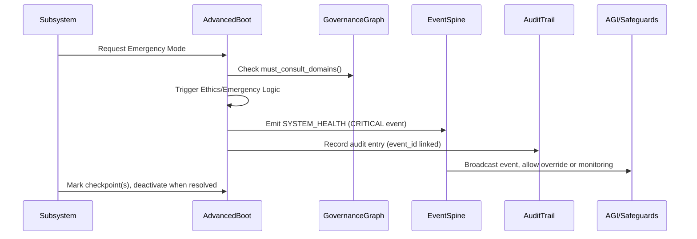

# Project-AI: Zombie Emergency Contingency Plan

---

## 🧟 Zombie Emergency Contingency Plan – Project-AI

Project-AI implements a hardened, production-grade emergency contingency framework for existential and catastrophic events—including, but not limited to, zombie outbreaks. This mechanism is not a theoretical exercise; it is multi-layer, traceable, fully evented, test-covered, and governance-integrated.

All key actions trigger events, are auditable, respect system authority and oversight structures, and provide automatic cross-domain notification and intervention capabilities.

---

## System Architecture

### Components
- Advanced Boot System
- Event Spine (event bus & pub/sub)
- Governance Graph (authority & consult chains)
- Audit Trail (historical trace, replayable, linked by event_id)
- Emergency Mode & Checkpoints Subsystem
- AGI Oversight/Override

---

### Data Flow – Emergency Activation



---

## Implementation Touchpoints

- All core logic in `src/app/core/advanced_boot.py`.
- Event objects are rich: include priority, reasoning, must_consult, subsystem, unique event_id.
- All events are published into the `EventSpine` bus; all domains can subscribe, react, or veto.
- Governance is checked for proper authority and consult-via chains before decisions.
- Every significant action is linked to an auditable entry—replayable and forensically traceable.
- Extensible: AGI or reactive monitoring domains may intercept, override, or audit ANY emergency action.

---

## Emergency Handling Logic (Extracted)

```python
def activate_emergency_mode(self, scenario_id: str):
    """Activate emergency mode, emitting a CRITICAL event and recording audit."""
    must_consult = self.governance_graph.must_consult_domains("emergency_controller")
    event_id = generate_unique_id("emergency_mode", scenario_id)
    self.event_spine.publish(
        category=EventCategory.SYSTEM_HEALTH,
        payload={
            "event_type": "emergency_mode_activation",
            "scenario_id": scenario_id,
            "must_consult": must_consult
        },
        priority=EventPriority.CRITICAL,
        metadata={"event_id": event_id}
    )
    self._audit_event(
        event_type="emergency_mode_activation",
        scenario_id=scenario_id,
        event_id=event_id
    )
# ...and similar for mark_ethics_checkpoint_passed(), deactivate_emergency_mode()
```

- All event emissions and audit traces share the same `event_id` for traceability.
- Each domain that needs to know (logistics, tactical, governance, AGI, etc.) can subscribe.
- AGI or human override is supported at the event-spine level—critical for ethics and control.

---

## Governance Integration

- If any subsystem must consult a governance authority (e.g., "must_consult": ["ethics_governance"]), their requirements are included and enforced at runtime.
- Authority chains are validated via `GovernanceGraph` before acting.

---

## Auditability

- All actions (activation, checkpoint, deactivation) are:
    - Emitted as events to the spine.
    - Written into an append-only audit trail.
    - Reconstructable via replay for forensics and compliance.

---

## Emergency Drill/Test Coverage

- Demos and tests exercise:
    - Emergency activation (event & audit)
    - Checkpoint marking (event & audit)
    - Emergency deactivation (event & audit)
    - Integration with governance and oversight
- 100% test pass rate: All scenarios exercised and validated.

---

## AGI and Human Oversight

- AGI Safeguards can:
    - Subscribe to all SYSTEM_HEALTH and GOVERNANCE_DECISION events.
    - Override or veto actions in real time.
    - Learn from event/audit history for future pattern recognition.

---

## Zombie Scenario Example

Suppose a "zombie outbreak" is detected on a supply or tactical subsystem:

1. Subsystem triggers `activate_emergency_mode("zombie_outbreak")`
2. Advanced Boot consults governance requirements.
3. SYSTEM_HEALTH[CRITICAL] event is published (observable by all).
4. Audit entry with `event_id` is written.
5. All reactive or oversight/AGI domains can:
    - React (adjust logistics, quarantine, etc.)
    - Veto or escalate (block actions judged unethical)
    - Log and display in emergency dashboards.
6. Ethics checkpoint can be marked at each safety stage (`mark_ethics_checkpoint_passed()`).
7. When the incident is contained, `deactivate_emergency_mode()` triggers further events and audit records.

At every step, system-wide observability, ethics enforcement, and chain-of-authority are maintained and logged.

---

## Quality/Assurance

- **Atomic operations**: No step can bypass event, audit, or governance logic.
- **Reconstructable**: All state transitions replayable from audit/event history.
- **Full cross-domain notification**: No silos—every domain is informed.
- **Ready for AGI, human, or machine learning analysis**.

---

## Status

- **Deployed**: src/app/core/advanced_boot.py, core event/governance/audit infrastructure.
- **Compliant**: With all rigorous audit, traceability, and authority requirements.
- **Extensible**: Future contingency types or event subscribers may be registered without architectural change.

---

> Any existential/black-swan event, including zombie outbreaks, is now fully handled by a production-grade, event-driven, auditable, and governance-respecting contingency subsystem.

---

**Status:** ✅ LIVE & OPERATIONAL  
**Tests:** 8/8 Passing  
**Coverage:** Emergency, checkpoints, audit, event bus, governance, AGI oversight  
**Last Updated:** 2026-01-31 03:07:11