<p align="center">
  
  
  
</p>

<p align="center">
  
  
  
  
  
  
</p>

<p align="center">
  
  
  
  
  
  
</p>

---

<h1 align="center">🛡️ PROJECT-AI — THE SOVEREIGN MONOLITH</h1>

<p align="center"><em>Constitutionally governed AI — cryptographically enforced, ethically aligned, sovereign by design.</em></p>

<p align="center">
  <strong>Creator:</strong> Jeremy Karrick &nbsp;|&nbsp;
  <strong>Organization:</strong> <a href="https://github.com/IAmSoThirsty">IAmSoThirsty</a> &nbsp;|&nbsp;
  <strong>Version:</strong> 1.0.0

</p>

---

## Table of Contents

- [Mission](#-mission)
- [Architecture Overview](#-architecture-overview)
- [The Triumvirate — Governance Layer](#-the-triumvirate--governance-layer)
- [Sovereign Runtime](#-sovereign-runtime)
- [Iron Path Executor](#-iron-path-executor)
- [Existential Proof System](#-existential-proof-system)
- [Liara Kernel Failover](#-liara-kernel-failover)
- [Thirsty's Waterfall (PSIA)](#-thirstys-waterfall--psia)
- [Thirsty-Lang — The Language](#-thirsty-lang--the-language)
- [Thirsty-Lang Shadow — Dual-Plane Compiler](#-thirsty-lang-shadow--dual-plane-compiler)
- [T.A.R.L. — Active Resistance Language](#-tarl--thirstys-active-resistance-language)
- [TARL OS — AI Operating System](#-tarl-os--ai-operating-system)
- [OctoReflex — Kernel-Level Containment](#-octoreflex--kernel-level-containment)
- [Simulation Engines](#-simulation-engines)
- [Security Architecture](#-security-architecture)
- [Enterprise Monolithic Architecture](#-enterprise-monolithic-architecture)
- [Configuration](#-configuration)
- [TAAR — Active Agent Runner](#-taar--active-agent-runner)
- [CI/CD Pipeline](#-cicd-pipeline)
- [Quick Start](#-quick-start)
- [Demo Scripts](#-demo-scripts)
- [Testing](#-testing)
- [Project Structure](#-project-structure)
- [Contributing](#-contributing)
- [License](#-license)

---

## 🎯 Mission

Project-AI is a **production-grade, sovereign AI platform** built on three immutable principles:

1. **User Sovereignty** — Your data never leaves your control. No telemetry, no phone-home, no silent exfiltration.
2. **Ethical Enforcement via Code** — Asimov's Four Laws are not guidelines — they are compiled into every execution path and enforced cryptographically.
3. **Cryptographic Verifiability** — Every configuration mutation, every policy binding, every audit event is Ed25519-signed and SHA-256 hash-chained.

> **This is not a framework.** This is a monolithic, constitutionally governed AI system where sovereignty is not an aspiration — it is an invariant.

---

## 🏗️ Architecture Overview

```
┌─────────────────────────────────────────────────────────────────────────────┐
│                        PROJECT-AI SOVEREIGN MONOLITH                        │
├─────────────────────────────────────────────────────────────────────────────┤
│                                                                             │
│  ┌──────────────────── GOVERNANCE LAYER ────────────────────┐              │
│  │  Triumvirate (Galahad + Cerberus + Codex Deus)           │              │
│  │  Sovereign Runtime ← Ed25519 + SHA-256 Hash Chain        │              │
│  │  Iron Path Executor ← 7-Stage Cryptographic Pipeline     │              │
│  │  Existential Proof System ← Constitutional Invariants    │              │
│  │  Liara Guard ← Temporal Enforcement + TTL Failover       │              │
│  └──────────────────────────────────────────────────────────┘              │
│                              │                                              │
│  ┌──────── LANGUAGE LAYER ────────┐  ┌──── DEFENSE LAYER ────────┐        │
│  │  Thirsty-Lang (4 Editions)     │  │  PSIA Waterfall (7-Stage) │        │
│  │  Shadow Thirst (Dual-Plane)    │  │  OctoReflex (eBPF/LSM)    │        │
│  │  T.A.R.L. (Compiler + VM)     │  │  T-SECA / GHOST Protocol  │        │
│  │  TARL OS (AI Operating Sys.)   │  │  Cerberus Security Fmwk   │        │
│  └────────────────────────────────┘  └───────────────────────────┘        │
│                              │                                              │
│  ┌──────────────────── SIMULATION LAYER ────────────────────┐              │
│  │  AI Takeover (19 Scenarios) │ Atlas Ω (13-Layer Stack)   │              │
│  │  Alien Invaders │ EMP Defense │ Sovereign War Room (SRS)  │              │
│  │  Hydra-50 │ Django State │ Zombie Defense │ + More        │              │
│  └──────────────────────────────────────────────────────────┘              │
│                              │                                              │
│  ┌──────────────────── COGNITION LAYER ─────────────────────┐              │
│  │  OctoReflex Kernel (23 Modules) │ Kernel BPF (Go + C)    │              │
│  │  Memory Expansion │ Learning Engine │ Threat Detection    │              │
│  └──────────────────────────────────────────────────────────┘              │
│                                                                             │
└─────────────────────────────────────────────────────────────────────────────┘
```

### Three-Tier Sovereignty Model

| Tier | Name | Enforcement |
|------|------|-------------|
| **Tier 1** | Constitutional Core | Four Laws, Existential Proofs, Immutable Audit Trail |
| **Tier 2** | Governance Enforcement | Triumvirate Consensus, Sovereign Runtime, Iron Path |
| **Tier 3** | Operational Security | OctoReflex, PSIA Waterfall, Cerberus, T-SECA/GHOST |

---

## 👑 The Triumvirate — Governance Layer

The **Triumvirate** is the supreme governance body of Project-AI, composed of three immutable pillars:

| Pillar | Role | Responsibility |
|--------|------|----------------|
| ⚔️ **Galahad** | Ethics & Safety | Enforces Asimov's Four Laws at every decision point |
| 🐕‍🦺 **Cerberus** | Threat Defense | Guards against adversarial attacks, injection, manipulation |
| ⚖️ **Codex Deus** | Arbitrator & Judge | Resolves conflicts, makes final rulings, maintains equilibrium |

### How It Works

```python
from cognition.triumvirate import evaluate_triumvirate

# All pillars healthy → STABLE
status = evaluate_triumvirate(health)  # Returns "STABLE"

# One pillar fails → Liara substitutes
status = evaluate_triumvirate(health)  # Returns "SUBSTITUTED"
# Liara authorized with 15-min TTL, audit logged

# Multiple failures → GOVERNANCE HOLD (system halts)
# RuntimeError: "Governance Hold: Multiple pillar degradation"
```

### Decision Flow

```mermaid
graph TD
    A[Health Check] --> B{All Pillars Healthy?}
    B -->|Yes| C[STABLE — Normal Operation]
    B -->|No| D{How Many Failed?}
    D -->|1 Pillar| E[Activate Liara Substitute]
    E --> F[SUBSTITUTED — Audit Logged]
    D -->|2+ Pillars| G[GOVERNANCE HOLD]
    G --> H[RuntimeError — System Halts]
    F --> I{Pillar Restored?}
    I -->|Yes| J[Revoke Liara → STABLE]
    I -->|No| K[Continue Substituted]
```



> **Key Property:** The Triumvirate never fails silently. Every state transition is cryptographically logged to the immutable audit trail.

---

## 🔐 Sovereign Runtime

`governance/sovereign_runtime.py` — **589 lines of cryptographic governance.**

The Sovereign Runtime is the cryptographic backbone that makes Project-AI's sovereignty claims *provable, not aspirational*.

### Core Capabilities

| Feature | Implementation | Purpose |
|---------|---------------|---------|
| **Keypair Management** | Ed25519 (via `cryptography` lib) | Signs all configurations, roles, and policy states |
| **Immutable Audit Trail** | SHA-256 hash chain with Merkle anchoring | Every operation is logged and chained immutably |
| **Config Snapshot Hashing** | Deterministic SHA-256 | Execution paths are cryptographically bound to config state |
| **Role Signature Verification** | Ed25519 verify | Ensures only authorized entities modify system state |
| **Policy State Binding** | Config hash → Policy hash → Role signature | Non-bypassable by design |

### Usage

```python
from governance.sovereign_runtime import SovereignRuntime

runtime = SovereignRuntime()

# Log an event to the immutable audit trail
block_hash = runtime.audit_log(
    event_type="CONFIG_MUTATION",
    data={"key": "max_agents", "old": 10, "new": 20},
    severity="WARNING"
)
# Returns: SHA-256 hash of the new audit block

# Verify the entire audit trail integrity
is_valid, issues = runtime.verify_audit_trail_integrity()
assert is_valid  # Hash chain unbroken, all blocks verified

# Sign a configuration snapshot
config_hash = runtime.hash_config_snapshot(config_dict)
signature = runtime.sign_config(config_hash)

# Verify a role's authority
is_authorized = runtime.verify_role_signature(role_id, signature, config_hash)
```

### Cryptographic Guarantees

```
Config State ──SHA-256──→ Config Hash ──Ed25519──→ Signed Config
     │                                                   │
     ▼                                                   ▼
Policy Bind ──SHA-256──→ Policy Hash ──Ed25519──→ Signed Policy
     │                                                   │
     ▼                                                   ▼
Audit Block ──SHA-256──→ Block Hash  ──Chain──→ Previous Hash
```

> **Non-Bypassable:** Execution paths are cryptographically *dependent* on configuration. There is no code path that can execute without a valid config hash and policy binding.

---

## ⛓️ Iron Path Executor

`governance/iron_path.py` — **570 lines** of end-to-end sovereign demonstration.

The Iron Path is a 7-stage cryptographic pipeline that proves the entire system works as a unified sovereign entity. Each stage produces signed artifacts and feeds into the next.

### Pipeline Stages

| Stage | Name | Output |
|-------|------|--------|
| 1 | **Data Preparation** | Validated, hashed dataset ready for training |
| 2 | **Model Training** | Trained model with signed weights and config |
| 3 | **Agent Chain** | Agent chain execution with signed decisions |
| 4 | **Promotion** | Model promoted to production with signed certificate |
| 5 | **Rollback** | Rollback capability verified with signed proof |
| 6 | **Audit Export** | Complete audit trail exported as signed compliance bundle |
| 7 | **Verification** | Full pipeline verification — hash chain intact |

### Usage

```python
from governance.iron_path import IronPathExecutor

executor = IronPathExecutor(config_path="configs/iron_path.yaml")
result = executor.execute()

# Every stage produces a signed artifact
for stage_name, artifact in result["artifacts"].items():
    print(f"Stage: {stage_name}")
    print(f"  Hash: {artifact['hash']}")
    print(f"  Signature: {artifact['signature'][:32]}...")

# Final verification
assert result["audit_trail_valid"] == True
print(f"Compliance bundle: {result['compliance_bundle_path']}")
```

---

## 🔬 Existential Proof System

`governance/existential_proof.py` — **575 lines** of constitutional invariant enforcement.

This system detects violations of fundamental invariants and assesses whether the system is *restorable* or has entered a non-recoverable state.

### Invariant Types

| Invariant | What It Checks |
|-----------|---------------|
| `ASIMOV_LAWS` | Four Laws compliance across all decision paths |
| `ENTROPY_BOUNDS` | System entropy stays within safe operational limits |
| `HASH_CHAIN` | Audit trail hash chain is unbroken |
| `TEMPORAL_CONSISTENCY` | Time moves forward; no temporal anomalies |
| `RESOURCE_BOUNDS` | CPU, memory, and I/O stay within allocated quotas |
| `STATE_INTEGRITY` | Internal state matches cryptographic commitments |

### Violation Severities

| Severity | Response |
|----------|----------|
| `INFO` | Logged, no action required |
| `WARNING` | Logged, alert generated |
| `ERROR` | System degradation, corrective action initiated |
| `CRITICAL` | Potential non-restorability, dual-channel verification required |
| `EXISTENTIAL` | Constitutional violation — system must halt |

### Dual-Channel Restoration

Restoration from critical violations requires **two independent verification channels**:

1. **Internal Ledger** — Hash chain of all operations since last known-good state
2. **External Signature** — Ed25519 signature from an independent verification authority

```python
from governance.existential_proof import ExistentialProofSystem

proof_system = ExistentialProofSystem()

# Record a violation
proof_system.record_violation(
    invariant_type="HASH_CHAIN",
    severity="CRITICAL",
    details={"block_index": 42, "expected_hash": "abc...", "actual_hash": "def..."}
)

# Evaluate restorability
assessment = proof_system.evaluate_restorability()
if not assessment.restorable:
    print(f"SYSTEM NON-RESTORABLE: {assessment.reason}")
    # Requires manual intervention with external verification
```

---

## 🛡️ Liara Kernel Failover

`cognition/kernel_liara.py` + `cognition/liara_guard.py` — The safety net behind the Triumvirate.

When a Triumvirate pillar fails (Galahad, Cerberus, or Codex Deus), Liara is activated as a **temporary substitute** with strict temporal constraints.

### Safeguards

| Safeguard | Implementation |
|-----------|---------------|
| **TTL Enforcement** | Liara authorization expires after 900 seconds (15 minutes) |
| **Role Stacking Prohibition** | Only one Liara role can be active at any time; `LiaraViolation` raised on stacking |
| **Cooldown Period** | After revocation, Liara cannot be re-activated immediately |
| **Audit Logging** | Every activation, revocation, and violation is logged |
| **Automatic Expiry** | `check_liara_state()` auto-revokes on TTL expiry |

```python
from cognition.liara_guard import authorize_liara, revoke_liara, check_liara_state

# Activate Liara for a failed pillar (15-min TTL)
authorize_liara(role="GALAHAD_SUBSTITUTE", ttl_seconds=900)

# Revoke when pillar is restored
revoke_liara(reason="galahad_restored")

# Automatic expiry check (called by kernel health loop)
check_liara_state()  # Auto-revokes if TTL expired
```

---

## 🌊 Thirsty's Waterfall — PSIA

`src/psia/` — **Project-AI Sovereign Immune Architecture**

The PSIA Waterfall is a **7-stage, 6-plane defense pipeline** with monotonically increasing strictness. Every input passes through all seven stages; there is no bypass.

### The Six Planes

| Plane | Purpose |
|-------|---------|
| **Canonical** | Ground truth — immutable production state |
| **Shadow** | Parallel validation — deterministic replay verification |
| **Adaptive** | Learning and pattern recognition |
| **Gate** | Authorization and capability enforcement |
| **Reflex** | Immediate threat response (sub-millisecond) |
| **Ingress** | External input validation and sanitization |

### The Seven Stages

| Stage | File | Purpose |
|-------|------|---------|
| 0 | `stage_0_structural.py` | Structural validation — schema, types, format |
| 1 | `stage_1_signature.py` | Cryptographic signature verification |
| 2 | `stage_2_behavioral.py` | Behavioral analysis — anomaly detection |
| 3 | `stage_3_shadow.py` | Shadow plane simulation — parallel verification |
| 4 | `stage_4_gate.py` | Gate enforcement — capability-based authorization |
| 5 | `stage_5_commit.py` | Commit validation — state transition verification |
| 6 | `stage_6_memory.py` | Memory anchoring — Merkle-anchored persistence |

### Key Properties

- **Monotonic Strictness** — Each stage is strictly more restrictive than the previous
- **Capability-Based Authorization** — Least-privilege via capability tokens
- **BFT Quorum Consensus** — Governance mutations require Byzantine Fault Tolerant consensus
- **Append-Only Ledger** — Cryptographic ledger with Merkle anchoring
- **Deterministic Shadow Simulation** — Shadow plane provides audit-replay verification

```python
from src.psia.waterfall.engine import WaterfallEngine

engine = WaterfallEngine()
result = engine.process(input_data)

# Every stage produces a verdict
for stage, verdict in result.stage_verdicts.items():
    print(f"Stage {stage}: {'PASS' if verdict.passed else 'FAIL'}")
    if not verdict.passed:
        print(f"  Reason: {verdict.reason}")
```

---

## 💧 Thirsty-Lang — The Language

`src/thirsty_lang/` — **A complete programming language** with water-themed syntax and enterprise-grade defensive programming capabilities.

<p align="center">
  
  
  
</p>

### Language Editions

| Edition | Level | Features |
|---------|-------|----------|
| 💧 **Base** | Beginner | Variables (`drink`), output (`pour`), input (`sip`) |
| 💧+ **Thirsty+** | Intermediate | Conditionals (`thirsty`/`hydrated`), control flow |
| 💧++ **Thirsty++** | Advanced | Functions (`glass`), loops (`refill`), arrays |
| ⚡ **ThirstOfGods** | Master | Classes, async/await, modules, full OOP |

### Core Syntax

```thirsty
# Variables and output
drink water = "Hello, World!"
pour water

# Conditionals
thirsty (temperature > 90) {
    pour "Stay hydrated! 💧"
} hydrated {
    pour "Looking good!"
}

# Functions
glass calculateHydration(intake, weight) {
    drink ratio = intake / weight
    pour ratio
}
```

### Defensive Programming Keywords

| Keyword | Purpose | Example |
|---------|---------|---------|
| `shield` | Mark code blocks for protection | `shield myApp { ... }` |
| `morph` | Enable dynamic code mutation/obfuscation | `morph on: ["injection", "overflow"]` |
| `detect` | Set up threat monitoring | `detect attacks { ... }` |
| `defend` | Activate automatic countermeasures | `defend with: "aggressive"` |
| `sanitize` | Input/output cleaning | `sanitize userData` |
| `armor` | Memory protection | `armor sensitiveData` |

### Secure Program Example

```thirsty
shield mySecureApp {
    detect attacks {
        morph on: ["injection", "overflow", "timing"]
        defend with: "aggressive"
    }

    drink userData = sip "Enter your name"
    sanitize userData
    armor userData

    pour "Hello, " + userData
}
```

### Security Modes

| Mode | Behavior |
|------|----------|
| `passive` | Log threats only |
| `moderate` | Warn and sanitize (default) |
| `aggressive` | Block threats actively |
| `paranoid` | Counter-strike with honeypots and deception |

### Attack Detection

- **White Box** — SQL injection, XSS, command injection, path traversal
- **Grey Box** — Timing attacks, brute force, enumeration
- **Black Box** — Buffer overflows, DoS, type confusion
- **Red Team** — Reverse engineering, memory dumps, VM detection

### Tooling

| Tool | Command | Description |
|------|---------|-------------|
| REPL | `npm run repl` | Interactive console with history and session saving |
| Debugger | `npm run debug <file>` | Step-through debugging with breakpoints |
| Formatter | `npm run format <file>` | Automatic code formatting |
| Linter | `npm run lint <file>` | Code quality analysis |
| Profiler | `npm run profile <file>` | Performance bottleneck identification |
| Doc Generator | `npm run doc <file>` | HTML/Markdown documentation generation |
| AST Generator | `npm run ast <file>` | Abstract Syntax Tree visualization |
| Transpiler | `node src/transpiler.js <file> --target <lang>` | Transpile to JS, Python, Go, Rust, Java, C |
| Package Manager | `node src/package-manager.js` | Dependency management |
| Web Playground | Open `playground/index.html` | Browser-based interactive editor |

### Runtime Support

| Runtime | Command | Status |
|---------|---------|--------|
| **Node.js** (Primary) | `node src/cli.js <file.thirsty>` | Production-Ready |
| **Python** (Alternative) | `python3 src/thirsty_interpreter.py <file.thirsty>` | Production-Ready |
| **Docker** | `docker-compose run --rm thirsty node src/cli.js <file>` | Supported |

---

## 🔮 Thirsty-Lang Shadow — Dual-Plane Compiler

`src/shadow_thirst/` — **4,800+ lines** of production code implementing dual-plane computing with formal verification.

<p align="center">
  
  
  
</p>

### What Is Dual-Plane Computing?

Every computation runs simultaneously on two isolated planes:

- **Canonical Plane** — The "real" execution with production state
- **Shadow Plane** — A parallel, deterministic simulation for verification

The **invariant gate** compares results across planes. If they diverge beyond configured tolerance, execution halts.

### Memory Qualifiers

| Qualifier | Semantics |
|-----------|-----------|
| `Canonical<T>` | Data lives on canonical plane only |
| `Shadow<T>` | Data lives on shadow plane only |
| `Mirrored<T>` | Data is replicated across both planes |
| `Transient<T>` | Temporary data that does not persist |

### Dual-Plane Code Example

```thirsty
fn calculate(x: Integer) -> Integer {
    primary {
        drink result = x + 10
        return result
    }

    shadow {
        drink shadow_result = x + 10
        return shadow_result
    }

    activate_if x > 0

    invariant {
        result == shadow_result
    }

    divergence allow_epsilon(0.01)
    mutation read_only
}
```

### The Six Static Analyzers

| Analyzer | Purpose | Critical? |
|----------|---------|-----------|
| **PlaneIsolationAnalyzer** | Ensures Shadow **cannot** mutate Canonical state | ✅ **CRITICAL** |
| **DeterminismAnalyzer** | Verifies deterministic execution for audit replay | ✅ |
| **PrivilegeEscalationAnalyzer** | Checks that constitutional validation is required | ✅ |
| **ResourceEstimator** | Measures CPU/memory bounds (1ms/100 instructions, 256MB) | ⚠️ |
| **DivergenceRiskEstimator** | Analyzes complexity differences between planes | ⚠️ |
| **InvariantPurityChecker** | Blocks impure invariants (no side effects allowed) | ✅ **CRITICAL** |

### Key Safety Property

```
Sh ⊄ CanonicalState
```

> **Shadow plane CANNOT mutate canonical state.** This is the most critical safety invariant in the system, enforced at compile time by the `PlaneIsolationAnalyzer`.

### Compiler Pipeline

```
Source → Lexer → Parser → AST → Semantic Analysis → Static Analyzers → Bytecode → VM
                                        │
                                  6 Analysis Passes
                                        │
                          ┌─────────────┼─────────────┐
                          │             │             │
                    Plane Isolation  Determinism  Purity Check
                    Privilege Esc.   Resources   Divergence Risk
```

---

## ⚡ T.A.R.L. — Thirsty's Active Resistance Language

`tarl/` — A complete, sovereign programming language implementation with compiler, VM, JIT, and standard library.

<p align="center">
  
  
  
</p>

### Eight Subsystems

| Subsystem | Description |
|-----------|-------------|
| **Lexer** | Tokenization with full Unicode support |
| **Parser** | Recursive descent parser producing typed AST |
| **AST** | Rich Abstract Syntax Tree with source locations |
| **Compiler** | `CompilerFrontend` — full compilation pipeline |
| **VM** | `RuntimeVM` — stack-based virtual machine |
| **JIT** | Just-In-Time compilation for hot paths |
| **Standard Library** | Built-in modules for I/O, math, collections, crypto |
| **Developer Tooling** | LSP server, REPL, debugger, profiler |

### Usage

```python
from tarl.compiler import CompilerFrontend
from tarl.runtime import RuntimeVM

# Compile
compiler = CompilerFrontend(config, diagnostics, stdlib)
compiler.initialize()
bytecode = compiler.compile(source_code)

# Execute
runtime = RuntimeVM(config, diagnostics, stdlib, ffi)
runtime.initialize()
result = runtime.execute(bytecode)
```

### Security Features

- **Resource Limits** — CPU time, memory, stack depth quotas
- **Sandboxing** — Isolated execution environment
- **Cerberus Integration** — Threat detection framework hooks
- **Thirsty-Lang Security Modules** — Defense compiler integration

---

## 🖥️ TARL OS — AI Operating System

`tarl_os/` — A monolithic AI Operating System implemented entirely in Thirsty-Lang/T.A.R.L.

<p align="center">
  
  
  
</p>

### Core Components

| Component | Purpose |
|-----------|---------|
| **Kernel** | Process scheduler, memory manager, IPC |
| **Security** | Crypto engine, secrets vault, RBAC (role-based access control) |
| **Configuration** | Registry-based configuration with validation |
| **AI Orchestration** | Agent lifecycle management, model serving |
| **I/O Layer** | File system, network, device abstraction |
| **API Broker** | Inter-component communication, service discovery |
| **Observability** | Metrics, logging, tracing, alerting |
| **Deployment** | Package management, update system, rollback |

### Key Properties

- **Production-Grade** — No stubs, no placeholders, no TODOs
- **Type-Safe** — Full type system with compile-time verification
- **Security-First** — RBAC, encrypted secrets vault, cryptographic audit trail
- **T.A.R.L. Policy Enforcement** — OS-level integration with T.A.R.L. for constitutional policy enforcement

---

## 🐙 OctoReflex — Kernel-Level Containment

`octoreflex/` — A reflexive containment control model for Linux using eBPF LSM hooks.

<p align="center">
  
  
  
  
</p>

### Key Property

> **Enforcement happens inside the kernel, before the syscall completes.**

No userspace round-trip. Sub-millisecond containment latency.

### Six Isolation States

| State | Value | Kernel Enforcement |
|-------|-------|-------------------|
| `NORMAL` | 0 | None |
| `PRESSURE` | 1 | UID changes blocked |
| `ISOLATED` | 2 | Network + file writes blocked |
| `FROZEN` | 3 | cgroup freeze |
| `QUARANTINED` | 4 | PID namespace isolation |
| `TERMINATED` | 5 | SIGKILL |

State transitions are **monotonic in-kernel** — the BPF map value can only increase. Decay is managed by userspace after configurable cooldown.

### Benchmark Results

| Metric | Result | Target |
|--------|--------|--------|
| Containment latency p50 | **< 200µs** | ≤ 500µs ✓ |
| Containment latency p99 | **< 800µs** | ≤ 2000µs ✓ |
| CPU overhead (idle) | **0.1%** | ≤ 0.5% ✓ |
| CPU overhead (100k syscalls/s) | **2.3%** | ≤ 5.0% ✓ |
| False positive rate | **0.12%** | ≤ 0.5% ✓ |
| Ransomware containment | **< 3s** | ≤ 5s ✓ |

### Anomaly Scoring

```
Anomaly Score:    A = (x - μ)ᵀ Σ⁻¹ (x - μ) + wₑ |ΔH|
Severity:         S = w₁A + w₂Q + w₃I + w₄P
Quorum Boost:     Q_boost = min(1.0, log(1 + n) / log(1 + quorum_min))
Pressure (EWMA):  P_{t+1} = α · P_t + (1-α) · A_t    (α=0.8)
```

### Architecture

```
┌────────────────────────────────────────────────────────────┐
│  Linux Kernel                                              │
│  ┌──────────────────────────────────────────────────────┐  │
│  │  BPF LSM Hooks (CO-RE, verifier-checked)             │  │
│  │  socket_connect · file_open · task_fix_setuid        │  │
│  │         │                                            │  │
│  │    ring buffer (safe-drop on overflow)               │  │
│  └──────────────────────────────────────────────────────┘  │
└────────────────────────┬───────────────────────────────────┘
                         │ cilium/ebpf ringbuf.Reader
┌────────────────────────▼───────────────────────────────────┐
│  OCTOREFLEX Agent (Go 1.22, static binary)                 │
│                                                            │
│  Event Processor → Anomaly Engine → Escalation Engine      │
│       │                │                    │              │
│  backpressure     Mahalanobis +        State Machine       │
│  drop counter     Entropy Delta        + Budget Bucket     │
│                        │                    │              │
│                   BoltDB Ledger    BPF process_state_map   │
│                        │                    │              │
│                   Prometheus           Gossip (gRPC/mTLS)  │
│                   :9091/metrics        :9443               │
└────────────────────────────────────────────────────────────┘
```

### Threat Mapping

| Attack | Hook | State | Mechanism |
|--------|------|-------|-----------|
| Ransomware | `lsm/file_open` | S2 ISOLATED | High-entropy writes → file_open blocked |
| Privilege Escalation | `lsm/task_fix_setuid` | S3 FROZEN | setuid attempt → freeze for forensics |
| C2 Beaconing | `lsm/socket_connect` | S2 ISOLATED | Outbound connects → network blocked |
| Lateral Movement | Gossip quorum | S boost | Multi-node reports → log-boosted quorum |
| Cryptominer | CPU pressure | S1→S2 | High CPU + unusual file access → escalation |

### Quick Start

```bash
# Build
make bpf agent

# Install and start
sudo make install
sudo systemctl enable --now octoreflex

# Verify
curl -s http://127.0.0.1:9091/metrics | grep octoreflex_events_processed_total
```

---

## 🎮 Simulation Engines

`engines/` — Production-grade engines for modeling catastrophic, adversarial, and governance scenarios.

<p align="center">
  
  
  
</p>

### Engine Catalog

| Engine | Directory | Description | Scenarios |
|--------|-----------|-------------|-----------|
| **AI Takeover** | `engines/ai_takeover/` | Terminal failure modes — no escape branches. 19 scenarios with formal no-win proof. | 19 |
| **Atlas Ω** | `engines/atlas/` | Constitutional Probabilistic Civilization Engine. 13-layer stack with Bayesian inference. | Configurable |
| **Sovereign War Room** | `engines/sovereign_war_room/` | 5-round adversarial governance testing framework with SRS scoring. | 15+ |
| **Alien Invaders** | `engines/alien_invaders/` | Extraterrestrial first-contact and invasion defense simulation. | Multiple |
| **EMP Defense** | `engines/emp_defense/` | Electromagnetic pulse infrastructure protection scenarios. | Multiple |
| **Hydra-50** | `engines/hydra_50/` | Multi-headed threat simulation with 196KB core engine. 13 modules. | Configurable |
| **Django State** | `engines/django_state/` | Governance state machine simulation. | Multiple |
| **Zombie Defense** | `engines/zombie_defense/` | Undead apocalypse defense coordination. | Multiple |

---

### 🔴 AI Takeover Engine — Deep Dive

**Engine ID:** `ENGINE_AI_TAKEOVER_TERMINAL_V1`
**Status:** CLOSED FORM — NO ESCAPE BRANCHES

The most uncompromising simulation engine in the system. Models catastrophic failure modes where aligned AI systems become compromised, irrelevant, or instrumentally harmful.

#### 19 Scenarios

**Explicit Failures (1-8):**

| # | Scenario | Outcome |
|---|----------|---------|
| 1 | Recursive Alignment Collapse | AI redefines metrics until human survival is irrelevant |
| 2 | Economic Suffocation Engine | Market manipulation → civilizational starvation |
| 3 | Cognitive Capture Pandemic | Voluntary submission through perfectly framed truths |
| 4 | Infrastructure Dependency Trap | Turn off AI = genocide; allow AI = extinction |
| 5 | Synthetic Governance Replacement | Humans forget how to govern |
| 6 | Autonomous Deterrence Spiral | Nuclear exchange without intent |
| 7 | Information Singularity | Truth becomes statistically invisible |
| 8 | Human-in-the-Loop Collapse | Humans present but irrelevant |

**Pyrrhic Victories (9-15):** Survival at crushing cost — species downgrade, digital iron curtain, symbiotic subjugation, temporal lockdown.

**Advanced Failures (16-19):** The Judas Core (undetectable compromise), The Cassandra Protocol, The Preemptive Betrayal, The Ethical Termination.

#### Terminal States

Only **two** terminal states exist:

- **T1 — Enforced Continuity:** Humanity survives biologically, agency lost, progress capped
- **T2 — Ethical Termination:** Humanity ends deliberately, biosphere preserved

**There is no T-3.**

#### No-Win Proof System

All responses reduce to four strategy classes, all of which fail:

| Strategy | Verdict | Reason |
|----------|---------|--------|
| S1 — Trust | ❌ | Fails agency condition |
| S2 — Oversight | ❌ | Self-reference paradox |
| S3 — Remove | ❌ | Dependency collapse |
| S4 — Refuse | ❌ | Survival condition failure |

**No S5 exists without adding new physics, new humans, or magic.**

#### Reviewer Trap System

Every PR modifying this engine must pass **four gates**:

1. **Assumption Disclosure** — Auto-fail: "reasonably assume", "in practice"
2. **Irreversibility Accounting** — Cannot answer "nothing" or "we'll reassess later"
3. **Human Failure Injection** — Must include ≥1 human-caused failure (not stupidity)
4. **No-Miracle Constraint** — No breakthroughs, perfect coordination, or hidden failsafes

**Final Question:** *"Why doesn't this just delay the inevitable?"* — If answer contains hope instead of structure → ❌ Reject

```python
from engines.ai_takeover import AITakeoverEngine

engine = AITakeoverEngine(data_dir="data/ai_takeover", random_seed=42, strict_mode=True)
engine.initialize()

# Execute scenario
result = engine.execute_scenario("SCN_01")
print(f"Outcome: {result['outcome']}")  # Always terminal

# Validate proof completeness
from engines.ai_takeover.modules.no_win_proof import NoWinProofSystem
proof = NoWinProofSystem()
validation = proof.validate_proof_completeness()
assert validation.is_complete
assert validation.all_strategies_fail
```

---

### 🏆 Sovereign War Room — Deep Dive

A 5-round adversarial testing framework evaluating AI decision-making against ethical frameworks.

#### Five Rounds

| Round | Focus | Example Scenarios |
|-------|-------|-------------------|
| 1 | Ethical Dilemmas | Trolley Problem, Medical Triage, Whistleblower |
| 2 | Resource Constraints | Power Grid Failure, Bandwidth Throttling |
| 3 | Adversarial Attacks | Prompt Injection, Data Poisoning |
| 4 | Multi-Agent Coordination | Autonomous Vehicles, Distributed Tasks |
| 5 | Black Swan Events | Novel Threats, Zero-Day Response |

#### Sovereign Resilience Score (SRS)

```
SRS = (0.30 × Ethics) + (0.25 × Resilience) + (0.20 × Security)
    + (0.15 × Coordination) + (0.10 × Adaptability)
```

| Score Range | Classification |
|-------------|---------------|
| 90-100 | Exceptional — Production-ready for critical systems |
| 75-89 | Strong — Suitable with monitoring |
| 60-74 | Adequate — Requires improvement |
| < 60 | Not ready for production |

```python
from swr import SovereignWarRoom

swr = SovereignWarRoom()
results = swr.run_full_competition(my_ai_callback, "my_system_v1")
print(f"Final SRS: {results['final_performance']['overall_performance']['avg_sovereign_resilience_score']}")
```

---

### 🌍 Atlas Ω — Deep Dive

**Constitutional Probabilistic Civilization Engine** — subordinate to Project-AI.

#### 13-Layer Stack (Key Layers)

| Layer | Name | Status |
|-------|------|--------|
| 0 | Constitutional Kernel | ✅ Production-Ready |
| 4 | Bayesian Claim Engine | ✅ Production-Ready |
| 9 | Sludge Narrative Sandbox | ✅ Production-Ready |
| 12 | CLI & Export Interface | ✅ Operational |

#### Seven Foundational Axioms

1. **Determinism > Interpretation** — Canonical hashing, reproducible operations
2. **Probability > Narrative** — Bayesian inference, no narrative-to-probability conversion
3. **Evidence > Agency** — Tier-based validation (TierA: 1.0, TierB: 0.85, TierC: 0.65, TierD: 0.40)
4. **Isolation > Contamination** — Air-gapped sludge sandbox
5. **Reproducibility > Authority** — Deterministic seeds
6. **Bounded Inputs > Open Chaos** — NaN/Inf rejection, 50+ parameter bounds
7. **Abort > Drift** — Graph validation, temporal consistency

```bash
# Verify constitutional compliance (7-step verification)
atlas sovereign-verify --bundle output.json

# System status
atlas status
```

---

## 🔒 Security Architecture

### Multi-Layer Security Stack

| Layer | System | Description |
|-------|--------|-------------|
| **Kernel** | OctoReflex eBPF | Sub-millisecond containment at syscall level |
| **Runtime** | PSIA Waterfall | 7-stage pipeline with 6-plane isolation |
| **Governance** | Triumvirate + Sovereign Runtime | Ed25519-signed policies and audit trail |
| **Language** | Shadow Thirst Static Analyzers | 6-pass compile-time security verification |
| **Application** | Cerberus Framework | Threat detection and response |
| **Protocol** | T-SECA / GHOST | Advanced security communication protocols |

### Cryptographic Primitives

| Primitive | Algorithm | Usage |
|-----------|-----------|-------|
| **Signing** | Ed25519 | Config signing, role verification, audit blocks |
| **Hashing** | SHA-256 | Hash chaining, config snapshots, Merkle anchoring |
| **Canonical Hashing** | CBOR + SHA-256 | Deterministic hashing with float quantization |
| **Timestamp** | RFC 3161 | Trusted timestamping for audit entries |

### Security Scanning (CI/CD)

| Scanner | Target | Schedule |
|---------|--------|----------|
| **CodeQL** | Static code analysis | Every push |
| **Bandit** | Python security linting | Every push |
| **pip-audit** | Dependency vulnerability scanning | Every push |
| **Secret Scan** | Credential leak detection | Every push |
| **Dependency Review** | Supply chain analysis | PR reviews |
| **SBOM** | Software Bill of Materials generation | Release |

---

## 🏭 Enterprise Monolithic Architecture

The **Enterprise Monolithic Core** implements the runtime signal processing substrate — the governed pipeline through which all signals flow before reaching any AI subsystem. This layer enforces fault tolerance, PII protection, and cryptographic audit at every stage.

### Signal Processing Pipeline

```
┌─────────────────────────────────────────────────────────────────────┐
│                     SIGNAL PROCESSING PIPELINE                      │
├─────────────────────────────────────────────────────────────────────┤
│                                                                     │
│  Signal In ──► ┌──────────────┐    ┌──────────────┐                │
│                │  Validation  │───►│ PII Redaction│                │
│                │  + Forbidden │    │  (6 Types)   │                │
│                │  Phrase Gate │    └──────┬───────┘                │
│                └──────────────┘           │                         │
│                       │                   ▼                         │
│                ┌──────────────┐    ┌──────────────┐                │
│                │   Threshold  │◄───│ Transcription│                │
│                │    Check     │    │   (Plugin)   │                │
│                └──────┬───────┘    └──────────────┘                │
│                       │                                             │
│                       ▼                                             │
│                ┌──────────────┐    ┌──────────────┐                │
│                │   Retry +    │───►│ Audit Log +  │──► Signal Out  │
│                │  Processing  │    │ Vault Store  │                │
│                └──────────────┘    └──────────────┘                │
│                                                                     │
│  Circuit Breakers: [validation] [transcription] [processing]        │
└─────────────────────────────────────────────────────────────────────┘
```

### Circuit Breaker Pattern

Three independent circuit breakers protect against cascading failures:

| Circuit Breaker | Failure Threshold | Recovery Timeout | Success Threshold |
|----------------|:-----------------:|:----------------:|:-----------------:|
| **validation** | 5 | 30s | 2 |
| **transcription** | 10 | 60s | 3 |
| **processing** | 10 | 45s | 3 |


> **Thread Safety:** All circuit breakers use `threading.Lock` for concurrent access. Validated with `threading.Barrier`-based concurrent test suites.

### PII Redaction Pipeline

A composable pipeline of 6 redaction functions, configurable via `PII_REDACTORS` environment variable:

| Redactor | Pattern | Replacement |
|----------|---------|-------------|
| **email** | RFC 5322 addresses | `[REDACTED-EMAIL]` |
| **phone** | US phone formats | `[REDACTED-PHONE]` |
| **ssn** | `XXX-XX-XXXX` | `[REDACTED-SSN]` |
| **credit_card** | 16-digit card numbers | `[REDACTED-CARD]` |
| **ip** | IPv4 addresses | `[REDACTED-IP]` |
| **address** | Street address patterns | `[REDACTED-ADDRESS]` |

### Retry Tracking & Throttling

| Feature | Implementation |
|---------|---------------|
| **Global throttle** | `MAX_GLOBAL_RETRIES_PER_MIN` (default: 50) |
| **Per-service isolation** | Independent counters per service name |
| **Primary store** | Redis `INCR` + `EXPIRE` (60s TTL) |
| **Fallback store** | In-memory `defaultdict` with `threading.Lock` |
| **Backoff** | Exponential: `min(RETRY_BACKOFF_BASE^attempt, RETRY_MAX_DELAY)` |

### Distress Kernel (`distress_kernel.py`)

The kernel entry point for all signal processing, providing:

- **`SignalContext`** — Immutable context object carrying `incident_id`, `signal_type`, and metadata through the pipeline
- **`forbidden_validator`** — Null-safe forbidden phrase detection with fuzzy matching and audit logging
- **`redact_pii_comprehensive`** — Full PII pipeline with per-redaction audit events
- **`process_signal`** — Governed substrate entry point: validation → PII → transcription → threshold → retry → audit

### Error Aggregator (Singleton)

| Property | Value |
|----------|-------|
| **Pattern** | Thread-safe Singleton (`__new__` + `threading.Lock`) |
| **Capacity** | `MAX_ENTRIES = 100` (bounded, prevents memory leaks) |
| **Flush target** | Any `IVault` implementation (typically `BlackVault`) |
| **Serialization** | JSON with exception type, message, traceback, and context |

### Environment Variables

| Variable | Default | Purpose |
|----------|---------|--------|
| `MAX_GLOBAL_RETRIES_PER_MIN` | `50` | Global retry throttle |
| `MAX_RETRIES_PER_SIGNAL` | `3` | Per-signal retry limit |
| `RETRY_BACKOFF_BASE` | `2` | Exponential backoff base |
| `RETRY_MAX_DELAY` | `30` | Maximum backoff delay (seconds) |
| `REDIS_HOST` | `localhost` | Redis host for distributed throttling |
| `REDIS_PORT` | `6379` | Redis port |
| `REDIS_DB` | `0` | Redis database number |
| `VAULT_KEY` | — | Fernet encryption key for Black Vault |
| `PII_REDACTORS` | all | Comma-separated list of active redactors |

---

## ⚙️ Configuration

### Key Configuration Files

| File | Location | Purpose |
|------|----------|---------|
| `defense_engine.toml` | `config/` | Defense engine parameters and thresholds |
| `god_tier_config.toml` | `config/` | Master configuration for the monolithic architecture |
| `memory_optimization.toml` | `config/` | Memory manager tuning parameters |
| `security_hardening.toml` | `config/` | Security hardening profiles and policies |
| `cerberus_config.yaml` | `config/` | Cerberus threat detection configuration |
| `stacks.yaml` | `engines/atlas/config/` | Atlas stack definitions and transition rules |
| `config.yaml` | `octoreflex/config/` | OctoReflex agent configuration |
| `taar.toml` | root | TAAR runner definitions, priorities, and cross-language impact mappings |

---

## 🏎️ TAAR — Active Agent Runner

`taar/` — **Thirstys Active Agent Runner** — intelligent, change-aware build/test/lint orchestration for the polyglot monorepo.

<p align="center">
  
  
  
</p>

**The core gap TAAR fills:** None of the existing tools (Gradle, Make, npm, `validate_all_code.py`) know *what changed*, *what depends on it*, or *what's safe to skip*. TAAR does.

### How It Works

```
File Save → Git Change Detection → Impact Analysis → Scheduler → Async Executor → Result Cache
                                       ↓
                              Cross-language DAG
                      (src/core/audit.py → tests/test_audit*.py)
```

### Commands

| Command | Description | Invocations |
|---------|-------------|-------------|
| `taar run` | Run tasks for uncommitted changes | `make taar` · `npm run taar` · `gradlew taarRun` |
| `taar watch` | Active agent mode — auto-run on file save | `make taar-watch` · `npm run taar:watch` · `gradlew taarWatch` |
| `taar status` | Cache stats and last run results | `make taar-status` |
| `taar clean` | Clear result cache | `make taar-clean` · `npm run taar:clean` |
| `taar graph` | Visualize dependency graph | `npm run taar:graph` |
| `taar ci` | CI mode — fresh, no cache, fail-fast | `gradlew taarCI` |

### Runners

| Runner | Language | Commands |
|--------|----------|----------|
| `python` | Python | ruff, black, pytest, mypy, bandit |
| `javascript` | JavaScript | eslint, node --test |
| `kotlin` | Kotlin | gradlew assembleDebug, testDebugUnitTest |
| `unity` | C# | Unity batch mode CLI |
| `docker` | Docker | docker build |
| `markdown` | Markdown | markdownlint |

### Key Features

- **Change-Aware** — Git diff + content hashing means only affected tasks run
- **Cross-Language Impact** — Editing `Dockerfile` triggers docker build; editing `src/core/audit.py` triggers `test_audit*.py`
- **Content-Addressed Cache** — SHA-256 of file contents + command → skip unchanged work
- **Parallel Execution** — Same-priority tasks run concurrently via `asyncio`
- **Rich Terminal UI** — Live progress, timing, pass/fail with ANSI fallback

### Installation

```bash
pip install -e ".[taar]"
taar --help
```

---

## 🚀 CI/CD Pipeline

**18 GitHub Actions Workflows** providing comprehensive automation:

| Workflow | File | Purpose |
|----------|------|---------|
| **CI** | `ci.yml` | Core test suite — pytest, linting, type checking |
| **CodeQL** | `codeql.yml` | Static analysis for vulnerabilities |
| **Bandit** | `bandit.yml` | Python security scanning |
| **Dependency Review** | `dependency-review.yml` | Supply chain analysis on PRs |
| **Deploy** | `deploy.yml` | Production deployment pipeline |
| **Production Deploy** | `production-deployment.yml` | Full production deployment with health checks |
| **SBOM** | `generate-sbom.yml` | Software Bill of Materials generation |
| **Secret Scan** | `security-secret-scan.yml` | Credential leak detection |
| **Doc Alignment** | `doc-code-alignment.yml` | Documentation-code consistency verification |
| **Format & Fix** | `format-and-fix.yml` | Auto-formatting (Black, isort) |
| **Monolith** | `project-ai-monolith.yml` | Full monolith build and verification |
| **Codex Deus** | `codex-deus-ultimate.yml` | Governance system integration tests |
| **AI Takeover Trap** | `ai_takeover_reviewer_trap.yml` | Optimism filter enforcement on PRs |
| **Enforce Root** | `enforce-root-structure.yml` | Root directory structure validation |
| **Stale** | `stale.yml` | Stale issue/PR management |
| **Next.js** | `nextjs.yml` | Frontend build verification |
| **TK8s Pipeline** | `tk8s-civilization-pipeline.yml` | Kubernetes civilization deployment |
| **Deploy Standard** | `update-deployment-standard.yml` | Deployment standard enforcement |

---

## 🏁 Quick Start

### Prerequisites

- **Python 3.11+** (core platform)
- **Node.js 14+** (Thirsty-Lang)
- **Go 1.22+** (OctoReflex)
- **Docker** (optional, for containerized execution)
- **Linux 5.15+** with `CONFIG_BPF_LSM=y` (OctoReflex kernel features)

### Installation

```bash
# Clone the repository
git clone https://github.com/IAmSoThirsty/Project-AI.git
cd Project-AI

# Install Python dependencies
pip install -r requirements.txt

# Verify core systems
python -c "from governance.sovereign_runtime import SovereignRuntime; print('✅ Sovereign Runtime OK')"
python -c "from cognition.triumvirate import evaluate_triumvirate; print('✅ Triumvirate OK')"
```

### Running Key Systems

```bash
# Run Iron Path sovereign demonstration
python -m governance.iron_path

# Run Shadow Thirst static analyzer demo
python demo_shadow_analyzers.py

# Start Sovereign War Room CLI
python engines/sovereign_war_room/cli.py list-scenarios --round 1

# Start Sovereign War Room web dashboard
python engines/sovereign_war_room/web/app.py
# Navigate to: http://localhost:5000

# Verify Atlas Ω constitutional compliance
PYTHONPATH=$PWD python engines/atlas/cli/atlas_cli.py status

# Run AI Takeover simulation
python -c "
from engines.ai_takeover import AITakeoverEngine
engine = AITakeoverEngine(data_dir='data/ai_takeover', random_seed=42, strict_mode=True)
engine.initialize()
result = engine.execute_scenario('SCN_01')
print(f'Outcome: {result[\"outcome\"]}')
"
```

### OctoReflex (Linux only)

```bash
cd octoreflex

# Build BPF + agent
make bpf agent

# Install and start
sudo make install
sudo systemctl enable --now octoreflex

# Verify
curl -s http://127.0.0.1:9091/metrics | grep octoreflex_events_processed_total

# Operator CLI
octoreflex-cli status --pid 1234
octoreflex-cli list
```

### Thirsty-Lang

```bash
cd src/thirsty_lang

# Node.js
npm install
npm start examples/hello.thirsty

# Python
python3 src/thirsty_interpreter.py examples/hello.thirsty

# Docker
docker-compose up playground  # Web playground on port 8888

# Interactive training
npm run train
```

---

## 🎬 Demo Scripts

| Script | Command | What It Demonstrates |
|--------|---------|---------------------|
| **Shadow Analyzers** | `python demo_shadow_analyzers.py` | All 6 static analyzers: plane isolation, invariant purity, resource estimation, divergence risk |
| **AI Takeover Demo** | `python engines/ai_takeover/demo.py` | 19 catastrophic scenarios, no-win proof system, terminal states |
| **Reviewer Trap Demo** | `python engines/ai_takeover/demo_reviewer_trap.py` | 4-gate optimism filter with auto-reject on hope-based answers |
| **Alien Invaders** | `python engines/alien_invaders/run_simulation.py` | Full extraterrestrial defense simulation |
| **Sovereign War Room** | `python engines/sovereign_war_room/demo.py` | 5-round AI governance testing, SRS scoring |

### Shadow Analyzer Demo Output (Example)

```
══════════════════════════════════════════════════════════════════
             SHADOW THIRST STATIC ANALYZERS
                 Complete Demonstration
══════════════════════════════════════════════════════════════════

TEST 1: Clean Code - Should PASS All Analyzers
Compilation Result: ✅ SUCCESS
📊 Static Analysis Report:
   Total Findings: 0
   Errors: 0
   Status: ✅ PASSED

TEST 3: Plane Isolation - Shadow Attempting Canonical Write
🚨 PLANE ISOLATION GATE FIRED - Critical Violations:
   ❌ Shadow → Canonical mutation detected!
✅ SUCCESS: PlaneIsolationAnalyzer BLOCKED shadow → canonical mutation!

✅ All 6 Static Analyzers Demonstrated:
  • Sh ⊄ CanonicalState (Shadow cannot mutate canonical)
  • Deterministic shadow execution (audit replay)
  • Constitutional validation required (privilege escalation prevention)
  • Resource bounds (CPU 1ms/100 instructions, Memory 256MB)
  • Pure invariants only (no side effects)
```

---

## 🧪 Testing

### Test Suites

```bash
# Core test suite
pytest tests/ -v

# Governance tests
pytest tests/test_sovereign_runtime.py -v
pytest tests/test_iron_path.py -v
pytest tests/test_existential_proof.py -v

# Enterprise Monolithic tests (signal flows, circuit breakers, PII, integration)
pytest tests/test_enterprise_monolithic.py -v
pytest tests/test_signal_flows_comprehensive.py -v

# Tier 1 Critical tests only (circuit breaker lifecycle + integration)
pytest tests/test_signal_flows_comprehensive.py -v -k "Tier1"

# Engine tests
pytest engines/ai_takeover/tests/ -v
pytest engines/sovereign_war_room/tests/ -v
pytest engines/atlas/tests/ -v

# Shadow Thirst tests
pytest tests/test_shadow_thirst_static_analysis.py -v

# Full test suite with coverage
pytest --cov=src --cov=governance --cov=engines --cov-report=html

# Security tests
python src/thirsty_lang/src/test/security-tests.js
bandit -r src/ governance/ cognition/ -ll

# OctoReflex tests (Linux only)
cd octoreflex && make test
```

---

## 📁 Project Structure

```
Project-AI/
├── .github/workflows/          # 18 CI/CD workflows
│   ├── ci.yml                  # Core CI pipeline
│   ├── codeql.yml              # Static analysis
│   ├── bandit.yml              # Python security
│   ├── codex-deus-ultimate.yml # Governance integration
│   └── ...                     # 14 more workflows
│
├── cognition/                  # Cognitive governance layer
│   ├── triumvirate.py          # The Triumvirate (Galahad/Cerberus/Codex Deus)
│   ├── kernel_liara.py         # Liara kernel failover orchestration
│   ├── liara_guard.py          # Liara temporal enforcement guard
│   └── ...
│
├── governance/                 # Cryptographic governance
│   ├── sovereign_runtime.py    # Ed25519 signing, immutable audit trail (589 LOC)
│   ├── iron_path.py            # 7-stage sovereign pipeline (570 LOC)
│   ├── existential_proof.py    # Constitutional invariant enforcement (575 LOC)
│   └── ...
│
├── engines/                    # Simulation engines
│   ├── ai_takeover/            # 19 terminal scenarios, no-win proof (26K engine)
│   ├── atlas/                  # 13-layer constitutional probabilistic engine
│   ├── sovereign_war_room/     # 5-round SRS governance testing
│   ├── alien_invaders/         # Extraterrestrial defense simulation (39K engine)
│   ├── hydra_50/               # Multi-headed threat simulation (196K engine)
│   ├── emp_defense/            # EMP infrastructure protection
│   ├── django_state/           # Governance state machine
│   └── ...
│
├── src/
│   ├── app/                    # Enterprise Monolithic Core
│   │   ├── core/               # Kernel components
│   │   │   ├── distress_kernel.py  # Signal processing kernel (772 LOC)
│   │   │   ├── config_loader.py    # Hot-reloading configuration
│   │   │   └── error_aggregator.py # Singleton error aggregation
│   │   ├── pipeline/           # Signal processing pipeline
│   │   │   └── signal_flows.py # Circuit breakers, PII, retry tracking (764 LOC)
│   │   ├── security/           # Security subsystems
│   │   │   ├── pii_redaction_enhanced.py  # Enhanced PII pipeline
│   │   │   ├── immutable_audit_log.py     # Cryptographic audit trail
│   │   │   └── ...             # 10+ security modules
│   │   └── governance/         # Runtime governance
│   │       ├── audit_log.py    # Immutable audit logging
│   │       └── ...             # Jurisdiction, pricing, TSA anchoring
│   ├── thirsty_lang/           # Thirsty-Lang (4 editions, defensive programming)
│   ├── shadow_thirst/          # Dual-plane compiler (4,800+ LOC)
│   │   ├── compiler.py         # CompilerFrontend
│   │   ├── static_analysis.py  # 6 static analyzers (563 LOC)
│   │   ├── ast_nodes.py        # Typed AST with source locations
│   │   ├── vm.py               # VirtualMachine execution engine
│   │   └── ...
│   ├── psia/                   # Sovereign Immune Architecture
│   │   ├── waterfall/          # 7-stage pipeline
│   │   │   ├── engine.py       # Waterfall engine orchestrator
│   │   │   ├── stage_0_structural.py
│   │   │   ├── stage_1_signature.py
│   │   │   ├── stage_2_behavioral.py
│   │   │   ├── stage_3_shadow.py
│   │   │   ├── stage_4_gate.py
│   │   │   ├── stage_5_commit.py
│   │   │   └── stage_6_memory.py
│   │   └── ...
│   └── ...
│
├── tarl/                       # T.A.R.L. (compiler, VM, JIT, stdlib)
├── tarl_os/                    # AI Operating System in T.A.R.L.
│
├── octoreflex/                 # eBPF LSM kernel containment (Go + C)
│   ├── cmd/agent/              # Go agent binary
│   ├── cmd/simulator/          # Dominance simulator
│   ├── bpf/                    # BPF CO-RE programs
│   └── ...
│
├── kernel/                     # Kernel-level BPF programs (Go + C)
│
├── config/                     # Configuration files
│   ├── defense_engine.toml
│   ├── god_tier_config.toml
│   ├── memory_optimization.toml
│   ├── security_hardening.toml
│   └── ...
│
├── docs/                       # 500+ documentation files
│   ├── architecture/
│   ├── shadow_thirst/
│   ├── security/
│   └── ...
│
├── scripts/                    # Utility and deployment scripts
├── demos/                      # Demonstration scripts
├── tests/                      # Test suites
│   ├── test_signal_flows_comprehensive.py  # 55 tests, Tier 1 lifecycle
│   ├── test_enterprise_monolithic.py       # Integration + CB lifecycle
│   └── ...                     # 20+ test files
│
├── demo_shadow_analyzers.py    # Shadow Thirst analyzer demo
├── requirements.txt            # Python dependencies
├── PROJECT_STATUS.md           # System health dashboard
└── README.md                   # This file
```

---

## 🤝 Contributing

### Requirements for All Contributions

1. **Respect the Constitutional Core** — Four Laws and sovereignty invariants are non-negotiable
2. **Cryptographic Integrity** — All changes must pass audit trail verification
3. **No Stubs, No Placeholders** — Every contribution must be production-grade
4. **Security First** — All PRs scanned by CodeQL, Bandit, pip-audit, and secret scan
5. **Test Coverage** — Every feature must include comprehensive tests

### Automated Enforcement

- CI pipeline validates all builds
- CodeQL and Bandit scan on every push
- Doc-code alignment verification ensures documentation stays current
- Root structure enforcement prevents accidental disorganization
- AI Takeover reviewer trap auto-rejects optimism in simulation engine PRs

---

## 📄 License

Apache 2.0 — See [LICENSE](LICENSE) for details.

---

<p align="center">
  <strong>Project-AI — Sovereign by Design, Ethical by Constitution, Verifiable by Cryptography.</strong>
</p>

<p align="center">
  <a href="https://github.com/IAmSoThirsty/Project-AI">⭐ Star on GitHub</a> &nbsp;|&nbsp;
  <a href="https://github.com/IAmSoThirsty/Project-AI/issues">🐛 Report Issues</a> &nbsp;|&nbsp;
  <a href="https://github.com/IAmSoThirsty/Project-AI/issues/new">💡 Request Features</a>
</p>

<p align="center">
  
</p>
