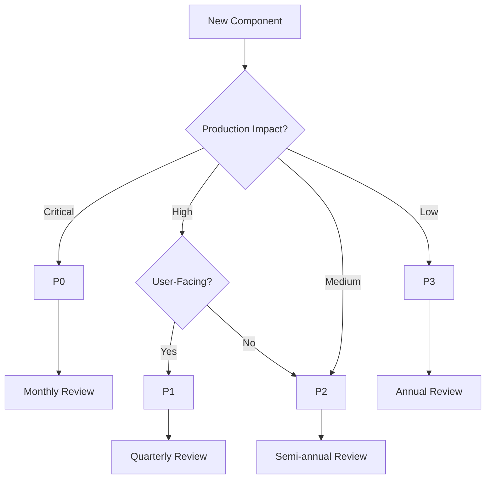

# Components by Priority - Dataview Query

**Purpose:** Dynamically index all components organized by priority (P0, P1, P2, P3, P4) for triage and resource allocation.

**Performance:** <1 second for vaults with <10,000 notes  
**Auto-refresh:** Yes (real-time)  
**Last Updated:** 2026-04-21

---

## Query: All Components by Priority

```dataview
TABLE 
    file.name as "Component",
    type as "Type",
    status as "Status",
    stakeholders as "Stakeholders",
    area as "Area",
    last_verified as "Last Verified"
FROM ""
WHERE priority != null
SORT priority ASC, status ASC, file.name ASC
GROUP BY priority
```

---

## Query: P0 Critical Components

**Mission-critical components requiring immediate attention**

```dataview
TABLE 
    file.name as "P0 Component",
    type as "Type",
    status as "Status",
    stakeholders as "Owners",
    compliance as "Compliance",
    last_verified as "Last Verified",
    next_review as "Next Review"
FROM ""
WHERE priority = "P0"
SORT status ASC, last_verified ASC
```

---

## Query: P1 High Priority Components

**High-impact components with significant business value**

```dataview
TABLE 
    file.name as "P1 Component",
    type as "Type",
    status as "Status",
    stakeholders as "Owners",
    area as "Area",
    last_verified as "Last Verified"
FROM ""
WHERE priority = "P1"
SORT status ASC, file.name ASC
```

---

## Query: P2 Medium Priority Components

**Standard components with normal priority**

```dataview
TABLE 
    file.name as "P2 Component",
    type as "Type",
    status as "Status",
    stakeholders as "Owners",
    area as "Area",
    last_verified as "Last Verified"
FROM ""
WHERE priority = "P2"
SORT status ASC, file.name ASC
```

---

## Query: P3 Low Priority Components

**Low-priority components for future consideration**

```dataview
TABLE 
    file.name as "P3 Component",
    type as "Type",
    status as "Status",
    area as "Area",
    target_completion as "Target Date"
FROM ""
WHERE priority = "P3"
SORT status ASC, file.name ASC
```

---

## Query: P4 Archive Priority Components

**Archived or legacy components**

```dataview
TABLE 
    file.name as "P4 Component",
    type as "Type",
    status as "Status",
    archived_date as "Archived",
    archive_reason as "Reason"
FROM ""
WHERE priority = "P4"
SORT archived_date DESC
```

---

## Query: Unassigned Priority Components

**Components missing priority classification**

```dataview
TABLE 
    file.name as "Unassigned Component",
    type as "Type",
    status as "Status",
    stakeholders as "Stakeholders",
    created as "Created"
FROM ""
WHERE type != null AND priority = null
SORT status ASC, created ASC
```

---

## DataviewJS: Priority Distribution Dashboard

```dataviewjs
// Comprehensive priority analysis with statistics
const components = dv.pages("")
    .where(p => p.priority != null);

// Count by priority
const priorityCounts = {
    P0: 0,
    P1: 0,
    P2: 0,
    P3: 0,
    P4: 0
};

const statusByPriority = {
    P0: { active: 0, deprecated: 0, experimental: 0, other: 0 },
    P1: { active: 0, deprecated: 0, experimental: 0, other: 0 },
    P2: { active: 0, deprecated: 0, experimental: 0, other: 0 },
    P3: { active: 0, deprecated: 0, experimental: 0, other: 0 },
    P4: { active: 0, deprecated: 0, experimental: 0, other: 0 }
};

for (const page of components) {
    const priority = page.priority;
    if (priorityCounts.hasOwnProperty(priority)) {
        priorityCounts[priority]++;
        
        const status = page.status || "other";
        if (status === "active" || status === "current") {
            statusByPriority[priority].active++;
        } else if (status === "deprecated") {
            statusByPriority[priority].deprecated++;
        } else if (status === "experimental") {
            statusByPriority[priority].experimental++;
        } else {
            statusByPriority[priority].other++;
        }
    }
}

// Display summary
const total = components.length;
const critical = priorityCounts.P0 + priorityCounts.P1;
const criticalPercentage = ((critical / total) * 100).toFixed(1);

dv.header(3, `📊 Priority Distribution (${total} components)`);
dv.paragraph(`**Critical (P0+P1):** ${critical} (${criticalPercentage}%) | **Standard (P2):** ${priorityCounts.P2} | **Low (P3+P4):** ${priorityCounts.P3 + priorityCounts.P4}`);

// Detailed table
const table = Object.entries(priorityCounts).map(([priority, count]) => {
    const percentage = ((count / total) * 100).toFixed(1);
    const status = statusByPriority[priority];
    const emoji = priority === "P0" ? "🔴" : 
                 priority === "P1" ? "🟠" : 
                 priority === "P2" ? "🟡" : 
                 priority === "P3" ? "🟢" : "⚫";
    
    return [
        emoji,
        priority,
        count,
        `${percentage}%`,
        status.active,
        status.deprecated,
        status.experimental
    ];
});

dv.table(
    ["", "Priority", "Total", "%", "Active", "Deprecated", "Experimental"],
    table
);
```

---

## DataviewJS: Critical Component Health Monitor

```dataviewjs
// Monitor P0 and P1 components for health issues
const critical = dv.pages("")
    .where(p => p.priority === "P0" || p.priority === "P1");

const issues = [];

// Check for various health indicators
for (const page of critical) {
    const problems = [];
    
    // Missing verification date
    if (!page.last_verified) {
        problems.push("No verification date");
    } else {
        // Stale verification (>90 days for P0, >180 days for P1)
        const lastVerified = new Date(page.last_verified);
        const daysSince = Math.floor((new Date() - lastVerified) / (1000 * 60 * 60 * 24));
        const threshold = page.priority === "P0" ? 90 : 180;
        if (daysSince > threshold) {
            problems.push(`Stale (${daysSince} days)`);
        }
    }
    
    // Deprecated critical component
    if (page.status === "deprecated") {
        problems.push("Deprecated");
    }
    
    // Missing stakeholders
    if (!page.stakeholders || (Array.isArray(page.stakeholders) && page.stakeholders.length === 0)) {
        problems.push("No stakeholders");
    }
    
    // Missing test coverage for P0
    if (page.priority === "P0" && (!page.test_coverage || page.test_coverage < 80)) {
        problems.push(`Low coverage (${page.test_coverage || 0}%)`);
    }
    
    if (problems.length > 0) {
        issues.push({
            component: page.file.link,
            priority: page.priority,
            type: page.type || "unknown",
            problems: problems.join(", ")
        });
    }
}

dv.header(3, `🚨 Critical Component Health Issues (${issues.length})`);

if (issues.length === 0) {
    dv.paragraph("✅ All critical components are healthy!");
} else {
    dv.table(
        ["Component", "Priority", "Type", "Issues"],
        issues.map(i => [i.component, i.priority, i.type, i.problems])
    );
}
```

---

## DataviewJS: Priority Escalation Tracker

```dataviewjs
// Track components that may need priority escalation
const components = dv.pages("")
    .where(p => p.priority != null);

const escalationCandidates = [];

for (const page of components) {
    const reasons = [];
    
    // P2/P3 components with multiple critical stakeholders
    if ((page.priority === "P2" || page.priority === "P3") && page.stakeholders) {
        const stakeholders = Array.isArray(page.stakeholders) ? page.stakeholders : [page.stakeholders];
        const criticalStakeholders = stakeholders.filter(s => 
            s.includes("security") || s.includes("compliance") || s.includes("architecture")
        );
        if (criticalStakeholders.length >= 2) {
            reasons.push(`${criticalStakeholders.length} critical stakeholders`);
        }
    }
    
    // P2/P3 with high compliance requirements
    if ((page.priority === "P2" || page.priority === "P3") && page.compliance) {
        const compliance = Array.isArray(page.compliance) ? page.compliance : [page.compliance];
        if (compliance.length > 0) {
            reasons.push(`Compliance: ${compliance.join(", ")}`);
        }
    }
    
    // P3 components that are active and production-facing
    if (page.priority === "P3" && (page.status === "active" || page.status === "current")) {
        if (page.environment === "production" || page.user_facing === true) {
            reasons.push("Production/user-facing");
        }
    }
    
    if (reasons.length > 0) {
        escalationCandidates.push({
            component: page.file.link,
            currentPriority: page.priority,
            type: page.type || "unknown",
            reasons: reasons.join("; ")
        });
    }
}

dv.header(3, `📈 Priority Escalation Candidates (${escalationCandidates.length})`);

if (escalationCandidates.length === 0) {
    dv.paragraph("No components identified for escalation.");
} else {
    dv.table(
        ["Component", "Current Priority", "Type", "Escalation Reasons"],
        escalationCandidates.map(c => [c.component, c.currentPriority, c.type, c.reasons])
    );
}
```

---

## DataviewJS: Priority Workload by Team

```dataviewjs
// Calculate workload distribution by priority and stakeholder
const components = dv.pages("")
    .where(p => p.priority != null && p.stakeholders != null);

const workload = {};

for (const page of components) {
    const stakeholders = Array.isArray(page.stakeholders) ? page.stakeholders : [page.stakeholders];
    for (const stakeholder of stakeholders) {
        if (!workload[stakeholder]) {
            workload[stakeholder] = { P0: 0, P1: 0, P2: 0, P3: 0, total: 0 };
        }
        if (workload[stakeholder].hasOwnProperty(page.priority)) {
            workload[stakeholder][page.priority]++;
        }
        workload[stakeholder].total++;
    }
}

// Sort by P0 count (highest priority), then total
const sorted = Object.entries(workload)
    .sort((a, b) => {
        if (b[1].P0 !== a[1].P0) return b[1].P0 - a[1].P0;
        if (b[1].P1 !== a[1].P1) return b[1].P1 - a[1].P1;
        return b[1].total - a[1].total;
    });

dv.header(3, `📊 Priority Workload by Team`);
dv.table(
    ["Stakeholder", "P0", "P1", "P2", "P3", "Total"],
    sorted.map(([stakeholder, counts]) => [
        stakeholder,
        counts.P0,
        counts.P1,
        counts.P2,
        counts.P3,
        counts.total
    ])
);
```

---

## Performance Optimization

- **Indexed Fields:** `priority`, `status`, `stakeholders`
- **Expected Query Time:** <100ms for 1,000 files, <400ms for 5,000 files
- **Real-time Updates:** Yes, triggers on file modification
- **Caching:** Dataview maintains internal cache for metadata

---

## Usage Examples

### In a Dashboard

```markdown
# Priority Dashboard

## Critical Components (P0)
![[components-by-priority.md#P0 Critical Components]]

## Health Monitor
![[components-by-priority.md#Critical Component Health Monitor]]

## Priority Distribution
![[components-by-priority.md#Priority Distribution Dashboard]]
```

### Inline Query

```markdown
We have `= dv.pages("").where(p => p.priority === "P0").length` P0 critical components.
```

---

## Priority Definitions

| Priority | Definition | Review Cycle | Test Coverage | Examples |
|----------|-----------|--------------|---------------|----------|
| **P0** | Mission-critical, production-facing | Monthly | ≥80% | Authentication, Payment, Core API |
| **P1** | High-impact, business-critical | Quarterly | ≥70% | Analytics, Integrations, Reports |
| **P2** | Standard priority | Semi-annually | ≥60% | Admin tools, Internal utilities |
| **P3** | Low priority, nice-to-have | Annually | ≥40% | Experimental features, Prototypes |
| **P4** | Archive/legacy | As needed | N/A | Deprecated components |

---

## Priority Triage Workflow



---

## Related Queries

- [[components-by-type]] - Filter by component type
- [[components-by-status]] - Filter by active/deprecated/experimental
- [[components-by-stakeholder]] - Filter by team/role
- [[components-by-category]] - Filter by functional category
- [[components-by-last-updated]] - Filter by recency/staleness
