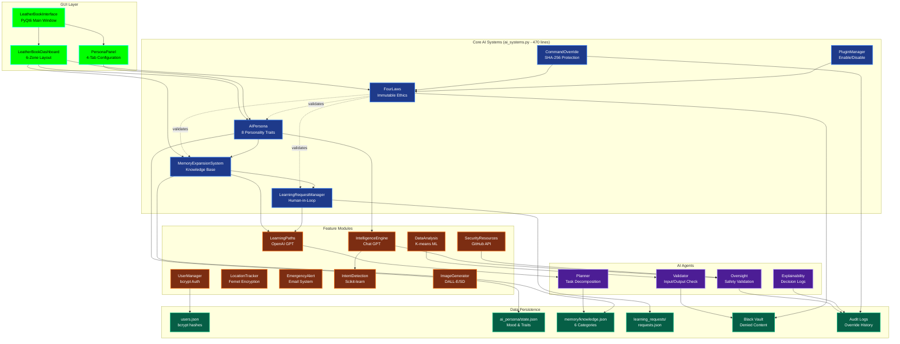

# Core AI Systems Architecture



## Architecture Notes

### Six Integrated AI Systems

All six core systems reside in `src/app/core/ai_systems.py` (470 lines) for cohesive integration:

1. **FourLaws** (Lines 1-120): Validates all actions against Asimov's Laws hierarchy
2. **AIPersona** (Lines 125-230): 8 personality traits, mood tracking, interaction counts
3. **MemoryExpansionSystem** (Lines 235-295): Conversation logs, 6-category knowledge base
4. **LearningRequestManager** (Lines 300-335): Human approval workflow, Black Vault for denied content
5. **CommandOverride** (Lines 400-470): Master password system with audit logging
6. **PluginManager** (Lines 340-395): Simple enable/disable plugin system

### Data Persistence Pattern

- **JSON-based**: All systems use JSON files in `data/` directory
- **Atomic saves**: Every state mutation calls `_save_state()` or `save_users()`
- **Isolated testing**: All constructors accept `data_dir` parameter for test isolation
- **Encryption**: Sensitive data uses Fernet (location history, cloud sync)

### Validation Flow

```
User Action → FourLaws.validate_action() → Context Evaluation → Allow/Deny
              ↓                              ↓
          Log to Audit                   Check Black Vault
```

### Integration Points

- **OpenAI**: `learning_paths.py`, `intelligence_engine.py`, `image_generator.py`
- **Hugging Face**: `image_generator.py` (Stable Diffusion 2.1)
- **GitHub API**: `security_resources.py` (CTF/security repos)
- **IP Geolocation**: `location_tracker.py` (encrypted GPS history)

### Module Import Pattern

```python
from app.core.ai_systems import FourLaws, AIPersona, MemoryExpansionSystem
from app.core.user_manager import UserManager
from app.agents.oversight import OversightAgent
```

**Critical**: Always use `python -m src.app.main` (not `python src/app/main.py`) for correct PYTHONPATH resolution.
