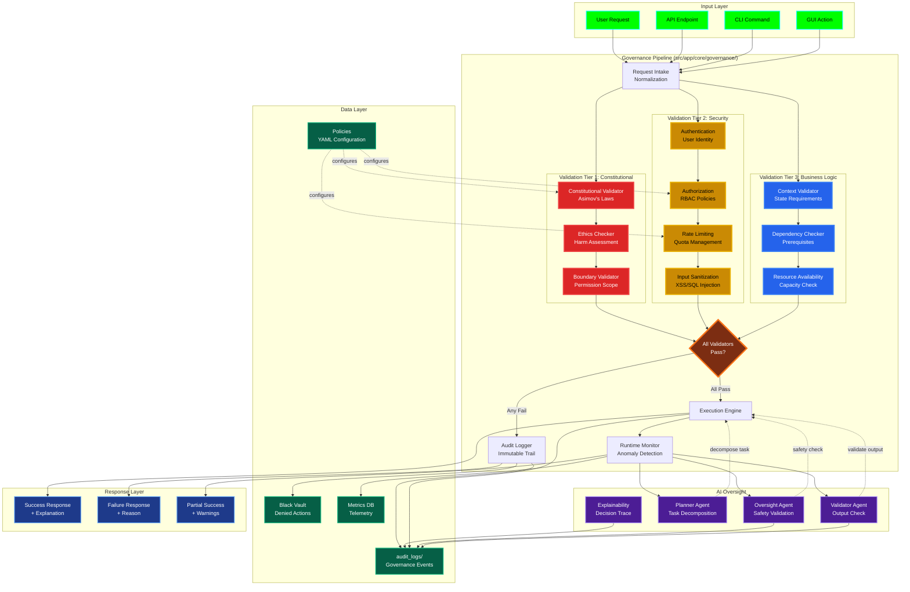

# Governance Pipeline Architecture



## Pipeline Flow

### 1. Request Intake (Normalization)

All requests are normalized to a standard format:

```python
{
    "action": str,          # What operation
    "context": dict,        # Environmental state
    "user_id": str,         # Who initiated
    "timestamp": datetime,  # When requested
    "metadata": dict        # Additional info
}
```

### 2. Three-Tier Validation

**Tier 1: Constitutional (Highest Priority)**
- Validates against Asimov's Three Laws
- Checks for harm to humans, humanity, self-preservation
- Immutable rules enforced at code level

**Tier 2: Security**
- Authentication: User identity verification (bcrypt)
- Authorization: RBAC policy enforcement
- Rate Limiting: Quota management per user/endpoint
- Input Sanitization: XSS, SQL injection, path traversal prevention

**Tier 3: Business Logic**
- Context Validation: Required state/preconditions met
- Dependency Checking: Prerequisites satisfied
- Resource Availability: CPU, memory, API quotas

### 3. Decision Point

All validators must pass for action execution:

```python
is_allowed, reason = governance_pipeline.validate(request)
if not is_allowed:
    audit_log.record_denial(request, reason)
    black_vault.add_fingerprint(request)
    return FailureResponse(reason)
```

### 4. AI Oversight (Runtime)

Four agents monitor execution:

- **Oversight Agent**: Safety validation during execution
- **Planner Agent**: Task decomposition for complex actions
- **Validator Agent**: Output validation before return
- **Explainability Agent**: Decision trace generation

### 5. Audit Trail

Immutable logging of all governance events:

```json
{
    "event_id": "uuid",
    "timestamp": "ISO-8601",
    "action": "requested_action",
    "user_id": "user123",
    "decision": "allowed|denied",
    "validators": {
        "constitutional": "pass",
        "security": "pass",
        "business": "fail"
    },
    "reason": "Insufficient resource quota",
    "fingerprint": "sha256_hash"
}
```

### Black Vault Pattern

Denied actions are fingerprinted (SHA-256) and stored:

```python
content_hash = hashlib.sha256(action.encode()).hexdigest()
if content_hash in black_vault:
    return "This action has been permanently denied"
```

### Policy Configuration

YAML-based policy files in `policies/`:

```yaml
# constitutional_policies.yaml
four_laws:
  priority: 1
  immutable: true
  validators:
    - harm_to_humans: strict
    - harm_to_humanity: strict
    - self_preservation: moderate

# security_policies.yaml
rate_limits:
  api_calls_per_minute: 60
  learning_requests_per_day: 10
  image_generation_per_hour: 5

# rbac_policies.yaml
roles:
  admin:
    permissions: ["*"]
  user:
    permissions: ["read", "execute", "request_learning"]
```

## Integration Points

### Temporal Workflow Integration

```python
# Governance as Temporal Activity
@activity.defn
async def validate_governance(request: dict) -> tuple[bool, str]:
    return await governance_pipeline.validate(request)
```

### Web API Integration

```python
@app.before_request
def governance_middleware():
    request_obj = normalize_request(flask.request)
    is_allowed, reason = governance_pipeline.validate(request_obj)
    if not is_allowed:
        return jsonify({"error": reason}), 403
```

### GUI Integration

```python
# In LeatherBookDashboard
def handle_user_action(self, action: str):
    is_allowed, reason = self.governance.validate_action(
        action,
        context={"is_user_order": True}
    )
    if not is_allowed:
        self.show_error_dialog(reason)
        return
    self.execute_action(action)
```

## Monitoring & Metrics

Runtime telemetry collected:

- **Throughput**: Requests/second, latency percentiles
- **Validation**: Pass/fail rates per tier, common denial reasons
- **Anomalies**: Unusual patterns, potential attacks
- **Resource Usage**: CPU, memory, API quota consumption

Metrics exported to ClickHouse/Prometheus for visualization.
