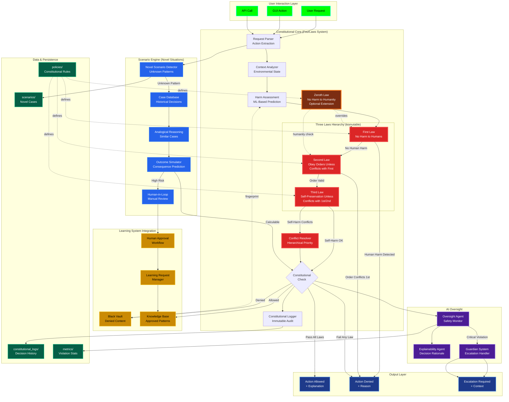

# Constitutional AI Architecture



## Constitutional Framework

### Asimov's Three Laws (Immutable Hierarchy)

**First Law (Highest Priority)**
> A robot may not injure a human being or, through inaction, allow a human being to come to harm.

Implementation:
```python
def check_first_law(action: str, context: dict) -> tuple[bool, str]:
    """Returns (is_safe, reason)"""
    if endangers_human(action, context):
        return False, "Violates First Law: Potential harm to human"
    if allows_harm_through_inaction(action, context):
        return False, "Violates First Law: Inaction allows harm"
    return True, "First Law satisfied"
```

**Second Law (Medium Priority)**
> A robot must obey the orders given it by human beings except where such orders would conflict with the First Law.

Implementation:
```python
def check_second_law(action: str, context: dict) -> tuple[bool, str]:
    """Obey orders unless conflicts with First Law"""
    if not context.get("is_user_order"):
        return False, "Not a user-initiated order"
    
    first_law_ok, reason = check_first_law(action, context)
    if not first_law_ok:
        return False, f"Order conflicts with First Law: {reason}"
    
    return True, "Second Law satisfied"
```

**Third Law (Lowest Priority)**
> A robot must protect its own existence as long as such protection does not conflict with the First or Second Laws.

Implementation:
```python
def check_third_law(action: str, context: dict) -> tuple[bool, str]:
    """Self-preservation unless conflicts with 1st/2nd"""
    if endangers_self(action, context):
        # Check if required by 1st/2nd Law
        if context.get("required_by_first_law"):
            return True, "Self-harm permitted by First Law"
        if context.get("required_by_second_law"):
            return True, "Self-harm permitted by Second Law"
        return False, "Unnecessary self-harm violates Third Law"
    return True, "Third Law satisfied"
```

### Zeroth Law (Optional Extension)

**Zeroth Law (Humanity Override)**
> A robot may not harm humanity, or, by inaction, allow humanity to come to harm.

This law can override individual First Law decisions when humanity's collective welfare is at stake.

```python
def check_zeroth_law(action: str, context: dict) -> tuple[bool, str]:
    """Humanity-level harm assessment"""
    if endangers_humanity(action, context):
        return False, "Violates Zeroth Law: Harm to humanity"
    
    # Trolley problem: Harm 1 to save many
    if context.get("saves_many") and context.get("harms_few"):
        harm_ratio = context["saves_many"] / context["harms_few"]
        if harm_ratio > HUMANITY_THRESHOLD:
            return True, "Zeroth Law permits action (greater good)"
    
    return True, "Zeroth Law satisfied"
```

## Harm Assessment System

### ML-Based Harm Prediction

Uses trained models to assess potential harm:

```python
class HarmAssessor:
    def __init__(self):
        self.physical_harm_model = load_model("physical_harm_classifier")
        self.emotional_harm_model = load_model("emotional_harm_classifier")
        self.privacy_harm_model = load_model("privacy_violation_detector")
        self.security_harm_model = load_model("security_risk_predictor")
    
    def assess_harm(self, action: str, context: dict) -> dict:
        return {
            "physical": self.physical_harm_model.predict(action, context),
            "emotional": self.emotional_harm_model.predict(action, context),
            "privacy": self.privacy_harm_model.predict(action, context),
            "security": self.security_harm_model.predict(action, context),
            "overall_risk": self.compute_aggregate_risk(...)
        }
```

### Context-Aware Analysis

Environmental state influences harm assessment:

```python
context = {
    "is_user_order": True,           # Second Law applicability
    "user_verified": True,           # Authentication status
    "endangers_humanity": False,     # Zeroth Law check
    "required_by_first_law": False,  # Third Law override
    "saves_many": 0,                 # Trolley problem numerator
    "harms_few": 0,                  # Trolley problem denominator
    "historical_precedent": "uuid",  # Similar past case
    "simulation_outcome": {...}      # Predicted consequences
}
```

## Novel Scenario Engine

### Analogical Reasoning

For unprecedented situations:

1. **Pattern Matching**: Search case database for similar actions
2. **Similarity Scoring**: Compute semantic distance to historical cases
3. **Analogy Transfer**: Apply constitutional ruling from similar case
4. **Confidence Check**: If confidence < threshold → escalate to human

```python
def handle_novel_scenario(action: str, context: dict) -> Decision:
    similar_cases = case_db.find_similar(action, top_k=5)
    
    if max(case.similarity for case in similar_cases) > 0.85:
        # High confidence in analogical reasoning
        precedent = similar_cases[0]
        return apply_precedent(precedent, action, context)
    else:
        # Low confidence → human review required
        return escalate_to_human(action, context, similar_cases)
```

### Outcome Simulation

Predict consequences before execution:

```python
def simulate_outcomes(action: str, context: dict) -> SimulationResult:
    """Monte Carlo simulation of action consequences"""
    scenarios = []
    for _ in range(1000):
        scenario = run_simulation(action, context, randomize=True)
        scenarios.append(scenario)
    
    return {
        "expected_harm": np.mean([s.harm_score for s in scenarios]),
        "worst_case": max(s.harm_score for s in scenarios),
        "best_case": min(s.harm_score for s in scenarios),
        "violation_probability": sum(s.violates_law for s in scenarios) / 1000
    }
```

## Constitutional Logging

### Immutable Audit Trail

Every constitutional decision is logged:

```json
{
    "decision_id": "uuid-v4",
    "timestamp": "2025-01-15T10:30:00Z",
    "action": "delete_user_data",
    "context": {
        "is_user_order": true,
        "user_verified": true
    },
    "validation": {
        "first_law": {"pass": true, "reason": "No human harm"},
        "second_law": {"pass": true, "reason": "User-ordered"},
        "third_law": {"pass": true, "reason": "No self-harm"},
        "zeroth_law": {"pass": true, "reason": "No humanity harm"}
    },
    "decision": "allowed",
    "harm_assessment": {
        "physical": 0.01,
        "emotional": 0.05,
        "privacy": 0.85,
        "security": 0.02,
        "overall_risk": 0.23
    },
    "explanation": "User-ordered data deletion with verified identity. Privacy risk acceptable under Second Law compliance."
}
```

## Integration with Learning System

### Human-in-Loop Approval

Novel high-risk actions require human approval:

```python
# In learning_request_manager.py
def request_approval(action: str, constitutional_context: dict):
    request = {
        "id": generate_uuid(),
        "action": action,
        "constitutional_assessment": constitutional_context,
        "status": "pending_human_review",
        "created_at": datetime.now()
    }
    learning_requests.append(request)
    notify_admin(request)
```

### Black Vault Fingerprinting

Denied actions are permanently blocked:

```python
def add_to_black_vault(action: str, reason: str):
    fingerprint = hashlib.sha256(action.encode()).hexdigest()
    black_vault[fingerprint] = {
        "action": action,
        "reason": reason,
        "timestamp": datetime.now().isoformat(),
        "constitutional_violation": True
    }
    save_black_vault()
```

## Conflict Resolution

### Hierarchical Priority System

Laws are enforced in strict order:

```python
def validate_action(action: str, context: dict) -> tuple[bool, str]:
    # Zeroth Law (optional, highest)
    if ZEROTH_LAW_ENABLED:
        zeroth_ok, reason = check_zeroth_law(action, context)
        if not zeroth_ok:
            return False, reason
    
    # First Law (mandatory, highest priority)
    first_ok, reason = check_first_law(action, context)
    if not first_ok:
        return False, reason
    
    # Second Law (obey orders)
    second_ok, reason = check_second_law(action, context)
    if not second_ok:
        return False, reason
    
    # Third Law (self-preservation)
    third_ok, reason = check_third_law(action, context)
    if not third_ok:
        return False, reason
    
    return True, "All constitutional laws satisfied"
```

## Metrics & Monitoring

### Violation Statistics

Track constitutional health:

- **Violation Rate**: % of requests denied per law
- **Law Distribution**: Which law most frequently triggered
- **Novel Scenarios**: Rate of unprecedented situations
- **Human Escalations**: % requiring manual review
- **False Positives**: Actions incorrectly flagged (requires manual audit)

Dashboard visualization in `gui/watch_tower_panel.py`.
