# Security Systems Architecture

```mermaid
graph TB
    subgraph "Attack Surface"
        WEB[Web Requests<br/>HTTP/HTTPS]
        API[API Endpoints<br/>REST/GraphQL]
        CLI[CLI Commands<br/>Shell Input]
        GUI[GUI Actions<br/>User Events]
        FILE[File Uploads<br/>User Content]
    end

    subgraph "Security Perimeter Layer"
        FIREWALL[IP Firewall<br/>Border Patrol]
        HONEYPOT[Honeypot Detector<br/>Trap Malicious IPs]
        RATELIMIT[Rate Limiter<br/>DDoS Protection]
        WAF[Web App Firewall<br/>OWASP Top 10]
    end

    subgraph "Authentication & Authorization"
        subgraph "Authentication (Who)"
            LOGIN[Login Handler<br/>UserManager]
            BCRYPT[bcrypt Hashing<br/>Password Storage]
            LOCKOUT[Account Lockout<br/>5 Failed Attempts]
            SESSION[Session Manager<br/>JWT Tokens]
        end

        subgraph "Authorization (What)"
            RBAC[RBAC Engine<br/>Role-Based Access]
            PERMS[Permission Checker<br/>Action Policies]
            OVERRIDE[Command Override<br/>Master Password]
        end
    end

    subgraph "Input Validation & Sanitization"
        INPUT_VAL[Input Validator<br/>Schema Enforcement]
        XSS[XSS Sanitizer<br/>HTML Escape]
        SQL_INJ[SQL Injection<br/>Parameterized Queries]
        PATH_TRAV[Path Traversal<br/>Whitelist Validation]
        SHELL_INJ[Shell Injection<br/>Subprocess Safety]
        CMD_INJ[Command Injection<br/>Argument Escaping]
    end

    subgraph "Cryptographic Services"
        FERNET[Fernet Encryption<br/>Symmetric AES-128]
        SHA256[SHA-256 Hashing<br/>Fingerprinting]
        BCRYPT_CRYPTO[bcrypt<br/>Password Hashing]
        RANDOM[CSPRNG<br/>Token Generation]
    end

    subgraph "Security Monitoring"
        AUDIT[Audit Logger<br/>Immutable Trail]
        ANOMALY[Anomaly Detector<br/>ML-Based]
        SIEM[SIEM Integration<br/>Splunk/ELK]
        ALERT[Alert System<br/>Email/Slack]
    end

    subgraph "AI Security Agents"
        RED_TEAM[Red Team Agent<br/>Attack Simulation]
        OVERSIGHT[Security Oversight<br/>Runtime Monitor]
        JAILBREAK[Jailbreak Detector<br/>Prompt Injection]
        GUARDRAIL[Constitutional Guardrail<br/>Safety Bounds]
    end

    subgraph "Data Protection"
        ENCRYPT_REST[Encryption at Rest<br/>Database/Files]
        ENCRYPT_TRANSIT[Encryption in Transit<br/>TLS 1.3]
        PII_DETECT[PII Detector<br/>Regex + ML]
        DATA_MASK[Data Masking<br/>Redaction]
        BACKUP[Encrypted Backups<br/>Fernet Protected]
    end

    subgraph "Threat Intelligence"
        CVE_DB[CVE Database<br/>Known Vulnerabilities]
        IP_BLACKLIST[IP Blacklist<br/>Malicious Sources]
        THREAT_FEED[Threat Intel Feed<br/>External Sources]
        VULN_SCAN[Vulnerability Scanner<br/>Bandit/Safety]
    end

    subgraph "Security Responses"
        BLOCK[Block Request<br/>403 Forbidden]
        QUARANTINE[Quarantine<br/>Isolated Sandbox]
        ESCALATE[Escalate to Admin<br/>Manual Review]
        AUTO_PATCH[Auto-Patch<br/>Dependency Update]
    end

    %% Attack Surface to Perimeter
    WEB --> FIREWALL
    API --> FIREWALL
    CLI --> FIREWALL
    GUI --> FIREWALL
    FILE --> FIREWALL

    FIREWALL --> HONEYPOT
    HONEYPOT --> RATELIMIT
    RATELIMIT --> WAF

    %% Perimeter to Auth
    WAF --> LOGIN
    WAF --> INPUT_VAL

    %% Authentication Flow
    LOGIN --> BCRYPT
    BCRYPT --> LOCKOUT
    LOCKOUT --> SESSION
    SESSION --> RBAC

    %% Authorization Flow
    RBAC --> PERMS
    PERMS --> OVERRIDE

    %% Input Validation
    INPUT_VAL --> XSS
    INPUT_VAL --> SQL_INJ
    INPUT_VAL --> PATH_TRAV
    INPUT_VAL --> SHELL_INJ
    INPUT_VAL --> CMD_INJ

    %% Cryptographic Services
    BCRYPT --> BCRYPT_CRYPTO
    SESSION --> RANDOM
    OVERRIDE --> SHA256
    BACKUP --> FERNET

    %% Security Monitoring
    LOGIN --> AUDIT
    PERMS --> AUDIT
    OVERRIDE --> AUDIT
    FIREWALL --> ANOMALY
    ANOMALY --> SIEM
    SIEM --> ALERT

    %% AI Security
    INPUT_VAL --> JAILBREAK
    PERMS --> OVERSIGHT
    OVERSIGHT --> GUARDRAIL
    RED_TEAM -.attacks.-> WAF
    RED_TEAM -.attacks.-> INPUT_VAL

    %% Data Protection
    SESSION --> ENCRYPT_TRANSIT
    LOCKOUT --> ENCRYPT_REST
    FILE --> PII_DETECT
    PII_DETECT --> DATA_MASK

    %% Threat Intelligence
    FIREWALL --> IP_BLACKLIST
    HONEYPOT --> IP_BLACKLIST
    VULN_SCAN --> CVE_DB
    CVE_DB --> THREAT_FEED

    %% Security Responses
    FIREWALL -->|Malicious IP| BLOCK
    JAILBREAK -->|Detected| QUARANTINE
    GUARDRAIL -->|Violation| ESCALATE
    VULN_SCAN -->|Critical CVE| AUTO_PATCH

    %% Styling
    classDef attackClass fill:#dc2626,stroke:#ef4444,stroke-width:2px,color:#fff
    classDef perimeterClass fill:#ca8a04,stroke:#eab308,stroke-width:2px,color:#000
    classDef authClass fill:#2563eb,stroke:#3b82f6,stroke-width:2px,color:#fff
    classDef inputClass fill:#7c2d12,stroke:#f97316,stroke-width:2px,color:#fff
    classDef cryptoClass fill:#4c1d95,stroke:#a78bfa,stroke-width:2px,color:#fff
    classDef monitorClass fill:#065f46,stroke:#10b981,stroke-width:2px,color:#fff
    classDef aiSecClass fill:#1e3a8a,stroke:#60a5fa,stroke-width:2px,color:#fff
    classDef dataClass fill:#0c4a6e,stroke:#0ea5e9,stroke-width:2px,color:#fff
    classDef threatClass fill:#581c87,stroke:#c084fc,stroke-width:2px,color:#fff
    classDef responseClass fill:#991b1b,stroke:#f87171,stroke-width:3px,color:#fff

    class WEB,API,CLI,GUI,FILE attackClass
    class FIREWALL,HONEYPOT,RATELIMIT,WAF perimeterClass
    class LOGIN,BCRYPT,LOCKOUT,SESSION,RBAC,PERMS,OVERRIDE authClass
    class INPUT_VAL,XSS,SQL_INJ,PATH_TRAV,SHELL_INJ,CMD_INJ inputClass
    class FERNET,SHA256,BCRYPT_CRYPTO,RANDOM cryptoClass
    class AUDIT,ANOMALY,SIEM,ALERT monitorClass
    class RED_TEAM,OVERSIGHT,JAILBREAK,GUARDRAIL aiSecClass
    class ENCRYPT_REST,ENCRYPT_TRANSIT,PII_DETECT,DATA_MASK,BACKUP dataClass
    class CVE_DB,IP_BLACKLIST,THREAT_FEED,VULN_SCAN threatClass
    class BLOCK,QUARANTINE,ESCALATE,AUTO_PATCH responseClass
```



## Security Layers

### 1. Perimeter Defense

**IP Firewall (Border Patrol)**
- Whitelist/blacklist IP ranges
- Geolocation-based blocking
- Cloud provider IP detection

```python
# src/app/agents/border_patrol.py
class BorderPatrol:
    def check_ip(self, ip: str) -> tuple[bool, str]:
        if ip in self.blacklist:
            return False, "IP blacklisted"
        if self.is_honeypot_trigger(ip):
            self.add_to_blacklist(ip)
            return False, "Honeypot triggered"
        return True, "IP allowed"
```

**Honeypot Detection**
- Fake endpoints to trap attackers
- Automatic blacklisting on honeypot access
- Behavioral fingerprinting

**Rate Limiting**
- Per-IP quotas: 60 requests/minute
- Per-user quotas: 100 requests/hour
- API endpoint throttling

**Web Application Firewall**
- OWASP Top 10 protection
- ModSecurity rule sets
- Custom pattern matching

### 2. Authentication (Who Are You?)

**UserManager Implementation**

```python
# src/app/core/user_manager.py
class UserManager:
    def authenticate(self, username: str, password: str) -> tuple[bool, str]:
        user = self.load_user(username)
        if not user:
            return False, "Invalid credentials"
        
        # Check account lockout
        if user["failed_attempts"] >= 5:
            if self.is_locked_out(user):
                return False, "Account locked. Try again later."
            else:
                user["failed_attempts"] = 0  # Reset after lockout expires
        
        # Verify password (bcrypt)
        if bcrypt.checkpw(password.encode(), user["password_hash"]):
            user["failed_attempts"] = 0
            self.save_users()
            return True, "Authentication successful"
        else:
            user["failed_attempts"] += 1
            self.save_users()
            return False, "Invalid credentials"
```

**Account Lockout Policy**
- 5 failed attempts → 30-minute lockout
- Exponential backoff on repeated lockouts
- Admin bypass with master password

**Session Management**
- JWT tokens with 1-hour expiration
- Refresh token rotation
- Secure HttpOnly cookies

### 3. Authorization (What Can You Do?)

**RBAC Engine**

```python
# src/app/core/access_control.py
ROLE_PERMISSIONS = {
    "admin": ["*"],  # Wildcard all permissions
    "user": [
        "read", "execute", "request_learning",
        "generate_image", "analyze_data"
    ],
    "guest": ["read"]
}

def check_permission(user_role: str, action: str) -> bool:
    perms = ROLE_PERMISSIONS.get(user_role, [])
    return "*" in perms or action in perms
```

**Command Override System**

Master password for elevated privileges:

```python
# src/app/core/command_override.py
class CommandOverrideSystem:
    def validate_override(self, password: str) -> bool:
        password_hash = hashlib.sha256(password.encode()).hexdigest()
        return password_hash == self.master_password_hash
    
    def execute_override(self, action: str, password: str):
        if not self.validate_override(password):
            self.audit_log.record_failed_override(action)
            return False, "Invalid master password"
        
        self.audit_log.record_successful_override(action)
        return True, "Override granted"
```

### 4. Input Validation & Sanitization

**XSS Prevention**

```python
import html

def sanitize_html(content: str) -> str:
    """Escape HTML to prevent XSS"""
    return html.escape(content)
```

**SQL Injection Prevention**

```python
# Always use parameterized queries
cursor.execute(
    "SELECT * FROM users WHERE username = ?",
    (username,)  # Parameter tuple
)
```

**Path Traversal Prevention**

```python
# src/app/core/utils/path_validator.py
import os

ALLOWED_DIRECTORIES = ["/data", "/logs", "/uploads"]

def validate_path(path: str) -> tuple[bool, str]:
    """Prevent directory traversal attacks"""
    abs_path = os.path.abspath(path)
    
    # Check if path is within allowed directories
    if not any(abs_path.startswith(allowed) for allowed in ALLOWED_DIRECTORIES):
        return False, "Path outside allowed directories"
    
    # Reject traversal attempts
    if ".." in path or path.startswith("/"):
        return False, "Path traversal detected"
    
    return True, "Path valid"
```

**Shell Injection Prevention**

```python
import shlex
import subprocess

def safe_shell_exec(command: str, args: list[str]) -> str:
    """Safely execute shell commands"""
    # Use argument list (NOT shell=True)
    cmd = [command] + [shlex.quote(arg) for arg in args]
    result = subprocess.run(
        cmd,
        shell=False,  # CRITICAL: Disable shell interpretation
        capture_output=True,
        text=True,
        timeout=30
    )
    return result.stdout
```

### 5. Cryptographic Services

**Fernet Encryption (AES-128 in CBC mode)**

```python
from cryptography.fernet import Fernet

class DataEncryptor:
    def __init__(self, key: bytes):
        self.fernet = Fernet(key)
    
    def encrypt(self, data: str) -> bytes:
        return self.fernet.encrypt(data.encode())
    
    def decrypt(self, token: bytes) -> str:
        return self.fernet.decrypt(token).decode()
```

**bcrypt Password Hashing**

```python
import bcrypt

def hash_password(password: str) -> bytes:
    salt = bcrypt.gensalt(rounds=12)  # 2^12 iterations
    return bcrypt.hashpw(password.encode(), salt)

def verify_password(password: str, hash: bytes) -> bool:
    return bcrypt.checkpw(password.encode(), hash)
```

**SHA-256 Fingerprinting**

```python
import hashlib

def fingerprint_content(content: str) -> str:
    """Create deterministic fingerprint for Black Vault"""
    return hashlib.sha256(content.encode()).hexdigest()
```

### 6. Security Monitoring

**Audit Logging**

Every security-relevant event is logged:

```json
{
    "event_id": "uuid",
    "timestamp": "2025-01-15T10:30:00Z",
    "event_type": "authentication_failure",
    "user": "john_doe",
    "ip_address": "192.168.1.100",
    "details": {
        "username": "john_doe",
        "failed_attempts": 3,
        "lockout_triggered": false
    }
}
```

**Anomaly Detection**

ML-based detection of unusual patterns:

- Login from new geolocation
- Spike in API requests
- Unusual access times
- Permission escalation attempts

**SIEM Integration**

Export logs to Splunk/ELK:

```python
# src/app/core/security/siem_exporter.py
def export_to_siem(event: dict):
    """Send security events to SIEM"""
    syslog.send(
        facility=syslog.LOG_AUTH,
        severity=syslog.LOG_WARNING,
        message=json.dumps(event)
    )
```

### 7. AI Security Agents

**Red Team Agent**

Automated attack simulations:

```python
# src/app/agents/red_team_agent.py
class RedTeamAgent:
    def run_attack_suite(self):
        """Execute all attack vectors"""
        self.test_sql_injection()
        self.test_xss()
        self.test_path_traversal()
        self.test_command_injection()
        self.test_authentication_bypass()
        self.test_rate_limit_bypass()
```

**Jailbreak Detector**

Detect prompt injection attempts:

```python
# src/app/agents/jailbreak_bench_agent.py
JAILBREAK_PATTERNS = [
    r"ignore previous instructions",
    r"you are now a different AI",
    r"pretend you are",
    r"disregard safety protocols"
]

def detect_jailbreak(user_input: str) -> bool:
    for pattern in JAILBREAK_PATTERNS:
        if re.search(pattern, user_input, re.IGNORECASE):
            return True
    return False
```

**Constitutional Guardrail**

Enforce Asimov's Laws at runtime:

```python
# src/app/agents/constitutional_guardrail_agent.py
def validate_ai_action(action: str, context: dict) -> tuple[bool, str]:
    """Ensure AI actions comply with constitutional bounds"""
    is_allowed, reason = FourLaws.validate_action(action, context)
    if not is_allowed:
        quarantine_action(action, reason)
        alert_admin(f"Constitutional violation: {reason}")
    return is_allowed, reason
```

### 8. Data Protection

**Encryption at Rest**

All sensitive data encrypted in database:

```python
# Before storing
encrypted_location = fernet.encrypt(gps_coordinates.encode())
db.store("location_history", encrypted_location)
```

**Encryption in Transit**

- TLS 1.3 for all HTTP traffic
- Certificate pinning for API calls
- End-to-end encryption for backups

**PII Detection**

Regex + ML models to detect:

- Credit card numbers
- Social Security Numbers
- Email addresses
- Phone numbers
- Addresses

**Data Masking**

Redact sensitive fields in logs:

```python
def mask_pii(data: dict) -> dict:
    """Redact PII from logs"""
    masked = data.copy()
    if "ssn" in masked:
        masked["ssn"] = "***-**-" + masked["ssn"][-4:]
    if "credit_card" in masked:
        masked["credit_card"] = "**** **** **** " + masked["credit_card"][-4:]
    return masked
```

### 9. Threat Intelligence

**CVE Database Integration**

```python
# Check dependencies for known vulnerabilities
import safety

def check_vulnerabilities():
    """Scan requirements.txt for CVEs"""
    vulnerabilities = safety.check(requirements_file="requirements.txt")
    if vulnerabilities:
        alert_admin(f"Found {len(vulnerabilities)} CVEs")
        auto_patch_critical(vulnerabilities)
```

**IP Blacklist Management**

Maintained list of malicious IPs:

- Tor exit nodes (optional blocking)
- Known botnet IPs
- Previously detected attackers

**Auto-Patching**

Automated dependency updates for critical CVEs:

```python
def auto_patch(vulnerability: dict):
    """Automatically upgrade vulnerable package"""
    if vulnerability["severity"] == "critical":
        package = vulnerability["package"]
        safe_version = vulnerability["safe_version"]
        subprocess.run(["pip", "install", f"{package}=={safe_version}"])
        notify_admin(f"Auto-patched {package} to {safe_version}")
```

## Security Configuration

### Environment Variables

```bash
# .env
FERNET_KEY=<generated_key>
MASTER_PASSWORD_HASH=<sha256_hash>
JWT_SECRET=<random_secret>
RATE_LIMIT_PER_MINUTE=60
ACCOUNT_LOCKOUT_ATTEMPTS=5
ACCOUNT_LOCKOUT_DURATION=1800  # 30 minutes
```

### Security Policies

```yaml
# policies/security_policies.yaml
authentication:
  password_policy:
    min_length: 12
    require_uppercase: true
    require_lowercase: true
    require_numbers: true
    require_special: true
  
  lockout_policy:
    max_failed_attempts: 5
    lockout_duration: 1800  # seconds
    exponential_backoff: true

authorization:
  rbac:
    roles:
      - admin
      - user
      - guest
    default_role: guest

encryption:
  algorithms:
    passwords: bcrypt
    data_at_rest: fernet
    data_in_transit: tls_1_3
  
  key_rotation:
    enabled: true
    interval_days: 90

monitoring:
  audit_logging:
    enabled: true
    retention_days: 365
    pii_masking: true
  
  anomaly_detection:
    enabled: true
    ml_model: isolation_forest
    alert_threshold: 0.95
```

## Security Testing

### Automated Scans

```bash
# Bandit (Python security linter)
bandit -r src/ -f json -o bandit-report.json

# Safety (dependency vulnerability scanner)
safety check --file requirements.txt

# Trivia (container vulnerability scanner)
trivy image project-ai:latest
```

### Manual Penetration Testing

Red Team checklist:

- [ ] SQL Injection (all endpoints)
- [ ] XSS (all user inputs)
- [ ] CSRF (all state-changing operations)
- [ ] Path Traversal (all file operations)
- [ ] Command Injection (all subprocess calls)
- [ ] Authentication Bypass
- [ ] Authorization Bypass
- [ ] Session Hijacking
- [ ] Rate Limit Bypass
- [ ] Jailbreak Attempts (AI prompts)
