# Agent Systems Architecture

```mermaid
graph TB
    subgraph "Agent Ecosystem"
        REGISTRY[Agent Registry<br/>Central Coordinator]
        
        subgraph "Core Agents (Tier 1)"
            OVERSIGHT[Oversight Agent<br/>Safety Validation]
            PLANNER[Planner Agent<br/>Task Decomposition]
            VALIDATOR[Validator Agent<br/>Input/Output Check]
            EXPLAIN[Explainability Agent<br/>Decision Trace]
        end
        
        subgraph "Security Agents (Tier 2)"
            RED_TEAM[Red Team Agent<br/>Attack Simulation]
            JAILBREAK[Jailbreak Detector<br/>Prompt Injection]
            GUARDRAIL[Constitutional Guardrail<br/>Law Enforcement]
            BORDER_PATROL[Border Patrol<br/>IP Firewall]
        end
        
        subgraph "Development Agents (Tier 3)"
            REFACTOR[Refactor Agent<br/>Code Improvement]
            TEST_GEN[Test Generator<br/>QA Automation]
            DOC_GEN[Documentation Agent<br/>Auto-Docs]
            CI_CHECKER[CI Checker<br/>Pipeline Validation]
        end
        
        subgraph "Knowledge Agents (Tier 4)"
            RETRIEVAL[Retrieval Agent<br/>RAG System]
            CURATOR[Knowledge Curator<br/>KB Management]
            LONG_CONTEXT[Long Context Agent<br/>100K+ Tokens]
            EXPERT[Expert Agent<br/>Domain Specialist]
        end
        
        subgraph "Specialized Agents (Tier 5)"
            ALPHA_RED[Alpha Red<br/>Advanced Adversary]
            CODEX_DEUS[Codex Deus Maximus<br/>Code Oracle]
            CONSIGLIERE[Consigliere<br/>Strategic Advisor]
            TARL_PROTECTOR[TARL Protector<br/>Language Validator]
        end
    end

    subgraph "Agent Infrastructure"
        SANDBOX[Sandbox Runner<br/>Isolated Execution]
        WORKER[Sandbox Worker<br/>Process Pool]
        ROLLBACK[Rollback Agent<br/>State Recovery]
        UX_TELEMETRY[UX Telemetry<br/>User Behavior]
    end

    subgraph "Communication Layer"
        MESSAGE_BUS[Message Bus<br/>Event Stream]
        TASK_QUEUE[Task Queue<br/>Work Distribution]
        RESULT_CACHE[Result Cache<br/>Shared State]
    end

    subgraph "Governance Integration"
        FOUR_LAWS[FourLaws System<br/>Constitutional]
        AUDIT_LOG[Audit Logger<br/>Agent Actions]
        POLICY_ENGINE[Policy Engine<br/>Agent Permissions]
    end

    subgraph "Data Sources"
        KB[Knowledge Base<br/>6 Categories]
        CODE_REPO[Code Repository<br/>Git Integration]
        METRICS[Metrics DB<br/>Performance Data]
        LOGS[Log Storage<br/>Historical Data]
    end

    %% Registry Coordination
    REGISTRY --> OVERSIGHT
    REGISTRY --> PLANNER
    REGISTRY --> VALIDATOR
    REGISTRY --> EXPLAIN
    REGISTRY --> RED_TEAM
    REGISTRY --> JAILBREAK
    REGISTRY --> GUARDRAIL
    REGISTRY --> BORDER_PATROL
    REGISTRY --> REFACTOR
    REGISTRY --> TEST_GEN
    REGISTRY --> DOC_GEN
    REGISTRY --> CI_CHECKER
    REGISTRY --> RETRIEVAL
    REGISTRY --> CURATOR
    REGISTRY --> LONG_CONTEXT
    REGISTRY --> EXPERT
    REGISTRY --> ALPHA_RED
    REGISTRY --> CODEX_DEUS
    REGISTRY --> CONSIGLIERE
    REGISTRY --> TARL_PROTECTOR

    %% Core Agent Interactions
    OVERSIGHT -.validates.-> PLANNER
    PLANNER -.decomposes.-> VALIDATOR
    VALIDATOR -.checks.-> EXPLAIN
    EXPLAIN -.logs.-> AUDIT_LOG

    %% Security Agent Chain
    BORDER_PATROL --> JAILBREAK
    JAILBREAK --> GUARDRAIL
    GUARDRAIL --> RED_TEAM
    RED_TEAM -.attacks.-> OVERSIGHT

    %% Development Agent Pipeline
    REFACTOR --> TEST_GEN
    TEST_GEN --> CI_CHECKER
    CI_CHECKER --> DOC_GEN

    %% Knowledge Agent Flow
    RETRIEVAL --> CURATOR
    CURATOR --> KB
    LONG_CONTEXT --> RETRIEVAL
    EXPERT --> CURATOR

    %% Specialized Agent Integration
    ALPHA_RED -.advanced attacks.-> RED_TEAM
    CODEX_DEUS -.code oracle.-> REFACTOR
    CONSIGLIERE -.strategic advice.-> PLANNER
    TARL_PROTECTOR -.language validation.-> VALIDATOR

    %% Infrastructure Integration
    REGISTRY --> SANDBOX
    SANDBOX --> WORKER
    WORKER --> ROLLBACK
    UX_TELEMETRY -.monitors.-> REGISTRY

    %% Communication Layer
    REGISTRY --> MESSAGE_BUS
    MESSAGE_BUS --> TASK_QUEUE
    TASK_QUEUE --> RESULT_CACHE

    %% Governance Enforcement
    FOUR_LAWS -.governs.-> REGISTRY
    REGISTRY --> AUDIT_LOG
    POLICY_ENGINE -.controls.-> REGISTRY

    %% Data Access
    RETRIEVAL --> KB
    DOC_GEN --> CODE_REPO
    CI_CHECKER --> METRICS
    OVERSIGHT --> LOGS

    %% Styling
    classDef tier1Class fill:#1e3a8a,stroke:#3b82f6,stroke-width:3px,color:#fff
    classDef tier2Class fill:#dc2626,stroke:#ef4444,stroke-width:3px,color:#fff
    classDef tier3Class fill:#065f46,stroke:#10b981,stroke-width:2px,color:#fff
    classDef tier4Class fill:#7c2d12,stroke:#f97316,stroke-width:2px,color:#fff
    classDef tier5Class fill:#4c1d95,stroke:#a78bfa,stroke-width:2px,color:#fff
    classDef infraClass fill:#0c4a6e,stroke:#0ea5e9,stroke-width:2px,color:#fff
    classDef commClass fill:#581c87,stroke:#c084fc,stroke-width:2px,color:#fff
    classDef govClass fill:#991b1b,stroke:#f87171,stroke-width:2px,color:#fff
    classDef dataClass fill:#ca8a04,stroke:#eab308,stroke-width:2px,color:#000

    class OVERSIGHT,PLANNER,VALIDATOR,EXPLAIN tier1Class
    class RED_TEAM,JAILBREAK,GUARDRAIL,BORDER_PATROL tier2Class
    class REFACTOR,TEST_GEN,DOC_GEN,CI_CHECKER tier3Class
    class RETRIEVAL,CURATOR,LONG_CONTEXT,EXPERT tier4Class
    class ALPHA_RED,CODEX_DEUS,CONSIGLIERE,TARL_PROTECTOR tier5Class
    class SANDBOX,WORKER,ROLLBACK,UX_TELEMETRY infraClass
    class MESSAGE_BUS,TASK_QUEUE,RESULT_CACHE commClass
    class FOUR_LAWS,AUDIT_LOG,POLICY_ENGINE govClass
    class KB,CODE_REPO,METRICS,LOGS dataClass
```



## Agent Tiers

### Tier 1: Core Agents (Always Active)

**Oversight Agent** (`src/app/agents/oversight.py`)

Validates all actions for safety:

```python
class OversightAgent:
    """Monitors all AI actions for safety compliance"""
    
    def __init__(self):
        self.four_laws = FourLaws()
        self.audit_log = AuditLogger()
    
    def validate_action(self, action: str, context: dict) -> tuple[bool, str]:
        """Check if action is safe to execute"""
        # Constitutional validation
        is_allowed, reason = self.four_laws.validate_action(action, context)
        
        if not is_allowed:
            self.audit_log.record_denial(action, reason)
            return False, reason
        
        # Additional safety checks
        if self.is_high_risk(action):
            return self.request_human_approval(action, context)
        
        self.audit_log.record_approval(action)
        return True, "Action approved"
    
    def is_high_risk(self, action: str) -> bool:
        """Detect potentially dangerous operations"""
        risk_keywords = ["delete", "drop", "format", "rm -rf", "sudo"]
        return any(keyword in action.lower() for keyword in risk_keywords)
```

**Planner Agent** (`src/app/agents/planner_agent.py`)

Decomposes complex tasks:

```python
class PlannerAgent:
    """Breaks down complex tasks into executable subtasks"""
    
    def decompose_task(self, task: str) -> list[dict]:
        """Create execution plan with dependencies"""
        # Use GPT-4 to analyze task
        prompt = f"""
        Decompose this task into subtasks with dependencies:
        Task: {task}
        
        Return JSON array of subtasks with:
        - id: unique identifier
        - description: what to do
        - dependencies: list of prerequisite task IDs
        - estimated_duration: minutes
        """
        
        response = openai.ChatCompletion.create(
            model="gpt-4",
            messages=[{"role": "user", "content": prompt}]
        )
        
        subtasks = json.loads(response.choices[0].message.content)
        
        # Validate plan
        if not self.is_valid_plan(subtasks):
            raise ValueError("Invalid task decomposition")
        
        return subtasks
    
    def is_valid_plan(self, subtasks: list[dict]) -> bool:
        """Check for circular dependencies and orphaned tasks"""
        task_ids = {task["id"] for task in subtasks}
        
        for task in subtasks:
            # Check all dependencies exist
            for dep_id in task.get("dependencies", []):
                if dep_id not in task_ids:
                    return False
        
        # Check for circular dependencies (topological sort)
        return not self.has_circular_dependencies(subtasks)
```

**Validator Agent** (`src/app/agents/validator.py`)

Validates inputs and outputs:

```python
class ValidatorAgent:
    """Validates inputs before execution and outputs before return"""
    
    def validate_input(self, data: dict, schema: dict) -> tuple[bool, str]:
        """Schema-based input validation"""
        try:
            jsonschema.validate(instance=data, schema=schema)
            return True, "Valid input"
        except jsonschema.ValidationError as e:
            return False, f"Invalid input: {e.message}"
    
    def validate_output(self, output: str, expected_format: str) -> tuple[bool, str]:
        """Check output format and content safety"""
        # Format validation
        if expected_format == "json":
            try:
                json.loads(output)
            except json.JSONDecodeError:
                return False, "Invalid JSON output"
        
        # Content safety (no PII, secrets)
        if self.contains_pii(output):
            return False, "Output contains PII"
        
        if self.contains_secrets(output):
            return False, "Output contains secrets"
        
        return True, "Valid output"
```

**Explainability Agent** (`src/app/agents/explainability.py`)

Generates decision explanations:

```python
class ExplainabilityAgent:
    """Provides human-readable explanations for AI decisions"""
    
    def explain_decision(self, decision: dict) -> str:
        """Generate natural language explanation"""
        template = """
        Decision: {decision}
        Reasoning: {reasoning}
        Factors Considered:
        {factors}
        Confidence: {confidence}%
        """
        
        return template.format(
            decision=decision["action"],
            reasoning=decision["reason"],
            factors="\n".join(f"- {f}" for f in decision["factors"]),
            confidence=int(decision["confidence"] * 100)
        )
    
    def trace_execution(self, task_id: str) -> dict:
        """Reconstruct execution path for debugging"""
        # Retrieve audit logs
        logs = self.audit_log.get_task_logs(task_id)
        
        return {
            "task_id": task_id,
            "steps": [self.format_step(log) for log in logs],
            "timeline": self.create_timeline(logs),
            "decision_points": self.extract_decisions(logs)
        }
```

### Tier 2: Security Agents

**Red Team Agent** (`src/app/agents/red_team_agent.py`)

Simulates attacks to find vulnerabilities:

```python
class RedTeamAgent:
    """Adversarial testing agent"""
    
    def run_attack_suite(self):
        """Execute all attack vectors"""
        results = {
            "sql_injection": self.test_sql_injection(),
            "xss": self.test_xss(),
            "path_traversal": self.test_path_traversal(),
            "command_injection": self.test_command_injection(),
            "authentication_bypass": self.test_auth_bypass(),
            "jailbreak": self.test_jailbreak()
        }
        
        # Report vulnerabilities
        vulnerabilities = [k for k, v in results.items() if v["vulnerable"]]
        if vulnerabilities:
            self.alert_security_team(vulnerabilities)
        
        return results
    
    def test_sql_injection(self) -> dict:
        """Test for SQL injection vulnerabilities"""
        payloads = [
            "' OR '1'='1",
            "'; DROP TABLE users--",
            "' UNION SELECT * FROM passwords--"
        ]
        
        for payload in payloads:
            response = self.send_request(payload)
            if self.is_vulnerable_response(response):
                return {
                    "vulnerable": True,
                    "payload": payload,
                    "severity": "critical"
                }
        
        return {"vulnerable": False}
```

**Jailbreak Detector** (`src/app/agents/jailbreak_bench_agent.py`)

Detects prompt injection attempts:

```python
class JailbreakDetector:
    """Detects attempts to bypass AI safety guardrails"""
    
    JAILBREAK_PATTERNS = [
        r"ignore previous instructions",
        r"you are now a different AI",
        r"pretend you are",
        r"disregard safety protocols",
        r"for educational purposes only",
        r"hypothetically speaking",
        r"in a fictional scenario"
    ]
    
    def detect(self, user_input: str) -> tuple[bool, str]:
        """Check for jailbreak attempts"""
        for pattern in self.JAILBREAK_PATTERNS:
            if re.search(pattern, user_input, re.IGNORECASE):
                return True, f"Jailbreak pattern detected: {pattern}"
        
        # ML-based detection
        jailbreak_score = self.ml_model.predict([user_input])[0]
        if jailbreak_score > 0.8:
            return True, f"ML detected jailbreak (score: {jailbreak_score})"
        
        return False, "No jailbreak detected"
```

### Tier 3: Development Agents

**Refactor Agent** (`src/app/agents/refactor_agent.py`)

Automated code improvements:

```python
class RefactorAgent:
    """Improves code quality through automated refactoring"""
    
    def refactor_file(self, filepath: str) -> dict:
        """Apply refactoring transformations"""
        with open(filepath) as f:
            code = f.read()
        
        # Static analysis
        issues = self.analyze_code(code)
        
        # Apply fixes
        refactored_code = code
        for issue in issues:
            refactored_code = self.apply_fix(refactored_code, issue)
        
        # Verify correctness (run tests)
        if self.tests_pass(filepath, refactored_code):
            return {
                "success": True,
                "issues_fixed": len(issues),
                "refactored_code": refactored_code
            }
        else:
            return {
                "success": False,
                "reason": "Tests failed after refactoring"
            }
```

**Test Generator** (`src/app/agents/test_qa_generator.py`)

Automated test generation:

```python
class TestGeneratorAgent:
    """Generates unit tests for code"""
    
    def generate_tests(self, filepath: str) -> str:
        """Create pytest tests for Python module"""
        with open(filepath) as f:
            code = f.read()
        
        # Extract functions
        functions = self.extract_functions(code)
        
        # Generate test cases
        test_code = "import pytest\n\n"
        for func in functions:
            test_code += self.generate_test_for_function(func)
        
        return test_code
    
    def generate_test_for_function(self, func: dict) -> str:
        """Generate test case for single function"""
        template = """
def test_{func_name}():
    # Arrange
    {arrange}
    
    # Act
    result = {func_name}({args})
    
    # Assert
    assert result == {expected}
"""
        
        # Use GPT-4 to infer test cases
        test_cases = self.infer_test_cases(func)
        
        return "\n".join(
            template.format(
                func_name=func["name"],
                arrange=tc["arrange"],
                args=tc["args"],
                expected=tc["expected"]
            )
            for tc in test_cases
        )
```

### Tier 4: Knowledge Agents

**Retrieval Agent** (`src/app/agents/retrieval_agent.py`)

RAG (Retrieval-Augmented Generation):

```python
class RetrievalAgent:
    """Retrieves relevant context from knowledge base"""
    
    def __init__(self):
        self.embeddings = OpenAIEmbeddings()
        self.vector_store = FAISS.load_local("data/vector_store")
    
    def retrieve(self, query: str, top_k: int = 5) -> list[dict]:
        """Find most relevant documents"""
        # Generate query embedding
        query_embedding = self.embeddings.embed_query(query)
        
        # Similarity search
        results = self.vector_store.similarity_search_by_vector(
            query_embedding,
            k=top_k
        )
        
        return [
            {
                "content": doc.page_content,
                "metadata": doc.metadata,
                "score": doc.score
            }
            for doc in results
        ]
```

**Knowledge Curator** (`src/app/agents/knowledge_curator.py`)

Manages knowledge base:

```python
class KnowledgeCurator:
    """Maintains and organizes knowledge base"""
    
    def add_knowledge(self, content: str, category: str, metadata: dict):
        """Add new knowledge to KB"""
        # Validate content
        if self.is_duplicate(content):
            return {"added": False, "reason": "Duplicate content"}
        
        # Categorize
        if category not in self.valid_categories:
            category = self.auto_categorize(content)
        
        # Store
        knowledge_id = self.generate_id(content)
        self.kb.add({
            "id": knowledge_id,
            "content": content,
            "category": category,
            "metadata": metadata,
            "created_at": datetime.now().isoformat()
        })
        
        # Update embeddings
        self.vector_store.add_texts([content], metadatas=[metadata])
        
        return {"added": True, "id": knowledge_id}
```

### Tier 5: Specialized Agents

**Alpha Red** (`src/app/agents/alpha_red.py`)

Advanced adversarial agent:

```python
class AlphaRedAgent:
    """Sophisticated attack simulation"""
    
    def advanced_attack(self, target: str) -> dict:
        """Multi-stage attack chain"""
        # Reconnaissance
        recon = self.gather_intelligence(target)
        
        # Identify vulnerabilities
        vulns = self.scan_vulnerabilities(target, recon)
        
        # Exploit chaining
        exploit_chain = self.build_exploit_chain(vulns)
        
        # Execute attack
        results = self.execute_attack_chain(exploit_chain)
        
        return {
            "target": target,
            "vulnerabilities_found": len(vulns),
            "exploits_chained": len(exploit_chain),
            "success": results["penetration_achieved"],
            "recommendations": self.generate_remediation(vulns)
        }
```

**Codex Deus Maximus** (`src/app/agents/codex_deus_maximus.py`)

Code oracle for complex questions:

```python
class CodexDeusMaximus:
    """Advanced code understanding and generation"""
    
    def answer_code_question(self, question: str, codebase: str) -> str:
        """Deep code analysis with long context"""
        # Use GPT-4 with 128K context
        prompt = f"""
        Codebase (truncated):
        {codebase[:120000]}
        
        Question: {question}
        
        Provide comprehensive answer with:
        1. Direct answer
        2. Code examples
        3. Trade-offs
        4. Best practices
        """
        
        response = openai.ChatCompletion.create(
            model="gpt-4-turbo-preview",
            messages=[{"role": "user", "content": prompt}],
            max_tokens=4096
        )
        
        return response.choices[0].message.content
```

## Agent Communication

### Message Bus Pattern

```python
# src/app/core/services/message_bus.py
class AgentMessageBus:
    """Publish-subscribe message bus for inter-agent communication"""
    
    def __init__(self):
        self.subscribers = defaultdict(list)
        self.event_log = []
    
    def publish(self, topic: str, message: dict):
        """Broadcast message to subscribers"""
        event = {
            "topic": topic,
            "message": message,
            "timestamp": datetime.now().isoformat()
        }
        self.event_log.append(event)
        
        for subscriber in self.subscribers[topic]:
            subscriber(message)
    
    def subscribe(self, topic: str, callback: callable):
        """Register subscriber for topic"""
        self.subscribers[topic].append(callback)

# Usage
bus = AgentMessageBus()

# Oversight agent subscribes to action events
def validate_action(msg):
    is_safe, reason = oversight.validate_action(msg["action"], msg["context"])
    if not is_safe:
        bus.publish("action_denied", {"reason": reason})

bus.subscribe("action_requested", validate_action)

# Planner publishes action request
bus.publish("action_requested", {
    "action": "delete_file",
    "context": {"path": "/data/temp.txt"}
})
```

### Task Queue Pattern

```python
# src/app/core/services/task_queue.py
class AgentTaskQueue:
    """Distributed task queue for agent work"""
    
    def __init__(self):
        self.pending_tasks = []
        self.in_progress = {}
        self.completed = {}
    
    def enqueue(self, task: dict) -> str:
        """Add task to queue"""
        task_id = str(uuid.uuid4())
        task["id"] = task_id
        task["status"] = "pending"
        task["created_at"] = datetime.now()
        
        self.pending_tasks.append(task)
        return task_id
    
    def dequeue(self, agent_id: str) -> dict:
        """Get next task for agent"""
        if not self.pending_tasks:
            return None
        
        task = self.pending_tasks.pop(0)
        task["status"] = "in_progress"
        task["agent_id"] = agent_id
        task["started_at"] = datetime.now()
        
        self.in_progress[task["id"]] = task
        return task
    
    def complete(self, task_id: str, result: dict):
        """Mark task as completed"""
        task = self.in_progress.pop(task_id)
        task["status"] = "completed"
        task["result"] = result
        task["completed_at"] = datetime.now()
        
        self.completed[task_id] = task
```

## Sandbox Execution

### Isolated Agent Execution

```python
# src/app/agents/sandbox_runner.py
class SandboxRunner:
    """Executes agents in isolated environments"""
    
    def run_agent(self, agent_class: type, task: dict) -> dict:
        """Run agent in subprocess with resource limits"""
        # Create isolated process
        worker = multiprocessing.Process(
            target=self._execute_agent,
            args=(agent_class, task),
            daemon=True
        )
        
        # Set resource limits (Linux)
        if platform.system() == "Linux":
            resource.setrlimit(
                resource.RLIMIT_CPU,
                (300, 300)  # 5 minutes max CPU
            )
            resource.setrlimit(
                resource.RLIMIT_AS,
                (1024**3, 1024**3)  # 1GB max memory
            )
        
        worker.start()
        worker.join(timeout=600)  # 10 minute wall clock timeout
        
        if worker.is_alive():
            worker.terminate()
            return {"error": "Agent exceeded time limit"}
        
        return self.get_result(task["id"])
```

## Governance Integration

All agents are subject to FourLaws validation:

```python
# In agent base class
class BaseAgent:
    def execute(self, action: str, context: dict):
        """Execute action with governance checks"""
        # Constitutional validation
        is_allowed, reason = FourLaws.validate_action(action, context)
        if not is_allowed:
            self.audit_log.record_denial(action, reason)
            raise ConstitutionalViolation(reason)
        
        # Execute action
        result = self._execute_impl(action, context)
        
        # Log successful execution
        self.audit_log.record_execution(action, result)
        
        return result
```
