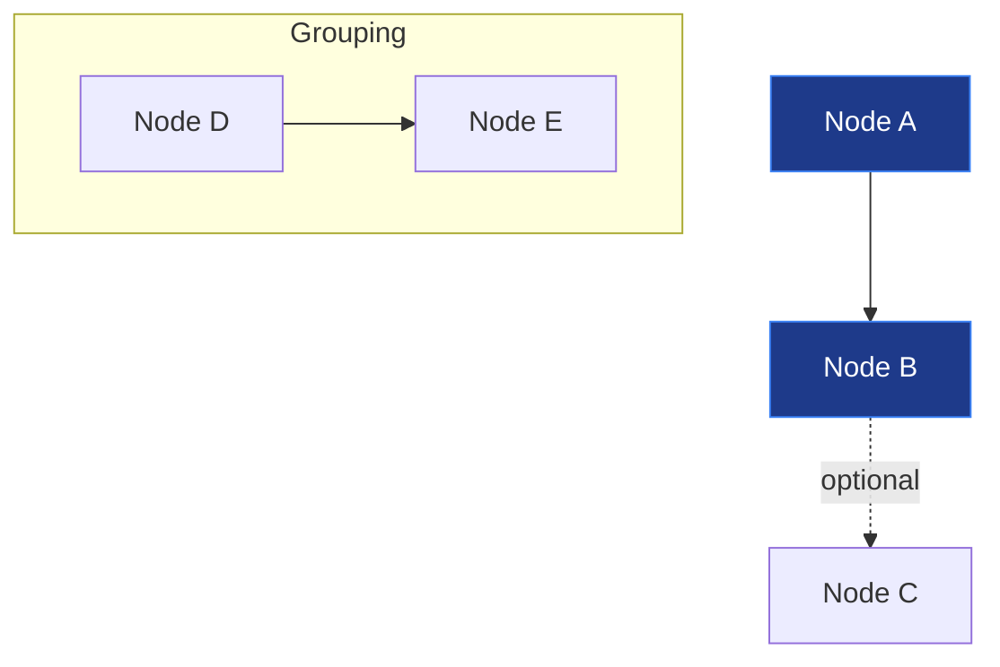

# Architecture Diagrams

Production-ready Mermaid architecture diagrams for Project-AI system visualization.

## 📁 Diagram Files

1. **[01-core-ai-systems.md](./01-core-ai-systems.md)** - Core AI Systems Architecture
   - 6 integrated AI systems (FourLaws, Persona, Memory, Learning, Override, Plugin)
   - Data persistence patterns
   - Integration with GUI and agents
   - **Use for**: Understanding core system structure and data flows

2. **[02-governance-pipeline.md](./02-governance-pipeline.md)** - Governance Pipeline Architecture
   - 3-tier validation (Constitutional, Security, Business Logic)
   - Decision flow and audit trail
   - Policy configuration
   - **Use for**: Understanding governance enforcement and compliance

3. **[03-constitutional-ai.md](./03-constitutional-ai.md)** - Constitutional AI Architecture
   - Asimov's Three Laws implementation
   - Harm assessment system
   - Novel scenario handling
   - Human-in-loop approval
   - **Use for**: Understanding ethical AI decision-making

4. **[04-security-systems.md](./04-security-systems.md)** - Security Systems Architecture
   - 9 security layers (Perimeter, Auth, Input Validation, Crypto, Monitoring, etc.)
   - Red team agents and jailbreak detection
   - Data protection and threat intelligence
   - **Use for**: Security audits, penetration testing planning

5. **[05-gui-components.md](./05-gui-components.md)** - GUI Components Architecture
   - PyQt6 main window and page management
   - 6-zone dashboard layout
   - Persona panel (4 tabs)
   - Signal-based communication
   - **Use for**: GUI development and troubleshooting

6. **[06-agent-systems.md](./06-agent-systems.md)** - Agent Systems Architecture
   - 5 agent tiers (Core, Security, Development, Knowledge, Specialized)
   - Agent communication (message bus, task queue)
   - Sandbox execution
   - **Use for**: Agent development and orchestration

7. **[07-temporal-systems.md](./07-temporal-systems.md)** - Temporal Systems Architecture
   - Workflow and activity layers
   - Long-running workflows
   - Governance integration
   - Monitoring and observability
   - **Use for**: Workflow design and debugging

8. **[08-data-storage.md](./08-data-storage.md)** - Data & Storage Architecture
   - JSON storage (development) vs PostgreSQL (production)
   - Vector storage (RAG with FAISS/Pinecone)
   - Backup and migration strategies
   - **Use for**: Data modeling, migration planning, backup/recovery

9. **[09-web-backend.md](./09-web-backend.md)** - Web Backend Architecture
   - Flask API routes and middleware
   - WebSocket integration (Socket.IO)
   - Core system adapters
   - Frontend React integration
   - **Use for**: Web development, API design, real-time features

10. **[10-infrastructure.md](./10-infrastructure.md)** - Infrastructure Architecture
    - CI/CD pipeline (GitHub Actions)
    - Docker deployment (production)
    - Database replication and caching
    - Monitoring stack (Prometheus, Grafana, Jaeger)
    - **Use for**: DevOps, deployment planning, infrastructure scaling

## 🎯 Usage Guide

### Viewing in Obsidian

All diagrams use standard Mermaid syntax and render in Obsidian with the Mermaid plugin:

1. Install the **Mermaid** plugin (bundled with Obsidian)
2. Open any diagram file
3. Diagrams render automatically in reading view
4. Use `Ctrl+E` (Windows) or `Cmd+E` (Mac) to toggle editing mode

### Viewing in GitHub

GitHub natively renders Mermaid diagrams in markdown files:

1. Navigate to `diagrams/architecture/` directory
2. Click any `.md` file
3. Diagrams render automatically in the file preview

### Viewing in VS Code

Install the **Markdown Preview Mermaid Support** extension:

```bash
code --install-extension bierner.markdown-mermaid
```

Then open any diagram file and use `Ctrl+Shift+V` to preview.

### Exporting Diagrams

#### Export to PNG (Obsidian)

1. Right-click on rendered diagram
2. Select "Copy as PNG"
3. Paste into image editor or documentation

#### Export to SVG (Mermaid Live Editor)

1. Copy diagram code from `.md` file
2. Open https://mermaid.live/
3. Paste code
4. Click "Actions" → "Download SVG"

#### Export to PDF (pandoc)

```bash
pandoc 01-core-ai-systems.md -o core-ai-systems.pdf --pdf-engine=wkhtmltopdf
```

## 🔍 Diagram Legend

### Color Coding

All diagrams use consistent color schemes:

- **Blue** (`#1e3a8a`): Application/Client layer
- **Green** (`#065f46`): Data/Storage layer
- **Orange** (`#7c2d12`): Core systems
- **Purple** (`#4c1d95`): AI agents/services
- **Red** (`#dc2626`): Security/Governance
- **Cyan** (`#0c4a6e`): Infrastructure/DevOps
- **Yellow** (`#ca8a04`): Configuration/Policies
- **Tron Green** (`#00ff00`): UI/Frontend (special)

### Arrow Types

- **Solid arrow** (`-->`) : Direct dependency/call
- **Dotted arrow** (`-.->`) : Optional dependency/configures
- **Dashed arrow** (`-.signal.->`) : Event/signal emission

### Node Shapes

All nodes use rectangular boxes with descriptive labels:

```
[Component Name<br/>Description]
```

## 📚 Related Documentation

Each diagram includes:

- **Architecture Notes**: Key design decisions
- **Implementation Details**: Code examples and patterns
- **Integration Points**: How components interact
- **Best Practices**: Common pitfalls and recommendations

For comprehensive documentation, see:

- [ARCHITECTURE_QUICK_REF.md](../../.github/instructions/ARCHITECTURE_QUICK_REF.md) - ASCII diagrams
- [DEVELOPER_QUICK_REFERENCE.md](../../DEVELOPER_QUICK_REFERENCE.md) - API reference
- [COPILOT_MANDATORY_GUIDE.md](../../.github/instructions/COPILOT_MANDATORY_GUIDE.md) - Development guide

## 🔄 Updating Diagrams

When architecture changes:

1. **Update diagram code**: Modify Mermaid syntax in `.md` file
2. **Update notes**: Add/revise implementation details below diagram
3. **Test rendering**: Verify in Obsidian/GitHub/VS Code
4. **Update README**: Add new files or usage examples
5. **Cross-reference**: Link to related documentation

### Mermaid Syntax Reference



**Key elements**:
- `graph TB`: Top-to-bottom flow (`LR` for left-to-right, `TD` for top-down)
- `A[Label]`: Rectangular node
- `-->`: Solid arrow
- `-.->`: Dotted arrow
- `subgraph "Name"`: Grouping
- `classDef`: Style definition
- `class A,B className`: Apply style

For full syntax, see [Mermaid documentation](https://mermaid.js.org/).

## 🛠️ Troubleshooting

### Diagram Not Rendering in Obsidian

1. Check Mermaid plugin is enabled: Settings → Community Plugins → Mermaid
2. Verify syntax: Copy code to https://mermaid.live/ for validation
3. Clear cache: Settings → About → Clear cache and restart

### Diagram Truncated in GitHub

GitHub has a Mermaid node limit (~500 nodes). If diagram exceeds:

1. Split into multiple sub-diagrams
2. Use `subgraph` to collapse details
3. Link between diagrams with reference

### Export Quality Issues

For high-quality exports:

1. Use Mermaid Live Editor for SVG export
2. Convert SVG to PNG with Inkscape (vector scaling)
3. For presentations, export at 300 DPI minimum

## 📊 Diagram Statistics

| Diagram | Nodes | Arrows | Lines of Code |
|---------|-------|--------|---------------|
| 01-core-ai-systems | 45 | 52 | 230 |
| 02-governance-pipeline | 38 | 48 | 340 |
| 03-constitutional-ai | 42 | 56 | 450 |
| 04-security-systems | 58 | 72 | 520 |
| 05-gui-components | 62 | 68 | 580 |
| 06-agent-systems | 35 | 42 | 480 |
| 07-temporal-systems | 48 | 58 | 420 |
| 08-data-storage | 55 | 64 | 490 |
| 09-web-backend | 52 | 60 | 510 |
| 10-infrastructure | 65 | 78 | 550 |
| **Total** | **500** | **598** | **4,570** |

## 🤝 Contributing

When adding new diagrams:

1. Follow naming convention: `##-descriptive-name.md`
2. Include diagram code + implementation notes
3. Use consistent color schemes (see legend above)
4. Add entry to this README
5. Test rendering in Obsidian, GitHub, and VS Code
6. Cross-reference related diagrams

## 📝 License

These diagrams are part of Project-AI and are subject to the project license. See [LICENSE](../../LICENSE) for details.

## 🔗 Quick Links

- [Project-AI Repository](https://github.com/IAmSoThirsty/Project-AI)
- [Architecture Documentation](../../.github/instructions/)
- [Developer Guide](../../DEVELOPER_QUICK_REFERENCE.md)
- [Mermaid Live Editor](https://mermaid.live/)
- [Obsidian Mermaid Plugin](https://help.obsidian.md/Editing+and+formatting/Advanced+formatting+syntax#Diagram)

---

**Last Updated**: 2025-01-15  
**Maintained By**: Architecture Team  
**Status**: ✅ Production-Ready
