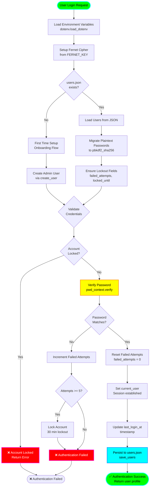

# User Authentication Flow

## Overview
This diagram illustrates the complete user authentication workflow in Project-AI, including password hashing, lockout protection, session management, and Fernet encryption setup.

## Flow Diagram



## Key Security Features

### Password Hashing
- **Primary**: pbkdf2_sha256 (PBKDF2 with SHA-256)
- **Legacy Support**: bcrypt (for backward compatibility)
- **Migration**: Automatic plaintext → hash conversion on load
- **Library**: passlib.context.CryptContext

### Lockout Protection
- **Failed Attempt Threshold**: 5 attempts
- **Lockout Duration**: 30 minutes
- **Persistence**: Lockout state saved to users.json
- **Reset**: Automatic on successful login

### Encryption
- **Cipher**: Fernet (symmetric encryption)
- **Key Source**: Environment variable FERNET_KEY
- **Fallback**: Runtime key generation if not configured
- **Usage**: Sensitive user data encryption

### Path Security
- **Validation**: validate_filename() prevents path traversal
- **Safe Joins**: safe_path_join() for secure file paths
- **Data Directory**: Isolated data/ directory with permissions

## State Persistence

All user state persists to `data/users.json`:

```json
{
  "username": {
    "password_hash": "$pbkdf2-sha256$...",
    "failed_attempts": 0,
    "locked_until": null,
    "last_login_at": "2024-01-15T10:30:00",
    "profile": {
      "email": "user@example.com",
      "role": "admin"
    }
  }
}
```

## Related Systems
- **Command Override**: Extended password system with SHA-256
- **Emergency Alert**: Email-based emergency contact system
- **Cloud Sync**: Encrypted backup with Fernet

## Error Handling
- **File Not Found**: Creates default empty users dict
- **Invalid JSON**: Logs error, uses empty dict
- **Encryption Failure**: Falls back to runtime key
- **Migration Errors**: Logs warning, continues with unmigrated users

## Performance Considerations
- **Hash Verification**: ~100-300ms per attempt (intentional slowdown)
- **File I/O**: Synchronous JSON read/write
- **Memory**: In-memory user dict (loaded once)
- **Concurrency**: Not thread-safe (GUI runs on main thread)
