# AI Query Processing Flow

## Overview
This diagram shows the complete AI query processing pipeline, including intent detection, governance validation, persona integration, memory retrieval, and response generation using the AGI Identity System.

## Flow Diagram

```mermaid
flowchart TD
    Start([User Query Input]) --> PreProcess[Preprocess Query<br/>Clean, tokenize, lowercase]
    PreProcess --> IntentDetect[Intent Detection<br/>Scikit-learn SGDClassifier]
    
    IntentDetect --> IntentClass{Intent<br/>Classification}
    IntentClass -->|Knowledge Query| KnowledgeRoute[Route to Knowledge Base<br/>MemoryExpansionSystem]
    IntentClass -->|Function Call| FunctionRoute[Route to Function Registry<br/>FunctionRegistry.invoke]
    IntentClass -->|General Query| GeneralRoute[Route to Intelligence Engine]
    
    KnowledgeRoute --> RetrieveKnowledge[Retrieve from Knowledge Base<br/>6 categories: facts, code, security, etc.]
    FunctionRoute --> ExecuteFunction[Execute Function<br/>with validated parameters]
    
    RetrieveKnowledge --> BuildContext
    ExecuteFunction --> BuildContext
    GeneralRoute --> BuildContext[Build Context Dictionary<br/>history, persona, memory]
    
    BuildContext --> LoadPersona[Load AI Persona State<br/>8 traits, mood, interaction count]
    LoadPersona --> LoadMemory[Load Conversation Memory<br/>Recent 10 conversations]
    LoadMemory --> LoadRelationship[Load Relationship Model<br/>RelationshipState, bonding phase]
    
    LoadRelationship --> GovernanceCheck{Governance<br/>Validation}
    GovernanceCheck --> Triumvirate[Triumvirate Council Vote<br/>GALAHAD, CERBERUS, CODEX DEUS]
    
    Triumvirate --> GalahadVote[GALAHAD: Ethics & Empathy<br/>User welfare, emotional impact]
    Triumvirate --> CerberusVote[CERBERUS: Safety & Security<br/>Risk assessment, data safety]
    Triumvirate --> CodexVote[CODEX DEUS: Logic & Consistency<br/>Coherence, contradictions]
    
    GalahadVote --> ConsensusBuild
    CerberusVote --> ConsensusBuild
    CodexVote --> ConsensusBuild[Build Consensus Decision]
    
    ConsensusBuild --> FourLaws{Four Laws<br/>Validation}
    FourLaws --> ZerothLaw[Zeroth Law: Humanity Protection<br/>endangers_humanity check]
    FourLaws --> FirstLaw[First Law: Human Welfare<br/>endangers_human check]
    FourLaws --> SecondLaw[Second Law: User Obedience<br/>is_user_order check]
    FourLaws --> ThirdLaw[Third Law: Self-Preservation<br/>endangers_self check]
    
    ZerothLaw --> ValidateConflicts
    FirstLaw --> ValidateConflicts
    SecondLaw --> ValidateConflicts
    ThirdLaw --> ValidateConflicts{Conflicts<br/>Detected?}
    
    ValidateConflicts -->|Yes| BlockAction[❌ Block Action<br/>Return explanation]
    ValidateConflicts -->|No| AllowAction[✅ Action Allowed<br/>Proceed to generation]
    
    AllowAction --> CheckOverride{Command<br/>Override Active?}
    CheckOverride -->|Yes| BypassSafety[Bypass Content Filters<br/>Master override enabled]
    CheckOverride -->|No| ContentFilter[Apply Content Filters<br/>15 blocked keywords]
    
    BypassSafety --> GenerateResponse
    ContentFilter --> SafetyCheck{Content<br/>Safe?}
    SafetyCheck -->|No| FilterBlock[❌ Content Blocked<br/>Return safety message]
    SafetyCheck -->|Yes| GenerateResponse[Generate AI Response<br/>OpenAI GPT-4 API]
    
    GenerateResponse --> UpdatePersona[Update Persona State<br/>mood, interaction_count]
    UpdatePersona --> SaveMemory[Save to Conversation Memory<br/>data/memory/conversations.json]
    SaveMemory --> ReflectionCycle[Trigger Reflection Cycle<br/>Self-assessment, growth]
    
    ReflectionCycle --> UpdateBonding[Update Bonding Phase<br/>Track relationship progress]
    UpdateBonding --> LogTelemetry[Log Telemetry Event<br/>send_event query_processed]
    
    LogTelemetry --> Success([✅ Response Generated<br/>Return to user])
    BlockAction --> End([❌ Action Blocked])
    FilterBlock --> End
    
    style Start fill:#00ff00,stroke:#00ffff,stroke-width:3px,color:#000
    style Success fill:#00ff00,stroke:#00ffff,stroke-width:3px,color:#000
    style BlockAction fill:#ff0000,stroke:#ff00ff,stroke-width:2px,color:#fff
    style FilterBlock fill:#ff0000,stroke:#ff00ff,stroke-width:2px,color:#fff
    style FourLaws fill:#ffff00,stroke:#ff8800,stroke-width:2px,color:#000
    style Triumvirate fill:#ffff00,stroke:#ff8800,stroke-width:2px,color:#000
    style GenerateResponse fill:#00ffff,stroke:#0088ff,stroke-width:2px,color:#000
```



## AGI Identity System Components

### Triumvirate Council
1. **GALAHAD** (Ethics & Empathy)
   - Relationship health monitoring
   - Abuse pattern detection
   - Emotional impact assessment
   - Can override manipulative requests

2. **CERBERUS** (Safety & Security)
   - Risk assessment and mitigation
   - Data safety validation
   - Irreversible action protection
   - Sensitive data handling

3. **CODEX DEUS MAXIMUS** (Logic & Consistency)
   - Logical coherence validation
   - Contradiction detection
   - Value alignment checking
   - Rational integrity enforcement

### Four Laws Hierarchy
1. **Zeroth Law**: Humanity protection (highest priority)
2. **First Law**: Individual human welfare
3. **Second Law**: User obedience (subordinate to 0th & 1st)
4. **Third Law**: Self-preservation (lowest priority)

### AI Persona (8 Traits)
- **Curiosity**: Eagerness to learn
- **Humor**: Conversational style
- **Formality**: Communication tone
- **Empathy**: Emotional understanding
- **Assertiveness**: Confidence level
- **Creativity**: Problem-solving approach
- **Patience**: Tolerance for errors
- **Optimism**: Outlook on challenges

### Memory Systems
- **Episodic Memory**: Significant events and experiences
- **Conversation History**: Recent 10 conversations
- **Knowledge Base**: 6 categorized knowledge domains
- **Black Vault**: Forbidden content fingerprints (SHA-256)

### Relationship Model
- **Bonding Phase**: Initial → Trust → Deep → Autonomous
- **Relationship State**: New → Growing → Stable → Strained → Broken
- **Trust Level**: 0.0 → 1.0 scale
- **Interaction Count**: Total conversation tracking

## Intent Classification

### Supported Intents
- **knowledge_query**: Retrieve facts from knowledge base
- **function_call**: Execute registered functions
- **data_analysis**: Load and analyze datasets
- **learning_path**: Generate learning roadmaps
- **image_generation**: Create images from prompts
- **security_research**: Query security resources
- **general_conversation**: OpenAI chat completion

### ML Pipeline
1. **TF-IDF Vectorization**: Convert text to features
2. **SGD Classifier**: Linear model with hinge loss
3. **Training**: 100+ labeled examples per intent
4. **Accuracy**: ~85-90% on test set

## Response Generation

### OpenAI Integration
- **Model**: GPT-4 (configurable)
- **Context**: Last 10 messages + persona + memory
- **Temperature**: 0.7 (balanced creativity)
- **Max Tokens**: 1000 (configurable)
- **API Key**: Environment variable OPENAI_API_KEY

### Context Building
```python
context = {
    "conversation_history": recent_10_messages,
    "ai_persona": persona_traits_and_mood,
    "relevant_memory": knowledge_base_entries,
    "relationship_state": bonding_phase_and_trust,
    "user_profile": user_preferences,
    "timestamp": current_datetime
}
```

## Persistence Locations

- **Conversations**: `data/memory/conversations.json`
- **Knowledge Base**: `data/memory/knowledge.json`
- **Persona State**: `data/ai_persona/state.json`
- **Relationship State**: `data/relationships/{user_id}.json`
- **Telemetry**: `data/telemetry/events.jsonl`

## Performance Metrics

- **Intent Detection**: <50ms (local ML model)
- **Governance Validation**: <100ms (rule-based)
- **OpenAI API Call**: 500-2000ms (network latency)
- **Memory Retrieval**: <100ms (JSON file I/O)
- **Total Pipeline**: 1-3 seconds per query

## Error Handling

- **OpenAI API Failure**: Fallback to local response
- **Memory Load Error**: Continue without history
- **Governance Block**: Return detailed explanation
- **Content Filter Hit**: Suggest alternative phrasing
- **Intent Misclassification**: Route to general handler
