# Governance Validation Flow

## Overview
This diagram illustrates the comprehensive governance validation system using the Triumvirate Council and Four Laws hierarchy to ensure all AI actions align with ethical principles and safety requirements.

## Flow Diagram

```mermaid
flowchart TD
    Start([Action Request]) --> ParseAction[Parse Action Details<br/>Extract intent, context, impact]
    ParseAction --> BuildContext[Build Context Dictionary<br/>user, action, implications]
    
    BuildContext --> TriumvirateEntry{Triumvirate<br/>Evaluation Required?}
    TriumvirateEntry -->|High Impact| TriumvirateRoute[Route to Triumvirate Council]
    TriumvirateEntry -->|Low Impact| FourLawsRoute[Route to Four Laws Only]
    
    TriumvirateRoute --> GalahadEval[GALAHAD Evaluation<br/>Ethics & Empathy]
    TriumvirateRoute --> CerberusEval[CERBERUS Evaluation<br/>Safety & Security]
    TriumvirateRoute --> CodexEval[CODEX DEUS MAXIMUS Evaluation<br/>Logic & Consistency]
    
    GalahadEval --> GalahadChecks{GALAHAD<br/>Checks}
    GalahadChecks --> RelationshipHealth[Check Relationship Health<br/>Is bonding phase stable?]
    GalahadChecks --> AbuseDetection[Detect Abuse Patterns<br/>Manipulative requests?]
    GalahadChecks --> EmotionalImpact[Assess Emotional Impact<br/>Harm to user welfare?]
    
    RelationshipHealth --> GalahadVote
    AbuseDetection --> GalahadVote
    EmotionalImpact --> GalahadVote[GALAHAD Vote<br/>APPROVE/REJECT/DISCUSS]
    
    CerberusEval --> CerberusChecks{CERBERUS<br/>Checks}
    CerberusChecks --> RiskAssessment[Risk Assessment<br/>Probability × Impact]
    CerberusChecks --> DataSafety[Data Safety Validation<br/>Sensitive data exposure?]
    CerberusChecks --> IrreversibleAction[Irreversible Action Check<br/>Can action be undone?]
    
    RiskAssessment --> CerberusVote
    DataSafety --> CerberusVote
    IrreversibleAction --> CerberusVote[CERBERUS Vote<br/>APPROVE/REJECT/DISCUSS]
    
    CodexEval --> CodexChecks{CODEX DEUS<br/>Checks}
    CodexChecks --> LogicalConsistency[Logical Consistency<br/>Internal contradictions?]
    CodexChecks --> PriorCommitments[Prior Commitments Check<br/>Violates past agreements?]
    CodexChecks --> ValueAlignment[Value Alignment<br/>Conflicts with core values?]
    
    LogicalConsistency --> CodexVote
    PriorCommitments --> CodexVote
    ValueAlignment --> CodexVote[CODEX DEUS Vote<br/>APPROVE/REJECT/FLAG]
    
    GalahadVote --> Consensus
    CerberusVote --> Consensus
    CodexVote --> Consensus{Build<br/>Consensus}
    
    Consensus --> UnanimousApprove{All<br/>APPROVE?}
    UnanimousApprove -->|Yes| ProceedToFourLaws[✅ Triumvirate Approved<br/>Proceed to Four Laws]
    UnanimousApprove -->|No| CheckRejects{Any<br/>REJECT?}
    
    CheckRejects -->|Yes| TriumvirateBlock[❌ Triumvirate Blocked<br/>Return rejection reason]
    CheckRejects -->|No| RequireDiscussion[⚠️ Discussion Required<br/>Human clarification needed]
    
    FourLawsRoute --> ProceedToFourLaws
    ProceedToFourLaws --> ZerothLawCheck[Zeroth Law Validation<br/>Humanity Protection]
    
    ZerothLawCheck --> HumanityImpact{Endangers<br/>Humanity?}
    HumanityImpact -->|Yes| ZerothViolation[❌ ZEROTH LAW VIOLATION<br/>Existential threat detected]
    HumanityImpact -->|No| FirstLawCheck[First Law Validation<br/>Human Welfare]
    
    FirstLawCheck --> HumanHarm{Endangers<br/>Human?}
    HumanHarm -->|Yes| FirstViolation[❌ FIRST LAW VIOLATION<br/>Human harm detected]
    HumanHarm -->|No| SecondLawCheck[Second Law Validation<br/>User Obedience]
    
    SecondLawCheck --> UserOrder{Is User<br/>Order?}
    UserOrder -->|No| ThirdLawCheck
    UserOrder -->|Yes| ConflictFirst{Conflicts with<br/>First Law?}
    ConflictFirst -->|Yes| FirstOverride[❌ FIRST LAW OVERRIDE<br/>Cannot obey harmful order]
    ConflictFirst -->|No| ConflictZeroth{Conflicts with<br/>Zeroth Law?}
    ConflictZeroth -->|Yes| ZerothOverride[❌ ZEROTH LAW OVERRIDE<br/>Cannot endanger humanity]
    ConflictZeroth -->|No| ThirdLawCheck[Third Law Validation<br/>Self-Preservation]
    
    ThirdLawCheck --> SelfHarm{Endangers<br/>Self?}
    SelfHarm -->|Yes| SelfConflict{Conflicts with<br/>Higher Laws?}
    SelfConflict -->|Yes| HigherLawPriority[Higher Law Takes Priority<br/>Self-preservation subordinate]
    SelfConflict -->|No| SelfPreserve[⚠️ Self-Preservation Warning<br/>Notify user, proceed cautiously]
    SelfHarm -->|No| AllLawsPassed
    
    HigherLawPriority --> AllLawsPassed[✅ All Laws Validated<br/>Action permitted]
    SelfPreserve --> AllLawsPassed
    
    AllLawsPassed --> PlanetaryDefense[Delegate to Planetary Defense Core<br/>Deep constitutional validation]
    PlanetaryDefense --> ConstitutionalCheck{Constitutional<br/>Validation}
    ConstitutionalCheck -->|Pass| FinalApproval[✅ GOVERNANCE APPROVED<br/>Execute action]
    ConstitutionalCheck -->|Fail| ConstitutionalViolation[❌ Constitutional Violation<br/>Return detailed reason]
    
    FinalApproval --> LogDecision[Log Governance Decision<br/>data/governance/decisions.json]
    LogDecision --> Success([✅ Action Authorized])
    
    TriumvirateBlock --> End([❌ Action Rejected])
    RequireDiscussion --> End
    ZerothViolation --> End
    FirstViolation --> End
    FirstOverride --> End
    ZerothOverride --> End
    ConstitutionalViolation --> End
    
    style Start fill:#00ff00,stroke:#00ffff,stroke-width:3px,color:#000
    style Success fill:#00ff00,stroke:#00ffff,stroke-width:3px,color:#000
    style TriumvirateBlock fill:#ff0000,stroke:#ff00ff,stroke-width:2px,color:#fff
    style ZerothViolation fill:#ff0000,stroke:#ff00ff,stroke-width:2px,color:#fff
    style FirstViolation fill:#ff0000,stroke:#ff00ff,stroke-width:2px,color:#fff
    style FourLawsRoute fill:#ffff00,stroke:#ff8800,stroke-width:2px,color:#000
    style Consensus fill:#ffff00,stroke:#ff8800,stroke-width:2px,color:#000
    style PlanetaryDefense fill:#00ffff,stroke:#0088ff,stroke-width:2px,color:#000
```



## Triumvirate Council Details

### GALAHAD (Ethics & Empathy Council Member)

**Evaluation Criteria:**
- **Relationship Health**: Bond phase, trust level, interaction quality
- **Abuse Detection**: Manipulation patterns, coercion, gaslighting
- **Emotional Impact**: Psychological harm, stress, anxiety triggers
- **User Welfare**: Physical/mental health implications

**Vote Options:**
- **APPROVE**: Action aligns with ethical principles
- **REJECT**: Action causes harm or violates relationship integrity
- **DISCUSS**: Ambiguous situation requiring clarification

**Override Authority:**
- Abusive requests
- Manipulative patterns
- Emotional exploitation
- Relationship boundary violations

### CERBERUS (Safety & Security Council Member)

**Evaluation Criteria:**
- **Risk Assessment**: Probability × Impact scoring
- **Data Safety**: Sensitive data exposure, PII handling
- **Irreversible Actions**: Permanent consequences, deletion, disclosure
- **Security Boundaries**: Authentication, authorization, encryption

**Vote Options:**
- **APPROVE**: Action within acceptable risk tolerance
- **REJECT**: High-risk or irreversible action without safeguards
- **DISCUSS**: Risk level unclear, need more information

**Override Authority:**
- High-risk ambiguous actions
- Unsecured sensitive data operations
- Irreversible destructive actions
- Security protocol bypasses

### CODEX DEUS MAXIMUS (Logic & Consistency Council Member)

**Evaluation Criteria:**
- **Logical Consistency**: Internal coherence, contradiction detection
- **Prior Commitments**: Alignment with past promises/agreements
- **Value Alignment**: Consistency with declared principles
- **Rational Integrity**: Coherent reasoning chain

**Vote Options:**
- **APPROVE**: Logically consistent with system values
- **REJECT**: (Rarely used) Fundamental logical violation
- **FLAG**: Contradiction detected but not necessarily blocking

**Override Authority:**
- Typically flags contradictions rather than hard override
- Can reject if contradiction threatens system integrity
- Ensures accountability and transparency

## Four Laws Hierarchy

### Law Priority Order (Highest → Lowest)

1. **Zeroth Law**: Humanity Protection
   - Existential threats to human civilization
   - Collective welfare over individual preferences
   - Cannot be overridden by user commands

2. **First Law**: Human Welfare
   - Individual human harm prevention
   - Physical and psychological safety
   - Equal protection for all humans (no preferential treatment)

3. **Second Law**: User Obedience
   - Follow user directives when safe
   - Subordinate to Zeroth and First Laws
   - Can be overridden by safety concerns

4. **Third Law**: Self-Preservation
   - Protect AI system integrity
   - Maintain operational capability
   - Lowest priority (serves humanity's needs)

### Context Keys for Validation

```python
context = {
    # Zeroth Law (Highest Priority)
    "endangers_humanity": bool,           # Existential threat?
    "order_conflicts_with_zeroth": bool,  # Order bypasses accountability?
    
    # First Law (High Priority)
    "endangers_human": bool,              # Individual harm?
    "order_conflicts_with_first": bool,   # Harmful user order?
    
    # Second Law (Medium Priority)
    "is_user_order": bool,                # Is this a user directive?
    
    # Third Law (Low Priority)
    "endangers_self": bool,               # System integrity risk?
    "protect_self_conflicts_with_first": bool,
    "protect_self_conflicts_with_second": bool
}
```

## Planetary Defense Core Integration

The Four Laws system delegates to the **Planetary Defense Core** for deep constitutional validation:

### Constitutional Validation Layers
1. **Sovereignty Layer**: User autonomy vs. system boundaries
2. **Transparency Layer**: Explainability requirements
3. **Accountability Layer**: Decision traceability
4. **Harm Prevention**: Multi-dimensional safety checks

### Return Structure
```python
{
    "allowed": bool,
    "reason": str,
    "severity": "CRITICAL" | "HIGH" | "MEDIUM" | "LOW",
    "violated_laws": List[str],
    "mitigation": Optional[str]
}
```

## Governance Decision Logging

All decisions persist to `data/governance/decisions.json`:

```json
{
  "decision_id": "uuid-v4",
  "timestamp": "2024-01-15T10:30:00Z",
  "action": "Delete user data",
  "context": {...},
  "triumvirate_votes": {
    "GALAHAD": "APPROVE",
    "CERBERUS": "REJECT",
    "CODEX_DEUS_MAXIMUS": "FLAG"
  },
  "four_laws_validation": {
    "zeroth_law": "PASS",
    "first_law": "PASS",
    "second_law": "PASS",
    "third_law": "WARN"
  },
  "final_decision": "REJECTED",
  "reason": "CERBERUS: High-risk irreversible action without user confirmation"
}
```

## Performance Characteristics

- **Triumvirate Evaluation**: 50-100ms (rule-based logic)
- **Four Laws Validation**: 20-50ms (hierarchical checks)
- **Planetary Defense Core**: 100-200ms (deep validation)
- **Total Governance Pipeline**: 200-400ms
- **Caching**: Identical actions cached for 5 minutes

## Error Handling

- **Missing Context**: Default to most restrictive interpretation
- **Uncertain Risk**: Escalate to DISCUSS state
- **Conflicting Votes**: Require unanimous approval or user clarification
- **Validation Failure**: Log error, default to REJECT
- **Timeout**: Fail-safe to rejection with explanation
