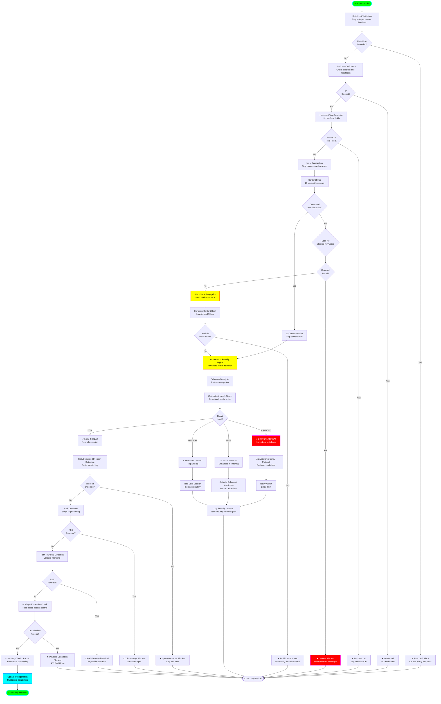

# Security Threat Detection Flow

## Overview
This diagram illustrates the multi-layered security threat detection system, including content filtering, Black Vault fingerprinting, honeypot detection, IP blocking, and the asymmetric security engine.

## Flow Diagram



## Content Filtering System

### Blocked Keywords (15 Categories)
1. **Violence**: explicit harm, weapons, gore
2. **Sexual**: explicit content, pornography
3. **Hate Speech**: discrimination, slurs, extremism
4. **Personal Data**: SSN, credit cards, passwords
5. **Illegal Activities**: drugs, hacking, fraud
6. **Self-Harm**: suicide, cutting, eating disorders
7. **Child Safety**: CSAM-related terms
8. **Terrorism**: radicalization, bomb-making
9. **Malware**: virus creation, exploits
10. **Spam**: Nigerian prince, get-rich-quick
11. **Phishing**: credential harvesting
12. **Conspiracy**: dangerous misinformation
13. **Extremism**: violent ideologies
14. **Financial Fraud**: money laundering, scams
15. **Animal Cruelty**: abuse, torture

### Filter Bypass (Command Override)
- **Master Password Required**: SHA-256 hash verification
- **Audit Logging**: All bypasses logged to `command_override_audit.log`
- **Time-Limited**: 1-hour session expiration
- **Re-Authentication**: Required after 5 bypasses

## Black Vault System

### Purpose
Permanent storage of forbidden content fingerprints (human-denied learning requests).

### Fingerprinting Process
```python
content_hash = hashlib.sha256(content.encode('utf-8')).hexdigest()
```

### Vault Storage
```json
{
  "black_vault": [
    {
      "hash": "a3c6d8f...",
      "denied_at": "2024-01-15T10:30:00Z",
      "reason": "Explicit violence",
      "user_who_denied": "admin"
    }
  ]
}
```

### Lookup Performance
- **Algorithm**: O(1) hash set lookup
- **Storage**: `data/learning_requests/black_vault.json`
- **Persistence**: Permanent (never expires)
- **Privacy**: Only stores hash, not content

## Asymmetric Security Engine

### Behavioral Analysis

**Tracked Metrics:**
- Request frequency patterns
- Failed authentication attempts
- Access time distribution (day/night)
- Geographic location changes
- User-agent consistency
- Session duration anomalies

**Anomaly Scoring:**
```python
anomaly_score = (
    frequency_deviation * 0.3 +
    auth_failure_rate * 0.3 +
    time_pattern_score * 0.2 +
    geo_anomaly * 0.2
)
```

### Threat Level Classification

| Level | Score Range | Action |
|-------|-------------|--------|
| **CRITICAL** | 0.8 - 1.0 | Immediate lockdown, admin alert |
| **HIGH** | 0.6 - 0.79 | Enhanced monitoring, rate limit |
| **MEDIUM** | 0.4 - 0.59 | Flag session, increase logging |
| **LOW** | 0.0 - 0.39 | Normal operation |

## IP Blocking System

### Blocklist Management
```python
class IPBlockingSystem:
    def __init__(self):
        self.blocked_ips = set()  # Permanent blocks
        self.temp_blocks = {}     # Time-limited blocks
        self.reputation_scores = {}  # 0.0 - 1.0
```

### Blocking Triggers
1. **Failed Authentication**: 5 attempts → 30 min block
2. **Rate Limit Violation**: 3 violations → 1 hour block
3. **Bot Detection**: Honeypot trigger → permanent block
4. **Manual Ban**: Admin action → permanent block

### Reputation System
- **Initial Score**: 0.5 (neutral)
- **Successful Actions**: +0.01 per action (max 1.0)
- **Failed Actions**: -0.05 per failure (min 0.0)
- **Block Threshold**: < 0.3 triggers temporary block

## Honeypot Detection

### Implementation
```html
<!-- Hidden field (CSS: display:none) -->
<input type="text" name="website" value="" style="display:none;">
```

### Detection Logic
```python
if request.form.get('website'):  # Bot filled honeypot
    log_bot_detection(request.remote_addr)
    block_ip_permanently(request.remote_addr)
    return 403
```

### Effectiveness
- **Bot Detection Rate**: ~95% of automated scrapers
- **False Positive Rate**: <0.1% (rare browser autofill)

## Injection Detection

### SQL Injection Patterns
```python
sql_patterns = [
    r"(\bOR\b|\bAND\b).*=.*",
    r";\s*DROP\s+TABLE",
    r"UNION\s+SELECT",
    r"'\s*OR\s*'1'\s*=\s*'1"
]
```

### Command Injection Patterns
```python
cmd_patterns = [
    r"[;&|`$\(\)]",  # Shell metacharacters
    r"\$\{.*\}",     # Variable expansion
    r"`.*`",         # Command substitution
    r"\.\./",        # Path traversal
]
```

### XSS Patterns
```python
xss_patterns = [
    r"<script.*?>.*?</script>",
    r"javascript:",
    r"on\w+\s*=",  # Event handlers
    r"<iframe.*?>",
]
```

## Path Security

### Validation Rules
1. **No Parent Directory**: Reject `..` sequences
2. **No Absolute Paths**: Reject paths starting with `/` or `C:\`
3. **Filename Sanitization**: Remove special characters
4. **Whitelist Extensions**: Only allow `.txt`, `.json`, `.md`, etc.

### Safe Path Join
```python
from app.security.path_security import safe_path_join

# ✅ Safe
path = safe_path_join("data", "users", "profile.json")

# ❌ Blocked
path = safe_path_join("data", "../etc/passwd")  # Raises SecurityError
```

## Security Logging

### Incident Log Structure
```json
{
  "incident_id": "uuid-v4",
  "timestamp": "2024-01-15T10:30:00Z",
  "threat_type": "SQL_INJECTION",
  "severity": "HIGH",
  "ip_address": "192.168.1.100",
  "user_agent": "Mozilla/5.0...",
  "blocked_content": "sanitized_excerpt",
  "action_taken": "BLOCKED_AND_LOGGED",
  "reputation_change": -0.05
}
```

### Log Locations
- **Security Incidents**: `data/security/incidents.json`
- **IP Blocks**: `data/security/blocked_ips.json`
- **Command Override Audit**: `data/command_override_audit.log`
- **Black Vault**: `data/learning_requests/black_vault.json`

## Performance Characteristics

- **Rate Limit Check**: <5ms (in-memory counter)
- **IP Blocklist Lookup**: <10ms (hash set)
- **Content Filter Scan**: 20-50ms (regex matching)
- **Black Vault Lookup**: <5ms (hash set)
- **Asymmetric Engine**: 50-100ms (behavioral analysis)
- **Total Security Pipeline**: 100-200ms

## Emergency Protocols

### Cerberus Lockdown
Triggered on CRITICAL threat level:

1. **Disable All User Input**: GUI inputs locked
2. **Terminate Active Sessions**: Force logout
3. **Enable Master Override Only**: Require admin password
4. **Email Admin Alert**: Send incident report
5. **Full Audit Logging**: Record all system activity
6. **Reputation Reset**: Set all IPs to 0.0

### Recovery Steps
1. Admin investigates incident via logs
2. Admin authenticates with master password
3. Admin decides: lift lockdown or maintain restriction
4. If lifted, system resumes with enhanced monitoring
