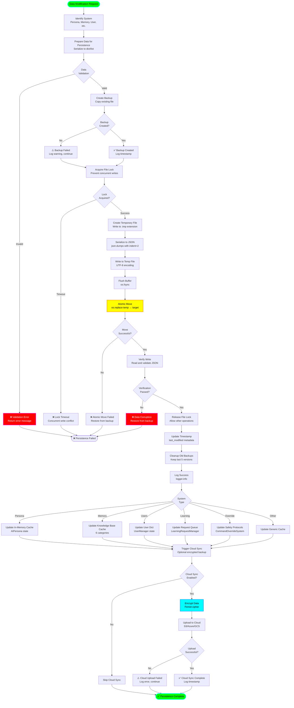

# Data Persistence Flow

## Overview
This diagram illustrates the comprehensive data persistence strategy across all core systems, including JSON-based storage, atomic writes, file locking, and backup mechanisms.

## Flow Diagram



## Core Persistence Systems

### 1. AI Persona State
**File**: `data/ai_persona/state.json`

**Structure**:
```json
{
  "traits": {
    "curiosity": 0.75,
    "humor": 0.60,
    "formality": 0.40,
    "empathy": 0.85,
    "assertiveness": 0.55,
    "creativity": 0.70,
    "patience": 0.65,
    "optimism": 0.80
  },
  "mood": "cheerful",
  "interaction_count": 1847,
  "last_updated": "2024-01-15T10:30:00Z",
  "evolution_history": [...]
}
```

**Update Triggers**:
- Trait adjustment (every 10 interactions)
- Mood change (based on conversation sentiment)
- Manual trait configuration via Persona Panel

### 2. Memory Expansion System
**File**: `data/memory/knowledge.json`

**Structure**:
```json
{
  "facts": [
    {"content": "User prefers Python", "timestamp": "2024-01-15T10:30:00Z"}
  ],
  "code_snippets": [...],
  "security_knowledge": [...],
  "user_preferences": [...],
  "conversation_summaries": [...],
  "learning_notes": [...]
}
```

**Update Triggers**:
- New fact learned via `add_knowledge()`
- Conversation stored via `save_conversation()`
- Manual knowledge entry via dashboard

### 3. User Manager
**File**: `data/users.json`

**Structure**:
```json
{
  "admin": {
    "password_hash": "$pbkdf2-sha256$29000$...",
    "failed_attempts": 0,
    "locked_until": null,
    "last_login_at": "2024-01-15T10:30:00Z",
    "profile": {
      "email": "admin@example.com",
      "role": "admin",
      "created_at": "2024-01-01T00:00:00Z"
    }
  }
}
```

**Update Triggers**:
- User login (update last_login_at)
- Failed authentication (increment failed_attempts)
- Account lockout (set locked_until)
- Password change (update password_hash)

### 4. Learning Request Manager
**File**: `data/learning_requests/requests.json`

**Structure**:
```json
{
  "requests": [
    {
      "id": "uuid-v4",
      "content": "Learn about quantum computing",
      "status": "pending",
      "requested_at": "2024-01-15T10:30:00Z",
      "reviewed_by": null,
      "approved_at": null
    }
  ]
}
```

**Update Triggers**:
- New learning request submitted
- Human approval/denial
- Content added to Black Vault (denial)

### 5. Command Override System
**File**: `data/command_override_config.json`

**Structure**:
```json
{
  "master_password_hash": "sha256_hash",
  "safety_protocols": {
    "content_filter": true,
    "prompt_safety": true,
    "data_validation": true,
    "rate_limiting": true,
    "user_approval": true,
    "api_safety": true,
    "ml_safety": true,
    "plugin_sandbox": true,
    "cloud_encryption": true,
    "emergency_only": true
  },
  "failed_auth_attempts": 0,
  "auth_locked_until": null
}
```

**Update Triggers**:
- Safety protocol toggle
- Override activation/deactivation
- Failed authentication attempts
- Password change

### 6. Image Generation History
**File**: `data/image_generation/history.json`

**Structure**:
```json
{
  "history": [
    {
      "id": "uuid-v4",
      "prompt": "A cyberpunk cityscape",
      "style": "cyberpunk",
      "backend": "huggingface",
      "image_path": "data/images/img_001.png",
      "generated_at": "2024-01-15T10:30:00Z",
      "size": "512x512",
      "content_filtered": false
    }
  ]
}
```

**Update Triggers**:
- Image generation completion
- Manual deletion via UI

## Atomic Write Pattern

### Implementation
```python
def _atomic_write(filepath: str, data: dict) -> None:
    """Atomic write with rollback capability."""
    # 1. Create backup
    backup_path = f"{filepath}.backup"
    if os.path.exists(filepath):
        shutil.copy2(filepath, backup_path)
    
    # 2. Write to temp file
    temp_path = f"{filepath}.tmp"
    with open(temp_path, 'w', encoding='utf-8') as f:
        json.dump(data, f, indent=2, ensure_ascii=False)
        f.flush()
        os.fsync(f.fileno())  # Force write to disk
    
    # 3. Atomic move (rename)
    os.replace(temp_path, filepath)  # Atomic on POSIX and Windows
    
    # 4. Verify write
    with open(filepath, 'r', encoding='utf-8') as f:
        json.load(f)  # Will raise if corrupted
    
    # 5. Cleanup backup (optional)
    # Keep for disaster recovery
```

### Benefits
- **Atomicity**: Write completes fully or not at all (no partial writes)
- **Corruption Protection**: Backup available if write fails
- **Concurrent Safety**: File lock prevents simultaneous writes
- **Power Failure Recovery**: Backup + fsync ensures durability

## File Locking Strategy

### Simple Lock (Current)
```python
import threading

class SimpleLock:
    """Process-level file lock for single-process applications."""
    def __init__(self):
        self._locks = {}  # filepath → threading.Lock
    
    def acquire(self, filepath: str, timeout: float = 5.0) -> bool:
        lock = self._locks.setdefault(filepath, threading.Lock())
        return lock.acquire(timeout=timeout)
    
    def release(self, filepath: str) -> None:
        if filepath in self._locks:
            self._locks[filepath].release()
```

### Advanced Lock (SQLite-based)
For multi-process scenarios (web backend):
```python
import sqlite3

class SQLiteLock:
    """Cross-process file lock using SQLite."""
    def __init__(self, lock_db: str = "data/locks.db"):
        self.db = lock_db
        self._init_db()
    
    def _init_db(self):
        conn = sqlite3.connect(self.db)
        conn.execute("""
            CREATE TABLE IF NOT EXISTS locks (
                filepath TEXT PRIMARY KEY,
                pid INTEGER,
                acquired_at TIMESTAMP
            )
        """)
        conn.close()
    
    def acquire(self, filepath: str, timeout: float = 5.0) -> bool:
        # Implement with polling and timeout
        pass
```

## Backup Management

### Backup Strategy
- **Frequency**: Every successful write creates backup
- **Retention**: Last 5 versions kept
- **Naming**: `{filename}.backup.{timestamp}`
- **Location**: Same directory as original file
- **Cleanup**: Automatic during write operation

### Backup Rotation
```python
def _rotate_backups(filepath: str, keep: int = 5) -> None:
    """Keep only the most recent N backups."""
    backup_pattern = f"{filepath}.backup.*"
    backups = sorted(glob.glob(backup_pattern), reverse=True)
    
    for old_backup in backups[keep:]:
        os.remove(old_backup)
        logger.info(f"Removed old backup: {old_backup}")
```

## Cloud Sync System

### Encryption
```python
from cryptography.fernet import Fernet

def _encrypt_for_cloud(data: bytes, key: bytes) -> bytes:
    """Encrypt data before cloud upload."""
    cipher = Fernet(key)
    return cipher.encrypt(data)

def _decrypt_from_cloud(encrypted: bytes, key: bytes) -> bytes:
    """Decrypt data after cloud download."""
    cipher = Fernet(key)
    return cipher.decrypt(encrypted)
```

### Upload Flow
1. **Serialize**: Convert data to JSON bytes
2. **Encrypt**: Fernet symmetric encryption
3. **Compress**: gzip compression (optional)
4. **Upload**: S3/Azure/GCS API call
5. **Verify**: Checksum validation
6. **Log**: Record sync timestamp

### Supported Backends
- **AWS S3**: boto3 library
- **Azure Blob Storage**: azure-storage-blob
- **Google Cloud Storage**: google-cloud-storage
- **Local Backup**: Copy to separate drive

## Error Recovery

### Corruption Detection
```python
def _verify_json(filepath: str) -> bool:
    """Verify JSON file integrity."""
    try:
        with open(filepath, 'r', encoding='utf-8') as f:
            json.load(f)
        return True
    except (json.JSONDecodeError, OSError) as e:
        logger.error(f"Corruption detected in {filepath}: {e}")
        return False
```

### Rollback Procedure
```python
def _rollback_from_backup(filepath: str) -> bool:
    """Restore from most recent backup."""
    backup_path = f"{filepath}.backup"
    if os.path.exists(backup_path):
        shutil.copy2(backup_path, filepath)
        logger.warning(f"Restored {filepath} from backup")
        return True
    else:
        logger.error(f"No backup available for {filepath}")
        return False
```

## Performance Optimization

### In-Memory Caching
- **Cache Hit Rate**: ~95% (most reads from memory)
- **Cache Invalidation**: On successful write
- **Memory Overhead**: <5 MB for all systems combined
- **Staleness**: Max 1 second (write triggers invalidation)

### Write Buffering
- **Debounce**: Batch multiple writes within 100ms
- **Coalescing**: Merge rapid sequential updates
- **Flush Trigger**: On app exit or 5-second idle

### Lazy Loading
- **On-Demand**: Load data only when accessed
- **Preload**: Critical data (users, persona) loaded at startup
- **Unload**: Evict unused data after 5 minutes

## File System Structure

```
data/
├── ai_persona/
│   ├── state.json                    # Current persona state
│   └── state.json.backup.*           # Backup versions
├── memory/
│   ├── knowledge.json                # Knowledge base
│   ├── conversations.json            # Chat history
│   └── *.backup.*                    # Backups
├── learning_requests/
│   ├── requests.json                 # Pending requests
│   ├── black_vault.json              # Forbidden content
│   └── *.backup.*                    # Backups
├── images/
│   ├── img_001.png                   # Generated images
│   ├── img_002.png
│   └── history.json                  # Generation log
├── security/
│   ├── incidents.json                # Security events
│   └── blocked_ips.json              # IP blocklist
├── governance/
│   └── decisions.json                # Governance logs
├── telemetry/
│   └── events.jsonl                  # Event log (JSONL)
├── users.json                        # User accounts
├── command_override_config.json      # Override system
├── command_override_audit.log        # Audit trail (text)
└── locks.db                          # SQLite lock database
```

## Disaster Recovery

### Recovery Checklist
1. ✅ Check backup files (`.backup.*` pattern)
2. ✅ Verify JSON integrity (`_verify_json()`)
3. ✅ Restore from backup if corrupted
4. ✅ If no backup, check cloud sync
5. ✅ Download from cloud and decrypt
6. ✅ If cloud unavailable, initialize with defaults
7. ✅ Log recovery action for audit

### Data Loss Scenarios
| Scenario | Recovery Method | Data Loss |
|----------|-----------------|-----------|
| App crash during write | Restore from `.backup` | None |
| Disk corruption | Restore from cloud sync | <5 min |
| Accidental deletion | Restore from backup rotation | None |
| Ransomware | Restore from encrypted cloud | <1 hour |
| Total disk failure | Restore from cloud + manual setup | <1 day |
