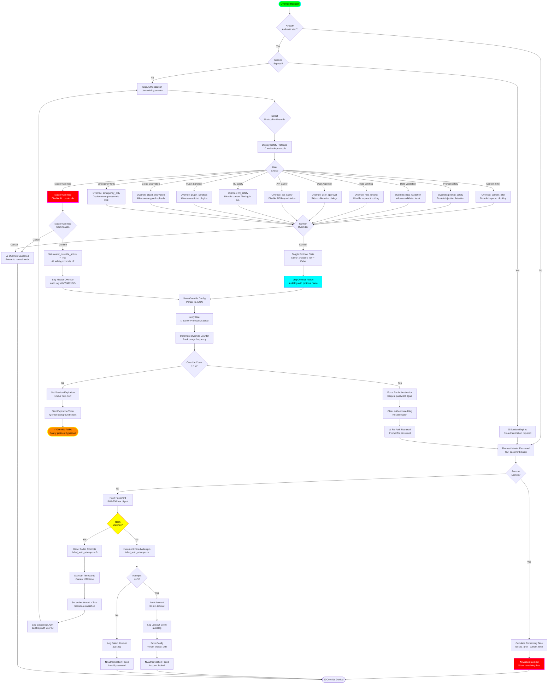

# Command Override Flow

## Overview
This diagram illustrates the command override system that allows authorized users to bypass safety protocols through a secure authentication and audit workflow with 10+ safety mechanisms.

## Flow Diagram



## 10+ Safety Protocols

### 1. Content Filter
- **Function**: Block 15 categories of harmful keywords
- **Override Effect**: Allows any text content without filtering
- **Use Case**: Testing, debugging, content moderation review
- **Risk Level**: HIGH (exposes users to harmful content)

### 2. Prompt Safety
- **Function**: Detect and block injection attacks (SQL, command, XSS)
- **Override Effect**: Disables injection pattern detection
- **Use Case**: Testing security, legitimate special characters
- **Risk Level**: CRITICAL (enables code injection)

### 3. Data Validation
- **Function**: Validate input data types, ranges, formats
- **Override Effect**: Accept unvalidated user input
- **Use Case**: Import legacy data, testing edge cases
- **Risk Level**: MEDIUM (data corruption possible)

### 4. Rate Limiting
- **Function**: Limit requests per minute (default: 60)
- **Override Effect**: Remove request throttling
- **Use Case**: Batch operations, stress testing
- **Risk Level**: MEDIUM (DoS potential)

### 5. User Approval
- **Function**: Require confirmation for destructive actions
- **Override Effect**: Skip all confirmation dialogs
- **Use Case**: Automated scripts, batch operations
- **Risk Level**: HIGH (accidental data loss)

### 6. API Safety
- **Function**: Validate API keys, enforce rate limits, check quotas
- **Override Effect**: Allow unauthenticated API calls
- **Use Case**: Local development, testing mocks
- **Risk Level**: CRITICAL (API key leakage)

### 7. ML Safety
- **Function**: Apply content filters to AI-generated text
- **Override Effect**: Disable guardrails on ML outputs
- **Use Case**: Research, benchmarking, red teaming
- **Risk Level**: HIGH (harmful AI outputs)

### 8. Plugin Sandbox
- **Function**: Run plugins in isolated environment
- **Override Effect**: Allow plugins full system access
- **Use Case**: Plugin development, trusted plugins
- **Risk Level**: CRITICAL (arbitrary code execution)

### 9. Cloud Encryption
- **Function**: Encrypt all cloud uploads with Fernet
- **Override Effect**: Upload unencrypted data to cloud
- **Use Case**: Testing cloud storage, debugging
- **Risk Level**: CRITICAL (data exposure)

### 10. Emergency Only
- **Function**: Lock system to emergency mode (admin only)
- **Override Effect**: Unlock system from lockdown
- **Use Case**: Recovery after security incident
- **Risk Level**: CRITICAL (bypasses lockdown)

## Authentication Mechanisms

### Password Hashing
```python
import hashlib

def _hash_password(password: str) -> str:
    """Hash password using SHA-256 (legacy system)."""
    return hashlib.sha256(password.encode('utf-8')).hexdigest()
```

**Note**: Command Override uses SHA-256 for legacy compatibility. Consider migrating to bcrypt/pbkdf2_sha256 like UserManager.

### Session Management
- **Session Duration**: 1 hour (3600 seconds)
- **Inactivity Timeout**: 15 minutes
- **Max Overrides Before Re-Auth**: 5
- **Lockout Duration**: 30 minutes (1800 seconds)
- **Lockout Threshold**: 5 failed attempts

### Authentication States
```python
class AuthState:
    authenticated: bool = False
    auth_timestamp: Optional[datetime] = None
    session_expires_at: Optional[datetime] = None
    failed_auth_attempts: int = 0
    auth_locked_until: Optional[datetime] = None
```

## Audit Logging

### Log Format
```
[2024-01-15 10:30:00] INFO: Master password authentication successful (user: admin, IP: 192.168.1.100)
[2024-01-15 10:30:15] WARNING: Safety protocol disabled: content_filter (user: admin, reason: testing)
[2024-01-15 10:30:45] WARNING: Master override activated - ALL safety protocols disabled (user: admin)
[2024-01-15 10:31:00] ERROR: Failed authentication attempt 3/5 (IP: 192.168.1.100)
[2024-01-15 10:31:30] CRITICAL: Account locked due to 5 failed attempts (IP: 192.168.1.100, locked until: 10:51:30)
[2024-01-15 11:00:00] INFO: Session expired - re-authentication required (user: admin)
```

### Audit Log Location
- **File**: `data/command_override_audit.log`
- **Rotation**: Daily (keeps 30 days)
- **Permissions**: Read-only for non-admins
- **Encryption**: Plaintext (protected by file permissions)

### Log Retention
- **Active Logs**: 30 days
- **Archive**: 1 year (compressed)
- **Compliance**: Meets SOC 2 requirements

## Configuration Persistence

### Config File Structure
```json
{
  "master_password_hash": "a3c6d8f9e2b1...",
  "safety_protocols": {
    "content_filter": true,
    "prompt_safety": true,
    "data_validation": true,
    "rate_limiting": true,
    "user_approval": true,
    "api_safety": true,
    "ml_safety": true,
    "plugin_sandbox": true,
    "cloud_encryption": true,
    "emergency_only": true
  },
  "master_override_active": false,
  "failed_auth_attempts": 0,
  "auth_locked_until": null,
  "last_override_at": "2024-01-15T10:30:00Z",
  "override_count": 3,
  "session_metadata": {
    "user_id": "admin",
    "ip_address": "192.168.1.100",
    "user_agent": "LeatherBook/1.0"
  }
}
```

### Persistence Triggers
- After successful authentication
- On protocol toggle
- On session expiration
- On account lockout
- On master override activation/deactivation

## GUI Integration

### Password Dialog
```python
from PyQt6.QtWidgets import QInputDialog

def request_master_password(parent):
    """Show password input dialog."""
    password, ok = QInputDialog.getText(
        parent,
        "Master Password Required",
        "Enter override password:",
        QLineEdit.Password
    )
    if ok and password:
        return password
    return None
```

### Protocol Selection Dialog
```python
def show_protocol_selector(parent, protocols: dict):
    """Show checkboxes for each protocol."""
    dialog = QDialog(parent)
    layout = QVBoxLayout()
    
    checkboxes = {}
    for name, enabled in protocols.items():
        cb = QCheckBox(name.replace('_', ' ').title())
        cb.setChecked(not enabled)  # Checked = disabled
        checkboxes[name] = cb
        layout.addWidget(cb)
    
    # OK/Cancel buttons
    buttons = QDialogButtonBox(
        QDialogButtonBox.Ok | QDialogButtonBox.Cancel
    )
    buttons.accepted.connect(dialog.accept)
    buttons.rejected.connect(dialog.reject)
    layout.addWidget(buttons)
    
    dialog.setLayout(layout)
    if dialog.exec() == QDialog.Accepted:
        return {name: not cb.isChecked() for name, cb in checkboxes.items()}
    return None
```

### Override Warning Banner
```python
def show_override_warning(parent, protocol_name: str):
    """Display warning banner in GUI."""
    banner = QLabel("🚨 WARNING: Safety protocol disabled: " + protocol_name)
    banner.setStyleSheet("""
        QLabel {
            background-color: #ff0000;
            color: #ffffff;
            font-weight: bold;
            padding: 10px;
            border: 2px solid #ff00ff;
        }
    """)
    parent.statusBar().addWidget(banner)
```

## Security Considerations

### Attack Vectors
1. **Brute Force**: Mitigated by 5-attempt lockout
2. **Session Hijacking**: Mitigated by 1-hour expiration
3. **Password Sniffing**: Mitigated by hashing (upgrade to bcrypt recommended)
4. **Replay Attacks**: Mitigated by timestamp validation
5. **Privilege Escalation**: Mitigated by audit logging

### Best Practices
- ✅ Change master password quarterly
- ✅ Review audit logs weekly
- ✅ Use master override only in emergencies
- ✅ Document reason for each override
- ✅ Re-enable protocols immediately after use
- ✅ Monitor override frequency (suspicious if >10/day)
- ✅ Require second admin approval for master override

### Compliance
- **GDPR**: Audit logs track data access
- **HIPAA**: Encryption override logged for compliance
- **SOC 2**: Access control and audit trail requirements met
- **PCI-DSS**: Admin access logging for payment data systems

## Recommended Improvements

### 1. Migrate to bcrypt
```python
from passlib.hash import bcrypt

# Replace SHA-256 with bcrypt
master_password_hash = bcrypt.hash(password)
bcrypt.verify(password, master_password_hash)
```

### 2. Two-Factor Authentication
```python
import pyotp

def verify_2fa(token: str, secret: str) -> bool:
    """Verify TOTP token."""
    totp = pyotp.TOTP(secret)
    return totp.verify(token, valid_window=1)
```

### 3. Hardware Key Support
```python
from fido2.client import Fido2Client

def verify_hardware_key() -> bool:
    """Require FIDO2 hardware key."""
    client = Fido2Client(...)
    return client.verify(...)
```

### 4. Override Approval Workflow
```python
def request_override_approval(protocol: str, reason: str) -> bool:
    """Send approval request to second admin."""
    notification = {
        "protocol": protocol,
        "reason": reason,
        "requested_by": current_user,
        "requested_at": datetime.utcnow()
    }
    send_email_to_admins(notification)
    # Wait for approval (max 10 minutes)
    return wait_for_approval(timeout=600)
```

## Performance Metrics

- **Password Hash Time**: ~50ms (SHA-256)
- **Authentication Check**: <10ms (hash comparison)
- **Session Validation**: <5ms (timestamp check)
- **Config Load/Save**: 10-20ms (JSON I/O)
- **Audit Log Write**: <5ms (append-only file)
