# Deployment Pipeline Flow

## Overview
This diagram illustrates the comprehensive CI/CD deployment pipeline including automated testing, linting, security scanning, Docker build, and deployment to production environments.

## Flow Diagram

```mermaid
flowchart TD
    Start([Code Push to Repository]) --> TriggerCI{Trigger<br/>Event}
    TriggerCI -->|Push to main| MainBuild[Main Branch Build<br/>Full pipeline]
    TriggerCI -->|Pull Request| PRBuild[PR Build<br/>Validation pipeline]
    TriggerCI -->|Tag v*| ReleaseBuild[Release Build<br/>Production deployment]
    
    MainBuild --> CheckoutCode
    PRBuild --> CheckoutCode
    ReleaseBuild --> CheckoutCode[Checkout Code<br/>git clone --depth=1]
    
    CheckoutCode --> SetupPython[Setup Python Environment<br/>Python 3.11 and 3.12]
    SetupPython --> InstallDeps[Install Dependencies<br/>pip install -r requirements.txt]
    InstallDeps --> InstallDevDeps[Install Dev Dependencies<br/>pytest, ruff, mypy, pip-audit]
    
    InstallDevDeps --> LintingPhase[Linting Phase<br/>Code quality checks]
    LintingPhase --> RuffLint[Ruff Linting<br/>ruff check .]
    RuffLint --> RuffFix{Linting<br/>Passed?}
    RuffFix -->|No| LintFailed[❌ Linting Failed<br/>Comment on PR with errors]
    RuffFix -->|Yes| RuffFormat[Ruff Format Check<br/>ruff format --check .]
    
    RuffFormat --> FormatCheck{Format<br/>Correct?}
    FormatCheck -->|No| FormatFailed[❌ Format Failed<br/>Suggest ruff format .]
    FormatCheck -->|Yes| TypeCheck[Type Checking<br/>mypy src/]
    
    TypeCheck --> TypeResult{Type Check<br/>Passed?}
    TypeResult -->|No| TypeFailed[❌ Type Errors<br/>Show mypy output]
    TypeResult -->|Yes| SecurityPhase[Security Scanning Phase]
    
    SecurityPhase --> PipAudit[Dependency Audit<br/>pip-audit --desc]
    PipAudit --> VulnCheck{Vulnerabilities<br/>Found?}
    VulnCheck -->|Yes| VulnReport[⚠️ Vulnerabilities Detected<br/>Create security issue]
    VulnCheck -->|No| BanditScan[Bandit Security Scan<br/>bandit -r src/]
    
    VulnReport --> BanditScan
    BanditScan --> BanditResult{Security<br/>Issues?}
    BanditResult -->|Yes| SecurityFailed[❌ Security Issues Found<br/>Upload SARIF to GitHub]
    BanditResult -->|No| CodeQLScan[CodeQL Analysis<br/>Advanced security scanning]
    
    SecurityFailed --> CodeQLScan
    CodeQLScan --> CodeQLBuild[Build CodeQL Database<br/>Analyze Python code]
    CodeQLBuild --> CodeQLAnalyze[Perform CodeQL Analysis<br/>Security queries]
    CodeQLAnalyze --> CodeQLUpload[Upload Results to GitHub<br/>Security tab integration]
    
    CodeQLUpload --> TestPhase[Testing Phase<br/>Unit and integration tests]
    TestPhase --> PyTest[Run PyTest<br/>pytest -v --cov=src]
    PyTest --> TestResult{Tests<br/>Passed?}
    TestResult -->|No| TestFailed[❌ Tests Failed<br/>Show failed test output]
    TestResult -->|Yes| CoverageCheck[Coverage Analysis<br/>pytest-cov report]
    
    CoverageCheck --> CoverageThreshold{Coverage<br/>>= 80%?}
    CoverageThreshold -->|No| CoverageWarning[⚠️ Low Coverage Warning<br/>Continue anyway]
    CoverageThreshold -->|Yes| CoveragePass[✅ Coverage Adequate]
    
    CoverageWarning --> DockerPhase
    CoveragePass --> DockerPhase[Docker Build Phase<br/>Container creation]
    
    DockerPhase --> DockerBuild[Build Docker Image<br/>Multi-stage build]
    DockerBuild --> BuilderStage[Builder Stage<br/>Install dependencies]
    BuilderStage --> RuntimeStage[Runtime Stage<br/>Copy app files]
    RuntimeStage --> HealthCheck[Add Health Check<br/>Container monitoring]
    
    HealthCheck --> DockerTag[Tag Docker Image<br/>latest, version tag]
    DockerTag --> DockerTest[Test Docker Image<br/>Smoke tests]
    DockerTest --> SmokeTest{Smoke Test<br/>Passed?}
    
    SmokeTest -->|No| DockerFailed[❌ Docker Build Failed<br/>Show container logs]
    SmokeTest -->|Yes| CheckDeployment{Deployment<br/>Required?}
    
    CheckDeployment -->|PR| SkipDeploy[Skip Deployment<br/>Validation only]
    CheckDeployment -->|Main| StagingDeploy[Deploy to Staging<br/>staging.projectai.com]
    CheckDeployment -->|Release| ProductionDeploy[Deploy to Production<br/>projectai.com]
    
    StagingDeploy --> PushRegistry[Push to Container Registry<br/>Docker Hub / GHCR]
    ProductionDeploy --> PushRegistry
    
    PushRegistry --> RegistryAuth[Authenticate Registry<br/>Docker login]
    RegistryAuth --> PushImage[Push Image<br/>docker push]
    PushImage --> VerifyPush{Push<br/>Successful?}
    
    VerifyPush -->|No| PushFailed[❌ Registry Push Failed<br/>Check credentials]
    VerifyPush -->|Yes| DeploymentPhase[Deployment Phase<br/>Environment update]
    
    DeploymentPhase --> UpdateCompose[Update docker-compose.yml<br/>New image tag]
    UpdateCompose --> PullImage[Pull New Image<br/>docker-compose pull]
    PullImage --> StopContainers[Stop Old Containers<br/>docker-compose down]
    StopContainers --> StartContainers[Start New Containers<br/>docker-compose up -d]
    
    StartContainers --> WaitHealth[Wait for Health Check<br/>30s timeout]
    WaitHealth --> HealthStatus{Health Check<br/>Passed?}
    HealthStatus -->|No| RollbackDeploy[🔄 Rollback Deployment<br/>Restore previous version]
    HealthStatus -->|Yes| VerifyEndpoints[Verify Endpoints<br/>HTTP health checks]
    
    RollbackDeploy --> RollbackImage[Pull Previous Image Tag<br/>Restore last known good]
    RollbackImage --> RollbackStart[Start Previous Containers<br/>Ensure stability]
    RollbackStart --> NotifyFailure[Notify Team<br/>Deployment failed alert]
    
    VerifyEndpoints --> EndpointTest{Endpoints<br/>Responsive?}
    EndpointTest -->|No| RollbackDeploy
    EndpointTest -->|Yes| PostDeploy[Post-Deployment Tasks]
    
    PostDeploy --> ClearCache[Clear Application Cache<br/>Redis FLUSHALL]
    ClearCache --> WarmCache[Warm Cache<br/>Pre-load critical data]
    WarmCache --> RunMigrations[Run Database Migrations<br/>If applicable]
    RunMigrations --> NotifySuccess[Notify Team<br/>✅ Deployment successful]
    
    NotifySuccess --> UpdateSlack[Post to Slack<br/>Deployment notification]
    UpdateSlack --> CreateRelease[Create GitHub Release<br/>Tag release notes]
    CreateRelease --> GenerateSBOM[Generate SBOM<br/>Software Bill of Materials]
    GenerateSBOM --> Success([✅ Deployment Complete])
    
    SkipDeploy --> MarkSuccess[✅ Validation Complete<br/>PR ready for merge]
    MarkSuccess --> Success
    
    LintFailed --> End([❌ Pipeline Failed])
    FormatFailed --> End
    TypeFailed --> End
    TestFailed --> End
    DockerFailed --> End
    PushFailed --> End
    NotifyFailure --> End
    
    style Start fill:#00ff00,stroke:#00ffff,stroke-width:3px,color:#000
    style Success fill:#00ff00,stroke:#00ffff,stroke-width:3px,color:#000
    style LintFailed fill:#ff0000,stroke:#ff00ff,stroke-width:2px,color:#fff
    style TestFailed fill:#ff0000,stroke:#ff00ff,stroke-width:2px,color:#fff
    style RollbackDeploy fill:#ff8800,stroke:#ffff00,stroke-width:2px,color:#000
    style DockerPhase fill:#00ffff,stroke:#0088ff,stroke-width:2px,color:#000
    style SecurityPhase fill:#ffff00,stroke:#ff8800,stroke-width:2px,color:#000
```



## CI/CD Workflow Configuration

### GitHub Actions Workflow
**File**: `.github/workflows/ci.yml` (example structure based on project)

```yaml
name: CI Pipeline

on:
  push:
    branches: [main, cerberus-integration]
  pull_request:
    branches: [main]
  release:
    types: [published]

jobs:
  lint-and-test:
    runs-on: ubuntu-latest
    strategy:
      matrix:
        python-version: ['3.11', '3.12']
    
    steps:
      - name: Checkout code
        uses: actions/checkout@v4
      
      - name: Set up Python
        uses: actions/setup-python@v5
        with:
          python-version: ${{ matrix.python-version }}
      
      - name: Install dependencies
        run: |
          pip install --upgrade pip
          pip install -r requirements.txt
          pip install -r requirements-dev.txt
      
      - name: Ruff linting
        run: ruff check . --output-format=github
      
      - name: Ruff format check
        run: ruff format --check .
      
      - name: Type checking
        run: mypy src/ --show-error-codes
      
      - name: Run tests
        run: pytest -v --cov=src --cov-report=xml
      
      - name: Upload coverage
        uses: codecov/codecov-action@v4
        with:
          files: ./coverage.xml

  security-scan:
    runs-on: ubuntu-latest
    steps:
      - name: Checkout code
        uses: actions/checkout@v4
      
      - name: Dependency audit
        run: pip-audit --desc --format=json > audit-report.json
      
      - name: Bandit security scan
        run: bandit -r src/ -f sarif -o bandit-results.sarif
      
      - name: Upload SARIF results
        uses: github/codeql-action/upload-sarif@v3
        with:
          sarif_file: bandit-results.sarif

  codeql-analysis:
    runs-on: ubuntu-latest
    permissions:
      security-events: write
    steps:
      - name: Checkout code
        uses: actions/checkout@v4
      
      - name: Initialize CodeQL
        uses: github/codeql-action/init@v3
        with:
          languages: python
      
      - name: Perform CodeQL Analysis
        uses: github/codeql-action/analyze@v3

  docker-build:
    needs: [lint-and-test, security-scan]
    runs-on: ubuntu-latest
    steps:
      - name: Checkout code
        uses: actions/checkout@v4
      
      - name: Set up Docker Buildx
        uses: docker/setup-buildx-action@v3
      
      - name: Build Docker image
        run: docker build -t project-ai:test .
      
      - name: Run smoke tests
        run: |
          docker run -d --name test-container project-ai:test
          sleep 10
          docker ps | grep test-container
          docker stop test-container

  deploy-staging:
    needs: docker-build
    runs-on: ubuntu-latest
    if: github.ref == 'refs/heads/main'
    steps:
      - name: Deploy to staging
        run: |
          # SSH to staging server
          # Pull new image
          # docker-compose up -d
          # Verify health

  deploy-production:
    needs: docker-build
    runs-on: ubuntu-latest
    if: github.event_name == 'release'
    steps:
      - name: Deploy to production
        run: |
          # SSH to production server
          # Pull new image with version tag
          # docker-compose up -d
          # Verify health
```

## Linting and Code Quality

### Ruff Configuration
**File**: `pyproject.toml`

```toml
[tool.ruff]
line-length = 100
target-version = "py311"

[tool.ruff.lint]
select = [
    "E",   # pycodestyle errors
    "W",   # pycodestyle warnings
    "F",   # pyflakes
    "I",   # isort
    "B",   # flake8-bugbear
    "C4",  # flake8-comprehensions
    "UP",  # pyupgrade
    "S",   # bandit security
]
ignore = [
    "E501",  # line too long (handled by formatter)
    "B008",  # function call in argument defaults
]

[tool.ruff.format]
quote-style = "double"
indent-style = "space"
line-ending = "auto"
```

### Mypy Configuration
```toml
[tool.mypy]
python_version = "3.11"
warn_return_any = true
warn_unused_configs = true
disallow_untyped_defs = false
check_untyped_defs = true
ignore_missing_imports = true
```

## Testing Strategy

### PyTest Configuration
```toml
[tool.pytest.ini_options]
testpaths = ["tests"]
python_files = "test_*.py"
python_classes = "Test*"
python_functions = "test_*"
addopts = "-v --cov=src --cov-report=term-missing --cov-report=html"
```

### Test Coverage Requirements
- **Minimum Coverage**: 80%
- **Critical Modules**: 90% (user_manager, ai_systems, governance)
- **GUI Modules**: 60% (PyQt6 testing limited)
- **Utility Modules**: 95% (path_security, data_persistence)

### Test Categories
1. **Unit Tests**: Individual function/method testing
2. **Integration Tests**: Multi-component interaction
3. **Security Tests**: Injection, XSS, path traversal
4. **Performance Tests**: Response time, memory usage
5. **GUI Tests**: Limited (manual testing preferred)

## Docker Multi-Stage Build

### Dockerfile
```dockerfile
# Builder stage
FROM python:3.11-slim AS builder

WORKDIR /app

# Install build dependencies
RUN apt-get update && apt-get install -y --no-install-recommends \
    gcc \
    g++ \
    && rm -rf /var/lib/apt/lists/*

# Install Python dependencies
COPY requirements.txt .
RUN pip install --no-cache-dir --user -r requirements.txt

# Runtime stage
FROM python:3.11-slim

WORKDIR /app

# Install runtime dependencies only
RUN apt-get update && apt-get install -y --no-install-recommends \
    libqt6widgets6 \
    libqt6gui6 \
    libqt6core6 \
    && rm -rf /var/lib/apt/lists/*

# Copy Python packages from builder
COPY --from=builder /root/.local /root/.local

# Copy application code
COPY src/ ./src/
COPY data/ ./data/
COPY .env .env

# Set Python path
ENV PATH=/root/.local/bin:$PATH
ENV PYTHONPATH=/app

# Health check
HEALTHCHECK --interval=30s --timeout=10s --start-period=40s --retries=3 \
    CMD python -c "import sys; sys.exit(0)"

# Run application
CMD ["python", "-m", "src.app.main"]
```

### Build Optimization
- **Layer Caching**: Dependencies installed before code copy
- **Multi-Stage**: Reduce final image size by ~60%
- **Slim Base**: Use python:3.11-slim instead of full image
- **No Cache**: `--no-cache-dir` prevents pip cache bloat
- **Clean APT**: Remove package lists after install

## Security Scanning

### Pip-Audit
Scans Python dependencies for known vulnerabilities:

```bash
pip-audit --desc --format=json --output=audit-report.json
```

**Output**:
```json
{
  "vulnerabilities": [
    {
      "name": "requests",
      "version": "2.28.0",
      "id": "PYSEC-2023-74",
      "fix_versions": ["2.31.0"],
      "description": "HTTP request smuggling vulnerability"
    }
  ]
}
```

### Bandit
Static analysis for Python security issues:

```bash
bandit -r src/ -f sarif -o bandit-results.sarif
```

**Detected Issues**:
- B201: Flask app in debug mode
- B301: Pickle usage (insecure deserialization)
- B303: MD5/SHA1 usage (weak hashing)
- B608: SQL injection via string formatting
- B601: Shell injection via subprocess

### CodeQL
Advanced semantic code analysis:

**Query Packs**:
- `python-security-and-quality`
- `python-code-scanning`
- `python-queries`

**Detected Patterns**:
- SQL injection
- Command injection
- Path traversal
- Cross-site scripting (XSS)
- Hardcoded credentials
- Insecure randomness

## Deployment Strategies

### Blue-Green Deployment
1. **Blue**: Current production (v1.0)
2. **Green**: New version (v1.1)
3. **Switch**: Route traffic from Blue → Green
4. **Rollback**: Route traffic Green → Blue if issues

### Canary Deployment
1. **Deploy**: v1.1 to 10% of servers
2. **Monitor**: Error rates, latency, health checks
3. **Scale**: Increase to 50%, then 100% if healthy
4. **Rollback**: Reduce to 0% if errors detected

### Rolling Deployment
1. **Update**: 1 server at a time
2. **Verify**: Health check before next server
3. **Continue**: Until all servers updated
4. **Rollback**: Restore previous version if failure

## Health Checks

### Container Health Check
```bash
#!/bin/bash
# Health check script

# Check if Python process is running
if ! pgrep -f "python.*main" > /dev/null; then
    echo "Application process not running"
    exit 1
fi

# Check if GUI is responsive (headless)
if ! python -c "from PyQt6.QtWidgets import QApplication; import sys; app = QApplication(sys.argv); sys.exit(0)"; then
    echo "GUI framework not responsive"
    exit 1
fi

echo "Health check passed"
exit 0
```

### HTTP Health Endpoint
For web backend deployment:

```python
@app.route('/health')
def health_check():
    """Health check endpoint for load balancer."""
    checks = {
        "database": check_database_connection(),
        "redis": check_redis_connection(),
        "disk_space": check_disk_space() > 1024 * 1024 * 1024,  # > 1GB
        "memory": check_memory_usage() < 0.9  # < 90%
    }
    
    if all(checks.values()):
        return jsonify({"status": "healthy", "checks": checks}), 200
    else:
        return jsonify({"status": "unhealthy", "checks": checks}), 503
```

## Post-Deployment Verification

### Smoke Tests
```bash
#!/bin/bash
# Smoke test suite

BASE_URL="https://projectai.com"

# Test homepage
if ! curl -f -s "$BASE_URL" > /dev/null; then
    echo "Homepage unreachable"
    exit 1
fi

# Test health endpoint
if ! curl -f -s "$BASE_URL/health" | jq -e '.status == "healthy"' > /dev/null; then
    echo "Health check failed"
    exit 1
fi

# Test API endpoint
if ! curl -f -s "$BASE_URL/api/v1/status" > /dev/null; then
    echo "API unreachable"
    exit 1
fi

echo "Smoke tests passed"
exit 0
```

### Performance Baseline
```python
import time
import requests

def performance_test():
    """Verify deployment doesn't degrade performance."""
    endpoints = [
        "/",
        "/api/v1/chat",
        "/api/v1/image/generate",
    ]
    
    for endpoint in endpoints:
        start = time.time()
        response = requests.get(f"https://projectai.com{endpoint}")
        latency = time.time() - start
        
        assert response.status_code == 200
        assert latency < 2.0, f"Endpoint {endpoint} too slow: {latency}s"
    
    print("Performance baseline met")
```

## Rollback Procedures

### Automatic Rollback Triggers
1. Health check fails for >30 seconds
2. Error rate exceeds 5% threshold
3. Memory usage exceeds 95%
4. Disk space below 5%
5. Critical endpoint returns 500 errors

### Manual Rollback
```bash
# Rollback to previous Docker image
docker-compose down
docker pull projectai:v1.0.5  # Previous stable version
docker-compose up -d

# Verify health
./scripts/health-check.sh

# Notify team
./scripts/notify-rollback.sh "Rolled back to v1.0.5 due to XYZ issue"
```

## Notification System

### Slack Integration
```python
import requests

def notify_deployment(version: str, status: str):
    """Send deployment notification to Slack."""
    webhook_url = os.getenv("SLACK_WEBHOOK_URL")
    
    color = "good" if status == "success" else "danger"
    
    payload = {
        "attachments": [{
            "color": color,
            "title": f"Deployment {status.upper()}: v{version}",
            "fields": [
                {"title": "Environment", "value": "Production", "short": True},
                {"title": "Version", "value": version, "short": True},
                {"title": "Deployed By", "value": "GitHub Actions", "short": True},
                {"title": "Time", "value": datetime.utcnow().isoformat(), "short": True}
            ]
        }]
    }
    
    requests.post(webhook_url, json=payload)
```

## SBOM Generation

### Software Bill of Materials
```bash
# Generate SBOM with pip-licenses
pip-licenses --format=json --output-file=sbom.json

# Generate SBOM with CycloneDX
cyclonedx-py -i requirements.txt -o sbom-cyclonedx.json
```

**Use Cases**:
- Security audits
- License compliance
- Vulnerability tracking
- Supply chain security

## Performance Metrics

### Pipeline Execution Times
- **Linting**: 30-60 seconds
- **Type Checking**: 20-40 seconds
- **Tests**: 2-5 minutes (14 tests)
- **Security Scans**: 1-3 minutes
- **Docker Build**: 3-5 minutes
- **Deployment**: 2-4 minutes
- **Total Pipeline**: 10-20 minutes

### Optimization Targets
- Reduce Docker build time with layer caching
- Parallelize test execution across files
- Cache pip dependencies between runs
- Use Docker BuildKit for faster builds
