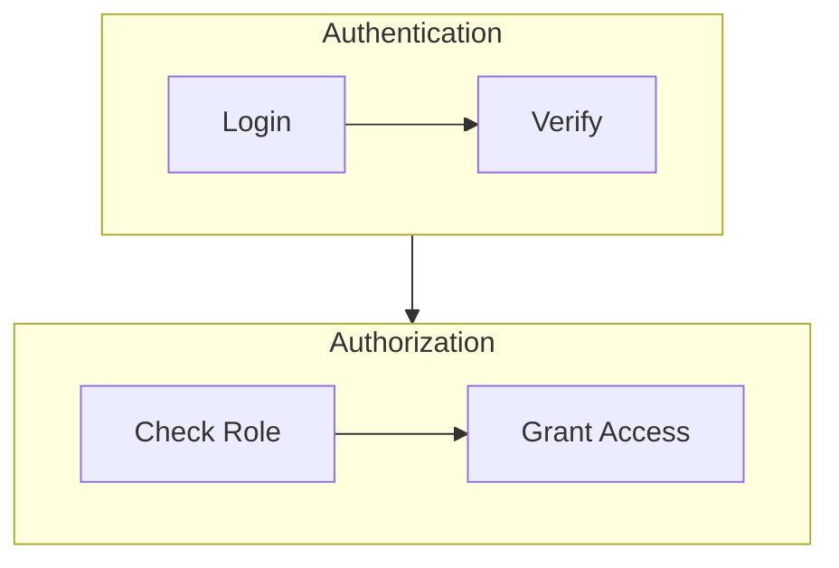

# Flow Diagrams Usage Guide

## Overview

This directory contains 8 production-ready Mermaid flow diagrams documenting critical processes in the Project-AI system. These diagrams provide visual representations of complex workflows, making the codebase easier to understand, maintain, and extend.

## Available Diagrams

### 1. User Authentication Flow
**File**: `1-user-authentication-flow.md`

**Purpose**: Complete user authentication workflow with password hashing, lockout protection, and Fernet encryption.

**Key Components**:
- pbkdf2_sha256 password hashing
- 5-attempt lockout with 30-minute duration
- Fernet cipher setup from environment
- Automatic plaintext password migration
- Session management and persistence

**When to Use**:
- Implementing new authentication features
- Debugging login issues
- Security audits of authentication system
- Onboarding new developers to security model

### 2. AI Query Processing Flow
**File**: `2-ai-query-processing-flow.md`

**Purpose**: End-to-end AI query processing including intent detection, governance validation, persona integration, and response generation.

**Key Components**:
- Scikit-learn intent classification
- Triumvirate Council governance
- Four Laws validation hierarchy
- AI Persona integration (8 traits)
- Memory and relationship systems
- OpenAI GPT-4 integration

**When to Use**:
- Understanding query routing logic
- Adding new intent types
- Debugging governance blocks
- Optimizing response generation pipeline
- Integrating new AI capabilities

### 3. Governance Validation Flow
**File**: `3-governance-validation-flow.md`

**Purpose**: Comprehensive governance validation using Triumvirate Council and Four Laws to ensure ethical AI behavior.

**Key Components**:
- GALAHAD (Ethics & Empathy)
- CERBERUS (Safety & Security)
- CODEX DEUS MAXIMUS (Logic & Consistency)
- Zeroth → First → Second → Third Law hierarchy
- Planetary Defense Core delegation
- Governance decision logging

**When to Use**:
- Implementing new governance rules
- Debugging action rejections
- Security compliance audits
- Ethical AI behavior reviews
- Adding new safety protocols

### 4. Security Threat Detection Flow
**File**: `4-security-threat-detection-flow.md`

**Purpose**: Multi-layered security threat detection including content filtering, Black Vault, honeypots, and asymmetric security engine.

**Key Components**:
- Rate limiting and IP blocking
- Honeypot bot detection
- 15-category content filter
- SHA-256 Black Vault fingerprinting
- Asymmetric security engine (behavioral analysis)
- SQL/XSS/path traversal detection
- Cerberus lockdown protocol

**When to Use**:
- Security incident investigation
- Adding new threat detection rules
- Penetration testing planning
- Compliance audits (GDPR, SOC 2)
- Performance optimization of security pipeline

### 5. Data Persistence Flow
**File**: `5-data-persistence-flow.md`

**Purpose**: Comprehensive data persistence strategy with atomic writes, file locking, backups, and cloud sync.

**Key Components**:
- Atomic write pattern (temp → move)
- File locking (threading.Lock and SQLite)
- Backup rotation (keep 5 versions)
- Fernet encryption for cloud sync
- In-memory caching strategy
- Corruption detection and rollback

**When to Use**:
- Implementing new persistent systems
- Debugging data loss issues
- Disaster recovery planning
- Performance optimization
- Cloud sync troubleshooting

### 6. Command Override Flow
**File**: `6-command-override-flow.md`

**Purpose**: Secure command override system allowing authorized users to bypass safety protocols with comprehensive audit logging.

**Key Components**:
- SHA-256 password authentication
- 10 safety protocols (content filter, prompt safety, etc.)
- 5-attempt lockout with 30-minute duration
- 1-hour session expiration
- Master override (disable all protocols)
- Comprehensive audit logging

**When to Use**:
- Implementing privileged operations
- Security audits of override system
- Debugging authentication issues
- Adding new safety protocols
- Compliance reviews (audit trail)

### 7. Image Generation Flow
**File**: `7-image-generation-flow.md`

**Purpose**: AI image generation with dual backends (Hugging Face Stable Diffusion and OpenAI DALL-E), content filtering, and async processing.

**Key Components**:
- Dual backend support (HF SD 2.1, OpenAI DALL-E 3)
- 15-category content filter
- 10 style presets (photorealistic, anime, cyberpunk, etc.)
- QThread async generation (20-60s)
- Retry logic with exponential backoff
- Image history and metadata persistence

**When to Use**:
- Adding new image generation backends
- Debugging generation failures
- Implementing new style presets
- Performance optimization
- Cost analysis (API usage tracking)

### 8. Deployment Pipeline Flow
**File**: `8-deployment-pipeline-flow.md`

**Purpose**: Complete CI/CD deployment pipeline with automated testing, security scanning, Docker build, and production deployment.

**Key Components**:
- GitHub Actions workflow (lint, test, security, deploy)
- Ruff linting and formatting
- PyTest with 80% coverage requirement
- Security scanning (pip-audit, Bandit, CodeQL)
- Docker multi-stage build
- Blue-green deployment strategy
- Health checks and rollback procedures

**When to Use**:
- Setting up CI/CD for new features
- Debugging pipeline failures
- Security audit of deployment process
- Optimizing build times
- Implementing deployment strategies

## How to Use These Diagrams

### Viewing Diagrams

#### 1. GitHub (Recommended)
GitHub automatically renders Mermaid diagrams in Markdown files:
- Navigate to any `.md` file in this directory
- GitHub will display the flowchart inline
- Use zoom controls for large diagrams

#### 2. VS Code
Install Mermaid extension:
```bash
code --install-extension bierner.markdown-mermaid
```
Then open any `.md` file and use preview mode (Ctrl+Shift+V).

#### 3. Mermaid Live Editor
- Copy the Mermaid code block from any file
- Paste into https://mermaid.live/
- Edit and export as PNG/SVG

#### 4. Documentation Sites
These diagrams are embedded in:
- `PROGRAM_SUMMARY.md` (architecture overview)
- `DEVELOPER_QUICK_REFERENCE.md` (component reference)
- `.github/instructions/ARCHITECTURE_QUICK_REF.md` (visual guide)

### Embedding in Documentation

To embed a diagram in your documentation:

```markdown
## Authentication Flow

See the complete flow diagram: [User Authentication Flow](diagrams/flows/1-user-authentication-flow.md)

Or embed inline:

\```mermaid
flowchart TD
    Start([User Login]) --> Auth[Authenticate]
    Auth --> Success([Login Success])
\```
```

### Updating Diagrams

When code changes affect a flow:

1. **Identify Affected Diagram**: Map code change → diagram
2. **Update Mermaid Code**: Modify the flowchart in `.md` file
3. **Update Documentation**: Sync changes to related docs
4. **Verify Rendering**: Check GitHub/VS Code preview
5. **Run Codacy**: `codacy_cli_analyze` to check quality

**Example**:
```bash
# After editing 1-user-authentication-flow.md
codacy_cli_analyze --rootPath T:\Project-AI-main --file diagrams\flows\1-user-authentication-flow.md
```

### Creating New Diagrams

Template for new flow diagrams:

```markdown
# [Process Name] Flow

## Overview
[Brief description of the process and its purpose]

## Flow Diagram

\```mermaid
flowchart TD
    Start([Entry Point]) --> Step1[First Step]
    Step1 --> Decision{Decision?}
    Decision -->|Yes| Success([Success])
    Decision -->|No| Error([Error])
    
    style Start fill:#00ff00,stroke:#00ffff,stroke-width:3px,color:#000
    style Success fill:#00ff00,stroke:#00ffff,stroke-width:3px,color:#000
    style Error fill:#ff0000,stroke:#ff00ff,stroke-width:2px,color:#fff
\```

## Key Components

### Component 1
[Description, code examples, configuration]

### Component 2
[Description, code examples, configuration]

## Performance Characteristics
- Metric 1: Value
- Metric 2: Value

## Error Handling
[Common errors and resolutions]

## Related Systems
- [Link to related diagram/doc]
```

## Diagram Conventions

### Color Scheme (Tron-Inspired)
- **Start/Success**: Green (`#00ff00`) with cyan border (`#00ffff`)
- **Errors/Failures**: Red (`#ff0000`) with magenta border (`#ff00ff`)
- **Critical Operations**: Yellow (`#ffff00`) with orange border (`#ff8800`)
- **Data Operations**: Cyan (`#00ffff`) with blue border (`#0088ff`)

### Shape Conventions
- **Oval `([text])`**: Entry/exit points
- **Rectangle `[text]`**: Process/action steps
- **Diamond `{text}`**: Decision points
- **Hexagon `{{text}}`**: Database operations (if needed)

### Arrow Labels
- `-->|Yes|`: Positive/true path
- `-->|No|`: Negative/false path
- `-->|Error|`: Error handling path

### Naming Conventions
- **PascalCase**: Node IDs (`StartAuth`, `ValidatePassword`)
- **Title Case**: Display text (`User Login`, `Authentication Failed`)
- **Verb Phrases**: Action nodes (`Validate Credentials`, `Save to Database`)

## Performance Optimization

### Large Diagrams
For complex flows with >50 nodes:

1. **Split into Sub-Flows**: Break into logical sections
2. **Use Subgraphs**: Group related steps
3. **Simplify Decision Trees**: Combine similar paths
4. **Add Zoom Instructions**: Note areas requiring detail

Example:


### Rendering Speed
- Keep diagrams under 100 nodes for fast rendering
- Use external references for detailed sub-processes
- Consider splitting into multiple files if >150 lines

## Maintenance Schedule

### Weekly
- ✅ Verify diagrams render correctly on GitHub
- ✅ Check for broken internal links

### Monthly
- ✅ Review diagrams against code changes
- ✅ Update performance metrics
- ✅ Sync with documentation updates

### Quarterly
- ✅ Comprehensive audit of all 8 diagrams
- ✅ Add new diagrams for major features
- ✅ Archive outdated diagrams

## Integration with Development Workflow

### Pull Request Checklist
When submitting code changes:

- [ ] Identified affected flow diagrams
- [ ] Updated Mermaid code if process changed
- [ ] Updated related documentation sections
- [ ] Verified diagram renders correctly
- [ ] Ran Codacy analysis on modified diagrams

### Code Review
Reviewers should:

- [ ] Check if flow diagram accurately reflects code
- [ ] Verify performance metrics are up-to-date
- [ ] Ensure error handling is documented
- [ ] Confirm color scheme consistency

## Troubleshooting

### Diagram Not Rendering

**Problem**: Mermaid diagram not displaying on GitHub

**Solutions**:
1. Check for syntax errors (missing quotes, brackets)
2. Verify code block starts with ` ```mermaid`
3. Test in Mermaid Live Editor first
4. Check for unsupported Mermaid features

### Diagram Too Large

**Problem**: Diagram is cluttered and hard to read

**Solutions**:
1. Split into multiple diagrams (main flow + sub-flows)
2. Use subgraphs to organize sections
3. Simplify decision trees
4. Add "See detailed diagram" links

### Performance Issues

**Problem**: Diagram takes long to render

**Solutions**:
1. Reduce number of nodes (<100 recommended)
2. Simplify connections (avoid cross-overs)
3. Use external references for details
4. Consider splitting into separate files

## Best Practices

### Do's ✅
- Keep diagrams up-to-date with code changes
- Use consistent color scheme (Tron theme)
- Include performance metrics and error handling
- Provide context in Overview section
- Link to related documentation
- Test rendering before committing

### Don'ts ❌
- Don't create diagrams without documentation
- Don't use vague node labels ("Process", "Check")
- Don't exceed 150 lines per diagram
- Don't forget to update after code changes
- Don't use non-standard Mermaid syntax
- Don't skip color styling for critical nodes

## Contributing

To contribute new diagrams or updates:

1. **Fork Repository**: Create feature branch
2. **Create/Update Diagram**: Follow template and conventions
3. **Test Rendering**: Verify on GitHub/VS Code
4. **Update README**: Add entry to diagram list
5. **Run Codacy**: `codacy_cli_analyze` on modified files
6. **Submit PR**: Include before/after screenshots

## Support

For questions or issues:

- **Documentation**: See `PROGRAM_SUMMARY.md` for architecture context
- **GitHub Issues**: Report rendering problems or suggest improvements
- **Mermaid Docs**: https://mermaid.js.org/
- **Project Chat**: (if applicable)

## License

These diagrams are part of the Project-AI codebase and follow the same license as the main project.

---

**Last Updated**: 2024-01-15  
**Diagram Count**: 8  
**Total Coverage**: 8 critical system flows
