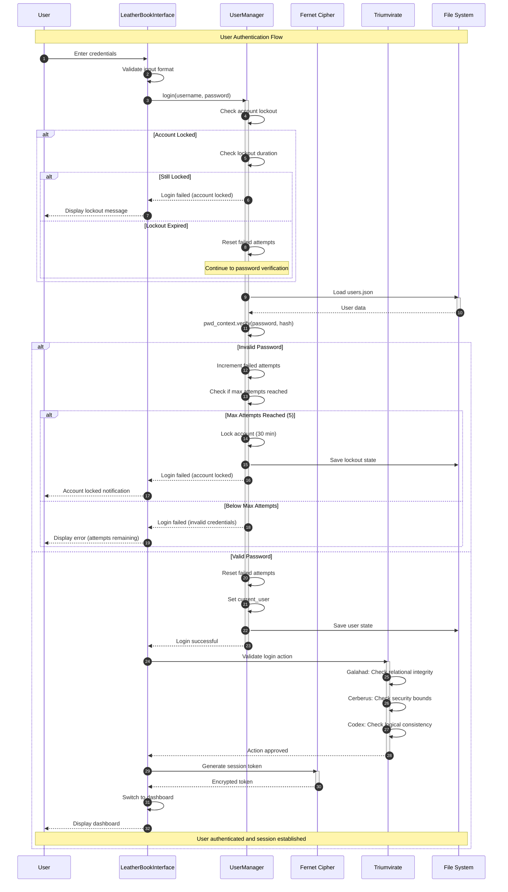

# User Login Sequence Diagram

## Overview
This diagram illustrates the complete user authentication flow in Project-AI, from initial login request through password verification, lockout protection, session establishment, and governance validation.

## Sequence Flow

## Key Components

### UserManager (`src/app/core/user_manager.py`)
- **Password Hashing**: Uses `passlib` with pbkdf2_sha256 (primary) and bcrypt (fallback)
- **Account Lockout**: 5 failed attempts → 30-minute lockout
- **State Persistence**: JSON file storage with atomic writes
- **Migration Support**: Auto-migrates plaintext passwords to hashes

### LeatherBookInterface (`src/app/gui/leather_book_interface.py`)
- **Login UI**: Tron-themed login page with input validation
- **Error Handling**: Displays remaining attempts and lockout duration
- **Session Management**: Stores encrypted session tokens
- **Page Switching**: Transitions from login (page 0) to dashboard (page 1)

### Triumvirate Governance (`src/app/core/governance.py`)
- **Galahad**: Validates user welfare and relationship health
- **Cerberus**: Ensures security boundaries and data protection
- **Codex Deus Maximus**: Checks logical consistency and prior commitments

### Fernet Cipher (`cryptography.fernet`)
- **Key Management**: Loads FERNET_KEY from environment
- **Token Generation**: Creates encrypted session identifiers
- **Secure Storage**: Encrypts sensitive user data

## Security Features

1. **Timing Attack Protection**: Constant-time password comparison via passlib
2. **Path Traversal Protection**: Validates filenames before file operations
3. **Rate Limiting**: Account lockout prevents brute-force attacks
4. **Secure Hashing**: pbkdf2_sha256 with automatic salt generation
5. **Audit Logging**: All login attempts logged with timestamps

## Error Handling

| Error Condition | Response | User Feedback |
|----------------|----------|---------------|
| Invalid credentials | Increment failed attempts | "Invalid username or password (X attempts remaining)" |
| Account locked | Reject login | "Account locked. Try again in X minutes" |
| Lockout expired | Reset attempts, allow login | Normal login flow |
| Missing user file | Create new users.json | Onboarding flow |
| Corrupted data | Fallback to empty state | Error message + admin contact |

## Usage in Documentation

This diagram is referenced in:
- **User Authentication Flow** (`docs/security/authentication.md`)
- **Security Architecture** (`docs/architecture/security.md`)
- **User Management Guide** (`docs/user-guide/authentication.md`)

## Testing

Covered by:
- `tests/test_user_manager.py::TestUserManager::test_login_success`
- `tests/test_user_manager.py::TestUserManager::test_login_failure`
- `tests/test_user_manager.py::TestUserManager::test_account_lockout`
- `tests/integration/test_auth_flow.py`

## Related Diagrams

- [Governance Validation Sequence](./03-governance-validation-sequence.md) - Details the Triumvirate decision process
- [Security Alert Sequence](./04-security-alert-sequence.md) - Shows automated security responses
- [API Request/Response Sequence](./06-api-request-response-sequence.md) - Web API authentication flow
