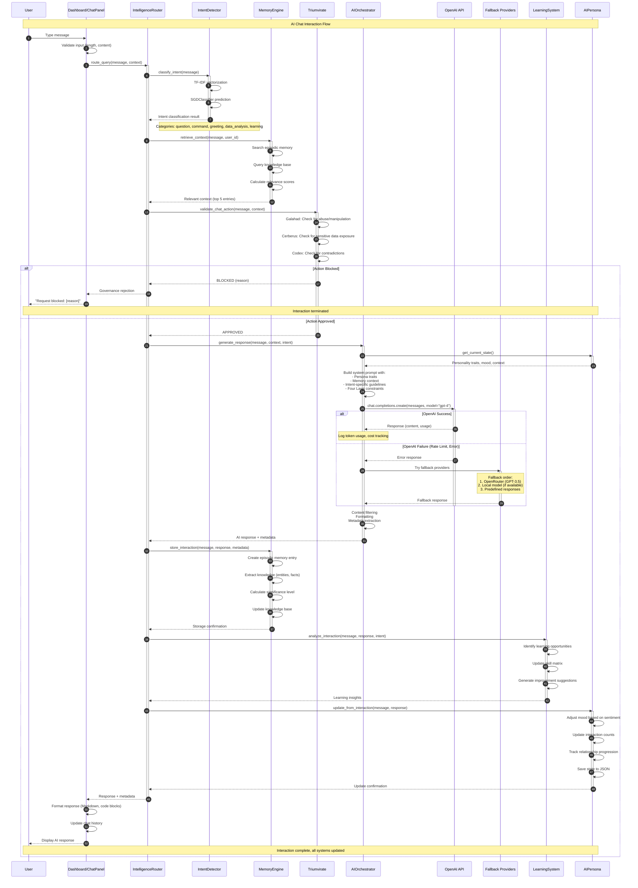

# AI Chat Interaction Sequence Diagram

## Overview
This diagram illustrates the complete AI chat interaction flow, from user message input through governance validation, intent detection, memory retrieval, AI orchestration with multi-provider fallback, and response delivery with learning integration.

## Sequence Flow

## Key Components

### IntelligenceRouter (`src/app/core/intelligence_engine.py`)
- **Query Routing**: Routes to knowledge, functions, or general chat
- **Context Aggregation**: Combines memory, persona, and governance data
- **Response Coordination**: Orchestrates multi-system interactions
- **Error Handling**: Manages failures across all subsystems

### IntentDetector (`src/app/core/intent_detection.py`)
- **ML Model**: SGDClassifier with TF-IDF vectorization
- **Intent Categories**: question, command, greeting, data_analysis, learning, general
- **Training Data**: Pre-trained on labeled examples
- **Confidence Scoring**: Returns probability distribution across intents

### MemoryEngine (`src/app/core/memory_engine.py`)
- **Episodic Memory**: Stores user-AI interactions with timestamps
- **Knowledge Base**: 6 categories (technical, conversational, factual, preferences, skills, relationships)
- **Semantic Search**: TF-IDF-based relevance scoring
- **Significance Levels**: CRITICAL, HIGH, MEDIUM, LOW for memory prioritization

### AIOrchestrator (`src/app/core/ai/orchestrator.py`)
- **Multi-Provider Support**: OpenAI (primary), OpenRouter (fallback), local models
- **Prompt Engineering**: Builds context-aware system prompts
- **Token Management**: Tracks usage, costs, rate limits
- **Fallback Logic**: Automatic provider switching on failure

### AIPersona (`src/app/core/ai_systems.py`)
- **8 Personality Traits**: Curiosity, formality, humor, empathy, assertiveness, creativity, patience, transparency
- **Mood Tracking**: Dynamic mood adjustment based on interaction sentiment
- **State Persistence**: JSON file storage in `data/ai_persona/state.json`
- **Relationship Integration**: Tracks bonding phase, trust levels

### Triumvirate Governance (`src/app/core/governance.py`)
- **Galahad (Ethics)**: Detects manipulation, abuse, harmful requests
- **Cerberus (Security)**: Prevents sensitive data exposure, validates safety
- **Codex (Logic)**: Ensures consistency, tracks commitments
- **Four Laws**: Immutable constraints on AI behavior

## Interaction Flow Details

### Phase 1: Input Processing
1. User types message in chat panel
2. GUI validates input length and content
3. Router receives query with session context

### Phase 2: Intent & Memory
1. Intent detector classifies message type
2. Memory engine retrieves relevant context
3. Context includes recent conversations, user preferences, knowledge base entries

### Phase 3: Governance Validation
1. Triumvirate evaluates request against Four Laws
2. Each council member votes (approve/block/flag)
3. Consensus determines if request proceeds

### Phase 4: AI Generation
1. Orchestrator builds comprehensive prompt
2. Primary provider (OpenAI) generates response
3. Fallback providers used if primary fails
4. Response filtered for safety and quality

### Phase 5: Learning & Storage
1. Interaction stored in episodic memory
2. Knowledge base updated with new facts
3. Learning system analyzes for skill gaps
4. Persona adjusted based on interaction sentiment

### Phase 6: Response Delivery
1. Response formatted with Markdown, code syntax
2. Chat history updated
3. User receives AI message in GUI

## Error Handling

| Error Type | Detection | Recovery | User Feedback |
|------------|-----------|----------|---------------|
| Governance block | Triumvirate vote | Request rejected | "Request blocked: [reason]" |
| OpenAI rate limit | API error 429 | Fallback to OpenRouter | Transparent fallback |
| Network failure | Connection timeout | Local fallback or retry | "Connection error, using fallback" |
| Invalid intent | Classification confidence < 0.5 | Default to general chat | Normal chat flow |
| Memory storage failure | Exception during save | Log error, continue | Response delivered, warning logged |

## Performance Metrics

- **Average Response Time**: 2-5 seconds (OpenAI GPT-4)
- **Fallback Activation**: ~5% of requests
- **Memory Retrieval**: <100ms for top 5 entries
- **Intent Classification**: <50ms per message
- **Governance Evaluation**: <200ms per check

## Usage in Documentation

Referenced in:
- **AI Chat Architecture** (`docs/architecture/ai-chat.md`)
- **User Guide: Chat Interface** (`docs/user-guide/chat.md`)
- **Developer Guide: AI Systems** (`docs/development/ai-systems.md`)

## Testing

Covered by:
- `tests/test_intelligence_engine.py::TestIntelligenceRouter`
- `tests/test_intent_detection.py::TestIntentDetector`
- `tests/test_memory_engine.py::TestMemoryEngine`
- `tests/integration/test_chat_flow.py`

## Related Diagrams

- [Governance Validation Sequence](./03-governance-validation-sequence.md) - Detailed governance process
- [Agent Orchestration Sequence](./05-agent-orchestration-sequence.md) - Multi-agent coordination
- [API Request/Response Sequence](./06-api-request-response-sequence.md) - Web API chat endpoints
