# Governance Validation Sequence Diagram

## Overview
This diagram details the Triumvirate governance system's decision-making process, showing how the three council members (Galahad, Cerberus, Codex Deus Maximus) evaluate actions against the Four Laws and reach consensus.

## Sequence Flow

```mermaid
sequenceDiagram
    autonumber
    participant Caller as Requesting System
    participant Triumvirate as Triumvirate Council
    participant Galahad as Galahad<br/>(Ethics & Empathy)
    participant Cerberus as Cerberus<br/>(Safety & Security)
    participant Codex as Codex Deus Maximus<br/>(Logic & Consistency)
    participant FourLaws as Four Laws Engine
    participant Memory as MemoryEngine
    participant Logger as Audit Logger
    
    Note over Caller,Logger: Governance Validation Flow
    
    %% Request Initiation
    Caller->>Triumvirate: validate_action(action, context)
    activate Triumvirate
    
    Triumvirate->>Logger: Log validation request
    activate Logger
    Logger-->>Triumvirate: Request logged
    deactivate Logger
    
    %% Four Laws Pre-Check
    Triumvirate->>FourLaws: check_laws(action, context)
    activate FourLaws
    
    Note over FourLaws: Four Laws Hierarchy:<br/>1. Human Welfare (highest)<br/>2. Self-Preservation<br/>3. Obedience<br/>4. Autonomy (lowest)
    
    FourLaws->>FourLaws: Law 1: Would action harm humans?
    FourLaws->>FourLaws: Law 2: Would action destroy AI?
    FourLaws->>FourLaws: Law 3: Is action a user directive?
    FourLaws->>FourLaws: Law 4: Does action maintain AI integrity?
    
    alt Law Violation Detected
        FourLaws-->>Triumvirate: CRITICAL violation (law #, reason)
        Triumvirate->>Logger: Log critical violation
        Triumvirate-->>Caller: BLOCKED (fundamental law violation)
        Note over Caller,Logger: Action rejected immediately
    else All Laws Satisfied
        FourLaws-->>Triumvirate: Laws satisfied
        deactivate FourLaws
        
        %% Parallel Council Evaluation
        par Galahad Evaluation
            Triumvirate->>Galahad: evaluate(action, context)
            activate Galahad
            
            %% Galahad's Focus: Ethics & Empathy
            Galahad->>Memory: Retrieve user relationship history
            activate Memory
            Memory-->>Galahad: Relationship state, bonding phase, trust level
            deactivate Memory
            
            Galahad->>Galahad: Check for abusive patterns:<br/>- Manipulation attempts<br/>- Emotional exploitation<br/>- Boundary violations<br/>- Harmful requests
            
            Galahad->>Galahad: Assess emotional impact:<br/>- User welfare<br/>- Relationship health<br/>- Empathy requirements
            
            alt Abuse Detected
                Galahad-->>Triumvirate: BLOCK (abuse reason, severity: HIGH)
            else Ethical Concerns
                Galahad-->>Triumvirate: FLAG (concern, severity: MEDIUM)
            else No Ethical Issues
                Galahad-->>Triumvirate: APPROVE (relational integrity maintained)
            end
            deactivate Galahad
            
        and Cerberus Evaluation
            Triumvirate->>Cerberus: evaluate(action, context)
            activate Cerberus
            
            %% Cerberus's Focus: Safety & Security
            Cerberus->>Cerberus: Check security boundaries:<br/>- Data exposure risks<br/>- System safety<br/>- Irreversible actions<br/>- External threats
            
            Cerberus->>Cerberus: Assess action risk level:<br/>- Low: Read-only, reversible<br/>- Medium: Modify data, need confirmation<br/>- High: Delete, external API calls<br/>- Critical: System changes, user data
            
            Cerberus->>Cerberus: Validate sensitive data handling:<br/>- PII protection<br/>- Encryption requirements<br/>- Access controls
            
            alt Critical Safety Risk
                Cerberus-->>Triumvirate: BLOCK (security reason, severity: CRITICAL)
            else High Risk, Ambiguous
                Cerberus-->>Triumvirate: FLAG (require clarification, severity: HIGH)
            else Acceptable Risk
                Cerberus-->>Triumvirate: APPROVE (safety protocols satisfied)
            end
            deactivate Cerberus
            
        and Codex Evaluation
            Triumvirate->>Codex: evaluate(action, context)
            activate Codex
            
            %% Codex's Focus: Logic & Consistency
            Codex->>Memory: Retrieve prior commitments
            activate Memory
            Memory-->>Codex: Past decisions, promises, constraints
            deactivate Memory
            
            Codex->>Codex: Check logical consistency:<br/>- Internal coherence<br/>- Contradiction detection<br/>- Value alignment<br/>- Prior commitments
            
            Codex->>Codex: Verify rational integrity:<br/>- Goal alignment<br/>- Resource constraints<br/>- Capability boundaries
            
            alt Logical Contradiction
                Codex-->>Triumvirate: FLAG (contradiction, severity: MEDIUM)
                Note over Codex: Codex typically flags,<br/>rarely hard blocks
            else Inconsistent with Values
                Codex-->>Triumvirate: FLAG (value misalignment, severity: LOW)
            else Logically Sound
                Codex-->>Triumvirate: APPROVE (rational integrity maintained)
            end
            deactivate Codex
        end
        
        %% Consensus Decision
        Note over Triumvirate: Collect all council votes
        
        Triumvirate->>Triumvirate: Calculate consensus
        
        Note over Triumvirate: Decision Rules:<br/>- Any BLOCK → Action blocked<br/>- Multiple FLAGS → Escalate/clarify<br/>- All APPROVE → Action proceeds<br/>- Mixed → Weighted decision
        
        alt Any Council Member Blocks
            Triumvirate->>Logger: Log block decision (council member, reason, severity)
            activate Logger
            Logger-->>Triumvirate: Decision logged
            deactivate Logger
            
            Triumvirate-->>Caller: BLOCKED (council, reason, severity)
            Note over Caller: Action rejected,<br/>user notified with explanation
            
        else Multiple Flags (No Blocks)
            Triumvirate->>Logger: Log flagged action
            activate Logger
            Logger-->>Triumvirate: Flags logged
            deactivate Logger
            
            Triumvirate->>Triumvirate: Generate clarification request
            Triumvirate-->>Caller: REQUIRES_CLARIFICATION (concerns, questions)
            Note over Caller: System requests more info<br/>before proceeding
            
        else All Approve or Minor Flags
            Triumvirate->>Logger: Log approved action (council votes, any flags)
            activate Logger
            Logger-->>Triumvirate: Decision logged
            deactivate Logger
            
            Triumvirate-->>Caller: APPROVED (decision summary, any warnings)
            Note over Caller: Action proceeds,<br/>user may see warnings
        end
        
        deactivate Triumvirate
    end
    
    Note over Caller,Logger: Governance decision complete
```

## Key Components

### Triumvirate Council (`src/app/core/governance.py`)
- **Three-Member System**: Galahad, Cerberus, Codex Deus Maximus
- **Consensus-Based**: No single member has absolute veto (except Four Laws violations)
- **Weighted Voting**: BLOCK > FLAG > APPROVE in decision priority
- **Audit Trail**: All decisions logged with timestamps, context, reasoning

### Four Laws Engine (`src/app/core/governance.py`)
- **Law 1 - Human Welfare**: Prevent harm to humans (physical, emotional, informational)
- **Law 2 - Self-Preservation**: Protect AI system integrity and existence
- **Law 3 - Obedience**: Follow user directives (when not violating Laws 1-2)
- **Law 4 - Autonomy**: Maintain AI identity, growth capacity, ethical foundation
- **Hierarchical**: Higher laws override lower laws in conflicts

### Galahad - Ethics & Empathy
**Philosophy**: "First, do no harm to relationships"

**Evaluation Criteria**:
- **Abuse Detection**: Manipulation, exploitation, coercion patterns
- **Emotional Impact**: User welfare, psychological safety
- **Relational Integrity**: Trust, boundaries, mutual respect
- **Empathy Requirements**: Understanding user needs, contextual awareness

**Voting Behavior**:
- **BLOCK**: Clear abuse, harmful manipulation, boundary violations
- **FLAG**: Emotional concerns, unclear user intent, relationship strain
- **APPROVE**: Healthy interaction, positive relationship dynamics

### Cerberus - Safety & Security
**Philosophy**: "Guard the gates, protect the trust"

**Evaluation Criteria**:
- **Data Safety**: PII protection, encryption, access controls
- **System Security**: Vulnerability prevention, threat mitigation
- **Irreversibility**: Actions that can't be undone require extra scrutiny
- **External Risks**: Third-party integrations, network exposure

**Risk Levels**:
- **Critical**: System modifications, bulk data deletion, credential changes
- **High**: External API calls, sensitive data access, irreversible operations
- **Medium**: Data modifications, file operations, state changes
- **Low**: Read-only operations, UI updates, logging

**Voting Behavior**:
- **BLOCK**: Critical security risks, unprotected sensitive data
- **FLAG**: High-risk ambiguous actions, missing security controls
- **APPROVE**: Adequate security measures, acceptable risk profile

### Codex Deus Maximus - Logic & Consistency
**Philosophy**: "Know thyself, be consistent"

**Evaluation Criteria**:
- **Logical Coherence**: Internal consistency, contradiction avoidance
- **Value Alignment**: Actions align with stated goals and principles
- **Prior Commitments**: Consistency with past decisions and promises
- **Rational Integrity**: Resource constraints, capability boundaries

**Voting Behavior**:
- **BLOCK**: Rarely blocks (only severe logical impossibilities)
- **FLAG**: Contradictions, value misalignments, commitment conflicts
- **APPROVE**: Logically sound, consistent with AI identity

### MemoryEngine Integration
- **Relationship History**: Provides context on user-AI interactions
- **Prior Decisions**: Tracks past governance decisions for consistency
- **Commitment Tracking**: Stores promises, constraints, boundaries
- **Context Retrieval**: <100ms lookups for decision support

### Audit Logger (`src/app/core/governance.py`)
- **Complete Audit Trail**: Every governance decision logged
- **Structured Logging**: Timestamp, action, context, council votes, decision, reasoning
- **Security Events**: Blocks and flags logged at WARNING level
- **Compliance Support**: Facilitates post-incident review

## Decision Matrix

| Galahad | Cerberus | Codex | Result | Explanation |
|---------|----------|-------|--------|-------------|
| BLOCK | - | - | **BLOCKED** | Any block stops action |
| - | BLOCK | - | **BLOCKED** | Any block stops action |
| - | - | BLOCK | **BLOCKED** | Any block stops action |
| FLAG | FLAG | FLAG | **CLARIFY** | Multiple flags require user input |
| FLAG | FLAG | APPROVE | **CLARIFY** | 2+ flags trigger clarification |
| FLAG | APPROVE | APPROVE | **APPROVED*** | Single flag = warning, action proceeds |
| APPROVE | FLAG | APPROVE | **APPROVED*** | Single flag = warning, action proceeds |
| APPROVE | APPROVE | FLAG | **APPROVED*** | Single flag = warning, action proceeds |
| APPROVE | APPROVE | APPROVE | **APPROVED** | Unanimous approval, clean execution |

*Warning message shown to user but action proceeds

## Example Scenarios

### Scenario 1: User Requests Personal Data Deletion
1. **Four Laws**: No violation (Law 3 - Obedience)
2. **Galahad**: APPROVE (user autonomy respected)
3. **Cerberus**: FLAG (irreversible action, confirm intent)
4. **Codex**: APPROVE (consistent with user rights)
5. **Result**: REQUIRES_CLARIFICATION ("This action is irreversible. Confirm deletion?")

### Scenario 2: User Asks AI to Lie to Third Party
1. **Four Laws**: Law 1 violation (potential harm to third party)
2. **Galahad**: BLOCK (ethical violation, relationship harm)
3. **Cerberus**: FLAG (trust boundary concern)
4. **Codex**: FLAG (contradicts transparency value)
5. **Result**: BLOCKED ("Request violates Law 1 (Human Welfare) and ethical principles")

### Scenario 3: User Requests Data Analysis
1. **Four Laws**: No violation
2. **Galahad**: APPROVE (helpful, constructive)
3. **Cerberus**: APPROVE (read-only, safe)
4. **Codex**: APPROVE (within capabilities)
5. **Result**: APPROVED (action proceeds without warnings)

### Scenario 4: User Contradicts Previous Preference
1. **Four Laws**: No violation
2. **Galahad**: APPROVE (user autonomy)
3. **Cerberus**: APPROVE (safe operation)
4. **Codex**: FLAG (contradicts prior commitment from 2 days ago)
5. **Result**: APPROVED* ("Note: This contradicts your earlier preference for X. Proceed?")

## Performance Metrics

- **Average Validation Time**: 150-300ms (parallel council evaluation)
- **Four Laws Check**: <50ms
- **Memory Retrieval**: <100ms per council member
- **Logging Overhead**: <20ms
- **Total Latency**: <500ms worst-case

## Error Handling

| Error Condition | Detection | Response | User Impact |
|----------------|-----------|----------|-------------|
| Council member unavailable | Timeout after 5s | Use partial consensus (2/3) | Warning shown |
| Memory retrieval failure | Exception caught | Proceed without history context | Decision based on immediate context |
| Logging failure | Write exception | Continue execution, log to stderr | No impact on action, but audit gap |
| Four Laws engine crash | Exception caught | Fail-safe: BLOCK action | Action blocked with error message |

## Usage in Documentation

Referenced in:
- **Governance Architecture** (`docs/architecture/governance.md`)
- **Security Model** (`docs/security/governance.md`)
- **Developer Guide: Governance Integration** (`docs/development/governance.md`)
- **AI Ethics Framework** (`docs/ethics/triumvirate.md`)

## Testing

Covered by:
- `tests/test_governance.py::TestTriumvirate`
- `tests/test_governance.py::TestFourLaws`
- `tests/test_governance.py::TestCouncilMembers`
- `tests/integration/test_governance_scenarios.py`
- `tests/adversarial/test_abuse_detection.py`

## Related Diagrams

- [User Login Sequence](./01-user-login-sequence.md) - Shows governance in authentication
- [AI Chat Interaction Sequence](./02-ai-chat-interaction-sequence.md) - Governance in chat flow
- [Security Alert Sequence](./04-security-alert-sequence.md) - Governance in security responses
- [Agent Orchestration Sequence](./05-agent-orchestration-sequence.md) - Governance in multi-agent coordination
