# Security Alert Sequence Diagram

## Overview
This diagram illustrates the automated security monitoring and incident response flow, from vulnerability detection through automated fixes, PR creation, and notification delivery.

## Sequence Flow

```mermaid
sequenceDiagram
    autonumber
    participant Scheduler as GitHub Actions<br/>Scheduler
    participant Workflow as Security Workflow
    participant Scanner as Security Scanners
    participant Analyzer as Vulnerability Analyzer
    participant Fixer as Auto-Fixer
    participant Git as Git Repository
    participant GitHub as GitHub API
    participant Issues as GitHub Issues
    participant PR as Pull Requests
    participant Notify as Notification System
    
    Note over Scheduler,Notify: Automated Security Alert & Response Flow
    
    %% Scheduled Trigger
    Scheduler->>Workflow: Trigger (daily 2 AM UTC)
    activate Workflow
    
    Workflow->>Workflow: Checkout repository
    Workflow->>Workflow: Setup Python environment
    
    %% Parallel Security Scans
    par Dependency Scanning
        Workflow->>Scanner: Run pip-audit
        activate Scanner
        Scanner->>Scanner: Scan dependencies for CVEs
        Scanner-->>Workflow: Vulnerability report (JSON)
        deactivate Scanner
        
    and Code Analysis
        Workflow->>Scanner: Run Bandit
        activate Scanner
        Scanner->>Scanner: Scan Python code for security issues
        Scanner-->>Workflow: Security findings (SARIF)
        deactivate Scanner
        
    and CodeQL Analysis
        Workflow->>Scanner: Run CodeQL
        activate Scanner
        Scanner->>Scanner: Deep semantic analysis
        Scanner-->>Workflow: CodeQL alerts
        deactivate Scanner
    end
    
    %% Vulnerability Analysis
    Workflow->>Analyzer: Aggregate scan results
    activate Analyzer
    
    Analyzer->>Analyzer: Categorize vulnerabilities:<br/>- Critical (CVSS >= 9.0)<br/>- High (CVSS >= 7.0)<br/>- Medium (CVSS >= 4.0)<br/>- Low (CVSS < 4.0)
    
    Analyzer->>Analyzer: Deduplicate findings
    Analyzer->>Analyzer: Check against known false positives
    Analyzer->>Analyzer: Prioritize by exploitability
    
    alt No Vulnerabilities Found
        Analyzer-->>Workflow: Clean scan result
        Workflow->>Workflow: Log success, exit
        Note over Workflow: No action needed
    else Vulnerabilities Detected
        Analyzer-->>Workflow: Vulnerability list (prioritized)
        deactivate Analyzer
        
        %% Create Issues
        loop For each Critical/High vulnerability
            Workflow->>Issues: Create issue
            activate Issues
            
            Issues->>Issues: Set issue metadata:<br/>- Title: [SECURITY] CVE-XXXX-XXXX<br/>- Labels: security, automated<br/>- Priority: critical/high<br/>- Assignees: security team
            
            Issues->>Issues: Add issue body:<br/>- CVE details<br/>- Affected package/code<br/>- CVSS score<br/>- Remediation steps<br/>- References
            
            Issues-->>Workflow: Issue created (#1234)
            deactivate Issues
        end
        
        %% Automated Fix Attempt
        Workflow->>Fixer: Attempt automated fixes
        activate Fixer
        
        alt Fixable Vulnerabilities (e.g., dependency updates)
            Fixer->>Git: Create fix branch (security-fix-YYYY-MM-DD)
            activate Git
            
            loop For each fixable vulnerability
                Fixer->>Fixer: Determine fix action:<br/>- Update dependency version<br/>- Add security header<br/>- Modify unsafe code pattern
                
                Fixer->>Git: Apply fix (commit)
                Git-->>Fixer: Commit SHA
            end
            
            Fixer->>Git: Push branch to remote
            Git-->>Fixer: Branch pushed
            deactivate Git
            
            %% Create Pull Request
            Fixer->>PR: Create pull request
            activate PR
            
            PR->>PR: Set PR metadata:<br/>- Title: [Security] Auto-fix for CVE-XXXX<br/>- Description: Fixes, testing, validation<br/>- Labels: security, auto-fix<br/>- Reviewers: security team
            
            PR->>PR: Link to related issues
            PR->>PR: Add security checklist
            
            PR-->>Fixer: PR created (#567)
            deactivate PR
            
            %% Run CI on PR
            Fixer->>Workflow: Trigger CI pipeline on PR
            activate Workflow
            
            par CI Checks
                Workflow->>Workflow: Run linting (ruff)
                Workflow->>Workflow: Run tests (pytest)
                Workflow->>Workflow: Security re-scan
                Workflow->>Workflow: Build validation
            end
            
            alt All CI Checks Pass
                Workflow-->>Fixer: CI passed ✓
                
                %% Auto-merge for patch/minor
                alt Patch or Minor Update
                    Fixer->>PR: Auto-approve PR
                    Fixer->>PR: Enable auto-merge
                    PR->>Git: Merge to main
                    activate Git
                    Git-->>PR: Merged (SHA)
                    deactivate Git
                    
                    Note over Fixer,PR: Patch/minor updates<br/>auto-merge after CI passes
                    
                else Major Update
                    Fixer->>PR: Add comment: "Manual review required (major update)"
                    Note over Fixer,PR: Major updates require<br/>human review
                end
                
            else CI Checks Fail
                Workflow-->>Fixer: CI failed ✗
                Fixer->>PR: Add comment with failure details
                Fixer->>Issues: Update related issue (CI failure)
                Note over Fixer,PR: Human intervention required
            end
            deactivate Workflow
            
        else Non-Fixable Vulnerabilities (manual intervention needed)
            Fixer-->>Workflow: Manual fixes required
            Note over Fixer: Complex code changes,<br/>architectural modifications,<br/>or no automated solution
        end
        deactivate Fixer
        
        %% Notifications
        Workflow->>Notify: Send security notifications
        activate Notify
        
        par Notification Channels
            Notify->>Notify: GitHub Security Advisories
            Notify->>Notify: Email to security team
            Notify->>Notify: Slack/Discord webhook (if configured)
            Notify->>Notify: Dashboard update
        end
        
        Notify-->>Workflow: Notifications sent
        deactivate Notify
        
        %% Upload Artifacts
        Workflow->>GitHub: Upload scan reports (artifacts)
        activate GitHub
        GitHub-->>Workflow: Artifacts uploaded
        deactivate GitHub
        
        Workflow->>GitHub: Upload SARIF to Security tab
        activate GitHub
        GitHub->>GitHub: Update Security Overview
        GitHub-->>Workflow: SARIF processed
        deactivate GitHub
        
    end
    
    deactivate Workflow
    
    Note over Scheduler,Notify: Security scan complete,<br/>issues created, fixes deployed
```



## Key Components

### Security Workflows (`.github/workflows/`)

#### `auto-security-fixes.yml`
- **Schedule**: Daily at 2 AM UTC
- **Scanners**: pip-audit, safety, CodeQL
- **Actions**: Create issues, auto-fix dependencies, generate reports
- **Artifacts**: Security scan JSON, SARIF reports

#### `auto-bandit-fixes.yml`
- **Schedule**: Weekly on Mondays at 3 AM UTC
- **Scanner**: Bandit (Python security linter)
- **Severity Levels**: High, Medium, Low
- **Actions**: Create issues with categorized findings, upload SARIF

#### `codeql.yml`
- **Trigger**: Push to main, PRs, weekly schedule
- **Analysis**: Deep semantic code analysis for Python
- **Output**: SARIF to GitHub Security tab

### Security Scanners

#### pip-audit
- **Purpose**: Scan Python dependencies for known CVEs
- **Database**: PyPI Advisory Database
- **Output**: JSON with CVE IDs, CVSS scores, affected versions

#### Bandit
- **Purpose**: Static analysis for Python code security issues
- **Checks**: SQL injection, shell injection, weak crypto, hardcoded secrets
- **Output**: SARIF format for GitHub Security tab

#### CodeQL
- **Purpose**: Semantic code analysis (queries over code database)
- **Language**: Python
- **Capabilities**: Taint tracking, data flow analysis, complex vulnerability patterns

#### Safety
- **Purpose**: Dependency vulnerability scanning (alternative to pip-audit)
- **Database**: Safety DB (commercial + open-source)
- **Output**: JSON with vulnerability details

### Vulnerability Analyzer
- **Categorization**: Critical (9.0+), High (7.0+), Medium (4.0+), Low (<4.0)
- **Deduplication**: Removes duplicate findings across scanners
- **False Positive Filtering**: Checks against known FP list
- **Prioritization**: Exploitability, affected surface area, data sensitivity

### Auto-Fixer
- **Dependency Updates**: Automatic version bumps for security patches
- **Code Fixes**: Pattern-based fixes (e.g., replace MD5 with SHA256)
- **Configuration Updates**: Security headers, CORS policies
- **Limitations**: Cannot fix complex architectural issues

### Notification System
- **GitHub Security Advisories**: Official vulnerability tracking
- **Email Alerts**: Sent to security team (configured in workflow)
- **Webhooks**: Slack/Discord integration (optional)
- **Dashboard**: Security metrics visualization

## Security Severity Levels

| Severity | CVSS Score | Response Time | Auto-Fix | Notification |
|----------|------------|---------------|----------|--------------|
| **Critical** | 9.0 - 10.0 | Immediate | Yes (if possible) | Email + Slack + Advisory |
| **High** | 7.0 - 8.9 | 24 hours | Yes (if possible) | Email + Slack |
| **Medium** | 4.0 - 6.9 | 7 days | Yes (if simple) | Email |
| **Low** | 0.1 - 3.9 | 30 days | Optional | Issue only |

## Auto-Merge Criteria

A security fix PR is auto-merged if:
1. **All CI checks pass** (linting, tests, security re-scan)
2. **Dependency update is patch or minor** (e.g., 1.2.3 → 1.2.4 or 1.2.3 → 1.3.0)
3. **No breaking changes detected** (based on semantic versioning)
4. **Security re-scan shows vulnerability fixed**
5. **PR is from Dependabot or has `auto-merge` label**

Major version updates (e.g., 1.x → 2.x) **always require manual review**.

## Issue Template

```markdown
## 🔒 Security Vulnerability: CVE-2024-XXXX

**Severity**: High (CVSS 8.2)
**Package**: `requests==2.28.0`
**Vulnerability**: Server-Side Request Forgery (SSRF)

### Description
The `requests` library versions prior to 2.31.0 are vulnerable to SSRF attacks
when handling redirects without proper validation.

### Affected Code
- `src/app/core/backend_client.py:45`
- `src/app/core/security_resources.py:78`

### Remediation
Update `requests` to version 2.31.0 or later:
```bash
pip install requests>=2.31.0
```

### References
- CVE-2024-XXXX: https://nvd.nist.gov/vuln/detail/CVE-2024-XXXX
- Advisory: https://github.com/advisories/GHSA-xxxx-xxxx-xxxx
- Fix PR: #567

### Automated Fix
✅ Automated fix PR created: #567
```

## Pull Request Template

```markdown
## 🔒 Security Fix: CVE-2024-XXXX

**Resolves**: #1234
**Severity**: High
**Type**: Dependency Update

### Changes
- Updated `requests` from 2.28.0 to 2.31.0
- Verified fix with security re-scan

### Testing
- ✅ All existing tests pass
- ✅ Security re-scan shows no vulnerabilities
- ✅ Linting passes (ruff)
- ✅ No breaking changes detected

### Checklist
- [x] Security vulnerability fixed
- [x] Tests pass
- [x] No breaking changes
- [x] Documentation updated (if needed)

**Auto-merge**: ✅ Enabled (patch update)
```

## Monitoring Dashboard

The security dashboard (`src/app/gui/watch_tower_panel.py`) displays:
- **Active Vulnerabilities**: Count by severity
- **Recent Scans**: Last scan time, findings
- **Open Security Issues**: Links to GitHub issues
- **Auto-Fix Success Rate**: Percentage of auto-fixed vulnerabilities
- **Response Time Metrics**: Average time to fix by severity

## Error Handling

| Error Type | Detection | Response | Fallback |
|------------|-----------|----------|----------|
| Scanner timeout | 30-minute workflow timeout | Fail workflow, send notification | Retry on next schedule |
| API rate limit | GitHub API 403 | Wait and retry (exponential backoff) | Create issue without PR |
| Fix conflicts | Git merge conflict | Mark PR for manual resolution | Human intervention |
| CI failure on fix PR | Test failures, linting errors | Add comment, request review | Manual fix required |
| Notification failure | SMTP error, webhook error | Log error, continue workflow | Issue created but no alert sent |

## Performance Metrics

- **Full Scan Duration**: 10-20 minutes (all scanners)
- **pip-audit**: 1-3 minutes
- **Bandit**: 2-5 minutes
- **CodeQL**: 5-10 minutes
- **Auto-Fix PR Creation**: 1-2 minutes
- **Average Response Time (Critical)**: <4 hours (including auto-fix + CI + merge)

## Usage in Documentation

Referenced in:
- **Security Automation** (`docs/security/automation.md`)
- **CI/CD Pipeline** (`docs/deployment/cicd.md`)
- **Incident Response** (`docs/security/incident-response.md`)
- **DevSecOps Guide** (`docs/development/devsecops.md`)

## Testing

Covered by:
- `tests/workflows/test_security_workflows.py`
- `.github/workflows/auto-security-fixes.yml` (workflow integration)
- `.github/workflows/auto-bandit-fixes.yml` (Bandit workflow)
- Manual testing: `gh workflow run auto-security-fixes.yml`

## Related Diagrams

- [Governance Validation Sequence](./03-governance-validation-sequence.md) - Governance layer in security decisions
- [Agent Orchestration Sequence](./05-agent-orchestration-sequence.md) - Security agents coordination
- [API Request/Response Sequence](./06-api-request-response-sequence.md) - API security validations
