# Agent Orchestration Sequence Diagram

## Overview
This diagram illustrates the multi-agent coordination system, showing how specialized agents (Oversight, Planner, Validator, Explainability) collaborate through the Cognition Kernel to execute complex tasks while maintaining governance and safety constraints.

## Sequence Flow

```mermaid
sequenceDiagram
    autonumber
    participant User
    participant Orch as AI Orchestrator
    participant Kernel as Cognition Kernel
    participant Oversight as Oversight Agent
    participant Planner as Planner Agent
    participant Validator as Validator Agent
    participant Explain as Explainability Agent
    participant Gov as Triumvirate
    participant Memory as Memory Engine
    participant Exec as Execution Layer
    
    Note over User,Exec: Multi-Agent Task Orchestration Flow
    
    %% Task Initiation
    User->>Orch: Submit complex task<br/>("Analyze data and generate report")
    activate Orch
    
    Orch->>Kernel: Register task request
    activate Kernel
    Kernel->>Memory: Log task initiation
    activate Memory
    Memory-->>Kernel: Task logged (ID: task-12345)
    deactivate Memory
    Kernel-->>Orch: Task registered
    deactivate Kernel
    
    %% Oversight Agent: Initial Safety Check
    Orch->>Oversight: Pre-execution safety check
    activate Oversight
    
    Oversight->>Kernel: Route through governance
    activate Kernel
    Kernel->>Gov: Validate task safety
    activate Gov
    
    Gov->>Gov: Galahad: Check user welfare impact
    Gov->>Gov: Cerberus: Assess security risks
    Gov->>Gov: Codex: Verify logical coherence
    
    alt Task Violates Safety Constraints
        Gov-->>Kernel: BLOCKED (reason)
        Kernel-->>Oversight: Task rejected
        Oversight-->>Orch: Safety check failed
        Orch-->>User: "Task blocked: [reason]"
        Note over User,Exec: Task terminated
    else Task Approved
        Gov-->>Kernel: APPROVED
        deactivate Gov
        Kernel-->>Oversight: Governance approved
        deactivate Kernel
        
        Oversight->>Oversight: Log safety check result
        Oversight-->>Orch: Safety check passed
        deactivate Oversight
        
        %% Planner Agent: Task Decomposition
        Orch->>Planner: Decompose task into subtasks
        activate Planner
        
        Planner->>Kernel: Route planning operation
        activate Kernel
        Kernel-->>Planner: Planning authorized
        deactivate Kernel
        
        Planner->>Planner: Analyze task complexity
        Planner->>Planner: Identify required capabilities:<br/>- Data loading<br/>- Data analysis<br/>- Report generation
        
        Planner->>Planner: Decompose into subtasks:<br/>1. Load CSV data<br/>2. Perform statistical analysis<br/>3. Generate visualizations<br/>4. Create PDF report
        
        Planner->>Planner: Determine dependencies:<br/>1 → 2 → 3 → 4 (sequential)
        
        Planner->>Planner: Estimate resources:<br/>- Time: 5-10 minutes<br/>- Memory: ~500MB<br/>- APIs: None
        
        Planner-->>Orch: Task plan (4 subtasks, dependencies, resources)
        deactivate Planner
        
        %% Validator Agent: Input Validation
        Orch->>Validator: Validate inputs for each subtask
        activate Validator
        
        loop For each subtask
            Validator->>Kernel: Route validation operation
            activate Kernel
            Kernel-->>Validator: Validation authorized
            deactivate Kernel
            
            Validator->>Validator: Validate input schema
            Validator->>Validator: Check data types, ranges
            Validator->>Validator: Verify file paths (path traversal check)
            Validator->>Validator: Validate permissions
            
            alt Validation Failed
                Validator-->>Orch: Validation error (subtask ID, reason)
                Orch-->>User: "Input validation failed: [reason]"
                Note over Orch: Task aborted
            end
        end
        
        Validator-->>Orch: All inputs validated ✓
        deactivate Validator
        
        %% Execution Loop
        loop For each subtask (in dependency order)
            Note over Orch,Exec: Execute Subtask
            
            %% Pre-Execution Oversight
            Orch->>Oversight: Pre-execution check (subtask)
            activate Oversight
            
            Oversight->>Kernel: Route through governance
            activate Kernel
            Kernel->>Gov: Validate subtask action
            activate Gov
            Gov-->>Kernel: APPROVED (or BLOCKED)
            deactivate Gov
            Kernel-->>Oversight: Governance decision
            deactivate Kernel
            
            alt Subtask Blocked
                Oversight-->>Orch: Subtask blocked
                Orch->>Explain: Generate explanation
                activate Explain
                Explain-->>Orch: Block reason explanation
                deactivate Explain
                Orch-->>User: "Subtask blocked: [explanation]"
                Note over Orch: Task aborted
            else Subtask Approved
                Oversight-->>Orch: Subtask approved
                deactivate Oversight
                
                %% Execute Subtask
                Orch->>Exec: Execute subtask
                activate Exec
                
                Exec->>Kernel: Log execution start
                activate Kernel
                Kernel->>Memory: Log subtask execution
                activate Memory
                Memory-->>Kernel: Logged
                deactivate Memory
                Kernel-->>Exec: Continue
                deactivate Kernel
                
                Exec->>Exec: Perform subtask operation
                
                alt Execution Error
                    Exec-->>Orch: Error (exception details)
                    Orch->>Explain: Explain error
                    activate Explain
                    Explain->>Explain: Analyze error context
                    Explain->>Explain: Generate user-friendly explanation
                    Explain->>Explain: Suggest remediation steps
                    Explain-->>Orch: Error explanation + remediation
                    deactivate Explain
                    Orch-->>User: "Error: [explanation]<br/>Try: [remediation]"
                    Note over Orch: Task failed
                else Execution Success
                    Exec-->>Orch: Subtask result + metadata
                    deactivate Exec
                    
                    %% Post-Execution Validation
                    Orch->>Validator: Validate output
                    activate Validator
                    
                    Validator->>Validator: Validate output schema
                    Validator->>Validator: Check data integrity
                    Validator->>Validator: Verify expected properties
                    
                    alt Output Invalid
                        Validator-->>Orch: Validation failed
                        Orch->>Explain: Explain validation failure
                        activate Explain
                        Explain-->>Orch: Validation explanation
                        deactivate Explain
                        Orch-->>User: "Output validation failed: [explanation]"
                        Note over Orch: Task failed
                    else Output Valid
                        Validator-->>Orch: Output validated ✓
                        deactivate Validator
                        
                        %% Post-Execution Oversight
                        Orch->>Oversight: Post-execution check
                        activate Oversight
                        Oversight->>Oversight: Monitor system state
                        Oversight->>Oversight: Check compliance
                        Oversight-->>Orch: Compliance maintained
                        deactivate Oversight
                        
                        %% Log Success
                        Orch->>Kernel: Log subtask completion
                        activate Kernel
                        Kernel->>Memory: Store result in memory
                        activate Memory
                        Memory-->>Kernel: Result stored
                        deactivate Memory
                        Kernel-->>Orch: Logged
                        deactivate Kernel
                        
                        Note over Orch: Proceed to next subtask
                    end
                end
            end
        end
        
        %% All Subtasks Complete
        Note over Orch,Exec: All Subtasks Executed Successfully
        
        %% Final Explanation
        Orch->>Explain: Generate task summary
        activate Explain
        
        Explain->>Memory: Retrieve task execution trace
        activate Memory
        Memory-->>Explain: Execution history, results
        deactivate Memory
        
        Explain->>Explain: Generate user-friendly summary
        Explain->>Explain: Highlight key results
        Explain->>Explain: Explain any warnings or notes
        Explain->>Explain: Provide next steps (if applicable)
        
        Explain-->>Orch: Task summary + explanation
        deactivate Explain
        
        %% Final Oversight
        Orch->>Oversight: Final safety check
        activate Oversight
        Oversight->>Oversight: Review full task execution
        Oversight->>Oversight: Verify all constraints maintained
        Oversight-->>Orch: Task execution compliant ✓
        deactivate Oversight
        
        %% Deliver Result
        Orch->>Kernel: Mark task complete
        activate Kernel
        Kernel->>Memory: Archive task record
        activate Memory
        Memory-->>Kernel: Task archived
        deactivate Memory
        Kernel-->>Orch: Task finalized
        deactivate Kernel
        
        Orch-->>User: Task complete!<br/>[Summary]<br/>[Results]<br/>[Next steps]
        deactivate Orch
        
        Note over User,Exec: Task orchestration complete
    end
```



## Key Components

### AI Orchestrator (`src/app/core/ai/orchestrator.py`)
- **Coordination**: Manages multi-agent collaboration
- **Task Flow**: Routes tasks through appropriate agents
- **Error Handling**: Coordinates error recovery across agents
- **Resource Management**: Allocates resources, manages timeouts
- **Result Aggregation**: Combines agent outputs into cohesive results

### Cognition Kernel (`src/app/core/cognition_kernel.py`)
- **Central Router**: All agent operations route through kernel
- **Governance Integration**: Enforces Triumvirate validation
- **Audit Trail**: Logs all agent actions with timestamps
- **Resource Tracking**: Monitors computational resources
- **State Management**: Maintains task state across agent interactions

### Oversight Agent (`src/app/agents/oversight.py`)
- **Pre-Execution Checks**: Validates safety before actions
- **Post-Execution Monitoring**: Verifies compliance after actions
- **Continuous Monitoring**: Tracks system state during execution
- **Compliance Enforcement**: Ensures policy adherence
- **Integration**: Routes all operations through Cognition Kernel

### Planner Agent (`src/app/agents/planner.py`)
- **Task Decomposition**: Breaks complex tasks into subtasks
- **Dependency Analysis**: Determines execution order
- **Resource Estimation**: Predicts time, memory, API usage
- **Capability Matching**: Maps subtasks to available capabilities
- **Optimization**: Finds efficient execution strategies

### Validator Agent (`src/app/agents/validator.py`)
- **Input Validation**: Ensures inputs meet schemas, constraints
- **Output Validation**: Verifies results match expectations
- **Security Checks**: Path traversal, injection prevention
- **Type Checking**: Enforces data type constraints
- **Integrity Verification**: Confirms data integrity throughout pipeline

### Explainability Agent (`src/app/agents/explainability.py`)
- **Decision Explanations**: Explains why actions were taken/blocked
- **Error Explanations**: Translates technical errors to user-friendly messages
- **Remediation Suggestions**: Proposes fixes for failures
- **Summary Generation**: Creates task execution summaries
- **Transparency**: Provides visibility into AI decision-making

### Triumvirate Governance (`src/app/core/governance.py`)
- **Galahad**: Ethics and relational integrity validation
- **Cerberus**: Security and safety boundary enforcement
- **Codex**: Logical consistency and coherence verification
- **Integration**: All agent actions pass through governance

### Memory Engine (`src/app/core/memory_engine.py`)
- **Task Logging**: Stores execution history
- **Result Storage**: Archives subtask and task results
- **Context Retrieval**: Provides historical context to agents
- **Audit Trail**: Complete record of all agent actions

## Agent Coordination Patterns

### Sequential Execution
```
Task → Oversight → Planner → Validator → Exec → Validator → Oversight → Result
```

### Parallel Execution (when subtasks independent)
```
Task → Oversight → Planner → Validator
  ├─→ Exec (subtask 1) → Validator → Oversight
  ├─→ Exec (subtask 2) → Validator → Oversight
  └─→ Exec (subtask 3) → Validator → Oversight
→ Aggregation → Result
```

### Error Recovery
```
Task → Exec → Error → Explainability → User Decision
  ├─→ Retry (with modifications)
  ├─→ Skip subtask (if optional)
  └─→ Abort task
```

## Task Decomposition Example

**User Request**: "Analyze sales data and create a dashboard"

**Planner Output**:
1. **Load Data** (Subtask 1)
   - Capability: Data loading
   - Inputs: file path
   - Dependencies: None
   - Risk: Low

2. **Clean & Transform** (Subtask 2)
   - Capability: Data preprocessing
   - Inputs: Raw data from subtask 1
   - Dependencies: Subtask 1
   - Risk: Low

3. **Statistical Analysis** (Subtask 3)
   - Capability: Data analysis
   - Inputs: Clean data from subtask 2
   - Dependencies: Subtask 2
   - Risk: Medium (computation intensive)

4. **Generate Visualizations** (Subtask 4)
   - Capability: Visualization
   - Inputs: Analysis results from subtask 3
   - Dependencies: Subtask 3
   - Risk: Low

5. **Create Dashboard** (Subtask 5)
   - Capability: UI generation
   - Inputs: Visualizations from subtask 4
   - Dependencies: Subtask 4
   - Risk: Medium (GUI integration)

**Resource Estimation**:
- Total Time: 8-15 minutes
- Peak Memory: 1.2GB
- API Calls: 2 (data loading, dashboard creation)

## Governance Checkpoints

| Checkpoint | Agent | Purpose | Typical Outcome |
|------------|-------|---------|-----------------|
| **Task Initiation** | Oversight | Validate task safety | 95% approved, 5% blocked |
| **Subtask Pre-Execution** | Oversight | Check action compliance | 98% approved, 2% blocked |
| **Input Validation** | Validator | Ensure input integrity | 90% pass, 10% require fixes |
| **Output Validation** | Validator | Verify result correctness | 95% pass, 5% require re-execution |
| **Post-Execution** | Oversight | Confirm compliance maintained | 99% compliant, 1% flagged |
| **Task Completion** | Oversight | Final safety verification | 99.5% approved, 0.5% quarantined |

## Error Handling Strategies

### Validation Errors
1. **Explainability Agent**: Generate user-friendly error message
2. **Orchestrator**: Suggest input corrections
3. **User**: Provide corrected inputs
4. **Retry**: Re-validate and proceed

### Execution Errors
1. **Capture**: Log exception details, stack trace
2. **Explainability Agent**: Analyze error context, generate explanation
3. **Planner**: Determine if retry possible (e.g., transient network error)
4. **Orchestrator**: Execute recovery strategy (retry, skip, abort)

### Governance Blocks
1. **Triumvirate**: Provide block reason
2. **Explainability Agent**: Translate to user-friendly message
3. **Orchestrator**: Suggest alternative approaches (if available)
4. **User**: Modify request or abort

## Performance Metrics

- **Orchestration Overhead**: 100-300ms per subtask (routing, governance, logging)
- **Planner Decomposition**: 200-500ms for typical tasks (5-10 subtasks)
- **Validator Checks**: 50-100ms per validation
- **Explainability Generation**: 500ms-2s (depends on complexity)
- **Memory Operations**: <100ms per log/retrieve
- **Total Overhead**: 15-30% of total task execution time

## Example Task Execution

**Task**: "Generate security report from last week's logs"

| Step | Agent | Duration | Action |
|------|-------|----------|--------|
| 1 | Oversight | 150ms | Pre-check approved |
| 2 | Planner | 350ms | Decomposed into 6 subtasks |
| 3 | Validator | 80ms | Validated log file path |
| 4 | Exec | 12s | Loaded 50MB of logs |
| 5 | Validator | 120ms | Validated loaded data |
| 6 | Exec | 8s | Performed log analysis |
| 7 | Validator | 90ms | Validated analysis results |
| 8 | Exec | 5s | Generated visualizations |
| 9 | Exec | 3s | Created PDF report |
| 10 | Validator | 110ms | Validated PDF output |
| 11 | Oversight | 100ms | Post-check compliant |
| 12 | Explainability | 1.2s | Generated summary |
| **Total** | - | **30.2s** | Task complete |

**Overhead**: 2.2s (7.3% of total time)

## Usage in Documentation

Referenced in:
- **Multi-Agent Architecture** (`docs/architecture/agents.md`)
- **Task Orchestration Guide** (`docs/development/orchestration.md`)
- **Agent Developer Guide** (`docs/development/agent-development.md`)
- **Cognition Kernel Specification** (`docs/architecture/cognition-kernel.md`)

## Testing

Covered by:
- `tests/test_orchestrator.py::TestAIOrchestrator`
- `tests/agents/test_oversight.py::TestOversightAgent`
- `tests/agents/test_planner.py::TestPlannerAgent`
- `tests/agents/test_validator.py::TestValidatorAgent`
- `tests/agents/test_explainability.py::TestExplainabilityAgent`
- `tests/integration/test_agent_orchestration.py`

## Related Diagrams

- [Governance Validation Sequence](./03-governance-validation-sequence.md) - Triumvirate decision process
- [AI Chat Interaction Sequence](./02-ai-chat-interaction-sequence.md) - Orchestrator in chat flow
- [Security Alert Sequence](./04-security-alert-sequence.md) - Automated agent coordination
