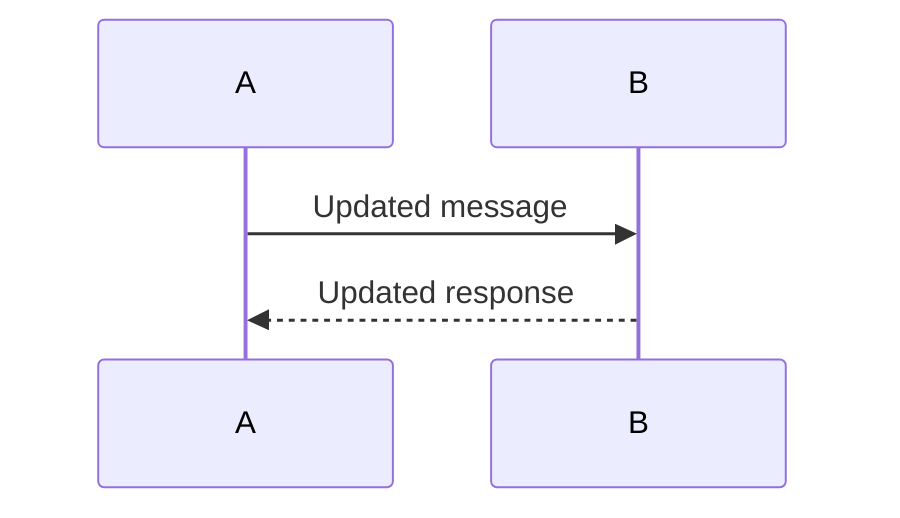

# Sequence Diagrams - Usage Guide

This directory contains comprehensive Mermaid sequence diagrams documenting Project-AI's key system interactions. These diagrams provide visual representations of complex workflows, making it easier to understand system behavior, debug issues, and onboard new developers.

## 📚 Available Diagrams

### 1. [User Login Sequence](./01-user-login-sequence.md)
**Purpose**: Complete user authentication flow with security features

**Key Interactions**:
- Password verification with bcrypt/pbkdf2_sha256
- Account lockout protection (5 attempts, 30-minute lockout)
- Triumvirate governance validation
- Session token generation with Fernet encryption
- State persistence and migration

**When to Use**:
- Understanding authentication flow
- Debugging login issues
- Implementing similar auth systems
- Security audits

**Complexity**: ⭐⭐ (Moderate)

---

### 2. [AI Chat Interaction Sequence](./02-ai-chat-interaction-sequence.md)
**Purpose**: End-to-end AI chat flow with multi-system integration

**Key Interactions**:
- Intent detection with ML classification
- Memory retrieval and context aggregation
- Governance pre-checks (Triumvirate)
- AI orchestration with multi-provider fallback
- Learning integration and persona updates
- Response delivery with formatting

**When to Use**:
- Understanding AI chat architecture
- Debugging chat responses
- Adding new chat features
- Performance optimization

**Complexity**: ⭐⭐⭐⭐ (Complex)

---

### 3. [Governance Validation Sequence](./03-governance-validation-sequence.md)
**Purpose**: Detailed Triumvirate decision-making process

**Key Interactions**:
- Four Laws pre-check (hierarchical constraints)
- Parallel council evaluation (Galahad, Cerberus, Codex)
- Consensus decision algorithm
- Memory integration for context
- Audit logging

**When to Use**:
- Understanding governance architecture
- Debugging governance blocks
- Implementing ethical constraints
- Compliance documentation

**Complexity**: ⭐⭐⭐⭐⭐ (Very Complex)

---

### 4. [Security Alert Sequence](./04-security-alert-sequence.md)
**Purpose**: Automated security monitoring and incident response

**Key Interactions**:
- Scheduled vulnerability scanning (pip-audit, Bandit, CodeQL)
- Vulnerability analysis and categorization
- Automated fix generation and PR creation
- CI pipeline integration
- Notification delivery

**When to Use**:
- Understanding DevSecOps workflows
- Debugging automated security fixes
- Implementing similar automation
- Security audit preparation

**Complexity**: ⭐⭐⭐⭐ (Complex)

---

### 5. [Agent Orchestration Sequence](./05-agent-orchestration-sequence.md)
**Purpose**: Multi-agent coordination for complex task execution

**Key Interactions**:
- Task decomposition (Planner Agent)
- Pre/post-execution safety checks (Oversight Agent)
- Input/output validation (Validator Agent)
- Error explanation (Explainability Agent)
- Cognition Kernel routing
- Governance checkpoints

**When to Use**:
- Understanding multi-agent systems
- Debugging agent coordination
- Adding new agent types
- Task orchestration optimization

**Complexity**: ⭐⭐⭐⭐⭐ (Very Complex)

---

### 6. [API Request/Response Sequence](./06-api-request-response-sequence.md)
**Purpose**: Web API request handling with comprehensive security

**Key Interactions**:
- CORS middleware validation
- Rate limiting (100 req/hr per IP)
- JWT authentication
- Runtime router governance integration
- Request handler execution
- Error handling and logging

**When to Use**:
- Understanding web API architecture
- Debugging API issues
- Implementing new endpoints
- API security reviews

**Complexity**: ⭐⭐⭐ (Moderate-Complex)

---

## 🎨 Rendering Mermaid Diagrams

### Option 1: GitHub (Recommended)
GitHub natively renders Mermaid diagrams in Markdown files. Simply view any `.md` file in this directory on GitHub.

**Advantages**:
- No setup required
- Always up-to-date
- Shareable links

### Option 2: VS Code
Install the **Mermaid Preview** extension:
```bash
code --install-extension bierner.markdown-mermaid
```

**Usage**:
1. Open any `.md` file
2. Press `Ctrl+Shift+V` (Windows/Linux) or `Cmd+Shift+V` (Mac)
3. View rendered diagram in preview pane

### Option 3: Mermaid Live Editor
1. Copy the Mermaid code (between ` ```mermaid` and ` ``` `)
2. Visit [https://mermaid.live/](https://mermaid.live/)
3. Paste code into editor
4. Export as PNG/SVG/PDF

### Option 4: Obsidian Vault
If you're using the Project-AI Obsidian vault:
1. Diagrams are automatically rendered
2. Use `[[01-user-login-sequence]]` to embed in notes
3. Interactive zoom and pan

### Option 5: CLI Rendering
Install Mermaid CLI:
```bash
npm install -g @mermaid-js/mermaid-cli
```

**Generate PNG**:
```bash
mmdc -i 01-user-login-sequence.md -o login-sequence.png
```

**Generate SVG**:
```bash
mmdc -i 02-ai-chat-interaction-sequence.md -o chat-sequence.svg
```

---

## 📖 Reading Sequence Diagrams

### Diagram Structure

```
participant A as Component A
participant B as Component B

A->>B: Message
activate B
B-->>A: Response
deactivate B
```

**Key Elements**:
- **Participants**: System components (vertical lanes)
- **Messages**: Arrows between participants
  - `A->>B`: Synchronous call (solid line, filled arrow)
  - `A-->>B`: Response (dashed line, filled arrow)
  - `A-->B`: Async message (dashed line, open arrow)
- **Activation**: Gray box showing when component is active
- **Notes**: `Note over A,B: Description`
- **Alternatives**: `alt`, `else`, `end` for conditional flows
- **Parallel**: `par`, `and`, `end` for concurrent operations
- **Loops**: `loop`, `end` for repeated actions

### Navigation Tips

1. **Start at the top**: Sequence diagrams flow from top to bottom
2. **Follow the numbers**: Each interaction is numbered (autonumber)
3. **Read notes**: Important context is in note boxes
4. **Check alternatives**: `alt` blocks show different paths
5. **Watch activation**: Gray boxes show which component is active

### Example Walkthrough

From **User Login Sequence**:

```mermaid
User->>GUI: Enter credentials         # Step 1: User action
GUI->>UserMgr: login(username, password)  # Step 2: GUI calls UserManager
UserMgr->>FS: Load users.json         # Step 3: Load data
FS-->>UserMgr: User data               # Step 4: Data returned
UserMgr-->>GUI: Login successful       # Step 5: Success response
GUI-->>User: Display dashboard         # Step 6: UI update
```

**Reading**:
1. User enters credentials in GUI
2. GUI calls UserManager's login method
3. UserManager loads user data from file system
4. File system returns user data
5. UserManager confirms successful login to GUI
6. GUI displays dashboard to user

---

## 🔍 Use Cases

### For Developers

#### Understanding System Flow
**Scenario**: "How does the AI chat system work?"
**Diagram**: [AI Chat Interaction Sequence](./02-ai-chat-interaction-sequence.md)
**Focus**: Follow message flow from user input to AI response

#### Debugging Issues
**Scenario**: "User login is failing intermittently"
**Diagram**: [User Login Sequence](./01-user-login-sequence.md)
**Focus**: Check account lockout logic and error paths

#### Adding Features
**Scenario**: "Add rate limiting to chat endpoint"
**Diagram**: [API Request/Response Sequence](./06-api-request-response-sequence.md)
**Focus**: See where rate limiting fits in request pipeline

### For Architects

#### System Design Review
**Scenario**: "Evaluate governance architecture"
**Diagram**: [Governance Validation Sequence](./03-governance-validation-sequence.md)
**Focus**: Parallel council evaluation, decision matrix

#### Security Audit
**Scenario**: "Document security controls"
**Diagrams**: All (security controls are pervasive)
**Focus**: Authentication, authorization, governance, audit logging

#### Performance Optimization
**Scenario**: "Reduce API response time"
**Diagram**: [API Request/Response Sequence](./06-api-request-response-sequence.md)
**Focus**: Identify bottlenecks in middleware stack

### For Product Managers

#### Feature Planning
**Scenario**: "Understand effort to add multi-factor auth"
**Diagram**: [User Login Sequence](./01-user-login-sequence.md)
**Focus**: Identify integration points in auth flow

#### Risk Assessment
**Scenario**: "Evaluate governance decision impacts"
**Diagram**: [Governance Validation Sequence](./03-governance-validation-sequence.md)
**Focus**: Decision matrix, block scenarios

### For QA Engineers

#### Test Case Design
**Scenario**: "Create comprehensive chat tests"
**Diagram**: [AI Chat Interaction Sequence](./02-ai-chat-interaction-sequence.md)
**Focus**: All error paths, edge cases, alternative flows

#### Integration Testing
**Scenario**: "Test multi-agent orchestration"
**Diagram**: [Agent Orchestration Sequence](./05-agent-orchestration-sequence.md)
**Focus**: Agent interactions, error recovery, governance checkpoints

---

## 🛠️ Maintenance Guidelines

### When to Update Diagrams

1. **Architecture Changes**: Update immediately when system flow changes
2. **New Components**: Add new participants when components are added
3. **API Changes**: Update when endpoints/interfaces change
4. **Security Updates**: Reflect new security controls
5. **Bug Fixes**: Update if fix changes interaction flow

### How to Update

#### Step 1: Identify Affected Diagram
Determine which diagram(s) need updates based on code changes.

#### Step 2: Update Mermaid Code
Edit the ` ```mermaid` block in the `.md` file:


#### Step 3: Update Documentation Sections
Update the prose sections (Overview, Key Components, etc.) to match code changes.

#### Step 4: Test Rendering
Verify diagram renders correctly:
- GitHub preview
- VS Code Mermaid Preview
- Mermaid Live Editor

#### Step 5: Update Related Docs
If diagram changes affect other documentation:
- Update cross-references
- Update code examples
- Update related diagrams

### Version Control

- **Commit Message Format**: `docs(sequences): update [diagram name] - [change description]`
- **Example**: `docs(sequences): update governance-validation-sequence - add Codex voting logic`
- **PR Required**: All diagram updates require PR review
- **Reviewer**: Architect or tech lead must review for accuracy

---

## 🔗 Integration with Documentation

### Embedding in Markdown

```markdown
See the [User Login Sequence](../diagrams/sequences/01-user-login-sequence.md) for authentication flow details.
```

### Linking to Specific Sections

```markdown
Review the [governance decision matrix](../diagrams/sequences/03-governance-validation-sequence.md#decision-matrix) for voting rules.
```

### Obsidian Vault Embedding

```markdown
![[01-user-login-sequence]]
```

### Excalidraw Integration

Sequence diagrams complement Excalidraw architectural diagrams:
- **Excalidraw**: High-level system architecture
- **Sequence Diagrams**: Detailed interaction flows

Example: `diagrams/architecture/system-overview.excalidraw` shows components, this directory shows how they interact.

---

## 📊 Diagram Complexity Matrix

| Diagram | Participants | Interactions | Decision Points | Complexity | Est. Read Time |
|---------|--------------|--------------|-----------------|------------|----------------|
| User Login | 7 | 25-30 | 4 (alt blocks) | ⭐⭐ | 5-8 min |
| AI Chat | 10 | 40-50 | 6 (alt blocks) | ⭐⭐⭐⭐ | 12-15 min |
| Governance | 8 | 50-60 | 8 (alt + par) | ⭐⭐⭐⭐⭐ | 18-22 min |
| Security Alert | 10 | 45-55 | 7 (alt + par) | ⭐⭐⭐⭐ | 15-18 min |
| Agent Orchestration | 10 | 60-70 | 10 (alt + loop + par) | ⭐⭐⭐⭐⭐ | 20-25 min |
| API Request | 10 | 35-45 | 8 (alt blocks) | ⭐⭐⭐ | 10-12 min |

**Legend**:
- ⭐ = Simple (1-2 participants, linear flow)
- ⭐⭐ = Moderate (3-5 participants, few branches)
- ⭐⭐⭐ = Complex (6-8 participants, multiple branches)
- ⭐⭐⭐⭐ = Very Complex (9-10 participants, many branches + parallel)
- ⭐⭐⭐⭐⭐ = Extremely Complex (10+ participants, nested logic + parallel + loops)

---

## 🎯 Learning Path

### Beginner
1. Start with **User Login Sequence** (simple auth flow)
2. Move to **API Request/Response Sequence** (web architecture basics)
3. Review **Security Alert Sequence** (automation patterns)

### Intermediate
1. Study **AI Chat Interaction Sequence** (multi-system integration)
2. Understand **Governance Validation Sequence** (decision systems)
3. Explore **Agent Orchestration Sequence** (advanced coordination)

### Advanced
1. Deep dive into **Agent Orchestration** (multi-agent systems)
2. Master **Governance Validation** (ethical constraints)
3. Design new sequence diagrams for custom features

---

## 🐛 Common Issues

### Diagram Won't Render

**Symptom**: Mermaid code shows as plain text
**Causes**:
- Missing ` ```mermaid` opening
- Unclosed ` ``` ` block
- Syntax error in Mermaid code

**Fix**:
1. Verify opening ` ```mermaid` and closing ` ``` `
2. Copy code to [Mermaid Live Editor](https://mermaid.live/) to find syntax errors
3. Check for unmatched `activate`/`deactivate` pairs

### Participant Names Too Long

**Symptom**: Diagram is very wide
**Fix**: Use aliases
```mermaid
participant Orch as AI Orchestrator
participant Gov as Triumvirate<br/>(Governance)
```

### Too Many Interactions

**Symptom**: Diagram is overwhelming
**Fix**: Split into multiple diagrams
- Example: Split "AI Chat" into "Intent Detection" + "Response Generation"

### Outdated Diagram

**Symptom**: Diagram doesn't match code
**Fix**:
1. Review recent commits to related code
2. Update Mermaid code to reflect changes
3. Update documentation sections
4. Submit PR with updates

---

## 📚 Additional Resources

### Mermaid Documentation
- [Official Docs](https://mermaid.js.org/)
- [Sequence Diagram Syntax](https://mermaid.js.org/syntax/sequenceDiagram.html)
- [Mermaid Live Editor](https://mermaid.live/)

### Project-AI Documentation
- [Architecture Overview](../../docs/architecture/README.md)
- [Developer Quick Reference](../../DEVELOPER_QUICK_REFERENCE.md)
- [System Integration Map](../../AGENT-079-INTEGRATION-MAP.md)

### Related Diagrams
- [Excalidraw Diagrams](../architecture/) - High-level architecture
- [Component Diagrams](../components/) - Component relationships
- [Data Flow Diagrams](../dataflow/) - Data transformations

---

## 🤝 Contributing

### Adding New Diagrams

1. **Create File**: `XX-diagram-name.md` (use next number)
2. **Follow Template**:
   - Overview section
   - Mermaid sequence diagram
   - Key Components section
   - Usage in Documentation section
   - Testing section
   - Related Diagrams section
3. **Update README**: Add entry to "Available Diagrams" section
4. **Submit PR**: Include screenshot of rendered diagram

### Improving Existing Diagrams

1. **Identify Issue**: Unclear flow, missing interactions, outdated
2. **Make Changes**: Update Mermaid code and/or documentation
3. **Test Rendering**: Verify on GitHub, VS Code, Mermaid Live
4. **Submit PR**: Describe what was changed and why

### Diagram Style Guide

- **Participant Names**: Use PascalCase or clear abbreviations
- **Message Labels**: Use verb phrases ("Load data", "Validate input")
- **Notes**: Use for important context, not obvious steps
- **Activation**: Always pair `activate` with `deactivate`
- **Alt Blocks**: Label clearly ("Success", "Failure", not "Condition 1")
- **Parallel Blocks**: Use for truly concurrent operations
- **Numbers**: Use `autonumber` for all diagrams

---

## 📞 Support

### Questions?
- **Slack**: #project-ai-dev channel
- **GitHub Discussions**: [Ask a question](https://github.com/IAmSoThirsty/Project-AI/discussions)
- **Email**: dev-support@project-ai.example.com

### Found an Issue?
- **Incorrect Diagram**: [Create an issue](https://github.com/IAmSoThirsty/Project-AI/issues/new?labels=documentation,sequences)
- **Rendering Problem**: Check [Troubleshooting](#common-issues) first
- **Feature Request**: [Suggest a new diagram](https://github.com/IAmSoThirsty/Project-AI/discussions/new?category=ideas)

---

## 📝 License

These diagrams are part of Project-AI and are subject to the project's license. See [LICENSE](../../LICENSE) for details.

---

**Last Updated**: 2024-01-15
**Maintainer**: Project-AI Documentation Team
**Version**: 1.0.0
