# FULL 360° DEPLOYABLE SYSTEM STANDARD

**Version**: 1.0.0  
**Status**: 🟡 In Progress  
**Last Updated**: 2026-02-12  
**Owner**: Project-AI Core Team

---

## 📋 Quick Navigation

- [📊 Visual Roadmap](#visual-roadmap)
- [✅ Implementation Checklist](#implementation-checklist)
- [🏛️ Foundational Architecture](#i-foundational-architecture)
- [🛡️ Threat Model](#ii-threat-model)
- [🔐 Security Standards](#security-standards)
- [📈 Maturity Assessment](#maturity-assessment)

---

## 📊 Visual Roadmap

```mermaid
graph TB
    Start([360° Standard]) --> Foundation[I. Foundation]
    Start --> Threat[II. Threat Model]
    Start --> App[III. Application]
    Start --> Auth[IV-V. Auth]
    Start --> Data[VI. Data Layer]
    Start --> Runtime[VII-VIII. Runtime]
    Start --> Network[IX. Network]
    Start --> Secrets[X. Secrets]
    Start --> CICD[XI. CI/CD]
    Start --> Obs[XII. Observability]
    Start --> Test[XIII. Load Test]
    Start --> Ops[XIV-XVI. Operations]
    Start --> Comp[XVII. Compliance]
    Start --> Docs[XVIII. Documentation]
    Start --> Gov[XIX. Governance]
    Start --> Ent[XX. Enterprise]
    
    Foundation --> F1[Problem Definition]
    Foundation --> F2[System Scope]
    Foundation --> F3[Trust Boundaries]
    
    Threat --> T1[Actors]
    Threat --> T2[Attack Surfaces]
    Threat --> T3[Attack Types]
    Threat --> T4[Response Plans]
    
    App --> A1[Input Handling]
    App --> A2[Error Handling]
    App --> A3[Decision Logic]
    App --> A4[Logging]
    
    Auth --> AU1[JWT/OIDC]
    Auth --> AU2[RBAC]
    Auth --> AU3[Token Mgmt]
    
    Data --> D1[Encryption]
    Data --> D2[Backups]
    Data --> D3[Integrity]
    
    Runtime --> R1[Docker]
    Runtime --> R2[K8s]
    Runtime --> R3[Resources]
    
    Network --> N1[Firewall]
    Network --> N2[Ingress]
    Network --> N3[Egress]
    
    Secrets --> S1[Vault]
    Secrets --> S2[Rotation]
    Secrets --> S3[Workload ID]
    
    CICD --> C1[Pipeline]
    CICD --> C2[Gates]
    CICD --> C3[Deploy]
    
    Obs --> O1[Metrics]
    Obs --> O2[Logs]
    Obs --> O3[Alerts]
    
    Test --> TE1[RPS]
    Test --> TE2[Latency]
    Test --> TE3[Resources]
    
    Ops --> OP1[Failure Model]
    Ops --> OP2[Rollback]
    Ops --> OP3[Incident Response]
    
    style Foundation fill:#4CAF50
    style Threat fill:#FF9800
    style App fill:#2196F3
    style Auth fill:#9C27B0
    style CICD fill:#F44336
    style Ent fill:#00BCD4
```

---

## ✅ Implementation Checklist

### 🎯 Overall Progress: 64% Complete

### I. Foundational Architecture (85% Complete)

#### 1. Problem Definition
- [x] **Exact problem statement** - Documented in README.md
- [x] **Target users identified** - Documented
- [x] **Current solution analysis** - Documented
- [ ] **Formal ADR documentation** - In Progress

#### 2. System Scope
- [x] **System capabilities documented** - PROJECT_STATUS.md
- [x] **Explicit non-goals defined** - Security docs
- [ ] **Scope boundary diagrams** - Pending
- [ ] **Integration constraints** - Partial

#### 3. Trust Boundaries
- [x] **User → API documented** - API documentation
- [x] **API → DB documented** - Architecture docs
- [x] **API → External services** - Integration docs
- [ ] **Admin access paths diagram** - Pending
- [ ] **CI/CD pipeline access diagram** - Pending

**Status**: 🟡 **Mostly Complete** - Need boundary diagrams

---

### II. Threat Model (70% Complete)

#### Actors
- [x] **External attacker** - Documented in THREAT_MODEL.md
- [x] **Authenticated malicious user** - Documented
- [x] **Compromised service account** - Documented
- [ ] **Rogue admin scenarios** - Partial
- [ ] **Supply chain attacker** - Needs expansion

#### Attack Surfaces
- [x] **API endpoints** - Mapped
- [x] **Auth tokens** - Documented
- [x] **Secrets** - Policy defined
- [x] **Container image** - Scanning active
- [x] **CI/CD pipeline** - Protected
- [x] **Dependency chain** - SBOM generated
- [x] **Logs** - Secured

#### Attack Types & Responses
- [x] **Injection attacks** - Prevention + Detection
- [x] **Replay attacks** - Token validation
- [x] **Privilege escalation** - RBAC enforced
- [ ] **Lateral movement** - Needs documentation
- [x] **Resource exhaustion** - Rate limiting active
- [ ] **Bypass attempts** - Partial coverage
- [ ] **Policy mutation** - Needs formal docs

**Status**: 🟡 **Good Foundation** - Need complete response plans

---

### III. Application Layer (75% Complete)

#### Input Handling
- [x] **Schema validation** - Pydantic models
- [x] **Unknown field rejection** - Configured
- [x] **Max payload size** - Enforced
- [x] **Max string length** - Validated
- [x] **Control character filtering** - Active

#### Error Handling
- [x] **No stack traces** - Production config
- [ ] **Standard error object** - Needs standardization
  - [ ] trace_id
  - [ ] error_code
  - [ ] message

#### Decision Logic
- [x] **Deterministic outcomes** - Four Laws enforcement
- [x] **No implicit defaults** - Explicit configs
- [x] **Fail closed on ambiguity** - Implemented
- [x] **Contradictory state rejection** - Enforced

#### Logging
- [x] **Structured JSON logging** - Implemented
- [x] **Required fields present**:
  - [x] timestamp
  - [x] request_id
  - [x] actor_id
  - [x] role
  - [x] endpoint
  - [x] decision
  - [x] latency
  - [x] status_code

**Status**: 🟢 **Strong** - Minor standardization needed

---

### IV. Authentication (80% Complete)

- [x] **JWT implementation** - Active
- [x] **Token expiry** - Configured
- [x] **Signature verification** - Enforced
- [x] **Clock skew tolerance** - 5 minutes
- [ ] **Revocation mechanism** - Needs implementation
- [x] **Audience validation** - Enforced
- [x] **Issuer validation** - Enforced
- [x] **Expiration checks** - Active
- [x] **Role claim extraction** - Implemented
- [x] **Health endpoints only open** - Configured

**Status**: 🟢 **Nearly Complete** - Add token revocation

---

### V. Authorization (85% Complete)

- [x] **RBAC implemented** - Active
- [x] **Role-endpoint mapping**:
  - [x] human.read
  - [x] human.write
  - [x] agent.execute
  - [x] admin.override
- [x] **Scope constraints** - Enforced
- [x] **No enum-only classification** - Proper RBAC

**Status**: 🟢 **Complete**

---

### VI. Data Layer (70% Complete)

#### Storage
- [x] **Encryption at rest** - Fernet + AES-256
- [x] **TLS enforced** - All connections
- [x] **Least-privilege DB user** - Configured
- [ ] **Connection pooling** - Needs optimization

#### Backups
- [x] **Automated backups** - Configured
- [ ] **Tested restore** - Needs validation
- [ ] **Documented RTO/RPO** - Pending

#### Data Integrity
- [x] **DB constraints** - Enforced
- [x] **Unique keys** - Defined
- [x] **Foreign keys** - Relationships mapped
- [ ] **Check constraints** - Partial

**Status**: 🟡 **Good** - Need backup testing & RTO/RPO

---

### VII. Packaging & Runtime (90% Complete)

#### Docker
- [x] **Non-root user** - Enforced
- [x] **Pinned base image** - python:3.11-slim
- [x] **No shell in runtime** - Removed
- [x] **Multi-stage build** - Implemented
- [x] **Image scanning** - Trivy + Snyk

#### Runtime
- [x] **Gunicorn with workers** - Configured
- [x] **Graceful shutdown** - SIGTERM handled
- [x] **Resource limits** - CPU + Memory set
- [ ] **Health check tuning** - Optimization pending

**Status**: 🟢 **Excellent**

---

### VIII. Infrastructure (75% Complete)

#### VM-Level
- [x] **Firewall rules** - Configured
- [x] **SSH restricted** - Key-only
- [ ] **OS patching policy** - Needs documentation
- [x] **Intrusion logging** - Active

#### Kubernetes-Level
- [x] **Readiness probe** - Configured
- [x] **Liveness probe** - Configured
- [x] **Resource limits** - Set
- [x] **Pod security restricted** - Policy applied
- [x] **No privileged containers** - Enforced
- [x] **readOnlyRootFilesystem** - Enabled
- [x] **Drop capabilities** - ALL dropped, added selectively

**Status**: 🟢 **Strong**

---

### IX. Networking (85% Complete)

- [x] **Default deny** - Network policies active
- [x] **Explicit ingress rules** - Defined
- [x] **Explicit egress rules** - Defined
- [x] **DNS resolution allowed** - CoreDNS
- [ ] **Wildcard egress documentation** - Needs clarity

**Status**: 🟢 **Nearly Complete**

---

### X. Secrets Management (60% Complete)

#### Never Do
- [x] **No committed secrets** - Pre-commit hooks
- [x] **No raw JSON keys** - Vault integration
- [ ] **No hardcoded credentials** - Audit needed

#### Use
- [x] **Vault integration** - HashiCorp Vault ready
- [ ] **Cloud secret manager** - AWS/GCP integration pending
- [x] **Workload identity** - K8s service accounts
- [ ] **External Secrets Operator** - Deployment pending

#### Rotation
- [ ] **90-day rotation policy** - Needs implementation
- [ ] **Automated rotation** - Partial

**Status**: 🟡 **Moderate** - Need full rotation automation

---

### XI. CI/CD (70% Complete)

#### Pipeline Stages
- [x] **Lint** - ruff, black, mypy
- [x] **Test** - pytest with coverage
- [x] **Security scan** - Bandit, CodeQL
- [x] **Build** - Docker build
- [x] **Image scan** - Trivy
- [x] **Push to registry** - GitHub CR
- [ ] **Deploy to staging** - Automation needed
- [ ] **Manual approval** - Gate needed
- [ ] **Deploy to prod** - Automation needed
- [ ] **Smoke test** - Post-deploy validation needed
- [ ] **Rollback automation** - Partial

#### Must Block
- [x] **Failed tests** - Gate active
- [x] **Failed scans** - Gate active
- [x] **High severity CVEs** - Policy enforced

**Status**: 🟡 **Functional** - Need full deployment automation

---

### XII. Observability (75% Complete)

#### Metrics
- [x] **Request count** - Prometheus
- [x] **Error rate** - Tracked
- [x] **Latency histogram** - p50, p95, p99
- [x] **Memory** - Pod metrics
- [x] **CPU** - Pod metrics
- [x] **Restarts** - K8s metrics

#### Logs
- [x] **Centralized** - Structured JSON
- [x] **Retained** - Policy defined
- [ ] **Searchable** - ELK/Loki integration pending

#### Alerts
- [x] **Service down** - K8s probes
- [x] **High error rate** - Prometheus alerts
- [x] **High latency** - Defined thresholds
- [ ] **Memory spike** - Needs tuning
- [x] **Restart loop** - K8s detection

**Status**: 🟢 **Good** - Minor gaps

---

### XIII. Load Testing (50% Complete)

#### Measure
- [ ] **Sustained RPS** - Baseline needed
- [ ] **Peak RPS** - Stress test needed
- [x] **95th percentile latency** - Framework ready
- [ ] **Memory growth** - Long-run test needed
- [ ] **CPU utilization** - Under load
- [ ] **Error rate under stress** - Test suite needed

#### Documentation
- [ ] **Results documented** - Pending execution

**Status**: 🟡 **Framework Ready** - Need test execution

---

### XIV. Failure Model (40% Complete)

- [ ] **DB failure policy** - Reject or queue?
- [x] **Governance logic failure** - Block (fail closed)
- [ ] **Audit write failure** - Block or log?
- [ ] **Dependency timeout** - Retry strategy?
- [ ] **Explicit policy doc** - Needed

**Status**: 🔴 **Needs Work**

---

### XV. Rollback Model (55% Complete)

- [x] **Previous version redeploy** - K8s rollout undo
- [ ] **DB migration rollback** - Needs testing
- [ ] **Config rollback** - Git-based, needs automation
- [ ] **Audit of rollback event** - Needs logging

**Status**: 🟡 **Partial**

---

### XVI. Incident Response (60% Complete)

- [x] **Severity levels** - Defined
- [ ] **Notification path** - Needs documentation
- [ ] **Containment procedure** - Partial
- [ ] **Postmortem process** - Template needed
- [x] **Forensic log access** - Audit logs available

**Status**: 🟡 **Moderate**

---

### XVII. Compliance Alignment (70% Complete)

#### Mapped Controls
- [x] **Access control** - RBAC + least privilege
- [x] **Change management** - Git + PRs
- [x] **Logging** - 7-year retention
- [x] **Encryption** - At rest + in transit
- [ ] **Incident handling** - Process needs formalization

#### Disclaimers
- [x] **No false certification claims** - Documented

**Status**: 🟡 **Good Alignment** - Formalize processes

---

### XVIII. Documentation (85% Complete)

- [x] **Architecture diagram** - Multiple available
- [x] **Data flow diagram** - In PROJECT_STATUS.md
- [ ] **Trust boundary diagram** - This document
- [x] **Deployment guide** - PRODUCTION_DEPLOYMENT.md
- [x] **Runbook** - Operational guides
- [ ] **Recovery guide** - Needs completion
- [x] **Version history** - CHANGELOG.md

**Status**: 🟢 **Nearly Complete**

---

### XIX. Governance Layer (80% Complete)

#### Proof Requirements
- [x] **Input validation bypass impossible** - Four Laws + TARL
- [x] **Actor spoofing impossible** - Cryptographic identity
- [x] **Policy mutation restricted** - Immutable axioms
- [x] **Decision reproducibility** - Deterministic logic
- [x] **Audit trace reproducibility** - Hash chains

**Status**: 🟢 **Strong Governance**

---

### XX. Enterprise-Level Additions (60% Complete)

- [x] **Autoscaling** - HPA configured
- [x] **HA multi-node** - Pod anti-affinity
- [x] **Distributed tracing** - OpenTelemetry
- [x] **Circuit breaker** - Implemented
- [x] **Chaos testing** - Framework ready
- [ ] **Penetration testing** - Scheduled
- [ ] **External security review** - Planned

**Status**: 🟡 **Good Progress**

---

### 🆕 Additional Requirements

### XXI. SDLC & Code Security (75% Complete)

- [x] **Secure coding standards** - Documented
- [x] **Mandatory code review** - 2+ reviewers for sensitive
- [x] **SAST** - CodeQL + Bandit
- [x] **SCA** - Dependabot + pip-audit
- [x] **Secret scanners** - Pre-commit hooks
- [x] **Branch protection** - Protected main
- [x] **Signed commits** - For releases
- [ ] **Fuzzing** - High-risk parsers need coverage

**Status**: 🟢 **Strong**

---

### XXII. Supply Chain & Artifact Integrity (65% Complete)

- [x] **SBOM generation** - Automated
- [x] **SBOM storage** - Artifacts repo
- [ ] **SBOM attestation** - Deployment integration needed
- [x] **Build provenance** - GitHub Actions
- [ ] **SLSA compliance** - Level 2 target
- [x] **Pinned dependencies** - requirements.lock
- [x] **Update process** - Dependabot
- [ ] **Third-party risk review** - Process needed

**Status**: 🟡 **Good Foundation**

---

### XXIII. Kubernetes / Platform Hardening (80% Complete)

- [x] **Cluster audit logging** - Enabled
- [x] **Control-plane logs** - Shipped centrally
- [x] **Namespace isolation** - Network policies
- [ ] **Tenant isolation strategy** - Needs definition
- [x] **Image policy** - Allowed registries only
- [x] **Minimal base images** - Distroless/slim
- [x] **No mutable tags in prod** - SHA pinning
- [ ] **Runtime protection** - eBPF agent evaluation

**Status**: 🟢 **Strong Platform**

---

### XXIV. Risk Assessment & Governance (50% Complete)

- [x] **Periodic threat modeling** - Quarterly
- [ ] **Vulnerability triage SLAs** - Needs definition
- [ ] **Vendor risk process** - Template needed
- [ ] **Exit strategy** - Per vendor
- [x] **ADRs linked to controls** - Partial

**Status**: 🟡 **Process Needs Formalization**

---

### XXV. Operational Maturity & SLOs (45% Complete)

- [ ] **Explicit SLOs** - Availability, latency, error rate
- [ ] **Error budget policy** - Needs definition
- [ ] **Release cadence tied to budget** - Process needed
- [ ] **Capacity planning** - Documented limits
- [ ] **Cost guardrails** - Budget alerts
- [ ] **Game days** - Quarterly chaos drills
- [ ] **Chaos drill playbook** - Template needed

**Status**: 🔴 **Needs Significant Work**

---

## 📊 Maturity Assessment

Based on the FINAL CLASSIFICATION MATRIX:

### Current Status: **Production-Ready** 🟢

**Achieved**:
- ✅ Application discipline
- ✅ Packaging & containerization
- ✅ Authentication & authorization
- ✅ Structured logging
- ✅ Infrastructure configuration
- ✅ CI/CD pipelines
- ✅ Observability foundations

**Progressing Toward Enterprise-Ready**:
- 🟡 HA multi-node (configured, needs validation)
- 🟡 Stress metrics (framework ready, needs execution)
- 🟡 Incident response (partially documented)
- 🟡 SLOs and error budgets (needs implementation)

### Maturity Breakdown

| Category | Level | Status |
|----------|-------|--------|
| **Application Discipline** | ★★★★★ | Production-Ready |
| **Security** | ★★★★☆ | Strong |
| **Infrastructure** | ★★★★☆ | Production-Ready |
| **Observability** | ★★★☆☆ | Good |
| **Operational Maturity** | ★★★☆☆ | Moderate |
| **Supply Chain** | ★★★★☆ | Strong |
| **Governance** | ★★★★★ | Enterprise-Grade |

---

## 🎯 Priority Roadmap

### Q1 2026 (Current Quarter)

#### High Priority
1. **Complete Failure Models** - Define all failure scenarios
2. **Implement SLOs** - Define and track availability/latency/errors
3. **Enhance Incident Response** - Complete playbooks
4. **Load Testing Execution** - Baseline performance metrics
5. **Token Revocation** - Complete auth system

#### Medium Priority
6. **DB Backup Testing** - Validate restore procedures
7. **Deployment Automation** - Staging → Prod pipeline
8. **Runtime Protection** - Evaluate eBPF solutions
9. **Penetration Testing** - External security audit
10. **Cost Guardrails** - Budget alerts and limits

### Q2 2026

#### High Priority
11. **SLSA Level 2** - Supply chain maturity
12. **Tenant Isolation** - Multi-tenant strategy
13. **Error Budget Policy** - Release governance
14. **Game Day Program** - Quarterly chaos exercises
15. **Vulnerability SLAs** - Triage and remediation timelines

#### Medium Priority
16. **Advanced Monitoring** - APM integration
17. **Capacity Planning** - Growth projections
18. **Vendor Risk Management** - Third-party assessment
19. **Fuzzing Program** - Security testing automation
20. **External Security Review** - Independent audit

---

## 🔄 Auto-Update Mechanism

This document is automatically updated by:

1. **CI/CD Integration** - Pipeline updates completion status
2. **Metrics Integration** - Prometheus metrics feed progress
3. **Test Coverage** - pytest results update test status
4. **Security Scans** - Scan results update security posture

**Last Auto-Update**: 2026-02-14T03:51:02.925564Z
**Next Scheduled Update**: Daily at 00:00 UTC

---

## 📚 Related Documentation

- [PROJECT_STATUS.md](../PROJECT_STATUS.md) - Current system status
- [THREAT_MODEL.md](security_compliance/THREAT_MODEL.md) - Threat analysis
- [INFRASTRUCTURE_ROADMAP.md](INFRASTRUCTURE_ROADMAP.md) - Infrastructure plans
- [PRODUCTION_ARCHITECTURE.md](PRODUCTION_ARCHITECTURE.md) - Architecture details
- [SECURITY_IMPLEMENTATION_GUIDE.md](SECURITY_IMPLEMENTATION_GUIDE.md) - Security guidelines

---

## 📞 Contacts & Governance

**Standard Owner**: Project-AI Core Team  
**Review Cycle**: Quarterly  
**Last Review**: 2026-02-12  
**Next Review**: 2026-05-12

**Approval Required For**:
- Classification level changes
- Major requirement additions
- Compliance claims
- Enterprise certification

---

**Document Status**: 🟢 Active  
**Maintenance**: Auto-updating with manual quarterly reviews
