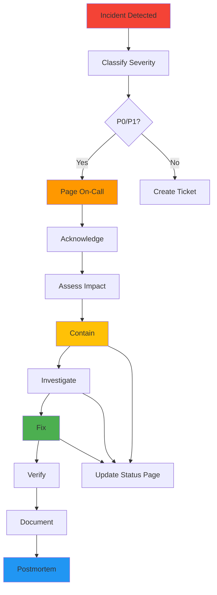

# Failure Models & Operational Procedures

**Version**: 1.0.0 **Date**: 2026-02-12 **Status**: Active

______________________________________________________________________

## XIV. FAILURE MODEL

### Explicit Failure Policies

#### 1. Database Failure Policy

**Scenario**: PostgreSQL connection fails or becomes unresponsive

**Policy**: **REJECT with graceful degradation** 🛑

**Behavior**:

```python

# Implementation Pattern

try:
    result = db.execute(query)
except DatabaseConnectionError:

    # Fail closed - reject request

    return {
        "status": "unavailable",
        "error_code": "DB_UNAVAILABLE",
        "message": "Service temporarily unavailable. Please retry.",
        "trace_id": request_id,
        "retry_after": 30  # seconds
    }, 503
```

**Rationale**:

- AI decisions require persistent state (memory, identity, audit logs)
- Accepting requests without database would create:
  - Lost audit trails (compliance violation)
  - Memory gaps (breaks conversation continuity)
  - Identity corruption (governance failure)

**Mitigation**:

- ✅ Connection pooling with health checks
- ✅ Automatic reconnection (exponential backoff)
- ✅ Read-only mode for queries (failover to replica)
- ✅ Circuit breaker (open after 5 consecutive failures)
- ✅ Queue depth monitoring (alert > 100 pending)

**Recovery**:

1. Health check detects DB failure
1. Circuit breaker opens (503 responses)
1. Alert sent to on-call
1. Automatic retry every 30s
1. Manual failover to replica if needed
1. Circuit breaker closes when DB healthy

______________________________________________________________________

#### 2. Governance Logic Failure Policy

**Scenario**: Four Laws engine or TARL runtime crashes

**Policy**: **BLOCK all actions** 🔒 (Fail Closed)

**Behavior**:

```python

# Implementation Pattern

try:
    is_allowed, reason = FourLaws.validate_action(action, context)
except GovernanceEngineError:

    # Fail closed - deny action

    logger.critical(f"Governance failure: {action}")
    audit.log_governance_failure(action, actor_id)
    return {
        "status": "forbidden",
        "error_code": "GOVERNANCE_FAILURE",
        "message": "Action blocked due to governance system failure",
        "trace_id": request_id
    }, 403
```

**Rationale**:

- Governance is the core security guarantee
- Bypassing governance violates Asimov's Laws
- Better to be unavailable than unethical

**Mitigation**:

- ✅ Comprehensive exception handling
- ✅ Fallback to deny-by-default
- ✅ Redundant governance checks (Triumvirate voting)
- ✅ Immutable axioms prevent corruption
- ✅ Watchdog process monitors governance engine

**Recovery**:

1. Exception caught and logged
1. All actions blocked immediately
1. Critical alert sent
1. Forensic logs captured
1. Manual investigation required
1. Governance engine restart with verification
1. Post-incident review of cause

**Never**:

- ❌ Never bypass governance checks
- ❌ Never default to "allow" on error
- ❌ Never cache old governance decisions

______________________________________________________________________

#### 3. Audit Write Failure Policy

**Scenario**: Cannot write to audit log (disk full, permissions error, log service down)

**Policy**: **BLOCK action** 🛑 (Fail Closed)

**Behavior**:

```python

# Implementation Pattern

try:
    audit.log_decision(action, decision, actor_id)
except AuditLogError:

    # Fail closed - block action

    logger.critical(f"Audit failure: {action}")

    # Cannot proceed without audit trail

    return {
        "status": "service_unavailable",
        "error_code": "AUDIT_UNAVAILABLE",
        "message": "Action blocked: cannot create audit trail",
        "trace_id": request_id
    }, 503
```

**Rationale**:

- Audit trail is legal/compliance requirement
- Actions without audit are unverifiable
- GDPR/SOC 2 require complete audit logs
- Forensic analysis impossible without logs

**Mitigation**:

- ✅ Pre-flight audit log health check
- ✅ Dual logging (local file + centralized)
- ✅ Disk space monitoring (alert < 20% free)
- ✅ Log rotation and archival
- ✅ Append-only logs (immutable)

**Recovery**:

1. Health check detects audit failure
1. Actions blocked immediately
1. Alert sent to ops team
1. Disk space cleared or permissions fixed
1. Verify log integrity
1. Resume operations
1. Review missed audit window

**Exception**:

- Read-only operations MAY proceed without audit (e.g., health checks)
- Must be explicitly whitelisted in code

______________________________________________________________________

#### 4. Dependency Timeout Policy

**Scenario**: External API (OpenAI, Hugging Face, etc.) times out

**Policy**: **Retry with exponential backoff, then fail gracefully** ⏱️

**Behavior**:

```python

# Implementation Pattern

@retry(
    max_attempts=3,
    backoff=ExponentialBackoff(base=2, max_delay=30),
    exceptions=(TimeoutError, ConnectionError)
)
def call_external_api(request):
    try:
        response = api.call(request, timeout=10)
        return response
    except TimeoutError:

        # Log and retry (handled by decorator)

        logger.warning(f"API timeout: {api.name}")
        raise
    except MaxRetriesExceeded:

        # Graceful failure after retries

        circuit_breaker.record_failure(api.name)
        return {
            "status": "error",
            "error_code": "API_TIMEOUT",
            "message": f"{api.name} is unavailable. Please try again.",
            "trace_id": request_id
        }, 504
```

**Retry Strategy**:

- Attempt 1: Immediate (timeout=10s)
- Attempt 2: 2s delay (timeout=15s)
- Attempt 3: 4s delay (timeout=20s)
- Attempt 4: 8s delay (timeout=30s)
- After 4 failures: Circuit breaker opens (30s cooldown)

**Circuit Breaker States**:

1. **CLOSED** - All requests pass through
1. **OPEN** - All requests fail fast (503), no API calls
1. **HALF_OPEN** - Test request sent, open/close based on result

**Mitigation**:

- ✅ Aggressive timeouts (10s default, 60s max)
- ✅ Circuit breaker per external service
- ✅ Fallback responses (cached data, degraded mode)
- ✅ Latency monitoring (p95, p99)
- ✅ SLA tracking per service

**Recovery**:

- Automatic: Circuit breaker closes after cooldown + successful test
- Manual: Admin can force circuit closed (emergency)

______________________________________________________________________

#### 5. Memory/Resource Exhaustion Policy

**Scenario**: Memory usage exceeds limits, CPU saturated

**Policy**: **Rate limiting + graceful degradation** ⚠️

**Behavior**:

```python

# Implementation Pattern

@rate_limit(max_requests=100, window=60)  # 100/min
@resource_check(max_memory_mb=2000, max_cpu_percent=80)
def handle_request(request):
    if memory_usage() > 1800:  # 90% of limit

        # Shed load

        if request.priority < Priority.HIGH:
            return {
                "status": "too_many_requests",
                "error_code": "RATE_LIMIT_EXCEEDED",
                "message": "System under heavy load. Please retry.",
                "retry_after": 60
            }, 429

    # Normal processing

    return process_request(request)
```

**Resource Limits**:

- **Memory**: 2GB per pod (hard limit)
- **CPU**: 2 cores per pod (hard limit)
- **Request rate**: 100 req/min per user
- **Concurrent requests**: 50 per pod
- **Request payload**: 10MB max

**Mitigation**:

- ✅ Horizontal pod autoscaling (HPA)
- ✅ Pod disruption budgets (PDB)
- ✅ Memory leak detection
- ✅ CPU throttling
- ✅ Request queuing (max 100 depth)

**Recovery**:

- Automatic: HPA scales out (3-10 pods)
- Automatic: OOMKiller restarts pod
- Alert: On-call notified if sustained high load

______________________________________________________________________

### Failure Cascade Prevention

**Scenario**: One failure triggers multiple downstream failures

**Prevention Strategy**:

1. **Bulkhead Pattern** - Isolate failures

   ```
   ┌─────────────┐    ┌─────────────┐    ┌─────────────┐
   │   Service A │    │   Service B │    │   Service C │
   │  (Isolated) │    │  (Isolated) │    │  (Isolated) │
   └─────────────┘    └─────────────┘    └─────────────┘
   ```

   - Separate thread pools per service
   - Independent circuit breakers
   - No shared state

1. **Circuit Breaker** - Stop cascading failures

   - Open circuit after N failures
   - Fail fast instead of waiting for timeout
   - Automatic recovery testing

1. **Timeout Hierarchy** - Prevent timeout propagation

   ```
   User Request (60s)
   └─ API Call (30s)
      └─ DB Query (10s)
         └─ External API (5s)
   ```

   - Each layer has shorter timeout than parent
   - Prevents timeout stacking

1. **Graceful Degradation** - Partial functionality

   - Core features remain available
   - Non-critical features disabled
   - Clear user communication

______________________________________________________________________

## XV. ROLLBACK MODEL

### 1. Application Version Rollback

**Trigger**: Failed deployment, post-deploy checks fail, error rate spike

**Mechanism**: Kubernetes Deployment Rollout Undo

**Procedure**:

```bash

# Automatic rollback (in deployment script)

if smoke_test_fails; then
  kubectl rollout undo deployment/project-ai -n production
  kubectl rollout status deployment/project-ai -n production
  alert_team "Auto-rollback executed"
fi

# Manual rollback

kubectl rollout undo deployment/project-ai -n production
kubectl rollout undo deployment/project-ai -n production --to-revision=5
```

**Validation**:

- ✅ Health checks pass (liveness, readiness)
- ✅ Smoke tests pass
- ✅ Error rate < 1%
- ✅ Response time < p95 baseline
- ✅ Zero critical errors in logs (5 min window)

**Audit**:

```json
{
  "event": "deployment_rollback",
  "timestamp": "2026-02-12T18:30:00Z",
  "from_version": "v1.2.3",
  "to_version": "v1.2.2",
  "reason": "smoke_test_failure",
  "initiated_by": "automated_pipeline",
  "duration_seconds": 45,
  "trace_id": "abc-123-def"
}
```

______________________________________________________________________

### 2. Database Migration Rollback

**Trigger**: Migration fails, data corruption detected, application incompatibility

**Mechanism**: Alembic Migration Downgrade

**Procedure**:

```bash

# Test rollback in staging first

alembic downgrade -1  # One revision back
alembic upgrade head   # Re-apply
alembic downgrade -1  # Confirm rollback works

# Production rollback (with backup)

pg_dump project_ai > backup_pre_rollback.sql
alembic downgrade -1

# Verify application still works

pytest tests/integration/
```

**Validation**:

- ✅ Database backup taken
- ✅ Rollback script tested in staging
- ✅ Foreign key constraints intact
- ✅ Data integrity checks pass
- ✅ Application tests pass

**Audit**:

```json
{
  "event": "database_migration_rollback",
  "timestamp": "2026-02-12T18:30:00Z",
  "from_revision": "abc123",
  "to_revision": "def456",
  "reason": "application_compatibility",
  "initiated_by": "admin@example.com",
  "backup_file": "backup_pre_rollback.sql",
  "trace_id": "xyz-789-uvw"
}
```

______________________________________________________________________

### 3. Configuration Rollback

**Trigger**: Bad config causes failures, feature flag issues

**Mechanism**: Git-based Config Rollback

**Procedure**:

```bash

# Identify bad config commit

git log --oneline config/

# Revert config change

git revert abc123
git push origin main

# Update ConfigMap in K8s

kubectl create configmap project-ai-config \
  --from-file=config/ \
  --dry-run=client -o yaml | kubectl apply -f -

# Restart pods to pick up new config

kubectl rollout restart deployment/project-ai -n production
```

**Validation**:

- ✅ Config syntax valid (linting passed)
- ✅ No secrets in config files
- ✅ Applied to staging first
- ✅ Health checks pass after restart
- ✅ No error rate increase

**Audit**:

```json
{
  "event": "config_rollback",
  "timestamp": "2026-02-12T18:30:00Z",
  "config_file": "config/production.yaml",
  "from_commit": "abc123",
  "to_commit": "def456",
  "reason": "high_error_rate",
  "initiated_by": "admin@example.com",
  "trace_id": "lmn-456-opq"
}
```

______________________________________________________________________

### Rollback Decision Matrix

| Failure Type                | Rollback Type  | Automatic  | Manual   | Max Time  |
| --------------------------- | -------------- | ---------- | -------- | --------- |
| Smoke test fails            | Application    | ✅ Yes     | Optional | 5 min     |
| Error rate > 5%             | Application    | ✅ Yes     | Optional | 10 min    |
| Response time > 2x baseline | Application    | ✅ Yes     | Optional | 15 min    |
| Migration fails             | Database       | ❌ No      | ✅ Yes   | 30 min    |
| Data corruption             | Database + App | ❌ No      | ✅ Yes   | 60 min    |
| Bad config                  | Configuration  | ⚠️ Partial | ✅ Yes   | 10 min    |
| Security incident           | All systems    | ❌ No      | ✅ Yes   | Immediate |

______________________________________________________________________

## XVI. INCIDENT RESPONSE

### Severity Levels

#### P0 - Critical (Response: Immediate)

**Definition**: Complete service outage, data loss, security breach

**Examples**:

- All pods down
- Database corruption
- Unauthorized access detected
- Data exfiltration
- Governance system compromised

**Response Time**: < 15 minutes **Notification**: Page on-call immediately **Team**: All hands on deck **Communication**: Status page update every 30 min

______________________________________________________________________

#### P1 - High (Response: < 1 hour)

**Definition**: Major functionality unavailable, significant performance degradation

**Examples**:

- API error rate > 10%
- Memory leak causing crashes
- External API down (OpenAI, etc.)
- Authentication failures

**Response Time**: < 1 hour **Notification**: Page on-call **Team**: On-call + backup **Communication**: Status page update every 2 hours

______________________________________________________________________

#### P2 - Medium (Response: < 4 hours)

**Definition**: Minor functionality unavailable, performance issues

**Examples**:

- Non-critical feature broken
- Slow queries (p95 > 2s)
- Image generation failing
- Plugin errors

**Response Time**: < 4 hours **Notification**: Slack alert **Team**: On-call engineer **Communication**: Post-incident report

______________________________________________________________________

#### P3 - Low (Response: < 24 hours)

**Definition**: Cosmetic issues, non-urgent improvements

**Examples**:

- UI glitches
- Documentation errors
- Logging issues
- Non-critical warnings

**Response Time**: < 24 hours **Notification**: Ticket creation **Team**: Regular rotation **Communication**: Fix in next release

______________________________________________________________________

### Incident Response Procedure



#### Step 1: Detection

- Automated: Prometheus alerts, health check failures
- Manual: User reports, monitoring dashboards

#### Step 2: Classification

- Determine severity (P0-P3)
- Identify affected systems
- Estimate user impact

#### Step 3: Notification

- **P0/P1**: PagerDuty page
- **P2**: Slack alert
- **P3**: Jira ticket

#### Step 4: Acknowledgment

- On-call acknowledges within 5 minutes
- Status page updated: "Investigating"

#### Step 5: Containment

- Stop the bleeding (rollback, isolate, disable feature)
- Prevent data loss
- Preserve forensic evidence

#### Step 6: Investigation

- Review logs (centralized logging)
- Check metrics (Grafana dashboards)
- Analyze traces (OpenTelemetry)
- Reproduce issue (staging environment)

#### Step 7: Fix

- Apply fix (code, config, or infrastructure)
- Test in staging
- Deploy to production
- Monitor for regression

#### Step 8: Verification

- Verify fix resolves issue
- Check error rates, latency, health
- User validation (if applicable)

#### Step 9: Documentation

- Update incident ticket
- Capture timeline
- Document root cause
- List action items

#### Step 10: Postmortem (P0/P1 only)

- Scheduled within 48 hours
- Blameless culture
- 5 Whys analysis
- Action items assigned

______________________________________________________________________

### Forensic Log Access

**Purpose**: Investigation of security incidents, compliance audits, postmortems

**Access Control**:

- **Audit Admins**: Read-only access to all logs
- **Security Team**: Full access during investigations
- **External Auditors**: Temporary, scoped access

**Log Types**:

1. **Application Logs**: Structured JSON, all API requests
1. **Audit Logs**: Immutable, hash-chained decisions
1. **System Logs**: Kubernetes, Docker, OS
1. **Security Logs**: Auth failures, blocked requests, alerts

**Retention**:

- **Application Logs**: 90 days hot, 7 years cold storage
- **Audit Logs**: 7 years (compliance requirement)
- **Security Logs**: 1 year hot, 7 years cold storage

**Access Procedure**:

```bash

# Request forensic log access

kubectl create role log-reader \
  --verb=get,list \
  --resource=pods,pods/log \
  --namespace=production

# Grant temporary access (4 hours)

kubectl create rolebinding log-reader-binding \
  --role=log-reader \
  --user=security@example.com \
  --namespace=production

# Access logs

kubectl logs -n production deployment/project-ai --since=2h

# Revoke access after investigation

kubectl delete rolebinding log-reader-binding -n production
```

**Audit of Log Access**:

```json
{
  "event": "forensic_log_access",
  "timestamp": "2026-02-12T18:30:00Z",
  "user": "security@example.com",
  "reason": "P0_incident_investigation",
  "logs_accessed": ["application", "audit", "security"],
  "time_range": "2026-02-12T16:00:00Z to 2026-02-12T18:00:00Z",
  "duration_minutes": 120,
  "approved_by": "admin@example.com",
  "trace_id": "forensic-abc-123"
}
```

______________________________________________________________________

## Related Documentation

- [DEPLOYABLE_SYSTEM_STANDARD.md](DEPLOYABLE_SYSTEM_STANDARD.md) - Full standard
- [TRUST_BOUNDARIES.md](TRUST_BOUNDARIES.md) - Trust boundary analysis
- [THREAT_MODEL.md](security_compliance/THREAT_MODEL.md) - Threat scenarios

______________________________________________________________________

**Last Updated**: 2026-02-12 **Next Review**: 2026-05-12 (Quarterly)
