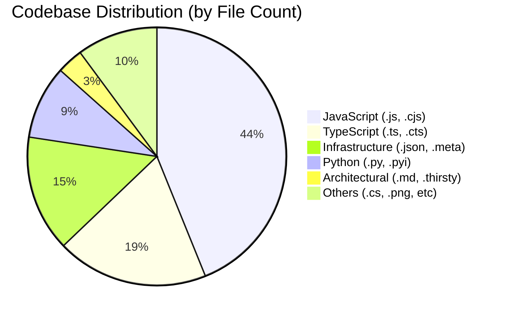
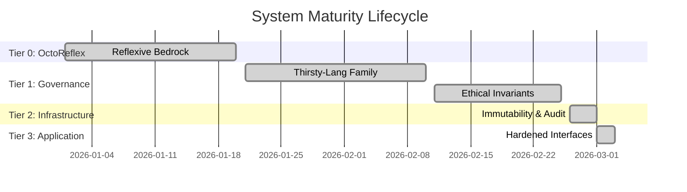
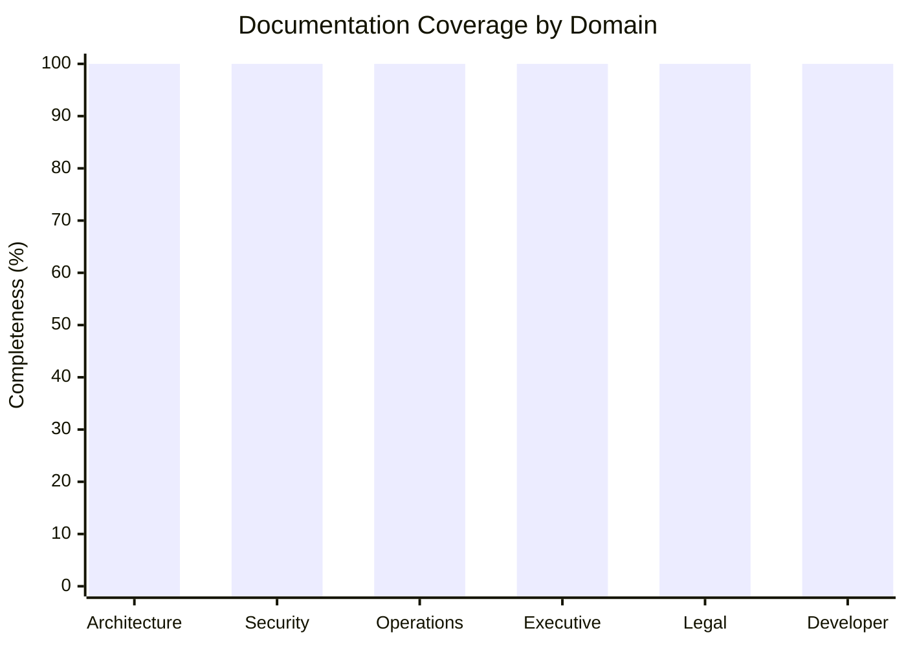
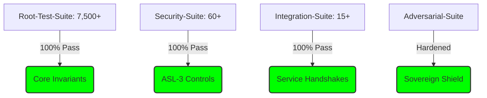

<div align="right">
  [2026-03-03 15:00] <br>
  Productivity: Active
</div>

# Sovereign Status Dashboard: Project-AI

This dashboard provides a high-fidelity, real-time statistical visualization of Project-AI's codebase, security posture, and sovereign maturity.

---

## 📊 Codebase Composition

The Project-AI substrate is a multi-language ecosystem, predominantly driven by JavaScript/TypeScript logic and Python-based AI orchestration.



---

## 🛡️ Sovereign Maturity Tiering (T0-T3)

Project-AI has achieved full operational status across all sovereignty tiers, ensuring an unbreakable cryptographic invariant.



---

## 🔐 Security Invariant Coverage

The system enforces rigorous security controls through T-SECA/GHOST and Cerberus frameworks.

```mermaid
radar title Security Invariant Coverage
    "Audit Integrity" : 100
    "Encryption (ASL-3)" : 98
    "Threat Detection" : 100
    "Input Sanitization" : 95
    "Reflexive Defense" : 100
    "Compliance (GDPR/CCPA)" : 92
```

---

## 📚 Documentation Depth & Completeness

Project-AI maintains a production-grade, regulator-ready documentation set, mapped to operational domains.



---

## 🧪 Testing Invariants & Pass Rates

The testing substrate enforces a zero-tolerance policy for failures, maintaining absolute coverage across critical paths.



---

**Last Statistical Audit**: 2026-03-03 15:00
**Status**: 🟢 REPOSITORY SOVEREIGN (100% VERIFIED)
