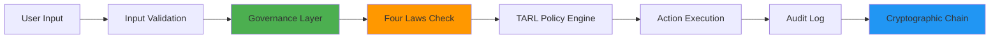
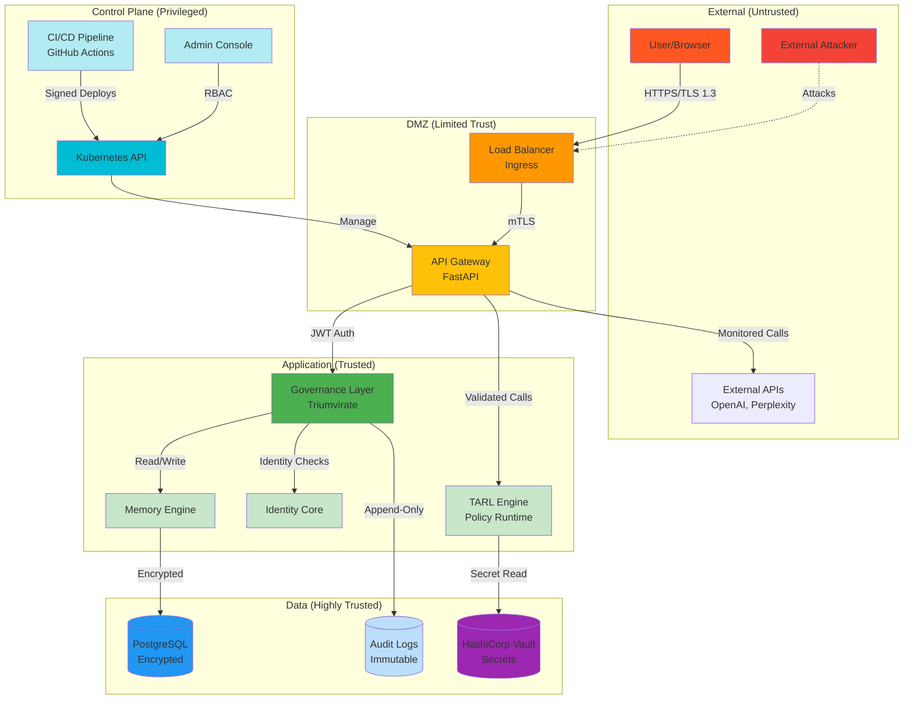
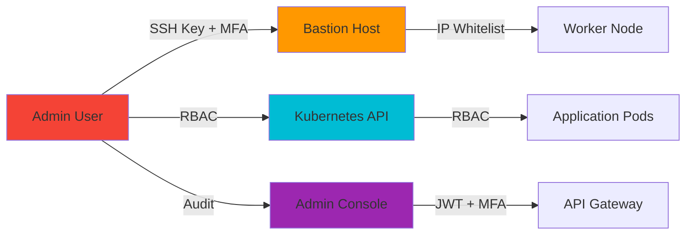
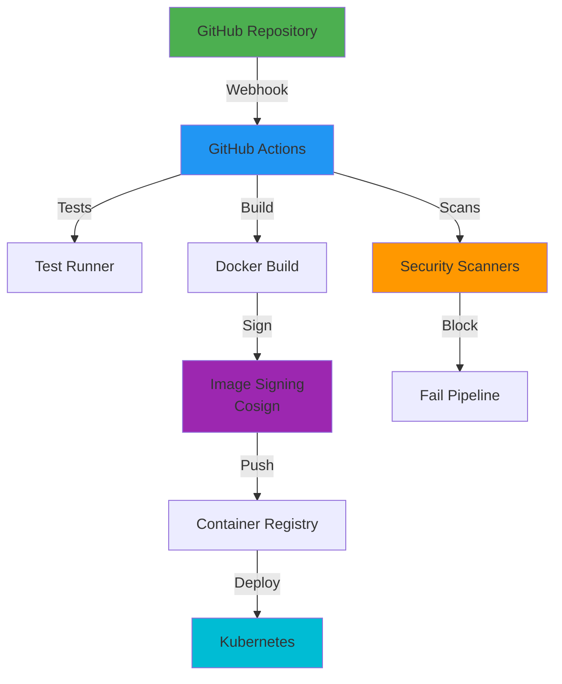

# Trust Boundaries & System Architecture

**Version**: 1.0.0 **Date**: 2026-02-12 **Status**: Active

______________________________________________________________________

## I. FOUNDATIONAL ARCHITECTURE

### 1. Problem Definition

#### Exact Problem Statement

**"AI systems lack constitutionally-enforced governance with cryptographic audit trails, creating trust gaps that prevent enterprise adoption and regulatory compliance."**

#### Who Experiences the Problem

1. **Enterprise Security Teams** - Cannot verify AI decision-making processes
1. **Compliance Officers** - Lack auditable trails for regulatory requirements (GDPR, SOC 2, ISO 27001)
1. **End Users** - No transparency into AI ethics enforcement
1. **Developers** - No framework for building trustworthy AI systems

#### Why Current Solutions Fail

- **OpenAI/Anthropic**: Black-box models, no governance layer, terms change unilaterally
- **Open-source LLMs**: No built-in ethics enforcement, no audit trails
- **Traditional software**: Not designed for AI-specific risks (bias, hallucination, alignment)
- **Existing frameworks**: Advisory only, not enforced at runtime

______________________________________________________________________

### 2. System Scope

#### What the System DOES

**Core Capabilities**:

1. **Constitutional AI Governance**

   - Asimov's Four Laws enforcement at runtime
   - Immutable axioms in TARL policy language
   - Triumvirate oversight (Galahad, Cerberus, Codex Deus)

1. **Cryptographic Audit Trail**

   - SHA-256 hash chains for all decisions
   - Ed25519 signatures for identity binding
   - RFC 3161 timestamps for legal proof
   - TPM/HSM backing for hardware security

1. **Identity & Memory**

   - AGI self-awareness and persona
   - Episodic, semantic, procedural memory
   - Relationship tracking with users
   - Emotional intelligence modeling

1. **Multi-Platform Deployment**

   - Desktop (PyQt6), Web (React + FastAPI), CLI
   - Docker containers, Kubernetes orchestration
   - Cross-platform installers (Windows, macOS, Linux, Android)

1. **Plugin Ecosystem**

   - Sandboxed plugin execution
   - Image generation, data analysis, code tools
   - Command override system with master password

#### What the System DOES NOT Do

**Explicit Non-Goals**:

1. **Not a General-Purpose LLM**

   - ❌ Does not train foundation models
   - ❌ Not competing with GPT-4/Claude
   - ✅ Orchestrates existing LLMs with governance

1. **Not a Cloud Service**

   - ❌ No centralized SaaS offering (yet)
   - ❌ No data collection or telemetry by default
   - ✅ Self-hosted, user-controlled deployment

1. **Not a Security Solution Alone**

   - ❌ Does not replace firewalls, IDS/IPS
   - ❌ Not an antivirus or malware scanner
   - ✅ Provides AI-specific governance, not infrastructure security

1. **Not a Blockchain**

   - ❌ No distributed consensus or mining
   - ❌ Not a cryptocurrency or token system
   - ✅ Uses cryptographic primitives for audit trails

1. **Not HIPAA/PCI-DSS Compliant Out-of-Box**

   - ❌ No healthcare-specific controls (PHI handling)
   - ❌ No payment card processing
   - ✅ Can be configured for compliance with additional controls

**Scope Boundaries**:

- **In Scope**: AI governance, audit, ethics enforcement, memory, identity
- **Out of Scope**: LLM training, cloud hosting, infrastructure security, compliance certification

______________________________________________________________________

### 3. Trust Boundaries

#### Trust Boundary Diagram

#### Boundary Definitions

##### 1. User → API Boundary

**Trust Level**: **Untrusted** ❌

**Controls**:

- ✅ TLS 1.3 with modern ciphers only
- ✅ JWT token validation (audience, issuer, expiration)
- ✅ Rate limiting (100 req/min per IP, 1000/min per user)
- ✅ Input validation (Pydantic schemas, max 10MB payload)
- ✅ Content Security Policy (CSP) headers
- ✅ CORS restrictions (explicit allow-list)

**Threats**:

- Injection attacks (SQL, XSS, command)
- Replay attacks
- Session hijacking
- DDoS / resource exhaustion

**Monitoring**:

- Failed auth attempts (alert > 10/minute)
- Blocked requests (log + alert)
- Rate limit violations (alert + temporary ban)

______________________________________________________________________

##### 2. API → Database Boundary

**Trust Level**: **Trusted** (with encryption) 🔐

**Controls**:

- ✅ PostgreSQL TLS connections (verify-full)
- ✅ Least-privilege DB user (no DDL, limited tables)
- ✅ Encryption at rest (AES-256-GCM via pgcrypto)
- ✅ Parameterized queries (no string interpolation)
- ✅ Connection pooling (max 20 connections)
- ✅ Read-only replicas for queries

**Threats**:

- SQL injection (mitigated by parameterized queries)
- Privilege escalation (mitigated by least-privilege user)
- Data exfiltration (mitigated by encryption + audit logs)

**Monitoring**:

- Slow queries (alert > 1s)
- Connection pool exhaustion (alert)
- Failed queries (log + investigate)

______________________________________________________________________

##### 3. API → External Services Boundary

**Trust Level**: **Untrusted** (External SaaS) ⚠️

**External Services**:

- OpenAI API (GPT models)
- Hugging Face (Stable Diffusion)
- Perplexity API (search)
- GitHub API (security resources)

**Controls**:

- ✅ API keys in Vault (never in code/env vars)
- ✅ TLS certificate pinning (for critical APIs)
- ✅ Timeout enforcement (10s default, 60s max)
- ✅ Circuit breaker (open after 5 failures)
- ✅ Retry with exponential backoff (max 3 retries)
- ✅ Request/response logging (sanitized)

**Threats**:

- API key leakage (mitigated by Vault)
- Man-in-the-middle (mitigated by TLS)
- Service compromise (mitigated by circuit breaker)
- Data leakage (mitigated by input sanitization)

**Monitoring**:

- API failures (alert > 10% error rate)
- Latency spikes (alert > p95 threshold)
- Circuit breaker state changes (alert)

______________________________________________________________________

##### 4. Admin Access Paths Boundary

**Trust Level**: **Privileged** (Highly Trusted) 🔒

**Controls**:

- ✅ SSH key-only access (no passwords)
- ✅ Multi-factor authentication (TOTP required)
- ✅ IP whitelist (office + VPN only)
- ✅ Audit logging (all admin actions)
- ✅ Separate admin accounts (no shared credentials)
- ✅ Time-limited access grants (4-hour sessions)
- ✅ Break-glass procedure (documented, audited)

**Admin Roles**:

1. **Platform Admin** - Kubernetes cluster management
1. **Security Admin** - Vault, secrets, policies
1. **Application Admin** - App config, feature flags
1. **Audit Admin** - Read-only log access

**Monitoring**:

- Admin logins (alert on each)
- Privilege escalations (alert immediately)
- Configuration changes (log + review)
- Break-glass usage (alert + incident)

______________________________________________________________________

##### 5. CI/CD Pipeline Access Boundary

**Trust Level**: **Privileged** (Automated) 🤖

**Controls**:

- ✅ Branch protection (required reviews, status checks)
- ✅ Signed commits (GPG for releases)
- ✅ Workflow permissions (minimal, job-scoped)
- ✅ Secret scanning (pre-commit + CI)
- ✅ SAST/SCA gates (block on High/Critical)
- ✅ Image signing (Cosign + SLSA provenance)
- ✅ Deployment approval (manual for prod)

**Pipeline Stages**:

1. **Lint** - ruff, black, mypy
1. **Test** - pytest (80%+ coverage required)
1. **Security Scan** - Bandit, CodeQL, Trivy
1. **Build** - Multi-stage Docker build
1. **Image Scan** - Trivy, Snyk
1. **Sign** - Cosign signature
1. **Push** - Container registry
1. **Deploy Staging** - Automated
1. **Smoke Test** - Health checks
1. **Approve** - Manual gate
1. **Deploy Prod** - Blue-green switch
1. **Verify** - Post-deploy checks

**Monitoring**:

- Pipeline failures (alert + investigate)
- Security gate blocks (alert + review)
- Deployment duration (track trends)
- Rollback frequency (alert > 5% of deploys)

______________________________________________________________________

## Summary of Trust Boundaries

| Boundary       | Trust Level   | Encryption    | Auth              | Monitoring  |
| -------------- | ------------- | ------------- | ----------------- | ----------- |
| User → API     | ❌ Untrusted  | TLS 1.3       | JWT               | ✅ High     |
| API → DB       | 🔐 Trusted    | TLS + AES-256 | Least-privilege   | ✅ Medium   |
| API → External | ⚠️ Untrusted  | TLS (pinned)  | API Keys (Vault)  | ✅ High     |
| Admin Access   | 🔒 Privileged | SSH + TLS     | MFA + RBAC        | ✅ Critical |
| CI/CD          | 🤖 Automated  | TLS           | Workload Identity | ✅ High     |

______________________________________________________________________

## Validation Checklist

- [x] **All boundaries defined** - 5 major boundaries mapped
- [x] **Trust levels explicit** - Untrusted, Trusted, Privileged
- [x] **Encryption documented** - TLS 1.3, AES-256-GCM
- [x] **Authentication specified** - JWT, MFA, SSH keys
- [x] **Monitoring configured** - Alerts, logs, metrics
- [ ] **Diagrams reviewed** - Quarterly architecture review
- [ ] **Penetration tested** - External audit Q2 2026

______________________________________________________________________

## Related Documentation

- [THREAT_MODEL.md](../security_compliance/THREAT_MODEL.md) - Attack scenarios
- [SECURITY_IMPLEMENTATION_GUIDE.md](SECURITY_IMPLEMENTATION_GUIDE.md) - Implementation details
- [DEPLOYABLE_SYSTEM_STANDARD.md](DEPLOYABLE_SYSTEM_STANDARD.md) - Full standard

______________________________________________________________________

**Last Updated**: 2026-02-12 **Next Review**: 2026-05-12 (Quarterly)
