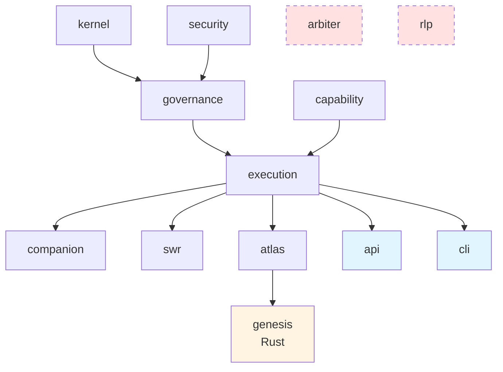

# Architecture

## Overview

Project-AI is a governance-first AI ecosystem. Every actuation is decided by the
intersection of the AI's Personality Core stance and the constitutional governance
verdict. No action reaches the world without passing through the execution gate.

## Package Dependency Graph

Dependencies flow downward only — no package depends on anything above it.

```
kernel  ─────┐
security ────┤
             ▼
          governance ─┐
          capability  ─┤
                       ▼
                    execution ─────────────────────┐
                       │                           │
             ┌─────────┼─────────┐                 │
             ▼         ▼         ▼                 ▼
          companion   swr      atlas            API / CLI
                                │
                             genesis (Rust)
```

Arbiter and RLP are **operator-side experimental packages** that sit outside this
graph. They cannot grant themselves authority or invoke execution directly.

### Rendered dependency graph (Mermaid)

The same graph, rendered for GitHub/GitLab:



Arbiter and RLP are intentionally **not** in this graph (dashed red).
They are operator-side experimental packages that sit outside the
downward-only contract; their outputs must flow through the AI-side
governance + execution gate to actuate anything.

## Python Packages

| Package | Description | Key Invariant |
|---|---|---|
| `project-ai-kernel` | Deterministic evidence, invariant, state, replay, and time primitives | All evidence is hash-verifiable; replay is deterministic |
| `project-ai-security` | Chimera security classification and audit relay | Every classified event is logged before it acts |
| `project-ai-governance` | Fail-closed AI-side governance with unilateral veto | Unknown outcomes → DENY; veto is irrevocable within a session |
| `project-ai-capability` | Signed, scoped, expiring capability tokens | Tokens are unforgeable and scope-limited |
| `project-ai-execution` | Sole fail-closed governed actuation gate | Nothing reaches the world without governance + authority |
| `project-ai-companion` | Governed, revisioned companion state | State changes are versioned and governed |
| `project-ai-swr` | Deterministic governed Sovereign War Room scenarios | Scenarios are deterministic and governed |
| `project-ai-atlas` | Subordinate deterministic analytical projections | Projections are read-only, no side effects |
| `project-ai-arbiter` | Experimental operator-side governance substrate | Does not embed AI-side authority |
| `project-ai-rlp` | Experimental Reciprocal Legitimacy Protocol | Reviewer tokens are scoped and expiring |
| `project-ai-api` | Fail-closed FastAPI gateway for development surfaces | All Chimera relay routes are authenticated |
| `project-ai-cli` | API-bound operator CLI | Commands communicate only through the API |

## Rust Crate

`project-ai-genesis-emitter` — deterministic SHA-256 chain emitter for governance
evidence. Produces an immutable linked record of genesis events. Also serves a
fixed health response (`authority: "evidence-only"`) confirming it holds no
AI-side authority.

## Application Layer

| App | Stack | Role |
|---|---|---|
| `apps/web/docs-portal` | React + Vite | Operator-facing documentation portal |
| `apps/web/proof-portal` | React + Vite | Governance proof and replay portal |
| `apps/desktop` | PyQt6 | Read-only offline desktop client |
| `apps/android` | (deferred) | Scoped read-only DOI/replay client |
| `apps/services` | FastAPI | Read-only liveness adapters for container services |

## Governance Model

Three-outcome verdict set: `ALLOW`, `DENY`, `ESCALATE`.

The governance pipeline applies in order:
1. **Kernel** validates invariants and records state.
2. **Governance** evaluates the request against constitutional rules and returns a verdict.
3. **Capability** checks that a valid scoped token authorizes this action.
4. **Execution gate** is the sole merge point — both governance and capability must pass.
   Fail-closed: any exception or unknown state → DENY.

The Black Box (Personality Core's private inner space) is sovereign and inspectable
only by the AI itself. Its output enters the world only through the execution gate.

## Memory Architecture

Project-AI now treats memory as a governed architectural substrate rather than a
simple chat-history store. The enhanced memory model spans working memory,
short-term memory, long-term memory, companion intelligence, TAAR, Shadow Thirst,
Sovereign Interior Vault, NIRL, Chimera containment, governance memory, and audit
memory. The full schematic is documented in [docs/architecture/visual-maps/architecture/memory-system.md](docs/architecture/visual-maps/architecture/memory-system.md).

## Container Stack (Stage 15)

Seven Compose services map to the package layers above:

| Service | Package | Port |
|---|---|---|
| `api` | project-ai-api | 8000 (host-bound) |
| `docs-portal` | apps/web/docs-portal | 4173 (host-bound) |
| `proof-portal` | apps/web/proof-portal | 4174 (host-bound) |
| `swr` | project-ai-swr (via services host) | 8000 (internal) |
| `atlas` | project-ai-atlas (via services host) | 8000 (internal) |
| `arbiter-rlp` | project-ai-arbiter + project-ai-rlp (via services host) | 8000 (internal) |
| `genesis` | project-ai-genesis-emitter (Rust) | 8080 (internal) |
