# Project-AI Enterprise Monolithic Architecture - End-to-End Flow

## Complete System Integration Diagram

This document contains the comprehensive end-to-end architecture diagram showing the complete integration of all Project-AI, Cerberus, Waterfall, Thirsty's-* and sibling repository subsystems as a unified monolithic artifact.

## E2E Signal Processing & Audit Flow

```mermaid
sequenceDiagram
    participant User
    participant UIWeb as "UI/Web Interface"
    participant API as "API Gateway"
    participant Router as "Signal Router"
    participant GuardAgg as "Guard/Aggregator<br/>(Validation & Security)"
    participant Plugins as "Plugin System<br/>(TTP Audio, etc.)"
    participant KGIngest as "Knowledge Graph<br/>Ingestor"
    participant BlackVault as "Black Vault<br/>(Encrypted Storage)"
    participant Human as "Human Oversight"
    participant AuditQ as "Audit Queue<br/>(Redis/File)"
    participant ConfigWatch as "Config Watcher<br/>(Hot Reload)"
    participant CircuitBreaker as "Circuit Breakers"
    
    Note over User,AuditQ: Enterprise Monolithic Signal Processing Pipeline
    
    User->>UIWeb: Submit signal/distress
    UIWeb->>AuditQ: Audit: signal_received
    UIWeb->>API: POST /api/signal
    API->>AuditQ: Audit: api_receive
    
    API->>Router: Route signal
    Router->>AuditQ: Audit: signal_routed
    
    Router->>GuardAgg: Validate signal
    activate GuardAgg
    
    GuardAgg->>GuardAgg: Check global retry limit
    alt Retry limit exceeded
        GuardAgg->>AuditQ: Audit: global_retry_limit
        GuardAgg-->>UIWeb: Return "throttled"
        Note right of GuardAgg: Global retry protection<br/>MAX_GLOBAL_RETRIES_PER_MIN
    end
    
    GuardAgg->>GuardAgg: Fuzzy phrase validation
    GuardAgg->>GuardAgg: PII detection
    GuardAgg->>GuardAgg: Schema validation
    GuardAgg->>GuardAgg: Asset security check
    GuardAgg->>AuditQ: Audit: validation_complete
    
    alt Validation failed
        GuardAgg->>BlackVault: Store denied content
        BlackVault->>BlackVault: Encrypt with Fernet
        BlackVault->>BlackVault: Check vault size
        alt Vault size exceeded
            BlackVault->>BlackVault: Rotate vault file
            BlackVault->>AuditQ: Audit: vault_rotated
        end
        BlackVault->>AuditQ: Audit: vault_entry_added
        BlackVault-->>GuardAgg: Return vault_id
        GuardAgg-->>UIWeb: Return "denied" + vault_id
    else Validation passed
        GuardAgg-->>Router: Signal valid
        deactivate GuardAgg
        
        Router->>CircuitBreaker: Check circuit state
        CircuitBreaker-->>Router: Circuit CLOSED (OK)
        
        Router->>Plugins: Route to plugins
        activate Plugins
        
        alt Media signal (audio/video)
            Plugins->>Plugins: Check enable_transcript config
            alt Transcription enabled
                Plugins->>CircuitBreaker: Transcription via circuit breaker
                CircuitBreaker->>Plugins: Transcribe audio
                Plugins->>Plugins: Whisper transcription
                Plugins->>Plugins: PII redaction
                Plugins->>AuditQ: Audit: audio_transcribed
                
                alt PII detected in transcript
                    Plugins->>BlackVault: Store original + redacted
                    BlackVault->>AuditQ: Audit: pii_redacted
                end
                
                Plugins->>GuardAgg: Re-validate transcript
                GuardAgg->>GuardAgg: Fuzzy phrase check
                alt Forbidden phrases found
                    GuardAgg->>BlackVault: Deny transcript
                    BlackVault-->>Plugins: vault_id
                    Plugins-->>UIWeb: Return "denied"
                end
            end
        end
        
        Plugins->>KGIngest: Forward for knowledge ingestion
        deactivate Plugins
        activate KGIngest
        
        KGIngest->>AuditQ: Audit: kg_ingest_start
        KGIngest->>KGIngest: Transform event
        KGIngest->>GuardAgg: Policy/constraint check
        
        GuardAgg->>GuardAgg: Constitutional validation
        GuardAgg->>GuardAgg: Cerberus threat check
        GuardAgg->>GuardAgg: Waterfall privacy check
        GuardAgg->>AuditQ: Audit: policy_check_complete
        
        alt Policy violation
            GuardAgg-->>KGIngest: Veto
            KGIngest->>BlackVault: Store violation
            BlackVault->>Human: Escalate for approval
            activate Human
            Human->>AuditQ: Audit: human_review_started
            Human->>Human: Review violation
            Human->>BlackVault: Approve or Reject
            deactivate Human
            BlackVault->>AuditQ: Audit: human_decision
            BlackVault->>KGIngest: Resolution
        else Policy OK
            GuardAgg-->>KGIngest: Permit
        end
        
        KGIngest->>AuditQ: Audit: kg_ingest_complete
        deactivate KGIngest
        
        Router-->>UIWeb: Return "processed"
    end
    
    Note over ConfigWatch: Background: Config Hot Reload
    ConfigWatch->>ConfigWatch: Poll config files (10s interval)
    ConfigWatch->>ConfigWatch: Detect file change
    ConfigWatch->>ConfigWatch: Validate new config
    ConfigWatch->>ConfigWatch: Backup current config
    ConfigWatch->>ConfigWatch: Apply new config
    ConfigWatch->>AuditQ: Audit: config_reloaded
    ConfigWatch->>Router: Notify subsystems
    
    Note over AuditQ: Audit Log Processing
    AuditQ->>AuditQ: Primary: Append to YAML
    AuditQ->>AuditQ: Compute SHA-256 chain
    alt Redis enabled
        AuditQ->>AuditQ: Secondary: Push to Redis
        alt Primary write fails
            AuditQ->>AuditQ: Fallback to Redis only
            AuditQ->>AuditQ: Queue for replay
        end
    end
    
    Note right of CircuitBreaker: Circuit Breaker States<br/>CLOSED → Normal<br/>OPEN → Reject (5 failures)<br/>HALF_OPEN → Testing
```



## System Component Integration Map

```mermaid
graph TB
    subgraph "Tier 1: Governance Layer"
        CK[Cognition Kernel]
        Triumvirate[Triumvirate<br/>Galahad | Cerberus | Codex Deus]
        Constitutional[Constitutional Core]
    end
    
    subgraph "Tier 2: Infrastructure Layer"
        ME[Memory Engine]
        GWT[Global Watch Tower]
        ES[Execution Service]
        SigFlow[Signal Flows Pipeline]
        ConfigLoader[Config Loader<br/>Hot Reload]
    end
    
    subgraph "Tier 3: Application Layer"
        CH[Council Hub]
        Agents[AI Agents]
        GUI[GUI Dashboard]
        API[API Gateway]
    end
    
    subgraph "Security Systems"
        BV[Black Vault<br/>Fernet Encryption]
        Audit[Audit Log<br/>SHA-256 Chain + Redis]
        CB[Circuit Breakers]
        ErrorAgg[Error Aggregator]
    end
    
    subgraph "Plugin Ecosystem"
        TTP[TTP Audio Processing]
        MO[Miniature Office]
        Cerberus_Plugin[Cerberus Adapter]
        Shadow[Shadow Execution Plane]
    end
    
    subgraph "Configuration & Data"
        DistressYAML[distress.yaml<br/>KMS, PII, Throttling]
        SignalSchema[Signal Schemas<br/>Fuzzy Validation]
        VaultStore[Vault Storage<br/>Encrypted]
        AuditStore[(Audit Store<br/>YAML + Redis)]
    end
    
    subgraph "External Integrations"
        KMS[KMS<br/>AWS/Azure/HashiCorp]
        Redis[Redis<br/>HA Fallback]
        Prometheus[Prometheus<br/>Metrics]
        OpenTelemetry[OpenTelemetry<br/>Tracing]
    end
    
    CK --> Triumvirate
    CK --> Constitutional
    CK --> ME
    CK --> GWT
    
    SigFlow --> CB
    SigFlow --> ErrorAgg
    SigFlow --> BV
    SigFlow --> Audit
    
    ConfigLoader --> DistressYAML
    ConfigLoader --> Audit
    
    API --> SigFlow
    GUI --> SigFlow
    
    SigFlow --> TTP
    SigFlow --> MO
    TTP --> BV
    TTP --> Audit
    
    BV --> VaultStore
    BV --> KMS
    
    Audit --> AuditStore
    Audit --> Redis
    
    SigFlow --> Prometheus
    SigFlow --> OpenTelemetry
    
    SignalSchema --> SigFlow
    
    style CK fill:#ff9999
    style Triumvirate fill:#ff9999
    style Constitutional fill:#ff9999
    style BV fill:#99ff99
    style Audit fill:#99ff99
    style SigFlow fill:#9999ff
    style ConfigLoader fill:#9999ff
```

## Vault Key Rotation Flow


## Retry & Circuit Breaker Flow


## Configuration Hot Reload Flow


## PII Redaction Pipeline

```mermaid
flowchart TD
    Start[Input Text] --> MLDetect{ML-Enhanced<br/>Detection Enabled?}
    
    MLDetect -->|Yes| RunML[Run DistilBERT<br/>PII Classifier]
    MLDetect -->|No| RegexCheck
    
    RunML --> Confidence{Confidence ><br/>Threshold?}
    Confidence -->|Yes| MarkPII[Mark as PII]
    Confidence -->|No| RegexCheck
    
    RegexCheck[Regex Pattern Matching]
    RegexCheck --> CheckEmail[Email Pattern]
    RegexCheck --> CheckPhone[Phone Pattern]
    RegexCheck --> CheckSSN[SSN Pattern]
    RegexCheck --> CheckCC[Credit Card Pattern]
    RegexCheck --> CheckIP[IP Address Pattern]
    
    CheckEmail --> |Match| MarkPII
    CheckPhone --> |Match| MarkPII
    CheckSSN --> |Match| MarkPII
    CheckCC --> |Match| MarkPII
    CheckIP --> |Match| MarkPII
    
    MarkPII --> Redact[Replace with<br/>[REDACTED-TYPE]]
    Redact --> HashOriginal[Store SHA-256<br/>of Original]
    HashOriginal --> AuditLog[Log Redaction<br/>to Audit Trail]
    AuditLog --> End[Redacted Text]
    
    CheckEmail --> |No Match| Continue
    CheckPhone --> |No Match| Continue
    CheckSSN --> |No Match| Continue
    CheckCC --> |No Match| Continue
    CheckIP --> |No Match| Continue
    Continue --> End
    
    style MarkPII fill:#ff9999
    style Redact fill:#ff9999
    style HashOriginal fill:#99ff99
    style AuditLog fill:#99ff99
```

## System Deployment Architecture

```mermaid
graph TB
    subgraph "Deployment Containers"
        subgraph "Application Container"
            Main[main.py<br/>Entry Point]
            Core[Core Services]
            Plugins[Plugin Ecosystem]
        end
        
        subgraph "Redis Container"
            RedisMaster[Redis Master]
            RedisReplica1[Redis Replica 1]
            RedisReplica2[Redis Replica 2]
        end
        
        subgraph "Monitoring Container"
            Prometheus_C[Prometheus]
            Grafana_C[Grafana]
            Jaeger_C[Jaeger]
        end
    end
    
    subgraph "External Services"
        AWS_KMS[AWS KMS]
        Azure_KV[Azure Key Vault]
        HashiCorp_V[HashiCorp Vault]
    end
    
    subgraph "Storage Volumes"
        ConfigVol[/config/<br/>Volume]
        DataVol[/var/<br/>Volume]
        LogsVol[/logs/<br/>Volume]
    end
    
    Main --> Core
    Core --> Plugins
    
    Core --> RedisMaster
    RedisMaster --> RedisReplica1
    RedisMaster --> RedisReplica2
    
    Core --> Prometheus_C
    Prometheus_C --> Grafana_C
    Core --> Jaeger_C
    
    Core --> AWS_KMS
    Core --> Azure_KV
    Core --> HashiCorp_V
    
    Main --> ConfigVol
    Core --> DataVol
    Core --> LogsVol
    
    style Main fill:#9999ff
    style RedisMaster fill:#ff9999
    style Prometheus_C fill:#99ff99
    style AWS_KMS fill:#ffff99
```

## Implementation Status

### ✅ Completed Components

1. **config/distress.yaml** - Comprehensive configuration with:
   - KMS integration (AWS, Azure, HashiCorp)
   - PII redaction patterns
   - Hot-reload settings
   - Global retry throttling
   - Circuit breaker configuration
   - Dependency audit settings
   - Fuzzy phrase blocking
   - Redis fallback configuration

2. **security/black_vault.py** - Vault management with:
   - Fernet encryption (AES-256-GCM)
   - Automatic key rotation
   - Size-based vault rotation
   - Content deduplication
   - Audit trail integration
   - Thread-safe operations

3. **config/schemas/signal.py** - Signal validation with:
   - Pydantic schemas for all signal types
   - Fuzzy phrase matching (Levenshtein)
   - PII detection
   - Multi-level validation
   - Comprehensive error reporting

4. **src/app/core/config_loader.py** - Configuration management with:
   - Thread-pooled file watching
   - Hot-reload without restart
   - Automatic backup and rollback
   - Validation before applying
   - Callback system for reload hooks

5. **src/app/pipeline/signal_flows.py** - Signal processing pipeline with:
   - Global retry tracking
   - Circuit breaker pattern
   - PII redaction integration
   - Media transcription
   - Error aggregation

6. **src/app/plugins/ttp_audio_processing.py** - Audio processing with:
   - Whisper integration
   - PII redaction from transcripts
   - Audio quality analysis
   - Dependency checking

7. **src/app/core/error_aggregator.py** - Error aggregation with:
   - Centralized error collection
   - Vault integration
   - Overflow protection
   - Thread-safe operations

8. **src/app/governance/audit_log.py** - Enhanced with:
   - Redis fallback (AuditLogWithRedis)
   - Dual-write capability
   - Replay from Redis
   - High availability support

9. **src/app/main.py** - Enhanced with:
   - Dependency checking on startup
   - Graceful feature degradation
   - Audit logging of missing dependencies

### 🔄 Integration Points

All components are fully integrated and operational:
- Configuration hot-reload active
- Audit logging with Redis fallback
- Signal processing pipeline operational
- Vault encryption and rotation ready
- Circuit breakers protecting all operations
- PII redaction in all data paths
- Error aggregation to vault
- Dependency checks on startup

### 📊 Operational Characteristics

- **Zero Downtime**: Configuration changes without restart
- **High Availability**: Redis fallback for audit logs
- **Security**: End-to-end encryption, PII redaction
- **Resilience**: Circuit breakers, retry logic, error aggregation
- **Observability**: Prometheus metrics, OpenTelemetry tracing
- **Compliance**: Cryptographic audit trail, immutable logs
- **Performance**: Thread-pooled operations, connection pooling

---

**Document Version**: 1.0.0  
**Last Updated**: 2026-02-23  
**Status**: Implementation Complete, Validation Ongoing
