# Project-AI Enterprise Monolithic Architecture - End-to-End Flow

## Complete System Architecture Diagram

This document provides the comprehensive end-to-end architecture diagram for the Project-AI Enterprise Monolithic system, showing all integrated subsystems, data flows, and security controls.

```mermaid
%%{init: {'theme':'dark', 'themeVariables': { 'primaryColor':'#1e40af','primaryTextColor':'#fff','primaryBorderColor':'#3b82f6','lineColor':'#60a5fa','secondaryColor':'#059669','tertiaryColor':'#dc2626'}}}%%

flowchart TB
    %% External Actors
    User[👤 User/Client]
    Admin[👔 Administrator]
    
    %% Entry Points
    UI[🖥️ UI/Web Interface]
    API[🔌 API Gateway]
    CLI[⌨️ CLI Interface]
    
    %% Core Processing Layer
    Router[📡 Signal Router]
    Kernel[⚡ Signal Processing Kernel<br/>signal_flows.py]
    
    %% Validation & Security Layer
    Validator[🛡️ Schema Validator<br/>signal.py]
    FuzzyMatch[🔍 Fuzzy Phrase Matcher]
    PIIRedactor[🔒 PII Redaction Engine]
    CircuitBreaker[⚡ Circuit Breakers<br/>validation/transcription/processing]
    
    %% Processing Services
    Plugins[🔌 Plugin System]
    TTPAudio[🎵 TTP Audio Processor]
    MediaTranscribe[📝 Transcription Service]
    
    %% Storage & Persistence
    BlackVault[🏦 Black Vault<br/>Encrypted Storage]
    AuditLog[📋 Audit Log<br/>Redis + File]
    ConfigLoader[⚙️ Config Loader<br/>Hot Reload]
    
    %% Error Handling
    ErrorAgg[❌ Error Aggregator<br/>Singleton]
    RetryTracker[🔄 Retry Tracker<br/>Per-Service]
    
    %% Monitoring & Observability
    Prometheus[📊 Prometheus Metrics]
    Grafana[📈 Grafana Dashboards]
    OpenTel[🔭 OpenTelemetry Tracing]
    
    %% External Integrations
    Cerberus[🐕 Cerberus Security Kernel]
    Waterfall[🌊 Waterfall Privacy Suite]
    ThirstyLang[💧 Thirsty-Lang Interpreter]
    KMS[🔐 KMS Provider<br/>AWS/Azure/HashiCorp]
    Redis[💾 Redis Cache/Queue]
    
    %% User Flow
    User -->|Submit Request| UI
    User -->|API Call| API
    Admin -->|Admin Commands| CLI
    
    %% Entry Point to Router
    UI -->|HTTP/WebSocket| Router
    API -->|REST/GraphQL| Router
    CLI -->|gRPC/Direct| Router
    
    %% Router to Audit
    Router -->|Log Receipt| AuditLog
    
    %% Router to Kernel
    Router -->|Forward Signal| Kernel
    
    %% Kernel Processing Flow
    Kernel -->|1. Validate Schema| Validator
    Validator -->|Check Phrases| FuzzyMatch
    Validator -->|Check PII| PIIRedactor
    Validator -->|Through CB| CircuitBreaker
    
    Kernel -->|2. Transcribe Media| MediaTranscribe
    MediaTranscribe -->|Use Plugin| TTPAudio
    TTPAudio -->|Redact PII| PIIRedactor
    
    Kernel -->|3. Process Signal| Plugins
    Plugins -->|Integration| Cerberus
    Plugins -->|Integration| Waterfall
    Plugins -->|Integration| ThirstyLang
    
    %% Error Handling Flow
    Validator -.->|On Error| ErrorAgg
    MediaTranscribe -.->|On Error| ErrorAgg
    Plugins -.->|On Error| ErrorAgg
    Kernel -.->|On Error| ErrorAgg
    
    ErrorAgg -->|Flush| BlackVault
    Kernel -->|Denied Content| BlackVault
    
    %% Retry Tracking
    Kernel -->|Check Limit| RetryTracker
    RetryTracker -->|Per-Service Stats| Prometheus
    RetryTracker -->|Throttle| Kernel
    
    %% Audit Trail
    Kernel -->|All State Transitions| AuditLog
    BlackVault -->|Vault Events| AuditLog
    ConfigLoader -->|Config Changes| AuditLog
    ErrorAgg -->|Error Flushes| AuditLog
    
    %% Configuration
    ConfigLoader -->|Provide Config| Kernel
    ConfigLoader -->|Watch Files| ConfigLoader
    ConfigLoader -->|On Change| Kernel
    
    %% Security Integration
    BlackVault -->|Key Rotation| KMS
    KMS -->|Provide Keys| BlackVault
    
    AuditLog -->|Primary Store| Redis
    AuditLog -.->|Fallback| AuditLog
    
    %% Monitoring
    Kernel -->|Metrics| Prometheus
    RetryTracker -->|Metrics| Prometheus
    CircuitBreaker -->|State| Prometheus
    Prometheus -->|Visualize| Grafana
    
    Kernel -->|Traces| OpenTel
    Plugins -->|Traces| OpenTel
    
    %% Response Flow
    Kernel -->|Return Result| Router
    Router -->|Response| UI
    Router -->|Response| API
    Router -->|Response| CLI
    
    %% Styling
    classDef entry fill:#1e40af,stroke:#3b82f6,stroke-width:2px,color:#fff
    classDef core fill:#059669,stroke:#10b981,stroke-width:2px,color:#fff
    classDef security fill:#dc2626,stroke:#ef4444,stroke-width:2px,color:#fff
    classDef storage fill:#7c3aed,stroke:#8b5cf6,stroke-width:2px,color:#fff
    classDef monitor fill:#ea580c,stroke:#f97316,stroke-width:2px,color:#fff
    classDef external fill:#64748b,stroke:#94a3b8,stroke-width:2px,color:#fff
    
    class UI,API,CLI entry
    class Router,Kernel,Plugins core
    class Validator,FuzzyMatch,PIIRedactor,CircuitBreaker,BlackVault security
    class AuditLog,ConfigLoader,ErrorAgg,RetryTracker storage
    class Prometheus,Grafana,OpenTel monitor
    class Cerberus,Waterfall,ThirstyLang,KMS,Redis external
```



## Signal Processing Flow (Detailed)


## Component Interaction Matrix

| Component | Depends On | Provides To | Audit Events |
|-----------|-----------|-------------|--------------|
| **Signal Kernel** | Validator, Plugins, Config | Router, UI/API | signal_received, signal_processed, signal_failed |
| **Schema Validator** | FuzzyMatcher, PIIDetector | Signal Kernel | signal_validated, validation_failed |
| **Black Vault** | KMS, Fernet | ErrorAgg, Kernel | vault_entry_added, vault_rotated, vault_key_rotated |
| **Error Aggregator** | Black Vault, Audit | All Components | aggregator_overflow, errors_flushed_to_vault |
| **Retry Tracker** | - | Signal Kernel | global_retry_limit, service_retry_limit |
| **Config Loader** | YAML Parser | All Components | config_reloaded, config_validation_failed |
| **Audit Log** | Redis (primary), File (fallback) | All Components | All event types |
| **TTP Audio** | Whisper, PIIRedactor | Signal Kernel | audio_transcribed, transcript_skipped |

## Security Boundaries

```
┌─────────────────────────────────────────────────────────────────┐
│                    CONSTITUTIONAL BOUNDARY                       │
│  ┌───────────────────────────────────────────────────────────┐  │
│  │              GOVERNANCE LAYER (Tier 1)                    │  │
│  │  • Triumvirate (Galahad, Cerberus, Codex Deus)           │  │
│  │  • Asimov's Four Laws Validation                         │  │
│  │  • Immutable Governance Framework                        │  │
│  └───────────────────────────────────────────────────────────┘  │
│                              ▲                                   │
│                              │                                   │
│  ┌───────────────────────────┴───────────────────────────────┐  │
│  │           SECURITY ENFORCEMENT LAYER                      │  │
│  │  • Black Vault (Encrypted Storage)                        │  │
│  │  • KMS Integration (Key Rotation)                         │  │
│  │  • PII Redaction (Comprehensive)                          │  │
│  │  • Fuzzy Phrase Blocking                                  │  │
│  │  • Circuit Breakers (Fault Isolation)                     │  │
│  └───────────────────────────────────────────────────────────┘  │
│                              ▲                                   │
│                              │                                   │
│  ┌───────────────────────────┴───────────────────────────────┐  │
│  │            SIGNAL PROCESSING KERNEL                       │  │
│  │  • Schema Validation                                      │  │
│  │  • Retry Tracking (Per-Service)                           │  │
│  │  • Error Aggregation                                      │  │
│  │  • Incident Correlation                                   │  │
│  └───────────────────────────────────────────────────────────┘  │
│                              ▲                                   │
│                              │                                   │
│  ┌───────────────────────────┴───────────────────────────────┐  │
│  │              PLUGIN LAYER (Tier 3)                        │  │
│  │  • TTP Audio Processing                                   │  │
│  │  • Cerberus Integration                                   │  │
│  │  • Waterfall Privacy                                      │  │
│  │  • Thirsty-Lang Execution                                 │  │
│  └───────────────────────────────────────────────────────────┘  │
└─────────────────────────────────────────────────────────────────┘
```

## Data Flow Guarantees

1. **Forward-Only Audit Trail**: All state transitions logged to immutable audit log
2. **No Data Loss**: Errors aggregated and flushed to encrypted vault
3. **PII Protection**: Comprehensive redaction before storage
4. **Retry Bounds**: Per-service and global retry limits prevent cascading failures
5. **Circuit Protection**: Automatic service isolation on repeated failures
6. **Incident Correlation**: UUID tracking across all subsystems
7. **Cryptographic Shred**: Key rotation intentionally makes old vault entries unrecoverable
8. **Hot Configuration**: Reload without restart, with validation and rollback

## Deployment Modes

### Monolithic (Single Process)
- All components in one Python process
- Shared memory for Error Aggregator and Retry Tracker
- File-based audit log with rotation
- Suitable for development and small deployments

### Distributed (Multi-Process)
- Redis for shared state (retry counters, audit queue)
- Circuit breakers per-process
- KMS for centralized key management
- Suitable for production at scale

### Kubernetes (Cloud-Native)
- ConfigMaps for distress.yaml
- Secrets for VAULT_KEY and KMS credentials
- Redis StatefulSet for audit log
- Prometheus/Grafana for monitoring
- OpenTelemetry for distributed tracing

---

**Document Version**: 1.0.0  
**Last Updated**: 2026-02-23  
**Status**: Technical Specification (Implementation Complete, Validation Ongoing)
