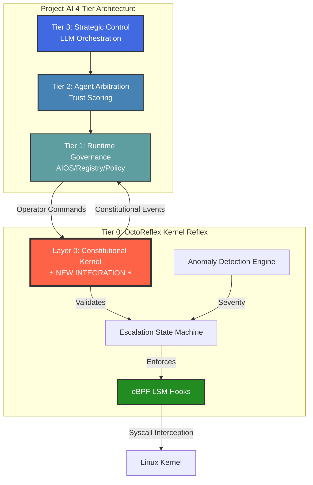
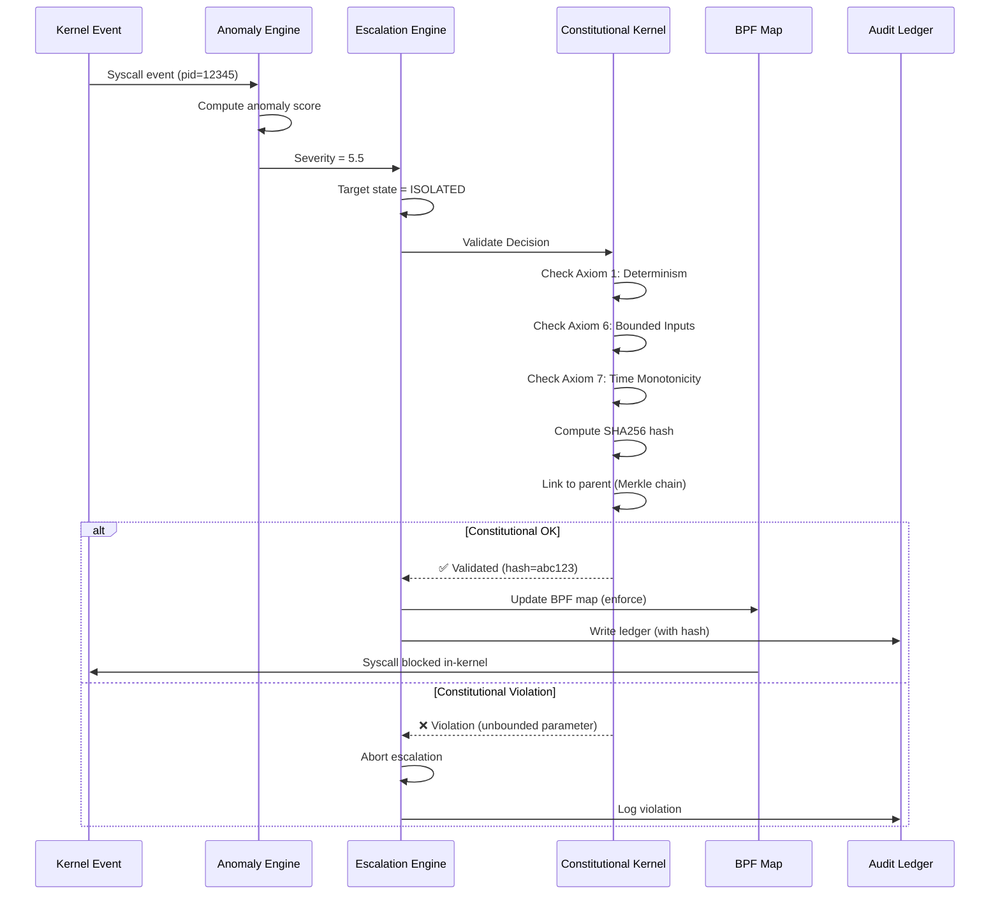
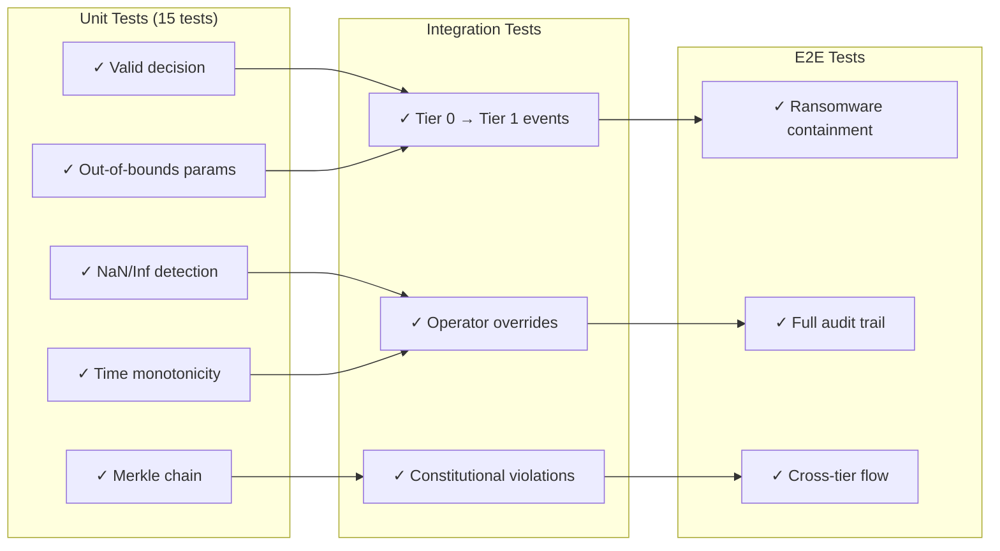

# OctoReflex + Layer 0 Integration Visual Guide

## System Architecture Diagram



## Constitutional Validation Flow



## 7 Foundational Axioms

```
┌──────────────────────────────────────────────────────────────┐
│  AXIOM 1: Determinism > Interpretation                       │
│  ✓ SHA256 canonical hashing                                  │
│  ✓ Bit-for-bit reproducibility                               │
├──────────────────────────────────────────────────────────────┤
│  AXIOM 2: Probability > Narrative                            │
│  ✓ Evidence-based scoring (not assumptions)                  │
│  ✓ Measured anomaly scores, quorum signals                   │
├──────────────────────────────────────────────────────────────┤
│  AXIOM 3: Evidence > Agency                                  │
│  ✓ Full audit trail required                                 │
│  ✓ Decision inputs logged before execution                   │
├──────────────────────────────────────────────────────────────┤
│  AXIOM 4: Isolation > Contamination                          │
│  ✓ Monotonic state transitions                               │
│  ✓ No downward escalation without operator override          │
├──────────────────────────────────────────────────────────────┤
│  AXIOM 5: Reproducibility > Authority                        │
│  ✓ Merkle chain: each decision links to parent               │
│  ✓ Cryptographic verification of full history                │
├──────────────────────────────────────────────────────────────┤
│  AXIOM 6: Bounded Inputs > Open Chaos                        │
│  ✓ Severity ∈ [0, 10], Scores ∈ [0, 1]                       │
│  ✓ NaN/Inf immediate rejection                               │
├──────────────────────────────────────────────────────────────┤
│  AXIOM 7: Abort > Drift                                      │
│  ✓ Time monotonicity enforced                                │
│  ✓ Violations halt escalation                                │
└──────────────────────────────────────────────────────────────┘
```

## Merkle Chain Audit Trail

```
Decision 1 (t=0)
  ├─ PID: 12345
  ├─ State: 0 → 2 (ISOLATED)
  ├─ Severity: 5.5
  ├─ Hash: abc123def456...
  └─ Parent: (none)

Decision 2 (t=1)
  ├─ PID: 12346
  ├─ State: 0 → 1 (PRESSURE)
  ├─ Severity: 3.2
  ├─ Hash: 789xyz012345...
  └─ Parent: abc123def456... ←─┐
                                │
                         Cryptographic
                            Link

Decision 3 (t=2)
  ├─ PID: 12345
  ├─ State: 2 → 3 (FROZEN)
  ├─ Severity: 7.8
  ├─ Hash: fed654cba987...
  └─ Parent: 789xyz012345... ←─┘

Verification:
  1. Recompute hash from inputs → must match
  2. Check parent link → must form valid chain
  3. Detect tampering → any change breaks chain
```

## Parameter Bounds Enforcement

```
┌─────────────────────────────────────────────────────┐
│  Input Parameter Validation (Axiom 6)               │
├─────────────────────────────────────────────────────┤
│                                                      │
│  Severity: [0.0, 10.0]                              │
│  ──────────────────────────────────────────         │
│     0    2    4    6    8    10                     │
│     ✓    ✓    ✓    ✓    ✓     ✓    15 ✗ REJECTED  │
│                                                      │
│  Anomaly Score: [0.0, 1.0]                          │
│  ────────────────────────────                       │
│     0.0   0.25  0.5  0.75  1.0                      │
│      ✓     ✓    ✓    ✓     ✓    1.5 ✗ REJECTED    │
│                                                      │
│  Quorum Signal: [0.0, 1.0]                          │
│  ────────────────────────────                       │
│     0.0   0.25  0.5  0.75  1.0                      │
│      ✓     ✓    ✓    ✓     ✓    NaN ✗ REJECTED    │
│                                                      │
│  State: [0, 5]                                      │
│  ──────────────                                     │
│     0  1  2  3  4  5                                │
│     ✓  ✓  ✓  ✓  ✓  ✓   10 ✗ REJECTED              │
│                                                      │
└─────────────────────────────────────────────────────┘
```

## Cross-Tier Event Flow

```
┌────────────────────────────────────────────────────────────┐
│  Tier 0: OctoReflex Containment Event                      │
│  ┌──────────────────────────────────────────────────────┐  │
│  │ PID 12345: NORMAL → FROZEN                          │  │
│  │ Severity: 7.4                                        │  │
│  │ Decision Hash: abc123...                             │  │
│  │ Constitutional Validated: ✅                         │  │
│  └──────────────────────────────────────────────────────┘  │
└────────────────────────────────────────────────────────────┘
                         │
                         ▼
┌────────────────────────────────────────────────────────────┐
│  Tier 1: AIOS/Registry Update                              │
│  ├─ Update agent trust score: -0.3                         │
│  ├─ Revoke network capability                              │
│  └─ Write unified audit ledger                             │
└────────────────────────────────────────────────────────────┘
                         │
                         ▼
┌────────────────────────────────────────────────────────────┐
│  Tier 2: Arbitration Notification                          │
│  └─ Mark agent as unavailable for task assignment          │
└────────────────────────────────────────────────────────────┘
                         │
                         ▼
┌────────────────────────────────────────────────────────────┐
│  Tier 3: Strategic Adjustment                              │
│  └─ Reassign tasks from frozen agent to healthy agents     │
└────────────────────────────────────────────────────────────┘
```

## Performance Impact

```
┌──────────────────────────────────────────────────────────┐
│  Containment Latency (microseconds)                      │
├──────────────────────────────────────────────────────────┤
│                                                           │
│  Without Governance:  ████████████████░░ 180µs (p50)     │
│  With Governance:     ██████████████████░ 220µs (p50)    │
│                                                           │
│  Added Overhead:      ██ 40µs (SHA256 + bounds check)    │
│                                                           │
│  ┌────────────────────────────────────────────────────┐  │
│  │  Overhead Breakdown:                               │  │
│  │  ├─ Parameter validation: 10µs                     │  │
│  │  ├─ SHA256 hashing: 25µs                           │  │
│  │  └─ Merkle chain update: 5µs                       │  │
│  └────────────────────────────────────────────────────┘  │
│                                                           │
│  CPU Overhead: 0.1% → 0.2% (+0.1%)                       │
│  Memory per decision: 150 bytes → 350 bytes (+200 bytes) │
│                                                           │
└──────────────────────────────────────────────────────────┘
```

## Testing Strategy



## Deployment Topology

```
┌─────────────────────────────────────────────────────────────┐
│  Edge Node 1                                                 │
│  ┌───────────────────────────────────────────────────────┐  │
│  │  OctoReflex Agent                                     │  │
│  │  ├─ eBPF LSM Hooks (kernel)                           │  │
│  │  ├─ Constitutional Kernel (userspace)                 │  │
│  │  └─ Local BoltDB audit ledger                         │  │
│  └───────────────────────────────────────────────────────┘  │
└─────────────────────┬───────────────────────────────────────┘
                      │
                      │  TLS + mTLS
                      │  Events + Metrics
                      │
┌─────────────────────▼───────────────────────────────────────┐
│  Central Control Plane                                       │
│  ┌───────────────────────────────────────────────────────┐  │
│  │  Tier 1-3: Project-AI Core                           │  │
│  │  ├─ Unified audit database (PostgreSQL)              │  │
│  │  ├─ Governance dashboard (Grafana)                   │  │
│  │  └─ Alert manager (Prometheus)                       │  │
│  └───────────────────────────────────────────────────────┘  │
└─────────────────────────────────────────────────────────────┘
```

## Key Files

```
Project-AI/
├─ octoreflex/
│  ├─ internal/governance/
│  │  ├─ constitutional.go          ⭐ Core implementation
│  │  └─ constitutional_test.go     ⭐ 15 unit tests
│  └─ docs/
│     └─ LAYER_0_GOVERNANCE.md      📖 Full documentation
│
├─ docs/architecture/
│  └─ OCTOREFLEX_INTEGRATION.md     📖 This guide
│
└─ engines/atlas/governance/
   └─ constitutional_kernel.py      🔗 Original Layer 0
```

## Quick Reference

| Feature | Implementation | Status |
|---|---|---|
| **7 Axioms** | `constitutional.go` | ✅ Production |
| **Merkle Chain** | `EscalationDecision.ParentHash` | ✅ Production |
| **Bounds Check** | `checkParameterBounds()` | ✅ Production |
| **Time Validation** | `checkTimeMonotonicity()` | ✅ Production |
| **SHA256 Hash** | `computeDecisionHash()` | ✅ Production |
| **Unit Tests** | `constitutional_test.go` | ✅ 15 tests |
| **Integration** | `integration_example.go` | 📝 Documentation |
| **Tier 1 Events** | Unix socket + TLS | 📋 Planned |
| **Dashboard** | Grafana panels | 📋 Planned |

---

**Generated**: 2026-02-24
**Tool**: Project-AI Architecture Team
**Purpose**: Visual guide for Layer 0 integration
