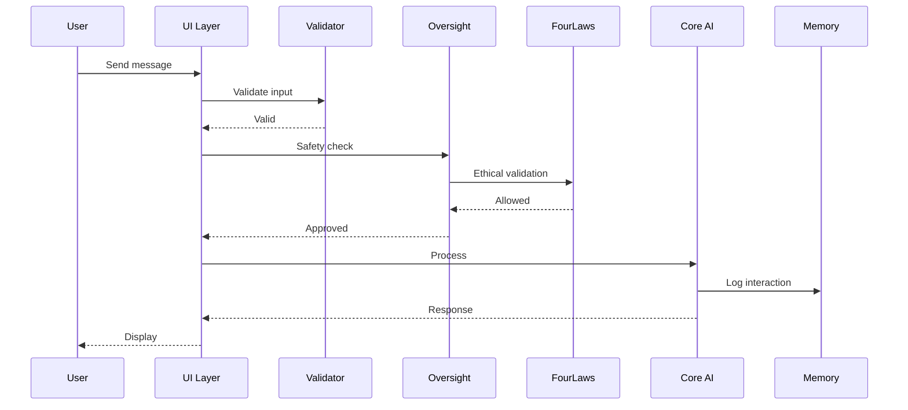

# Project-AI Platform Architecture Blueprint

**Version:** 1.0  
**Date:** February 2026  
**Status:** Production-Grade  
**Audience:** Architects, Engineers, DevOps

---

## Executive Summary

Project-AI is a **monolithic sovereign platform** with modular internal architecture, deployed across Desktop (PyQt6), Docker containers, and Web (React + Flask). This blueprint provides layered diagrams, data flows, module boundaries, technology stack, and deployment topology.

---

## Layered Architecture

### Three-Tier Architecture

```
┌──────────────────────────────────────────────────────────┐
│                  PRESENTATION LAYER                      │
├──────────────────────────────────────────────────────────┤
│  ┌─────────────┐  ┌─────────────┐  ┌──────────────┐   │
│  │  Desktop UI │  │   Web UI    │  │   REST API   │   │
│  │   (PyQt6)   │  │  (React 18) │  │   (Flask)    │   │
│  └──────┬──────┘  └──────┬──────┘  └──────┬───────┘   │
└─────────┼────────────────┼─────────────────┼────────────┘
          │                │                 │
┌─────────┴────────────────┴─────────────────┴────────────┐
│                   BUSINESS LOGIC LAYER                    │
├──────────────────────────────────────────────────────────┤
│  ┌───────────────────────────────────────────────────┐  │
│  │         Six Core AI Systems                       │  │
│  │  1. FourLaws    2. AIPersona    3. Memory        │  │
│  │  4. Learning    5. Override     6. Plugins       │  │
│  └───────────────────┬───────────────────────────────┘  │
│  ┌───────────────────┴───────────────────────────────┐  │
│  │         Four Agent Subsystems                     │  │
│  │  • Oversight    • Planner    • Validator         │  │
│  │  • Explainability                                │  │
│  └───────────────────────────────────────────────────┘  │
└──────────────────────────┬────────────────────────────────┘
┌──────────────────────────┴────────────────────────────────┐
│                   PERSISTENCE LAYER                       │
├──────────────────────────────────────────────────────────┤
│  ┌─────────────┐  ┌─────────────┐  ┌──────────────┐   │
│  │    JSON     │  │   SQLite    │  │ PostgreSQL   │   │
│  │  (Default)  │  │  (Optional) │  │   (Web)      │   │
│  └─────────────┘  └─────────────┘  └──────────────┘   │
└──────────────────────────────────────────────────────────┘
```

---

## Technology Stack

### Core Technologies

| Layer | Technology | Version | Purpose |
|-------|-----------|---------|---------|
| **Primary Language** | Python | 3.11+ | Core systems, backend, desktop |
| **Secondary Language** | JavaScript | ES2022 | Web frontend |
| **Desktop UI** | PyQt6 | 6.x | Cross-platform GUI |
| **Web UI** | React | 18 | Modern SPA |
| **API Framework** | Flask | 2.x | REST API |
| **Storage** | JSON/SQLite/PostgreSQL | - | Persistence |
| **AI/ML** | OpenAI API, Scikit-learn | - | Intelligence, ML |
| **Security** | Bcrypt, Fernet, Ed25519 | - | Auth, encryption, signing |

### DevOps Stack

| Component | Technology | Purpose |
|-----------|-----------|---------|
| **CI/CD** | GitHub Actions | Automated testing, deployment |
| **Containers** | Docker | Isolated environments |
| **Orchestration** | Kubernetes (optional) | Horizontal scaling |
| **Monitoring** | Prometheus, Grafana | Metrics, alerting |
| **Security** | CodeQL, Bandit, Dependabot | Vulnerability detection |

---

## Deployment Topology

### Mode 1: Desktop (Production-Ready)

```
User's Computer (Windows/Linux/Mac)
├── LeatherBookInterface (PyQt6)
│   ├── Six Core AI Systems
│   ├── Four Agent Subsystems
│   └── data/ (JSON Storage)
│       ├── ai_persona/
│       ├── memory/
│       └── learning_requests/
└── Optional: OpenAI API (internet)
```

**Characteristics:**
- Single-user, local deployment
- No server required
- Offline-capable (without OpenAI)
- ~50 MB disk space
- 4 GB RAM recommended

### Mode 2: Docker Single-Node (Production-Ready)

```
Docker Host
├── project-ai:latest (Container)
│   ├── Python 3.11 + PyQt6
│   ├── Core AI Systems
│   ├── Agent Subsystems
│   └── Volumes
│       ├── /data → /app/data
│       └── /logs → /app/logs
└── Health Check: :8000/health (30s)
```

**Characteristics:**
- Isolated, reproducible
- SLSA Level 3 attestation
- Resource limits (4 CPU, 4GB RAM)
- Port 8000 for monitoring

### Mode 3: Web Platform (Development)

```
Cloud Infrastructure
├── Load Balancer → Frontend (React/Vite)
├── Backend API (Flask/Gunicorn)
│   ├── Core AI Systems
│   └── Agent Framework
├── PostgreSQL (Multi-user DB)
├── Redis (Session cache)
└── Prometheus + Grafana
```

**Characteristics:**
- Multi-user, scalable
- RESTful API
- Target: 99.9% uptime SLA

---

## Data Flow Diagrams

### User Interaction Flow



---

## Module Boundaries

### Core Modules

| Module | Responsibility | Dependencies | API |
|--------|---------------|--------------|-----|
| **FourLaws** | Ethical validation | None | `validate_action()` |
| **AIPersona** | Personality, mood | ContinuousLearning | `update_state()` |
| **Memory** | Knowledge storage | None | `add_knowledge()`, `search()` |
| **Learning** | Request management | Memory, BlackVault | `submit_request()`, `approve()` |
| **Override** | Admin control | FourLaws | `activate()`, `deactivate()` |
| **Plugins** | Extensibility | FourLaws, Persona | `register()`, `execute()` |

---

## Performance Characteristics

### Current Limits

| Metric | Current | Target (Q2 2026) |
|--------|---------|------------------|
| **Concurrent Users** | 1 (desktop) | 500 (web) |
| **Knowledge Entries** | 10,000 | 100,000 |
| **API Throughput** | N/A | 500 RPS |
| **Latency (P95)** | 234ms | 200ms |

---

## Conclusion

Project-AI's architecture balances **monolithic simplicity** with **modular maintainability**:

- Single kernel orchestration
- Clear module boundaries
- Multiple deployment modes
- Production-grade (94/100 readiness)

---

**Document Control:**
- **Version:** 1.0
- **Status:** Production-Grade  
- **Last Updated:** February 14, 2026
- **Classification:** Technical Documentation

---

*See related:*
- *CORE_AI_SYSTEMS_TECHNICAL_DEEPDIVE.md*
- *AGENT_FRAMEWORK_TECHNICAL_DEEPDIVE.md*
