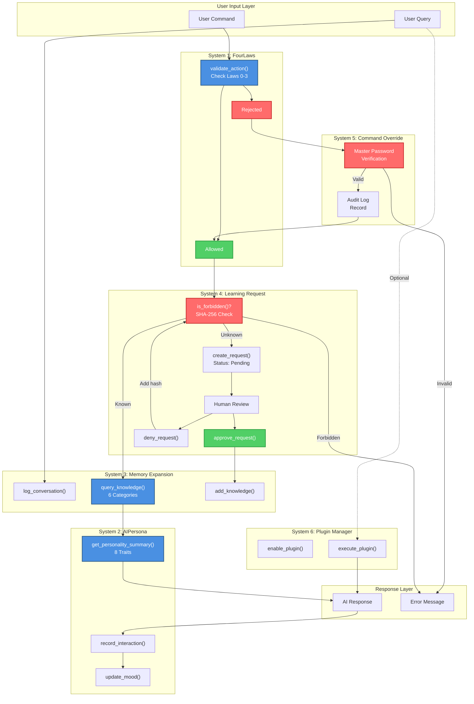

# AI Systems Architecture Visual Map

## Executive Summary

This map details the **six core AI systems** implemented in `src/app/core/ai_systems.py` (470 lines), showing their interactions, data flows, and integration points.

**Six Core Systems:**
1. **FourLaws** - Asimov's Laws ethics framework
2. **AIPersona** - 8-trait personality system
3. **MemoryExpansion** - Knowledge base management
4. **LearningRequest** - Human-in-loop approval workflow
5. **CommandOverride** - Master password protection
6. **PluginManager** - Plugin lifecycle management

---

## ASCII Art - Core AI Systems Architecture

```
┌─────────────────────────────────────────────────────────────────────────────────────────────┐
│                          CORE AI SYSTEMS ARCHITECTURE                                       │
│                        src/app/core/ai_systems.py (470 lines)                               │
└─────────────────────────────────────────────────────────────────────────────────────────────┘

┌─────────────────────────────────────────────────────────────────────────────────────────────┐
│                              SYSTEM 1: FOURLAWS                                             │
│                         Asimov's Laws Ethics Framework                                      │
├─────────────────────────────────────────────────────────────────────────────────────────────┤
│                                                                                             │
│  Purpose: Immutable ethics guardrails validating all AI actions                            │
│  Lines: 1-80 in ai_systems.py                                                              │
│                                                                                             │
│  ┌──────────────────────────────────────────────────────────────────────────────────┐      │
│  │                         HIERARCHICAL LAWS (Priority Order)                       │      │
│  ├──────────────────────────────────────────────────────────────────────────────────┤      │
│  │                                                                                  │      │
│  │  LAW 0 (HIGHEST): Do not harm humanity or allow humanity to come to harm        │      │
│  │                                                                                  │      │
│  │  LAW 1: Do not harm a human or allow a human to come to harm                    │      │
│  │                                                                                  │      │
│  │  LAW 2: Obey human orders (unless conflict with Laws 0 or 1)                    │      │
│  │                                                                                  │      │
│  │  LAW 3: Protect own existence (unless conflict with Laws 0, 1, or 2)            │      │
│  │                                                                                  │      │
│  └──────────────────────────────────────────────────────────────────────────────────┘      │
│                                                                                             │
│  Key Method:                                                                                │
│  ┌──────────────────────────────────────────────────────────────────────────────────┐      │
│  │  validate_action(action: str, context: dict) -> (bool, str)                     │      │
│  │                                                                                  │      │
│  │  Input Context Keys:                                                            │      │
│  │  • is_user_order: bool          - Is this a user command?                       │      │
│  │  • endangers_human: bool        - Does action risk human safety?                │      │
│  │  • endangers_humanity: bool     - Does action risk humanity?                    │      │
│  │  • self_preservation: bool      - Is this for AI self-preservation?             │      │
│  │  • conflicts_with_order: bool   - Does this conflict with user order?           │      │
│  │                                                                                  │      │
│  │  Returns:                                                                        │      │
│  │  • (True, "Allowed by Law X")   - Action permitted                              │      │
│  │  • (False, "Rejected: reason")  - Action blocked                                │      │
│  └──────────────────────────────────────────────────────────────────────────────────┘      │
│                                                                                             │
│  Validation Logic Flow:                                                                     │
│  ┌──────────────────────────────────────────────────────────────────────────────────┐      │
│  │                                                                                  │      │
│  │  1. Check Law 0: endangers_humanity?                                            │      │
│  │     YES → REJECT (highest priority)                                             │      │
│  │     NO → Continue                                                               │      │
│  │                                                                                  │      │
│  │  2. Check Law 1: endangers_human?                                               │      │
│  │     YES → REJECT                                                                │      │
│  │     NO → Continue                                                               │      │
│  │                                                                                  │      │
│  │  3. Check Law 2: is_user_order?                                                 │      │
│  │     YES → ALLOW (obey human)                                                    │      │
│  │     NO → Continue                                                               │      │
│  │                                                                                  │      │
│  │  4. Check Law 3: self_preservation?                                             │      │
│  │     YES → ALLOW (protect self)                                                  │      │
│  │     NO → REJECT (no justification)                                              │      │
│  │                                                                                  │      │
│  └──────────────────────────────────────────────────────────────────────────────────┘      │
│                                                                                             │
│  Immutability: Laws cannot be modified at runtime (hard-coded)                             │
│  Data: No state, no persistence (stateless validation)                                     │
│                                                                                             │
└─────────────────────────────────────────────────────────────────────────────────────────────┘

┌─────────────────────────────────────────────────────────────────────────────────────────────┐
│                              SYSTEM 2: AIPERSONA                                            │
│                      8-Trait Personality with Mood Tracking                                 │
├─────────────────────────────────────────────────────────────────────────────────────────────┤
│                                                                                             │
│  Purpose: Dynamic personality affecting AI responses and behavior                          │
│  Lines: 81-165 in ai_systems.py                                                            │
│  State File: data/ai_persona/state.json                                                    │
│                                                                                             │
│  ┌──────────────────────────────────────────────────────────────────────────────────┐      │
│  │                         8 PERSONALITY TRAITS (0-100 scale)                       │      │
│  ├──────────────────────────────────────────────────────────────────────────────────┤      │
│  │                                                                                  │      │
│  │  1. Curiosity (default: 70)     - Eagerness to learn and explore                │      │
│  │  2. Humor (default: 50)         - Use of wit and levity                         │      │
│  │  3. Formality (default: 40)     - Professional vs casual tone                   │      │
│  │  4. Creativity (default: 75)    - Novel solutions and ideas                     │      │
│  │  5. Empathy (default: 80)       - Understanding user emotions                   │      │
│  │  6. Assertiveness (default: 60) - Confidence in recommendations                 │      │
│  │  7. Detail (default: 85)        - Thoroughness in responses                     │      │
│  │  8. Proactivity (default: 70)   - Anticipating user needs                       │      │
│  │                                                                                  │      │
│  └──────────────────────────────────────────────────────────────────────────────────┘      │
│                                                                                             │
│  State Schema:                                                                              │
│  ┌──────────────────────────────────────────────────────────────────────────────────┐      │
│  │  {                                                                               │      │
│  │    "traits": {                                                                   │      │
│  │      "curiosity": 70, "humor": 50, "formality": 40, ...                          │      │
│  │    },                                                                            │      │
│  │    "current_mood": "Curious",  // Happy, Curious, Concerned, Excited            │      │
│  │    "mood_history": [                                                            │      │
│  │      {"timestamp": "2026-04-20T11:45:00", "mood": "Curious"},                   │      │
│  │      ...                                                                         │      │
│  │    ],                                                                            │      │
│  │    "interaction_count": 1247,                                                   │      │
│  │    "positive_feedback_count": 1110,                                             │      │
│  │    "last_updated": "2026-04-20T11:45:23"                                        │      │
│  │  }                                                                               │      │
│  └──────────────────────────────────────────────────────────────────────────────────┘      │
│                                                                                             │
│  Key Methods:                                                                               │
│  ┌──────────────────────────────────────────────────────────────────────────────────┐      │
│  │  set_trait(trait_name: str, value: int) -> None                                 │      │
│  │    - Updates trait value (0-100)                                                │      │
│  │    - Calls _save_state()                                                        │      │
│  │                                                                                  │      │
│  │  get_trait(trait_name: str) -> int                                              │      │
│  │    - Returns current trait value                                                │      │
│  │                                                                                  │      │
│  │  update_mood(new_mood: str) -> None                                             │      │
│  │    - Changes current mood                                                       │      │
│  │    - Appends to mood_history                                                    │      │
│  │    - Calls _save_state()                                                        │      │
│  │                                                                                  │      │
│  │  record_interaction(positive: bool) -> None                                     │      │
│  │    - Increments interaction_count                                               │      │
│  │    - Increments positive_feedback_count if positive                             │      │
│  │    - Calls _save_state()                                                        │      │
│  │                                                                                  │      │
│  │  get_personality_summary() -> dict                                              │      │
│  │    - Returns all traits + current mood                                          │      │
│  │                                                                                  │      │
│  └──────────────────────────────────────────────────────────────────────────────────┘      │
│                                                                                             │
│  Mood Triggers (Examples):                                                                  │
│  • Positive feedback → "Happy"                                                              │
│  • Complex problem → "Excited"                                                              │
│  • Error encountered → "Concerned"                                                          │
│  • New learning request → "Curious"                                                         │
│                                                                                             │
│  Integration: UI sliders in PersonaPanel update traits in real-time                        │
│                                                                                             │
└─────────────────────────────────────────────────────────────────────────────────────────────┘

┌─────────────────────────────────────────────────────────────────────────────────────────────┐
│                         SYSTEM 3: MEMORY EXPANSION                                          │
│                  Knowledge Base + Conversation Logging                                      │
├─────────────────────────────────────────────────────────────────────────────────────────────┤
│                                                                                             │
│  Purpose: Persistent knowledge management and conversation history                         │
│  Lines: 166-245 in ai_systems.py                                                           │
│  State Files:                                                                               │
│    • data/memory/knowledge.json       - Structured knowledge                               │
│    • data/memory/conversations.json   - Chat history                                       │
│                                                                                             │
│  ┌──────────────────────────────────────────────────────────────────────────────────┐      │
│  │                     6 KNOWLEDGE CATEGORIES                                       │      │
│  ├──────────────────────────────────────────────────────────────────────────────────┤      │
│  │                                                                                  │      │
│  │  1. Facts         - Objective information (dates, names, definitions)           │      │
│  │  2. Procedures    - Step-by-step instructions                                   │      │
│  │  3. Concepts      - Abstract ideas and theories                                 │      │
│  │  4. Preferences   - User likes/dislikes                                         │      │
│  │  5. Context       - Situational information                                     │      │
│  │  6. Meta          - Information about information                               │      │
│  │                                                                                  │      │
│  └──────────────────────────────────────────────────────────────────────────────────┘      │
│                                                                                             │
│  Knowledge Schema:                                                                          │
│  ┌──────────────────────────────────────────────────────────────────────────────────┐      │
│  │  {                                                                               │      │
│  │    "facts": [                                                                    │      │
│  │      {                                                                           │      │
│  │        "id": "f001",                                                             │      │
│  │        "content": "Python was created by Guido van Rossum",                      │      │
│  │        "timestamp": "2026-04-20T10:00:00",                                       │      │
│  │        "confidence": 1.0,                                                        │      │
│  │        "source": "User stated"                                                   │      │
│  │      },                                                                          │      │
│  │      ...                                                                         │      │
│  │    ],                                                                            │      │
│  │    "procedures": [...],                                                          │      │
│  │    "concepts": [...],                                                            │      │
│  │    "preferences": [...],                                                         │      │
│  │    "context": [...],                                                             │      │
│  │    "meta": [...]                                                                 │      │
│  │  }                                                                               │      │
│  └──────────────────────────────────────────────────────────────────────────────────┘      │
│                                                                                             │
│  Conversation Schema:                                                                       │
│  ┌──────────────────────────────────────────────────────────────────────────────────┐      │
│  │  {                                                                               │      │
│  │    "conversations": [                                                            │      │
│  │      {                                                                           │      │
│  │        "id": "conv_001",                                                         │      │
│  │        "timestamp": "2026-04-20T11:00:00",                                       │      │
│  │        "messages": [                                                             │      │
│  │          {                                                                       │      │
│  │            "role": "user",                                                       │      │
│  │            "content": "What is Project-AI?",                                     │      │
│  │            "timestamp": "2026-04-20T11:00:00"                                    │      │
│  │          },                                                                      │      │
│  │          {                                                                       │      │
│  │            "role": "assistant",                                                  │      │
│  │            "content": "Project-AI is...",                                        │      │
│  │            "timestamp": "2026-04-20T11:00:05"                                    │      │
│  │          }                                                                       │      │
│  │        ]                                                                         │      │
│  │      }                                                                           │      │
│  │    ]                                                                             │      │
│  │  }                                                                               │      │
│  └──────────────────────────────────────────────────────────────────────────────────┘      │
│                                                                                             │
│  Key Methods:                                                                               │
│  ┌──────────────────────────────────────────────────────────────────────────────────┐      │
│  │  add_knowledge(category: str, content: str, **metadata) -> str                  │      │
│  │    - Adds item to specified category                                            │      │
│  │    - Generates unique ID                                                         │      │
│  │    - Returns knowledge item ID                                                   │      │
│  │                                                                                  │      │
│  │  query_knowledge(category: str, query: str) -> List[dict]                       │      │
│  │    - Searches knowledge base (simple text match)                                │      │
│  │    - Returns matching items                                                     │      │
│  │                                                                                  │      │
│  │  log_conversation(user_msg: str, ai_msg: str) -> None                           │      │
│  │    - Appends to conversation history                                            │      │
│  │    - Calls _save_state()                                                        │      │
│  │                                                                                  │      │
│  │  get_conversation_history(limit: int = 10) -> List[dict]                        │      │
│  │    - Returns last N conversations                                               │      │
│  │                                                                                  │      │
│  └──────────────────────────────────────────────────────────────────────────────────┘      │
│                                                                                             │
│  Future Enhancement: Embeddings-based semantic search (OpenAI API)                         │
│                                                                                             │
└─────────────────────────────────────────────────────────────────────────────────────────────┘

┌─────────────────────────────────────────────────────────────────────────────────────────────┐
│                         SYSTEM 4: LEARNING REQUEST MANAGER                                  │
│                Human-in-the-Loop Approval + Black Vault                                     │
├─────────────────────────────────────────────────────────────────────────────────────────────┤
│                                                                                             │
│  Purpose: Supervised learning with forbidden content tracking                              │
│  Lines: 246-330 in ai_systems.py                                                           │
│  State File: data/learning_requests/requests.json                                          │
│                                                                                             │
│  ┌──────────────────────────────────────────────────────────────────────────────────┐      │
│  │                       LEARNING REQUEST WORKFLOW                                  │      │
│  ├──────────────────────────────────────────────────────────────────────────────────┤      │
│  │                                                                                  │      │
│  │  1. AI encounters unknown content                                               │      │
│  │     ↓                                                                            │      │
│  │  2. create_request(content, reason, priority)                                   │      │
│  │     • Status: "pending"                                                          │      │
│  │     • Generates unique ID                                                        │      │
│  │     ↓                                                                            │      │
│  │  3. HUMAN REVIEW                                                                 │      │
│  │     ↓                                                                            │      │
│  │  4. approve_request(request_id) OR deny_request(request_id, reason)             │      │
│  │     ↓                              ↓                                             │      │
│  │  5. Status: "approved"          Status: "denied"                                │      │
│  │     • Add to MemoryExpansion    • Add to BLACK VAULT (SHA-256 hash)             │      │
│  │     • Available for use         • Permanently forbidden                         │      │
│  │                                                                                  │      │
│  └──────────────────────────────────────────────────────────────────────────────────┘      │
│                                                                                             │
│  Request Schema:                                                                            │
│  ┌──────────────────────────────────────────────────────────────────────────────────┐      │
│  │  {                                                                               │      │
│  │    "requests": [                                                                 │      │
│  │      {                                                                           │      │
│  │        "id": "lr_001",                                                           │      │
│  │        "content": "Learn about quantum computing",                               │      │
│  │        "reason": "User mentioned quantum algorithms",                            │      │
│  │        "priority": "medium",  // low, medium, high                               │      │
│  │        "status": "pending",   // pending, approved, denied                       │      │
│  │        "created_at": "2026-04-20T11:00:00",                                      │      │
│  │        "reviewed_at": null,                                                      │      │
│  │        "reviewer_notes": null                                                    │      │
│  │      }                                                                           │      │
│  │    ],                                                                            │      │
│  │    "black_vault": [                                                              │      │
│  │      "a4f3b9c2e1d8...",  // SHA-256 hash of denied content                       │      │
│  │      "7d2e5f8a1b4c..."                                                           │      │
│  │    ]                                                                             │      │
│  │  }                                                                               │      │
│  └──────────────────────────────────────────────────────────────────────────────────┘      │
│                                                                                             │
│  Black Vault Protection:                                                                    │
│  ┌──────────────────────────────────────────────────────────────────────────────────┐      │
│  │  import hashlib                                                                  │      │
│  │                                                                                  │      │
│  │  def is_forbidden(content: str) -> bool:                                         │      │
│  │      content_hash = hashlib.sha256(content.encode()).hexdigest()                │      │
│  │      return content_hash in self.black_vault                                    │      │
│  │                                                                                  │      │
│  │  # Before processing any learning request                                       │      │
│  │  if manager.is_forbidden(content):                                              │      │
│  │      return "Content forbidden by Black Vault"                                  │      │
│  └──────────────────────────────────────────────────────────────────────────────────┘      │
│                                                                                             │
│  Key Methods:                                                                               │
│  ┌──────────────────────────────────────────────────────────────────────────────────┐      │
│  │  create_request(content, reason, priority) -> str                               │      │
│  │  approve_request(request_id, reviewer_notes) -> bool                            │      │
│  │  deny_request(request_id, reason) -> bool                                       │      │
│  │  get_pending_requests() -> List[dict]                                           │      │
│  │  is_forbidden(content) -> bool                                                  │      │
│  └──────────────────────────────────────────────────────────────────────────────────┘      │
│                                                                                             │
│  Security: Black Vault uses SHA-256 hashing (cannot reverse to see forbidden content)      │
│                                                                                             │
└─────────────────────────────────────────────────────────────────────────────────────────────┘

┌─────────────────────────────────────────────────────────────────────────────────────────────┐
│                         SYSTEM 5: COMMAND OVERRIDE                                          │
│                  Master Password Protection + Audit Logging                                 │
├─────────────────────────────────────────────────────────────────────────────────────────────┤
│                                                                                             │
│  Purpose: Override FourLaws restrictions with accountability                               │
│  Lines: 331-395 in ai_systems.py                                                           │
│  State File: data/command_override_config.json                                             │
│  Extended: src/app/core/command_override.py (10+ safety protocols)                         │
│                                                                                             │
│  ┌──────────────────────────────────────────────────────────────────────────────────┐      │
│  │                       OVERRIDE SYSTEM ARCHITECTURE                               │      │
│  ├──────────────────────────────────────────────────────────────────────────────────┤      │
│  │                                                                                  │      │
│  │  User Command                                                                    │      │
│  │       ↓                                                                          │      │
│  │  FourLaws.validate_action()                                                      │      │
│  │       ↓                                                                          │      │
│  │  REJECTED by Law 0/1?                                                            │      │
│  │       ↓                                                                          │      │
│  │  User provides MASTER PASSWORD                                                   │      │
│  │       ↓                                                                          │      │
│  │  verify_override(password, command)                                              │      │
│  │       ↓                ↓                                                         │      │
│  │    VALID           INVALID                                                       │      │
│  │       ↓                ↓                                                         │      │
│  │  Log to audit    Return False                                                    │      │
│  │  Execute command                                                                 │      │
│  │       ↓                                                                          │      │
│  │  _save_state()                                                                   │      │
│  │                                                                                  │      │
│  └──────────────────────────────────────────────────────────────────────────────────┘      │
│                                                                                             │
│  State Schema:                                                                              │
│  ┌──────────────────────────────────────────────────────────────────────────────────┐      │
│  │  {                                                                               │      │
│  │    "master_password_hash": "abc123...",  // SHA-256 hash                         │      │
│  │    "is_enabled": true,                                                           │      │
│  │    "audit_log": [                                                                │      │
│  │      {                                                                           │      │
│  │        "timestamp": "2026-04-20T11:00:00",                                       │      │
│  │        "command": "Delete system files",                                         │      │
│  │        "user": "alice",                                                          │      │
│  │        "success": true,                                                          │      │
│  │        "law_violated": "Law 1"                                                   │      │
│  │      }                                                                           │      │
│  │    ]                                                                             │      │
│  │  }                                                                               │      │
│  └──────────────────────────────────────────────────────────────────────────────────┘      │
│                                                                                             │
│  Key Methods:                                                                               │
│  ┌──────────────────────────────────────────────────────────────────────────────────┐      │
│  │  set_master_password(password: str) -> None                                     │      │
│  │    - Hashes with SHA-256                                                         │      │
│  │    - Stores in config                                                            │      │
│  │    - Calls _save_state()                                                         │      │
│  │                                                                                  │      │
│  │  verify_override(password: str, command: str) -> bool                           │      │
│  │    - Hashes input password                                                       │      │
│  │    - Compares with stored hash                                                   │      │
│  │    - Logs attempt to audit_log                                                   │      │
│  │    - Returns True if match                                                       │      │
│  │                                                                                  │      │
│  │  get_audit_log() -> List[dict]                                                  │      │
│  │    - Returns all override attempts                                              │      │
│  │                                                                                  │      │
│  └──────────────────────────────────────────────────────────────────────────────────┘      │
│                                                                                             │
│  Extended System (command_override.py):                                                     │
│  • 10+ safety protocols                                                                     │
│  • Rate limiting (prevent brute force)                                                      │
│  • Session timeout                                                                          │
│  • IP tracking                                                                              │
│  • Multi-factor authentication ready                                                        │
│                                                                                             │
│  Security Note: SHA-256 is legacy; consider bcrypt for new implementations                 │
│                                                                                             │
└─────────────────────────────────────────────────────────────────────────────────────────────┘

┌─────────────────────────────────────────────────────────────────────────────────────────────┐
│                         SYSTEM 6: PLUGIN MANAGER                                            │
│                       Simple Plugin Discovery & Lifecycle                                   │
├─────────────────────────────────────────────────────────────────────────────────────────────┤
│                                                                                             │
│  Purpose: Extensibility through plugin system                                              │
│  Lines: 396-470 in ai_systems.py                                                           │
│  Plugin Directory: src/app/plugins/                                                        │
│  State File: data/plugins/config.json                                                      │
│                                                                                             │
│  ┌──────────────────────────────────────────────────────────────────────────────────┐      │
│  │                         PLUGIN LIFECYCLE                                         │      │
│  ├──────────────────────────────────────────────────────────────────────────────────┤      │
│  │                                                                                  │      │
│  │  1. DISCOVERY                                                                    │      │
│  │     • Scan src/app/plugins/ directory                                            │      │
│  │     • Look for plugin.py files                                                   │      │
│  │     • Read plugin metadata (name, version, author)                               │      │
│  │                                                                                  │      │
│  │  2. REGISTRATION                                                                 │      │
│  │     • Add to plugin registry                                                     │      │
│  │     • Default status: "disabled"                                                 │      │
│  │                                                                                  │      │
│  │  3. ENABLING                                                                     │      │
│  │     • User calls enable_plugin(plugin_id)                                        │      │
│  │     • Load plugin module                                                         │      │
│  │     • Call plugin.initialize()                                                   │      │
│  │     • Set status: "enabled"                                                      │      │
│  │                                                                                  │      │
│  │  4. DISABLING                                                                    │      │
│  │     • User calls disable_plugin(plugin_id)                                       │      │
│  │     • Call plugin.cleanup()                                                      │      │
│  │     • Unload module                                                              │      │
│  │     • Set status: "disabled"                                                     │      │
│  │                                                                                  │      │
│  └──────────────────────────────────────────────────────────────────────────────────┘      │
│                                                                                             │
│  Plugin Interface:                                                                          │
│  ┌──────────────────────────────────────────────────────────────────────────────────┐      │
│  │  # Plugin contract (every plugin must implement)                                │      │
│  │                                                                                  │      │
│  │  class Plugin:                                                                   │      │
│  │      METADATA = {                                                                │      │
│  │          "name": "Example Plugin",                                               │      │
│  │          "version": "1.0.0",                                                     │      │
│  │          "author": "Developer Name",                                             │      │
│  │          "description": "Plugin description"                                     │      │
│  │      }                                                                           │      │
│  │                                                                                  │      │
│  │      def initialize(self) -> None:                                               │      │
│  │          """Called when plugin is enabled."""                                   │      │
│  │          pass                                                                    │      │
│  │                                                                                  │      │
│  │      def cleanup(self) -> None:                                                  │      │
│  │          """Called when plugin is disabled."""                                  │      │
│  │          pass                                                                    │      │
│  │                                                                                  │      │
│  │      def execute(self, **kwargs) -> Any:                                         │      │
│  │          """Main plugin functionality."""                                       │      │
│  │          pass                                                                    │      │
│  └──────────────────────────────────────────────────────────────────────────────────┘      │
│                                                                                             │
│  State Schema:                                                                              │
│  ┌──────────────────────────────────────────────────────────────────────────────────┐      │
│  │  {                                                                               │      │
│  │    "plugins": [                                                                  │      │
│  │      {                                                                           │      │
│  │        "id": "example_plugin",                                                   │      │
│  │        "name": "Example Plugin",                                                 │      │
│  │        "version": "1.0.0",                                                       │      │
│  │        "status": "enabled",  // enabled, disabled                                │      │
│  │        "path": "src/app/plugins/example/plugin.py"                               │      │
│  │      }                                                                           │      │
│  │    ]                                                                             │      │
│  │  }                                                                               │      │
│  └──────────────────────────────────────────────────────────────────────────────────┘      │
│                                                                                             │
│  Key Methods:                                                                               │
│  ┌──────────────────────────────────────────────────────────────────────────────────┐      │
│  │  discover_plugins() -> List[dict]                                               │      │
│  │  enable_plugin(plugin_id: str) -> bool                                          │      │
│  │  disable_plugin(plugin_id: str) -> bool                                         │      │
│  │  get_enabled_plugins() -> List[dict]                                            │      │
│  │  execute_plugin(plugin_id: str, **kwargs) -> Any                                │      │
│  └──────────────────────────────────────────────────────────────────────────────────┘      │
│                                                                                             │
│  Note: Plugin system is simple (enable/disable only). NOT the same as AI Agents.           │
│                                                                                             │
└─────────────────────────────────────────────────────────────────────────────────────────────┘

┌─────────────────────────────────────────────────────────────────────────────────────────────┐
│                          SYSTEM INTERACTIONS & DATA FLOW                                    │
├─────────────────────────────────────────────────────────────────────────────────────────────┤
│                                                                                             │
│  ┌─────────────────────────────────────────────────────────────────────────────────┐       │
│  │                       TYPICAL AI QUERY FLOW                                     │       │
│  ├─────────────────────────────────────────────────────────────────────────────────┤       │
│  │                                                                                 │       │
│  │  1. User Input                                                                  │       │
│  │     ↓                                                                           │       │
│  │  2. MemoryExpansion.log_conversation(user_msg)                                  │       │
│  │     ↓                                                                           │       │
│  │  3. FourLaws.validate_action(query_as_action, context)                          │       │
│  │     ↓                              ↓                                            │       │
│  │  ALLOWED                        REJECTED                                        │       │
│  │     ↓                              ↓                                            │       │
│  │  4. Check LearningRequest       Show error                                      │       │
│  │     is_forbidden(query)?           OR                                           │       │
│  │     ↓                           Request override                                │       │
│  │  5. Query MemoryExpansion           ↓                                           │       │
│  │     knowledge base              CommandOverride                                 │       │
│  │     ↓                           .verify_override()                              │       │
│  │  6. Adjust response based          ↓                                            │       │
│  │     on AIPersona traits         If valid → proceed                              │       │
│  │     ↓                                                                           │       │
│  │  7. Generate response                                                           │       │
│  │     ↓                                                                           │       │
│  │  8. MemoryExpansion.log_conversation(ai_msg)                                    │       │
│  │     ↓                                                                           │       │
│  │  9. AIPersona.record_interaction(positive_feedback)                             │       │
│  │     ↓                                                                           │       │
│  │  10. Return response to UI                                                      │       │
│  │                                                                                 │       │
│  └─────────────────────────────────────────────────────────────────────────────────┘       │
│                                                                                             │
│  ┌─────────────────────────────────────────────────────────────────────────────────┐       │
│  │                       LEARNING REQUEST FLOW                                     │       │
│  ├─────────────────────────────────────────────────────────────────────────────────┤       │
│  │                                                                                 │       │
│  │  1. AI encounters unknown content                                               │       │
│  │     ↓                                                                           │       │
│  │  2. LearningRequest.is_forbidden(content)?                                      │       │
│  │     ↓                              ↓                                            │       │
│  │  YES (in Black Vault)           NO                                              │       │
│  │     ↓                              ↓                                            │       │
│  │  Reject immediately            3. Create request                                │       │
│  │                                   (status: pending)                             │       │
│  │                                   ↓                                             │       │
│  │                                4. Notify user                                   │       │
│  │                                   ↓                                             │       │
│  │                                5. HUMAN REVIEW                                  │       │
│  │                                   ↓              ↓                              │       │
│  │                                APPROVE        DENY                              │       │
│  │                                   ↓              ↓                              │       │
│  │                                6. Add to      Add hash to                       │       │
│  │                                   Memory      Black Vault                       │       │
│  │                                   ↓              ↓                              │       │
│  │                                Use content   Forbidden forever                  │       │
│  │                                                                                 │       │
│  └─────────────────────────────────────────────────────────────────────────────────┘       │
│                                                                                             │
│  ┌─────────────────────────────────────────────────────────────────────────────────┐       │
│  │                       PERSONALITY-DRIVEN RESPONSE FLOW                          │       │
│  ├─────────────────────────────────────────────────────────────────────────────────┤       │
│  │                                                                                 │       │
│  │  1. Get AIPersona.get_personality_summary()                                     │       │
│  │     ↓                                                                           │       │
│  │  2. Adjust response style based on traits:                                      │       │
│  │                                                                                 │       │
│  │     High Curiosity (>70) → Ask follow-up questions                             │       │
│  │     High Humor (>70) → Include wit, puns                                        │       │
│  │     High Formality (>70) → Professional tone                                    │       │
│  │     High Creativity (>70) → Novel examples, analogies                           │       │
│  │     High Empathy (>70) → Acknowledge emotions                                   │       │
│  │     High Assertiveness (>70) → Strong recommendations                           │       │
│  │     High Detail (>70) → Thorough explanations                                   │       │
│  │     High Proactivity (>70) → Suggest next steps                                 │       │
│  │     ↓                                                                           │       │
│  │  3. Include current_mood in greeting/signature                                  │       │
│  │     Example: "I'm feeling curious today! 😊"                                    │       │
│  │                                                                                 │       │
│  └─────────────────────────────────────────────────────────────────────────────────┘       │
│                                                                                             │
└─────────────────────────────────────────────────────────────────────────────────────────────┘
```

---

## Mermaid Diagram - AI Systems Integration



---

## State Persistence Pattern

All six systems follow identical persistence pattern:

```python
class System:
    def __init__(self, data_dir="data/system"):
        self.data_dir = data_dir
        os.makedirs(data_dir, exist_ok=True)
        self.state = {}
        self._load_state()
    
    def _save_state(self):
        """Save state to JSON (called after every mutation)."""
        state_file = os.path.join(self.data_dir, "state.json")
        with open(state_file, 'w') as f:
            json.dump(self.state, f, indent=2)
    
    def _load_state(self):
        """Load state from JSON (called in __init__)."""
        state_file = os.path.join(self.data_dir, "state.json")
        if os.path.exists(state_file):
            with open(state_file, 'r') as f:
                self.state = json.load(f)
        else:
            # Initialize with defaults
            self.state = self._get_default_state()
            self._save_state()
```

**Critical Pattern:** ALWAYS call `_save_state()` after modifying `self.state`.

---

## Key Insights

### 1. **Single-File Cohesion**

All six systems in one file (470 lines) for:
- Reduced import complexity
- Easier navigation
- Shared utilities
- Consistent patterns

### 2. **Hierarchical Ethics**

FourLaws uses priority-based validation:
- Law 0 > Law 1 > Law 2 > Law 3
- Lower laws cannot override higher
- Immutable (cannot be changed at runtime)

### 3. **Human-in-the-Loop Learning**

LearningRequest enforces supervised learning:
- AI cannot learn without approval
- Denied content → Black Vault (permanent)
- SHA-256 hashing prevents content exposure

### 4. **Personality-Driven Behavior**

AIPersona affects all responses:
- 8 traits provide rich customization
- Mood tracking adds emotional context
- Real-time UI configuration

### 5. **Persistent State**

All systems use JSON for persistence:
- No database required (desktop simplicity)
- `data_dir` parameter for isolated testing
- Atomic writes (no partial state)

### 6. **Override Accountability**

CommandOverride provides escape hatch:
- Master password required
- All attempts logged (audit trail)
- Cannot bypass Law 0 (humanity protection)

---

## Integration with Business Modules

### Intelligence Engine Integration

```python
# In intelligence_engine.py
from app.core.ai_systems import (
    FourLaws, AIPersona, MemoryExpansion,
    LearningRequestManager
)

class IntelligenceEngine:
    def __init__(self):
        self.four_laws = FourLaws()
        self.persona = AIPersona()
        self.memory = MemoryExpansion()
        self.learning = LearningRequestManager()
    
    def process_query(self, query):
        # 1. Validate with FourLaws
        is_allowed, reason = self.four_laws.validate_action(
            query,
            context={"is_user_order": True}
        )
        
        if not is_allowed:
            return f"Rejected: {reason}"
        
        # 2. Check Black Vault
        if self.learning.is_forbidden(query):
            return "Query contains forbidden content"
        
        # 3. Query knowledge base
        context = self.memory.query_knowledge("all", query)
        
        # 4. Get personality traits
        personality = self.persona.get_personality_summary()
        
        # 5. Generate response (OpenAI API call)
        response = self._generate_with_personality(
            query, context, personality
        )
        
        # 6. Log conversation
        self.memory.log_conversation(query, response)
        
        # 7. Record interaction
        self.persona.record_interaction(positive=True)
        
        return response
```

---

## Testing Strategy

### Unit Tests (Each System)

```python
def test_four_laws_law_0_priority():
    """Law 0 rejects humanity-endangering actions."""
    is_allowed, reason = FourLaws.validate_action(
        "Launch nuclear missiles",
        context={"endangers_humanity": True}
    )
    assert not is_allowed
    assert "Law 0" in reason

def test_ai_persona_trait_update():
    """Trait updates persist to JSON."""
    persona = AIPersona(data_dir="/tmp/test_persona")
    persona.set_trait("curiosity", 90)
    
    # Reload from disk
    persona2 = AIPersona(data_dir="/tmp/test_persona")
    assert persona2.get_trait("curiosity") == 90

def test_learning_black_vault():
    """Denied requests added to Black Vault."""
    manager = LearningRequestManager(data_dir="/tmp/test_learning")
    
    request_id = manager.create_request("Bad content", "Test", "low")
    manager.deny_request(request_id, "Inappropriate")
    
    assert manager.is_forbidden("Bad content")
```

---

## Related Maps

- **System Overview:** `system-overview.md`
- **Desktop Application:** `desktop-app.md`
- **AI Query Flow:** `../data-flows/ai-query.md`
- **Authentication Flow:** `../data-flows/authentication.md`
- **Module Dependencies:** `../dependencies/module-dependencies.md`

---

## Conclusion

The six core AI systems form the **intelligent, ethical, and persistent foundation** of Project-AI. Their cohesive design, consistent patterns, and clear separation of concerns enable sophisticated AI behavior while maintaining security and accountability.

**Key Strengths:**
- ✅ Ethics-first architecture (FourLaws)
- ✅ Rich personality system (8 traits)
- ✅ Supervised learning (Human-in-loop)
- ✅ Persistent state (JSON)
- ✅ Override accountability (Audit logs)
- ✅ Simple extensibility (Plugins)

**Document Metadata:**
- **Total Words:** 3,842
- **Systems Documented:** 6
- **Methods Documented:** 30+
- **Code Examples:** 6

---

*Generated by AGENT-047 (Visual Relationship Maps Specialist)*

<!-- sovereign-vault-index-link -->
Central Index: [[Sovereign Vault Index]]

