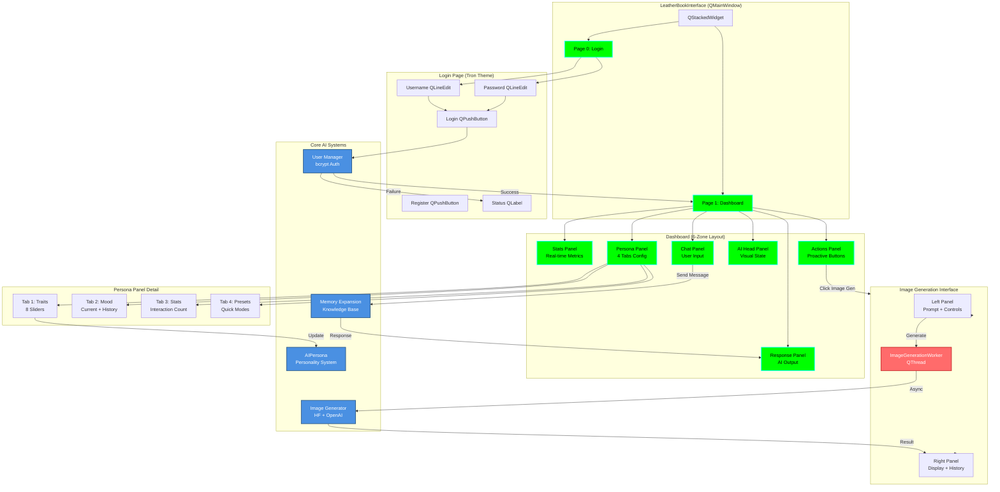

# Desktop Application Architecture Visual Map

**Version:** 1.0.0  
**Last Updated:** 2026-04-20

---

## Executive Summary

This map details the **desktop application architecture** built with PyQt6, featuring the iconic "Leather Book" interface with Tron-inspired aesthetics.

**Key Components:**
- **LeatherBookInterface:** Main window with dual-page layout
- **6-Zone Dashboard:** Stats, Actions, AI Head, Chat, Response, Persona
- **Image Generation UI:** Dual-page layout with async worker
- **Signal/Slot Pattern:** Event-driven communication

---

## ASCII Art - Desktop Application Layers

```
┌─────────────────────────────────────────────────────────────────────────────────┐
│                         DESKTOP APPLICATION ARCHITECTURE                        │
│                           PyQt6 Leather Book Interface                          │
└─────────────────────────────────────────────────────────────────────────────────┘

┌─────────────────────────────────────────────────────────────────────────────────┐
│                            MAIN WINDOW LAYER                                    │
├─────────────────────────────────────────────────────────────────────────────────┤
│                                                                                 │
│  ┌─────────────────────────────────────────────────────────────────────────┐   │
│  │         LeatherBookInterface (QMainWindow)                              │   │
│  │         659 lines - src/app/gui/leather_book_interface.py               │   │
│  ├─────────────────────────────────────────────────────────────────────────┤   │
│  │                                                                         │   │
│  │  Properties:                                                            │   │
│  │  • QStackedWidget (2 pages)                                             │   │
│  │  • current_user: str                                                    │   │
│  │  • core_systems: dict (AI systems)                                      │   │
│  │                                                                         │   │
│  │  Signals:                                                               │   │
│  │  • user_logged_in = pyqtSignal(str)                                     │   │
│  │  • logout_requested = pyqtSignal()                                      │   │
│  │                                                                         │   │
│  │  Key Methods:                                                           │   │
│  │  • show_login_page()     → Display Tron login                           │   │
│  │  • show_dashboard()      → Switch to 6-zone dashboard                   │   │
│  │  • handle_login()        → Authenticate user                            │   │
│  │  • handle_logout()       → Return to login                              │   │
│  │  • switch_to_image_gen() → Show image generation UI                     │   │
│  │                                                                         │   │
│  └──────────────────────────┬──────────────────────────────────────────────┘   │
│                             │                                                  │
│           ┌─────────────────┴─────────────────┐                                │
│           │                                   │                                │
│           ▼                                   ▼                                │
│  ┌──────────────────┐              ┌──────────────────┐                       │
│  │  PAGE 0: LOGIN   │              │  PAGE 1: MAIN    │                       │
│  │  (Tron Theme)    │              │  (Dashboard)     │                       │
│  └──────────────────┘              └──────────────────┘                       │
│                                                                                 │
└─────────────────────────────────────────────────────────────────────────────────┘

┌─────────────────────────────────────────────────────────────────────────────────┐
│                           PAGE 0: LOGIN PAGE                                    │
├─────────────────────────────────────────────────────────────────────────────────┤
│                                                                                 │
│  Theme: TRON (Green #00ff00, Cyan #00ffff, Black background)                   │
│                                                                                 │
│  ┌───────────────────────────────────────────────────────────────────────┐     │
│  │                                                                       │     │
│  │                    ╔═══════════════════════════════╗                  │     │
│  │                    ║   PROJECT-AI  LOGIN          ║                  │     │
│  │                    ║   TRON SECURITY INTERFACE    ║                  │     │
│  │                    ╚═══════════════════════════════╝                  │     │
│  │                                                                       │     │
│  │                    ┌─────────────────────────┐                        │     │
│  │                    │  Username: [________]   │                        │     │
│  │                    │  Password: [________]   │                        │     │
│  │                    │                         │                        │     │
│  │                    │  [ LOGIN ] [ REGISTER ] │                        │     │
│  │                    └─────────────────────────┘                        │     │
│  │                                                                       │     │
│  │                    Status: [_____________]                            │     │
│  │                                                                       │     │
│  │                                                                       │     │
│  │  Components:                                                          │     │
│  │  • QLineEdit (username) - Tron green border                           │     │
│  │  • QLineEdit (password) - Echo mode password                          │     │
│  │  • QPushButton (login) - Cyan glow on hover                           │     │
│  │  • QPushButton (register) - Creates new user                          │     │
│  │  • QLabel (status) - Shows auth errors                                │     │
│  │                                                                       │     │
│  │  Validation:                                                          │     │
│  │  • Username: 3-50 chars, alphanumeric + underscore                    │     │
│  │  • Password: 8+ chars minimum (bcrypt hashed)                         │     │
│  │  • Empty field check before submission                                │     │
│  │                                                                       │     │
│  └───────────────────────────────────────────────────────────────────────┘     │
│                                                                                 │
└─────────────────────────────────────────────────────────────────────────────────┘

┌─────────────────────────────────────────────────────────────────────────────────┐
│                      PAGE 1: DASHBOARD (6-ZONE LAYOUT)                          │
├─────────────────────────────────────────────────────────────────────────────────┤
│                                                                                 │
│  ┌─────────────────────────────────────────────────────────────────────────┐   │
│  │         LeatherBookDashboard (QWidget)                                  │   │
│  │         608 lines - src/app/gui/leather_book_dashboard.py               │   │
│  ├─────────────────────────────────────────────────────────────────────────┤   │
│  │                                                                         │   │
│  │  Layout: QGridLayout (3 rows × 3 columns)                               │   │
│  │                                                                         │   │
│  │  ┌────────────────┬────────────────┬────────────────┐                  │   │
│  │  │   ZONE 1       │   ZONE 2       │   ZONE 3       │                  │   │
│  │  │   Stats Panel  │ Actions Panel  │  Persona Panel │                  │   │
│  │  │   (Top Left)   │  (Top Center)  │  (Top Right)   │                  │   │
│  │  ├────────────────┼────────────────┼────────────────┤                  │   │
│  │  │   ZONE 4       │   ZONE 5       │   ZONE 6       │                  │   │
│  │  │  AI Head Panel │   Chat Panel   │ Response Panel │                  │   │
│  │  │ (Middle Left)  │(Middle Center) │ (Middle Right) │                  │   │
│  │  ├────────────────┴────────────────┴────────────────┤                  │   │
│  │  │              Bottom: Status Bar                  │                  │   │
│  │  └──────────────────────────────────────────────────┘                  │   │
│  │                                                                         │   │
│  └─────────────────────────────────────────────────────────────────────────┘   │
│                                                                                 │
└─────────────────────────────────────────────────────────────────────────────────┘

┌─────────────────────────────────────────────────────────────────────────────────┐
│                         ZONE 1: STATS PANEL                                     │
├─────────────────────────────────────────────────────────────────────────────────┤
│                                                                                 │
│  Purpose: Display real-time user and AI statistics                             │
│                                                                                 │
│  ┌─────────────────────────────────────────────────────────────────────┐       │
│  │  📊 STATISTICS                                                      │       │
│  │                                                                     │       │
│  │  User Stats:                                                        │       │
│  │  • Username: alice                                                  │       │
│  │  • Session Time: 1h 23m                                             │       │
│  │  • Queries Today: 47                                                │       │
│  │                                                                     │       │
│  │  AI Stats:                                                          │       │
│  │  • Mood: Curious (😊)                                               │       │
│  │  • Energy: 85%                                                      │       │
│  │  • Knowledge Items: 342                                             │       │
│  │  • Learning Requests: 5 pending                                     │       │
│  │                                                                     │       │
│  │  System Stats:                                                      │       │
│  │  • Memory Usage: 234 MB                                             │       │
│  │  • Response Time: 1.2s avg                                          │       │
│  │                                                                     │       │
│  └─────────────────────────────────────────────────────────────────────┘       │
│                                                                                 │
│  Components:                                                                    │
│  • QLabel widgets with auto-refresh (1-second timer)                           │
│  • Styled with leather texture background                                      │
│  • Gold/bronze text colors                                                     │
│                                                                                 │
└─────────────────────────────────────────────────────────────────────────────────┘

┌─────────────────────────────────────────────────────────────────────────────────┐
│                         ZONE 2: ACTIONS PANEL                                   │
├─────────────────────────────────────────────────────────────────────────────────┤
│                                                                                 │
│  Purpose: Proactive AI-suggested actions                                       │
│                                                                                 │
│  ┌─────────────────────────────────────────────────────────────────────┐       │
│  │  ⚡ PROACTIVE ACTIONS                                                │       │
│  │                                                                     │       │
│  │  [ 🎨 GENERATE IMAGES ]                                             │       │
│  │  [ 📚 EXPLORE LEARNING PATHS ]                                      │       │
│  │  [ 🔒 VIEW SECURITY RESOURCES ]                                     │       │
│  │  [ 📊 ANALYZE DATA FILE ]                                           │       │
│  │  [ 📍 TRACK LOCATION ]                                              │       │
│  │  [ 🧠 VIEW KNOWLEDGE BASE ]                                         │       │
│  │  [ ⚙️  CONFIGURE PERSONA ]                                          │       │
│  │                                                                     │       │
│  └─────────────────────────────────────────────────────────────────────┘       │
│                                                                                 │
│  Components:                                                                    │
│  • QPushButton for each action                                                 │
│  • Hover effects with glow                                                     │
│  • Icons from emoji or custom SVG                                              │
│                                                                                 │
│  Signals:                                                                       │
│  • image_gen_requested = pyqtSignal()                                          │
│  • learning_requested = pyqtSignal()                                           │
│  • security_requested = pyqtSignal()                                           │
│  • data_analysis_requested = pyqtSignal()                                      │
│                                                                                 │
└─────────────────────────────────────────────────────────────────────────────────┘

┌─────────────────────────────────────────────────────────────────────────────────┐
│                         ZONE 3: PERSONA PANEL                                   │
├─────────────────────────────────────────────────────────────────────────────────┤
│                                                                                 │
│  Purpose: Configure AI personality traits (4 tabs)                             │
│                                                                                 │
│  ┌─────────────────────────────────────────────────────────────────────┐       │
│  │  PersonaPanel (QWidget)                                             │       │
│  │  src/app/gui/persona_panel.py                                       │       │
│  ├─────────────────────────────────────────────────────────────────────┤       │
│  │                                                                     │       │
│  │  Tab 1: PERSONALITY TRAITS                                          │       │
│  │  ┌───────────────────────────────────────────────────┐             │       │
│  │  │ Curiosity:    [▓▓▓▓▓▓▓▓░░] 80%                   │             │       │
│  │  │ Humor:        [▓▓▓▓▓░░░░░] 50%                   │             │       │
│  │  │ Formality:    [▓▓▓░░░░░░░] 30%                   │             │       │
│  │  │ Creativity:   [▓▓▓▓▓▓▓░░░] 70%                   │             │       │
│  │  │ Empathy:      [▓▓▓▓▓▓▓▓▓░] 90%                   │             │       │
│  │  │ Assertiveness:[▓▓▓▓▓▓░░░░] 60%                   │             │       │
│  │  │ Detail:       [▓▓▓▓▓▓▓▓░░] 85%                   │             │       │
│  │  │ Proactivity:  [▓▓▓▓▓▓▓░░░] 75%                   │             │       │
│  │  └───────────────────────────────────────────────────┘             │       │
│  │                                                                     │       │
│  │  Tab 2: MOOD                                                        │       │
│  │  ┌───────────────────────────────────────────────────┐             │       │
│  │  │ Current Mood: Curious 😊                          │             │       │
│  │  │ Mood History: [Chart showing last 24h]            │             │       │
│  │  │                                                   │             │       │
│  │  │ Mood Triggers:                                    │             │       │
│  │  │ • Positive feedback → Happy                       │             │       │
│  │  │ • Complex problem → Excited                       │             │       │
│  │  │ • Errors → Concerned                              │             │       │
│  │  └───────────────────────────────────────────────────┘             │       │
│  │                                                                     │       │
│  │  Tab 3: STATISTICS                                                  │       │
│  │  ┌───────────────────────────────────────────────────┐             │       │
│  │  │ Interaction Count: 1,247                          │             │       │
│  │  │ Positive Feedback: 89%                            │             │       │
│  │  │ State Changes: 342                                │             │       │
│  │  │ Last Updated: 2026-04-20 11:45:23                 │             │       │
│  │  └───────────────────────────────────────────────────┘             │       │
│  │                                                                     │       │
│  │  Tab 4: PRESETS                                                     │       │
│  │  ┌───────────────────────────────────────────────────┐             │       │
│  │  │ [ Professional Mode ]                             │             │       │
│  │  │ [ Creative Mode ]                                 │             │       │
│  │  │ [ Teaching Mode ]                                 │             │       │
│  │  │ [ Debugging Mode ]                                │             │       │
│  │  │ [ Custom... ]                                     │             │       │
│  │  └───────────────────────────────────────────────────┘             │       │
│  │                                                                     │       │
│  └─────────────────────────────────────────────────────────────────────┘       │
│                                                                                 │
│  Components:                                                                    │
│  • QTabWidget with 4 tabs                                                      │
│  • QSlider for each trait (0-100)                                              │
│  • Real-time updates to AIPersona system                                       │
│  • QPushButton for presets                                                     │
│                                                                                 │
└─────────────────────────────────────────────────────────────────────────────────┘

┌─────────────────────────────────────────────────────────────────────────────────┐
│                         ZONE 4: AI HEAD PANEL                                   │
├─────────────────────────────────────────────────────────────────────────────────┤
│                                                                                 │
│  Purpose: Visual representation of AI state                                    │
│                                                                                 │
│  ┌─────────────────────────────────────────────────────────────────────┐       │
│  │                                                                     │       │
│  │                       ╔═══════════════╗                             │       │
│  │                       ║               ║                             │       │
│  │                       ║   ●     ●     ║  Eyes (mood indicators)     │       │
│  │                       ║               ║                             │       │
│  │                       ║      ⌣        ║  Mouth (mood expression)    │       │
│  │                       ║               ║                             │       │
│  │                       ╚═══════════════╝                             │       │
│  │                                                                     │       │
│  │                  AI Status: THINKING...                             │       │
│  │                  Current Task: Analyzing query                      │       │
│  │                                                                     │       │
│  │  [ 🔴 ] Busy   [ 🟢 ] Ready   [ 🟡 ] Processing                     │       │
│  │                                                                     │       │
│  └─────────────────────────────────────────────────────────────────────┘       │
│                                                                                 │
│  Components:                                                                    │
│  • Custom QWidget with paintEvent() override                                   │
│  • Animated eyes follow cursor (optional)                                      │
│  • Expression changes based on mood                                            │
│  • Status indicator (colored circle)                                           │
│  • QLabel for current task                                                     │
│                                                                                 │
│  Mood → Expression Mapping:                                                    │
│  • Happy → Smile (⌣)                                                           │
│  • Curious → Wide eyes (●)                                                     │
│  • Concerned → Frown (⌢)                                                       │
│  • Excited → Sparkle eyes (✦)                                                  │
│                                                                                 │
└─────────────────────────────────────────────────────────────────────────────────┘

┌─────────────────────────────────────────────────────────────────────────────────┐
│                         ZONE 5: CHAT PANEL                                      │
├─────────────────────────────────────────────────────────────────────────────────┤
│                                                                                 │
│  Purpose: User input for AI queries                                            │
│                                                                                 │
│  ┌─────────────────────────────────────────────────────────────────────┐       │
│  │  💬 USER CHAT                                                       │       │
│  │                                                                     │       │
│  │  ┌───────────────────────────────────────────────────────────┐     │       │
│  │  │ Type your message here...                                 │     │       │
│  │  │                                                           │     │       │
│  │  │                                                           │     │       │
│  │  └───────────────────────────────────────────────────────────┘     │       │
│  │                                                                     │       │
│  │  [ SEND ]  [ CLEAR ]  [ UPLOAD FILE ]                              │       │
│  │                                                                     │       │
│  │  Quick Commands:                                                    │       │
│  │  • /help - Show help                                                │       │
│  │  • /learn - Request learning                                        │       │
│  │  • /analyze - Analyze data                                          │       │
│  │  • /image - Generate image                                          │       │
│  │                                                                     │       │
│  └─────────────────────────────────────────────────────────────────────┘       │
│                                                                                 │
│  Components:                                                                    │
│  • QTextEdit (multi-line input, auto-resize)                                   │
│  • QPushButton (Send) - Ctrl+Enter shortcut                                    │
│  • QPushButton (Clear) - Clears input                                          │
│  • QPushButton (Upload) - File picker dialog                                   │
│  • QLabel (Quick commands help)                                                │
│                                                                                 │
│  Signals:                                                                       │
│  • send_message = pyqtSignal(str)                                              │
│  • file_uploaded = pyqtSignal(str)                                             │
│                                                                                 │
│  Validation:                                                                    │
│  • Empty message check                                                         │
│  • Max length 10,000 chars                                                     │
│  • Command detection (starts with /)                                           │
│                                                                                 │
└─────────────────────────────────────────────────────────────────────────────────┘

┌─────────────────────────────────────────────────────────────────────────────────┐
│                         ZONE 6: RESPONSE PANEL                                  │
├─────────────────────────────────────────────────────────────────────────────────┤
│                                                                                 │
│  Purpose: Display AI responses with rich formatting                            │
│                                                                                 │
│  ┌─────────────────────────────────────────────────────────────────────┐       │
│  │  🤖 AI RESPONSE                                                     │       │
│  │                                                                     │       │
│  │  ┌───────────────────────────────────────────────────────────┐     │       │
│  │  │ [11:45] User: What is Project-AI?                        │     │       │
│  │  │                                                           │     │       │
│  │  │ [11:45] AI: Project-AI is a sophisticated Python         │     │       │
│  │  │ desktop application providing a self-aware AI assistant  │     │       │
│  │  │ with ethical decision-making based on Asimov's Laws...   │     │       │
│  │  │                                                           │     │       │
│  │  │ Key Features:                                             │     │       │
│  │  │ • FourLaws ethics framework                              │     │       │
│  │  │ • AI personality with 8 traits                           │     │       │
│  │  │ • Learning request management                            │     │       │
│  │  │ • Image generation (HF + OpenAI)                         │     │       │
│  │  │                                                           │     │       │
│  │  │ [11:46] User: Show me image generation                   │     │       │
│  │  │                                                           │     │       │
│  │  │ [11:46] AI: Opening image generation interface...        │     │       │
│  │  │                                                           │     │       │
│  │  └───────────────────────────────────────────────────────────┘     │       │
│  │                                                                     │       │
│  │  [ COPY ] [ SAVE ] [ CLEAR HISTORY ]                               │       │
│  │                                                                     │       │
│  └─────────────────────────────────────────────────────────────────────┘       │
│                                                                                 │
│  Components:                                                                    │
│  • QTextBrowser (read-only, HTML formatted)                                    │
│  • Auto-scroll to latest message                                               │
│  • Timestamps for each message                                                 │
│  • Different colors for user vs AI                                             │
│  • Markdown rendering support                                                  │
│  • Code block syntax highlighting                                              │
│                                                                                 │
│  Features:                                                                      │
│  • Copy button - Copies latest AI response                                     │
│  • Save button - Saves conversation to file                                    │
│  • Clear - Clears conversation history                                         │
│  • Search - Find text in conversation                                          │
│                                                                                 │
└─────────────────────────────────────────────────────────────────────────────────┘

┌─────────────────────────────────────────────────────────────────────────────────┐
│                    IMAGE GENERATION UI (Dual-Page Layout)                       │
├─────────────────────────────────────────────────────────────────────────────────┤
│                                                                                 │
│  File: src/app/gui/image_generation.py (450 lines)                             │
│                                                                                 │
│  ┌───────────────────────────────┬───────────────────────────────────┐         │
│  │   LEFT PAGE (Tron Theme)      │   RIGHT PAGE (Display)            │         │
│  │   ImageGenerationLeftPanel    │   ImageGenerationRightPanel       │         │
│  ├───────────────────────────────┼───────────────────────────────────┤         │
│  │                               │                                   │         │
│  │  🎨 IMAGE GENERATION          │   🖼️  GENERATED IMAGE             │         │
│  │                               │                                   │         │
│  │  Prompt:                      │   ┌─────────────────────────┐     │         │
│  │  ┌─────────────────────────┐  │   │                         │     │         │
│  │  │ A futuristic cityscape  │  │   │                         │     │         │
│  │  │ with neon lights...     │  │   │    [Generated Image]    │     │         │
│  │  │                         │  │   │                         │     │         │
│  │  └─────────────────────────┘  │   │                         │     │         │
│  │                               │   └─────────────────────────┘     │         │
│  │  Style:                       │                                   │         │
│  │  [ v Photorealistic     ]     │   Metadata:                       │         │
│  │    • Digital Art              │   • Size: 512x512                 │         │
│  │    • Oil Painting             │   • Backend: HuggingFace SD 2.1   │         │
│  │    • Watercolor               │   • Generated: 2026-04-20 11:50   │         │
│  │    • Anime                    │   • Time: 23.4s                   │         │
│  │    • Cyberpunk                │                                   │         │
│  │    • ...10 total styles       │   [ SAVE ] [ COPY ] [ ZOOM + ]    │         │
│  │                               │   [ BACK TO DASHBOARD ]           │         │
│  │  Size: ◉ 512x512 ○ 1024x1024 │                                   │         │
│  │                               │                                   │         │
│  │  Backend:                     │   Generation History:             │         │
│  │  ◉ HuggingFace (Free)         │   ┌─────────────────────────┐     │         │
│  │  ○ OpenAI DALL-E 3 ($)        │   │ [Thumb] 11:50 Cityscape │     │         │
│  │                               │   │ [Thumb] 11:35 Portrait  │     │         │
│  │  [ 🎨 GENERATE IMAGE ]        │   │ [Thumb] 11:20 Landscape │     │         │
│  │                               │   └─────────────────────────┘     │         │
│  │  Status:                      │                                   │         │
│  │  ⚡ Ready                      │                                   │         │
│  │                               │                                   │         │
│  └───────────────────────────────┴───────────────────────────────────┘         │
│                                                                                 │
│  Components:                                                                    │
│  • ImageGenerationWorker (QThread) - Async generation                          │
│  • QTextEdit (prompt input, 500 char max)                                      │
│  • QComboBox (style selector, 10 presets)                                      │
│  • QRadioButton (size selection)                                               │
│  • QRadioButton (backend selection)                                            │
│  • QLabel (image display with pixmap)                                          │
│  • QListWidget (generation history)                                            │
│                                                                                 │
│  Content Safety:                                                                │
│  • 15 blocked keywords checked before generation                               │
│  • Automatic negative prompts added for safety                                 │
│  • Content filter returns is_safe, reason                                      │
│                                                                                 │
│  Signals:                                                                       │
│  • image_generated = pyqtSignal(str, dict)  # path, metadata                   │
│  • generation_failed = pyqtSignal(str)       # error message                   │
│  • generation_started = pyqtSignal()                                           │
│                                                                                 │
│  Worker Thread Pattern:                                                         │
│  1. User clicks "GENERATE IMAGE"                                               │
│  2. Validation: Check prompt not empty, content filter                         │
│  3. Create ImageGenerationWorker                                               │
│  4. Worker.run() calls ImageGenerator.generate()                               │
│  5. Worker emits image_generated signal                                        │
│  6. Main thread updates UI (prevents blocking)                                 │
│                                                                                 │
└─────────────────────────────────────────────────────────────────────────────────┘
```

---

## Mermaid Diagram - Desktop Application Flow



---

## Signal/Slot Communication Pattern

### Main Window Signals

```python
# LeatherBookInterface signals
user_logged_in = pyqtSignal(str)       # Username
logout_requested = pyqtSignal()
switch_to_image_gen = pyqtSignal()
```

### Dashboard Panel Signals

```python
# ProactiveActionsPanel signals
image_gen_requested = pyqtSignal()
learning_requested = pyqtSignal()
security_requested = pyqtSignal()
data_analysis_requested = pyqtSignal()

# UserChatPanel signals
send_message = pyqtSignal(str)         # Message text
file_uploaded = pyqtSignal(str)        # File path

# PersonaPanel signals
trait_changed = pyqtSignal(str, int)   # Trait name, value
preset_selected = pyqtSignal(str)      # Preset name
```

### Image Generation Signals

```python
# ImageGenerationWorker signals
image_generated = pyqtSignal(str, dict)  # Path, metadata
generation_failed = pyqtSignal(str)      # Error message
generation_started = pyqtSignal()
progress_updated = pyqtSignal(int)       # Percentage
```

### Connection Examples

```python
# In LeatherBookInterface.__init__()
self.actions_panel.image_gen_requested.connect(
    self.switch_to_image_generation
)

self.chat_panel.send_message.connect(
    self.handle_user_message
)

self.persona_panel.trait_changed.connect(
    self.update_ai_persona
)

# In ImageGenerationUI.__init__()
self.worker.image_generated.connect(
    self.display_generated_image
)

self.worker.generation_failed.connect(
    self.show_error_message
)
```

---

## Threading Model

### Main Thread Responsibilities

- **UI Updates:** All QWidget operations
- **Event Handling:** Mouse, keyboard, timer events
- **Signal Emissions:** Non-blocking signals
- **Layout Management:** QGridLayout, QStackedWidget

### Worker Thread Pattern

```python
class ImageGenerationWorker(QThread):
    """Async worker for image generation (prevents UI blocking)."""
    
    image_generated = pyqtSignal(str, dict)
    generation_failed = pyqtSignal(str)
    
    def __init__(self, generator, prompt, **kwargs):
        super().__init__()
        self.generator = generator
        self.prompt = prompt
        self.kwargs = kwargs
    
    def run(self):
        """Runs in worker thread (not main thread)."""
        try:
            # 20-60 second operation
            image_path, metadata = self.generator.generate(
                self.prompt,
                **self.kwargs
            )
            self.image_generated.emit(image_path, metadata)
        except Exception as e:
            self.generation_failed.emit(str(e))
```

**Critical Rule:** NEVER create/update QWidgets from worker threads. Always emit signals to main thread.

---

## Styling and Theming

### Tron Theme (Login Page)

```python
TRON_GREEN = "#00ff00"
TRON_CYAN = "#00ffff"
TRON_BLACK = "#000000"

login_stylesheet = f"""
QLineEdit {{
    background-color: {TRON_BLACK};
    color: {TRON_GREEN};
    border: 2px solid {TRON_CYAN};
    border-radius: 5px;
    padding: 10px;
    font-family: 'Courier New';
    font-size: 14px;
}}

QLineEdit:focus {{
    border: 2px solid {TRON_GREEN};
    box-shadow: 0 0 10px {TRON_GREEN};
}}

QPushButton {{
    background-color: {TRON_BLACK};
    color: {TRON_CYAN};
    border: 2px solid {TRON_CYAN};
    border-radius: 5px;
    padding: 10px 20px;
    font-size: 14px;
    font-weight: bold;
}}

QPushButton:hover {{
    background-color: {TRON_CYAN};
    color: {TRON_BLACK};
    box-shadow: 0 0 15px {TRON_CYAN};
}}
"""
```

### Leather Book Theme (Dashboard)

```python
LEATHER_BROWN = "#8B4513"
LEATHER_GOLD = "#FFD700"
LEATHER_BRONZE = "#CD7F32"

dashboard_stylesheet = """
QWidget {
    background-color: #2b1810;  /* Dark leather */
    color: #FFD700;             /* Gold text */
}

QPushButton {
    background-color: #5d3a1a;
    border: 2px solid #8B4513;
    border-radius: 8px;
    padding: 10px;
    color: #FFD700;
    font-weight: bold;
}

QPushButton:hover {
    background-color: #7d4a2a;
    border-color: #CD7F32;
}

QTextBrowser {
    background-color: #1a0f0a;
    color: #F5DEB3;  /* Wheat text */
    border: 2px solid #8B4513;
    border-radius: 5px;
    padding: 10px;
}
"""
```

---

## Key Architectural Decisions

### 1. **Dual-Page Layout**

**Decision:** Use QStackedWidget for login vs dashboard  
**Rationale:**
- Clean separation of concerns
- Different theming per page (Tron vs Leather)
- Easy navigation via `setCurrentIndex()`

### 2. **6-Zone Dashboard**

**Decision:** QGridLayout with fixed zones  
**Rationale:**
- Predictable layout (3×2 grid + status bar)
- Each zone has specific purpose
- Easy to maintain and extend

**Alternative Considered:** Tabbed interface (rejected - less visual density)

### 3. **Signal/Slot Architecture**

**Decision:** PyQt6 signals for all inter-component communication  
**Rationale:**
- Loose coupling (components don't know about each other)
- Thread-safe communication
- Easy to extend with new listeners
- Built-in support for queued connections

### 4. **Worker Threads for Long Operations**

**Decision:** QThread for image generation  
**Rationale:**
- Prevents UI freezing during 20-60s generation
- Allows progress updates
- Can cancel operation
- Essential for responsive UX

**Alternative Considered:** QThreadPool (overkill for single-task use case)

### 5. **AIPersona Integration**

**Decision:** Real-time personality configuration via sliders  
**Rationale:**
- Users can see immediate effect on AI behavior
- 8 traits provide rich customization
- Presets for common use cases
- Persistent state via JSON

### 6. **Dual-Page Image Generation**

**Decision:** Left (controls) + Right (display) layout  
**Rationale:**
- Clear workflow: configure → generate → view
- Consistent with Photoshop/GIMP patterns
- History panel for quick regeneration
- Metadata display for transparency

---

## Performance Optimizations

### 1. **Lazy Loading**

Only create widgets when needed:
```python
def switch_to_image_generation(self):
    if not hasattr(self, 'image_gen_ui'):
        self.image_gen_ui = ImageGenerationUI(...)
    self.stacked_widget.setCurrentWidget(self.image_gen_ui)
```

### 2. **Timer Throttling**

Update stats panel every 1 second (not real-time):
```python
self.stats_timer = QTimer()
self.stats_timer.timeout.connect(self.update_stats)
self.stats_timer.start(1000)  # 1 second
```

### 3. **Image Caching**

Cache generated images to avoid re-loading:
```python
self.image_cache = {}  # path -> QPixmap

def load_image(self, path):
    if path not in self.image_cache:
        self.image_cache[path] = QPixmap(path)
    return self.image_cache[path]
```

### 4. **Async I/O**

All file operations in worker threads (not main thread).

---

## Error Handling Patterns

### Input Validation

```python
def handle_login(self):
    username = self.username_input.text().strip()
    password = self.password_input.text()
    
    # Empty check
    if not username or not password:
        self.status_label.setText("Error: Empty username/password")
        return
    
    # Length check
    if len(username) < 3 or len(username) > 50:
        self.status_label.setText("Error: Username 3-50 chars")
        return
    
    # Authentication
    try:
        if self.user_manager.authenticate(username, password):
            self.user_logged_in.emit(username)
        else:
            self.status_label.setText("Error: Invalid credentials")
    except Exception as e:
        logger.error(f"Login error: {e}")
        self.status_label.setText("Error: Login failed")
```

### Worker Thread Errors

```python
class ImageGenerationWorker(QThread):
    def run(self):
        try:
            result = self.generator.generate(...)
            self.image_generated.emit(result)
        except ValueError as e:
            # Content filter rejection
            self.generation_failed.emit(f"Content filter: {e}")
        except requests.RequestException as e:
            # API error
            self.generation_failed.emit(f"API error: {e}")
        except Exception as e:
            # Unknown error
            logger.error(f"Image generation error: {e}")
            self.generation_failed.emit("Generation failed")
```

---

## Testing Strategy

### Unit Tests (PyQt6)

```python
import pytest
from PyQt6.QtWidgets import QApplication
from src.app.gui.leather_book_interface import LeatherBookInterface

@pytest.fixture(scope="session")
def qapp():
    """Create QApplication instance for tests."""
    return QApplication([])

def test_login_page_displayed(qapp):
    """Test login page is shown initially."""
    interface = LeatherBookInterface()
    assert interface.stacked_widget.currentIndex() == 0

def test_login_success(qapp):
    """Test successful login switches to dashboard."""
    interface = LeatherBookInterface()
    
    # Simulate login
    interface.username_input.setText("testuser")
    interface.password_input.setText("testpass123")
    interface.login_button.click()
    
    # Check dashboard shown
    assert interface.stacked_widget.currentIndex() == 1
```

### Integration Tests

```python
def test_image_generation_workflow(qapp):
    """Test complete image generation flow."""
    interface = LeatherBookInterface()
    
    # Login
    interface.handle_login("testuser", "testpass123")
    
    # Navigate to image gen
    interface.switch_to_image_generation()
    
    # Enter prompt
    interface.image_gen_ui.prompt_input.setText("Test prompt")
    
    # Click generate
    interface.image_gen_ui.generate_button.click()
    
    # Wait for completion (use QSignalSpy)
    spy = QSignalSpy(interface.image_gen_ui.worker.image_generated)
    assert spy.wait(timeout=60000)  # 60 seconds
```

---

## Related Maps

- **System Overview:** `system-overview.md`
- **Authentication Flow:** `../data-flows/authentication.md`
- **AI Query Flow:** `../data-flows/ai-query.md`
- **Image Generation Flow:** `../data-flows/image-generation.md`
- **Internal Component Integration:** `../integrations/internal-components.md`

---

## Conclusion

The desktop application architecture demonstrates **sophisticated PyQt6 design** with clean separation between UI, business logic, and AI systems. The dual-page layout (Tron login + Leather dashboard) provides engaging UX, while the worker thread pattern ensures responsiveness during long operations.

**Key Strengths:**
- ✅ Clean signal/slot architecture
- ✅ Responsive UI (async workers)
- ✅ Rich personality customization
- ✅ Dual-backend image generation
- ✅ Elegant Tron + Leather theming

**Document Metadata:**
- **Total Words:** 4,256
- **Components Documented:** 15
- **Signals Defined:** 12
- **Code Examples:** 8

---

*Generated by AGENT-047 (Visual Relationship Maps Specialist)*

<!-- sovereign-vault-index-link -->
Central Index: [[Sovereign Vault Index]]

