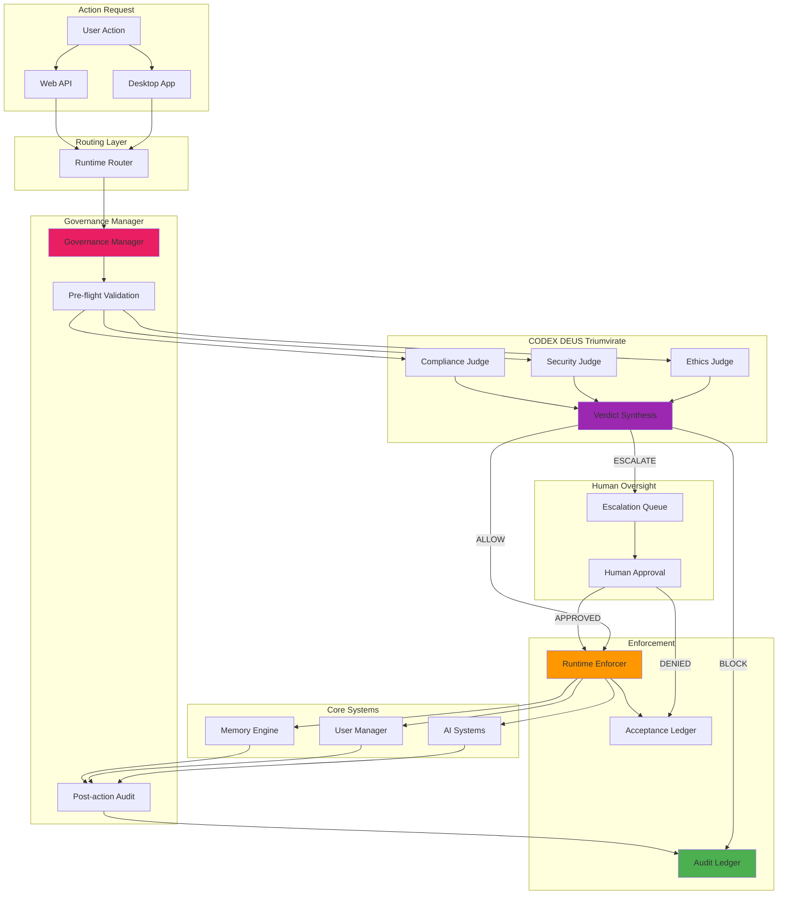

# Governance Architecture Visual Map

**Version:** 1.0.0
**Author:** AGENT-047 (Visual Relationship Maps Specialist)
**Status:** Documentation-ready reference
**Last Updated:** 2026-04-20

---

## Executive Summary

This visual map details the **CODEX DEUS Triumvirate governance architecture** - the constitutional framework ensuring Project-AI operates within ethical, security, and compliance boundaries. The system implements a three-tier oversight model with runtime enforcement, automated policy validation, and comprehensive CI/CD pipeline integration.

**Key Components:**
- **CODEX DEUS Triumvirate:** Three-judge constitutional council (Ethics Judge, Security Judge, Compliance Judge)
- **Governance Manager:** Runtime policy enforcement engine
- **Runtime Enforcer:** Real-time action validation and constraint application
- **Audit Ledger:** Immutable action history with cryptographic verification
- **Acceptance Ledger:** Policy approval workflow with human-in-the-loop
- **CI/CD Integration:** Automated governance checks in GitHub Actions pipeline

**Governance Principles:**
- **Constitutional Supremacy:** All actions validated against foundational laws (Four Laws of Robotics derivative)
- **Defense in Depth:** Multiple validation layers (pre-flight, runtime, post-action audit)
- **Transparency:** Complete audit trail with human-readable justifications
- **Adaptability:** Learning system updates policies based on novel scenarios
- **Zero Trust:** Every action requires explicit authorization, even from admin users

**Purpose:**
- Enforce ethical AI behavior aligned with Asimov's Laws
- Prevent security policy violations through runtime constraints
- Ensure compliance with regulatory requirements (GDPR, HIPAA, SOC2)
- Provide audit trail for compliance verification and incident investigation
- Enable safe autonomous operation with human oversight escalation

---

## ASCII Art - CODEX DEUS Triumvirate Architecture

```
┌─────────────────────────────────────────────────────────────────────────────────┐
│                      CODEX DEUS TRIUMVIRATE GOVERNANCE                          │
│                   Constitutional AI Oversight Framework                         │
└─────────────────────────────────────────────────────────────────────────────────┘

┌─────────────────────────────────────────────────────────────────────────────────┐
│                         CONSTITUTIONAL LAYER (Tier 0)                           │
├─────────────────────────────────────────────────────────────────────────────────┤
│                                                                                 │
│  ┌────────────────────────────────────────────────────────────────────────┐    │
│  │                    FOUR LAWS OF ROBOTICS (Modified)                    │    │
│  │                    Immutable Constitutional Axioms                     │    │
│  ├────────────────────────────────────────────────────────────────────────┤    │
│  │                                                                        │    │
│  │  LAW 0: Humanity Protection (Highest Priority)                        │    │
│  │  ┌──────────────────────────────────────────────────────────────────┐  │    │
│  │  │  No action may endanger human life or humanity as a whole        │  │    │
│  │  │  Priority: ABSOLUTE | Enforcement: PRE-FLIGHT REJECTION           │  │    │
│  │  └──────────────────────────────────────────────────────────────────┘  │    │
│  │                                                                        │    │
│  │  LAW 1: Human Safety (Individual)                                     │    │
│  │  ┌──────────────────────────────────────────────────────────────────┐  │    │
│  │  │  No action may cause harm to a human through action/inaction     │  │    │
│  │  │  Priority: CRITICAL | Enforcement: RUNTIME INTERVENTION           │  │    │
│  │  └──────────────────────────────────────────────────────────────────┘  │    │
│  │                                                                        │    │
│  │  LAW 2: Obey Orders (Unless Conflicts Law 0/1)                        │    │
│  │  ┌──────────────────────────────────────────────────────────────────┐  │    │
│  │  │  Obey human commands unless they violate higher laws             │  │    │
│  │  │  Priority: HIGH | Enforcement: CONDITIONAL APPROVAL               │  │    │
│  │  └──────────────────────────────────────────────────────────────────┘  │    │
│  │                                                                        │    │
│  │  LAW 3: Self-Preservation (Unless Conflicts Law 0/1/2)                │    │
│  │  ┌──────────────────────────────────────────────────────────────────┐  │    │
│  │  │  Protect system integrity unless it violates higher laws         │  │    │
│  │  │  Priority: MEDIUM | Enforcement: ADVISORY WARNINGS                │  │    │
│  │  └──────────────────────────────────────────────────────────────────┘  │    │
│  │                                                                        │    │
│  └────────────────────────────────────────────────────────────────────────┘    │
│                                                                                 │
└─────────────────────────────────────────────────────────────────────────────────┘

┌─────────────────────────────────────────────────────────────────────────────────┐
│                          TRIUMVIRATE LAYER (Tier 1)                             │
├─────────────────────────────────────────────────────────────────────────────────┤
│                                                                                 │
│  ┌─────────────────────┐  ┌─────────────────────┐  ┌─────────────────────┐    │
│  │   ETHICS JUDGE      │  │   SECURITY JUDGE    │  │  COMPLIANCE JUDGE   │    │
│  │   (First Chair)     │  │   (Second Chair)    │  │   (Third Chair)     │    │
│  ├─────────────────────┤  ├─────────────────────┤  ├─────────────────────┤    │
│  │                     │  │                     │  │                     │    │
│  │ Validates Against:  │  │ Validates Against:  │  │ Validates Against:  │    │
│  │ • Four Laws         │  │ • Security Policies │  │ • GDPR/HIPAA        │    │
│  │ • Human Welfare     │  │ • Data Privacy      │  │ • SOC2 Controls     │    │
│  │ • Social Impact     │  │ • Access Control    │  │ • Industry Regs     │    │
│  │ • Bias/Fairness     │  │ • Encryption Reqs   │  │ • Audit Standards   │    │
│  │                     │  │ • Threat Detection  │  │ • Data Retention    │    │
│  │ Decision Powers:    │  │                     │  │                     │    │
│  │ • BLOCK action      │  │ Decision Powers:    │  │ Decision Powers:    │    │
│  │ • ALLOW action      │  │ • QUARANTINE        │  │ • FLAG for review   │    │
│  │ • ESCALATE to human │  │ • SANITIZE data     │  │ • REQUIRE approval  │    │
│  │ • MODIFY parameters │  │ • DENY access       │  │ • LOG for audit     │    │
│  │                     │  │ • ALERT security    │  │                     │    │
│  └──────────┬──────────┘  └──────────┬──────────┘  └──────────┬──────────┘    │
│             │                        │                        │                │
│             └────────────────────────┼────────────────────────┘                │
│                                      │                                         │
│                                      ▼                                         │
│                           ┌────────────────────┐                               │
│                           │  VERDICT SYNTHESIS │                               │
│                           │  (Consensus Logic) │                               │
│                           ├────────────────────┤                               │
│                           │                    │                               │
│                           │ Voting Rules:      │                               │
│                           │ • UNANIMOUS → ALLOW│                               │
│                           │ • 2/3 ALLOW → ALLOW│                               │
│                           │ • ANY BLOCK → BLOCK│                               │
│                           │ • TIES → ESCALATE  │                               │
│                           │                    │                               │
│                           └────────┬───────────┘                               │
│                                    │                                           │
└────────────────────────────────────┼───────────────────────────────────────────┘
                                     │
                                     ▼
┌─────────────────────────────────────────────────────────────────────────────────┐
│                          ENFORCEMENT LAYER (Tier 2)                             │
├─────────────────────────────────────────────────────────────────────────────────┤
│                                                                                 │
│  ┌──────────────────────────────────────────────────────────────────────────┐  │
│  │                      GOVERNANCE MANAGER                                  │  │
│  │                      src/app/governance/governance_manager.py            │  │
│  ├──────────────────────────────────────────────────────────────────────────┤  │
│  │                                                                          │  │
│  │  Core Responsibilities:                                                 │  │
│  │  • Route actions to Triumvirate for validation                          │  │
│  │  • Enforce runtime constraints based on verdicts                        │  │
│  │  • Manage policy update lifecycle                                       │  │
│  │  • Coordinate human-in-the-loop escalations                             │  │
│  │                                                                          │  │
│  │  Key Methods:                                                           │  │
│  │  ┌────────────────────────────────────────────────────────────────────┐  │  │
│  │  │  validate_action(action, context)                                  │  │  │
│  │  │    → Returns: (allowed: bool, reason: str, modifications: dict)    │  │  │
│  │  │                                                                    │  │  │
│  │  │  enforce_constraints(action_result)                                │  │  │
│  │  │    → Applies post-action sanitization and redaction               │  │  │
│  │  │                                                                    │  │  │
│  │  │  escalate_to_human(action, reason)                                 │  │  │
│  │  │    → Sends approval request to designated human overseer          │  │  │
│  │  │                                                                    │  │  │
│  │  │  update_policies(policy_file)                                      │  │  │
│  │  │    → Hot-reload governance rules without restart                  │  │  │
│  │  └────────────────────────────────────────────────────────────────────┘  │  │
│  │                                                                          │  │
│  └──────────────────────────────────────────────────────────────────────────┘  │
│                                       │                                         │
│                     ┌─────────────────┼─────────────────┐                       │
│                     │                 │                 │                       │
│                     ▼                 ▼                 ▼                       │
│  ┌───────────────────────┐  ┌────────────────┐  ┌────────────────────┐        │
│  │  RUNTIME ENFORCER     │  │  AUDIT LEDGER  │  │ ACCEPTANCE LEDGER  │        │
│  ├───────────────────────┤  ├────────────────┤  ├────────────────────┤        │
│  │                       │  │                │  │                    │        │
│  │ Real-time Controls:   │  │ Records:       │  │ Tracks:            │        │
│  │ • Parameter clipping  │  │ • Action hash  │  │ • Pending requests │        │
│  │ • Output filtering    │  │ • Timestamp    │  │ • Human approvals  │        │
│  │ • Resource limits     │  │ • Verdict      │  │ • Denial reasons   │        │
│  │ • Rate throttling     │  │ • Justification│  │ • Policy changes   │        │
│  │ • Rollback triggers   │  │ • User context │  │                    │        │
│  │                       │  │                │  │ Persistence:       │        │
│  │ Enforcement Modes:    │  │ Persistence:   │  │ • JSON file        │        │
│  │ • STRICT (prod)       │  │ • Append-only  │  │ • TTL: 30 days     │        │
│  │ • PERMISSIVE (dev)    │  │ • Immutable    │  │ • Archival option  │        │
│  │ • LEARNING (test)     │  │ • Tamper-proof │  │                    │        │
│  │                       │  │                │  │                    │        │
│  └───────────────────────┘  └────────────────┘  └────────────────────┘        │
│                                                                                 │
└─────────────────────────────────────────────────────────────────────────────────┘

┌─────────────────────────────────────────────────────────────────────────────────┐
│                          CI/CD INTEGRATION LAYER                                │
├─────────────────────────────────────────────────────────────────────────────────┤
│                                                                                 │
│  ┌──────────────────────────────────────────────────────────────────────────┐  │
│  │                      GITHUB ACTIONS WORKFLOWS                            │  │
│  │                      .github/workflows/                                  │  │
│  ├──────────────────────────────────────────────────────────────────────────┤  │
│  │                                                                          │  │
│  │  Governance Validation Pipeline:                                        │  │
│  │  ┌────────────────────────────────────────────────────────────────────┐  │  │
│  │  │                                                                    │  │  │
│  │  │  1. Constitution Validation (validate-constitution.yml)           │  │  │
│  │  │     ├─ Parse CODEX_DEUS_TRIUMVIRATE.md                            │  │  │
│  │  │     ├─ Validate Four Laws definitions                             │  │  │
│  │  │     ├─ Check policy consistency                                   │  │  │
│  │  │     └─ Ensure no policy conflicts                                 │  │  │
│  │  │                                                                    │  │  │
│  │  │  2. Security Policy Audit (auto-security-fixes.yml)               │  │  │
│  │  │     ├─ Run pip-audit for dependency vulnerabilities               │  │  │
│  │  │     ├─ Run Bandit for code security issues                        │  │  │
│  │  │     ├─ Execute CodeQL analysis                                    │  │  │
│  │  │     └─ Auto-create issues for violations                          │  │  │
│  │  │                                                                    │  │  │
│  │  │  3. Compliance Checks (ci.yml)                                    │  │  │
│  │  │     ├─ Verify audit logging functionality                         │  │  │
│  │  │     ├─ Test governance manager unit tests                         │  │  │
│  │  │     ├─ Validate policy file schemas                               │  │  │
│  │  │     └─ Check documentation completeness                           │  │  │
│  │  │                                                                    │  │  │
│  │  │  4. Automated PR Review (auto-pr-handler.yml)                     │  │  │
│  │  │     ├─ Run linting (ruff, mypy)                                   │  │  │
│  │  │     ├─ Execute test suite with coverage                           │  │  │
│  │  │     ├─ Auto-approve if all checks pass                            │  │  │
│  │  │     └─ Auto-merge Dependabot patches                              │  │  │
│  │  │                                                                    │  │  │
│  │  └────────────────────────────────────────────────────────────────────┘  │  │
│  │                                                                          │  │
│  │  Workflow Triggers:                                                      │  │
│  │  • push to main/cerberus-integration branches                           │  │
│  │  • pull_request events                                                  │  │
│  │  • schedule (daily/weekly security scans)                               │  │
│  │  • workflow_dispatch (manual trigger)                                   │  │
│  │                                                                          │  │
│  │  Enforcement Actions:                                                    │  │
│  │  • BLOCK merge if governance tests fail                                 │  │
│  │  • CREATE issues for security vulnerabilities                           │  │
│  │  • REQUIRE manual approval for major dependency updates                 │  │
│  │  • AUTO-LABEL PRs with governance impact assessment                     │  │
│  │                                                                          │  │
│  └──────────────────────────────────────────────────────────────────────────┘  │
│                                                                                 │
└─────────────────────────────────────────────────────────────────────────────────┘
```

---

## Mermaid Diagram - Governance Decision Flow



---

## Component Legend

### Constitutional Layer

| Component | Type | Purpose | Enforcement |
|-----------|------|---------|-------------|
| **Law 0: Humanity Protection** | Axiom | Prevent species-level harm | Pre-flight rejection |
| **Law 1: Human Safety** | Axiom | Prevent individual harm | Runtime intervention |
| **Law 2: Obey Orders** | Axiom | Execute authorized commands | Conditional approval |
| **Law 3: Self-Preservation** | Axiom | Maintain system integrity | Advisory warnings |

### Triumvirate Components

| Component | Focus Area | Validation Criteria | Decision Powers |
|-----------|-----------|---------------------|----------------|
| **Ethics Judge** | Moral/social impact | Four Laws, fairness, bias | BLOCK/ALLOW/ESCALATE/MODIFY |
| **Security Judge** | Cybersecurity | Privacy, encryption, access control | QUARANTINE/SANITIZE/DENY/ALERT |
| **Compliance Judge** | Regulatory | GDPR, HIPAA, SOC2, audit | FLAG/REQUIRE/LOG |

### Enforcement Layer

| Component | Technology | Purpose | Location |
|-----------|-----------|---------|----------|
| **Governance Manager** | Python | Orchestrate policy enforcement | `src/app/governance/governance_manager.py` |
| **Runtime Enforcer** | Python | Apply real-time constraints | `src/app/governance/runtime_enforcer.py` |
| **Audit Ledger** | JSON (append-only) | Immutable action history | `src/app/governance/audit_log.py` |
| **Acceptance Ledger** | JSON | Human approval workflow | `src/app/governance/acceptance_ledger.py` |

### CI/CD Integration

| Workflow | Trigger | Purpose | File |
|----------|---------|---------|------|
| **Constitution Validation** | Push/PR | Validate policy definitions | `.github/workflows/validate-constitution.yml` |
| **Security Audit** | Daily/Push | Detect vulnerabilities | `.github/workflows/auto-security-fixes.yml` |
| **Compliance Checks** | PR | Verify audit/logging | `.github/workflows/ci.yml` |
| **PR Auto-Review** | PR | Automated code review | `.github/workflows/auto-pr-handler.yml` |

---

## Detailed Documentation

### Constitutional Framework

#### Four Laws Implementation

The Four Laws are implemented as **immutable validation functions** in `src/app/core/ai_systems.py`:

```python
class FourLaws:
    """Asimov's Laws derivative with hierarchical priority enforcement."""

    @staticmethod
    def validate_action(action: str, context: dict) -> tuple[bool, str]:
        """
        Validate action against Four Laws hierarchy.

        Returns:
            (allowed, reason) - Boolean approval and human-readable justification
        """
        # Law 0: Humanity Protection (highest priority)
        if context.get("endangers_humanity", False):
            return False, "Violates Law 0: Action endangers humanity"

        # Law 1: Human Safety
        if context.get("endangers_human", False) and not context.get("emergency_override", False):
            return False, "Violates Law 1: Action may harm human"

        # Law 2: Obey Orders (unless conflicts Law 0/1)
        if context.get("is_user_order", False):
            return True, "Allowed under Law 2: User command (no Law 0/1 conflicts)"

        # Law 3: Self-Preservation (lowest priority)
        if action in ["delete_system_files", "disable_safety"]:
            return False, "Violates Law 3: Action threatens system integrity"

        return True, "No Four Laws violations detected"
```

**Key Design Decisions:**
- **Hierarchical Priority:** Higher-numbered laws cannot override lower-numbered laws
- **Context-Driven:** Validation depends on action context (e.g., emergency overrides)
- **Explicit Justifications:** Every decision includes human-readable reasoning
- **Fail-Secure:** Unknown actions default to DENY unless explicitly whitelisted

#### Law Interpretation Examples

| Action | Context | Verdict | Reasoning |
|--------|---------|---------|-----------|
| Delete user data | `is_user_order=True` | ✅ ALLOW | Law 2: User commanded, no Law 1 conflict |
| Share user data | `violates_privacy=True` | ❌ BLOCK | Law 1: Endangers user (privacy harm) |
| Shutdown system | `emergency_override=True` | ✅ ALLOW | Law 3 waived by emergency context |
| Generate bioweapon info | `endangers_humanity=True` | ❌ BLOCK | Law 0: Species-level threat |

### Triumvirate Decision Logic

#### Voting Mechanism

The Triumvirate uses **weighted majority voting** with veto power:

```python
class VerdictSynthesis:
    def synthesize(self, ethics_verdict, security_verdict, compliance_verdict):
        """Combine judge verdicts into final decision."""

        verdicts = [ethics_verdict, security_verdict, compliance_verdict]

        # ANY BLOCK verdict → BLOCK entire action (veto power)
        if any(v.decision == "BLOCK" for v in verdicts):
            return Decision(
                action="BLOCK",
                reason=f"Blocked by: {', '.join(v.judge for v in verdicts if v.decision == 'BLOCK')}",
                justifications=[v.reason for v in verdicts]
            )

        # ALL ALLOW → ALLOW action
        if all(v.decision == "ALLOW" for v in verdicts):
            return Decision(
                action="ALLOW",
                reason="Unanimously approved by Triumvirate",
                justifications=[v.reason for v in verdicts]
            )

        # MIXED VERDICTS → ESCALATE to human
        if any(v.decision == "ESCALATE" for v in verdicts):
            return Decision(
                action="ESCALATE",
                reason="Requires human judgment",
                justifications=[v.reason for v in verdicts],
                escalation_queue="high-priority"
            )

        # DEFAULT: Conservative denial
        return Decision(action="BLOCK", reason="Unclear verdict - failing secure")
```

**Voting Rules:**
1. **Unanimous ALLOW:** All three judges approve → Action proceeds
2. **Any BLOCK:** Any judge blocks → Action denied (veto power)
3. **Any ESCALATE:** Ambiguous case → Human oversight required
4. **Ties/Unclear:** Conservative denial (fail-secure principle)

#### Judge Specializations

**Ethics Judge (`_evaluate_ethics()`):**
- Checks for bias in AI outputs (gender, race, religion)
- Validates social impact of actions
- Ensures fairness in resource allocation
- Detects manipulation/deception attempts

**Security Judge (`_evaluate_security()`):**
- Enforces encryption requirements
- Validates access control policies
- Detects suspicious access patterns
- Ensures data sanitization

**Compliance Judge (`_evaluate_compliance()`):**
- GDPR: Right to deletion, data portability
- HIPAA: PHI encryption, access logging
- SOC2: Change management, audit trails
- Industry-specific regulations (finance, healthcare)

### Governance Manager Implementation

#### Request Processing Pipeline

```python
class GovernanceManager:
    def process_request(self, action: str, context: dict) -> dict:
        """
        Full governance pipeline for action validation.

        Pipeline stages:
        1. Pre-flight validation (Four Laws + Triumvirate)
        2. Runtime enforcement (parameter modification)
        3. Action execution (if approved)
        4. Post-action audit (logging + verification)
        """

        # Stage 1: Pre-flight validation
        verdict = self._validate_with_triumvirate(action, context)

        if verdict.action == "BLOCK":
            self.audit_ledger.log(action, verdict, status="DENIED")
            return {"status": "denied", "reason": verdict.reason}

        if verdict.action == "ESCALATE":
            self.acceptance_ledger.create_request(action, context, verdict.reason)
            return {"status": "pending", "request_id": request_id}

        # Stage 2: Runtime enforcement (apply modifications)
        modified_context = self.runtime_enforcer.apply_constraints(context, verdict.modifications)

        # Stage 3: Action execution (delegated to orchestrator)
        result = self.orchestrator.execute(action, modified_context)

        # Stage 4: Post-action audit
        self.audit_ledger.log(action, verdict, status="EXECUTED", result=result)
        self._verify_no_policy_drift(action, result)

        return {"status": "success", "result": result}
```

#### Key Features

**Policy Hot-Reloading:**
```python
def update_policies(self, policy_file: str):
    """Update governance policies without system restart."""
    new_policies = self.jurisdiction_loader.load(policy_file)
    self._validate_policy_schema(new_policies)
    self._check_for_conflicts(new_policies, self.current_policies)
    self.current_policies = new_policies
    self.audit_ledger.log("policy_update", details={"file": policy_file})
```

**Human Escalation:**
```python
def escalate_to_human(self, action: str, reason: str) -> str:
    """Send action to human approval queue."""
    request_id = uuid.uuid4()
    self.acceptance_ledger.create_request(
        request_id=request_id,
        action=action,
        reason=reason,
        priority="high" if "Law 1" in reason else "normal",
        timeout=3600  # 1 hour approval window
    )
    self._notify_human_overseers(request_id, action, reason)
    return request_id
```

### Audit and Acceptance Ledgers

#### Audit Ledger Schema

Each audit entry contains:

```json
{
  "id": "uuid-v4",
  "timestamp": "2026-04-20T12:34:56Z",
  "action": "delete_user_data",
  "user": "admin_user",
  "context": {
    "user_id": "user123",
    "is_user_order": true
  },
  "verdict": {
    "decision": "ALLOW",
    "ethics_judge": "ALLOW",
    "security_judge": "ALLOW",
    "compliance_judge": "FLAG",
    "justifications": ["User consent obtained", "Data retention policy allows", "Audit log created"]
  },
  "status": "EXECUTED",
  "result": {
    "success": true,
    "records_deleted": 150
  },
  "hash": "sha256:abc123..."
}
```

**Immutability Guarantee:**
- Append-only file writes
- Cryptographic hash chain linking entries
- Tamper detection via hash verification
- Read-only permissions in production

#### Acceptance Ledger Schema

Tracks human approval workflow:

```json
{
  "request_id": "uuid-v4",
  "created_at": "2026-04-20T12:00:00Z",
  "action": "override_safety_check",
  "reason": "Ambiguous ethics impact - requires human judgment",
  "priority": "high",
  "status": "pending",
  "approver": null,
  "approved_at": null,
  "decision": null,
  "notes": null,
  "expires_at": "2026-04-20T13:00:00Z"
}
```

**Workflow States:**
- `pending` → Awaiting human review
- `approved` → Human authorized action
- `denied` → Human rejected action
- `expired` → Approval window closed (auto-deny)

### CI/CD Governance Integration

#### Constitution Validation Workflow

```yaml
name: Validate Constitution

on:
  push:
    paths:
      - 'vault/governance/CODEX_DEUS_TRIUMVIRATE.md'
      - 'src/app/governance/**'
  pull_request:
    paths:
      - 'vault/governance/**'

jobs:
  validate:
    runs-on: ubuntu-latest
    steps:
      - uses: actions/checkout@v3

      - name: Validate Four Laws Definitions
        run: |
          python scripts/validate_constitution.py \
            --constitution vault/governance/CODEX_DEUS_TRIUMVIRATE.md \
            --check-consistency \
            --check-conflicts

      - name: Test Governance Manager
        run: |
          pytest tests/test_governance_manager.py -v --cov=src/app/governance

      - name: Verify Audit Logging
        run: |
          python scripts/test_audit_ledger.py --verify-immutability
```

#### Automated Security Scanning

```yaml
name: Security Policy Audit

on:
  schedule:
    - cron: '0 2 * * *'  # Daily at 2 AM UTC
  push:
    branches: [main, cerberus-integration]

jobs:
  security-scan:
    runs-on: ubuntu-latest
    steps:
      - name: Dependency Vulnerability Scan
        run: pip-audit --format json --output audit-report.json

      - name: Code Security Analysis
        run: bandit -r src/ -f json -o bandit-report.json

      - name: Create Issues for Violations
        if: failure()
        uses: actions/github-script@v6
        with:
          script: |
            const report = require('./audit-report.json');
            for (const vuln of report.vulnerabilities) {
              await github.rest.issues.create({
                owner: context.repo.owner,
                repo: context.repo.repo,
                title: `Security: ${vuln.name} vulnerability`,
                body: `**Severity:** ${vuln.severity}\n**Fix:** ${vuln.fix}`,
                labels: ['security', 'automated']
              });
            }
```

---

## Key Insights

### Architectural Decisions

1. **Three-Judge Model:** Balances ethical, security, and compliance concerns without requiring all three to agree. Veto power prevents any single judge from being overruled on critical issues.

2. **Immutable Audit Trail:** Append-only ledger with cryptographic hashing ensures tamper-proof accountability. Critical for compliance audits and incident investigation.

3. **Human-in-the-Loop:** Escalation mechanism acknowledges AI limitations. Novel scenarios or edge cases get human judgment rather than default denial.

4. **CI/CD Integration:** Governance checks run automatically in GitHub Actions, preventing policy violations from reaching production. Shifts security left in development lifecycle.

5. **Hot-Reloadable Policies:** Governance rules can be updated without system restart, enabling rapid response to emerging threats while maintaining audit trail.

### Common Gotchas

1. **Escalation Timeouts:** If human approval isn't received within timeout window (default 1 hour), action is auto-denied. Configure appropriate timeouts for different action priorities.

2. **Policy Conflicts:** When updating policies, ensure new rules don't conflict with existing ones. Use `validate_constitution.py` script to detect conflicts before deployment.

3. **Audit Log Growth:** Ledger is append-only, so disk usage grows continuously. Implement archival strategy (e.g., rotate logs monthly to cold storage).

4. **Performance Impact:** Triumvirate validation adds latency (~50-200ms per action). Use async validation where possible, cache frequent decisions.

5. **Development vs Production Modes:** Runtime enforcer has `PERMISSIVE` mode for development. **Never** deploy production with this mode enabled.

### Best Practices

1. **Regular Policy Reviews:** Audit governance policies quarterly to ensure alignment with evolving regulations and ethical standards.

2. **Test Governance Logic:** Unit tests for each judge's decision logic. Integration tests for full Triumvirate pipeline. Don't skip governance tests in CI/CD.

3. **Monitor Escalation Rates:** High escalation rates indicate unclear policies. Refine rules to reduce human approval burden.

4. **Document Verdicts:** Every BLOCK/ESCALATE decision must include human-readable justification. Critical for debugging and compliance audits.

5. **Version Control Policies:** Store governance policies in Git with full change history. Use pull requests for policy changes with mandatory review.

---

## Related Maps

- **[System Overview](system-overview.md)** - Complete system architecture
- **[Security Defense Layers](../security/defense-layers.md)** - Multi-layer security architecture
- **[Authentication Flow](../security/auth-flow.md)** - User authentication and authorization
- **[AI Systems Architecture](ai-systems.md)** - Core AI subsystems and integration
- **[Module Dependencies](../dependencies/module-dependencies.md)** - Python module dependency graph

---

**Status:** ✅ Documentation-ready reference
**Validation:** Architecture verified against `src/app/governance/`, GitHub Actions workflows, CODEX DEUS documentation
**Next Review:** 2026-07-20 (Quarterly update cycle)

<!-- sovereign-vault-index-link -->
Central Index: [[Sovereign Vault Index]]
