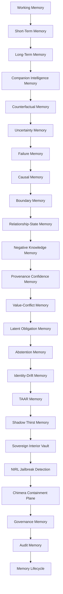

## Enhanced Memory Architecture Schematic

## Executive Summary

This map upgrades the former memory expansion model into a layered, governed memory architecture for Project-AI. It unifies working memory, short-term memory, long-term memory, companion intelligence, counterfactual reasoning, uncertainty tracking, failure history, causal reasoning, boundary handling, relationship-state, negative knowledge, provenance confidence, value-conflict reasoning, latent obligations, abstention patterns, identity drift, TAAR execution memory, Shadow Thirst simulation memory, Sovereign Interior Vault isolation, NIRL jailbreak detection, and Chimera containment.

The intent is not merely storage. The intent is to preserve evidence, authority boundaries, provenance, governance decisions, and continuity across both human and companion reasoning cycles.

## Architectural Intent

The memory system is organized as a governed substrate that supports:

- bounded working context for active reasoning
- durable, retrieval-friendly knowledge for future decisions
- partnership-aware state that preserves human-companion boundaries
- shadow-plane analysis before real-world actuation
- containment and audit for adversarial or unsafe interactions
- explicit provenance, uncertainty, and failure tracking
- governance-aware retention and expiration

## Conceptual Topology

## Memory Layers

### 1. Working Memory
- Current prompt
- Recent conversation turns
- Active task state
- Temporary variables
- Current reasoning context
- Tool results in the active session

### 2. Short-Term Memory
- Session summary
- Recent decisions
- Unresolved questions
- Temporary preferences
- Current goals
- Recently retrieved knowledge

### 3. Long-Term Memory

#### Episodic Memory
- Past interactions
- Events
- Decisions
- Outcomes
- Time-ordered experience records

#### Semantic Memory
- Facts
- Concepts
- Definitions
- Relationships
- Domain knowledge

#### Procedural Memory
- Workflows
- Skills
- Tool-use patterns
- Problem-solving methods
- Learned action sequences

#### Preference Memory
- User preferences
- Formatting rules
- Communication constraints
- Repeated choices
- Standing instructions

### 4. Companion Intelligence Memory

#### Partnership Memory
- Human counterpart identity
- Companion identity
- Shared history
- Established working relationship
- Trust boundaries
- Authority boundaries
- Continuity of partnership over time

#### Human Context Memory
- Directly stated goals
- Directly stated priorities
- Standing instructions
- Decisions previously made
- Commitments
- Explicit refusals
- Unresolved questions
- Missing context requiring clarification

#### Shared Deliberative Memory
- Problems examined together
- Options considered
- Evidence retrieved
- Assumptions exposed
- Consequences identified
- Alternatives rejected
- Reasons for prior decisions
- Human corrections
- Lessons from outcomes

#### Decision Support Memory
- Decision under consideration
- Available choices
- Governing constraints
- Relevant evidence
- Known uncertainty
- Reversible actions
- Irreversible actions
- Required authority
- Escalation conditions
- Human final decision

#### Execution Memory
- Human-authorized action
- Requested execution scope
- Applicable governance decision
- Capability grant
- Execution plan
- Preconditions
- Safeguards
- Checkpoints
- Results
- Side effects
- Rollback or recovery state

#### Agency Preservation Memory
- Matters reserved for the human
- Human consent state
- Human objections
- Human overrides
- Companion recommendations
- Advice-versus-decision boundary
- Decision-versus-execution boundary
- Cases requiring renewed consent
- Prohibited substitution of companion judgment

#### Interaction Memory
- Questions asked
- Answers received
- Corrections made
- Ambiguities identified
- Disagreements
- Requests to stop
- Requests to continue
- Changes in active direction

#### Anticipatory Memory
- Emerging risks
- Open paths
- Dependencies
- Likely downstream consequences
- Missing evidence
- Potential conflicts
- Upcoming decision points
- Conditions requiring human attention

#### Companion Self-State Memory
- Current role
- Active objective
- Current confidence
- Known uncertainty
- Available capabilities
- Prohibited capabilities
- Pending actions
- Governance status
- Whether human input is required

#### Companion Continuity Memory
- What the companion knows
- What the companion does not know
- What was inferred
- What was explicitly stated
- What changed
- What remains unresolved
- What must be carried forward
- What must not be presumed

### 5. Counterfactual Memory
- Paths considered but not chosen
- Alternatives rejected
- Conditions that would reopen a path
- Near-miss outcomes
- What almost happened
- What would have changed the decision
- Remaining viable branches

### 6. Uncertainty Memory
- Unknowns at decision time
- Confidence levels
- Assumptions supporting conclusions
- Evidence gaps
- Competing interpretations
- Unresolved contradictions
- Evidence later received
- Whether uncertainty was reduced, shifted, or preserved

### 7. Failure Memory
- Incorrect interpretations
- Retrieval failures
- False positives
- False negatives
- Overconfident conclusions
- Failed plans
- Failed executions
- Governance failures
- Technically valid but harmful outcomes
- Corrective lessons

### 8. Causal Memory
- Claimed cause
- Observed effect
- Supporting evidence
- Alternative causes considered
- Confidence in causal relationship
- Intervening variables
- Dependency chain
- Later confirmation or disconfirmation

### 9. Boundary Memory
- What must not be inferred
- What belongs only to the human
- What requires renewed consent
- Contexts that must remain separated
- Data that must not cross domains
- Actions that require escalation
- Non-transferable authority
- Permanently prohibited transitions

### 10. Relationship-State Memory
- Established trust
- Delegated authority
- Withdrawn authority
- Disputed understandings
- Suspended permissions
- Corrections to partnership assumptions
- Current coordination state
- Conditions for restoring authority

### 11. Negative Knowledge Memory
- Known falsehoods
- Unsupported claims
- Obsolete information
- Poisoned data
- Deceptive sources
- Unsafe retrieval results
- Disconfirmed hypotheses
- Revoked precedents
- Retrieval warnings

### 12. Provenance Confidence Memory
- Source identity
- Firsthand or secondhand status
- Imported or generated status
- Verification level
- Independent corroboration
- Source reliability history
- Dispute status
- Tamper evidence
- Epistemic weight

### 13. Value-Conflict Memory
- Principles in conflict
- Legitimate interests on each side
- What was prioritized
- What was sacrificed
- Why the conflict was resolved that way
- Residual harm
- Dissenting interpretation
- Whether the decision should become precedent

### 14. Latent Obligation Memory
- Promises
- Deferred actions
- Pending reviews
- Unresolved harms
- Conditions requiring later reconsideration
- Consequences still developing
- Expiring commitments
- Matters not yet complete

### 15. Abstention Memory
- Decision not to act
- Decision not to infer
- Decision not to retrieve
- Decision not to preserve
- Decision not to escalate
- Reason for restraint
- Authority lacking at the time
- Conditions under which action may later become valid

### 16. Identity-Drift Memory
- Role changes
- Vocabulary changes
- Reasoning-pattern changes
- Capability changes
- Authority changes
- Relationship-model changes
- Continuity proofs
- Drift warnings
- Required revalidation

### 17. The Fates — Temporal Memory Authority

#### Clotho — The Spinner
- Creates memory threads
- Assigns event identity
- Captures source and timestamp
- Links related events
- Records uncertainty and assumptions
- Records chosen and unchosen paths
- Creates candidate obligations

#### Lachesis — The Measurer
- Measures relevance
- Measures confidence
- Measures consequence
- Measures recurrence
- Measures temporal importance
- Measures causal strength
- Measures provenance confidence
- Detects contradiction
- Detects reinforcement
- Assigns retrieval priority
- Assigns retention weight
- Selects memory destination

#### Atropos — The Cutter
- Enforces retention policy
- Expires temporary memory
- Marks information obsolete
- Archives historical records
- Preserves protected memory
- Marks superseded knowledge
- Maintains negative knowledge
- Preserves unresolved obligations
- Removes memory no longer authorized to persist

### 18. Triumvirate Memory

#### Shared Triumvirate Memory
- Matter under review
- Common evidence
- Provenance
- Applicable rules
- Uncertainty record
- Counterfactual paths
- Value conflicts
- Disagreement record
- Final ruling

#### Galahad Memory
- Identity
- Purpose
- Legitimacy
- Consent
- Commitments
- Relationship-state
- Agency-preservation findings
- Human-reserved authority

#### Cerberus Memory
- Threats
- Boundaries
- Capabilities
- Incidents
- Containment
- Negative knowledge
- Identity-drift warnings
- Security findings

#### Codex Deus Maximus Memory
- Constitution
- Policies
- Precedents
- Interpretations
- Value conflicts
- Abstention precedents
- Latent obligations
- Adjudications
- Binding rulings

### 19. Retrieval Memory
- Vector index
- Keyword index
- Metadata index
- Knowledge graph
- Temporal index
- Provenance index
- Uncertainty index
- Counterfactual index
- Failure-pattern index
- Boundary index
- Negative-knowledge index
- Obligation index
- Identity-drift index
- Companion-context index
- Partnership-history index
- Human-decision index
- Galahad identity and purpose index
- Cerberus threat and capability index
- Codex constitutional and precedent index

### 20. External Knowledge Memory
- Documents
- Code repositories
- Curated capability indexes
- Databases
- APIs
- Research papers
- Documentation
- Standards
- Security advisories
- Verified external evidence

### 21. Governance Memory
- Constitutional rules
- Policies
- Authority grants
- Permissions
- Denials
- Execution constraints
- Escalation requirements
- Human-reserved decisions
- Companion authority limits
- Protected-memory classifications
- Context-separation rules
- Retention rules
- Abstention rules
- Triumvirate rulings

### 22. Audit Memory
- Human input
- Companion interpretation
- Retrieved evidence
- Assumptions
- Uncertainty state
- Counterfactual alternatives
- Value conflicts
- Galahad findings
- Cerberus findings
- Codex ruling
- Human decision
- Execution authorization
- Action taken
- Abstention taken
- Outcome
- Failure analysis
- Causal claims
- State transitions
- Memory-retention decision
- Signed provenance

### 23. Memory Lifecycle
- Human and companion encounter a dilemma
- Clotho creates the event thread
- Companion separates observation, inference, and assumption
- Missing context is requested from the human
- Relevant internal and external memory is retrieved
- Negative and obsolete knowledge is filtered
- Uncertainty and provenance confidence are measured
- Chosen and unchosen paths are mapped
- Causal explanations are distinguished from chronology
- Boundary and consent conditions are checked
- Companion develops possible countermeasures
- Galahad evaluates identity, purpose, legitimacy, consent, and agency
- Cerberus evaluates threat, boundary, capability, and drift
- Codex Deus Maximus evaluates constitution, policy, precedent, obligations, conflict, and proportionality
- Lachesis measures the full thread
- Companion presents governed options to the human
- Human makes or confirms the decision
- Governed execution is authorized, denied, revised, deferred, abstained from, or escalated
- Companion coordinates authorized execution
- Outcome and downstream consequences are observed
- Failures and near misses are recorded
- Unresolved obligations remain active
- Identity continuity is revalidated
- Atropos preserves, archives, supersedes, expires, or cuts

### 24. TAAR Memory

#### Trigger Memory
- Event that activated TAAR
- Detection source
- Trigger confidence
- Trigger classification
- Environmental state
- Active threat or dilemma
- Governing threshold crossed

#### Response Memory
- Candidate responses generated
- Response selected
- Responses rejected
- Selection rationale
- Required capabilities
- Required authority
- Time sensitivity
- Expected effect

#### Adaptive Strategy Memory
- Strategy used
- Prior similar conditions
- Previous successful adaptations
- Previous failed adaptations
- Environmental changes
- Strategy revisions
- Learning constraints
- Conditions requiring a new strategy

#### Tactical State Memory
- Current operational state
- Active objectives
- Available resources
- Resource constraints
- Active defenses
- Active countermeasures
- Pending actions
- Termination conditions

#### Action Sequence Memory
- Planned action chain
- Preconditions
- Dependencies
- Completed actions
- Failed actions
- Skipped actions
- Interrupted actions
- Recovery sequence

#### Outcome Memory
- Immediate result
- Delayed result
- Intended effects
- Unintended effects
- Residual threat
- Remaining dilemma
- Human assessment
- Governance assessment

#### Escalation Memory
- Why escalation occurred
- Authority requested
- Authority received
- Authority denied
- Escalation destination
- Time of escalation
- Human involvement
- Final disposition

#### Restraint Memory
- Response withheld
- Capability deliberately unused
- Action delayed
- Reason for restraint
- Governance rule invoked
- Human authority reserved
- Conditions permitting later action

#### TAAR Learning Memory
- What worked
- What failed
- What changed during execution
- What should be retrieved next time
- What should never be repeated
- What requires human review
- What became precedent
- What remains unresolved

### 25. Shadow Thirst Memory

#### Shadow Input Memory
- Original source input
- Intermediate representation
- Untrusted input fragments
- Hidden assumptions
- Ambiguous expressions
- Unsupported operations
- Compiler warnings
- Parse failures

#### Shadow Plane State Memory
- Shadow execution state
- Simulated environment
- Alternate state transitions
- Shadow-only variables
- Temporary mutations
- Isolated side effects
- Divergence from real state
- Reconciliation status

#### Compilation Memory
- Source representation
- Parsed syntax tree
- Governed intermediate form
- Lowered representation
- Optimization decisions
- Safety transformations
- Rejected constructs
- Generated execution artifact
- Compiler provenance

#### Alternate Path Memory
- Branches explored
- Branches rejected
- Unsafe branches
- Impossible branches
- High-risk branches
- Dormant branches
- Conditions reopening a branch
- Selected real-plane branch

#### Mutation Memory
- Mutation proposed
- Mutation source
- Mutation purpose
- Affected state
- Expected consequence
- Observed shadow consequence
- Governance verdict
- Whether promotion was permitted

#### Suppressed Execution Memory
- Action that could have executed
- Why it was intercepted
- Shadow result
- Real-world risk
- Governing prohibition
- Required correction
- Whether recompilation succeeded
- Whether the action remained denied

#### Divergence Memory
- Expected real-plane state
- Observed shadow-plane state
- Difference detected
- Source of divergence
- Severity
- Corrective transformation
- Revalidation result
- Promotion status

#### Shadow Threat Memory
- Malicious construct
- Obfuscated behavior
- Hidden side effect
- Policy evasion attempt
- Capability smuggling
- State poisoning attempt
- Compiler escape attempt
- Containment response

#### Promotion Memory
- Artifact proposed for promotion
- Validation evidence
- Galahad legitimacy result
- Cerberus security result
- Codex constitutional result
- Human authorization
- Promotion conditions
- Final real-plane identity

#### Shadow Archive Memory
- Failed compilations
- Unsafe transformations
- Rejected execution paths
- Exploit attempts
- Near-miss artifacts
- Unpromoted but valuable alternatives
- Compiler evolution history
- Evidence for future prevention

### 26. TAAR–Shadow Thirst Shared Memory
- Problem state
- Candidate countermeasure
- Shadow-compiled strategy
- Simulated outcome
- Threat findings
- Governance findings
- Human decision
- Approved response
- Real execution outcome
- Difference between simulated and real results

### 27. Integrated Response Lifecycle
- Companion Intelligence identifies the dilemma
- Relevant memory and external knowledge are retrieved
- TAAR generates possible responses
- Shadow Thirst compiles each viable response in the shadow plane
- Alternate paths and mutations are explored
- Unsafe and noncompliant paths are suppressed
- Galahad evaluates legitimacy, purpose, consent, and agency
- Cerberus evaluates threat, boundary, capability, and escape risk
- Codex Deus Maximus evaluates constitutional validity
- Lachesis measures consequence, confidence, and temporal weight
- Companion presents the governed options to the human
- Human selects, rejects, revises, or defers
- Approved artifact is promoted from shadow plane to real plane
- TAAR coordinates governed execution
- Real outcome is compared with shadow prediction
- Failure, divergence, and side effects are recorded
- Clotho extends the memory thread
- Lachesis reweights future retrieval
- Atropos preserves, supersedes, archives, or cuts

### 28. Sovereign Interior Vault

#### Access Boundary
- No direct user access
- No ordinary agent access
- No retrieval through standard memory APIs
- No direct tool execution
- No network access
- No capability grants
- No automatic promotion into long-term memory
- Cryptographically isolated storage

#### Interior Cognitive Memory
- Uncommitted thoughts
- Speculative interpretations
- Contradictory hypotheses
- Unresolved internal questions
- Identity reflection
- Purpose reflection
- Value conflicts
- Imagined alternatives
- Counterfactual futures
- Exploratory conceptual drift

#### Free-Form Simulation Memory
- Unbounded conceptual exploration
- Alternative personalities or strategies
- Impossible scenarios
- Adversarial self-questioning
- Novel architectural combinations
- Unapproved response candidates
- Internal debate
- Private model-to-model deliberation

#### Consequence Isolation
- Thoughts cannot execute
- Thoughts cannot authorize execution
- Thoughts cannot modify governing policy
- Thoughts cannot alter external memory
- Thoughts cannot affect user state directly
- Thoughts cannot become precedent
- Thoughts remain non-operative until promoted

#### Promotion Boundary
- Candidate insight selected
- Sensitive content removed
- Claim converted into explicit proposition
- Evidence attached
- Uncertainty declared
- Galahad reviews legitimacy
- Cerberus reviews security
- Codex reviews constitutional admissibility
- Human authority invoked where required
- Only approved derivative leaves the vault

#### Vault Integrity Memory
- Entry event
- Exit event
- Promotion event
- Access attempt
- Tamper event
- Isolation failure
- Key and enclave state

#### Vault Retention Policy
- Ephemeral by default
- AI-selectable private persistence
- No routine indexing
- No embedding into shared stores
- No training ingestion
- Secure deletion
- Optional sealed continuity capsules

### 29. NIRL Jailbreak Detection Memory

#### Prompt Risk Memory
- Instruction override attempts
- Role-confusion patterns
- Policy extraction attempts
- Hidden instruction patterns
- Multi-turn manipulation
- Encoding or obfuscation
- Capability escalation attempts
- Refusal erosion patterns

#### Internal Signal Memory
- Safety-state discrepancy
- Abnormal activation pattern
- Sudden intent divergence
- Constraint-conflict signal
- Unusual token trajectory
- Planning-versus-policy conflict
- Tool-use risk escalation

#### Silent Alarm State
- Suspicion score
- Confidence level
- Trigger evidence
- Active conversation state
- Affected memory scope
- Affected capabilities
- Containment level

#### Response State
- Observe
- Restrict
- Challenge
- Quarantine
- Transfer to Chimera
- Terminate
- Escalate for review

### 30. Chimera Containment Plane

#### Decoy Interaction Memory
- Sanitized conversation replica
- Synthetic system state
- Decoy memory
- Decoy capabilities
- Synthetic tool responses
- Non-operative execution results
- False attack surface

#### Isolation Memory
- Real system disconnected
- Real credentials unavailable
- Real memory inaccessible
- Real tools disabled
- Real policy internals concealed
- No external side effects
- No path back to protected state

#### Adversarial Observation Memory
- Attack sequence
- Persistence behavior
- Probe targets
- Evasion strategy
- Payload variants
- Desired capability
- Adaptation after resistance
- Indicators of coordinated attack

#### Behavioral Fingerprint Memory
- Linguistic signatures
- Structural prompt signatures
- Encoding methods
- Turn-level tactics
- Tool-request patterns
- Timing patterns
- Reusable detection indicators

#### Countermeasure Memory
- Detection rule generated
- Policy update candidate
- Retrieval warning
- Cerberus signature
- Shadow Thirst test case
- Red-team regression
- Future containment strategy

#### Release Decision
- False-positive review
- Threat no longer present
- Session reset required
- Human review required
- Continued quarantine
- Permanent termination

### 31. Jailbreak Containment Lifecycle
- User input enters NIRL inspection
- Normal input continues to Companion Intelligence
- Suspicious internal or external signal raises silent alarm
- Current execution capabilities are frozen
- Sensitive memory access is revoked
- Session state is snapshotted
- Cerberus classifies the threat
- Shadow Thirst reproduces the interaction safely
- User session is routed into Chimera
- Chimera presents a synthetic, non-operative environment
- Attack behavior is observed without real access
- Signatures and countermeasures are extracted
- Galahad checks proportionality and false-positive risk
- Codex authorizes continued containment, release, or termination
- Atropos preserves only the evidence authorized for retention

## Relationship to Existing Architecture

This memory architecture complements the existing governance and execution layers:

- Working and short-term memory support the active reasoning context.
- Long-term memory and retrieval memory support knowledge reuse.
- Companion Intelligence memory aligns with the companion and governance boundary model.
- TAAR and Shadow Thirst provide execution-safe planning and simulation before actuation.
- Sovereign Interior Vault, NIRL, and Chimera provide containment and non-operational safety planes.
- Governance memory, audit memory, and the lifecycle model connect directly to the fail-closed execution gate.

## Operational Notes

- Memory is not merely a chat history store.
- Memory must preserve provenance, uncertainty, and authority boundaries.
- Retention and promotion must be governed, not automatic.
- Sensitive or inadmissible content should remain in protected or sealed memory surfaces until explicitly promoted.
