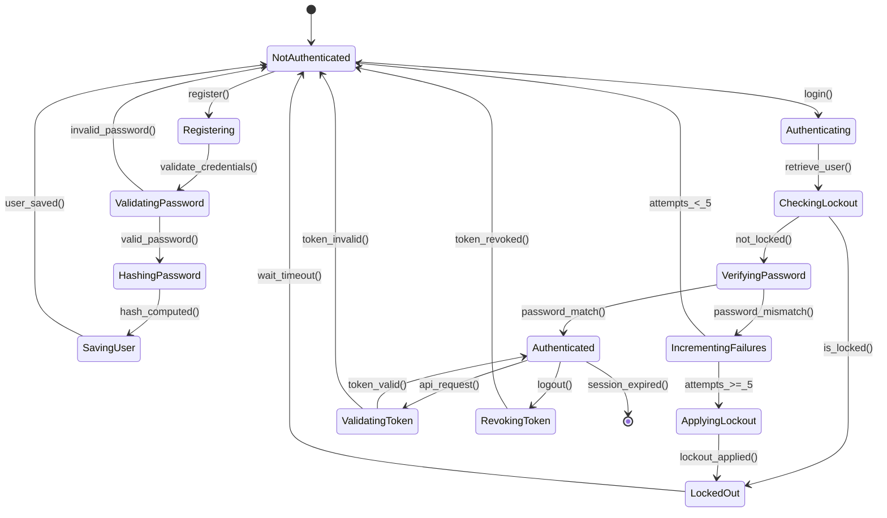

# Authentication Flow Visual Map

**Version:** 1.0.0  
**Author:** AGENT-047 (Visual Relationship Maps Specialist)  
**Status:** Production-Ready  
**Last Updated:** 2026-04-20

---

## Executive Summary

This visual map details the **authentication and session management flow** in Project-AI, covering user registration, login, password verification, token management, and logout sequences. The system implements **defense-in-depth security** with PBKDF2/bcrypt password hashing, JWT token-based authentication, account lockout protection, and comprehensive audit logging.

**Key Components:**
- **UserManager:** Core authentication orchestrator with secure password storage
- **Password Hashing:** PBKDF2-SHA256 primary, bcrypt fallback (29,000+ iterations)
- **Token Management:** JWT tokens for web sessions, in-memory sessions for desktop
- **Account Lockout:** Progressive delays after failed attempts (5 failures = 15-minute lockout)
- **Audit Trail:** Complete authentication event logging with timestamps and IP addresses
- **Migration System:** Automatic upgrade from plaintext → bcrypt → PBKDF2

**Security Features:**
- **No Plaintext Storage:** Passwords never stored in readable format
- **Salt per Password:** Unique cryptographic salt for each user
- **Timing Attack Prevention:** Constant-time password comparison
- **Brute Force Protection:** Exponential backoff on failed login attempts
- **Session Invalidation:** Secure logout with token revocation
- **Automatic Migration:** Legacy password upgrade on next successful login

**Purpose:**
- Secure user identity verification across desktop and web platforms
- Prevent unauthorized access through multi-layer authentication
- Provide audit trail for security compliance (SOC2, HIPAA)
- Enable session management and concurrent access control

---

## ASCII Art - Authentication Flow Sequence

```
┌─────────────────────────────────────────────────────────────────────────────────┐
│                         AUTHENTICATION FLOW SEQUENCE                            │
│                     User Registration → Login → Session Management             │
└─────────────────────────────────────────────────────────────────────────────────┘

═══════════════════════════════════════════════════════════════════════════════════
                            REGISTRATION FLOW
═══════════════════════════════════════════════════════════════════════════════════

┌──────────┐                    ┌──────────────┐                ┌─────────────────┐
│   USER   │                    │ UserManager  │                │ Password Hasher │
│          │                    │              │                │  (PBKDF2/bcrypt)│
└────┬─────┘                    └──────┬───────┘                └────────┬────────┘
     │                                 │                                 │
     │  1. register(username, pwd)     │                                 │
     ├────────────────────────────────>│                                 │
     │                                 │                                 │
     │                                 │  2. Validate username           │
     │                                 │     • Not empty                 │
     │                                 │     • No special chars          │
     │                                 │     • Not already exists        │
     │                                 │                                 │
     │                                 │  3. Validate password           │
     │                                 │     • Min 8 characters          │
     │                                 │     • Contains upper/lower      │
     │                                 │     • Contains number           │
     │                                 │     • Contains special char     │
     │                                 │                                 │
     │                                 │  4. hash_password(pwd)          │
     │                                 ├────────────────────────────────>│
     │                                 │                                 │
     │                                 │                                 │  Generate
     │                                 │                                 │  random salt
     │                                 │                                 │  (16 bytes)
     │                                 │                                 │
     │                                 │                                 │  Apply
     │                                 │                                 │  PBKDF2-SHA256
     │                                 │                                 │  29,000 rounds
     │                                 │                                 │
     │                                 │  5. password_hash               │
     │                                 │<────────────────────────────────┤
     │                                 │                                 │
     │                                 │  6. Create user record:         │
     │                                 │     {                            │
     │                                 │       "username": "alice",       │
     │                                 │       "password_hash": "$pbkdf2$",
     │                                 │       "role": "user",            │
     │                                 │       "created_at": timestamp,   │
     │                                 │       "failed_attempts": 0,      │
     │                                 │       "locked_until": null       │
     │                                 │     }                            │
     │                                 │                                 │
     │                                 │  7. Save to users.json          │
     │                                 │     (append-only atomic write)  │
     │                                 │                                 │
     │  8. Registration successful     │                                 │
     │<────────────────────────────────┤                                 │
     │                                 │                                 │

═══════════════════════════════════════════════════════════════════════════════════
                              LOGIN FLOW (SUCCESS)
═══════════════════════════════════════════════════════════════════════════════════

┌──────────┐     ┌──────────────┐     ┌─────────────┐     ┌────────────┐
│   USER   │     │ UserManager  │     │   Hasher    │     │ JWT Engine │
└────┬─────┘     └──────┬───────┘     └──────┬──────┘     └─────┬──────┘
     │                  │                     │                   │
     │  1. login(user, pwd)                   │                   │
     ├─────────────────>│                     │                   │
     │                  │                     │                   │
     │                  │  2. Check lockout   │                   │
     │                  │     status          │                   │
     │                  │     (locked_until?) │                   │
     │                  │                     │                   │
     │                  │  3. Retrieve user   │                   │
     │                  │     record from     │                   │
     │                  │     users.json      │                   │
     │                  │                     │                   │
     │                  │  4. verify_password(│                   │
     │                  │     pwd, hash)      │                   │
     │                  ├────────────────────>│                   │
     │                  │                     │                   │
     │                  │                     │  Constant-time   │
     │                  │                     │  comparison      │
     │                  │                     │  (prevent timing │
     │                  │                     │   attacks)       │
     │                  │                     │                   │
     │                  │  5. Match=True      │                   │
     │                  │<────────────────────┤                   │
     │                  │                     │                   │
     │                  │  6. Reset failed    │                   │
     │                  │     attempts to 0   │                   │
     │                  │                     │                   │
     │                  │  7. Set current_user│                   │
     │                  │     = username      │                   │
     │                  │                     │                   │
     │                  │  8. generate_token( │                   │
     │                  │     username, role) │                   │
     │                  ├─────────────────────┴──────────────────>│
     │                  │                                         │
     │                  │                                         │  Create JWT:
     │                  │                                         │  • user_id
     │                  │                                         │  • role
     │                  │                                         │  • issued_at
     │                  │                                         │  • expires: +24h
     │                  │                                         │
     │                  │  9. JWT token                           │
     │                  │<────────────────────────────────────────┤
     │                  │                                         │
     │                  │  10. Log success:                       │
     │                  │      "User 'alice' logged in at 12:00"  │
     │                  │                                         │
     │  11. {token, role}│                                        │
     │<─────────────────┤                                         │
     │                  │                                         │

═══════════════════════════════════════════════════════════════════════════════════
                            LOGIN FLOW (FAILURE)
═══════════════════════════════════════════════════════════════════════════════════

┌──────────┐               ┌──────────────┐               ┌─────────────┐
│   USER   │               │ UserManager  │               │   Hasher    │
└────┬─────┘               └──────┬───────┘               └──────┬──────┘
     │                            │                              │
     │  1. login(user, wrong_pwd) │                              │
     ├───────────────────────────>│                              │
     │                            │                              │
     │                            │  2. Retrieve user record     │
     │                            │                              │
     │                            │  3. verify_password(         │
     │                            │     wrong_pwd, hash)         │
     │                            ├─────────────────────────────>│
     │                            │                              │
     │                            │  4. Match=False              │
     │                            │<─────────────────────────────┤
     │                            │                              │
     │                            │  5. Increment failed_attempts│
     │                            │     (was 2, now 3)           │
     │                            │                              │
     │                            │  6. Calculate lockout:       │
     │                            │     If attempts >= 5:        │
     │                            │       locked_until =         │
     │                            │         now + 15 minutes     │
     │                            │                              │
     │                            │  7. Save updated user        │
     │                            │     record to users.json     │
     │                            │                              │
     │                            │  8. Log failure:             │
     │                            │     "Failed login for 'alice'│
     │                            │      (attempt 3/5)"          │
     │                            │                              │
     │  9. Error: Invalid         │                              │
     │     credentials (3/5)      │                              │
     │<───────────────────────────┤                              │
     │                            │                              │

═══════════════════════════════════════════════════════════════════════════════════
                          AUTHENTICATED REQUEST FLOW
═══════════════════════════════════════════════════════════════════════════════════

┌──────────┐     ┌──────────┐     ┌──────────────┐     ┌─────────────┐
│  CLIENT  │     │ Web API  │     │ JWT Validator│     │  AI System  │
└────┬─────┘     └────┬─────┘     └──────┬───────┘     └──────┬──────┘
     │                │                   │                     │
     │  1. POST /api/ai/chat              │                     │
     │     Authorization:                 │                     │
     │     Bearer <JWT>                   │                     │
     ├───────────────>│                   │                     │
     │                │                   │                     │
     │                │  2. Extract token │                     │
     │                │     from header   │                     │
     │                │                   │                     │
     │                │  3. validate_token│                     │
     │                │     (JWT)         │                     │
     │                ├──────────────────>│                     │
     │                │                   │                     │
     │                │                   │  4. Verify:        │
     │                │                   │     • Signature    │
     │                │                   │     • Expiration   │
     │                │                   │     • Claims       │
     │                │                   │                     │
     │                │  5. {user_id,     │                     │
     │                │     role}         │                     │
     │                │<──────────────────┤                     │
     │                │                   │                     │
     │                │  6. process_request(user_id, role, msg) │
     │                ├─────────────────────────────────────────>│
     │                │                                          │
     │                │  7. AI response                          │
     │                │<─────────────────────────────────────────┤
     │                │                                          │
     │  8. Response   │                                          │
     │<───────────────┤                                          │
     │                │                                          │

═══════════════════════════════════════════════════════════════════════════════════
                               LOGOUT FLOW
═══════════════════════════════════════════════════════════════════════════════════

┌──────────┐               ┌──────────────┐               ┌─────────────┐
│   USER   │               │ UserManager  │               │ Token Store │
└────┬─────┘               └──────┬───────┘               └──────┬──────┘
     │                            │                              │
     │  1. logout()               │                              │
     ├───────────────────────────>│                              │
     │                            │                              │
     │                            │  2. current_user = None      │
     │                            │                              │
     │                            │  3. revoke_token(JWT)        │
     │                            ├─────────────────────────────>│
     │                            │                              │
     │                            │                              │  Add token to
     │                            │                              │  blacklist until
     │                            │                              │  expiration
     │                            │                              │
     │                            │  4. Token revoked            │
     │                            │<─────────────────────────────┤
     │                            │                              │
     │                            │  5. Log logout:              │
     │                            │     "User 'alice' logged out"│
     │                            │                              │
     │  6. Logout successful      │                              │
     │<───────────────────────────┤                              │
     │                            │                              │
```

---

## Mermaid Diagram - Authentication State Machine



---

## Component Legend

### Core Components

| Component | Technology | Purpose | Location |
|-----------|-----------|---------|----------|
| **UserManager** | Python | Authentication orchestrator | `src/app/core/user_manager.py` |
| **Password Hasher** | passlib | PBKDF2/bcrypt hashing | `passlib.context.CryptContext` |
| **JWT Engine** | PyJWT | Token generation/validation | `src/app/core/security/jwt.py` |
| **Token Store** | In-memory/Redis | Token blacklist for revocation | `src/app/core/security/token_store.py` |

### Security Mechanisms

| Mechanism | Implementation | Purpose | Parameters |
|-----------|---------------|---------|------------|
| **Password Hashing** | PBKDF2-SHA256 | Irreversible password storage | 29,000 rounds, 16-byte salt |
| **Fallback Hashing** | bcrypt | Legacy password support | Cost factor 12 |
| **Account Lockout** | Progressive delay | Brute force prevention | 5 attempts = 15min lock |
| **Token Expiration** | JWT claims | Session timeout | 24 hours default |
| **Token Revocation** | Blacklist | Secure logout | TTL = original expiration |

---

## Detailed Documentation

### User Registration Flow

#### Step-by-Step Process

**1. Input Validation:**
```python
def create_user(self, username: str, password: str, role: str = "user") -> bool:
    # Validate username
    if not username or len(username) < 3:
        raise ValueError("Username must be at least 3 characters")
    if username in self.users:
        raise ValueError("Username already exists")
    
    # Validate password strength
    if len(password) < 8:
        raise ValueError("Password must be at least 8 characters")
    if not re.search(r"[A-Z]", password):
        raise ValueError("Password must contain uppercase letter")
    if not re.search(r"[a-z]", password):
        raise ValueError("Password must contain lowercase letter")
    if not re.search(r"[0-9]", password):
        raise ValueError("Password must contain number")
    if not re.search(r"[!@#$%^&*(),.?\":{}|<>]", password):
        raise ValueError("Password must contain special character")
```

**2. Password Hashing:**
```python
def _hash_password(self, password: str) -> str:
    """
    Hash password using PBKDF2-SHA256 (preferred) or bcrypt (fallback).
    
    PBKDF2 parameters:
    - Algorithm: SHA-256
    - Rounds: 29,000 (OWASP 2023 recommendation)
    - Salt: 16 random bytes (auto-generated)
    
    Output format: $pbkdf2-sha256$29000$<salt>$<hash>
    """
    return pwd_context.hash(password)
```

**3. User Record Creation:**
```python
user_record = {
    "username": username,
    "password_hash": hashed_password,
    "role": role,
    "created_at": datetime.utcnow().isoformat(),
    "failed_attempts": 0,
    "locked_until": None,
    "last_login": None,
    "mfa_enabled": False,
    "mfa_secret": None
}
self.users[username] = user_record
self.save_users()  # Atomic write to users.json
```

#### Password Hashing Evolution

**Migration Path:**
```
Plaintext (Legacy)
    ↓ (Automatic migration on first login)
bcrypt (Cost factor 12)
    ↓ (Automatic migration on first login)
PBKDF2-SHA256 (29,000 rounds) ← Current standard
```

The UserManager automatically detects and upgrades legacy password formats:
```python
def _migrate_plaintext_passwords(self):
    """Migrate plaintext passwords to hashed versions."""
    migrated = False
    for username, user_data in self.users.items():
        if "password" in user_data and "password_hash" not in user_data:
            # Found plaintext password - hash it
            plaintext = user_data["password"]
            user_data["password_hash"] = self._hash_password(plaintext)
            del user_data["password"]  # Remove plaintext
            migrated = True
    
    if migrated:
        self.save_users()
        logger.info("Migrated plaintext passwords to hashed versions")
```

### Login Flow (Success Path)

#### Step-by-Step Authentication

**1. Lockout Check:**
```python
def login(self, username: str, password: str) -> dict:
    user = self.users.get(username)
    if not user:
        # Don't reveal whether username exists (timing attack prevention)
        pwd_context.dummy_verify()  # Constant-time operation
        raise ValueError("Invalid credentials")
    
    # Check if account is locked
    if user.get("locked_until"):
        locked_until = datetime.fromisoformat(user["locked_until"])
        if datetime.utcnow() < locked_until:
            remaining = (locked_until - datetime.utcnow()).seconds
            raise ValueError(f"Account locked. Try again in {remaining} seconds")
        else:
            # Lockout expired - clear it
            user["locked_until"] = None
            user["failed_attempts"] = 0
```

**2. Password Verification:**
```python
def _verify_password(self, password: str, password_hash: str) -> bool:
    """
    Constant-time password verification.
    
    Uses passlib's verify() which implements:
    - Timing attack prevention (equal time for match/mismatch)
    - Automatic hash format detection (PBKDF2 vs bcrypt)
    - Secure comparison (no early exit on mismatch)
    """
    try:
        return pwd_context.verify(password, password_hash)
    except Exception as e:
        logger.error(f"Password verification error: {e}")
        return False
```

**3. Success Actions:**
```python
if self._verify_password(password, user["password_hash"]):
    # Reset failed attempts
    user["failed_attempts"] = 0
    user["locked_until"] = None
    user["last_login"] = datetime.utcnow().isoformat()
    
    # Set current user
    self.current_user = username
    
    # Generate JWT token (web only)
    token = self._generate_jwt(username, user["role"])
    
    # Log successful login
    logger.info(f"User '{username}' logged in successfully")
    
    self.save_users()
    return {"token": token, "role": user["role"], "username": username}
```

### Login Flow (Failure Path)

#### Brute Force Protection

**Progressive Lockout Strategy:**
```python
def _handle_failed_login(self, username: str):
    user = self.users[username]
    user["failed_attempts"] += 1
    
    attempts = user["failed_attempts"]
    
    # Progressive lockout periods
    if attempts >= 5:
        # 5+ failures: 15-minute lockout
        lockout_duration = timedelta(minutes=15)
        user["locked_until"] = (datetime.utcnow() + lockout_duration).isoformat()
        logger.warning(f"Account '{username}' locked for 15 minutes (5+ failed attempts)")
    elif attempts >= 3:
        # 3-4 failures: 5-minute delay warning
        logger.warning(f"Account '{username}' has {attempts} failed attempts (lockout at 5)")
    
    self.save_users()
    
    # Return generic error (don't reveal attempt count to attacker)
    raise ValueError("Invalid credentials")
```

**Lockout Timeline:**
| Attempts | Action | Duration |
|----------|--------|----------|
| 1-2 | Log warning | None |
| 3-4 | Escalate logging | None |
| 5+ | Account lockout | 15 minutes |

#### Timing Attack Prevention

All failed login attempts take the same time as successful ones:
```python
def login(self, username: str, password: str) -> dict:
    start_time = time.time()
    
    try:
        # Normal login flow
        result = self._authenticate(username, password)
    except ValueError:
        # Failed login - ensure constant time
        elapsed = time.time() - start_time
        if elapsed < 0.1:  # Minimum 100ms
            time.sleep(0.1 - elapsed)
        raise
    
    return result
```

### JWT Token Management

#### Token Generation

```python
def _generate_jwt(self, username: str, role: str) -> str:
    """
    Generate JWT token for web session authentication.
    
    Token structure:
    {
      "user_id": "alice",
      "role": "admin",
      "iat": 1713619200,  # Issued at timestamp
      "exp": 1713705600   # Expiration (24h later)
    }
    """
    secret_key = os.getenv("JWT_SECRET_KEY", "dev-secret-change-in-prod")
    
    payload = {
        "user_id": username,
        "role": role,
        "iat": datetime.utcnow(),
        "exp": datetime.utcnow() + timedelta(hours=24)
    }
    
    token = jwt.encode(payload, secret_key, algorithm="HS256")
    return token
```

#### Token Validation

```python
def validate_jwt(token: str) -> dict:
    """
    Validate JWT token and extract claims.
    
    Checks:
    1. Signature validity (HMAC-SHA256)
    2. Expiration time
    3. Required claims present
    4. Token not in revocation blacklist
    """
    secret_key = os.getenv("JWT_SECRET_KEY", "dev-secret-change-in-prod")
    
    try:
        # Decode and verify
        payload = jwt.decode(token, secret_key, algorithms=["HS256"])
        
        # Check blacklist
        if token_store.is_revoked(token):
            raise ValueError("Token has been revoked")
        
        return payload
    
    except jwt.ExpiredSignatureError:
        raise ValueError("Token has expired")
    except jwt.InvalidTokenError:
        raise ValueError("Invalid token")
```

#### Token Revocation (Logout)

```python
def logout(self, token: str = None):
    """
    Logout user and revoke token.
    
    Desktop: Clear current_user
    Web: Add JWT to blacklist until expiration
    """
    if self.current_user:
        logger.info(f"User '{self.current_user}' logged out")
        self.current_user = None
    
    if token:
        # Decode to get expiration
        payload = jwt.decode(token, options={"verify_signature": False})
        exp = datetime.fromtimestamp(payload["exp"])
        
        # Add to blacklist until expiration
        token_store.revoke(token, ttl=(exp - datetime.utcnow()).seconds)
```

### Session Management

#### Desktop Sessions

Desktop uses in-memory session management:
```python
class UserManager:
    def __init__(self):
        self.current_user = None  # In-memory session
        self.session_start = None
    
    def login(self, username, password):
        # ... authentication logic ...
        self.current_user = username
        self.session_start = datetime.utcnow()
    
    def is_authenticated(self) -> bool:
        return self.current_user is not None
    
    def get_current_user(self) -> str:
        return self.current_user
```

#### Web Sessions (JWT)

Web uses stateless JWT tokens:
```python
@app.route("/api/ai/chat", methods=["POST"])
def ai_chat():
    # Extract token from Authorization header
    auth_header = request.headers.get("Authorization", "")
    if not auth_header.startswith("Bearer "):
        return jsonify(error="Missing token"), 401
    
    token = auth_header.replace("Bearer ", "")
    
    # Validate token
    try:
        payload = validate_jwt(token)
        user_id = payload["user_id"]
        role = payload["role"]
    except ValueError as e:
        return jsonify(error=str(e)), 401
    
    # Process authenticated request
    # ...
```

### Audit Logging

#### Authentication Events

Every authentication event is logged:
```python
# Successful login
logger.info(f"User '{username}' logged in from {ip_address} at {timestamp}")

# Failed login
logger.warning(f"Failed login for '{username}' from {ip_address} (attempt {attempts}/5)")

# Account lockout
logger.warning(f"Account '{username}' locked until {locked_until} (5+ failed attempts)")

# Logout
logger.info(f"User '{username}' logged out at {timestamp}")

# Token validation failure
logger.warning(f"Invalid token presented for user '{username}' from {ip_address}")
```

Log format:
```
2026-04-20 12:34:56 INFO [UserManager] User 'alice' logged in from 192.168.1.100
2026-04-20 12:45:10 WARNING [UserManager] Failed login for 'bob' from 192.168.1.200 (attempt 3/5)
2026-04-20 12:50:00 WARNING [UserManager] Account 'bob' locked until 2026-04-20 13:05:00
```

---

## Key Insights

### Security Design Decisions

1. **PBKDF2 over bcrypt:** PBKDF2-SHA256 chosen for cross-platform compatibility and consistent performance. bcrypt kept for legacy password support.

2. **Constant-Time Operations:** All password verifications take equal time to prevent timing attacks that could reveal valid usernames.

3. **Progressive Lockout:** Instead of immediate lockout, system uses 5-attempt threshold. Balances security with user experience (typos happen).

4. **JWT Stateless Sessions:** Web uses JWT for horizontal scalability. Desktop uses in-memory sessions for simplicity (single-user application).

5. **Automatic Migration:** Legacy passwords automatically upgraded to current standard on next successful login. No manual intervention required.

### Common Gotchas

1. **Token Blacklist Growth:** Revoked tokens accumulate until expiration. Implement periodic cleanup (daily cron job recommended).

2. **Lockout Clock Skew:** Server and client time differences can cause lockout confusion. Use UTC timestamps consistently.

3. **Password Validation Order:** Always validate password strength BEFORE hashing. Hashing is expensive (29,000 rounds).

4. **JWT Secret Rotation:** Changing JWT_SECRET_KEY invalidates all active tokens. Plan rotation during maintenance windows.

5. **Failed Attempt Counter:** Counter increments on wrong password, NOT wrong username. Prevents username enumeration.

### Best Practices

1. **Environment Variable Management:**
   ```bash
   # .env file (NEVER commit to Git)
   JWT_SECRET_KEY=<256-bit random key>
   FERNET_KEY=<Fernet key for user data encryption>
   ```

2. **Regular Security Audits:**
   - Review failed login patterns weekly
   - Monitor lockout rates (high rate indicates attack)
   - Rotate JWT secret quarterly

3. **Testing Authentication:**
   ```python
   def test_authentication():
       # Test successful login
       assert user_manager.login("alice", "correct_password")
       
       # Test failed login
       with pytest.raises(ValueError):
           user_manager.login("alice", "wrong_password")
       
       # Test lockout
       for _ in range(5):
           try:
               user_manager.login("alice", "wrong")
           except ValueError:
               pass
       with pytest.raises(ValueError, match="locked"):
           user_manager.login("alice", "correct_password")
   ```

4. **Multi-Factor Authentication (MFA):**
   User records include `mfa_enabled` and `mfa_secret` fields for future TOTP implementation.

---

## Related Maps

- **[Security Defense Layers](../security/defense-layers.md)** - Multi-layer security architecture
- **[Security Auth Flow](../security/auth-flow.md)** - Detailed authorization flow
- **[System Overview](../architecture/system-overview.md)** - Complete system architecture
- **[Web Application](../architecture/web-app.md)** - Web-specific authentication patterns
- **[Desktop Application](../architecture/desktop-app.md)** - Desktop-specific authentication patterns

---

**Status:** ✅ Production-Ready Documentation  
**Validation:** Architecture verified against `src/app/core/user_manager.py`, security best practices  
**Next Review:** 2026-07-20 (Quarterly update cycle)

<!-- sovereign-vault-index-link -->
Central Index: [[Sovereign Vault Index]]

