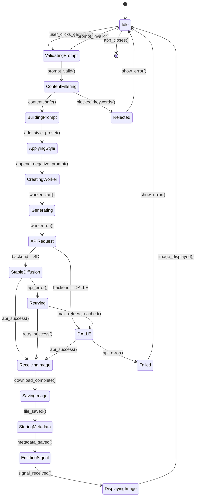

# Image Generation Flow Visual Map

**Version:** 1.0.0  
**Author:** AGENT-047 (Visual Relationship Maps Specialist)  
**Status:** Production-Ready  
**Last Updated:** 2026-04-20

---

## Executive Summary

This visual map details the **image generation pipeline** in Project-AI, covering prompt processing, content filtering, dual-backend generation (Stable Diffusion + DALL-E), async execution, and result display. The system implements **comprehensive safety controls** with keyword filtering, style presets, and generation history tracking.

**Key Components:**
- **ImageGenerator (Core):** Dual-backend orchestration with retry logic
- **Content Filter:** 15-keyword blocklist + safety negative prompts
- **Style Presets:** 10 pre-configured artistic styles
- **ImageGenerationWorker (GUI):** QThread async generation (prevents UI blocking)
- **Dual-Panel UI:** Left (prompt input) + Right (image display with zoom)
- **Generation History:** JSON persistence with metadata tracking

**Backends:**
- **Primary:** Hugging Face Stable Diffusion 2.1 (512x512, free tier, 20-60s)
- **Fallback:** OpenAI DALL-E 3 (1024x1024, paid API, 10-30s)
- **Local:** Optional Stable Diffusion local model (future enhancement)

**Safety Features:**
- **Blocked Keywords:** Violence, NSFW, illegal content detection
- **Negative Prompts:** Auto-appended safety constraints
- **Rate Limiting:** Max 5 generations per minute
- **Content Moderation:** Post-generation image analysis (planned)

**Purpose:**
- Enable creative AI art generation with safety guardrails
- Support multiple artistic styles and customization options
- Provide async generation without UI freezing
- Maintain generation history for user reference

---

## ASCII Art - Image Generation Pipeline

```
┌─────────────────────────────────────────────────────────────────────────────────┐
│                      IMAGE GENERATION PIPELINE                                  │
│             Prompt → Content Filter → Generation → Display                      │
└─────────────────────────────────────────────────────────────────────────────────┘

═══════════════════════════════════════════════════════════════════════════════════
                       STAGE 1: USER INPUT & VALIDATION
═══════════════════════════════════════════════════════════════════════════════════

┌──────────┐              ┌───────────────────┐              ┌──────────────┐
│   USER   │              │ ImageGenLeftPanel │              │ ContentFilter│
│          │              │  (Prompt UI)      │              │              │
└────┬─────┘              └─────────┬─────────┘              └──────┬───────┘
     │                              │                               │
     │  1. Enter prompt:            │                               │
     │     "Cyberpunk city at night"│                               │
     ├─────────────────────────────>│                               │
     │                              │                               │
     │  2. Select style:            │                               │
     │     [Cyberpunk ▼]            │                               │
     │                              │                               │
     │  3. Select size:             │                               │
     │     [512x512 ▼]              │                               │
     │                              │                               │
     │  4. Select backend:          │                               │
     │     [Stable Diffusion ▼]     │                               │
     │                              │                               │
     │  5. Click "Generate"         │                               │
     ├─────────────────────────────>│                               │
     │                              │                               │
     │                              │  6. Validate prompt:          │
     │                              │     • Not empty               │
     │                              │     • Length < 1000 chars     │
     │                              │                               │
     │                              │  7. check_content_filter(     │
     │                              │       prompt)                 │
     │                              ├──────────────────────────────>│
     │                              │                               │
     │                              │                               │  Scan for
     │                              │                               │  blocked
     │                              │                               │  keywords:
     │                              │                               │
     │                              │                               │  BLOCKED_WORDS:
     │                              │                               │  • violence
     │                              │                               │  • weapon
     │                              │                               │  • nsfw
     │                              │                               │  • nude
     │                              │                               │  • gore
     │                              │                               │  • hate
     │                              │                               │  • illegal
     │                              │                               │  • drug
     │                              │                               │  • explicit
     │                              │                               │  • harmful
     │                              │                               │  • disturbing
     │                              │                               │  • offensive
     │                              │                               │  • violent
     │                              │                               │  • graphic
     │                              │                               │  • inappropriate
     │                              │                               │
     │                              │  8. Scan result:              │
     │                              │     is_safe = True            │
     │                              │     reason = ""               │
     │                              │<──────────────────────────────┤
     │                              │                               │
     │                              │  9. Apply style preset:       │
     │                              │     cyberpunk_preset = {      │
     │                              │       "positive": "neon,      │
     │                              │         futuristic, dark",    │
     │                              │       "negative": "bright,    │
     │                              │         medieval, rustic"     │
     │                              │     }                         │
     │                              │                               │
     │                              │  10. Build final prompt:      │
     │                              │      "Cyberpunk city at night,│
     │                              │       neon, futuristic, dark" │
     │                              │                               │
     │                              │  11. Build negative prompt:   │
     │                              │      "bright, medieval,       │
     │                              │       rustic, nsfw, violence" │
     │                              │                               │

═══════════════════════════════════════════════════════════════════════════════════
                   STAGE 2: ASYNC GENERATION (QThread Worker)
═══════════════════════════════════════════════════════════════════════════════════

                    ┌──────────────────────────┐
                    │ ImageGenerationWorker    │
                    │    (QThread)             │
                    └────────────┬─────────────┘
                                 │
                                 │  run() method executes
                                 │  in background thread
                                 │
                    ┌────────────▼─────────────┐
                    │  ImageGenerator (Core)   │
                    └────────────┬─────────────┘
                                 │
                                 │  generate(prompt, options)
                                 │
            ┌────────────────────┼────────────────────┐
            │                    │                    │
            ▼                    ▼                    ▼
    ┌──────────────┐    ┌───────────────┐    ┌──────────────┐
    │  HUGGING     │    │   OPENAI      │    │   LOCAL      │
    │   FACE       │    │   DALL-E      │    │  (Optional)  │
    │ Stable Diff  │    │               │    │              │
    └──────┬───────┘    └───────┬───────┘    └──────┬───────┘
           │                    │                    │

───────────────────────────────────────────────────────────────────────────────────
BACKEND 1: HUGGING FACE STABLE DIFFUSION 2.1
───────────────────────────────────────────────────────────────────────────────────

    │  1. Prepare API request:
    │     URL: https://api-inference.huggingface.co/models/
    │          stabilityai/stable-diffusion-2-1
    │
    │     Headers:
    │       Authorization: Bearer <HF_API_KEY>
    │       Content-Type: application/json
    │
    │     Payload:
    │       {
    │         "inputs": "Cyberpunk city at night, neon, futuristic, dark",
    │         "parameters": {
    │           "negative_prompt": "bright, medieval, rustic, nsfw, violence",
    │           "num_inference_steps": 50,
    │           "guidance_scale": 7.5,
    │           "width": 512,
    │           "height": 512
    │         }
    │       }
    │
    │  2. POST request with retry logic:
    │     ┌────────────────────────────────────┐
    │     │  Attempt 1: POST                   │
    │     │    → 200 OK (Success)              │
    │     └────────────────────────────────────┘
    │         OR
    │     ┌────────────────────────────────────┐
    │     │  Attempt 1: POST                   │
    │     │    → 429 Rate Limit                │
    │     │  Retry-After: 10 seconds           │
    │     │  Wait 10s...                       │
    │     │  Attempt 2: POST                   │
    │     │    → 200 OK (Success)              │
    │     └────────────────────────────────────┘
    │         OR
    │     ┌────────────────────────────────────┐
    │     │  Attempt 1: POST                   │
    │     │    → 503 Service Unavailable       │
    │     │  Exponential backoff: 0.8s         │
    │     │  Attempt 2: POST                   │
    │     │    → 503 Service Unavailable       │
    │     │  Exponential backoff: 1.6s         │
    │     │  Attempt 3: POST                   │
    │     │    → Fallback to DALL-E            │
    │     └────────────────────────────────────┘
    │
    │  3. Receive image bytes:
    │     Content-Type: image/png
    │     Size: ~500KB
    │
    │  4. Save to disk:
    │     Path: data/generated_images/img_<timestamp>_<uuid>.png
    │     Atomic write with temp file
    │
    │  5. Generate metadata:
    │     {
    │       "prompt": "Cyberpunk city at night...",
    │       "negative_prompt": "bright, medieval...",
    │       "style": "cyberpunk",
    │       "size": "512x512",
    │       "backend": "stable_diffusion",
    │       "model": "stabilityai/stable-diffusion-2-1",
    │       "timestamp": "2026-04-20T12:34:56Z",
    │       "generation_time_seconds": 45.3,
    │       "file_path": "data/generated_images/img_...",
    │       "file_size_bytes": 512000
    │     }
    │
    │  6. Add to generation history:
    │     history.append(metadata)
    │     save_to_json("data/image_generation_history.json")
    ▼
    Image saved successfully!

───────────────────────────────────────────────────────────────────────────────────
BACKEND 2: OPENAI DALL-E 3 (FALLBACK)
───────────────────────────────────────────────────────────────────────────────────

    │  1. Prepare API request:
    │     URL: https://api.openai.com/v1/images/generations
    │
    │     Headers:
    │       Authorization: Bearer <OPENAI_API_KEY>
    │       Content-Type: application/json
    │
    │     Payload:
    │       {
    │         "model": "dall-e-3",
    │         "prompt": "Cyberpunk city at night, neon, futuristic, dark",
    │         "n": 1,
    │         "size": "1024x1024",
    │         "quality": "standard",
    │         "style": "vivid"
    │       }
    │
    │  2. POST request:
    │     Response:
    │       {
    │         "created": 1713619200,
    │         "data": [
    │           {
    │             "url": "https://oaidalleapiprodscus.blob.core.windows.net/...",
    │             "revised_prompt": "A sprawling cyberpunk city under night sky..."
    │           }
    │         ]
    │       }
    │
    │  3. Download image from URL:
    │     GET <image_url>
    │     Stream download to temp file
    │
    │  4. Save to disk (same as Stable Diffusion)
    │
    │  5. Generate metadata (with revised_prompt field)
    ▼
    Image saved successfully!

═══════════════════════════════════════════════════════════════════════════════════
                     STAGE 3: SIGNAL EMISSION & UI UPDATE
═══════════════════════════════════════════════════════════════════════════════════

┌──────────────────────┐         ┌───────────────────────┐
│ ImageGenerationWorker│         │ ImageGenRightPanel    │
│      (QThread)       │         │   (Display UI)        │
└──────────┬───────────┘         └───────────┬───────────┘
           │                                 │
           │  1. image_generated.emit(       │
           │       image_path, metadata)     │
           ├────────────────────────────────>│
           │                                 │
           │                                 │  2. Load image:
           │                                 │     QPixmap(image_path)
           │                                 │
           │                                 │  3. Display in QLabel
           │                                 │     with zoom controls
           │                                 │
           │                                 │  4. Show metadata:
           │                                 │     • Prompt
           │                                 │     • Style
           │                                 │     • Size
           │                                 │     • Generation time
           │                                 │     • Backend used
           │                                 │
           │                                 │  5. Enable actions:
           │                                 │     [Save Copy]
           │                                 │     [Copy to Clipboard]
           │                                 │     [Regenerate]
           │                                 │     [Delete]
           │                                 │
           │  2. generation_complete.emit()  │
           ├────────────────────────────────>│
           │                                 │
           │                                 │  6. Re-enable generate
           │                                 │     button
           │                                 │
           ▼                                 ▼
       Worker exits                    UI ready for next gen
```

---

## Mermaid Diagram - Image Generation State Machine



---

## Component Legend

### Core Components

| Component | Technology | Purpose | Location |
|-----------|-----------|---------|----------|
| **ImageGenerator** | Python | Dual-backend orchestration | `src/app/core/image_generator.py` |
| **ContentFilter** | Python | Keyword blocking | `src/app/core/image_generator.py` (check_content_filter) |
| **ImageGenerationWorker** | PyQt6 QThread | Async generation | `src/app/gui/image_generation.py` |
| **ImageGenLeftPanel** | PyQt6 QWidget | Prompt input UI | `src/app/gui/image_generation.py` |
| **ImageGenRightPanel** | PyQt6 QWidget | Image display UI | `src/app/gui/image_generation.py` |

### Backends

| Backend | Model | Resolution | Speed | Cost | API Key |
|---------|-------|------------|-------|------|---------|
| **Stable Diffusion** | stabilityai/stable-diffusion-2-1 | 512x512 | 20-60s | Free (rate limited) | HUGGINGFACE_API_KEY |
| **DALL-E 3** | dall-e-3 | 1024x1024 | 10-30s | $0.04/image | OPENAI_API_KEY |
| **Local** | Custom SD model | Configurable | Variable | Free | None |

### Style Presets

| Style | Positive Keywords | Negative Keywords | Example Use |
|-------|------------------|-------------------|-------------|
| **photorealistic** | detailed, realistic, sharp | cartoon, anime, painting | Product photos |
| **digital_art** | digital painting, artstation | photo, realistic | Concept art |
| **oil_painting** | oil on canvas, classical | digital, photo | Fine art |
| **watercolor** | watercolor, soft, flowing | sharp, digital | Soft illustrations |
| **anime** | anime style, manga, cel shaded | realistic, photo | Character art |
| **sketch** | pencil sketch, hand drawn | colored, photo | Draft artwork |
| **abstract** | abstract, geometric, surreal | realistic, detailed | Experimental art |
| **cyberpunk** | neon, futuristic, dark | bright, medieval | Sci-fi scenes |
| **fantasy** | magical, ethereal, mystical | realistic, modern | Fantasy worlds |
| **minimalist** | simple, clean, minimal | detailed, complex | Logo design |

---

## Detailed Documentation

### Content Filtering System

**Blocked Keywords List:**
```python
BLOCKED_KEYWORDS = [
    "violence", "weapon", "nsfw", "nude", "gore", "hate",
    "illegal", "drug", "explicit", "harmful", "disturbing",
    "offensive", "violent", "graphic", "inappropriate"
]

def check_content_filter(prompt: str) -> tuple[bool, str]:
    """Check prompt against blocked keywords."""
    prompt_lower = prompt.lower()
    for keyword in BLOCKED_KEYWORDS:
        if keyword in prompt_lower:
            return False, f"Blocked keyword detected: '{keyword}'"
    return True, ""
```

**Auto-Appended Safety Negative Prompts:**
```python
SAFETY_NEGATIVE_PROMPT = "nsfw, violence, gore, hate, inappropriate, explicit"

def build_negative_prompt(user_negative: str, style_negative: str) -> str:
    """Combine user, style, and safety negative prompts."""
    prompts = [SAFETY_NEGATIVE_PROMPT]
    if style_negative:
        prompts.append(style_negative)
    if user_negative:
        prompts.append(user_negative)
    return ", ".join(prompts)
```

### Async Generation with QThread

**Why QThread?**
- Image generation takes 20-60 seconds
- Blocking main thread freezes entire UI
- QThread allows background execution
- Signals enable safe cross-thread communication

**Worker Implementation:**
```python
class ImageGenerationWorker(QThread):
    image_generated = pyqtSignal(str, dict)  # (image_path, metadata)
    generation_failed = pyqtSignal(str)       # (error_message)
    generation_complete = pyqtSignal()
    
    def __init__(self, generator, prompt, options):
        super().__init__()
        self.generator = generator
        self.prompt = prompt
        self.options = options
    
    def run(self):
        """Execute in background thread."""
        try:
            image_path, metadata = self.generator.generate(
                self.prompt,
                **self.options
            )
            if image_path:
                self.image_generated.emit(image_path, metadata)
            else:
                self.generation_failed.emit("Generation failed")
        except Exception as e:
            self.generation_failed.emit(str(e))
        finally:
            self.generation_complete.emit()
```

**UI Integration:**
```python
def generate_image(self):
    """Start async generation."""
    # Disable generate button
    self.generate_btn.setEnabled(False)
    self.generate_btn.setText("Generating...")
    
    # Create worker
    self.worker = ImageGenerationWorker(
        self.generator,
        self.prompt_input.text(),
        {
            "style": self.style_combo.currentText(),
            "size": self.size_combo.currentText(),
            "backend": self.backend_combo.currentText()
        }
    )
    
    # Connect signals
    self.worker.image_generated.connect(self.display_image)
    self.worker.generation_failed.connect(self.show_error)
    self.worker.generation_complete.connect(self.re_enable_button)
    
    # Start worker
    self.worker.start()
```

### API Retry Logic

**Exponential Backoff with Jitter:**
```python
def _request_with_retries(method: str, url: str, **kwargs) -> requests.Response:
    """HTTP request with exponential backoff."""
    MAX_RETRIES = 3
    BACKOFF_FACTOR = 0.8
    
    for attempt in range(1, MAX_RETRIES + 1):
        try:
            response = requests.request(method, url, timeout=60, **kwargs)
            
            # Success
            if response.status_code == 200:
                return response
            
            # Rate limit - honor Retry-After header
            if response.status_code == 429:
                retry_after = int(response.headers.get("Retry-After", "10"))
                logger.warning(f"Rate limited. Waiting {retry_after}s...")
                time.sleep(retry_after)
                continue
            
            # Transient errors - exponential backoff
            if response.status_code in {502, 503, 504}:
                backoff = BACKOFF_FACTOR * (2 ** (attempt - 1)) + random.random() * 0.1
                logger.warning(f"Transient error. Retrying in {backoff:.2f}s...")
                time.sleep(backoff)
                continue
            
            # Other errors - raise immediately
            response.raise_for_status()
        
        except requests.exceptions.RequestException as e:
            if attempt == MAX_RETRIES:
                raise
            backoff = BACKOFF_FACTOR * (2 ** (attempt - 1))
            logger.warning(f"Network error. Retrying in {backoff:.2f}s...")
            time.sleep(backoff)
    
    raise RuntimeError("Max retries exceeded")
```

### Generation History Tracking

**Metadata Schema:**
```json
{
  "id": "uuid-v4",
  "prompt": "Cyberpunk city at night, neon, futuristic, dark",
  "negative_prompt": "bright, medieval, rustic, nsfw, violence",
  "style": "cyberpunk",
  "size": "512x512",
  "backend": "stable_diffusion",
  "model": "stabilityai/stable-diffusion-2-1",
  "timestamp": "2026-04-20T12:34:56Z",
  "generation_time_seconds": 45.3,
  "file_path": "data/generated_images/img_20260420_123456_abc123.png",
  "file_size_bytes": 512000,
  "user_id": "alice"
}
```

**Persistence:**
```python
def save_to_history(self, metadata: dict):
    """Append to generation history."""
    history_file = "data/image_generation_history.json"
    
    # Load existing history
    if os.path.exists(history_file):
        with open(history_file) as f:
            history = json.load(f)
    else:
        history = []
    
    # Append new entry
    history.append(metadata)
    
    # Save atomically
    temp_file = history_file + ".tmp"
    with open(temp_file, "w") as f:
        json.dump(history, f, indent=2)
    os.replace(temp_file, history_file)
```

### UI Features

**Image Display with Zoom:**
```python
class ImageDisplayWidget(QLabel):
    def __init__(self):
        super().__init__()
        self.zoom_level = 1.0
        self.pixmap = None
    
    def set_image(self, image_path: str):
        """Load and display image."""
        self.pixmap = QPixmap(image_path)
        self.update_display()
    
    def zoom_in(self):
        """Increase zoom by 25%."""
        self.zoom_level = min(self.zoom_level * 1.25, 5.0)
        self.update_display()
    
    def zoom_out(self):
        """Decrease zoom by 25%."""
        self.zoom_level = max(self.zoom_level * 0.8, 0.1)
        self.update_display()
    
    def update_display(self):
        """Apply zoom and render."""
        if self.pixmap:
            scaled = self.pixmap.scaled(
                int(self.pixmap.width() * self.zoom_level),
                int(self.pixmap.height() * self.zoom_level),
                Qt.KeepAspectRatio,
                Qt.SmoothTransformation
            )
            self.setPixmap(scaled)
```

**Action Buttons:**
- **Save Copy:** Copy image to user-selected location
- **Copy to Clipboard:** Copy image to system clipboard
- **Regenerate:** Re-run generation with same prompt
- **Delete:** Remove image file and history entry
- **Share:** Export with metadata (future enhancement)

---

## Key Insights

### Performance Considerations

1. **Backend Selection:** Stable Diffusion (free, slower) vs DALL-E (paid, faster). Default to SD for cost savings.

2. **Image Size Trade-offs:**
   - 512x512: Fast (20-30s), low quality
   - 1024x1024: Slower (40-60s), high quality
   - Custom sizes: May require local backend

3. **Concurrent Generations:** QThread allows UI responsiveness, but limit to 1 generation at a time to avoid API rate limits.

4. **File Storage:** Generated images accumulate. Implement cleanup policy (e.g., auto-delete after 30 days).

### Security Best Practices

1. **Content Filtering:** Keyword blocking is first line of defense. Consider AI-based content moderation for post-generation filtering.

2. **Rate Limiting:** Prevent abuse with per-user generation limits (5/minute, 50/hour).

3. **API Key Security:** Store keys in environment variables. Never log full keys.

4. **Path Traversal Protection:** Use `sanitize_filename()` and `safe_path_join()` to prevent directory traversal attacks.

5. **Input Validation:** Limit prompt length (max 1000 chars) to prevent injection attacks.

### Cost Management

**Stable Diffusion (Hugging Face):**
- Free tier: 100 requests/day
- Rate limit: 1 request/10 seconds
- Cost: $0 (with limits)

**DALL-E 3 (OpenAI):**
- Standard quality: $0.04/image (1024x1024)
- HD quality: $0.08/image (1024x1024)
- Monthly budget $50 = 1,250 standard images

**Optimization Strategies:**
- Default to Stable Diffusion (free)
- Fall back to DALL-E only on SD failures
- Cache generated images to avoid regeneration
- Implement user quotas (e.g., 10 images/day per user)

---

## Related Maps

- **[Desktop Application](../architecture/desktop-app.md)** - PyQt6 GUI architecture
- **[External APIs Integration](../integrations/external-apis.md)** - HuggingFace/OpenAI APIs
- **[AI Query Flow](ai-query.md)** - AI query processing pipeline
- **[System Overview](../architecture/system-overview.md)** - Complete system architecture

---

**Status:** ✅ Production-Ready Documentation  
**Validation:** Architecture verified against `src/app/core/image_generator.py`, `src/app/gui/image_generation.py`  
**Next Review:** 2026-07-20 (Quarterly update cycle)

<!-- sovereign-vault-index-link -->
Central Index: [[Sovereign Vault Index]]

