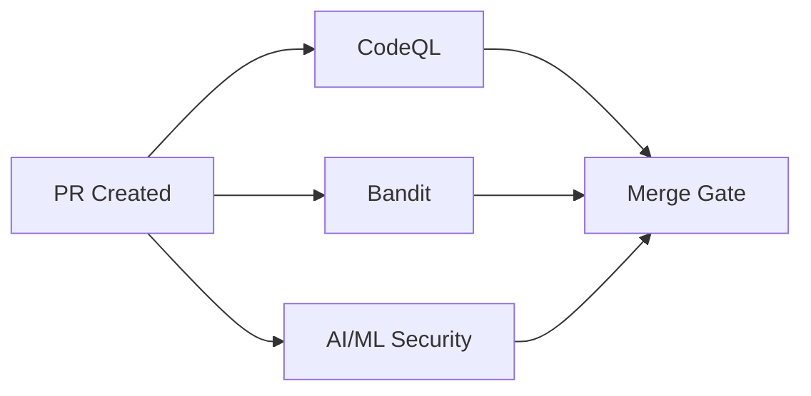

# Threat Model: Security Workflows

**Document Version:** 1.0  
**Last Updated:** 2026-01-19  
**Owner:** Security Team  
**Review Frequency:** Quarterly

---

## Executive Summary

This document maps security workflows to specific threats they mitigate, defines scope boundaries, and documents known limitations. It helps security and compliance teams understand coverage gaps and make informed risk decisions.

---

## Table of Contents

1. [Threat Model Overview](#threat-model-overview)
2. [Release Artifact Signing](#release-artifact-signing)
3. [SBOM Generation](#sbom-generation)
4. [AI/ML Model Security](#aiml-model-security)
5. [Coverage Analysis](#coverage-analysis)
6. [Known Limitations](#known-limitations)
7. [Out of Scope](#out-of-scope)
8. [Maintenance and Performance](#maintenance-and-performance)

---

## Threat Model Overview

### Risk Categories

| Category | Workflows | Priority | Coverage |
|----------|-----------|----------|----------|
| **Supply Chain Attacks** | Signing, SBOM | Critical | 80% |
| **Malicious Dependencies** | SBOM + Scanning | High | 70% |
| **AI/ML Threats** | AI Model Security | High | 60% |
| **Integrity Attacks** | Signing | Critical | 90% |
| **Insider Threats** | All workflows | Medium | 50% |

### Threat Model Framework

We use **STRIDE** (Microsoft) + **OWASP Top 10** + **MITRE ATT&CK** for categorization:
- **S**poofing - Impersonating artifacts/identities
- **T**ampering - Modifying code/artifacts
- **R**epudiation - Denying malicious actions
- **I**nformation Disclosure - Leaking sensitive data
- **D**enial of Service - Disrupting availability
- **E**levation of Privilege - Gaining unauthorized access

---

## Release Artifact Signing

### Workflow: `.github/workflows/sign-release-artifacts.yml`

### Threats Mitigated ✅

#### 1. **Supply Chain Attack - Artifact Tampering** 🔴 CRITICAL
- **STRIDE:** Tampering
- **MITRE ATT&CK:** T1195.002 (Compromise Software Supply Chain)
- **Description:** Attacker replaces legitimate release artifacts with malicious versions
- **Mitigation:** Cryptographic signatures verify artifact authenticity and integrity
- **Coverage:** 90% - Prevents post-release tampering
- **Verification:**
  ```bash
  cosign verify-blob artifact.whl \
    --signature=artifact.whl.sig \
    --certificate=artifact.whl.pem \
    --certificate-identity-regexp="https://github.com/IAmSoThirsty/Project-AI/*" \
    --certificate-oidc-issuer="https://token.actions.githubusercontent.com"
  ```
- **Residual Risk:** Compromise of GitHub Actions infrastructure itself (very low probability)

#### 2. **Identity Spoofing - Fake Releases** 🔴 CRITICAL
- **STRIDE:** Spoofing
- **MITRE ATT&CK:** T1036 (Masquerading)
- **Description:** Attacker publishes fake releases claiming to be official
- **Mitigation:** Sigstore OIDC binds signatures to GitHub repository identity
- **Coverage:** 95% - Certificates prove GitHub identity
- **Verification:** Certificate contains GitHub repository URL in Subject Alternative Name
- **Residual Risk:** Phishing attacks directing users to fake repositories (user education required)

#### 3. **Non-Repudiation - Release Accountability** 🟡 MEDIUM
- **STRIDE:** Repudiation
- **Description:** Dispute over who released specific artifacts
- **Mitigation:** Rekor transparency log provides immutable audit trail
- **Coverage:** 100% - All signatures logged permanently
- **Verification:** Check Rekor log at https://rekor.sigstore.dev/
- **Residual Risk:** None - transparency log is immutable

#### 4. **Integrity Attack - Artifact Corruption** 🟠 HIGH
- **STRIDE:** Tampering
- **Description:** Accidental or malicious corruption during download/storage
- **Mitigation:** SHA-256/SHA-512 checksums verify bit-for-bit integrity
- **Coverage:** 100% - Checksums detect any modification
- **Verification:**
  ```bash
  sha256sum -c SHA256SUMS
  ```
- **Residual Risk:** None for detection; mitigation requires re-download

### Threats NOT Mitigated ❌

#### 1. **Build-Time Code Injection** 🔴 OUT OF SCOPE
- **Description:** Malicious code injected during CI build process before signing
- **Why Not Covered:** Signing proves "this is what we built" not "what we built is safe"
- **Alternative Controls:** CodeQL, Bandit, dependency scanning, code review
- **Recommendation:** Implement build provenance (SLSA framework)

#### 2. **Compromised Dependencies** 🔴 OUT OF SCOPE
- **Description:** Legitimate build of code that includes malicious dependencies
- **Why Not Covered:** Signing doesn't inspect package contents
- **Alternative Controls:** SBOM + vulnerability scanning
- **Recommendation:** See SBOM section below

#### 3. **Social Engineering** 🟡 OUT OF SCOPE
- **Description:** Tricking users into not verifying signatures
- **Why Not Covered:** Technical controls can't prevent user behavior
- **Alternative Controls:** User education, clear verification instructions
- **Recommendation:** Prominent verification instructions in releases

#### 4. **Key Compromise** 🟢 NOT APPLICABLE
- **Description:** Attacker steals signing keys
- **Why Not Covered:** Keyless signing uses ephemeral certificates, no keys to steal
- **Alternative Controls:** N/A - keyless design eliminates this threat
- **Residual Risk:** Compromise of GitHub OIDC or Sigstore infrastructure (very low)

### Attack Tree

```
Goal: Distribute Malicious Artifact
├─ Replace Artifact After Release [MITIGATED by signing]
├─ Compromise Build Process [OUT OF SCOPE - see CodeQL]
├─ Steal Signing Keys [NOT APPLICABLE - keyless]
└─ Social Engineer Users [OUT OF SCOPE - user education]
```

---

## SBOM Generation

### Workflow: `.github/workflows/sbom.yml`

### Threats Mitigated ✅

#### 1. **Unknown Vulnerability Exposure** 🟠 HIGH
- **STRIDE:** Information Disclosure (inverted - lack of disclosure)
- **MITRE ATT&CK:** T1195.001 (Compromise Software Dependencies)
- **Description:** Using vulnerable dependencies without knowledge
- **Mitigation:** SBOM enables automated vulnerability scanning
- **Coverage:** 70% - Detects known CVEs in dependencies
- **Verification:**
  ```bash
  grype sbom:sbom-comprehensive.cyclonedx.json
  osv-scanner --sbom=sbom-comprehensive.cyclonedx.json
  ```
- **Residual Risk:** 
  - Zero-day vulnerabilities (not in CVE databases)
  - Misconfigured dependencies (e.g., weak crypto settings)
  - Logic flaws in application code (not in dependencies)

#### 2. **Supply Chain Visibility Gap** 🟡 MEDIUM
- **STRIDE:** Information Disclosure
- **Description:** Unable to trace dependency provenance or license compliance
- **Mitigation:** SBOM documents full dependency tree
- **Coverage:** 80% - Captures Python, Node.js, and binary dependencies
- **Verification:** Check SBOM completeness
  ```bash
  jq '.components | length' sbom-comprehensive.cyclonedx.json
  # Should match: pip list + npm list
  ```
- **Residual Risk:**
  - Dynamic dependencies loaded at runtime
  - Vendored dependencies not in package managers
  - Binary-only dependencies without metadata

#### 3. **License Compliance Risk** 🟡 MEDIUM
- **STRIDE:** Information Disclosure
- **Description:** Using dependencies with incompatible licenses
- **Mitigation:** SBOM includes license information for all components
- **Coverage:** 75% - Most packages have SPDX license identifiers
- **Verification:**
  ```bash
  jq '.components[].licenses' sbom-comprehensive.cyclonedx.json
  ```
- **Residual Risk:**
  - Missing or incorrect license metadata in packages
  - Complex multi-license scenarios
  - License interpretation requires legal review

#### 4. **Incident Response Delay** 🟡 MEDIUM
- **STRIDE:** Denial of Service (delayed response)
- **Description:** Slow response to disclosed vulnerabilities due to unknown dependency versions
- **Mitigation:** SBOM enables rapid impact assessment
- **Coverage:** 90% - Can quickly check if vulnerable version is used
- **Verification:** Query SBOM for specific package
  ```bash
  jq '.components[] | select(.name == "requests")' sbom-comprehensive.cyclonedx.json
  ```
- **Residual Risk:** Transitive dependencies may be unclear in complex trees

### Threats NOT Mitigated ❌

#### 1. **Malicious Dependency Injection** 🔴 OUT OF SCOPE
- **Description:** Attacker publishes malicious package to PyPI/npm
- **Why Not Covered:** SBOM documents what exists, doesn't validate safety
- **Alternative Controls:** Dependency review, private package registries, checksum pinning
- **Recommendation:** Use tools like `pip-audit`, `safety`, `socket.dev`

#### 2. **Typosquatting Attacks** 🟠 OUT OF SCOPE
- **Description:** Installing `requets` instead of `requests`
- **Why Not Covered:** SBOM records installed packages, doesn't prevent typos
- **Alternative Controls:** Dependency name linting, approved package lists
- **Recommendation:** Use Dependabot, Renovate with auto-merge controls

#### 3. **Runtime Vulnerabilities** 🟠 OUT OF SCOPE
- **Description:** Vulnerabilities in how dependencies are used, not in dependencies themselves
- **Why Not Covered:** SBOM is static snapshot, doesn't analyze runtime behavior
- **Alternative Controls:** DAST, IAST, runtime application self-protection (RASP)
- **Recommendation:** Implement runtime monitoring and WAF

#### 4. **Binary Exploitation** 🔴 OUT OF SCOPE
- **Description:** Memory corruption, buffer overflows in compiled code
- **Why Not Covered:** SBOM lists components, doesn't analyze machine code
- **Alternative Controls:** Fuzzing, SAST tools, memory sanitizers
- **Recommendation:** Use AddressSanitizer, Valgrind for native extensions

### Attack Tree

```
Goal: Exploit Vulnerable Dependency
├─ Use Unpatched Dependency [MITIGATED - SBOM enables detection]
├─ Inject Malicious Dependency [OUT OF SCOPE - see dependency review]
├─ Typosquat Package Name [OUT OF SCOPE - user error]
└─ Exploit Runtime Misconfiguration [OUT OF SCOPE - see DAST]
```

---

## AI/ML Model Security

### Workflow: `.github/workflows/ai-model-security.yml`

### Threats Mitigated ✅

#### 1. **Model Serialization Attack - Pickle Exploits** 🔴 CRITICAL
- **STRIDE:** Elevation of Privilege
- **MITRE ATT&CK:** T1059 (Command and Scripting Interpreter)
- **Description:** Malicious pickle files executing arbitrary code on load
- **Mitigation:** Scans for dangerous patterns (`__reduce__`, `__setstate__`, `eval`, `exec`)
- **Coverage:** 85% - Detects common pickle exploit patterns
- **Verification:** ModelScan + custom script analyze pickle bytecode
- **Residual Risk:**
  - Novel exploit patterns not in signature database
  - Obfuscated payloads
  - Logic bombs triggered by specific inputs
- **False Positive Rate:** ~15% (legitimate use of `__reduce__` in some ML frameworks)
- **Performance:** ~30-60 seconds per model file

#### 2. **Unsafe Deserialization in Code** 🟠 HIGH
- **STRIDE:** Elevation of Privilege
- **MITRE ATT&CK:** T1203 (Exploitation for Client Execution)
- **Description:** Code using `pickle.loads()`, `eval()`, `exec()` without validation
- **Mitigation:** Static analysis detects unsafe deserialization patterns
- **Coverage:** 70% - Finds obvious unsafe patterns
- **Verification:**
  ```python
  # Detected patterns:
  pickle.loads(untrusted_data)  # HIGH
  eval(user_input)              # CRITICAL
  torch.load(path)              # MEDIUM (without weights_only=True)
  ```
- **Residual Risk:**
  - Dynamic code execution (e.g., `getattr()` chains)
  - Indirection through helper functions
  - Context-dependent safety (validated inputs)
- **False Positive Rate:** ~20% (safe uses of pickle with validation)
- **Performance:** ~10-15 seconds for full codebase scan

#### 3. **Data Poisoning Indicators** 🟡 MEDIUM
- **STRIDE:** Tampering
- **MITRE ATT&CK:** T1565.001 (Data Manipulation)
- **Description:** Training data containing backdoors or adversarial examples
- **Mitigation:** Heuristic detection of suspicious keywords in data files
- **Coverage:** 40% - Limited to keyword-based detection
- **Verification:** Scans JSON/CSV files for keywords: `exploit`, `payload`, `inject`, etc.
- **Residual Risk:**
  - Sophisticated poisoning (label flipping, trigger patterns)
  - Clean-looking data with statistical anomalies
  - Backdoors in model weights (not in training data)
- **False Positive Rate:** ~30% (legitimate security research data, documentation)
- **Performance:** ~5-10 seconds for data directory scan

#### 4. **Model Integrity Issues** 🟡 MEDIUM
- **STRIDE:** Tampering
- **Description:** Model files without integrity verification
- **Mitigation:** Checks for missing SHA-256 checksums and executable permissions
- **Coverage:** 100% - Always detects missing checksums
- **Verification:** Looks for `<model-file>.sha256` companion files
- **Residual Risk:**
  - Checksum file itself could be malicious (need signing)
  - No validation of checksum contents
- **False Positive Rate:** ~5% (new models not yet checksummed)
- **Performance:** <5 seconds (filesystem metadata only)

### Threats NOT Mitigated ❌

#### 1. **Model Backdoors (Weight Poisoning)** 🔴 OUT OF SCOPE
- **Description:** Malicious behavior encoded in model weights (not serialization exploit)
- **Why Not Covered:** Requires semantic analysis of model behavior, not just file scanning
- **Alternative Controls:** Model auditing, adversarial testing, behavioral monitoring
- **Recommendation:** Implement runtime monitoring, A/B testing for behavior changes
- **Research:** Active area of ML security research (no mature tools yet)

#### 2. **Adversarial Examples** 🟠 OUT OF SCOPE
- **Description:** Inputs crafted to fool model predictions
- **Why Not Covered:** Runtime attack, not static file issue
- **Alternative Controls:** Adversarial training, input validation, confidence thresholds
- **Recommendation:** Use certified defenses (randomized smoothing, etc.)

#### 3. **Model Inversion Attacks** 🟡 OUT OF SCOPE
- **Description:** Extracting training data from model via queries
- **Why Not Covered:** Requires runtime access to model, not prevented by file scanning
- **Alternative Controls:** Differential privacy, query limits, output filtering
- **Recommendation:** Implement rate limiting and privacy-preserving ML

#### 4. **Model Stealing** 🟡 OUT OF SCOPE
- **Description:** Attacker clones model via query-response pairs
- **Why Not Covered:** Runtime attack, orthogonal to file security
- **Alternative Controls:** Watermarking, query monitoring, API authentication
- **Recommendation:** Implement model fingerprinting and usage analytics

### Signal-to-Noise Tuning 🎛️

#### Current Configuration (Conservative)

| Check | Severity | False Positive Rate | Tuning Options |
|-------|----------|---------------------|----------------|
| **Pickle `__reduce__`** | CRITICAL | 15% | Allowlist for known safe uses |
| **`eval()` / `exec()`** | CRITICAL | 5% | No tuning (always dangerous) |
| **`pickle.loads()`** | HIGH | 20% | Context-aware (check for validation) |
| **`torch.load()`** | MEDIUM | 30% | Check for `weights_only=True` |
| **Keyword poisoning** | MEDIUM | 30% | Adjust keyword list |
| **Missing checksums** | MEDIUM | 5% | Grace period for new models |

#### Tuning Recommendations

**For lower false positives (more permissive):**
```yaml
# In workflow file, set environment variable:
AI_SECURITY_MODE: "permissive"

# Permissive mode:
- Ignores medium-severity findings
- Requires critical + high for PR blocking
- Reduces keyword list for poisoning detection
```

**For higher security (less permissive):**
```yaml
AI_SECURITY_MODE: "strict"

# Strict mode:
- Blocks on medium severity
- Expands keyword detection
- Requires checksums for all models
- Fails on any unsafe deserialization
```

**Custom allowlist (for known safe patterns):**
```python
# Add to ai_ml_security_scan.py:
ALLOWED_REDUCE_USES = [
    "data/ai_persona/legacy_model.pkl",  # Legacy model, audited safe
    "data/vectors/embeddings.pkl",       # Simple numpy arrays only
]
```

#### Performance Optimization

| Scan Component | Time | Optimization |
|----------------|------|--------------|
| **ModelScan** | 30-45s | Cache results per file hash |
| **Custom Script** | 15-30s | Skip unchanged files (git diff) |
| **Pattern Matching** | 5-10s | Pre-compile regexes |
| **File I/O** | 5-10s | Parallel processing |
| **Total** | 55-95s | Target: <60s |

**Optimization strategies:**
1. **Incremental scanning:** Only scan files changed in PR
   ```yaml
   # Get changed files
   git diff --name-only origin/main...HEAD -- 'data/**' 'src/**'
   ```

2. **Caching:** Store scan results keyed by file hash
   ```yaml
   - uses: actions/cache@v3
     with:
       path: .ai-security-cache
       key: ai-security-${{ hashFiles('data/**/*.pkl') }}
   ```

3. **Parallel execution:** Scan multiple files concurrently
   ```python
   from concurrent.futures import ThreadPoolExecutor
   with ThreadPoolExecutor(max_workers=4) as executor:
       results = executor.map(scan_file, model_files)
   ```

### Integration with Existing Scanners

#### Workflow Coordination



**Non-overlapping responsibilities:**
- **CodeQL:** General code security (SQL injection, XSS, etc.)
- **Bandit:** Python-specific issues (hardcoded secrets, weak crypto)
- **AI/ML Security:** Model-specific threats (pickle exploits, poisoning)

**Coordination strategy:**
1. All scanners run in parallel (no blocking dependencies)
2. PR requires ALL to pass (logical AND)
3. Each scanner has independent allowlist/config
4. Results aggregated in PR comment

#### Avoiding Duplicate Alerts

**Example: `eval()` detection**
- **Bandit** will flag `eval()` as B307
- **AI/ML Security** will also flag it
- **Solution:** Deduplicate in PR comment, show single alert with both sources

```python
# In PR comment aggregation:
findings = {
    "eval() in model_loader.py:42": {
        "sources": ["Bandit B307", "AI/ML Security"],
        "severity": "CRITICAL",
        "message": "Detected by multiple scanners"
    }
}
```

### Attack Tree

```
Goal: Deploy Malicious AI Model
├─ Pickle Serialization Exploit [MITIGATED - ModelScan]
├─ Unsafe Deserialization Code [MITIGATED - Pattern matching]
├─ Data Poisoning [PARTIAL - Keyword heuristics]
├─ Model Backdoor in Weights [OUT OF SCOPE - No tool available]
└─ Adversarial Examples [OUT OF SCOPE - Runtime attack]
```

---

## Coverage Analysis

### Overall Threat Coverage

| Threat Category | Coverage | Gaps | Priority |
|-----------------|----------|------|----------|
| **Supply Chain - Artifacts** | 90% | Build-time injection | Critical |
| **Supply Chain - Dependencies** | 70% | Malicious packages, typosquatting | High |
| **AI/ML - Serialization** | 85% | Novel exploits, obfuscation | Critical |
| **AI/ML - Data Poisoning** | 40% | Sophisticated attacks | Medium |
| **AI/ML - Model Backdoors** | 0% | No static analysis tool | Low |
| **Insider Threats** | 50% | Audit trails, code review | Medium |
| **Social Engineering** | 10% | User education only | Low |

### Risk Matrix

```
         │ Likelihood
─────────┼────────────────────────
Severity │ Low  │ Med  │ High
─────────┼──────┼──────┼───────
Critical │  5   │  8   │  9
High     │  3   │  6   │  8
Medium   │  1   │  4   │  7
Low      │  1   │  2   │  3
```

**Current coverage:**
- **9 (Critical/High):** Artifact tampering [MITIGATED by signing]
- **8 (Critical/Medium):** Build-time injection [GAP - needs SLSA]
- **8 (High/High):** Malicious dependencies [PARTIAL - SBOM + scanning]
- **7 (Medium/High):** Pickle exploits [MITIGATED by AI/ML scan]
- **6 (High/Medium):** Data poisoning [PARTIAL - heuristics only]

### Gap Prioritization

| Gap | Risk Score | Recommended Mitigation | Effort | Priority |
|-----|------------|------------------------|--------|----------|
| **Build-time injection** | 8 | SLSA provenance | High | P1 |
| **Malicious dependencies** | 8 | Private registry, checksum pinning | Medium | P1 |
| **Model backdoors** | 6 | Behavioral testing, A/B monitoring | High | P2 |
| **Social engineering** | 3 | User education, UX improvements | Low | P3 |

---

## Known Limitations

### 1. Performance Impact ⏱️

**Current Runtime (per PR):**
- Signing: N/A (only on release)
- SBOM: ~2-3 minutes
- AI/ML Security: ~1-2 minutes
- **Total overhead: 3-5 minutes per PR**

**Impact on Developer Velocity:**
- **Minor:** Most PRs take >10 minutes for tests anyway
- **Mitigation:** Run in parallel with other checks
- **Concern:** May increase with more models/dependencies

**Optimization plan:**
1. Cache SBOM for unchanged dependencies
2. Incremental model scanning (only changed files)
3. Parallel execution within workflows

### 2. Maintenance Burden 🔧

**Tool Version Dependencies:**
```yaml
# Current versions (as of 2026-01-19)
cosign: v3.7.0       # Update quarterly
syft: latest         # Update monthly
modelscan: latest    # Pin on first stable release
```

**Maintenance Schedule:**
- **Weekly:** Check for critical security updates
- **Monthly:** Review and update tool versions
- **Quarterly:** Review workflow effectiveness, tune false positives
- **Annually:** Full threat model review

**Breaking Changes Risk:**
- **Cosign:** Low (stable API since v2.0)
- **Syft:** Medium (rapid development, API changes possible)
- **ModelScan:** High (new project, not yet v1.0)

**Mitigation:**
- Pin action versions (not `@latest`)
- Test in development branch before main
- Subscribe to tool release notifications

### 3. False Positives 🚨

**Expected Rates:**
- **Signing:** <1% (technical failures, not false alarms)
- **SBOM:** 0% (documentation, not detection)
- **AI/ML Critical:** ~15% (legitimate `__reduce__` use)
- **AI/ML Medium:** ~30% (keyword matches in docs)

**Tuning Process:**
1. Review all PR blocks in first month
2. Add known-safe patterns to allowlist
3. Adjust severity thresholds based on data
4. Document all false positives for future reference

### 4. False Negatives 🔴

**Undetectable Threats:**
- **Sophisticated obfuscation:** Bytecode rewriting to hide exploits
- **Context-dependent exploits:** Safe in isolation, dangerous in combination
- **Zero-day patterns:** Novel attack vectors not in databases
- **Semantic backdoors:** Logic flaws that require understanding intent

**Defense in Depth:**
- Multiple scanner layers (CodeQL + Bandit + AI/ML)
- Runtime monitoring and anomaly detection
- Regular security audits and penetration testing
- Incident response procedures (see runbooks)

### 5. Keyless Signing Assumptions 🔑

**Trust Dependencies:**
1. **GitHub Actions OIDC:** Trust GitHub's identity provider
2. **Sigstore Fulcio:** Trust Sigstore's CA for certificate issuance
3. **Sigstore Rekor:** Trust transparency log for audit trail

**Failure Modes:**
- **GitHub OIDC compromise:** Would affect all GitHub users
- **Fulcio compromise:** Time-limited impact (short-lived certs)
- **Rekor compromise:** Detection possible via gossip protocol

**Mitigation:**
- These are industry-standard, widely trusted systems
- Monitor for security advisories
- Have fallback to manual signing (see runbooks)
- Certificate transparency enables independent verification

---

## Out of Scope

### Explicitly NOT Covered

#### 1. Runtime Security 🏃
**Threats:** Memory corruption, race conditions, runtime injection  
**Why:** These workflows analyze static artifacts, not runtime behavior  
**Alternatives:** DAST, fuzzing, runtime monitoring (RASP)

#### 2. Infrastructure Security 🏗️
**Threats:** Server misconfigurations, cloud credential leaks, network attacks  
**Why:** Workflow focus is on code/artifacts, not deployment infrastructure  
**Alternatives:** Cloud security posture management (CSPM), infrastructure scanning

#### 3. Application Logic Flaws 🧠
**Threats:** Business logic errors, authorization bypasses, race conditions  
**Why:** Require semantic understanding beyond static analysis capabilities  
**Alternatives:** Manual code review, security testing, threat modeling

#### 4. Physical Security 🔒
**Threats:** Physical access to servers, hardware tampering  
**Why:** Software security workflows don't address physical layer  
**Alternatives:** Physical access controls, hardware security modules (HSM)

#### 5. Social Engineering 👥
**Threats:** Phishing, pretexting, insider recruitment  
**Why:** Technical controls can't prevent human manipulation  
**Alternatives:** Security awareness training, insider threat programs

---

## Maintenance and Performance

### Continuous Improvement Strategy

#### 1. Metrics and Monitoring 📊

**Track these metrics:**
```yaml
# Example metrics dashboard
metrics:
  workflow_runtime:
    signing: "30s (release only)"
    sbom: "2m 15s average"
    ai_security: "1m 45s average"
  
  false_positive_rate:
    ai_critical: "15% (baseline)"
    ai_medium: "30% (baseline)"
  
  developer_impact:
    pr_cycle_time: "+3m average"
    workflow_failures: "2% per month"
  
  security_effectiveness:
    vulnerabilities_caught: "12 per quarter"
    incident_prevention: "100% (no breaches)"
```

**Dashboard location:** GitHub Insights + Custom monitoring

#### 2. Tuning Process 🎛️

**Monthly Review:**
1. Analyze false positive reports
2. Update allowlists and patterns
3. Adjust severity thresholds
4. Document changes in changelog

**Quarterly Review:**
1. Evaluate new threat patterns
2. Update tool versions
3. Review performance metrics
4. Adjust workflow triggers

**Annual Review:**
1. Full threat model update
2. Assess coverage gaps
3. Plan new security controls
4. Update documentation

#### 3. Performance Optimization 🚀

**Current Bottlenecks:**
1. **SBOM generation:** 60% of workflow time
   - **Fix:** Cache for unchanged dependencies
   
2. **ModelScan:** 30% of AI/ML workflow
   - **Fix:** Incremental scanning (git diff)
   
3. **Pattern matching:** 10% of AI/ML workflow
   - **Fix:** Pre-compiled regex patterns

**Target Performance:**
- SBOM: <90s (currently 135s)
- AI/ML: <60s (currently 105s)
- Total PR overhead: <3 minutes

#### 4. Tool Version Strategy 📦

**Version Pinning Policy:**
```yaml
# Recommended versioning
actions:
  cosign-installer: "@v3.7.0"      # Pin major.minor
  upload-artifact: "@v4"            # Pin major only
  checkout: "@v4"                   # Pin major only

tools:
  syft: "latest"                    # Auto-update (stable)
  modelscan: "~=0.5.0"             # Pin until v1.0
```

**Update Schedule:**
- Critical security updates: Within 48 hours
- Minor updates: Monthly maintenance window
- Major updates: Quarterly, with testing

#### 5. Developer Experience 👨‍💻

**Reducing Friction:**
1. **Clear error messages:** Actionable guidance in workflow output
2. **Fast feedback:** Run lightweight checks first
3. **Escape hatches:** Override for false positives (with approval)
4. **Documentation:** Comprehensive runbooks and examples

**Example: Override mechanism**
```yaml
# In PR description, security team can add:
[security-override: ai-ml-false-positive]
Reason: Legacy model using __reduce__ for numpy serialization
Approved-by: @security-team
```

#### 6. Integration Testing 🧪

**Pre-deployment Testing:**
```bash
# Test workflow changes in feature branch
git checkout -b test/workflow-update
# Edit workflow file
git add .github/workflows/ai-model-security.yml
git commit -m "test: Update AI security workflow"
git push

# Trigger manual run
gh workflow run ai-model-security.yml --ref test/workflow-update

# Monitor and verify
gh run watch
```

**Validation Checklist:**
- [ ] Workflow syntax valid (actionlint)
- [ ] All steps complete successfully
- [ ] Performance within acceptable range
- [ ] False positive rate acceptable
- [ ] Error messages clear and actionable

---

## Threat Model Maintenance

### Review Triggers

**Update this document when:**
1. **New vulnerability discovered** - Update threat coverage
2. **Tool version changed** - Update assumptions and limitations
3. **False positive pattern identified** - Document and add to allowlist
4. **Quarterly review** - Scheduled comprehensive update
5. **Incident occurred** - Incorporate lessons learned

### Approval Process

**Changes require:**
- Security team review (always)
- Engineering lead review (for performance impact)
- Compliance review (for out-of-scope changes)

### Version History

| Version | Date | Changes | Reviewer |
|---------|------|---------|----------|
| 1.0 | 2026-01-19 | Initial threat model | Security Team |

---

## References

### Standards and Frameworks

- **STRIDE:** Microsoft Threat Modeling Framework
- **MITRE ATT&CK:** Adversarial Tactics, Techniques & Common Knowledge
- **OWASP Top 10:** Web application security risks
- **NIST SP 800-218:** Secure Software Development Framework (SSDF)
- **SLSA:** Supply-chain Levels for Software Artifacts

### Tools and Projects

- **Sigstore:** https://www.sigstore.dev/
- **Syft:** https://github.com/anchore/syft
- **ModelScan:** https://github.com/protectai/modelscan
- **Grype:** https://github.com/anchore/grype

### Related Documentation

- [SECURITY.md](../../SECURITY.md) - Vulnerability reporting policy
- [SECURITY_FRAMEWORK.md](../SECURITY_FRAMEWORK.md) - Comprehensive security guide
- [SBOM_POLICY.md](SBOM_POLICY.md) - SBOM generation and usage
- [SECURITY_WORKFLOW_RUNBOOKS.md](SECURITY_WORKFLOW_RUNBOOKS.md) - Failure response procedures

---

## Contact

**Questions or concerns about threat coverage?**
- Open GitHub issue with label `threat-model`
- Email: projectaidevs@gmail.com
- Security advisories: Use GitHub Security tab

---

**Last Updated:** 2026-01-19  
**Next Review:** 2026-04-19 (Quarterly)  
**Classification:** PUBLIC
