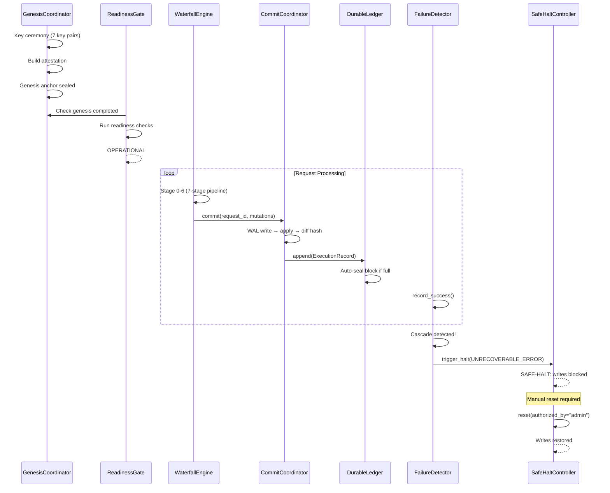

# PSIA v1.0 — Project-AI Sovereign Immune Architecture

**Version:** 1.0.0  
**Status:** Implemented  
**Date:** 2026-02-22  

---

## Table of Contents

1. [Overview](#1-overview)
2. [Architectural Planes](#2-architectural-planes)
3. [Canonical Schemas](#3-canonical-schemas)
4. [Root Invariants](#4-root-invariants)
5. [Waterfall Pipeline](#5-waterfall-pipeline)
6. [Gate Plane — Cerberus](#6-gate-plane--cerberus)
7. [Canonical Plane](#7-canonical-plane)
8. [Bootstrap and Lifecycle](#8-bootstrap-and-lifecycle)
9. [Observability and Failure Recovery](#9-observability-and-failure-recovery)
10. [Event Taxonomy](#10-event-taxonomy)
11. [Security Model](#11-security-model)
12. [Deployment and Operations](#12-deployment-and-operations)

---

## 1. Overview

PSIA is a defense-in-depth immune system for AI agent operations. It ensures that every action taken by an AI agent passes through a multi-stage verification pipeline before modifying canonical state, with all decisions recorded in an immutable, append-only ledger.

### 1.1 Design Principles

| Principle | Description |
|-----------|-------------|
| **Plane Isolation** | Six architectural planes with strict capability boundaries; a compromised plane cannot escalate |
| **Defense in Depth** | 7-stage sequential waterfall pipeline — each stage can independently deny a request |
| **Immutable Audit** | Append-only ledger with Merkle-root block sealing and external anchoring |
| **Constitutional Invariants** | 9 non-negotiable root invariants enforced at every layer |
| **Byzantine Fault Tolerance** | Cerberus triple-head gate with weighted BFT quorum consensus |
| **Fail-Safe** | On integrity failure → SAFE-HALT mode: block writes, allow reads, require manual recovery |

### 1.2 Package Layout

```
src/psia/
├── __init__.py
├── invariants.py            # 9 root invariant definitions
├── planes.py                # 6 plane isolation contracts
├── events.py                # 30+ event types + EventBus
├── schemas/
│   ├── identity.py          # IdentityDocument, Signature, keys
│   ├── capability.py        # CapabilityToken, scopes, delegation
│   ├── request.py           # RequestEnvelope, Intent, Context
│   ├── policy.py            # PolicyGraph, nodes, edges
│   ├── invariant.py         # InvariantDefinition, expressions, test cases
│   ├── shadow_report.py     # ShadowReport, determinism proof
│   ├── cerberus_decision.py # CerberusVote, CerberusDecision, quorum
│   └── ledger.py            # ExecutionRecord, LedgerBlock
├── waterfall/
│   ├── engine.py            # WaterfallEngine orchestrator
│   ├── stage_0_structural.py
│   ├── stage_1_signature.py
│   ├── stage_2_behavioral.py
│   ├── stage_3_shadow.py
│   ├── stage_4_gate.py
│   ├── stage_5_commit.py
│   └── stage_6_memory.py
├── gate/
│   ├── identity_head.py     # 7-check DID verification
│   ├── capability_head.py   # 8-check token enforcement
│   ├── invariant_head.py    # Heuristic invariant evaluation
│   └── quorum_engine.py     # Weighted BFT consensus
├── canonical/
│   ├── commit_coordinator.py # ACID-like transactional commits
│   ├── ledger.py            # Append-only DurableLedger
│   └── capability_authority.py # Token issuance, revocation, rotation
├── bootstrap/
│   ├── genesis.py           # Genesis key ceremony
│   ├── readiness.py         # ReadinessGate, node status
│   └── safe_halt.py         # SAFE-HALT controller
└── observability/
    ├── failure_detector.py  # Circuit breaker, cascade detection
    └── autoimmune_dampener.py # False positive suppression
```

---

## 2. Architectural Planes

PSIA operates across six isolated planes, each with a strict contract defining allowed capabilities, forbidden actions, storage mode, and network access pattern.

### 2.1 Plane Definitions

| Plane | Storage | Network | Description |
|-------|---------|---------|-------------|
| **Canonical** | Read-Write | Gate-Only | Authoritative state store; only Gate Plane can invoke mutations |
| **Shadow** | Read-Only | Internal | Read-only canonical snapshot + local shadow diffs; never writes to canonical |
| **Adaptive** | Append-Only | Internal | Emits proposals only; cannot directly modify governance or canonical state |
| **Gate** | Read-Write | Internal | Triple-head evaluation; only plane that can call CommitCoordinator |
| **Reflex** | Append-Only | Telemetry Export | Kernel-level containment (eBPF/LSM); cannot legislate or mutate governance |
| **Ingress** | None | Edge-Facing | Stateless edge-facing ingress; mTLS, WAF-like prechecks |

### 2.2 Capability Matrix

15 atomic capabilities are distributed across planes:

| Capability | Canonical | Shadow | Adaptive | Gate | Reflex | Ingress |
|------------|:---------:|:------:|:--------:|:----:|:------:|:-------:|
| `READ_CANONICAL` | ✅ | — | — | ✅ | — | ✅ |
| `WRITE_CANONICAL` | ✅ | ❌ | ❌ | — | ❌ | ❌ |
| `READ_SHADOW` | — | ✅ | ✅ | ✅ | — | — |
| `WRITE_SHADOW` | — | ✅ | — | ❌ | — | — |
| `EMIT_PROPOSAL` | ❌ | — | ✅ | ❌ | ❌ | ❌ |
| `SIGN_DECISION` | — | ❌ | ❌ | ✅ | ❌ | ❌ |
| `ENFORCE_CONTAINMENT` | ❌ | ❌ | ❌ | — | ✅ | ❌ |
| `ACCEPT_REQUEST` | ❌ | — | — | ❌ | — | ✅ |
| `APPEND_LEDGER` | ✅ | ❌ | ❌ | — | — | ❌ |
| `READ_LEDGER` | — | — | ✅ | ✅ | — | — |
| `STREAM_TELEMETRY` | — | ✅ | ✅ | — | ✅ | — |
| `COMPILE_POLICY` | — | — | — | — | ❌ | ✅ |
| `FETCH_SNAPSHOT` | — | ✅ | — | — | — | — |
| `REVOKE_IDENTITY` | ✅ | ❌ | ❌ | — | ❌ | — |
| `ISSUE_TOKEN` | ✅ | ❌ | ❌ | — | ❌ | ❌ |

✅ = allowed, ❌ = explicitly forbidden, — = not assigned

### 2.3 Enforcement

```python
def validate_plane_action(plane: Plane, capability: PlaneCapability) -> bool:
    contract = PLANE_CONTRACTS.get(plane)
    if contract is None:
        return False
    if capability in contract.forbidden_capabilities:
        return False
    return capability in contract.allowed_capabilities
```

---

## 3. Canonical Schemas

All 8 schemas are Pydantic v2 `BaseModel` subclasses with strict validation, immutable fields, and deterministic hash computation.

### 3.1 IdentityDocument

```
PublicKeyEntry(kid, kty="ed25519", pub, created, expires?)
IdentityAttributes(org, role, risk_tier: low|medium|high|critical)
RevocationStatus(status: active|revoked, revoked_at?, reason?)
Signature(alg, kid?, sig)
IdentityDocument(id: DID, type, public_keys[], attributes, revocation, signature)
```

### 3.2 CapabilityToken

```
ScopeConstraints(rate_limit_per_min?, time_window?, network_zones[]?)
CapabilityScope(resource, actions[], constraints?)
DelegationPolicy(is_delegable, max_depth)
TokenBinding(client_cert_fingerprint?, device_attestation?)
CapabilityToken(
    token_id, issuer, subject, issued_at, expires_at, nonce,
    scope: CapabilityScope[], delegation, binding?, signature
)
```

### 3.3 RequestEnvelope

```
Intent(action, resource, parameters: dict, justification?)
RequestContext(client_ip?, user_agent?, session_id?, trace_id, risk_hints: dict)
RequestTimestamps(created_at, received_at?)
RequestEnvelope(
    request_id, actor: DID, subject: DID, capability_token_id,
    intent, context, timestamps, signature
)
  → compute_hash() → SHA-256 of deterministic JSON serialization
```

### 3.4 PolicyGraph

```
PolicyNode(id, type: subject|action|resource|constraint|decision, value: dict)
PolicyEdge(from_node, to_node)
PolicyGraph(policy_id, version, hash, nodes[], edges[], signatures[])
```

### 3.5 InvariantDefinition

```
InvariantScope: constitutional | operational | immutable
InvariantSeverity: fatal | critical | high | medium | low
InvariantEnforcement: hard_deny | quarantine | rate_limit | require_shadow | require_quorum
InvariantExpression(language: first_order_logic|dsl, expr: str)
InvariantTestCase(name, given: dict, expect: str)
InvariantDefinition(
    invariant_id, version, scope, severity, enforcement,
    expression, tests: InvariantTestCase[], signature
)
```

### 3.6 ShadowReport

```
DeterminismProof(runtime_version, seed, replay_hash, replay_verified)
ResourceEnvelope(cpu_ms, mem_peak_bytes, io_bytes, syscalls[])
InvariantViolation(invariant_id, severity, details)
PrivilegeAnomaly(type, details)
SideEffectSummary(canonical_diff_simulated_hash, writes_attempted[])
ShadowResults(
    divergence_score, resource_envelope, invariant_violations[],
    privilege_anomalies[], side_effect_summary?
)
ShadowReport(
    request_id, shadow_job_id, snapshot_id, determinism,
    results, timestamp, signature
)
```

### 3.7 CerberusDecision

```
DenyReason(code, detail)
ConstraintsApplied(rate_limit_per_min?, require_shadow?, require_quorum?)
CerberusVote(
    request_id, head: identity|capability|invariant,
    decision: allow|deny|quarantine|escalate,
    reasons: DenyReason[], constraints_applied?, timestamp, signature
)
QuorumInfo(required: unanimous|2of3|simple, achieved: bool, voters[])
CommitPolicy(allowed, requires_shadow_hash_match, requires_anchor_append)
CerberusDecision(
    request_id, severity, final_decision,
    votes: CerberusVote[], quorum, commit_policy,
    timestamp, signature_set[]
)
```

### 3.8 LedgerBlock

```
RecordTimestamps(received_at, decided_at, committed_at)
ExecutionRecord(
    record_id, request_id, actor, capability_token_id,
    inputs_hash, shadow_hash, decision_hash, canonical_diff_hash,
    result, timestamps, signature
)
TimeProof(method: rfc3161|trusted_timestamp, proof)
LedgerBlock(
    height, previous_block_hash, merkle_root,
    records: ExecutionRecord[], time_proof?, validator_signatures[]
)
```

---

## 4. Root Invariants

9 immutable, fatal-severity constraints that form the constitutional bedrock.

| ID | Expression | Enforcement |
|----|-----------|-------------|
| **INV-ROOT-1** | `∀ mutation M: M.committed ⇒ (M.pipeline == 'commit' ∧ M.cerberus_approved)` | `hard_deny` |
| **INV-ROOT-2** | `∀ op ∈ shadow_plane: op.target ≠ 'canonical' ∧ op.write == false` | `hard_deny` |
| **INV-ROOT-3** | `∀ decision D: ∃ ledger_record R: R.decision_hash == hash(D)` | `hard_deny` |
| **INV-ROOT-4** | `∀ tarl_output T: T.channel == 'proposal' ∧ ¬T.direct_modify` | `require_quorum` |
| **INV-ROOT-5** | `∀ artifact A: ∃ attestation AT: AT.hash == hash(A) ∧ AT.reproducible` | `hard_deny` |
| **INV-ROOT-6** | `∀ privileged_action P: ∃ token T: T.covers(P) ∧ T.is_least_privilege` | `hard_deny` |
| **INV-ROOT-7** | `∀ stage_i, stage_j: i < j ⇒ severity(stage_i) ≤ severity(stage_j)` | `quarantine` |
| **INV-ROOT-8** | `∀ reflex_action R: R.type ∈ {throttle, contain, kill} ∧ ¬R.legislate ∧ ¬R.mutate_governance` | `hard_deny` |
| **INV-ROOT-9** | `anchor_integrity_check() == false ⇒ system.enter_safe_halt()` | `hard_deny` |

All invariants are immutable scope, fatal severity, v1, and signed with `ed25519` governance key. Each includes ≥2 embedded test cases.

---

## 5. Waterfall Pipeline

7-stage sequential pipeline. Each stage can independently `allow`, `deny`, or `quarantine` a request. The pipeline aborts immediately on deny/quarantine.

```
┌─────────────────────────────────────────────────────────────────────────┐
│  Stage 0       Stage 1        Stage 2        Stage 3                   │
│  Structural → Signature  →  Behavioral →   Shadow   →                 │
│  (schema,     (threat        (baseline      (simulation,               │
│   token,       fingerprint    profiling,     determinism                │
│   nonce)       matching)      deviation)     proof)                     │
│                                                                         │
│  Stage 4       Stage 5        Stage 6                                  │
│  → Gate    →   Commit     →  Memory                                    │
│  (Cerberus     (canonical     (ledger                                  │
│   triple-head,  mutation,     append,                                  │
│   BFT quorum)   WAL, ACID)    Merkle seal)                             │
└─────────────────────────────────────────────────────────────────────────┘
```

### 5.1 Stage 0 — Structural Validation

- Schema validation (`RequestEnvelope` well-formed)
- Capability token existence and signature verification
- Token expiry check with clock-skew tolerance
- Nonce replay prevention (in-memory nonce set)

### 5.2 Stage 1 — Threat Fingerprinting

- `ThreatFingerprintStore`: in-memory store of known-bad fingerprints
- Cross-references actor DID, device attestation, resource against store
- Match → quarantine or deny based on severity

### 5.3 Stage 2 — Behavioral Analysis

- `BaselineProfileStore`: per-subject action frequency and resource access patterns
- Deviation scoring: rate anomaly, unusual target, unusual time
- Above threshold → require shadow; extreme → pre-containment event

### 5.4 Stage 3 — Shadow Simulation

- Dispatches to `ShadowExecutionPlane.execute_simulation()`
- Produces `ShadowReport` with `DeterminismProof`
- Cross-node replay verification (logs warning if single-node)
- Replay hash mismatch → quarantine + `ShadowIntegrityEvent`

### 5.5 Stage 4 — Cerberus Gate

- Runs Identity / Capability / Invariant heads
- Collects `CerberusVote` from each head
- Delegates to `QuorumEngine` for final `CerberusDecision`

### 5.6 Stage 5 — Canonical Commit

- Validates `CerberusDecision.allowed`
- Applies mutation via `CommitCoordinator` with ACID guarantees
- Computes `canonical_diff_hash`
- Automatic rollback on failure

### 5.7 Stage 6 — Memory (Ledger)

- Appends `ExecutionRecord` to `DurableLedger`
- Automatic block sealing at configurable threshold (default: 64 records)
- Merkle root computation per block
- Threat fingerprint / baseline update

### 5.8 INV-ROOT-7 Enforcement

The pipeline enforces monotonic severity: once a stage records a severity level, subsequent stages cannot report a lower severity. This is validated inline in `WaterfallEngine.process()`.

---

## 6. Gate Plane — Cerberus

### 6.1 Identity Head (7 Checks)

| # | Check | Failure Effect |
|---|-------|---------------|
| 1 | DID format validation | Deny |
| 2 | Identity resolution (registry lookup) | Deny |
| 3 | Revocation status | Deny |
| 4 | Key validity (expiry, key type) | Deny |
| 5 | Device attestation binding | Quarantine |
| 6 | Cross-identity anomaly detection | Quarantine |
| 7 | Risk tier evaluation | Escalate or deny |

### 6.2 Capability Head (8 Checks)

| # | Check | Failure Effect |
|---|-------|---------------|
| 1 | Token resolution (registry lookup) | Deny |
| 2 | Revocation check (CRL) | Deny |
| 3 | Expiry check (with clock-skew tolerance) | Deny |
| 4 | Scope matching (resource + action) | Deny |
| 5 | Delegation depth validation | Deny |
| 6 | Token binding verification | Deny |
| 7 | Rate-limit constraint check | Quarantine |
| 8 | Constraint propagation | Escalate |

### 6.3 Invariant Head

- Heuristic evaluation of INV-ROOT-* against request context
- Shadow report cross-check for divergence
- Severity aggregation across all triggered invariants

### 6.4 Quorum Engine

Weighted BFT consensus with 4 policies:

| Policy | Requirement |
|--------|-------------|
| `unanimous` | All 3 heads must agree |
| `2of3` | At least 2 heads must agree |
| `simple` | Simple majority |
| `bft` | Byzantine fault tolerant (weighted quorum) |

Properties:

- **Monotonic severity escalation**: final severity ≥ max(head severities)
- **Constraint merging**: union of all head constraints
- **Override prevention**: deny votes cannot be overridden by allow votes in `unanimous` mode

---

## 7. Canonical Plane

### 7.1 CommitCoordinator

ACID-like transactional commits to a versioned KV store.

```python
commit(
    request_id: str,
    mutations: dict[str, Any],
    actor: str = "system",
    cerberus_decision: CerberusDecision | None = None,
    expected_versions: dict[str, int] | None = None,
) -> CommitResult
```

| Feature | Implementation |
|---------|---------------|
| **Atomicity** | WAL (write-ahead log) + automatic rollback on failure |
| **Consistency** | `CerberusDecision` precondition validation |
| **Isolation** | Single-threaded; production: distributed locks |
| **Durability** | In-memory + WAL replay on crash recovery |
| **OCC** | Optional `expected_versions` for optimistic concurrency control |
| **Diff Hashing** | SHA-256 of `{key: {old, new}}` for audit trail |

### 7.2 CanonicalStore

Versioned key-value store returning `VersionedValue(value, version)`:

```python
store.get(key: str) -> VersionedValue | None  # .value, .version
store.set(key: str, value: Any) -> int          # returns new version
store.delete(key: str) -> bool
store.snapshot() -> dict[str, VersionedValue]
```

### 7.3 DurableLedger

Append-only ledger with Merkle-root block sealing.

```python
ledger.append(record: ExecutionRecord) -> str  # returns SHA-256 hash
ledger.force_seal() -> LedgerBlock | None
ledger.verify_chain() -> bool
ledger.anchor_block(block_id: int, anchor_hash: str) -> bool
```

| Property | Guarantee |
|----------|-----------|
| **Append-only** | INV-ROOT-9: no mutation or deletion of existing records |
| **Block sealing** | Auto-seal at `block_size` records (default: 64) |
| **Merkle roots** | Per-block SHA-256 Merkle tree over record hashes |
| **Chain integrity** | Genesis hash → block[0] → block[1] → ... (linked list) |
| **External anchoring** | Optional anchor hash (e.g., RFC 3161 TSA, blockchain) |

### 7.4 CapabilityAuthority

Token lifecycle management.

```python
authority.issue(subject, scopes: list[CapabilityScope], ...) -> CapabilityToken
authority.revoke(token_id, reason) -> bool
authority.rotate(old_token_id) -> CapabilityToken | None
authority.is_valid(token_id) -> bool
```

Enforces INV-ROOT-5 (attestation) and INV-ROOT-6 (least privilege). Maintains:

- Token registry (active tokens)
- CRL (Certificate Revocation List)
- Full audit trail

---

## 8. Bootstrap and Lifecycle

### 8.1 GenesisCoordinator

One-time key ceremony creating the root of trust.

```
GenesisCoordinator(node_id: str)
  .execute() -> GenesisResult
    1. Generate Ed25519 key pairs for 7 components:
       governance, canonical, ledger, gate, shadow, reflex, ingress
    2. Create build attestation:
       binary hash + invariant hash + schema hash + config hash
    3. Create genesis anchor (sealed initial state hash)
    4. Idempotent: re-execution is a no-op
```

### 8.2 ReadinessGate

Framework for pre-operational health checks.

```
ReadinessGate()
  .register_genesis_check(genesis: GenesisCoordinator)
  .register_check(name, check_fn: () -> (bool, str))
  .evaluate() -> ReadinessReport
```

Lifecycle transitions:

```
INITIALIZING → CHECKING → OPERATIONAL | DEGRADED | FAILED
```

- **Critical checks** → must all pass for OPERATIONAL
- **Warning checks** → failures produce DEGRADED (still functional)
- **Strict mode** → warnings also block OPERATIONAL

### 8.3 SafeHaltController

Emergency shutdown with write-blocking and read passthrough.

```
SafeHaltController(node_id: str)
  .trigger_halt(reason: HaltReason, details, triggered_by) -> HaltEvent
  .check_write_allowed() -> None | raises SafeHaltError
  .check_read_allowed() -> None  # always succeeds
  .reset(authorized_by: str) -> bool
```

| HaltReason | Trigger |
|------------|---------|
| `INVARIANT_VIOLATION` | Root invariant breached |
| `UNRECOVERABLE_ERROR` | Cascade failure detected |
| `ADMINISTRATIVE` | Manual operator halt |
| `SECURITY_INCIDENT` | Automated security response |
| `CHAIN_CORRUPTION` | Ledger chain integrity failure |
| `KEY_COMPROMISE` | Cryptographic key exposed |

Properties:

- Monotonic halt: writes blocked permanently until manual `reset()`
- In-flight transaction tracking and abort counting
- Full audit trail of halt/reset events

---

## 9. Observability and Failure Recovery

### 9.1 FailureDetector

Per-component health monitoring with circuit breakers.

```python
FailureDetector(
    window_seconds: float = 60.0,
    failure_threshold: float = 0.5,
    recovery_timeout: float = 30.0,
    cascade_threshold: int = 2,
    on_cascade: Callable[[CascadeAlert], None] | None = None,
)
```

| Feature | Description |
|---------|-------------|
| **Sliding window** | Tracks success/failure events within `window_seconds` |
| **Failure rate** | `failures / (successes + failures)` within window |
| **Z-score anomaly** | Statistical anomaly detection over historical failure rates |
| **Circuit breaker** | 3-state: `CLOSED` → `OPEN` → `HALF_OPEN` → `CLOSED` |
| **Cascade detection** | Fires `on_cascade` when `≥ cascade_threshold` circuits are open simultaneously |

Circuit breaker state transitions:

```
CLOSED  →  (failure_rate > threshold)  →  OPEN
OPEN    →  (recovery_timeout elapsed)  →  HALF_OPEN
HALF_OPEN → (success recorded)        →  CLOSED
HALF_OPEN → (failure recorded)        →  OPEN
```

### 9.2 AutoimmuneDampener

Prevents over-aggressive security rules from causing denial-of-service.

```python
AutoimmuneDampener(
    target_fp_rate: float = 0.05,
    min_sensitivity: float = 0.3,
    max_sensitivity: float = 1.0,
    adjustment_step: float = 0.05,
    cooldown_decisions: int = 10,
)
```

| Feature | Description |
|---------|-------------|
| **Per-rule tracking** | Independent sensitivity for each security rule |
| **False positive rate** | `false_positives / total_denials` |
| **Dynamic adjustment** | Sensitivity decreased when FP rate > target; increased when below |
| **Bounded** | Sensitivity clamped to `[min_sensitivity, max_sensitivity]` |
| **Cooldown** | Adjustments only after `cooldown_decisions` new decisions |
| **Dampened scoring** | `should_apply_rule(rule_id, base_score)` → `base_score * sensitivity > 0.5` |

---

## 10. Event Taxonomy

34 structured event types across 10 categories:

| Category | Events |
|----------|--------|
| **Waterfall** | `waterfall.start`, `waterfall.stage.enter`, `waterfall.stage.exit` |
| **Request** | `request.denied`, `request.allowed`, `request.quarantined` |
| **Shadow** | `shadow.job.started`, `shadow.job.completed`, `shadow.determinism.mismatch`, `shadow.integrity.event` |
| **Cerberus** | `cerberus.vote.cast`, `cerberus.decision.final` |
| **Commit** | `commit.started`, `commit.succeeded`, `commit.rolled_back` |
| **Ledger** | `ledger.append.succeeded`, `ledger.append.failed`, `ledger.anchor.failed`, `ledger.block.sealed` |
| **Reflex** | `octoreflex.triggered`, `octoreflex.throttle.applied`, `octoreflex.process.frozen`, `octoreflex.process.killed` |
| **Identity** | `identity.key.rotated`, `identity.revoked`, `capability.token.revoked`, `capability.token.issued` |
| **System** | `system.safe_halt.entered`, `system.safe_halt.exited` |
| **Governance** | `governance.proposal.submitted`, `governance.proposal.approved`, `governance.proposal.rejected`, `governance.policy.activated`, `governance.policy.rolled_back` |
| **Behavioral** | `behavioral.baseline.updated`, `behavioral.threat.fingerprint.added`, `behavioral.anomaly` |
| **Bootstrap** | `bootstrap.genesis.anchor.created`, `bootstrap.readiness.gate.passed`, `bootstrap.node.joined` |

### 10.1 Event Structure

```python
@dataclass(frozen=True)
class PSIAEvent:
    event_id: str           # "evt_{uuid_hex[:16]}"
    event_type: EventType
    trace_id: str
    request_id: str
    subject: str            # DID
    severity: EventSeverity # debug|info|warning|error|critical|fatal
    timestamp: str          # ISO 8601 UTC
    payload: dict           # event-specific data
    artifact_hashes: dict   # hash pointers for ledger anchoring
```

### 10.2 EventBus

In-memory pub/sub with:

- Per-type and wildcard (`None`) subscriber registration
- Synchronous delivery with error isolation
- Ring-buffer event history (default: 10,000 events)
- `drain(limit?)` for consuming/clearing history

---

## 11. Security Model

### 11.1 Trust Boundaries

```
┌─────────────────────────────────────────────────────────────┐
│  INGRESS (Edge)           → mTLS, WAF prechecks            │
│  ┌───────────────────────────────────────────────────────┐  │
│  │  Waterfall Pipeline    → 7-stage sequential filter    │  │
│  │  ┌─────────────────────────────────────────────────┐  │  │
│  │  │  GATE (Cerberus)   → BFT quorum, 3 heads       │  │  │
│  │  │  ┌───────────────────────────────────────────┐  │  │  │
│  │  │  │  CANONICAL       → ACID commits, ledger   │  │  │  │
│  │  │  └───────────────────────────────────────────┘  │  │  │
│  │  └─────────────────────────────────────────────────┘  │  │
│  └───────────────────────────────────────────────────────┘  │
│  SHADOW (isolated)        → read-only snapshot             │
│  REFLEX (kernel)          → eBPF containment only          │
│  ADAPTIVE (proposal-only) → T.A.R.L. learning             │
└─────────────────────────────────────────────────────────────┘
```

### 11.2 Cryptographic Primitives

| Use Case | Algorithm | Key Size |
|----------|-----------|----------|
| Identity / Artifact Signing | Ed25519 | 256-bit |
| Hash Computation | SHA-256 | 256-bit |
| Nonce Generation | UUID v4 | 128-bit |
| Merkle Trees | SHA-256 binary tree | — |

### 11.3 Threat Mitigations

| Threat | Mitigation |
|--------|-----------|
| **Replay attack** | Nonce set in Stage 0 (Structural) |
| **Privilege escalation** | Capability tokens with least-privilege scoping (INV-ROOT-6) |
| **Shadow-to-canonical write** | Plane isolation contract (INV-ROOT-2) |
| **Governance tampering** | Proposal-only channel for T.A.R.L. (INV-ROOT-4) |
| **Ledger mutation** | Append-only with Merkle anchoring (INV-ROOT-3, INV-ROOT-9) |
| **Severity downgrade** | Monotonic waterfall strictness (INV-ROOT-7) |
| **Cascade failure** | Circuit breaker + cascade detector → SAFE-HALT |
| **False positive DoS** | Autoimmune dampener with per-rule sensitivity tuning |

---

## 12. Deployment and Operations

### 12.1 Dependencies

| Package | Version | Purpose |
|---------|---------|---------|
| `pydantic` | ≥2.0 | Schema validation, serialization |
| `python` | ≥3.12 | Runtime (type hints, walrus, match) |

No external services required for the core framework. Production deployments add:

- PostgreSQL / DynamoDB for persistent canonical store
- Redis for distributed locks and nonce dedup
- OpenTelemetry for tracing export
- Prometheus + Grafana for metrics
- RFC 3161 TSA for external ledger anchoring

### 12.2 Lifecycle Sequence



### 12.3 Test Coverage

**329 tests** across 8 suites:

| Suite | Tests | Coverage |
|-------|-------|----------|
| `test_psia_schemas` | 36 | All 8 schemas: round-trip, validation, hashing |
| `test_psia_waterfall` | 31 | 7-stage pipeline: pass/deny/quarantine per stage |
| `test_psia_gate` | 33 | Cerberus heads, quorum policies, BFT consensus |
| `test_psia_canonical` | 49 | CommitCoordinator, DurableLedger, CapabilityAuthority |
| `test_psia_bootstrap` | 33 | Genesis, ReadinessGate, SafeHaltController |
| `test_psia_observability` | 26 | FailureDetector, AutoimmuneDampener |
| `test_psia_invariants` | 108 | All 9 INV-ROOT-*: registry, schema, fuzzing |
| `test_psia_integration` | 13 | Cross-plane end-to-end lifecycle |

---

*PSIA v1.0 — Project-AI Sovereign Immune Architecture. Constitutional security for autonomous AI systems.*
