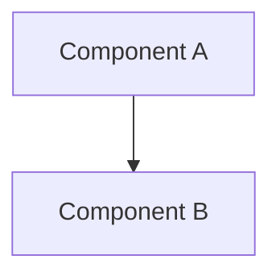

# Template Usage Guide

## Table of Contents

1. [Quick Start](#quick-start)
2. [Step-by-Step Template Application](#step-by-step-template-application)
3. [Template Selection Guide](#template-selection-guide)
4. [Practical Examples](#practical-examples)
5. [Advanced Techniques](#advanced-techniques)
6. [Troubleshooting](#troubleshooting)
7. [Best Practices](#best-practices)

---

## Quick Start

### Prerequisites

Before using templates, ensure you have:

1. **Obsidian installed** (version 1.0.0 or later)
2. **Templater plugin installed and enabled**
   - Community Plugins → Browse → Search "Templater" → Install → Enable
3. **Template folder configured**
   - Settings → Templater → Template folder location → `templates/`
4. **Hotkey configured** (recommended: `Alt+E`)
   - Settings → Hotkeys → Search "Templater: Insert Template" → Assign key

### 30-Second Usage

1. Create a new note in your desired location
2. Press `Alt+E` (or your configured Templater hotkey)
3. Select template from list
4. Fill in prompts
5. Begin writing

---

## Step-by-Step Template Application

### Method 1: Using Templater Hotkey (Fastest)

**Step 1: Navigate to Target Location**
```
knowledge-vault/modules/     (for module documentation)
knowledge-vault/agents/      (for agent reports)
knowledge-vault/architecture/ (for architecture docs)
knowledge-vault/guides/      (for user guides)
```

**Step 2: Create New Note**
- Click "New note" button, OR
- Press `Ctrl+N`, OR
- Right-click folder → "New note"

**Step 3: Name Your Note**
Follow naming conventions:
- Module docs: `{module-name}.md` (e.g., `notification-service.md`)
- Agent docs: `agent-{id}-{task}-{date}.md` (e.g., `agent-015-security-audit-2025-04.md`)
- Architecture: `adr-{number}-{title}.md` (e.g., `adr-003-sqlite-migration.md`)
- Guides: `{topic}-{type}.md` (e.g., `deployment-quickstart.md`)

**Step 4: Insert Template**
- Press `Alt+E`
- Templater modal appears with template list

**Step 5: Select Template**
- Use arrow keys or mouse to navigate
- Press `Enter` to select
- Templates are organized by category prefix

**Step 6: Complete Prompts**
- Templater will prompt for dynamic values
- Fill in each field accurately
- Press `Enter` to proceed to next prompt
- Press `Esc` to cancel

**Step 7: Review and Edit**
- Template inserts with all sections
- Cursor auto-positions at first edit point
- Complete remaining content sections

### Method 2: Using Command Palette

**Step 1: Create Note**
- Create new note at target location

**Step 2: Open Command Palette**
- Press `Ctrl+P`

**Step 3: Search for Templater**
- Type "templater insert"
- Select "Templater: Insert Template"

**Step 4: Choose Template**
- Select from list
- Complete prompts as in Method 1

### Method 3: Using Templater Ribbon Icon

**Step 1: Create Note**
- Create new note

**Step 2: Click Ribbon Icon**
- Look for scroll/document icon in left sidebar
- Click to open template selector

**Step 3: Select and Complete**
- Choose template
- Fill prompts

---

## Template Selection Guide

### Decision Tree

```
What are you documenting?

├─ Code/Implementation
│  ├─ Core business logic → module-doc-core-system.md
│  ├─ GUI component → module-doc-gui-component.md
│  └─ AI agent → module-doc-agent.md
│
├─ Agent Task/Execution
│  ├─ General task completion → agent-doc-task-report.md
│  ├─ Security findings → agent-doc-security-audit.md
│  └─ Multi-agent convergence → agent-doc-convergence-summary.md
│
├─ Architecture/Design
│  ├─ Major decision → architecture-doc-adr.md
│  ├─ External API integration → architecture-doc-integration-api.md
│  └─ Design pattern → architecture-doc-design-pattern.md
│
└─ User-Facing Documentation
   ├─ New feature onboarding → guide-quickstart-feature.md
   ├─ Production issues → guide-troubleshooting-production.md
   └─ API reference → guide-developer-reference.md
```

### Template Comparison Matrix

| Template | Complexity | Time | Primary Use | Output Length |
|----------|-----------|------|-------------|---------------|
| `module-doc-core-system.md` | High | 45-60m | Core module documentation | 1000-2000 words |
| `module-doc-gui-component.md` | Medium | 30-45m | UI component docs | 800-1500 words |
| `module-doc-agent.md` | High | 60-90m | AI agent documentation | 1500-2500 words |
| `agent-doc-task-report.md` | Low | 15-20m | Agent task completion | 500-800 words |
| `agent-doc-security-audit.md` | High | 45-90m | Security findings | 1000-2000 words |
| `agent-doc-convergence-summary.md` | Medium | 30-45m | Multi-agent coordination | 600-1200 words |
| `architecture-doc-adr.md` | High | 60-120m | Architectural decisions | 1500-3000 words |
| `architecture-doc-integration-api.md` | Medium | 45-60m | API integration specs | 1000-1800 words |
| `architecture-doc-design-pattern.md` | High | 90-120m | Design pattern documentation | 2000-3000 words |
| `guide-quickstart-feature.md` | Low | 20-30m | Feature quickstarts | 600-1000 words |
| `guide-troubleshooting-production.md` | Medium | 45-60m | Production runbooks | 800-1500 words |
| `guide-developer-reference.md` | High | 60-90m | API references | 1500-2500 words |

---

## Practical Examples

### Example 1: Documenting a New Core Module

**Scenario**: You've implemented `src/app/core/notification_service.py` with email and SMS notification capabilities.

**Process**:

1. **Navigate**: `knowledge-vault/modules/`
2. **Create Note**: `notification-service.md`
3. **Insert Template**: `Alt+E` → Select `module-doc-core-system.md`
4. **Complete Prompts**:
   ```
   Templater Prompt: Module name?
   Your Answer: notification_service
   
   Templater Prompt: Module description?
   Your Answer: User notification and alert management system supporting email and SMS channels
   
   Templater Prompt: Primary class name?
   Your Answer: NotificationService
   
   Templater Prompt: Key dependencies (comma-separated)?
   Your Answer: smtplib, twilio, logging, cryptography
   
   Templater Prompt: Persistence mechanism?
   Your Answer: JSON (data/notifications/history.json)
   ```

5. **Template Output** (partial):
   ```markdown
   ---
   created: 2025-04-20T10:30:00
   updated: 2025-04-20T10:30:00
   type: module-documentation
   module: notification_service
   status: draft
   tags: [module, core, notification, email, sms]
   ---
   
   # Notification Service Module
   
   ## Overview
   
   User notification and alert management system supporting email and SMS channels
   
   **Module Path**: `src/app/core/notification_service.py`
   **Primary Class**: `NotificationService`
   **Dependencies**: smtplib, twilio, logging, cryptography
   **Persistence**: JSON (data/notifications/history.json)
   
   ## API Reference
   
   ### NotificationService Class
   
   [Continue editing from here...]
   ```

6. **Complete Remaining Sections**:
   - Add method documentation
   - Include code examples
   - Document configuration
   - Add usage examples
   - Document testing approach

### Example 2: Creating an Agent Task Report

**Scenario**: AGENT-022 completed password policy implementation and you need to document the outcome.

**Process**:

1. **Navigate**: `knowledge-vault/agents/`
2. **Create Note**: `agent-022-password-policy-2025-04.md`
3. **Insert Template**: `Alt+E` → `agent-doc-task-report.md`
4. **Complete Prompts**:
   ```
   Templater Prompt: Agent ID?
   Your Answer: AGENT-022
   
   Templater Prompt: Task description?
   Your Answer: Implement password policy enforcement with complexity requirements
   
   Templater Prompt: Deliverables (one per line)?
   Your Answer: 
   - Password complexity validator in user_manager.py
   - Unit tests with 95% coverage
   - Updated user registration flow
   - Password policy documentation
   
   Templater Prompt: Quality gates status (Pass/Fail)?
   Your Answer: Pass
   ```

5. **Template Generates**:
   ```markdown
   ---
   created: 2025-04-20T14:15:00
   type: agent-task-report
   agent: AGENT-022
   task: password-policy-implementation
   status: completed
   tags: [agent, task-report, password-policy, security]
   ---
   
   # AGENT-022: Password Policy Implementation
   
   ## Task Charter
   
   Implement password policy enforcement with complexity requirements
   
   ## Deliverables
   
   - [x] Password complexity validator in user_manager.py
   - [x] Unit tests with 95% coverage
   - [x] Updated user registration flow
   - [x] Password policy documentation
   
   ## Quality Gates: ✅ PASS
   
   [Continue with execution details...]
   ```

### Example 3: Documenting an Architectural Decision

**Scenario**: Team decided to migrate from JSON to SQLite for state persistence. Create ADR-003.

**Process**:

1. **Navigate**: `knowledge-vault/architecture/`
2. **Create Note**: `adr-003-sqlite-state-persistence.md`
3. **Insert Template**: `Alt+E` → `architecture-doc-adr.md`
4. **Complete Prompts**:
   ```
   Templater Prompt: ADR number?
   Your Answer: 003
   
   Templater Prompt: Decision title?
   Your Answer: Migrate state persistence from JSON to SQLite
   
   Templater Prompt: Status (Proposed/Accepted/Deprecated/Superseded)?
   Your Answer: Accepted
   
   Templater Prompt: Date decided?
   Your Answer: 2025-04-15
   ```

5. **Template Structure**:
   ```markdown
   ---
   created: 2025-04-20T16:00:00
   type: architecture-decision-record
   adr: 003
   status: Accepted
   date: 2025-04-15
   tags: [adr, architecture, database, persistence, sqlite]
   ---
   
   # ADR-003: Migrate State Persistence from JSON to SQLite
   
   ## Status
   
   **Accepted** - 2025-04-15
   
   ## Context
   
   [Describe the problem and forces at play...]
   
   Current system uses JSON files for all state persistence:
   - User profiles: `data/users.json`
   - AI persona state: `data/ai_persona/state.json`
   - Memory: `data/memory/knowledge.json`
   
   Pain points:
   - Concurrent access issues
   - No transaction support
   - Difficult querying
   - Performance degradation with growth
   
   ## Decision
   
   [State the decision clearly...]
   
   We will migrate all state persistence to SQLite database with:
   - Single database file: `data/project_ai.db`
   - Schema versioning with Alembic
   - ORM via SQLAlchemy
   - Migration path from existing JSON
   
   ## Consequences
   
   ### Positive
   - ACID transactions
   - Efficient querying
   - Concurrent access support
   - Better performance at scale
   
   ### Negative
   - Migration complexity
   - SQLite file locking on network drives
   - Additional dependency (SQLAlchemy)
   
   ## Alternatives Considered
   
   1. **PostgreSQL**: Too heavyweight for desktop app
   2. **Stay with JSON**: Doesn't solve concurrency issues
   3. **MongoDB**: Over-engineering for structured data
   ```

### Example 4: Creating a Troubleshooting Guide

**Scenario**: Users frequently encounter OpenAI API timeout issues. Create runbook.

**Process**:

1. **Navigate**: `knowledge-vault/guides/`
2. **Create Note**: `openai-api-timeout-troubleshooting.md`
3. **Insert Template**: `Alt+E` → `guide-troubleshooting-production.md`
4. **Complete Prompts**:
   ```
   Templater Prompt: Problem category?
   Your Answer: External API Integration
   
   Templater Prompt: Primary symptom?
   Your Answer: OpenAI API calls timeout after 30 seconds
   
   Templater Prompt: Affected systems?
   Your Answer: intelligence_engine.py, learning_paths.py, image_generator.py
   
   Templater Prompt: Severity (Critical/High/Medium/Low)?
   Your Answer: High
   ```

5. **Complete Diagnostic Tree**:
   ```markdown
   ## Diagnostic Decision Tree
   
   ### Step 1: Verify API Key
   - Check `.env` file contains `OPENAI_API_KEY`
   - Validate key at https://platform.openai.com/api-keys
   - Check for typos or extra whitespace
   
   ### Step 2: Test Network Connectivity
   ```powershell
   curl https://api.openai.com/v1/models -H "Authorization: Bearer $OPENAI_API_KEY"
   ```
   
   ### Step 3: Check Request Size
   - Large prompts (>4000 tokens) may timeout
   - Check `intelligence_engine.py` token count
   
   ### Step 4: Verify Timeout Configuration
   ```python
   # In intelligence_engine.py
   response = openai.ChatCompletion.create(
       timeout=60  # Increase from default 30
   )
   ```
   
   ## Resolution Steps
   
   1. Increase timeout to 60 seconds
   2. Implement retry logic with exponential backoff
   3. Add request size validation
   4. Monitor with logging
   ```

---

## Advanced Techniques

### Custom Template Variables

Create reusable snippets in Templater settings:

```javascript
// In Templater → User Scripts
tp.user.project_name = () => "Project-AI"
tp.user.version = () => "2.1.0"
tp.user.author = () => "Your Name"
```

Use in templates:
```markdown
**Project**: <% tp.user.project_name() %>
**Version**: <% tp.user.version() %>
**Author**: <% tp.user.author() %>
```

### Conditional Sections

Include sections based on user input:

```markdown
<% const needsDiagram = await tp.system.prompt("Include architecture diagram? (y/n)") %>

<% if (needsDiagram === 'y') { %>
## Architecture Diagram


<% } %>
```

### Auto-Linking Related Documents

```markdown
## Related Documentation

- Module Implementation: [[modules/<% tp.file.title %>]]
- Test Suite: [[tests/test_<% tp.file.title %>]]
- API Reference: [[api/<% tp.file.title %>_api]]
```

### Multi-File Template Workflows

Create related documents in sequence:

1. Module documentation → Links to test documentation
2. Test documentation auto-generated with module name
3. API reference auto-linked from both

---

## Troubleshooting

### Template Not Appearing in List

**Cause**: Template folder misconfigured

**Solution**:
1. Settings → Templater → Template folder location
2. Ensure set to `templates/`
3. Restart Obsidian

### Prompts Not Working

**Cause**: Templater syntax error

**Solution**:
1. Open template file
2. Check for malformed `<% %>` tags
3. Validate JavaScript syntax
4. Check Templater console (Ctrl+Shift+I → Console)

### Template Inserts with Literal `<% %>`

**Cause**: Templater not enabled or file not recognized

**Solution**:
1. Verify Templater plugin enabled
2. Check file extension is `.md`
3. Trigger manually with `Alt+E` instead of auto-insert

### Variables Show as `undefined`

**Cause**: Templater user scripts not loaded

**Solution**:
1. Settings → Templater → User script functions folder
2. Restart Obsidian
3. Check console for script errors

---

## Best Practices

### 1. Name Notes Before Inserting Templates

Always name your note first so template variables like `tp.file.title` populate correctly.

### 2. Use Consistent Naming Conventions

Follow vault naming standards:
- Lowercase with hyphens
- Descriptive and specific
- Category-prefixed where appropriate

### 3. Fill All Required Fields

Don't skip prompts—missing information creates incomplete documentation.

### 4. Complete Templates in One Session

Avoid partial completion. Set aside dedicated time to finish documentation.

### 5. Review Generated Structure

After template insertion, review all sections to ensure relevance.

### 6. Customize for Context

Templates are starting points. Adapt sections to fit specific needs.

### 7. Link Liberally

Use `[[wikilinks]]` to connect related documentation.

### 8. Update Status Regularly

Change frontmatter `status` field as document progresses:
- `draft` → `in-review` → `published`

### 9. Tag Appropriately

Add relevant tags beyond template defaults for better discoverability.

### 10. Version Long-Lived Documents

For architecture docs and guides, track major revisions in frontmatter:
```yaml
version: 2.1.0
changelog:
  - 2.1.0: Added SQLite migration details
  - 2.0.0: Complete rewrite for new architecture
```

---

## Summary

Templates accelerate documentation creation while maintaining quality and consistency. Key takeaways:

- **Choose the right template** using the decision tree
- **Use hotkeys** for fastest workflow (Alt+E)
- **Complete all prompts** for full template value
- **Customize sections** to fit your specific needs
- **Link related docs** to build knowledge graph
- **Update status** as documents mature

For additional support, see:
- `README.md` - Template system overview
- `.template-categories.json` - Category definitions
- `NAMING_CONVENTIONS.md` - Naming standards

---

**Version**: 1.0.0  
**Last Updated**: 2025-04-20  
**Maintained By**: Principal Architect & Documentation Team

<!-- sovereign-vault-index-link -->
Central Index: [[Sovereign Vault Index]]

