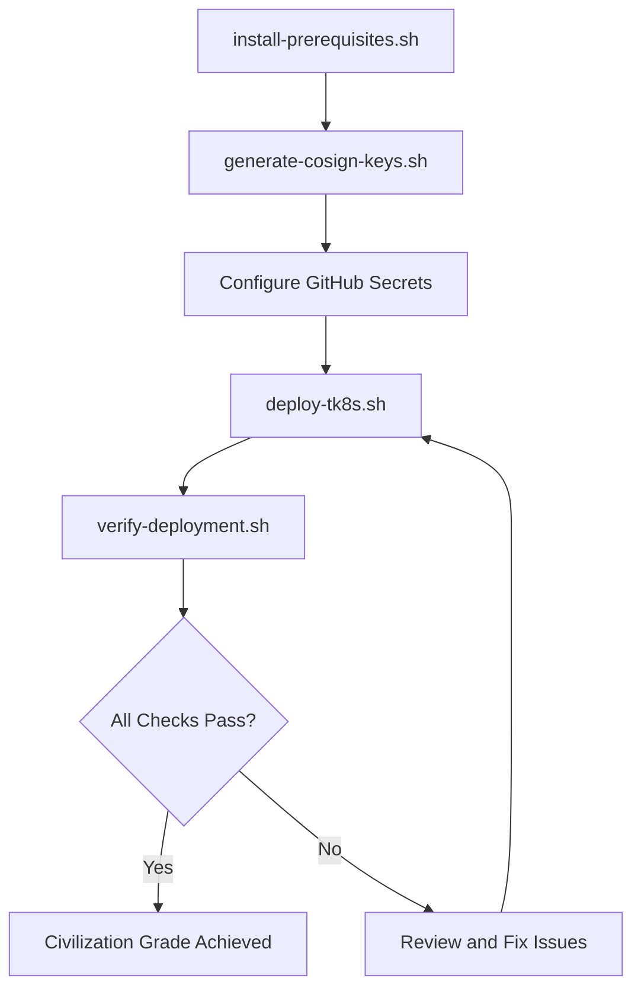

# TK8S Deployment Automation Scripts

This directory contains automated scripts to deploy TK8S (Thirsty's Kubernetes) infrastructure.

## Quick Start

### One-Command Deployment

```bash
# Install prerequisites, generate keys, and deploy
./install-prerequisites.sh && \
./generate-cosign-keys.sh && \
./deploy-tk8s.sh
```

### Step-by-Step Deployment

```bash
# 1. Install ArgoCD, Kyverno, and required tools
./install-prerequisites.sh

# 2. Generate Cosign signing keys
./generate-cosign-keys.sh

# 3. Deploy TK8S infrastructure
./deploy-tk8s.sh

# 4. Verify deployment
./verify-deployment.sh
# OR
python validate_tk8s.py
```

## Scripts Overview

### 1. `install-prerequisites.sh`

Installs all required components:
- **kubectl** (checks existing installation)
- **Helm** v3 (auto-installs if missing)
- **Cosign** (for image signing)
- **Syft** (for SBOM generation)
- **ArgoCD** (deploys to cluster)
- **Kyverno** (deploys to cluster)

**Usage:**
```bash
./install-prerequisites.sh
```

**What it does:**
- Verifies kubectl cluster connectivity
- Installs missing tools automatically
- Deploys ArgoCD to `argocd` namespace
- Deploys Kyverno to `kyverno` namespace
- Displays ArgoCD admin credentials
- Validates all installations

**Requirements:**
- Kubernetes cluster access (kubectl configured)
- Sudo access (for tool installation)
- Internet connection

### 2. `generate-cosign-keys.sh`

Generates Cosign key pairs for image signing:
- Creates `.cosign-keys/` directory (gitignored)
- Generates `cosign.key` (private - keep secret!)
- Generates `cosign.pub` (public)
- Automatically updates Kyverno policy with public key
- Provides instructions for GitHub Secrets

**Usage:**
```bash
./generate-cosign-keys.sh
```

**What it does:**
- Prompts for password to protect private key
- Generates ED25519 key pair
- Backs up Kyverno policy file
- Injects public key into `security/kyverno-policies.yaml`
- Displays GitHub Secrets setup instructions

**Important:**
- Store private key securely (password manager)
- Add `COSIGN_PRIVATE_KEY` to GitHub Secrets
- Add `COSIGN_PASSWORD` to GitHub Secrets
- Never commit `cosign.key` to Git

**Key Storage:**
```
.cosign-keys/
├── cosign.key  # Private key - NEVER commit
└── cosign.pub  # Public key - safe to share
```

### 3. `deploy-tk8s.sh`

Main deployment script that orchestrates the entire TK8S deployment:
- Deploys 6 TK8S namespaces
- Configures RBAC policies
- Applies network policies (zero-trust)
- Deploys Kyverno admission policies
- Sets up ArgoCD applications
- Optionally deploys monitoring stack

**Usage:**
```bash
# Normal deployment
./deploy-tk8s.sh

# Dry-run (no changes)
./deploy-tk8s.sh --dry-run

# Skip post-deployment validation
./deploy-tk8s.sh --skip-validation
```

**Options:**
- `--dry-run` - Preview changes without applying
- `--skip-validation` - Skip automatic validation
- `--help` - Show usage information

**Deployment Order:**
1. Verify prerequisites (ArgoCD, Kyverno)
2. Create TK8S namespaces
3. Deploy RBAC (ServiceAccounts, Roles, RoleBindings)
4. Deploy NetworkPolicies (default-deny + explicit allow)
5. Deploy Kyverno ClusterPolicies (admission control)
6. Deploy ArgoCD Applications (GitOps)
7. Optionally deploy monitoring configuration
8. Run status checks
9. Run validation script

**Interactive Prompts:**
- Monitoring deployment (optional)

### 4. `verify-deployment.sh`

Comprehensive deployment verification:
- Checks all TK8S namespaces
- Validates RBAC configuration
- Verifies NetworkPolicies
- Checks Kyverno ClusterPolicies
- Validates ArgoCD applications
- Runs Python validation script
- Generates civilization-grade score

**Usage:**
```bash
./verify-deployment.sh
```

**Checks Performed:**
- ✅ Cluster connectivity
- ✅ 6 TK8S namespaces (Active status)
- ✅ 4 ServiceAccounts (least-privilege)
- ✅ 6 NetworkPolicies (zero-trust)
- ✅ 7 Kyverno ClusterPolicies (admission control)
- ✅ ArgoCD deployment (ready replicas)
- ✅ ArgoCD applications (sync + health status)
- ✅ Kyverno deployment (ready replicas)
- ✅ Python validation (comprehensive checks)

**Exit Codes:**
- `0` - All checks passed (Civilization Grade)
- `1` - Errors found (review required)

**Output Categories:**
- ✅ Success (green) - Component operational
- ⚠️  Warning (yellow) - Review recommended
- ❌ Error (red) - Action required

### 5. `validate_tk8s.py`

Python-based validation script with detailed scoring:
- Namespace verification (6 required)
- NetworkPolicy checks (5 policies)
- RBAC validation (4 ServiceAccounts)
- Kyverno policy verification (7 policies)
- Deployment health checks (2 deployments)
- Pod security context validation
- ArgoCD application status (5 apps)

**Usage:**
```bash
python validate_tk8s.py
```

**See:** `validate_tk8s.py` documentation for detailed scoring methodology.

## Deployment Workflow

### Standard Deployment



### Prerequisites

**Required:**
- Kubernetes cluster (v1.29+)
- kubectl configured with admin access
- Bash shell (Linux/macOS/WSL)
- Internet connection
- Sudo access (for tool installation)

**Optional:**
- Docker (for building images)
- GitHub repository access (for Secrets)

### Environment Variables

None required for basic deployment. Optional overrides:

```bash
# Dry-run mode (no actual changes)
DRY_RUN=true ./deploy-tk8s.sh

# Skip validation after deployment
SKIP_VALIDATION=true ./deploy-tk8s.sh
```

## Troubleshooting

### Common Issues

**1. "kubectl not found"**
```bash
# Install kubectl
curl -LO "https://dl.k8s.io/release/$(curl -L -s https://dl.k8s.io/release/stable.txt)/bin/linux/amd64/kubectl"
chmod +x kubectl
sudo mv kubectl /usr/local/bin/
```

**2. "Cannot connect to cluster"**
```bash
# Verify cluster access
kubectl cluster-info

# Check context
kubectl config current-context

# Switch context
kubectl config use-context <context-name>
```

**3. "ArgoCD installation fails"**
```bash
# Check ArgoCD pods
kubectl get pods -n argocd

# View logs
kubectl logs -n argocd deployment/argocd-server

# Retry installation
kubectl delete namespace argocd
./install-prerequisites.sh
```

**4. "Kyverno policies rejected"**
```bash
# Check Kyverno logs
kubectl logs -n kyverno deployment/kyverno

# Verify public key configured
grep -A 5 "publicKeys" security/kyverno-policies.yaml

# Regenerate keys if needed
./generate-cosign-keys.sh
```

**5. "NetworkPolicy blocking traffic"**
```bash
# Check policies
kubectl get networkpolicies -A

# Describe specific policy
kubectl describe networkpolicy <name> -n <namespace>

# Temporarily disable (testing only)
kubectl delete networkpolicy <name> -n <namespace>
```

### Debug Mode

Enable debug output:
```bash
# Bash debug mode
bash -x ./deploy-tk8s.sh

# Kubectl verbose mode
kubectl --v=8 get pods
```

### Rollback

If deployment fails:
```bash
# Delete TK8S namespaces
kubectl delete namespace project-ai-core project-ai-security project-ai-memory project-ai-eca project-ai-monitoring project-ai-system

# Remove ArgoCD applications
kubectl delete applications -n argocd --all

# Retry deployment
./deploy-tk8s.sh
```

## Security Considerations

### Key Management

**DO:**
- ✅ Store private keys in password manager
- ✅ Use strong passwords for key encryption
- ✅ Rotate keys every 90 days
- ✅ Add keys to GitHub Secrets
- ✅ Backup keys securely

**DON'T:**
- ❌ Commit private keys to Git
- ❌ Share private keys via email/chat
- ❌ Use weak passwords
- ❌ Skip key encryption
- ❌ Reuse keys across environments

### GitHub Secrets

Add these secrets to your repository:
1. `COSIGN_PRIVATE_KEY` - Contents of `cosign.key`
2. `COSIGN_PASSWORD` - Password set during generation

**Location:**
- Repository > Settings > Secrets and variables > Actions > New repository secret

### Network Security

**Default-deny NetworkPolicies:**
- All namespaces have egress/ingress restrictions
- ECA namespace has maximum isolation (egress-only)
- Explicit allow rules required for communication

**To allow new traffic:**
1. Edit `network-policies/tk8s-network-policies.yaml`
2. Add explicit allow rule
3. Apply: `kubectl apply -f network-policies/tk8s-network-policies.yaml`
4. Verify: `kubectl describe networkpolicy <name> -n <namespace>`

## Advanced Usage

### Custom Deployment

Deploy specific components only:
```bash
# Namespaces only
kubectl apply -f namespaces/tk8s-namespaces.yaml

# RBAC only
kubectl apply -f rbac/tk8s-rbac.yaml

# NetworkPolicies only
kubectl apply -f network-policies/tk8s-network-policies.yaml

# Kyverno policies only
kubectl apply -f security/kyverno-policies.yaml

# ArgoCD applications only
kubectl apply -f argocd/applications.yaml
```

### Kustomize Deployment

Use Kustomize for environment-specific deployments:
```bash
# Deploy everything with Kustomize
kubectl apply -k .

# Or with kustomize binary
kustomize build . | kubectl apply -f -
```

### Monitoring Setup

Install Prometheus/Grafana stack:
```bash
# Add Helm repos
helm repo add prometheus-community https://prometheus-community.github.io/helm-charts
helm repo add grafana https://grafana.github.io/helm-charts
helm repo update

# Install Prometheus
helm install prometheus prometheus-community/kube-prometheus-stack -n project-ai-monitoring

# Install Loki
helm install loki grafana/loki-stack -n project-ai-monitoring

# Install Tempo
helm install tempo grafana/tempo -n project-ai-monitoring

# Apply TK8S monitoring config
kubectl apply -f monitoring/prometheus-config.yaml
```

## CI/CD Integration

### GitHub Actions

The TK8S Civilization Pipeline (`../../.github/workflows/tk8s-civilization-pipeline.yml`) automatically:
1. Builds and signs container images
2. Generates SBOMs
3. Runs security scans
4. Deploys to staging (on push to `main`)
5. Requires approval for production
6. Creates CIVILIZATION LOCK on success

**Trigger manually:**
```bash
git push origin main
```

### Manual Image Signing

Sign images manually:
```bash
# Export private key
export COSIGN_PASSWORD="your-password"

# Sign image
cosign sign --key .cosign-keys/cosign.key ghcr.io/iamsothirsty/project-ai-core:v1.0.0

# Verify signature
cosign verify --key .cosign-keys/cosign.pub ghcr.io/iamsothirsty/project-ai-core:v1.0.0
```

## Documentation

- **Setup Guide:** `SETUP_GUIDE.md` - Step-by-step manual deployment
- **TK8S Doctrine:** `../../docs/TK8S_DOCTRINE.md` - Philosophy and principles
- **Civilization Timeline:** `../../docs/CIVILIZATION_TIMELINE.md` - Release history
- **Implementation Summary:** `IMPLEMENTATION_SUMMARY.md` - Technical details
- **Main README:** `README.md` - Quick start and overview

## Support

- **Issues:** https://github.com/IAmSoThirsty/Project-AI/issues
- **Discussions:** https://github.com/IAmSoThirsty/Project-AI/discussions

## License

MIT License - See [LICENSE](../../LICENSE) for details

---

**Status:** Production Ready  
**Version:** 1.0.0  
**Last Updated:** 2026-02-11  
**Maintained By:** TK8S Core Team
