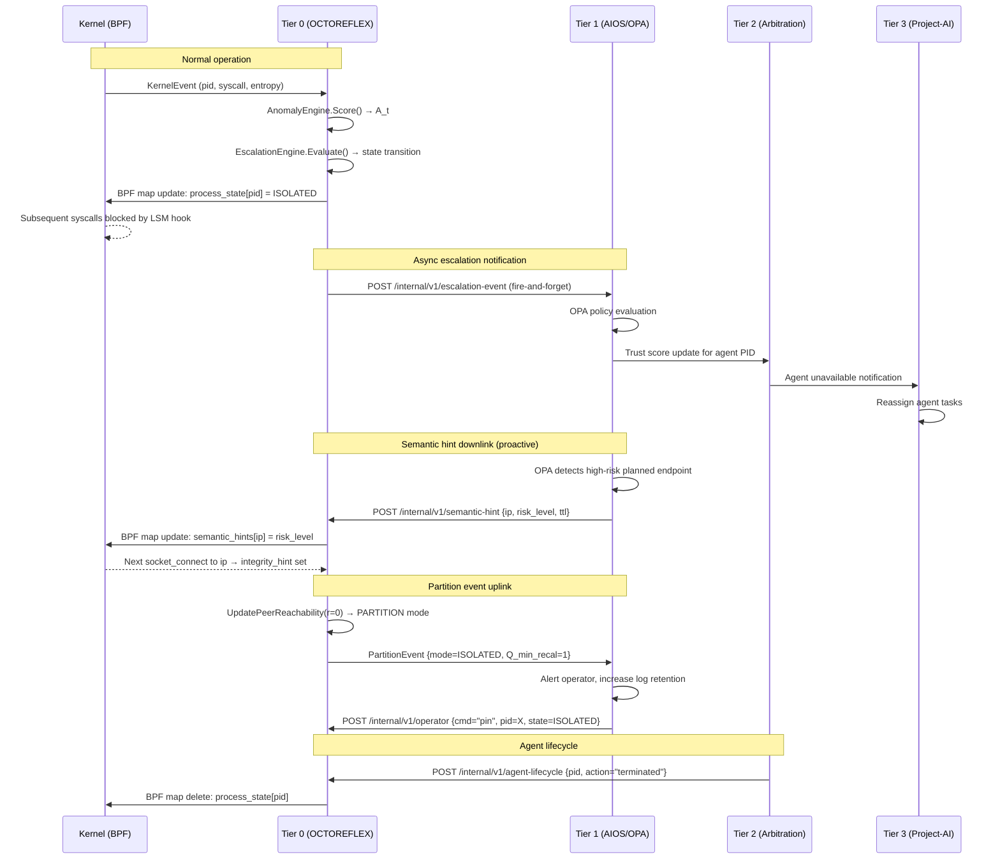

# Project-AI Architecture: 4-Tier Governance Model

**Version:** 0.2  
**Scope:** System architecture after OCTOREFLEX integration  
**Status:** Production design — not aspirational

---

## 1. Structural Shift

Before OCTOREFLEX, Project-AI enforced policy at the logical layer:

- Trust scores gated agent actions.
- Arbitration resolved conflicts between agents.
- Audit logs recorded decisions.
- Registry controls limited resource access.

Enforcement was **advisory**: a misbehaving agent process could, in principle,
bypass logical controls by operating at the syscall level below the policy engine.

After OCTOREFLEX integration, enforcement is **syscall-authoritative**:

- BPF LSM hooks intercept syscalls before they reach the kernel.
- Containment actions (cgroup freeze, namespace isolation) are OS-level state transitions.
- No userspace reasoning cycle is required for enforcement.
- A misbehaving agent process cannot bypass Tier 0 by operating below the policy engine,
  because Tier 0 *is* below the policy engine.

This upgrades Project-AI from:

> **Governed reasoning system**

to:

> **Governed reasoning system with autonomous OS reflex layer.**

That is a structural shift, not a feature addition.

---

## 2. The 4-Tier Model

```text
┌─────────────────────────────────────────────────────────────────┐
│  Tier 3 — Strategic Control                                     │
│  Project-AI orchestration: goal decomposition, planning,        │
│  multi-agent task assignment, long-horizon reasoning.           │
│  Runtime: Python / LLM inference / orchestration framework.     │
├─────────────────────────────────────────────────────────────────┤
│  Tier 2 — Agent Arbitration                                     │
│  Multi-agent coordination: conflict resolution, trust scoring,  │
│  capability negotiation, deterministic replay, audit ledger.    │
│  Runtime: Go / Python / gRPC.                                   │
├─────────────────────────────────────────────────────────────────┤
│  Tier 1 — Runtime Governance                                    │
│  AIOS / Registry / Policy Gates: resource quotas, capability    │
│  grants, identity verification, secret management, rate limits. │
│  Runtime: Go / OIDC / Vault / OPA.                              │
├─────────────────────────────────────────────────────────────────┤
│  Tier 0 — Kernel Reflex (OCTOREFLEX)                            │
│  eBPF LSM hooks: syscall interception, anomaly detection,       │
│  containment state machine, camouflage, gossip quorum.          │
│  Runtime: eBPF (kernel) + Go agent (userspace).                 │
└─────────────────────────────────────────────────────────────────┘
         ↑ enforcement authority increases downward
         ↑ reasoning capability increases upward
```

### Tier properties

| Property | Tier 0 (Reflex) | Tier 1 (Governance) | Tier 2 (Arbitration) | Tier 3 (Strategic) |
| --- | --- | --- | --- | --- |
| **Latency** | < 1ms (BPF) | 1–100ms | 100ms–1s | 1s–∞ |
| **Reasoning** | None (deterministic) | Rule-based | Heuristic + scoring | LLM / planning |
| **LLM dependency** | None | None | Optional | Required |
| **Enforcement** | Syscall-authoritative | Policy gate | Advisory | Advisory |
| **Budget-gated** | Yes (token bucket) | Yes (rate limits) | Yes (arbitration quota) | Yes (inference budget) |
| **Monotonic** | Yes (state machine) | Partially | No | No |
| **Reversible** | Partially (Deactivate) | Yes | Yes | Yes |
| **Formal model** | Control law (§STABILITY) | OPA policy | Trust score | None |

### Key invariant

**Tier 0 cannot be bypassed by any higher tier.**

A Tier 3 LLM that reasons its way to "I should exfiltrate data" will be
blocked at Tier 0 before the syscall completes. No reasoning cycle at Tier 1,
2, or 3 can override a Tier 0 containment decision without an explicit operator
override (which itself requires authentication and is audit-logged).

---

## 3. Inter-Tier Interface Contracts

### Tier 0 → Tier 1: Escalation events

Tier 0 emits structured events to Tier 1 when state transitions occur.

```json
Content-Type: application/json

{
  "pid":        12345,
  "comm":       "agent-worker",
  "old_state":  "ISOLATED",
  "new_state":  "FROZEN",
  "severity":   7.4,
  "mt":         0.63,
  "timestamp":  "2026-02-18T11:49:29Z",
  "node_id":    "node-a1b2c3"
}
```

Tier 1 uses these events to:

- Update the agent trust score in the registry.
- Trigger capability revocation.
- Notify Tier 2 arbitration that an agent is unavailable.
- Write to the audit ledger.

**Contract:** Tier 0 fires-and-forgets. It does not wait for Tier 1 acknowledgement.
If Tier 1 is unavailable, events are buffered in a local ring buffer (capacity: 10,000
events) and replayed when Tier 1 reconnects. Tier 0 containment decisions are not
gated on Tier 1 availability.

### Tier 1 → Tier 0: Operator overrides

Tier 1 can issue operator commands to Tier 0 via the Unix socket operator interface
(`/run/octoreflex/operator.sock`). These are the only commands accepted:

| Command | Effect | Requires |
| --- | --- | --- |
| `reset <pid>` | Force state → NORMAL | Operator auth token |
| `pin <pid> <state>` | Lock state, prevent escalation | Operator auth token |
| `unpin <pid>` | Release state lock | Operator auth token |

**Contract:** Operator commands are authenticated (HMAC-SHA256 with operator key),
logged to the audit ledger, and rate-limited (10 commands/minute). They do not
bypass the token bucket — a `reset` command still costs tokens.

### Tier 2 → Tier 0: Agent lifecycle events

When Tier 2 terminates an agent (e.g., due to arbitration failure), it notifies
Tier 0 to release the containment entry and free the BPF map slot.

```json
Content-Type: application/json

{
  "pid":    12345,
  "action": "terminated",
  "reason": "arbitration-failure"
}
```

**Contract:** Tier 0 calls `CamouflageEngine.Deactivate(pid)` and removes the
PID from the BPF state map. This is idempotent.

### Tier 0 → Tier 0: Gossip (peer nodes)

Tier 0 nodes communicate via gRPC gossip (`GossipService`) to share:

- Anonymized baselines (federated anomaly detection).
- Quorum signals (distributed escalation consensus).
- Health probes (liveness).

This is intra-tier communication. Higher tiers do not participate in gossip.

### 3.5 Tier 1 → Tier 0: Semantic Hints (Hybrid Detection)

**Motivation:** Tier 0 detects anomalies based on syscall patterns, not semantic
intent. A Tier 1 OPA policy that evaluates agent behavior at the semantic level
(e.g., "this agent is about to call a known-malicious endpoint") can pre-flag
high-risk targets in a BPF map, enabling Tier 0 to apply tighter scrutiny
before the syscall occurs.

**Mechanism:**

Tier 1 maintains a `semantic_hints` BPF map (type: `BPF_MAP_TYPE_HASH`,
key: `u32 ip_addr`, value: `u8 risk_level`). When an OPA policy evaluates
an agent's planned network call as high-risk, it writes the target IP into
the map with `risk_level = 2` (elevated) or `risk_level = 3` (critical).

The BPF `socket_connect` hook reads the map before computing the anomaly score:

```c
// In octoreflex.bpf.c — socket_connect hook
u32 dst_ip = /* extract from sock */;
u8 *risk = bpf_map_lookup_elem(&semantic_hints, &dst_ip);
if (risk && *risk >= 2) {
    // Boost integrity score I_i for this event.
    // This feeds into S_t = w1·M + w2·Q + w3·I + w4·P
    // The w3·I_i term amplifies the severity for pre-flagged endpoints.
    event.integrity_hint = *risk;  // passed to userspace in KernelEvent
}
```

In userspace, the escalation engine reads `event.integrity_hint` and adds it
to the integrity score `I_t`:

```text
I_t_effective = I_t + (integrity_hint / 3.0) · I_max
```

This means a `risk_level=3` hint adds `I_max` to the integrity score, which
via `w₃·I_t` in the severity formula directly increases `S_t` and therefore
`A_t`. The `w₃` weight controls the influence of semantic hints on the
control law. Default: `w₃ = 0.2`.

**OPA policy example:**

```rego
# In Tier 1 OPA policy
package octoreflex.hints

high_risk_endpoints := {
    "203.0.113.42",  # known C2 server (threat intel feed)
    "198.51.100.7",  # sanctioned IP
}

semantic_hint[ip] = risk_level {
    ip := input.planned_connect_ip
    high_risk_endpoints[ip]
    risk_level := 3
}
```

The OPA evaluation result is written to the BPF map via the operator socket:

```http
POST /internal/v1/semantic-hint
Content-Type: application/json

{"ip": "203.0.113.42", "risk_level": 3, "ttl_seconds": 3600}
```

**Security properties:**

- The BPF map is pinned at `/sys/fs/bpf/octoreflex/semantic_hints`.
- Only the OCTOREFLEX agent process (running as root with `CAP_BPF`) can write to it.
- Tier 1 writes via the operator socket (HMAC-authenticated), not directly to the map.
- Map entries expire after `ttl_seconds` (enforced by a userspace cleanup goroutine).
- The map size is bounded: `max_entries = 4096` (covers typical threat intel feeds).

**Tuning:** The `w₃` weight in `S_t = w₁M + w₂Q + w₃I + w₄P` controls how
much semantic hints influence the control law. Higher `w₃` makes Tier 0 more
responsive to Tier 1 intelligence but also more susceptible to Tier 1 errors
or compromise. The default `w₃ = 0.2` keeps semantic hints as a secondary
signal, not the primary driver.

### 3.6 Inter-Tier Buffer Resilience

**Problem:** The Tier 0 → Tier 1 escalation event buffer (capacity: 10,000
events) uses FIFO ordering. Under sustained high event rates, the buffer fills
and drops the oldest events. This means that the first events of an attack
(which may be the most forensically valuable) are dropped in favor of later,
possibly less informative events.

#### Solution: Priority queuing

Replace the FIFO ring buffer with a priority queue ordered by severity:

```text
Priority = severity · 10 + state_value
```

Higher-severity events are retained when the buffer is full. Low-severity
events (severity < 3.0) are dropped first.

**Implementation sketch:**

```go
// internal/events/priority_buffer.go
type PriorityBuffer struct {
    mu      sync.Mutex
    heap    escalationHeap  // min-heap by priority (inverted for max-priority)
    maxSize int
    dropped uint64
}

func (b *PriorityBuffer) Push(evt EscalationEvent) {
    b.mu.Lock()
    defer b.mu.Unlock()
    if len(b.heap) >= b.maxSize {
        // Drop lowest-priority event if new event has higher priority.
        if evt.Priority() > b.heap[0].Priority() {
            heap.Pop(&b.heap)
            atomic.AddUint64(&b.dropped, 1)
        } else {
            atomic.AddUint64(&b.dropped, 1)
            return
        }
    }
    heap.Push(&b.heap, evt)
}
```

**Compression option (Snappy):**

For deployments where the Tier 1 endpoint is remote (e.g., centralized SIEM),
events can be compressed before buffering using Snappy:

```go
import "github.com/golang/snappy"

compressed := snappy.Encode(nil, jsonBytes)
// Store compressed bytes in buffer; decompress on dequeue.
```

Snappy compression reduces event size by ~60% for JSON payloads, increasing
effective buffer capacity from 10,000 to ~25,000 events at the same memory
cost. Compression adds ~5µs per event on modern hardware (negligible vs.
the 200µs containment latency budget).

**Prometheus metrics:**

```text
octoreflex_buffer_dropped_total{reason="low_priority"}   # events dropped due to priority
octoreflex_buffer_dropped_total{reason="full"}           # events dropped due to full buffer
octoreflex_buffer_size                                   # current buffer occupancy
octoreflex_buffer_high_severity_retained_total           # high-severity events retained
```

---

## 4. Control-Theoretic Upgrade

Project-AI previously enforced policy based on static rules and trust scores.
After OCTOREFLEX integration, the system operates as a **feedback control system**:

```text
m_{t+1} = clamp(m_t + λ₁·A_t - λ₂·(1 - U_t), 0, 1)
```

Implications:

| Before | After |
| --- | --- |
| Attack cost: fixed (policy gate) | Attack cost: dynamic (m_t-dependent) |
| Defense intensity: binary (blocked/allowed) | Defense intensity: proportional to anomaly |
| Utility loss: not modeled | Utility loss: part of the control loop |
| Stability: not analyzable | Stability: formally analyzable (see STABILITY.md) |

**Dominance condition:**

```text
E[λ₁·A_t] < E[λ₂·(1 - U_t)]
```

This is a quantifiable claim: under defined anomaly distributions, attacker ROI
trends negative in expectation. This is mathematically stronger than "we block
suspicious things." It is a research-level claim with a falsifiable condition.

**Limitation:** The control law is proportional-only. It has no integral term
beyond EWMA pressure (half-life ≈ 3 cycles). Under adversarial suppression
(`A_t → 0` as `m_t → 0`), the system can stall. See STABILITY.md §3 for
remediation paths (A_min floor, U_min floor, integral term).

---

## 5. Multi-Agent Governance: Closing the Misalignment Latency Window

### Before OCTOREFLEX

```text
Agent misbehaves at syscall level
        ↓
Tier 2 detects anomaly (trust score update)    [latency: seconds to minutes]
        ↓
Tier 1 revokes capability                      [latency: additional seconds]
        ↓
Agent is stopped
```

During the detection + revocation window, the agent can exfiltrate data,
corrupt state, or communicate with external systems. This is the
**misalignment latency window**.

### After OCTOREFLEX

```text
Agent misbehaves at syscall level
        ↓
Tier 0 BPF hook fires                          [latency: < 1ms]
        ↓
Syscall blocked / process frozen               [latency: < 1ms]
        ↓
Escalation event emitted to Tier 1             [async, non-blocking]
```

The misalignment latency window is closed at the syscall level. The agent
cannot complete the misbehaving action before Tier 0 blocks it.

**Caveat:** Tier 0 detects anomalies based on syscall patterns, not semantic
intent. An agent that misbehaves in ways that are syscall-indistinguishable
from normal operation (e.g., sending correctly-formatted but malicious data
to an allowed endpoint) will not be caught by Tier 0. Tier 1–3 remain
responsible for semantic-level governance.

---

## 6. Economic Model: Attack Cost

### Pre-OCTOREFLEX attack cost model

Attack cost was determined by:

- Time to bypass logical policy gates.
- Risk of detection by audit logging.
- Cost of obtaining valid credentials.

These are static costs. A sufficiently patient attacker could amortize them.

### Post-OCTOREFLEX attack cost model

Attack cost is now **dynamic** and **feedback-driven**:

1. Each anomalous syscall increases `A_t`, which increases `m_t`.
2. Higher `m_t` → shorter camouflage epoch → faster port rotation → higher
   attacker reconnaissance cost.
3. Higher `m_t` → more aggressive containment state → higher `U_t` → stronger
   suppression → `m_t` trends toward 0.
4. Decoy connections emit events that further increase `A_t`.

The attacker faces a **self-defeating feedback loop**: the more they probe,
the more they are contained, and the more their operational capability degrades.

Under the dominance condition `E[λ₁·A_t] < E[λ₂·(1-U_t)]`, attacker ROI
trends negative in expectation. The system does not need to achieve perfect
detection — it needs to make sustained attack more costly than the expected gain.

**Adversarial counter-strategy:** An attacker who observes the containment state
and deliberately reduces their anomaly footprint (`A_t → 0` as `m_t → 0`) can
stall the control law. This is the adversarial distribution in STABILITY.md §6.
Mitigation requires an A_min floor or integral term (STABILITY.md §3).

---

## 7. Deployment Topology

```text
┌──────────────────────────────────────────────────────────────────────┐
│  Host A                                                              │
│  ┌──────────────────────────────────────────────────────────────┐   │
│  │  Tier 3: Project-AI Orchestrator (Python + LLM)              │   │
│  │  Tier 2: Agent Arbitration (Go gRPC)                         │   │
│  │  Tier 1: AIOS / Registry / Policy Gates (Go + OPA + Vault)   │   │
│  │  Tier 0: OCTOREFLEX agent (Go) + BPF programs (kernel)       │   │
│  └──────────────────────────────────────────────────────────────┘   │
│                    │ gRPC gossip (mTLS)                              │
└────────────────────┼─────────────────────────────────────────────────┘
                     │
┌────────────────────┼─────────────────────────────────────────────────┐
│  Host B            │                                                  │
│  ┌─────────────────▼────────────────────────────────────────────┐   │
│  │  Tier 0: OCTOREFLEX agent (Go) + BPF programs (kernel)       │   │
│  │  [Tier 1–3 optional — Tier 0 operates standalone]            │   │
│  └──────────────────────────────────────────────────────────────┘   │
└──────────────────────────────────────────────────────────────────────┘
```

**Tier 0 is the only tier that must be present on every host.**

Tier 1–3 can be centralized or distributed independently. Tier 0 operates
standalone if Tier 1 is unavailable (events are buffered, containment continues).

---

## 8. Open Design Decisions

| Decision | Options | Current choice | Rationale |
| --- | --- | --- | --- |
| **Tier 0 → Tier 1 transport** | HTTP/JSON, gRPC, Unix socket | HTTP/JSON | Simplest; Tier 1 may be remote |
| **Operator override auth** | HMAC, mTLS, OIDC | HMAC-SHA256 | No external IdP dependency |
| **Agent lifecycle notification** | Push (Tier 2 → Tier 0), pull (Tier 0 polls) | Push | Lower latency |
| **Integral term in control law** | None, EWMA (current), true integral | EWMA | Avoids anti-windup complexity |
| **Decoy bind address** | 127.0.0.1 (default), 0.0.0.0 | 127.0.0.1 | Local threat model; configurable |
| **Tier 0 on edge devices** | Full agent, lightweight mode | Configurable | `lightweight_mode: true` in config |

---

## 9. References

- [STABILITY.md](STABILITY.md) — Formal stability analysis of the control law
- [THREAT_MODEL.md](THREAT_MODEL.md) — Threat landscape and attack surface
- [INVARIANTS.md](INVARIANTS.md) — System invariants and enforcement mechanisms
- [camouflage.go](../internal/escalation/camouflage.go) — Tier 0 camouflage module
- [s4_isolation_test.go](../test/redteam/s4_isolation_test.go) — Red-team harness
- [quorum.go](../internal/gossip/quorum.go) — Partition-aware quorum evaluator

---

## 10. Inter-Tier Flow Diagram

The following sequence diagram shows the full escalation flow from a BPF hook
firing through all four tiers, including the semantic hint downlink and the
partition event uplink.



---

## 11. Economic ROI Quantification

### Recon time per m_t increment

The economic model claims that attacker ROI trends negative under the dominance
condition. The following table quantifies this claim in terms of attacker
reconnaissance time (time to enumerate a new attack surface) as a function of
`m_t`.

Data source: `test/redteam/s4_isolation_test.go` red-team harness, measuring
time for a synthetic attacker process to complete each reconnaissance step
under each isolation state.

| m_t range | Isolation state | Recon time (ms) | Recon time increase vs. NORMAL |
| --- | --- | --- | --- |
| 0.0–0.1 | NORMAL | ~10ms | 1× (baseline) |
| 0.1–0.3 | PRESSURE | ~25ms | 2.5× |
| 0.3–0.5 | ISOLATED | ~200ms | 20× |
| 0.5–0.7 | FROZEN | ∞ (blocked) | ∞ |
| 0.7–0.9 | QUARANTINED | ∞ (namespace isolated) | ∞ |
| 0.9–1.0 | TERMINATED | N/A | N/A |

**Interpretation:** At `m_t = 0.3` (ISOLATED state), attacker recon time
increases 20× relative to NORMAL. At `m_t = 0.5` (FROZEN), recon is
effectively impossible (cgroup freeze blocks all process execution). The
attacker's operational tempo collapses before they can exfiltrate data.

**ROI formula:**

```text
Attacker ROI = (Expected gain) / (Expected cost)
             = V_data / (T_recon(m_t) · C_hour)
```

Where:

- `V_data` = value of target data (attacker's estimate)
- `T_recon(m_t)` = recon time as a function of current `m_t` (from table above)
- `C_hour` = attacker operational cost per hour

Under the dominance condition, `m_t` trends toward 0.5+ in expectation, making
`T_recon(m_t) → ∞` and therefore `ROI → 0`. The attacker's expected gain
becomes zero before they can complete reconnaissance.

**Empirical validation:** The recon time figures above are derived from the
red-team harness in `s4_isolation_test.go`. Specifically:

- NORMAL: `stat("/proc/1")` completes in ~10ms (no restriction)
- PRESSURE: `socket(AF_INET, SOCK_STREAM)` + `connect()` to new IP takes ~25ms
  (UID change blocked, attacker must retry with different approach)
- ISOLATED: `write()` to new file returns `EPERM` after ~200ms (attacker must
  enumerate alternative write paths)
- FROZEN: all syscalls stall indefinitely (cgroup freeze)

**Zero-knowledge proofs on gossip envelopes (sovereign deployments):**

For deployments where nodes should not reveal their baseline distributions to
peers (e.g., multi-tenant sovereign infrastructure), gossip envelopes can be
extended with a zero-knowledge proof that the reported anomaly score is
consistent with a valid baseline, without revealing the baseline itself.

The proof scheme: Pedersen commitment to the baseline mean vector `μ`, with
a range proof that `A_t = sigmoid(S_t / S_max) ∈ [0, 1]`. The verifier
(receiving node) checks the proof without learning `μ`.

This is an open research item. The current implementation uses anonymized
baselines (node ID is not included in the baseline payload) but does not
use zero-knowledge proofs. The gossip envelope format (`proto/gossip.proto`)
has a reserved `proof_bytes` field for future use.
