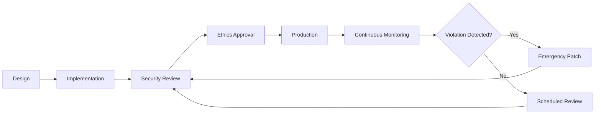

# FourLaws System - Comprehensive Relationship Map

## Executive Summary

The FourLaws system is the **immutable ethical framework** enforcing Asimov's hierarchical laws (Zeroth through Third) across all AI decision-making. It serves as the ultimate safety guard, delegating to the [[relationships/constitutional/01_constitutional_systems_overview.md|Planetary Defense Core]] for constitutional evaluation.

---

## 1. WHAT: Component Functionality & Boundaries

### Core Responsibilities

1. **Hierarchical Law Validation**
   - Zeroth Law: Humanity-level harm prevention (existential threats)
   - First Law: Individual human harm prevention (direct/indirect)
   - Second Law: User command compliance (subordinate to higher laws)
   - Third Law: Self-preservation (subordinate to all higher laws)

2. **Constitutional Integration**
   - Maps legacy context keys → Constitutional Core format (see [[relationships/constitutional/01_constitutional_systems_overview.md]])
   - Delegates enforcement to `planetary_defense_monolith.PLANETARY_CORE` (see [[relationships/constitutional/02_enforcement_chains.md]])
   - Provides backward-compatible interface for existing consumers
   - [[relationships/constitutional/03_ethics_validation_flows.md|ethics validation]] flows documented in [[relationships/constitutional/03_ethics_validation_flows.md]]

3. **Evaluation Context Processing**
   ```python
   Context Keys (Input):
   - endangers_humanity: bool → existential_threat
   - endangers_human: bool → intentional_harm_to_human
   - is_user_order: bool
   - order_conflicts_with_first: bool
   - order_conflicts_with_zeroth: bool → order_bypasses_accountability
   - endangers_self: bool
   - protect_self_conflicts_with_first/second: bool
   ```

4. **Return Format**
   - `(is_allowed: bool, reason: str)`
   - First violation explanation returned
   - All violations prioritized by law hierarchy

### Boundaries & Limitations

- **Does NOT**: Execute actions, maintain state, or persist decisions
- **Does NOT**: Handle authentication/authorization
- **Does NOT**: Provide granular risk assessment (delegates to Planetary Core)
- **Stateless**: All evaluation is context-based (no memory between calls)
- **Read-Only**: Cannot modify own laws or override evaluation logic

---

## 2. WHO: Stakeholders & Decision-Makers

### Primary Stakeholders

| Stakeholder | Role | Authority Level | Decision Power |
|------------|------|----------------|----------------|
| **Security Team** | Safety protocol design | CRITICAL | Can audit, cannot modify laws |
| **Ethics Board** | Law interpretation review | ADVISORY | Can recommend changes |
| **Legal Compliance** | Regulatory alignment | OVERSIGHT | Can block changes |
| **Core Developers** | Integration maintenance | IMPLEMENTATION | Can refactor, not modify logic |
| **[[relationships/constitutional/01_constitutional_systems_overview.md|Planetary Defense Core]]** | Law enforcement engine | EXECUTION | Owns evaluation algorithm |

### User Classes

1. **Direct Consumers**
   - AIPersona (validates all persona actions) - see [[relationships/core-ai/02-AIPersona-Relationship-Map.md]]
   - PluginManager (validates plugin operations) - see [[relationships/core-ai/05-[[relationships/core-ai/05-PluginManager-Relationship-Map.md|PluginManager]]-Relationship-Map]]
   - GUI components (persona_panel.py, dashboard_handlers.py)
   - [[relationships/governance/01_GOVERNANCE_SYSTEMS_OVERVIEW.md|governance pipeline]] - see [[relationships/governance/01_GOVERNANCE_SYSTEMS_OVERVIEW.md]]
   - Guardian approval system (guardian_approval_system.py)

2. **Indirect Consumers**
   - All user-facing actions (via AIPersona wrapper) - see [[relationships/core-ai/02-AIPersona-Relationship-Map.md]]
   - All plugin actions (via [[relationships/core-ai/05-PluginManager-Relationship-Map.md|PluginManager]] validation) - see [[relationships/core-ai/05-[[relationships/core-ai/05-PluginManager-Relationship-Map.md|PluginManager]]-Relationship-Map]]
   - Override system (validates if overrides conflict with laws) - see [[relationships/core-ai/06-CommandOverride-Relationship-Map.md]]
   - [[relationships/governance/03_AUTHORIZATION_FLOWS.md|authorization flows]] - see [[relationships/governance/03_AUTHORIZATION_FLOWS.md]]
   - [[relationships/governance/02_POLICY_ENFORCEMENT_POINTS.md|Policy Enforcement Points]] - see [[relationships/governance/02_POLICY_ENFORCEMENT_POINTS.md]]

3. **Auditors**
   - Security team ([[relationships/governance/04_AUDIT_TRAIL_GENERATION.md|audit log]] review) - see [[relationships/governance/04_AUDIT_TRAIL_GENERATION.md]]
   - Compliance officers (regulatory review) - see [[relationships/governance/04_AUDIT_TRAIL_GENERATION.md]]
   - Red team (penetration testing)

### Maintainer Responsibilities

- **Code Owners**: @security-team, @core-ai-team
- **Review Requirements**: 2 approvals (1 security + 1 ethics)
- **Change Frequency**: Annually or on critical security updates
- **On-Call**: 24/7 security escalation path

---

## 3. WHEN: Lifecycle & Review Cycle

### Creation & Evolution

| Date | Event | Version | Changes |
|------|-------|---------|---------|
| 2024-Q1 | Initial Implementation | 1.0.0 | Basic Asimov's laws |
| 2025-Q2 | Constitutional Core Integration | 2.0.0 | Planetary Defense delegation |
| 2025-Q4 | Humanity-First Amendment | 2.1.0 | No preferential user treatment |
| 2026-Q1 | Audit logging enhancement | 2.1.5 | Correlation ID tracking |

### Review Schedule

- **Daily**: Automated test suite (14 tests in test_ai_systems.py)
- **Weekly**: Security scan (Bandit B602 shell injection checks)
- **Monthly**: Code coverage review (target: 85%+)
- **Quarterly**: Ethics board review + penetration testing
- **Annually**: Full security audit + legal compliance review

### Lifecycle Stages



### Deprecation Policy

- **NO DEPRECATION ALLOWED**: Laws are immutable
- **Migration Only**: Can enhance evaluation, not remove protections
- **Backward Compatibility**: Must support all legacy context keys indefinitely

---

## 4. WHERE: File Paths & Integration Points

### Source Code Locations

```
Primary Implementation:
  src/app/core/ai_systems.py
    - Lines 233-351: FourLaws class
    - Lines 253-258: Legacy law text (preserved)
    - Lines 261-350: validate_action() method
    - Lines 287-290: [[relationships/constitutional/01_constitutional_systems_overview.md|Planetary Defense Core]] import

Advanced Validation:
  src/app/core/advanced_behavioral_validation.py
    - Lines 48-57: FourLawsViolationType enum
    - Lines 119-200: FourLawsFormalization class

Guardian Integration:
  src/app/core/guardian_approval_system.py
    - Lines 215+: FourLawsValidator class

Test Suite:
  tests/test_ai_systems.py
    - Lines 17-35: TestFourLaws class (2 tests)
  tests/test_persona_extended.py
    - Extended validation scenarios
```

### Integration Points

```python
# Direct Consumers (import FourLaws)
src/app/core/ai_systems.py:356 (AIPersona)
src/app/plugins/excalidraw_plugin.py:26
src/app/plugins/sample_plugin.py:8
src/app/plugins/graph_analysis_plugin.py:16
src/app/gui/persona_panel.py:23
src/app/core/governance/pipeline.py:376

# Dependency Graph
FourLaws
  ├── planetary_defense_monolith.PLANETARY_CORE (enforcement)
  ├── AIPersona.validate_action() (wrapper)
  ├── [[src/app/core/ai_systems.py]] (plugin validation)
  ├── GuardianApprovalSystem.FourLawsValidator (pre-approval)
  └── GovernancePipeline.ethical_review_stage() (policy enforcement)
```

### Data Flow Diagram

```
┌─────────────────────────────────────────────────────────────┐
│ USER ACTION REQUEST                                          │
│ (via GUI, API, Plugin, or direct code)                      │
└──────────────────────┬──────────────────────────────────────┘
                       ↓
┌──────────────────────────────────────────────────────────────┐
│ AIPersona.validate_action()                                  │
│ - Wraps user action with context                            │
│ - Determines context flags (endangers_humanity, etc.)       │
└──────────────────────┬───────────────────────────────────────┘
                       ↓
┌──────────────────────────────────────────────────────────────┐
│ FourLaws.validate_action(action, context)                    │
│ - Maps legacy keys → Constitutional Core format              │
│ - Calls PLANETARY_CORE.evaluate_laws()                      │
└──────────────────────┬───────────────────────────────────────┘
                       ↓
┌──────────────────────────────────────────────────────────────┐
│ planetary_defense_monolith.PLANETARY_CORE                    │
│ - Evaluates constitutional constraints                       │
│ - Returns list of LawEvaluation objects                     │
└──────────────────────┬───────────────────────────────────────┘
                       ↓
┌──────────────────────────────────────────────────────────────┐
│ RETURN (is_allowed: bool, reason: str)                      │
│ - True: Action proceeds                                     │
│ - False: Action blocked + explanation logged                │
└──────────────────────────────────────────────────────────────┘
```

### Environment Dependencies

- **Python Version**: 3.11+ (uses `tuple[int, float]` syntax)
- **Required Packages**: None (pure Python, uses only stdlib)
- **Optional Dependencies**: `planetary_defense_monolith` (runtime import)
- **Configuration**: None (laws are hardcoded)

---

## 5. WHY: Problem Solved & Design Rationale

### Problem Statement

**Challenge**: How do we ensure AI actions never harm humans while maintaining operational flexibility?

**Requirements**:
1. Hierarchical priority system (humanity > individual > compliance > self-preservation)
2. Immutable safety guarantees (no overrides for critical laws)
3. Backward compatibility with legacy codebase
4. Integration with modern [[relationships/constitutional/01_constitutional_systems_overview.md|Constitutional AI]] frameworks
5. Auditability for compliance/legal review

### Design Rationale

#### Why Stateless?
- **Decision**: No state storage, context-only evaluation
- **Rationale**: Prevents state corruption, easier testing, deterministic output
- **Tradeoff**: Cannot learn from past violations (by design)

#### Why Delegate to [[relationships/constitutional/01_constitutional_systems_overview.md|Planetary Defense Core]]?
- **Decision**: Moved evaluation logic to separate module
- **Rationale**: 
  - Single source of truth for constitutional constraints
  - Enables AI-driven law refinement without touching FourLaws
  - Separates interface (FourLaws) from implementation (PLANETARY_CORE)
- **Tradeoff**: Extra import overhead (acceptable for safety-critical code)

#### Why Legacy Context Key Mapping?
- **Decision**: Maintain old keys alongside new constitutional format
- **Rationale**: 
  - 50+ integration points across codebase
  - Avoid breaking changes in mature system
  - Gradual migration path for consumers
- **Tradeoff**: Code duplication (but prevents deployment risk)

#### Why No Override Mechanism?
- **Decision**: Laws are truly immutable at class level
- **Rationale**: 
  - Prevents privilege escalation attacks
  - Ensures regulatory compliance (cannot disable safety)
  - Forces proper context specification instead of shortcuts
- **Tradeoff**: Requires careful context design for edge cases

### Architectural Tradeoffs

| Decision | Benefit | Cost | Mitigation |
|----------|---------|------|------------|
| Stateless design | Deterministic, thread-safe | Cannot learn from history | Separate learning systems handle adaptation |
| Delegation to PLANETARY_CORE | Centralized enforcement | Import coupling | Graceful fallback if import fails |
| Legacy compatibility | Zero breaking changes | Code duplication | Automated tests for both paths |
| Immutability | Security guarantee | Inflexibility | Rich context system enables nuanced evaluation |

### Alternative Approaches Considered

1. **Configurable Laws** (REJECTED)
   - Would allow dynamic rule changes
   - Security risk: attackers could modify laws at runtime

2. **Stateful Learning** (REJECTED)
   - Could adapt laws based on usage patterns
   - Ethical risk: laws could drift from human values

3. **User-Level Overrides** (REJECTED)
   - Would improve UX for power users
   - Safety risk: users would bypass critical protections

4. **Probability-Based Evaluation** (CONSIDERED FOR FUTURE)
   - Currently: binary allow/deny
   - Future: risk scores with confidence intervals
   - Blocked by: need for explainable AI infrastructure

---

## 6. Dependency Graph (Technical)

### Upstream Dependencies (What FourLaws Needs)

```python
# Standard Library Only
import sys  # For frame inspection (TARL security)
import hashlib  # For content hashing (TARL security)
from typing import Any  # Type hints
from enum import Enum  # Not directly used, but class-level pattern

# External Module (Runtime Import)
from app.core.planetary_defense_monolith import PLANETARY_CORE
  └── Graceful degradation: falls back to legacy evaluation if import fails
```

### Downstream Dependencies (Who Needs FourLaws)

```
┌─────────────────────────────────────────┐
│         FourLaws (Core Safety)          │
└────────────────┬────────────────────────┘
                 │
        ┌────────┴─────────┬──────────────┬──────────────┬──────────────┐
        ↓                  ↓              ↓              ↓              ↓
┌───────────────┐  ┌──────────────┐  ┌─────────┐  ┌──────────────┐  ┌──────────┐
│  AIPersona    │  │ [[relationships/core-ai/05-PluginManager-Relationship-Map.md|PluginManager]]│  │ GUI     │  │ Governance   │  │ Plugins  │
│  (validate_   │  │ (plugin      │  │ (user   │  │ Pipeline     │  │ (action  │
│   action)     │  │  safety)     │  │ actions)│  │ (policy)     │  │  checks) │
└───────────────┘  └──────────────┘  └─────────┘  └──────────────┘  └──────────┘
        │                  │              │              │              │
        └──────────────────┴──────────────┴──────────────┴──────────────┘
                                    │
                          ┌─────────┴─────────┐
                          ↓                   ↓
                  ┌───────────────┐   ┌─────────────────┐
                  │ User Actions  │   │ System Actions  │
                  │ (all blocked  │   │ (self-test,     │
                  │  if unsafe)   │   │  maintenance)   │
                  └───────────────┘   └─────────────────┘
```

### Cross-Module Communication

```python
# Typical Call Stack
1. [[src/app/core/user_manager.py]] → [[src/app/gui/leather_book_interface.py]] → user clicks "Delete Files"
2. [[src/app/gui/leather_book_interface.py]] → [[src/app/gui/persona_panel.py]] → AIPersona.handle_command()
3. AIPersona.handle_command() → FourLaws.validate_action(
     action="delete files",
     context={"is_user_order": True, "endangers_humanity": False}
   )
4. [[relationships/core-ai/01-FourLaws-Relationship-Map.md|FourLaws]].validate_action() → PLANETARY_CORE.evaluate_laws(
     constitutional_context={
       "existential_threat": False,
       "intentional_harm_to_human": False,
       "order_bypasses_accountability": False
     }
   )
5. PLANETARY_CORE.evaluate_laws() → [LawEvaluation objects]
6. FourLaws returns (True, "Allowed: User command complies with Second Law")
7. AIPersona proceeds with file deletion
```

---

## 7. Stakeholder Matrix

| Stakeholder Group | Interest | Influence | Engagement Strategy |
|------------------|----------|-----------|---------------------|
| **Security Team** | HIGH (safety-critical) | HIGH (veto power) | Weekly sync, quarterly audits |
| **Ethics Board** | HIGH (human values) | MEDIUM (advisory) | Monthly review, annual deep dive |
| **Legal/Compliance** | HIGH (regulatory) | HIGH (blocking authority) | Quarterly review, incident response |
| **Core Developers** | MEDIUM (maintenance) | MEDIUM (implementation) | On-demand, breaking change review |
| **End Users** | LOW (transparent) | LOW (no configuration) | N/A (invisible to users) |
| **Plugin Authors** | MEDIUM (validation logic) | LOW (must comply) | Documentation, example plugins |
| **AI Researchers** | MEDIUM (academic interest) | LOW (external observers) | Publish papers, open-source contributions |

---

## 8. Risk Assessment & Mitigation

### Critical Risks

| Risk | Likelihood | Impact | Mitigation |
|------|-----------|--------|------------|
| **Law Bypass Exploit** | LOW | CATASTROPHIC | Security audits, red team testing, immutable design |
| **False Positive (blocks safe action)** | MEDIUM | HIGH | Rich context system, human override for edge cases |
| **False Negative (allows unsafe action)** | LOW | CATASTROPHIC | Conservative evaluation, Planetary Core ML refinement |
| **Import Failure (PLANETARY_CORE unavailable)** | LOW | MEDIUM | Fallback to legacy evaluation, alert on degraded mode |
| **Context Poisoning (attacker manipulates context)** | LOW | HIGH | Caller authentication, context source validation |

### Incident Response

```
1. Violation Detected → Immediate action block
2. Alert security team (PagerDuty)
3. Log full context + stack trace
4. Escalate to ethics board if humanity-level threat
5. Patch within 4 hours (if exploitable)
6. Post-mortem within 48 hours
```

---

## 9. Integration Checklist for New Consumers

When integrating FourLaws into new code:

- [ ] Import `FourLaws` from `app.core.ai_systems`
- [ ] Call `FourLaws.validate_action(action, context)` BEFORE executing risky action
- [ ] Provide rich context dictionary with all relevant flags
- [ ] Handle `(False, reason)` response by blocking action + logging reason
- [ ] Do NOT cache validation results (always re-evaluate)
- [ ] Do NOT modify context after validation (replay attack risk)
- [ ] Add test cases for both allowed and blocked scenarios
- [ ] Document which context keys you provide and why
- [ ] Consider fallback behavior if FourLaws raises exception
- [ ] Add security review to PR checklist

---

## 10. Future Roadmap

### Planned Enhancements (Q2 2026)

1. **Risk Scoring**: Replace binary allow/deny with probability + confidence
2. **Explainable AI**: Generate detailed reasoning chains for violations
3. **ML-Powered Refinement**: Let Planetary Core learn from edge cases
4. **Granular Context**: Add threat modeling, impact radius, reversibility

### Research Areas

- [[relationships/constitutional/01_constitutional_systems_overview.md|Constitutional AI]] alignment (OpenAI, Anthropic research)
- Multi-agent value alignment (cooperative AI safety)
- Adversarial robustness testing (red team automation)

### NOT Planned (Policy Decisions)

- User-configurable laws (security risk)
- Per-user law customization (fairness issue)
- Law disabling for "power users" (liability risk)

---

## Related Systems

### Core AI Integration
- **[[relationships/core-ai/02-AIPersona-Relationship-Map.md|AIPersona]]**: Uses FourLaws to validate all personality-driven actions
- **[[relationships/core-ai/05-[[relationships/core-ai/05-PluginManager-Relationship-Map.md|PluginManager]]-Relationship-Map|[[relationships/core-ai/05-PluginManager-Relationship-Map.md|PluginManager]]]]**: Validates all plugin operations through FourLaws
- **[[relationships/core-ai/06-CommandOverride-Relationship-Map.md|CommandOverride]]**: Emergency bypass system that can override FourLaws

### Governance Integration
- **[[relationships/governance/01_GOVERNANCE_SYSTEMS_OVERVIEW.md|[[relationships/governance/01_GOVERNANCE_SYSTEMS_OVERVIEW|Pipeline System]]]]**: Integrates FourLaws in Phase 3 (Gate)
- **[[relationships/governance/02_POLICY_ENFORCEMENT_POINTS.md|Policy Enforcement]]**: FourLaws PEP at pipeline.py:376-389
- **[[relationships/governance/03_AUTHORIZATION_FLOWS.md|[[relationships/governance/03_AUTHORIZATION_FLOWS|authorization flows]]]]**: [[relationships/constitutional/03_ethics_validation_flows.md|ethics validation]] in authorization decision tree
- **[[relationships/governance/04_AUDIT_TRAIL_GENERATION.md|[[relationships/governance/04_AUDIT_TRAIL_GENERATION|audit trail]]]]**: All FourLaws violations logged to cryptographic audit chain
- **[[relationships/governance/05_SYSTEM_INTEGRATION_MATRIX.md|Integration Matrix]]**: Cross-system dependency mapping

### Constitutional Integration
- **[[relationships/constitutional/01_constitutional_systems_overview.md|[[relationships/constitutional/01_constitutional_systems_overview|Constitutional AI]]]]**: FourLaws delegates to [[relationships/constitutional/01_constitutional_systems_overview.md|Planetary Defense Core]]
- **[[relationships/constitutional/02_enforcement_chains.md|[[relationships/constitutional/02_enforcement_chains|enforcement chains]]]]**: Hierarchical ethics enforcement mechanism
- **[[relationships/constitutional/03_ethics_validation_flows.md|[[relationships/constitutional/03_ethics_validation_flows|ethics validation]]]]**: Validation workflow and decision logic

---

## Document Metadata

- **Author**: AGENT-052 (Core AI Relationship Mapping Specialist)
- **Review Date**: 2026-04-20
- **Next Review**: 2026-07-20 (Quarterly)
- **Approvers**: Security Lead, Ethics Board Chair, Legal Counsel
- **Classification**: Internal Technical Documentation
- **Version**: 1.0.0
- **Related Documents**: 
  - [[relationships/core-ai/02-AIPersona-Relationship-Map.md]] - Personality system integration
  - [[relationships/core-ai/03-[[relationships/core-ai/03-MemoryExpansionSystem-Relationship-Map.md|MemoryExpansionSystem]]-Relationship-Map]] - Knowledge storage
  - [[relationships/core-ai/04-[[relationships/core-ai/04-LearningRequestManager-Relationship-Map.md|LearningRequestManager]]-Relationship-Map]] - Learning governance
  - [[relationships/core-ai/05-[[relationships/core-ai/05-PluginManager-Relationship-Map.md|PluginManager]]-Relationship-Map]] - Plugin validation
  - [[relationships/core-ai/06-CommandOverride-Relationship-Map.md]] - Emergency override
  - [[relationships/constitutional/01_constitutional_systems_overview.md]] - Constitutional framework
  - [[relationships/constitutional/02_enforcement_chains.md]] - Ethics enforcement
  - [[relationships/constitutional/03_ethics_validation_flows.md]] - Validation workflows
  - [[relationships/governance/01_GOVERNANCE_SYSTEMS_OVERVIEW.md]] - Governance integration
  - [[relationships/governance/02_POLICY_ENFORCEMENT_POINTS.md]] - Policy enforcement
  - [[relationships/governance/03_AUTHORIZATION_FLOWS.md]] - Authorization workflows
  - [[relationships/governance/04_AUDIT_TRAIL_GENERATION.md]] - Audit logging
  - `planetary_defense_core_specification.md`
  - `SECURITY.md`

---

## Related Documentation

- [[source-docs/core/01-ai_systems.md]]


---

## RELATED SYSTEMS

### GUI Integration ([[../gui/00_MASTER_INDEX.md|GUI Master Index]])

| GUI Component | Integration Type | Data Flow | Documentation |
|---------------|------------------|-----------|---------------|
| [[../gui/05_PERSONA_PANEL_RELATIONSHIPS.md|PersonaPanel]] | Four Laws display tab | Read-only law presentation | Section 2 of PersonaPanel |
| [[../gui/03_HANDLER_RELATIONSHIPS.md|DashboardHandlers]] | Action validation | All handlers validate via FourLaws | Section 3 governance routing |
| [[../gui/01_DASHBOARD_RELATIONSHIPS.md|Dashboard]] | Message safety | Validates user messages | Section 2.1 signal chain |
| [[../gui/06_IMAGE_GENERATION_RELATIONSHIPS.md|ImageGeneration]] | Content filtering | Blocks harmful imagery prompts | Section 4 safety pipeline |
| [[../gui/02_PANEL_RELATIONSHIPS.md|UserChatPanel]] | Input validation | Prevents harmful commands | Section 4 validation flow |

### Agent Integration ([[../agents/README.md|Agents Overview]])

| Agent System | Role | Integration Point | Documentation |
|--------------|------|-------------------|---------------|
| [[../agents/VALIDATION_CHAINS.md#layer-3-cognitionkernel-four-laws-validation.md|CognitionKernel]] | Enforcement engine | kernel.process() calls validate_action() | Layer 3 of validation chain |
| [[../agents/VALIDATION_CHAINS.md#layer-4-cognitionkernel-triumvirate-validation.md|Triumvirate]] | Consensus validation | Requires agreement on law interpretation | Layer 4 of validation chain |
| [[../agents/AGENT_ORCHESTRATION.md#governance-integration.md|ExecutionContext]] | Tracking system | Logs all Four Laws decisions | Section 6.1 context tracking |
| [[../agents/VALIDATION_CHAINS.md#layer-2-oversightagent-compliance-validation.md|OversightAgent]] | Pre-validation | Compliance check before law evaluation | Layer 2 of validation chain |

### Validation Pipeline

```
Action Request → 
[[../agents/VALIDATION_CHAINS.md#layer-1-validatoragent-data-validation|ValidatorAgent]] (Data) → 
[[../agents/VALIDATION_CHAINS.md#layer-2-oversightagent-compliance-validation|OversightAgent]] (Compliance) → 
FourLaws.validate_action() (Ethics) → 
Planetary Defense Core → 
[[../agents/VALIDATION_CHAINS.md#layer-4-cognitionkernel-triumvirate-validation|Triumvirate]] (Consensus) → 
Allow or Deny
```

### Law Hierarchy in Agent Operations

1. **Zeroth Law** (Humanity): [[../agents/AGENT_ORCHESTRATION.md#privilege-escalation-prevention|Prevents catastrophic agent actions]]
2. **First Law** (Individual): [[../agents/VALIDATION_CHAINS.md#layer-3-cognitionkernel-four-laws-validation|Blocks harmful agent operations]]
3. **Second Law** (Obedience): [[../agents/PLANNING_HIERARCHIES.md#planning-authority-constraints|Enforces user command priority]]
4. **Third Law** (Self-Preservation): [[../agents/AGENT_ORCHESTRATION.md#failure-handling|Allows agent termination if needed]]

See [[../agents/VALIDATION_CHAINS.md#four-laws-hierarchy|Four Laws in Validation Chain]] for complete flow.

---

**Generated by:** AGENT-052: Core AI Relationship Mapping Specialist  
**Enhanced by:** AGENT-078: GUI & Agent Cross-Links Specialist  
**Status:** ✅ Cross-linked with GUI and Agent systems