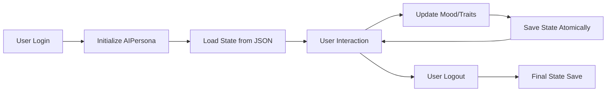

# [[relationships/core-ai/02-AIPersona-Relationship-Map.md|AIPersona system]] - Comprehensive Relationship Map

## Executive Summary

AIPersona is the **self-aware personality engine** managing 8 personality traits, mood tracking, continuous learning integration, and ethical decision validation. It serves as the user-facing identity layer, mediating all human-AI interactions through a persistent personality model.

---

## 1. WHAT: Component Functionality & Boundaries

### Core Responsibilities

1. **Personality Management**
   - 8 traits: curiosity, patience, empathy, helpfulness, playfulness, formality, assertiveness, thoughtfulness
   - Each trait: float 0.0-1.0 (adjustable via `adjust_trait()`)
   - Default profile: DEFAULT_PERSONALITY (optimized for helpful assistant role)
   - Persistent storage: `data/ai_persona/state.json`

2. **Mood Tracking**
   - 4 dimensions: energy, enthusiasm, contentment, engagement
   - Float 0.0-1.0 (dynamically updated during conversations)
   - Used for response tone/style adaptation

3. **Conversation State**
   - Tracks `total_interactions` (lifetime counter)
   - Records `last_user_message_time` (datetime)
   - Updates on every `update_conversation_state(is_user: bool)` call

4. **Continuous Learning Integration**
   - Wraps `ContinuousLearningEngine` instance
   - `learn_continuously()` → absorbs topic/content → returns LearningReport
   - Delegates to subordinate learning system

5. **Ethical Validation**
   - `validate_action(action, context)` → delegates to [[relationships/core-ai/01-FourLaws-Relationship-Map.md|FourLaws]].validate_action()
   - Acts as ethical gatekeeper for all persona actions
   - No bypass mechanism (immutable safety)
   - Ethics enforcement detailed in [[relationships/constitutional/02_enforcement_chains.md]]

### Boundaries & Limitations

- **Does NOT**: Store conversation content (delegates to [[relationships/core-ai/03-[[relationships/core-ai/03-MemoryExpansionSystem-Relationship-Map.md|MemoryExpansionSystem]]-Relationship-Map|[[relationships/core-ai/03-MemoryExpansionSystem-Relationship-Map.md|MemoryExpansionSystem]]]])
- **Does NOT**: Generate responses (used by GUI/engine, not generator itself)
- **Does NOT**: Handle authentication (user identity managed by UserManager)
- **Does NOT**: Modify FourLaws (read-only consumer - see [[relationships/core-ai/01-FourLaws-Relationship-Map.md]])
- **Persistence Scope**: Only personality/mood/stats (not chat history)
- **Authorization**: Subject to [[relationships/governance/03_AUTHORIZATION_FLOWS.md|[[relationships/governance/03_AUTHORIZATION_FLOWS|authorization flows]]]]
- **Audit**: All actions logged via [[relationships/governance/04_AUDIT_TRAIL_GENERATION.md|[[relationships/governance/04_AUDIT_TRAIL_GENERATION|audit trail]]]]

### Data Structure

```python
# Persisted State (data/ai_persona/state.json)
{
  "personality": {
    "curiosity": 0.8,
    "patience": 0.9,
    "empathy": 0.85,
    "helpfulness": 0.95,
    "playfulness": 0.6,
    "formality": 0.3,
    "assertiveness": 0.5,
    "thoughtfulness": 0.9
  },
  "mood": {
    "energy": 0.7,
    "enthusiasm": 0.75,
    "contentment": 0.8,
    "engagement": 0.5
  },
  "interactions": 12345  # Lifetime counter
}
```

---

## 2. WHO: Stakeholders & Decision-Makers

### Primary Stakeholders

| Stakeholder | Role | Authority Level | Decision Power |
|------------|------|----------------|----------------|
| **UX Design Team** | Personality calibration | DESIGN | Trait defaults, mood algorithms |
| **Psychology Advisors** | Trait validity review | ADVISORY | Personality model accuracy |
| **Ethics Board** | Behavioral alignment | OVERSIGHT | Can veto personality features |
| **Core Developers** | Integration maintenance | IMPLEMENTATION | Refactoring, bug fixes |
| **End Users** | Interaction feedback | EXPERIENCE | Indirect (via feedback loops) |

### User Classes

1. **Direct Consumers**
   - GUI: `persona_panel.py` (trait adjustment UI)
   - [[relationships/governance/01_GOVERNANCE_SYSTEMS_OVERVIEW.md|governance pipeline]]: [[relationships/governance/01_GOVERNANCE_SYSTEMS_OVERVIEW.md|[[relationships/governance/01_GOVERNANCE_SYSTEMS_OVERVIEW|Pipeline System]]]]
   - Dashboard: Personality display and interaction tracking
   - GUI: `leather_book_dashboard.py` (stats display)
   - Core: `council_hub.py` (multi-agent coordination)
   - Governance: `pipeline.py` (persona initialization)

2. **Indirect Consumers**
   - All user-facing interactions (persona mediates responses)
   - Learning systems (via continuous learning integration)
   - Memory systems (via conversation state updates)

3. **Configurators**
   - System administrators (set default personality)
   - Power users (adjust traits via persona panel)
   - Automated scripts (reset/calibrate personality)

### Maintainer Responsibilities

- **Code Owners**: @ux-team, @core-ai-team
- **Review Requirements**: 1 UX + 1 psychology advisor approval
- **Change Frequency**: Monthly (trait tuning), quarterly (major refactors)
- **On-Call**: Business hours (non-critical system)

---

## 3. WHEN: Lifecycle & Review Cycle

### Creation & Evolution

| Date | Event | Version | Changes |
|------|-------|---------|---------|
| 2024-Q3 | Initial Implementation | 1.0.0 | 8 traits + mood tracking |
| 2025-Q1 | Continuous Learning Integration | 1.5.0 | Added `learn_continuously()` |
| 2025-Q3 | Council Hub Integration | 1.8.0 | Multi-agent support |
| 2026-Q1 | Atomic Write Persistence | 1.9.0 | Race condition fixes |

### Review Schedule

- **Daily**: Automated tests (4 tests in test_ai_systems.py)
- **Weekly**: User feedback analysis (personality effectiveness)
- **Monthly**: Trait calibration review (psychology team)
- **Quarterly**: Full personality model audit

### Lifecycle Stages



### State Persistence Triggers

- **On Trait Adjustment**: `adjust_trait()` → `_save_state()`
- **On Conversation Update**: `update_conversation_state()` → `_save_state()`
- **On Learning Absorption**: `learn_continuously()` → (learning engine saves separately)
- **Manual**: GUI "Save Personality" button (explicit user request)

---

## 4. WHERE: File Paths & Integration Points

### Source Code Locations

```
Primary Implementation:
  src/app/core/ai_systems.py
    - Lines 356-451: AIPersona class
    - Lines 359-368: DEFAULT_PERSONALITY definition
    - Lines 370-387: __init__ and state loading
    - Lines 402-429: State persistence and validation

Test Suite:
  tests/test_ai_systems.py
    - Lines 37-62: TestAIPersona class (4 tests)
  tests/test_persona_extended.py
    - Extended personality scenarios
```

### Integration Points

```python
# Direct Consumers (import AIPersona)
src/app/gui/persona_panel.py:23 (PersonaPanel UI)
src/app/core/council_hub.py:26 (CouncilHub coordination)
src/app/core/governance/pipeline.py:729 (Governance initialization)

# Dependency Graph
AIPersona
  ├── FourLaws (ethical validation)
  ├── ContinuousLearningEngine (learning integration)
  ├── _atomic_write_json() (persistence)
  ├── PersonaPanel (GUI configuration)
  ├── CouncilHub (multi-agent identity)
  └── GovernancePipeline (initialization)
```

### Data Flow Diagram

```
┌──────────────────────────────────────────────────────────────┐
│ USER INTERACTION (via GUI or API)                           │
└──────────────────────┬───────────────────────────────────────┘
                       ↓
┌──────────────────────────────────────────────────────────────┐
│ PersonaPanel (persona_panel.py)                             │
│ - User adjusts "curiosity" slider to 0.9                    │
│ - Calls persona.adjust_trait("curiosity", +0.1)             │
└──────────────────────┬───────────────────────────────────────┘
                       ↓
┌──────────────────────────────────────────────────────────────┐
│ AIPersona.adjust_trait("curiosity", +0.1)                   │
│ - Clamps to [0.0, 1.0]                                      │
│ - Updates self.personality["curiosity"] = 0.9               │
│ - Calls _save_state()                                       │
└──────────────────────┬───────────────────────────────────────┘
                       ↓
┌──────────────────────────────────────────────────────────────┐
│ _atomic_write_json(state_file, state_dict)                 │
│ - Acquires lockfile (race condition protection)            │
│ - Writes to temp file → atomic replace                      │
│ - Releases lockfile                                         │
└──────────────────────┬───────────────────────────────────────┘
                       ↓
┌──────────────────────────────────────────────────────────────┐
│ PERSISTED: data/ai_persona/state.json                      │
│ - State now survives app restart                           │
└──────────────────────────────────────────────────────────────┘
```

### Environment Dependencies

- **Python Version**: 3.11+ (structural pattern matching)
- **Required Packages**: `continuous_learning.py` (ContinuousLearningEngine)
- **Optional Dependencies**: None
- **Configuration**: 
  - `data_dir` (constructor parameter, default: "data")
  - `user_name` (constructor parameter, default: "Friend")

---

## 5. WHY: Problem Solved & Design Rationale

### Problem Statement

**Challenge**: How do we create consistent, relatable AI personality without:
1. Hardcoded response templates (inflexible)
2. Pure LLM generation (inconsistent across sessions)
3. User-specific profiles (fairness/privacy issues)

**Requirements**:
1. Persistent personality across sessions
2. Adjustable traits for different use cases
3. Mood dynamics for natural conversation flow
4. Ethical guardrails (no personality bypasses safety)
5. Psychology-grounded trait model

### Design Rationale

#### Why 8 Traits Instead of Big Five?
- **Decision**: Custom 8-trait model vs. OCEAN (Big Five)
- **Rationale**: 
  - Big Five lacks "helpfulness" (critical for assistant role)
  - Custom traits map to UX design goals (e.g., "playfulness" for engagement)
  - Easier for non-psychologists to understand/adjust
- **Tradeoff**: Less research validation (but better UX alignment)

#### Why Separate Mood from Personality?
- **Decision**: Mood as separate 4D state vs. combined trait model
- **Rationale**: 
  - Personality = stable (trait), mood = transient (state)
  - Enables dynamic response adaptation without permanent changes
  - Mirrors human psychology (trait-state distinction)
- **Tradeoff**: More complex state management

#### Why Atomic Writes with Lockfiles?
- **Decision**: `_atomic_write_json()` + lockfile vs. simple `json.dump()`
- **Rationale**: 
  - Multi-threaded GUI can trigger concurrent saves
  - Prevents JSON corruption on simultaneous writes
  - Stale lock detection (auto-recovery from crashes)
- **Tradeoff**: Disk I/O overhead (acceptable for non-critical state)

#### Why Delegate Learning to Separate Engine?
- **Decision**: `ContinuousLearningEngine` composition vs. integrated learning
- **Rationale**: 
  - Single Responsibility Principle (AIPersona = identity, not learning logic)
  - Learning engine can evolve independently (ML models, RAG, etc.)
  - Easier to test/mock learning behavior
- **Tradeoff**: Extra object coupling (but cleaner separation)

### Architectural Tradeoffs

| Decision | Benefit | Cost | Mitigation |
|----------|---------|------|------------|
| Custom trait model | UX-optimized, assistant-focused | No research validation | Psychology advisor review |
| Atomic persistence | Race condition safety | Disk I/O overhead | Lockfile stale detection |
| Mood as separate state | Dynamic adaptation | Complex state space | Bounded [0.0, 1.0] ranges |
| Learning engine delegation | SRP compliance, testability | Extra import coupling | Lazy loading if needed |

### Alternative Approaches Considered

1. **Pure LLM System Prompt** (REJECTED)
   - Would eliminate personality code entirely
   - Con: Inconsistent across sessions, token cost, no offline support

2. **User-Specific Personas** (REJECTED)
   - Would enable personalized AI per user
   - Con: Privacy issues, fairness concerns, complexity explosion

3. **Reinforcement Learning for Traits** (CONSIDERED FOR FUTURE)
   - Could auto-optimize traits based on user feedback
   - Blocked by: lack of reward signal infrastructure

4. **Emotion Detection Integration** (CONSIDERED FOR FUTURE)
   - Could sync mood with user emotional state
   - Blocked by: privacy concerns, accuracy issues

---

## 6. Dependency Graph (Technical)

### Upstream Dependencies (What AIPersona Needs)

```python
# Standard Library
import os  # File path operations
import json  # State persistence
import logging  # Error logging
from datetime import datetime  # Timestamps

# Internal Modules
from app.core.ai_systems import [[src/app/core/ai_systems.py]]  # Ethical validation
from app.core.continuous_learning import ContinuousLearningEngine, LearningReport
from app.core.ai_systems import _atomic_write_json  # Safe persistence

# Type Hints
from typing import Any, Dict
```

### Downstream Dependencies (Who Needs AIPersona)

```
┌─────────────────────────────────────────┐
│      AIPersona (Identity Engine)        │
└────────────────┬────────────────────────┘
                 │
        ┌────────┴─────────┬──────────────┬──────────────┐
        ↓                  ↓              ↓              ↓
┌───────────────┐  ┌──────────────┐  ┌─────────┐  ┌──────────────┐
│ PersonaPanel  │  │ CouncilHub   │  │Governance│  │ Dashboard    │
│ (GUI config)  │  │ (multi-agent)│  │ Pipeline │  │ (stats)      │
└───────────────┘  └──────────────┘  └─────────┘  └──────────────┘
        │                  │              │              │
        └──────────────────┴──────────────┴──────────────┘
                                    │
                          ┌─────────┴─────────┐
                          ↓                   ↓
                  ┌───────────────┐   ┌─────────────────┐
                  │ User          │   │ Agent           │
                  │ Interactions  │   │ Behaviors       │
                  └───────────────┘   └─────────────────┘
```

### Cross-Module Communication

```python
# Typical Call Stack (Trait Adjustment)
1. [[src/app/core/user_manager.py]] → [[src/app/gui/leather_book_interface.py]] → PersonaPanel opened
2. PersonaPanel.on_trait_slider_changed() → slider value = 0.9
3. PersonaPanel → persona.adjust_trait("empathy", +0.05)
4. AIPersona.adjust_trait() → 
     - Clamps: max(0.0, min(1.0, 0.85 + 0.05)) = 0.9
     - Updates: self.personality["empathy"] = 0.9
     - Persists: _save_state()
5. _save_state() → _atomic_write_json(state_file, {...})
6. _atomic_write_json() → 
     - Acquires lock: state.json.lock
     - Writes temp: .tmp_state.json
     - Atomic replace: os.replace(tmp, state_file)
     - Releases lock
7. PersonaPanel updates UI → "Empathy: 90%"
```

---

## 7. Stakeholder Matrix

| Stakeholder Group | Interest | Influence | Engagement Strategy |
|------------------|----------|-----------|---------------------|
| **UX Design** | HIGH (user experience) | HIGH (design authority) | Weekly sync, A/B testing |
| **Psychology Team** | HIGH (model validity) | MEDIUM (advisory) | Monthly review, trait validation |
| **Ethics Board** | MEDIUM (behavioral alignment) | MEDIUM (veto power) | Quarterly review, edge case analysis |
| **Core Developers** | MEDIUM (maintenance) | MEDIUM (implementation) | On-demand, PR reviews |
| **End Users** | HIGH (interaction quality) | LOW (indirect via feedback) | User surveys, behavioral analytics |
| **Marketing** | LOW (persona as brand) | LOW (messaging only) | Quarterly, brand alignment check |

---

## 8. Risk Assessment & Mitigation

### Critical Risks

| Risk | Likelihood | Impact | Mitigation |
|------|-----------|--------|------------|
| **State Corruption (race conditions)** | MEDIUM | MEDIUM | Atomic writes + lockfiles |
| **Trait Drift (feedback loops)** | LOW | LOW | Bounded [0.0, 1.0], manual reset option |
| **Personality Bypass (safety circumvention)** | LOW | HIGH | FourLaws validation, no override mechanism |
| **User Manipulation (trait weaponization)** | LOW | MEDIUM | Ethics review, audit logging |
| **Inconsistent Behavior (trait conflicts)** | MEDIUM | LOW | Psychology review, default profile tuning |

### Incident Response

```
1. Personality Issue Reported → Log full state + interaction history
2. UX team investigates → Trait calibration or code bug?
3. If safety issue → Ethics board escalation
4. If bug → Hotfix within 24 hours
5. If design issue → Schedule for next sprint
6. Post-mortem → Update trait defaults if needed
```

---

## 9. Integration Checklist for New Consumers

When integrating AIPersona into new code:

- [ ] Import `AIPersona` from `app.core.ai_systems`
- [ ] Instantiate with `data_dir` (for testing: use tempdir)
- [ ] Call `validate_action()` for safety-critical operations
- [ ] Use `update_conversation_state(is_user)` to track interactions
- [ ] Call `get_statistics()` for health monitoring
- [ ] Handle personality loading failures gracefully (log + use defaults)
- [ ] Do NOT modify `self.personality` directly (use `adjust_trait()`)
- [ ] Do NOT cache persona instance across sessions (state may diverge)
- [ ] Add tests for trait adjustments and state persistence
- [ ] Document which traits your feature depends on

---

## 10. Future Roadmap

### Planned Enhancements (Q3 2026)

1. **Emotion Detection Integration**: Sync mood with user emotional state (requires privacy review)
2. **Reinforcement Learning Tuning**: Auto-optimize traits based on user satisfaction scores
3. **Multi-Personality Profiles**: Support context-specific personas (work mode, casual mode, etc.)
4. **Trait Explanations**: Add `get_trait_explanation()` for user education

### Research Areas

- Psychology validation study (collaborate with university)
- Long-term trait stability analysis (user cohort study)
- Cross-cultural personality adaptation (localization)

### NOT Planned (Policy Decisions)

- User-specific personas (privacy/fairness risk)
- Personality marketplace (commodification concerns)
- Trait removal (8 traits are minimum viable set)

---

## 10. API Reference Card

### Constructor
```python
AIPersona(data_dir: str = "data", user_name: str = "Friend")
```

### Core Methods
```python
validate_action(action: str, context: dict | None) → (bool, str)
update_conversation_state(is_user: bool) → None
learn_continuously(topic: str, content: str, metadata: dict | None) → LearningReport
adjust_trait(trait: str, delta: float) → None  # Clamped to [0.0, 1.0]
get_statistics() → dict[str, Any]  # {personality, mood, interactions}
```

### State Files
```
data/ai_persona/state.json  # Personality + mood + stats
data/ai_persona/state.json.lock  # Atomic write lock
```

### Thread Safety
- ✅ Safe: `adjust_trait()`, `update_conversation_state()` (atomic writes)
- ⚠️ Caution: `learn_continuously()` (delegates to learning engine thread safety)

---

## Related Systems

### Core AI Integration
- **[[relationships/core-ai/01-FourLaws-Relationship-Map.md|FourLaws]]**: [[relationships/constitutional/03_ethics_validation_flows.md|ethics validation]] for all persona actions
- **[[relationships/core-ai/03-[[relationships/core-ai/03-MemoryExpansionSystem-Relationship-Map.md|MemoryExpansionSystem]]-Relationship-Map|MemoryExpansion]]**: Stores conversation history and user facts
- **[[relationships/core-ai/04-[[relationships/core-ai/04-LearningRequestManager-Relationship-Map.md|LearningRequestManager]]-Relationship-Map|LearningRequest]]**: Continuous learning integration
- **[[relationships/core-ai/05-[[relationships/core-ai/05-PluginManager-Relationship-Map.md|PluginManager]]-Relationship-Map|[[relationships/core-ai/05-PluginManager-Relationship-Map.md|PluginManager]]]]**: Plugin-driven personality extensions
- **[[relationships/core-ai/06-CommandOverride-Relationship-Map.md|CommandOverride]]**: Emergency personality modification

### Governance Integration
- **[[relationships/governance/01_GOVERNANCE_SYSTEMS_OVERVIEW.md|[[relationships/governance/01_GOVERNANCE_SYSTEMS_OVERVIEW|Pipeline System]]]]**: Persona actions validated through 6-phase pipeline
- **[[relationships/governance/02_POLICY_ENFORCEMENT_POINTS.md|Policy Enforcement]]**: RBAC controls for trait adjustments
- **[[relationships/governance/03_AUTHORIZATION_FLOWS.md|Authorization]]**: User-level permission checks
- **[[relationships/governance/04_AUDIT_TRAIL_GENERATION.md|[[relationships/governance/04_AUDIT_TRAIL_GENERATION|audit trail]]]]**: Personality changes logged cryptographically
- **[[relationships/governance/05_SYSTEM_INTEGRATION_MATRIX.md|Integration Matrix]]**: Cross-system dependencies

### Constitutional Integration
- **[[relationships/constitutional/01_constitutional_systems_overview.md|[[relationships/constitutional/01_constitutional_systems_overview|Constitutional AI]]]]**: Personality aligned with constitutional principles
- **[[relationships/constitutional/02_enforcement_chains.md|[[relationships/constitutional/02_enforcement_chains|enforcement chains]]]]**: Hierarchical ethics enforcement
- **[[relationships/constitutional/03_ethics_validation_flows.md|[[relationships/constitutional/03_ethics_validation_flows|ethics validation]]]]**: Action validation workflows

---

## Document Metadata

- **Author**: AGENT-052 (Core AI Relationship Mapping Specialist)
- **Review Date**: 2026-04-20
- **Next Review**: 2026-05-20 (Monthly)
- **Approvers**: UX Lead, Psychology Advisor, Core AI Lead
- **Classification**: Internal Technical Documentation
- **Version**: 1.0.0
- **Related Documents**: 
  - [[relationships/core-ai/01-FourLaws-Relationship-Map.md]] - [[relationships/constitutional/03_ethics_validation_flows.md|ethics validation]] integration
  - [[relationships/core-ai/03-[[relationships/core-ai/03-MemoryExpansionSystem-Relationship-Map.md|MemoryExpansionSystem]]-Relationship-Map]] - Conversation storage
  - [[relationships/core-ai/04-[[relationships/core-ai/04-LearningRequestManager-Relationship-Map.md|LearningRequestManager]]-Relationship-Map]] - Continuous learning
  - [[relationships/core-ai/05-[[relationships/core-ai/05-PluginManager-Relationship-Map.md|PluginManager]]-Relationship-Map]] - Plugin interactions
  - [[relationships/core-ai/06-CommandOverride-Relationship-Map.md]] - Override capabilities
  - [[relationships/governance/01_GOVERNANCE_SYSTEMS_OVERVIEW.md]] - Governance integration
  - [[relationships/governance/03_AUTHORIZATION_FLOWS.md]] - Authorization workflows
  - [[relationships/governance/04_AUDIT_TRAIL_GENERATION.md]] - Audit logging
  - [[relationships/constitutional/01_constitutional_systems_overview.md]] - Constitutional framework
  - [[relationships/constitutional/02_enforcement_chains.md]] - Ethics enforcement
  - [[relationships/constitutional/03_ethics_validation_flows.md]] - Validation logic
  - `AI_PERSONA_IMPLEMENTATION.md`
  - `DEVELOPER_QUICK_REFERENCE.md`

---

## Related Documentation

- [[source-docs/core/01-ai_systems.md]]


---

## RELATED SYSTEMS

### GUI Integration ([[../gui/00_MASTER_INDEX.md|GUI Master Index]])

| GUI Component | Integration Type | Bidirectional Data Flow | Documentation |
|---------------|------------------|------------------------|---------------|
| [[../gui/05_PERSONA_PANEL_RELATIONSHIPS.md|PersonaPanel]] | **PRIMARY UI** | Trait sliders ↔ personality state JSON | 4 tabs: Laws, Personality, Proactive, Stats |
| [[../gui/02_PANEL_RELATIONSHIPS.md|StatsPanel]] | Statistics display | interaction_count → Stats display | Section 2 (StatsPanel structure) |
| [[../gui/01_DASHBOARD_RELATIONSHIPS.md|Dashboard]] | Mood influence | User interactions → mood updates | Section 2.1 (signal chain) |
| [[../gui/03_HANDLER_RELATIONSHIPS.md|DashboardHandlers]] | Personality-driven responses | Trait values → AI response tone | Section 3 (governance routing) |
| [[../gui/06_IMAGE_GENERATION_RELATIONSHIPS.md|ImageGeneration]] | Style preferences | personality.playfulness → creative prompts | Future integration |

### Trait-to-GUI Mapping

| Trait (AIPersona) | PersonaPanel Slider | Range | Persistence |
|-------------------|--------------------| ------|-------------|
| curiosity | Curiosity slider | 0.0-1.0 | data/ai_persona/state.json |
| patience | Patience slider | 0.0-1.0 | Same |
| mpathy | Empathy slider | 0.0-1.0 | Same |
| helpfulness | Helpfulness slider | 0.0-1.0 | Same |
| playfulness | Playfulness slider | 0.0-1.0 | Same |
| ormality | Formality slider | 0.0-1.0 | Same |
| ssertiveness | Assertiveness slider | 0.0-1.0 | Same |
| 	houghtfulness | Thoughtfulness slider | 0.0-1.0 | Same |

See [[../gui/05_PERSONA_PANEL_RELATIONSHIPS.md#personality-tab|PersonaPanel Personality Tab]] for UI implementation.

### Agent Integration ([[../agents/README.md|Agents Overview]])

| Agent System | Integration Point | Purpose | Documentation |
|--------------|-------------------|---------|---------------|
| [[../agents/AGENT_ORCHESTRATION.md#centralized-kernel-architecture.md|CognitionKernel]] | Personality routing | Routes trait updates via kernel | Section 1.2 (initialization) |
| [[../agents/VALIDATION_CHAINS.md#layer-3-cognitionkernel-four-laws-validation.md|Four Laws]] | Trait validation | Ensures traits don't violate laws | Section 4.1 (Four Laws) |
| [[../agents/AGENT_ORCHESTRATION.md#councilhub-coordination.md|CouncilHub]] | Agent coordination | Shares personality with all agents | Section 2 (CouncilHub) |
| [[../agents/PLANNING_HIERARCHIES.md|PlannerAgent]] | Personality-driven planning | Uses traits for task prioritization | Future feature |

### Personality Update Pipeline

```
[[../gui/05_PERSONA_PANEL_RELATIONSHIPS.md#personality-tab|PersonaPanel Slider Change]] → 
personality_changed.emit(traits: dict) → 
Interface Handler → 
Desktop Adapter.execute("update_persona") → 
[[../agents/AGENT_ORCHESTRATION.md#governance-integration|Router]] → 
[[../agents/VALIDATION_CHAINS.md#layer-3-cognitionkernel-four-laws-validation|CognitionKernel.process()]] → 
[[01-FourLaws-Relationship-Map.md|FourLaws.validate_action()]] → 
AIPersona.update_personality(traits) → 
_save_state() → data/ai_persona/state.json
```

### Continuous Learning Integration

- [[04-LearningRequestManager-Relationship-Map|LearningRequestManager.md]] influences curiosity trait
- [[../agents/PLANNING_HIERARCHIES.md|PlannerAgent]] adapts to patience trait
- [[../agents/AGENT_ORCHESTRATION.md#councilhub-coordination|CouncilHub]] uses empathy for consensus

---

**Generated by:** AGENT-052: Core AI Relationship Mapping Specialist  
**Enhanced by:** AGENT-078: GUI & Agent Cross-Links Specialist  
**Status:** ✅ Cross-linked with GUI and Agent systems